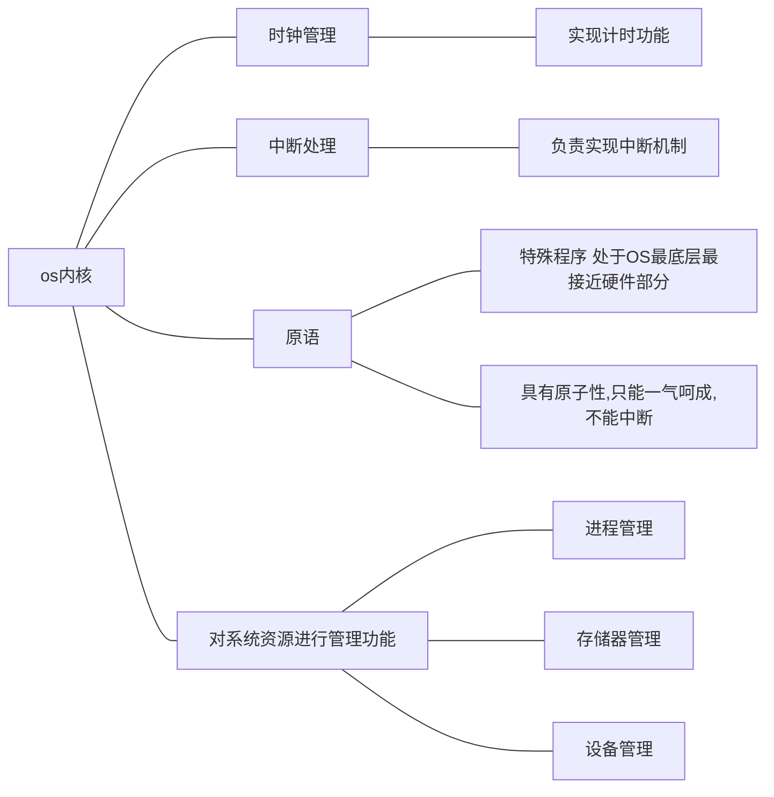

# 简介

脱机命令接口 

等于批处理命令接口

程序接口

可以在程序中进行系统调用来使用程序接口

普通用户不能直接使用，只能通过代码间接使用

并发，共享，虚拟，异步

并发：两个或多个事件在同一时间间隔内发生，宏观上是同时发生的，微观上是交替发生的

并行：指两个或者多个事件在同一时刻同时发生

共享：资源共享 系统中的资源可供内存 中多个并发执行进程共同使用

虚拟把一个物理上的实体变成若干个逻辑上对应物，物理实体是实际存在的逻辑上是用户感受的

虚拟技术包含空间复用技术（虚拟存储器技术）时复用技术（虚拟处理器）

异步 在多道程序环境下，允许多个进程并发执行，但由于资源有限，进程执行不是一贯到底的，进程的异步性

批处理阶段

单道批处理系统

主要优点：缓解了一定程度的人机速度矛盾，资源利用率有所提升。
主要缺点：内存中仅能有一道程序运行，只有该程序运行结束之后才
能调入下一道程序。CPU有大量的时间是在空闲等待I/O完成。资源利用率依然很低。

多道批处理系统

主要优点：多道程序并发执行，共享计算机资源。资源利用率大幅提升，CPU和其他资源更能保持“忙碌”状态，系统吞吐量增大。
主要缺点：用户响应时间长，没有人机交互功能（用户提交自己的作业之后就只能等待计算机处理完成，中间不能控制自己的作业执行。eg：无法调试程序/无法在程序运行过程中输入一些参数）

分时操作系统：计算机以时间片为单位轮流为各个用户/作业服务，各个用户可通过终端与计算机进行交互。
主要优点：用户请求可以被即时响应，解决了人机交互问题。允许多个用户同时使用一台计算机，并且用户对计算机的操作相互独立，感受不到别人的存在。

主要缺点：不能优先处理一些紧急任务，操作系统对各个用户/作业都是完全公平的，循环地为每个用户/作业服务一个时间片，不区分任务的紧急性。

实时操作系统：
主要优点：能够优先响应一些紧急任务，某些紧急任务不需时间片排队。在实时os控制下，计算机系统接收到外部信号后及时进行处理，并且要在严格的时限内处理完事件。实时操作系统的主要特点是及时性和可靠性。

网络操作系统：是伴随着计算机网络的发展而诞生的，能把网络中各个计算机有机地结合起来，实现数据传送等功能，实现网络中各种资源的共享（如文件共享）和各台计算机之间的通信。（如：Windows NT就是一种典型的网络操作系统，网站服务器就可以使用)

分布式操作系统：主要特点是分布性和并行性。系统中的各台计算机地位相同，任何工作都可以分布在这些计算机上，由它们并行、协同完成这个任务。
个人计算机操作系统：如Windows XP、MacOS,方便个人使用。

内核程序

接近硬件的地方

应用程序

内核态（核心态，管态）  运行内核程序，可以执行特权指令

用户态（目态） 运行应用程序，只能执行非特权指令

内核态->用态，执行一条特权指令，修改psw的标志位为用户态，os让出cpu使用权

用户态->内核态，由中断引发，硬件自动完成变态过程，

需要os介入地方会触发中断信号

中断类型 

内中断 与当前执行的指令有关中断信号来源于CPU内部

陷阱，陷入（trap）由陷入指令引发，是应用程序故意引发的

故障（fault）由错误条件引起的，可能被内核程序修复，内核程序修复故障后会吧cpu使用权还给应用程序 如缺页故障

终止（abort） 右致命错误引起，内核无法修复错误

外中断 与当前执行指令无关中断信号来源CPU外部

中断机制的基本实现原理

检查中断信号 内中断 cpu在执行指令时会检查是否有异常发生   外中断 每个指令周期末尾 CPU都会检查是否有外中断信号需要处理

找到相应的中断处理程序 通过中断向量表实现

## 系统调用

os向上提供的接口 

应用程序通过系统调用请求操作系统的服务。而系统中的各种共享资源都由操作系统内核统一掌管，因此凡是与共享资源有关的操作（如存储分配、/O操作、文件管理等），都必须通过系统调用的方式向操作系统内核提出服务请求，由操作系统内核代为完成。这样可以保证系统的稳定性和安全性，防止用户进行非法操作。

系统调用：设备管理，文件管理，进程管理，进程通信，内存管理

陷入指令（trap指令，访管指令）

传递系统调用参数->执行陷入指令（用户态）->执行相应的内请求核程序处理系统调用（核心态）->返回应用程序

注意：1.陷入指令是在用户态执行的，执行陷人指令之后立即引发一个内中断，使CPU进入核心态
2.发出系统调用请求是在用户态，而对系统调用的相应处理在核心态下进行

## 内核

os内核 内核程序

大内核 将os主要功能模块作为系统内核，运行在核心态 高性能  

微内核 只保留最基本的功能  内核功能少，结构清晰，方便维护

频繁在核心态和用户态切换，性能低

os引导

活动分区

引导记录PBR（负责找到启动管理器）

操作系统引导：
①CPU从一个特定主存地址开始，取指令，执行OM中的引导程序（先进行硬件自检，再开机）
②将磁盘的第一块一一主引导记录读入内存，执行磁盘引导程序，扫描分区表
③从活动分区（又称主分区，即安装了操作系统的分区）读入分区引导记录，执行其中的程序
④从根目录下找到完整的操作系统初始化程序（即启动管理器）并执行，完成“开机”的一系列动作

# 进程的概念，组成，特征

当进程被创建的时，os会为进程分配一个唯一，不重复的身份证号 PID

可以用于实现os对资源的管理

可以用于实现os系统对进程的控制，调度

保存在PCB 进程控制块中

PCB进程存在的唯一标志，但进程被创建时，os为其创建PCB，结束回收

pcb包含进程描述信息（进程标识符PID，用户标识符UID），进程控制和管理信息（CPU，磁盘，网络流量使用情况统计，当前进程状态：就绪，阻塞），资源分配清单（正在使用哪些文件，使用的内存区域，io设备），处理机相关信息（PSW，PC等各个寄存器值用于实现进程切换）

进程的组成，PCB，程序段（程序代码（指令序列）），数据段（运行过程中产生的各种数据）

进程是动态的，进程实体（进程映像）是静态的

进程的特征：动态性（进程是程序一次执行过程，动态地产生，变化和消亡），并发性（内存中有多个进程实体，各线程可并发执行），独立性（进程是独立运行，独立获取资源，独立接受调度的基本单位），异步性（各进程按各自独立的，不可预知的速度向前推进，os要提供进程同步机制来解决异步问题），结构性（每个进程都会配置一个PCB，结构上程序段，数据段，PCB组成）

## 进程的状态

三种基本状态  运行态  就绪态  阻塞态（等待态） 

创建态（新建态）  进程正在被创建，os正在为进程分配资源，初始化PCB

终止态（结束态） 进程

运行队列                        多核CPU可有多个进程同时处于运行态

就绪队列

等待事件A的等待队列

等待事件B的等待队列

进程的组织方式{链接方式[按照进程状态将PCB分为多个队列，os持有指向各个队列的指针]，索引方式[进程状态不同，建立几张索引表，os持有指向各个索引表的指针]}

就绪态到运行态  进程被调度            运行态到就绪态     时间片到，或cpu被其它高优先级的进程抢占

运行态到阻塞态		等待系统资源分配，或者等待事件发生（主动行为）

阻塞态到就绪态		资源分配到位，等待事件发生（被动行为）

创建态到就绪态		系统完成创建

运行态到终止态		进程运行结束，或运行过程中遇到不可修复的错误

1.更新PCB中的信息
a.所有的进程控制原语一定都会修改进程状态标志
b.剥夺当前运行进程的CPU使用权必然需要保存其运行环境
c.某进程开始运行前必然要恢复期运行环境
2.将PCB插入合适的队列
3.分配/回收资源

## 进程通信

各进程拥有的内存地址空间相互独立

一个进程不能直接访问另一个进程的地址空间

共享内存

基于数据结构的共享：比如共享空间里只能放一个长度为10的数组。这种共享方式速度慢、限制多，是一种低级通信方式

基于存储区的共享：操作系统在内存中划出一块共享存储区，数据的形式、存放位置都由通信进程控制，而不是操作系统。这种共享方式速度很快，是一种高级通信方式。

消息传递

进程间的数据交换以格式化的消息为单位，进程通过os提供的发送消息/接受消息两个原语进行数据交换

直接通信方式  消息发送要指明接受进程的ID

消息头包括：发送进程ID，接受进程ID，消息长度等格式化信息

间接通信方式		通过“信箱”间接地通信

管道通信

管道特殊的共享文件，在内存中开辟一个大小固定的内存缓存区

1.管道只能采用半双工通信，某一时间段内只能实现单向的传输。如果要实现双向同时通信，则需要设置两个管道。
2.各进程要互斥地访问管道（由操作系统实现）
3.当管道写满时，写进程将阻塞，直到读进程将管道中的数据取走，即可唤醒写进程。
4.当管道读空时，读进程将阻塞，直到写进程往管道中写入数据，即可唤醒读进程。
5.管道中的数据一旦被读出，就彻底消失。因此，当多个进程读同一个管道时，可能会错乱。对此，通常有两种解决方案：①一个管道允许多个写进程，一个读进程(2014年408真题高教社官方答案)；②允许有多个写进程，多个读进程，但系统会让各个读进程轮流从管道中读数据(Liux的方案)。

写进程往管道写数据，即便管道没被写满，只要管道没空，读进程就可以从管道读数据
读进程从管道读数据，即便管道没被读空，只要管道没满，写进程就可以往管道写数据

## 多线程

线程的实现方式

1.用户级线程由应用程序通过线程库实现，所有的线程管理工作都由应用程序负责（包括线程切换)
2.用户级线程中，线程切换可以在用户态下即可完成，无需操作系统干预。
3.在用户看来，是有多个线程。但是在操作系统内核看来，并意识不到线程的存在。“用户级线程”就是“从用户视角看能看到的线程”
4.优缺点
优点：用户级线程的切换在用户空间即可完成，不需要切换到核心态，线程管理的系统开销小，效率高
缺点：当一个用户级线程被阻塞后，整个进程都会被阻塞，并发度不高。多个线程不可在多核处理机上并行运行。

1.内核级线程的管理工作由操作系统内核完成。
2.线程调度、切换等工作都由内核负责，因此内核级线程的切换必然需要在核心态下才
能完成。
3.操作系统会为每个内核级线程建立相应的TCB(Thread Control Block,线程控制块)，通过TCB对线程进行管理。“内核级线程”就是“从操作系统内核视角看能看到的线程”
4.优缺点
优点：当一个线程被阻塞后，别的线程还可以继续执行，并发能力强。多线程可在多核处理机上并行执行。
缺点：一个用户进程会占用多个内核级线程，线程切换由操作系统内核完成，需要切换到核心态，因此线程管理的成本高，开销大。

多线程模型

一对一模型：个用户级线程映射到一个内核级线程。每个用户进程有与用户级线程同数量的内核级线程。
优点：当一个线程被阻塞后，别的线程还可以继续执行，并发能力强。多线程可在多核处理机上并行执行。
缺点：一个用户进程会占用多个内核级线程，线程切换由操作系统内核完成，需要切换到核心态，因此线程管理的成本高，开销大。

多对一模型：多个用户级线程映射到一个内核级线程。且一个进程只被分配一个内核级线程。
优点：用户级线程的切换在用户空间即可完成，不需要切换到核心态，线程管理的系统开销小，效率高
缺点：当一个用户级线程被阻塞后，整个进程都会被阻塞，并发度不高。多个线程不可在多核处理机上并行运行
重点重点重点：
操作系统只“看得见”内核级线程，因此只有内核级线程才是处理机分配的单位。

多对多模型：n用户及线程映射到m个内核级线程(n>=m)。每个用户进程对应m个内核级线程。克服了多对一模型并发度不高的缺点（一个阻塞全体阻塞)，又克服了一对一模型中一个用户进程占用太多内核级线程，开销太大的缺点。
可以这么理解：
用户级线程是“代码逻辑”的载体
内核级线程是“运行机会”的载体
内核级线程才是处理机分配的单位。例如：多核CPU环境下，左边这个进程最多能被分配两个核。一段“代码逻辑”只有获得了“运行机会”才能被执行内核级线程中可以运行任意一个有映射关系的用户级线程代码，只有两个内核级线程中正在运行的代码逻辑都阻塞时，这个进程才会阻塞

TID（线程控制块）包括：线程标识符（TID与PID类似），程序计数器PC（线程目前执行到哪里），其他寄存器（线程运行的中间结果），堆栈指针（堆栈保存函数调用信息，局部变量等），线程运行状态（运行、就绪、阻塞），优先级(线程调度，资源分配的参考)

线程切换时要保存/恢复  线程标识符（TID与PID类似），程序计数器PC（线程目前执行到哪里），其他寄存器（线程运行的中间结果），堆栈指针（堆栈保存函数调用信息，局部变量等），

调度算法

先来先服务FCFS

短作业优先SJF

高响应比优先HRRN

响应比 = （等待时间+要求服务时间）/要求服务时间

周转时间 = 完成时间-到达时间

带权周转时间 = 周转时间/运行时间

等待时间 = 周转时间-运行时间

**高级调度（作业调度）** 按一定的原则从外存的作业后备队列中挑选一个作业调入内存，并创建进程

每个作业只调入一次，调出一次，作业调度时会建立PCB ，调出时才撤销PCB

**低级调度（进程调度/处理机调度）**一一按照某种策略从就绪队列中选取一个进程，将处理机分配给它。进程调度是操作系统中最基本的一种调度，在一般的操作系统中都必须配置进程调度。
进程调度的频率很高，一般几十毫秒一次。

**中级调度（内存调度）**一一按照某种策略决定将哪个处于挂起状态的进程重新调入内存。一个进程可能会被多次调出、调入内存，因此中级调度发生的频率要比高级调度更高。

进程挂起态  七状态模型

## 多线程机制

进程互斥的软件实现方法

单标志法

两个进程在访问完临界区后会把使用临界区的权限转交给另外一个进程

每个进程进入临界区的权限只能被另外一个进程赋予

双标志先检查法

设置一个布尔型数组flag[]，数组中各个元素用来标记各进程想进入临界区的意愿

违反了忙则等待的原则

双标志后检查法

先上锁再检查

解决忙等问题  违背了空闲让进和有限等待

长期无妨访问临界资源而产生饥饿现象

Peterson算法

进入区主动争取 主动谦让 检查对方是否想进，己方是否谦让

主要问题：不遵循让权等待原则 会发生忙等

硬件实现

中断屏蔽方法

简单高效，不适合多处理机，只能适用于os内核进程，不适合用户进程

（因为开关中断指令只能运行在内核态）

TS指令 TSL指令

用硬件实现的，执行的过程不允许被中断，只能一气呵成

互斥锁

不适合单处理机

信号量机制 整型信号量  记录型信号量

信号量机制实现前驱关系

要为每一个前驱关系设置一个同步信号量，在前操作之后对相应的同步信号量执行v操作，在后操作前对相应的同步信号量执行P操作

生产者和消费者问题

多生产者多消费者问题

总结：在生产者-消费者问题中，如果缓冲区大小为1，那么有可能不需要设置互斥信号量就可以实现
互斥访问缓冲区的功能。当然，这不是绝对的，要具体问题具体分析。
建议：在考试中如果来不及仔细分析，可以加上互斥信号量，保证各进程一定会互斥地访问缓冲区。
但需要注意的是，实现互斥的P操作一定要在实现同步的P操作之后，否则可能引起“死锁”。
PV操作题目的解题思路：
1.关系分析。找出题目中描述的各个进程，分析它们之间的同步、互斥关系。
2.整理思路。根据各进程的操作流程确定P、V操作的大致顺序。
3.设置信号量。设置需要的信号量，并根据题目条件确定信号量初值。（互斥信号量初值一般为1,同步信号量的初始值要看对应资源的初始值是多少)

卷烟问题

读者写者问题

哲学家进餐问题

管程是一种特殊的软件模块，在这些部分组成

1，局部与管程的共享数据结构说明

2，对该数据结构进行操作的一组过程

3，对局部于管程的共享数据设置初始值的语句

4，管程只有一个名字

管程的基本特征：
1.局部于管程的数据只能被局部于管程的过程所访问：
2.一个进程只有通过调用管程内的过程才能进入管程访问共享数据：
3.每次仅允许一个进程在管程内执行某个内部过程。

1.需要在管程中定义共享数据（如生产者消费者问题的缓冲区）
2.需要在管程中定义用于访问这些共享数据的“入口”一一其实就是一些函数（如生产者消费者问题中，可以定义一个函数用于将产品放入缓冲区，再定义一个函数用于从缓冲区取出产品)
3.只有通过这些特定的“入口”才能访问共享数据
4.管程中有很多“入口”，但是每次只能开放其中一个“入口”，并且只能让一个进程或线程进入（如生产者消费者问题中，各进程需要互斥地访问共享缓冲区。管程的这种特性即可保证一个时间段内最多只会有一个进程在访问缓冲区。注意：这种互斥特性是由编泽器负查实现的，
程序员不用关心)
5.可在管程中设置条件变量及等待/唤醒操作以解决同步问题。可以让一个进程或线程在条件变量上等待（此时，该进程应先释放管程的使用权，也就是让出“入口”）；可以通过唤醒操作将等待在条件变量上的进程或线程唤醒。

产生死锁四个条件：互斥条件，不可剥夺条件，请求和保持条件，循环等待条件

发生死锁：对资源的竞争，进程推进顺序非法，信号量的使用不当

处理策略：

预防死锁，避免死锁，死锁的检测和解除

SPOOLing技术 独占设备改为共享设备  

破坏不剥夺条件

破坏不剥夺条件：
方案一：当某个进程请求新的资源得不到满足时，它必须立即释放保持的所有资源，待以后需要时
再重新申请。也就是说，即使某些资源尚未使用完，也需要主动释放，从而破坏了不可剥夺条件。
方案二：当某个进程需要的资源被其他进程所占有的时候，可以由操作系统协助，将想要的资源强
行剥夺。这种方式一般需要考虑各进程的优先级（比如：剥夺调度方式，就是将处理机资源强行剥
夺给优先级更高的进程使用)
该策略的缺点：
1.实现起来比较复杂。
2.释放己获得的资源可能造成前一阶段工作的失效。因此这种方法一般只适用于易保存和恢复状态
的资源，如CPU。
3.反复地申请和释放资源会增加系统开销，降低系统吞吐量。
4.若采用方案一，意味着只要暂时得不到某个资源，之前获得的那些资源就都需要放弃，以后再重
新申请。如果一直发生这样的情况，就会导致进程饥饿。

破坏请求和保持条件

请求和保持条件：进程已经保持了至少一个资源，但又提出了新的资源请求，而该资源又被其他进程占有，此时请求进程被阻塞，但又对自己已有的资源保持不放。可以采用静态分配方法，即进程在运行前一次申请完它所需要的全部资源，在它的资源未满足前，不让它投入运行。一旦投入运行后，这些资源就一直归它所有，该进程就不会再请求别的任何资源
了。

该策略实现起来简单，但也有明显的缺点：
有些资源可能只需要用很短的时间，因此如果进程的整个运行期间都一直保持着所有资源，就会造
成严重的资源浪费，资源利用率极低。另外，该策略也有可能导致某些进程饥饿。

破坏循环等待条件

循环等待条件：存在一种进程资源的循环等待链，链中的每一个进程已获得的资源同时被下一个进
程所请求。
可采用顺序资源分配法。首先给系统中的资源编号，规定每个进程必须按编号递增的顺序请求源，同类资源（即编号相同的资源）一次申请完。
原理分析：一个进程只有己占有小编号的资源时，才有资格申请更大编号的资源。按此规则，己持
有大编号资源的进程不可能逆向地回来申请小编号的资源，从而就不会产生循环等待的现象。

动态策略  死锁避免

安全序列，银行家算法

死锁的检测和解除

如果系统中既不采取预防死锁的措施，也不采取避免死锁的措施，系统就很可能发生死锁。在这种情况下，系统应当提供两个算法：
①死锁检测算法：用于检测系统状态，以确定系统中是否发生了死锁。
②死锁解除算法：当认定系统中已经发生了死锁，利用该算法可将系统从死锁状态中解脱出来。

解除死锁的主要方法

资源剥夺法，撤销进程法，进程回退法

进程的调度时机

需要进程调度切换情况{当前运行的进程主动放弃处理机（进程正常终止，运行过程中发生异常而终止，进程主动请求阻塞（如等待io）），当前运行的进程被动放弃处理机（分给进程的时间片用完了，有更紧急的事需要处理（如io中断）有更高优先级的进程进入就绪队列）}

不能进行进程调度与切换情况{在处理中断的过程中，中断处理过程复制，与硬件密切相关，很难在中断处理过程中进行进程切换，进程在操作系统内核程序临界区中，在原子操作过程中（原语）}

“狭义的进程调度”与“进程切换”的区别：
狭义的进程调度指的是从就绪队列中选中一个要运行的进程。（这个进程可以是刚刚被暂停执行进程，也可能是另一个进程，后一种情况就需要进程切换)进程切换是指一个进程让出处理机，由另一个进程占用处理机的过程。广义的进程调度包含了选择一个进程和进程切换两个步骤。
进程切换的过程主要完成了：
1.对原来运行进程各种数据的保存
2.对新的进程各种数据的恢复
(如：程序计数器、程序状态字、各种数据寄存器等处理机现场信总，这些信总一般保存在进程控制块)
注意：进程切换是有代价的，因此如果过于频繁的进行进程调度、切换，必然会使整个系统的效率降低，使系统大部分时间都花在了进程切换上，而真正用于执行进程的时间减少。

调度算法的评价指标

CPU利用率，系统吞吐量，周转时间（平均周转时间，带权周转时间，平均带权周转时间）

等待时间，响应时间

时间片轮转调度算法

公平地、轮流地为各个进程服务，让每个进程在一定时间间隔内都可以得到响应

按照各进程到达就绪队列的顺序，轮流让各个进程执行一个时间片（如100ms)。若进程未在一个时间片内执行完，则剥夺处理机，将进程重新放到就绪队列队尾重新排队。用于进程调度（贝有作业放入内存建立了相应的进程后，才能被分配处理机时间片)若进程未能在时间片内运行完，将被强行剥夺处理机使用权，因此时间片轮转调度算法属于抢占式的算法。由时钟装置发出时钟中断来通知CPU时间片己到
优点：公平：响应快，适用于分时操作系统：
缺点：由于高频率的进程切换，因此有一定开销：不区分任务的紧急程度。
不会导致饥饿

优先级调度算法

非抢占式的优先级调度算法：每次调度时选择当前己到达且优先级最高的进程。当前进程主动放弃处理机时发生调度。

抢占式的优先级调度算法：每次调度时选择当前已到达且优先级最高的进程。当前进程主动放弃处理机时发生调度。另外，当就绪队列发生改变时也需要检查是会发生抢占。

对其他调度算法的折中权衡
1.设置多级就绪队列，各级队列优先级从高到低，时间片从小到大
2.新进程到达时先进入第1级队列，按FCFS原则排队等待被分配时间片，若用完时间片进程还未结束，则进程进入下一级队列队尾。如果此时己经是在最下级的队列，则重新放回该队列队尾
3.只有第k级队列为空时，才会为k+1级队头的进程分配时间片用于进程调度抢占式的算法。在k级队列的进程运行过程中，若更上级的队列(1k1级)中进入了一个新进程，则由于新进程处于优先级更高的队列中，因此新进程会抢占处理机，原来运行的进程放回k级队列队尾.

多级队列调度算法

触发调度程序：创建新进程，进程退出，运行进程阻塞，io中断发生

# 内存

装入的三种方式

**绝对装入**：在编译时，如果知道程序将放到内存中的哪个位置，编译程序将产生绝对地址的目标代码。
装入程序按照装入模块中的地址，将程序和数据装入内存。

只适用于单道程序环境

**静态重定位(可重定位装入)**

编译链接后的装入模块的地址都是从0开始的，指令中使用的地址，数据存放的地址都是相对于起始地址而言的逻辑地址，可根据内存的当前情况，将装入模块装入到内存的适当位置，装入时对地址进行重定位，将逻辑地址变换位物理地址（地址变换在装入时一次完成）

静态重定位的特点是在一个作业装入内存时，必须分配其要求的全部内存空间，如果没有足够的内存，就不能装入该作业。作业一旦进入内存后，在运行期间就不能再移动，也不能再申请内存空间。

动态重定位：（动态运行时装入），编译，链接后装入模块的地址都是0开始，装入程序把装入模块装入内存后，并不会立即把逻辑地址转换为物理地址，而是把地址转换推迟到程序真正要执行时才进行，需要重定位寄存器的支持

链接的三种方式：
1.静态链接：在程序运行之前，先将各目标模块及它们所需的库函数连接成一个完整的可执行文件（装入模块），之后不再拆开。

2.装入时动态链接：将各目标模块装入内存时，边装入边链接的链接方式。

3.运行时动态链接：在程序执行中需要该目标模块时，才对它进行链接。其优点是便于修改和更新，便于实现对目标模块的共享。

## 内存管理

内存空间的分配与回收

对内存空间进行扩充

地址转换，负责程序的逻辑地址和物理地址的转换

内存保护功能，保证各进程在各自存储空间内运行互不干扰

内存保护设置一对上，下限寄存器，存放进程的上下限地址，CPU负责 检查是否越界

采用重定位寄存器（基址寄存器）和界限寄存器（限长寄存器）进行越界检查，前者存放进程的起始屋里地址，后者存放进程的最大逻辑地址

## 段页式管理方式

将进程按逻辑模块分段，再将各段分页，再将内存空间分为大小相同的内存块/页帧/页框/物理块

段号的位数决定了每个进程最多可以分成几个段

页号位数决定了每个段最大有多少页

页内偏移决定页面的大小，内存块的大小

每个段对应一个段表项，每个段表有段号，页表长度，页表存放块号（页表起始地址）组成，每个段表项长度相等，段号是隐含的

每个页面对应一个页表项，每个页表项由页号，页面存放的内存块号组成，每个页表项长度相等，页号是隐含的

第一步，由逻辑地址得到段号，页号，页内偏移量

第二步，段号与段表寄存器中的段长度比较，检查是否越界

第三步，由段表地址，段号找到对应段表项

第四步，根据表中记录的页表长度，检查页号是否越界

第五步，根据段表中页表地址，页号得到查询页表，找到相应页表项

第六步，由页面存放的内存块号，页内偏移量得到最终的物理地址

第七步，访问目标单元

## 内存映射文件

os向上层程序员提供的功能（系统调用）

方便程序员访问文件数据

方便多个进程共享一个文件

内存映射文件的访问方式：

open系统调用一一打开文件
mmap系统调用一一将文件映射到进程的虚拟地址空间
以访问内存的方式访问文件数据文件数据的读入、写出由操作系统自动完成
进程关闭文件时，操作系统自动将文件被修改的数据写回磁盘

多个进程可以映射同一个文件，实现共享在物理内存中，一个文件对应同一分数据，当一个进程修改文件数据时，另一个进程可以立马看到

## 覆盖与交换

内存空间的扩充  覆盖技术，交换技术，虚拟存储技术

覆盖技术的思想：将程序分为多个段（多个模块）。常用的段常驻内存，不常用的段在需要时调入内存。内存中分为一个“固定区”和若干个“覆盖区”。需要常驻内存的段放在“固定区”中，调入后就不再调出（除非运行结束）不常用的段放在“覆盖区”，需要用到时调入内存，用不到时调出内存

必须由程序员声明覆盖结构，os自动完成覆盖

缺点：对用户不透明，增加用户编程负担

交换（对换）技术的设计思想：内存空间紧张时，系统将内存中某些进程暂时换出外存，把外存中
某些己具备运行条件的进程换入内存（进程在内存与磁盘间动态调度）

中级调度（内存调度）决定将哪个处于挂起状态的进程重新调入内存

暂时换出外存等待的进程状态为挂起状态，进一步可以分为就绪挂起，阻塞挂起

1.具有对换功能的操作系统中，通常把磁盘空间分为文件区和对换区两部分。文件区主要用于存放文件，主要追求存储空间的利用率，因此对文件区空间的管理采用离散分配方式；对换区空间只占磁盘空间的小部分，被换出的进程数据就存放在对换区。由于对换的速度直接影响到系统的整体速度，因此对换区空间的管理主要追求换入换出速度，因此通常对换区采用连续分配方式（学过文件管理章节后即可理解)。总之，对换区的/O速度比文件区的更快。
2.交换通常在许多进程运行且内存吃紧时进行，而系统负荷降低就暂停。例如：在发现许多进程运行时经常发生缺页，就说明内存紧张，此时可以换出一些进程：如果缺页率明显下降，就可以暂停换出。
3.可优先换出阻塞进程：可换出优先级低的进程：为了防止优先级低的进程在被调入内存后很快又被换出，有的系统还会考虑进程在内存的驻留时间

(注意：PCB会常驻内存，不会被换出外存)

## 连续分配管理方式

单一连续分配

在单一连续分配方式中，内存被分为系统区和用户区。系统区通常位于内存的低地址部分，用于存放操作系统
相关数据：用户区用于存放用户进程相关数据。内存中只能有一道用户程序，用户程序独占整个用户区空间。
优点：实现简单；无外部碎片；可以采用覆盖技术扩充内存；不一定需要采取内存保护(eg:早期的PC操作系统MS-DOS)。
缺点：只能用于单用户、单任务的操作系统中；有内部碎片；存储器利用率极低。

无外部碎片，有内部碎片

固定分区分配

操作系统需要建立一个数据结构一一分区说明表，来实现各个分区的分配与回收。每个表项对应一个分区，通常按分区大小排列。每个表项包括对应分区的大小、起始地址、状态（是否己分配）。

无外部碎片，有内部碎片

动态分区分配

动态分区分配又称为可变分区分配。这种分配方式不会预先划分内存分区，而是在进程装入内存时，根据进程的大小动态地建立分区，并使分区的大小正好适合进程的需要。因此系统分区的大小和数目是可变的。(eg:假设某计算机内存大小为64MB,系统区8MB,用户区共56MB.)

空闲分区表：每个空闲分区对应一个表项，表项包含区号，分区大小，分区起始地址等信息

空闲分区链：每个分区的起始部分和末尾部分分别设置前向指针和后向指针，起始部分处可以记录分区大小等信息

有外部碎片无内部碎片

### 如何实现回收

情况一，回收区的后面有一个相邻的空闲分区

两个相邻的空闲分区合并为一个

情况二，回收区的前面有一个相邻的空闲分区

情况三，回收区的前后各有一个相邻的空闲分区

情况四，回收区的前后都没有相邻的空闲分区

### 动态分区分配算法

**首次适应算法**

每次都从低地址开始查找，找到第一个能满足大小的空闲分区

如何实现：空闲分区以地址递增的次序排列。每次分配内存时顺序查找空闲分区链（或空闲分区表)，找到大小能满足要求的第一个空闲分区。

**最佳适应算法**

算法思想：由于动态分区分配是一种连续分配方式，为各进程分配的空间必须是连续的一整片区
域。因此为了保证当“大进程”到来时能有连续的大片空间，可以尽可能多地留下大片的空闲区，
即，优先使用更小的空闲区。
如何实现：空闲分区按容量递增次序链接。每次分配内存时顺序查找空闲分区链（或空闲分区
表)，找到大小能满足要求的第一个空闲分区。

**最坏适应算法**

又称最大适应算法(Largest Fit)
算法思想：为了解决最佳适应算法的问题一一即留下太多难以利用的小碎片，可以在每次分配时
优先使用最大的连续空闲区，这样分配后剩余的空闲区就不会太小，更方便使用。
如何实现：空闲分区按容量递减次序链接。每次分配内存时顺序查找空闲分区链（或空闲分区表)，找到大小能满足要求的第一个空闲分区。

缺点：每次都选最大的分区进行分配，虽然可以让分配后留下的空闲区更大，更可用，但是这种方式会导致较大的连续空闲区被迅速用完。如果之后有“大进程”到达，就没有内存分区可用了。

**邻近适应算法**

算法思想：首次适应算法每次都从链头开始查找的。这可能会导致低地址部分出现很多小的空闲
分区，而每次分配查找时，都要经过这些分区，因此也增加了查找的开销。如果每次都从上次查
找结束的位置开始检索，就能解决上述问题。
如何实现：空闲分区以地址递增的顺序排列（可排成一个循环链表）。每次分配内存时从上次查
找结束的位置开始查找空闲分区链（或空闲分区表），找到大小能满足要求的第一个空闲分区。

## 基本分页存储管理

页表通常存在PCB中

一个进程对应一张页表

进程的每个页面对应一个页表项

每个页表项由页号和块号组成

页表记录进程页面和实际存放的内存快之间的映射关系

每个页表项的长度是相同的

页表中的页号可以隐含，页表记录的只是内存块号，而不是内存块的起始地址

j号内存块的起始地址=j*内存块大小

页号 = 逻辑地址/页面长度（取除法的整数部分）

页内偏移量 = 逻辑地址%页面长度（去除法余数部分）

k位页内偏移  一个页面的大小就是2的k次方个内存单元

M页号进程最多运行2的m次方个页面

基本地址变换机构

基本地址变换机构可以借助进程的页表将逻辑地址转换为物理地址。
通常会在系统中设置一个页表寄存器(PTR),存放页表在内存中的起始地址F和页表长度M。进程未执行时，页表的始址和页表长度放在进程控制块(PCB)中，当进程被调度时，操作系统内核会把它们放到页表寄存器中。

具有快表的地址变换机构

快表，又称联想寄存器(TLB,translation lookaside buffer),是一种访问速度比内存快很多的
高速缓存(TLB不是内存！)，用来存放最近访问的页表项的副本，可以加速地址变换的速度。
与此对应，内存中的页表常称为慢表。

①CPU给出逻辑地址，由某个硬件算得页号、页内偏移量，将页号与快表中的所有页号进行比较。
②如果找到匹配的页号，说明要访问的页表项在快表中有副本，则直接从中取出该页对应的内存块
号，再将内存块号与页内偏移量拼接形成物理地址，最后，访问该物理地址对应的内存单元。因此，若快表命中，则访问某个逻辑地址仅需一次访存即可。
③如果没有找到匹配的页号，则需要访问内存中的页表，找到对应页表项，得到页面存放的内存块
号，再将内存块号与页内偏移量拼接形成物理地址，最后，访问该物理地址对应的内存单元。因此，若快表未命中，则访问某个逻辑地址需要两次访存（注意：在找到页表项后，应同时将其存入快表，以便后面可能的再次访问。但若快表已满，则必须按照一定的算法对旧的页表项进行替换)

局部性原理

时间局部性

空间局部性

基本地址变换机构中，每次要访问一个逻辑单元，都需要内存中的页表，局部性原理，可能连续很多次查到都是同一个页表项

## 两级页表

根据页号查询页表的方法：K号页对应的页表项存放位置 = 页表始址+K*4 要在所有的页表项都连续存放

把页表再分页并离散存储，然后建立一张页表记录页表各个部分的存放位置，页目录表（外层页表、顶层页表）

地址变换

1，按照地址结构将逻辑地址拆分成三部分

2，从PCB中读出页目录表始地址，在根据一级页号查页目录表，找到下一级页表在内存中的存放位置

3，根据二级页号查二级页表，找到最终想访问的内存块号

4，结合页内偏移量得到物理地址

可以添加标志位来判断页面是否调入内存

若访问的页面不在内存中，则产生缺页中断（内中断/异常）然后将目标页面从外存调入内存

多级页表中，各级页表的大小不能超过一个页面，若两级页表不够，可以更多分级

多级页表的访存次数（无快表的情况下）-N级页表访问一个逻辑地址需要N+1次访存

## 基本分段存储管理方式

进程的地址空间，按照程序自身的逻辑关系划分若干段，每一个段都有一个段名，每段从0开始编址

内存分配规则：以段为单位进行分配，每段在内存中占据连续空间，但各段之间可以不相邻

每一个段对应一个段表项，其中记录改段在内存中的起始位置（“基址”）和段的长度

各个段表项的长度是相同的

### 地址变换

页是信息的物理单元，分页主要目的是为了实现离散分配，提高内存效率，对用户不可见

段是信息的逻辑单元，分段主要目的是为了更好满足用户的需求，对用户可见

分页的用户进程地址空间是一维的

分段的用户进程地址空间是二维的

分段比分页更容易实现信息的共享和保护

不能被修改的代码称为纯代码和可重入代码（不属于临界资源）

分页（单级页表）：第一次访存--查内存中的页表，第二次--访问目标单元

分段：第一次--查内存中的段表，第二次访存--访问目标内存单元

分页和分段都可以引入快表机构

# 文件系统

文件共享

文件保护

文件的属性：文件名，标识符，类型，位置，大小，保护信息

文件的逻辑结构

目录结构

文件的物理结构

存储空间的管理

无结构文件：文件内部的数据，流式文件’

有结构的文件：记录式文件，每条记录有一个数据项可以做为关键字，定长记录和可变长记录

顺序文件：文件中的记录一个接一个地顺序排列，在物理上可以顺序或者链式存储

串结构  记录之间的顺序与关键字无关

顺序结构 记录之间的顺序按关键字顺序排列

在物理上顺序存储的顺序文件

索引表本身是定长记录的顺序文件

每当要增加/删除一个记录时，需要对索引表进行修改，索引文件有很快的索引速度，

索引顺序文件是索引文件和顺序文件思想结合

索引顺序文件中，文件建立索引表，但不同是：并不是每个记录对应一个索引表项，而是一组记录对应一个索引表项

多级索引顺序文件

为N个记录的文件建立K级索引，最优的分组是每组N的（1/(k+1) )个记录

检索一个记录的平均查找次数是((N的（1/K+1))/2)*(K+1)

## 文件目录

文件控制块

FCB的有序集合称为”文件目录“，一个FCB就是一个文件目录项

FCB中包含文件的基本信息（文件名，物理地址，逻辑地址，物理结构等），存取控制信息（是否可读/可写，禁止访问的用户名单），使用信息

最基本，重要的是 文件名，文件存放的物理地址

主文件目录和用户文件目录

允许不同用户的文件重名，文件名虽然相同对应不同的文件

两级目录结构允许不同用户的文件重名，也可以在目录上实现实现访问限制（检查此时登录的用户名是否匹配)。但是两级目录结构依然缺乏灵活性，用户不能对自己的文件进行分类

绝对路径和相对路径

多级目录结构

树形目录结构可以很方便对文件进行分类，不便于实现文件的共享

可以用不同的文件名指向同一个文件，甚至可以指向同一个目录（共享同一目录下的所有内容）需要为每个共享结点设置一个共享计数器，用于记录此时有多少个地方在共享该结点。用户提出删除结
点的请求时，只是删除该用户的FCB、并使共享计数器减1，并不会直接删除共享结点。只有共享计数器减为0时，才删除结点。
注意：共享文件不同于复制文件。在共享文件中，由于各用户指向的是同一个文件，因此只要其中一个用户修改了文件数据，那么所有用户都可以看到文件数据的变化。

索引结点，提高文件索引速度

除文件名之外的所有信息都放到索引节点中，每个文件对应一个索引节点

当找到文件名对应的目录项时，才需要将索引结点调入内存，索引结点中记录了文件的各种信息，包括
文件在外存中的存放位置，根据“存放位置”即可找到文件。存放在外存中的索引结点称为“磁盘索引结点”，当索引结点放入内存后称为“内存索引结点”。相比之下内存索引结点中需要增加一些信息，比如：文件是否被修改、此时有几个进程正在访问该文件等。

## 文件的分配方式

磁盘块的大小和内存块，页面的大小相同

内存与磁盘之间的数据交换都是以块为单位进行的

逻辑块号，块内地址   os分配文件存储空间都是块为单位的

用户通过逻辑地址来操作自己的文件，os要负责实现从逻辑地址到物理地址的映射

连续分配方式要求每个文件在磁盘上占有一组连续的块

物理块号=起始块号+逻辑块号

连续分配支持直接访问和随机访问，顺序访问

物理上采用连续分配的文件不方便拓展，存储空间利用率低，会产生磁盘碎片

连续分配：要求每个文件在磁盘上占有一组连续的块

链接分配：离散分配的方式，以文件分配离散的磁盘块，隐式链接和显式链接

结论：采用链式分配（隐式链接）方式的文件，只支持顺序访问，不支持随机访问，查找效率低。另外，指向下一个盘块的指针也需要耗费少量的存储空间。

不会有碎片问题，外存利用率高

注意：一个磁盘仅设置一张FAT。开机时，将FAT读入内存，并常驻内存。FAT的各个表项在物理上
连续存储，且每一个表项长度相同，因此“物理块号”字段可以是隐含的。

结论：采用链式分配（显式链接）方式的文件，支持顺序访问，也支持随机访问（想访问ⅰ号逻辑块时，并不需要依次访问之前的0~i-1号逻辑块)，由于块号转换的过程不需要访问磁盘，因此相比于隐式链接来说，访问速度快很多。

**索引分配**

索引分配允许文件离散地分配在各个磁盘块中，系统会为每个文件建立一张索引表，索引表中记录了文件的各个逻辑块对应的物理块（索引表的功能类似于内存管理中的页表一一建立逻辑页面到物理页之间的映射关系)。索引表存放的磁盘块称为索引块。文件数据存放的磁盘块称为数据块。
若文件太大，索引表项太多，可以采取以下三种方法解决：
①链接方案：如果索引表太大，一个索引块装不下，那么可以将多个索引块链接起来存放。缺点：若文件很大，索引表很长，就需要将很多个索引块链接起来。想要找到ⅰ号索引块，必须先依次读入0-i-1号索引块，这就导致磁盘/O次数过多，查找效率低下。
②多层索引：建立多层索引（原理类似于多级页表）。使第一层索引块指向第二层的索引块。还可根据文件大小的要求再建立第三层、第四层索引块。采用K层索引结构，且顶级索引表未调入内存，则访问一个数据块只需要K+1次读磁盘操作。缺点：即使是小文件，访问一个数据块依然需要K+1次读磁盘。
③混合索引：多种索引分配方式的结合。例如，一个文件的顶级索引表中，既包含直接地址索引（直接指向数据块)，又包含一级间接索引（指向单层索引表）、还包含两级间接索引（指向两层索引表）。
优点：对于小文件来说，访问一个数据块所需的读磁盘次数更少。
超级超级超级重要考点：①要会根据多层索引、混合索引的结构计算出文件的最大长度(Ky:各级索
引表最大不能超过一个块)；②要能自己分析访问某个数据块所需要的读磁盘次数(Ky:FCB中会存有
指向顶级索引块的指针，因此可以根据FCB读入顶级索引块。每次读入下一级的索引块都需要一次读磁盘操作。另外，要注意题目条件一一顶级索引块是否已调入内存)

## 逻辑结构与物理结构

顺序文件：各个记录可以顺序存储或者链式存储

文件内部各条记录链式存储：由创建文件的用户自己设计的

文件整体用链接分配：由os决定

索引文件的索引表：用户自己建立的，映射：关键字->记录存放的逻辑地址
索引分配的索引表：操作系统建立的，映射：逻辑块号→物理块号

## 文件操作

创建文件

1.在外存中找到文件所需的空间（结合上小节学习的空闲链表法、位示图、成组链接法等管理
策略，找到空闲空间)
2.根据文件存放路径的信息找到该目录对应的目录文件（此处就是D:/Demo目录），在目录中
创建该文件对应的目录项。目录项中包含了文件名、文件在外存中的存放位置等信息。

删除文件

1.根据文件存放路径找到相应的目录文件，从目录中找到文件名对应的目录项。
2.根据该目录项记录的文件在外存的存放位置、文件大小等信息，回收文件占用的磁盘块。(回收磁盘块时，根据空闲表法、空闲链表法、位图法等管理策略的不同，需要做不同的处理)
3.从目录表中删除文件对应的目录项。

打开文件

1.根据文件存放路径找到相应的目录文件，从目录中找到文件名对应的的目录项，并检查该用户是否有指定的操作权限。
2.将目录项复制到内存中的“打开文件表”中。并将对应表目的编号返回给用户。之后用户使用打开文件表的编号来指明要操作的文件

关闭文件

1.将进程的打开文件表相应表项删除
2.回收分配给该文件的内存空间等资源
3.系统打开文件表的打开计数器count减1，若count=0,则删除对应表项。

读文件

进程使用read系统调用完成写操作。需要指明是哪个文件（在支持“打开文件”操作的系统中，只需要提供文件在打开文件表中的索引号即可)，还需要指明要读入多少数据（如：读入1KB)、指明读入的数据要放在内存中的什么位置。操作系统在处理read系统调用时，会从读指针指向的外存中，将用户指定大小的数据读入用户指定的内存区域中。

写文件

进程使用wite系统调用完成写操作，需要指明是哪个文件（在支持“打开文件”操作的系统中，贝需要提供文件在打开文件表中的索引号即可)，还需要指明要写出多少数据（如：写出1KB)、写回外存的数据放在内存中的什么位置操作系统在处理wite系统调用时，会从用户指定的内存区域中，将指定大小的数据写回写指针指向的外存。

## 文件共享

基于索引结点的共享方式

各个用户的目录项指向同一个索引结点
索引结点中需要有链接计数count
某用户想删除文件时，只是删除该用户的目录项，且cout--
只有cout==0时才能真正删除文件数据和索引结点，否则会导致指针悬空

基于符号链的共享方式

在一个Link型的文件中记录共享文件的存放路径(Windows快捷方式)
操作系统根据路径一层层查找目录，最终找到共享文件
即使软链接指向的共享文件已被删除，Link型文件依然存在，只是通过Link型文件中的路径去查找共享文件会失败（找不到对应目录项）
由于用软链接的方式访问共享文件时要查询多级目录，会有多次磁盘/O,因此用软链接访问共享文件的速度要比硬链接更慢

## 文件保护

口令保护

优点：保存口令的空间开销不多，验证口令的时间开销也很小。
缺点：正确的“口令”存放在系统内部，不够安全。

加密保护

访问控制

在每个文件的FCB(或索引结点)中增加一个访问控制列表(Access-Control List,ACL),该表中记录了各个用户可以对该文件执行哪些操作。

对文件的访问类型可以分为：读写/执行/删除等
实现灵活，可以实现复杂的文件保护功能

## 虚拟文件系统和文件系统的挂载

虚拟文件系统的特点：

向上层用户进程提供统一标准的系统调用接口，屏蔽底层具体文件系统的实现差异

VFS要求下层的文件系统必须实现某些规定的函数功能，如：open/read/write.一个新的文件系统想要在某操作系统上被使用，就必须满足该操作系统VFS的要求

每打开一个文件，VFS就在主存中创建一个vnode，用统一的数据结构表示文件，无论该文件存储在哪个文件系统

文件系统的挂载

①在VFS中注册新挂载的文件系统。内存中的挂载表(mount table)包含每个文件系统的相关信息，包括文件系统类型、容量大小等。
②新挂载的文件系统，要向VFS提供一个函数地址列表
③将新文件系统加到挂载点(mount point),也就是将新文件系统挂载在某个父目录下

# I/O

unix系统将外部设备抽象为一种特殊的文件，用户可以使用与文件操作相同的方式对外部设备进行操作

低速，中速，高速设备

块设备，字符设备

IO控制器

接受和识别Cpu发出的命令：如cPU发来的read/write命令，I/O控制器中会有相应的控制寄存器
来存放命令和参数

向CPU报告设备状态：I/O控制器中会有相应的状态寄存器用于记录io设备的当前状态。如：1表示空闲，0表示忙碌

数据交换:I/O控制器中会设置相应的数据寄存器。输出时，数据寄存器用于暂存CPU发来的数据，之后再由控制器传送设备。输入时，数据寄存器用于暂存设备发来的数据，之后CPU从数据寄存器中取走数据

地址识别:类似于内存的地址，为了区分设备控制器中的各个寄存器，也需要给各个寄存器设置一个特定的“地址”。I/O控制器通过CPU提供的“地址”来判断CPU要读/写的是哪个寄存器

两种编址方式

## I/O控制方式

程序直接控制方式

中断驱动方式

引入中断机制。由于/o设备速度很慢，因此在CPU发出读/写命令后，可将等待I/O的进程阻塞，先切换到别的进程执行。当I/O完成后，控制器会向CPU发出一个中断信号，CPU检测到中断信号后，会保存当前进程的运行环境信息，转去执行中断处理程序处理该中断。处理中断的过程中，CPU从/O控制器读一个字的数据传送到CPU寄存器，再写入主存。接着，CPU恢复等待/O的进程（或其他进程）的运行环境，然后继续执行。

DMA方式

直接存储器存取

数据的传送单位是块，数据的流向是从设备直接放入内存，或内存直接到设备

仅在传送一个或多个数据块开始和结束的时候才需要CPU的干预

通道控制方式

通道是一种硬件，可以识别并执行一系列通道指令

## IO软件层次结构

用户软件

设备独立性软件

设备驱动软件

中断处理程序

硬件

## 输入/输出应用程序接口和设备驱动程序接口

输入/输出管理

字符设备接口

块设备接口

网络设备接口，称网络套接字

socket系统调用：创建一个网络套接字，需指明网络协议(TCP?UDP?
bind:将套接字绑定到某个本地“端口
connect:将套接字连接到远程地址
read/write:从套接字读/写数据

阻塞IO

应用程序发出io系统调用，进程需转为阻塞态等待

非阻塞io

应用程序发出io系统调用，系统调用可以迅速返回，进程无需阻塞等待

## IO核心子系统

假脱机技术SPOOLing技术在用户软件层实现

实现必须要有多道程序技术的支持

独占式设备，只允许各个进程串行使用设备

共享设备，允许多个进程同时使用设备

设备的固有属性可分为三种：独占设备、共享设备、虚拟设备。
独占设备一一一个时段只能分配给一个进程（如打印机）
共享设备一一可同时分配给多个进程使用（如磁盘），各进程往往是宏观上同时共享使用设备，
而微观上交替使用。
虚拟设备一一采用SPOOLing技术将独占设备改造成虚拟的共享设备，可同时分配给多个进程使
用（如采用SPOOLing技术实现的共享打印机）

IO调度，设备保护，设备分配回收，缓冲区管理在设备独立性软件层

I/O调度：用某种算法确定一个好的顺序来处理各个/O请求。
如：磁盘调度（先来先服务算法、最短寻道优先算法、SCAN算法、C-SCAN算法、LOOK算法、
C-LOOK算法)。当多个磁盘/O请求到来时，用某种调度算法确定满足/O请求的顺序。

操作系统需要实现文件保护功能，不同的用户对各个文件有不同的访问权限（如：只读、读和
写等)。
在UNX系统中，设备被看做是一种特殊的文件，每个设备也会有对应的FCB。当用户请求访问
某个设备时，系统根据FCB中记录的信息来判断该用户是否有相应的访问权限，以此实现“设
备保护”的功能。（参考“文件保护”小节）

设备控制表（DCT) 系统为每个设备配置一张DCT用于记录设备情况

设备控制表(DCT)：设备类型，设备标识符，设备状态，指向控制器表的指针，重复执行次数或时间，设备队列的队首指针

通道控制表CHCT:通道标识符,通道状态,与通道连接的控制器表首址,通道队列的队首指针,通道队列的队尾指针

系统设备表SDT：记录系统中全部设备的情况，每个设备对应一个表目

设备分配步骤：

①根据进程请求的物理设备名查找SDT(注：物理设备名是进程请求分配设备时提供的参数)
②根据SDT找到DCT,若设备忙碌则将进程PCB挂到设备等待队列中，不忙碌则将设备分配给进程。
③根据DCT找到COCT,若控制器忙碌则将进程PCB挂到控制器等待队列中，不忙碌则将控制器分配
给进程。
④根据COCT找到CHCT,若通道忙碌则将进程PCB挂到通道等待队列中，不忙碌则将通道分配给进
程。

## 缓冲区

缓和CPU与/O设备之间速度不匹配的矛盾
减少对CPU的中断频率，放宽对CPU中断响应时间的限制
解决数据粒度不匹配的问题
提高CPU与/O设备之间的并行性

假设某用户进程请求某种块设备读入若干块的数据。若采用单缓冲的策略，操作系统会在主存中为
其分配一个缓冲区（若题目中没有特别说明，一个缓冲区的大小就是一个块）。
注意：当缓冲区数据非空时，不能往缓冲区冲入数据，只能从缓冲区把数据传出：当缓冲区为空时，
可以往缓冲区冲入数据，但必须把缓冲区充满以后，才能从缓冲区把数据传出。

假设某用户进程请求某种块设备读入若干块的数据。若采用双缓冲的策略，操作系统会在主存中为
其分配两个缓冲区（若题目中没有特别说明，一个缓冲区的大小就是一个块）

处理一个数据块平均耗时Max(T,C+M)

循环缓冲区

将多个大小相等的缓冲区连接成一个循环队列

缓冲池由系统中共用的缓冲区组成。这些缓冲区按使用状沉可以分为：空缓冲队列、装满输入数
据的缓冲队列（输入队列）、装满输出数据的缓冲队列（输出队列）。
另外，根据一个缓冲区在实际运算中扮演的功能不同，又设置了四种工作缓冲区：用于收容输入
数据的工作缓冲区(hin)、用于提取输入数据的工作缓冲区(sin)、用于收容输出数据的工作缓冲区(hout)、用于提取输出数据的工作缓冲区(sout)

## 磁盘

一次读写时间

寻道时间Ts

启动磁头时间s

移动时间m  有n条需要跨越

Ts=s+m*n

延迟时间Tr 磁盘转速为r  

平均延迟时间Tr = （1/2)*(1/r) = 1/2r

先来先服务(FCFS)

最短寻找时间优先(SSTF)

扫描算法(SCAN)

循环扫描算法(C-SCAN) 到最边上才能改变磁头移动方向

减少延迟时间的方法

交替编号

错位命名

## 磁盘管理

磁盘初始化：
Step1:进行低级格式化（物理格式化），将磁盘的各个磁道划分为扇区。一个扇区通常可分为头、数据区域（如512B大小)、尾三个部分组成。管理扇区所需要的各种数据结构一般存放在头、尾两个部分，包括扇区校验码（如奇偶校验、CRC循环冗余校验码等，校验码用于校验扇区中的数据是否发生错误)
Step2:将磁盘分区，每个分区由若干柱面组成（即分为我们熟悉的C盘、D盘、E盘)
Step3:进行逻辑格式化，创建文件系统。包括创建文件系统的根目录、初始化存储空间管理所用的数据结构（如位示图、空闲分区表)

引导块

计算机开机时需要进行一系列初始化的工作，初始化工作是通过执行初始化程序完成的

拥有启动分区的磁盘称为启动磁盘

坏块管理

简单的磁盘：逻辑格式化时将坏块标记出来
复杂的磁盘：磁盘控制器维护一个坏块链，并管理备用扇区

## 固态硬盘

