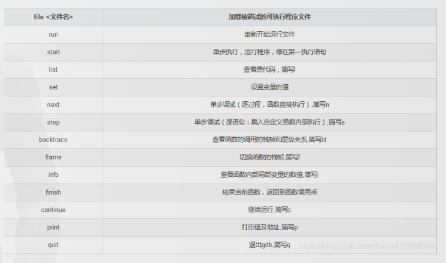

GDB是Linux下非常好用且强大的调试工具。GDB可以调试C、C++、Go、java、 objective-c、PHP等语言。

[(6条消息) GDB调试指南(入门，看这篇够了)_程序猿编码的博客-CSDN博客_gdb调试](https://blog.csdn.net/chen1415886044/article/details/105094688)

# 简介

1、按照自定义的方式启动运行需要调试的程序。
2、可以使用指定位置和条件表达式的方式来设置断点。
3、程序暂停时的值的监视。
4、动态改变程序的执行环境。

**判断文件是否带有调试信息**

要调试C/C++的程序，首先在编译时，要使用gdb调试程序，在使用gcc编译源代码时必须加上“-g”参数。保留调试信息，否则不能使用GDB进行调试。

使用命令readlef查看可执行文件是否带有调试功能

readelf -S main|grep debug

