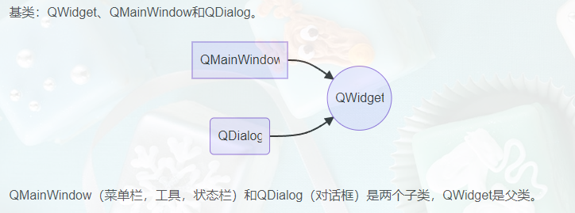
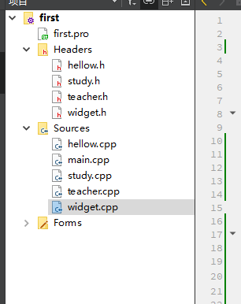
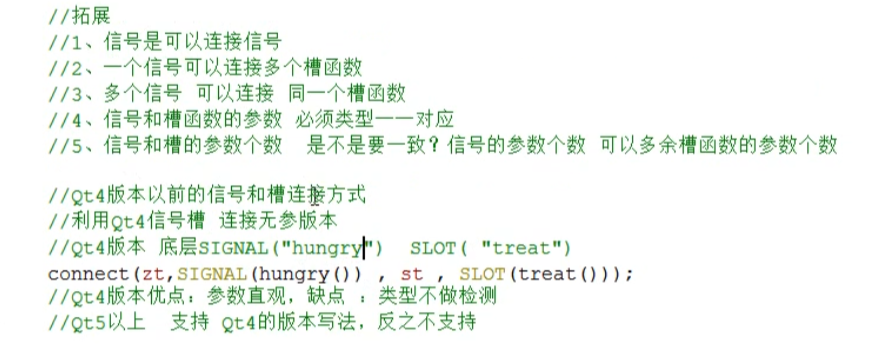
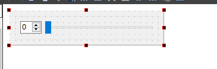
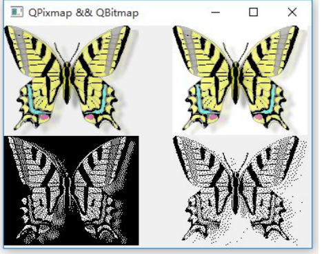
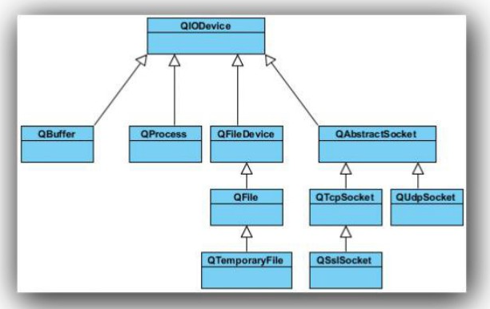

# 介绍




 QT main()函数介绍

QApplication a 应用程序对象，有且仅有一个

myWidget w实例化窗口对象

w.show()调用show函数，显示窗口

return a.exe() 让应用程序对象进入消息循环机制中，代码阻塞到当前行

```text
// 命名规范
// 类名 首字母大写，单词和单词之间首字母大写
// 函数名 变量名称首字母小写，单词和单词之间首字母大写

/*快捷键
 * 注释ctrl + /
 * 运行 ctrl + r
 * 编译 ctrl + b
 * 字体缩放 ctrl + 鼠标滚轮
 * 查找  ctrl + f
 * 整行移动  ctrl + shift + ↑或↓
 * 帮助文档 F1
 * 自动对齐 ctrl + i
 * 同名之间的.h 和cpp切换  F4
 * 帮助文档 assistant.exe

*/

```


## .pro文件

就是工程文件，qmake自动生成生产makefile的配置文件

#代表注释

 TEMPLATE = app
app -建立一个应用程序的 makefile。 这是默认值， 所以如果模板没有被指定， 这个将被使用。
lib - 建立一个库的 makefile。

vcapp - 建立一个应用程序的 VisualStudio 项目 文件。

vclib - 建立一个库的 VisualStudio 项目 文件。
subdirs -这是一个特殊的模板， 它可以创建一个能够进入特定目 录并且
为一个项目 文件生成 makefile 并且为它调用 make 的 makefile。

#指定生成的应用程序名：
TARGET = QtDemo
#工程中包含的头文件
HEADERS += include/painter. h
#工程中包含的. ui 设计文件
FORMS += forms/painter. ui
#工程中包含的源文件
SOURCES += sources/main. cpp sources
 #工程中包含的资源文件
RESOURCES += qrc/painter. qrc
 greaterThan(QT_MAJOR_VERSION, 4) : QT += widgets
这条语句的含义是， 如果 QT_MAJOR_VERSION 大于 4（也就是当前使用的 Qt5
及更高版本） 需要增加 widgets 模块。 如果项目 仅需支持 Qt5， 也可以直接
添加“QT += widgets” 一句 。 不过为 了 保持代码兼容， 最好还是按照
QtCreator 生成的语句编写。
 #配置信息
CONFIG 用来告诉 qmake 关于应用程序的配置信息。
CONFIG += c++11  //使用 c++11 的特性
在这里使用“+=”， 是因为我们添加我们的配置选项到任何一个已经存在中。 这
样做比使用“=” 那样替换已经指定的所有选项更安全。


## 开始

QT提供标准类名声明的文件没有.h后缀

一个类对应一个头文件，类名就是文件头文件名

QApplication 应用程序类
管理图形用户 界面应用程序的控制流和主要设置。
是 Qt 的整个后台管理的命脉它包含主事件循环， 在其中来自窗口 系统和其它资源的所有事件处理和调度。 它也处理应用程序的初始化和结束，并且提供对话管理。
 对于任何一个使用 Qt 的图形用 户 界面应用 程序， 都正好存在一个QApplication 对象， 而不论这个应用程序在同一时间内是不是有 0、 1、2 或更多个窗口 。

a. exec()
程序进入消息循环， 等待对用户 输入进行响应。 这里 main() 把控制权转交给Qt， Qt 完成事件处理工作， 当应用程序退出的时候 exec() 的值就会返回。在 exec() 中， Qt 接受并处理用户 和系统的事件并且把它们传递给适当的窗口 部件。


# QT控件的使用

## 按钮的创建

创建 QPushButton * btn = new QPushButton

设置父类 setParent(this)

设置文本 setText(“文本”)

设置位置 move(宽,高)

重新指定窗口的大小 resize()

设置窗口标题 setWindowTitle(“第一个窗口”);

设置窗口的固定大小setFixedSize(600,400);

设置按钮大小 btn -> resize(20,50);

```c++
QPushButton * btn = new QPushButton; 头文件  #include <QPushButton>
//设置父亲
btn->setParent(this) ;
//设置文字
btn->setText("德玛西亚") ;
//移动位置
btn->move(100, 100) ;
//第二种创建
QPushButton * btn2 = new QPushButton("孙悟空", this) ;
//重新指定窗口大小
this->resize(600, 400) ;
//设置窗口标题
this->setWindowTitle("第一个项目") ;
//限制窗口大小
this->setFixedSize(600, 400) ;

```


## 对象模型

在 Qt 中创建对象的时候会提供一个 Parent 对象指针， 下面来解释这个 parent到底是干什么的。

QObject 是以对象树的形式组织起来的。当你创建一个 QObject 对象时， 会看到 QObject 的构造函数接收一个
QObject 指针作为参数， 这个参数就是 parent， 也就是父对象指针。这相当于， 在创建 QObject 对象时， 可以提供一个其父对象， 我们创建的这个 QObject 对象会自动添加到其父对象的 children() 列表。当父对象析构的时候， 这个列表中的所有对象也会被析构。（注意， 这里的父对象并不是继承意义上的父类！）这 种 机制 在 GUI 程 序 设 计 中 相 当 有 用 。 例 如 ， 一 个 按 钮 有 一 个QShortcut（快捷键） 对象作为其子对象。 当我们删除按钮的时候， 这个快捷键理应被删除。 这是合理的。

 QWidget 是能够在屏幕上显示的一切组件的父类。

 QWidget 继承自 QObject， 因此也继承了 这种对象树关系。 一个孩子自动地成为父组件的一个子组件。 因此， 它会显示在父组件的坐标系统中，被父组件的边界剪裁。 例如， 当用户 关闭一个对话框的时候， 应用程序将其删除， 那么， 我们希望属于这个对话框的按钮、 图标等应该一起被删除。 事实就是如此， 因为这些都是对话框的子组件。当然， 我们也可以自己删除子对象， 它们会自动从其父对象列表中删除。比如， 当我们删除了 一个工具栏时， 其所在的主窗口 会自动将该工具栏从其子对象列表中删除， 并且自动调整屏幕显示。Qt 引入对象树的概念， 在一定程度上解决了 内存问题。当一个 QObject 对象在堆上创建的时候， Qt 会同时为其创建一个对象树。不过， 对象树中对象的顺序是没有定义的。 这意味着， 销毁这些对象的顺序
也是未定义的。任何对象树中的 QObject 对象 delete 的时候， 如果这个对象有 parent，则自 动将其从 parent 的 children() 列 表中 删除； 如果有孩子， 则自 动delete 每一个孩子。 Qt 保证没有 QObject 会被 delete 两次， 这是由析构顺序决定的。


QT中，尽量在构造的时候就指定parent对象，并且大胆在堆上创建


## QT窗口坐标体系

坐标体系：
以左上角为原点（0, 0）， X 向右增加， Y 向下增加。

对于嵌套窗口 ， 其坐标是相对于父窗口 来说的。


# 信号和槽

## 简介

信号槽是 Qt 框架引以为豪的机制之一。 所谓信号槽， 实际就是观察者模式。 当某个事件发生之后， 比如， 按钮检测到自己被点击了 一下， 它就会发出一个信号（signal）。 这种发出是没有目 的的， 类似广播。 如果有对象对这个信号感兴趣，它就会使用连接（connect） 函数， 意思是， 将想要处理的信号和自己的一个函数（称为槽（slot）） 绑定来处理这个信号。 也就是说， 当信号发出时， 被连接的槽函数会自动被回调。 这就类似观察者模式： 当发生了 感兴趣的事件， 某一个操作就会被自动触发。

## 系统自带的信号和槽

```c++
QPushButton * quitBtn = new QPushButton("关闭窗口", this) ;
connect(quitBtn, &QPushButton: : clicked, this, &MyWidget: : close) ;

```


点击按钮关闭

```c++
 QPushButton *btn = new QPushButton("close",this);
    btn->move(100,100);
    btn->show();
    connect(btn,&QPushButton::clicked,this,&Widget::close);
```


连接函数：connect 参数1 信号的发送者 参数2 发送的信号（函数的地址） 参数3 信号的接受者 参数4 处理的槽函数（函数的地址）
信号槽的优点：松散耦合， 信号发送端 和 接受端 本身是没有关联的，通过connect连接 将两端耦合在一起。

系统自带的信号和槽通常如何查找呢， 这个就需要利用帮助文档了 ， 在帮助文档中比如我们上面的按钮的点击信号， 在帮助文档中输入 QPushButton， 首先我们可以在 Contents 中寻找关键字 signals， 信号的意思， 但是我们发现并没有找到， 这时候我们应该想到也许这个信号的被父类继承下来的， 因此我们去他的父类 QAbstractButton 中就可以找到该关键字， 点击signals 索引到系统自带的信号有如下几个这里的 clicked 就是我们要找到， 槽函数的寻找方式和信号一样， 只不过他的关键字是 slot。


> connect(信号的发送者，发送的具体信号，信号的接受者，信号的处理（槽）)
> // 需求 点击我的按钮 关闭窗口
> // 参数1 信号的发送者 参数2 发送的信号（函数的地址） 参数3 信号的接受者 参数4 处理的槽函数
> connect( btn2, &QPushButton::clicked, this, &myWidget::close );


## 自定义信号和槽




```c++
//test
#include "widget.h"
#include "ui_widget.h"

#include <qpushbutton.h>

Widget::Widget(QWidget *parent)
    : QWidget(parent)
    , ui(new Ui::Widget)
{
    this->s =new study(this);
    this->t =new teacher(this);

    connect(t,&teacher::hungry,s,&study::treat);
    classOver();
}

void Widget::classOver()
{
    //下课
    // 触发关键字
    emit t->hungry();
}

Widget::~Widget()
{
    delete ui;
}
```


```c++
#include "study.h"
#include "QDebug"
study::study(QObject *parent)
    : QObject{parent}
{

}

void study::treat()
{
    qDebug()<<"请你吃饭";
}

```

自定义信号槽需要注意的事项：

发送者和接收者都需要是 QObject 的子类（当然， 槽函数是全局函数、 Lambda表达式等无需接收者的时候除外）； 信号和槽函数返回值是 void

信号只需要声明， 不需要实现
 槽函数需要声明也需要实现
槽函数是普通的成员 函数， 作为 成员 函数， 会受到 public、 private、protected 的影响；
使用 emit 在恰当的位置发送信号；
 使用 connect() 函数连接信号和槽。
 任何成员函数、 static 函数、 全局函数和 Lambda 表达式都可以作为槽函数

**信号槽要求信号和槽的参数一致**， 所谓一致， 是参数类型一致。如果信号和槽的参数不一致， 允许的情况是， 槽函数的参数可以比信号的少，
即便如此， 槽函数存在的那些参数的顺序也必须和信号的前面几个一致起来。 这是因为， 你可以在槽函数中选择忽略信号传来的数据（也就是槽函数的参数比信号的少）。

```c++
 connect(t,teach,s,stuc);
    QPushButton *btn = new QPushButton(this);
    this -> resize(600,700);
    btn->setText("xiake");
    //点击触发
    connect(btn,&QPushButton::clicked,this,&Widget::classOver);

void Widget::classOver()
{
    //下课
    // 触发关键字
    emit t->hungry("aaa");
}


//信号连接信号
//调用无参数的
void (teacher::*teach2)(void) = &teacher::hungry;
    void (study::*s2)(void) = &study::treat;
    connect(t,teach2,s,s2);
    connect(btn,&QPushButton::clicked,t,teach2);
	//断开连接
	 disconnect(btn,&QPushButton::clicked,t,teach2);
}
```


 信号槽的拓展
一个信号可以和多个槽相连
如果是这种情况， 这些槽会一个接一个的被调用， 但是它们的 调用顺序是不确定的。

 多个信号可以连接到一个槽

只要任意一个信号发出， 这个槽就会被调用 。 

```c++
connect(btn,&QPushButton::clicked,t,teach2);
connect(btn,&QPushButton::clicked,this,&Widget::close);
```


一个信号可以连接到另外的一个信号

当第一个信号发出时， 第二个信号被发出。 除此之外， 这种信号-信号的形式和信号-槽的形式没有什么区别。
 槽可以被取消链接

这种情况并不经常出现， 因为当一个对象 delete 之后， Qt 自动取消所有连接到这个对象上面的槽。
信号槽可以断开

利用 disconnect 关键字是可以断开信号槽的

使用 Lambda 表达式

在使用 Qt 5 的时候， 能够支持 Qt 5 的编译器都是支持 Lambda 表达式的。在连接信号和槽的时候， 槽函数可以使用 Lambda 表达式的方式进行处理。



```c++
//QT5支持qt4

```


# 菜单栏


一个主窗口 最多只有一个菜单栏。 位于主窗口 顶部、 主窗口 标题栏下面。

创建菜单栏， 通过 QMainWindow 类的 menubar（） 函数获取主窗口 菜单栏指针

`QMenuBar* menuBar() const`

创建菜单，调用QMenu的成员函数addMenu来添加菜单

```c++
QAction* addMenu(QMenu * menu)
QMenu* addMenu(const QString & title)
QMenu* addMenu(const QIcon & icon, const QString & title)
```


创建菜单项， 调用 QMenu 的成员函数 addAction 来添加菜单项

```c++
QAction* activeAction() const
QAction* addAction(const QString & text)
QAction* addAction(const QIcon & icon, const QString & text)
QAction* addAction(const QString & text, const QObject * receiver,
const char * member, const QKeySequence & shortcut = 0)
QAction* addAction(const QIcon & icon, const QString & text,
const QObject * receiver, const char * member,
const QKeySequence & shortcut = 0)

```

Qt 并没有专门的菜单项类， 只是使用一个 QAction 类， 抽象出公共的动作。当我们把 QAction 对象添加到菜单， 就显示成一个菜单项， 添加到工具栏，就显示成一个工具按钮。 用户 可以通过点击菜单项、 点击工具栏按钮、 点击快捷键来激活这个动作。


## 工具栏

主窗口 的工具栏上可以有多个工具条， 通常采用一个菜单对应一个工具条的的方
式， 也可根据需要进行工具条的划分。 直接调用 QMainWindow 类的 addToolBar（） 函数获取主窗口 的工具条对象，每增加一个工具条都需要调用一次该函数。插入属于工具条的动作， 即在工具条上添加操作。
通过 QToolBar 类的 addAction 函数添加。

工具条是一个可移动的窗口 ， 它的停靠区域由 QToolBar 的 allowAreas 决定，
包括：

Qt: : LeftToolBarArea   停靠在左侧
Qt: : RightToolBarArea  停靠在右侧
Qt: : TopToolBarArea   停靠在顶部
Qt: : BottomToolBarArea 停靠在底部
Qt: : AllToolBarAreas   以上四个位置都可停靠
使用 setAllowedAreas（） 函数指定停靠区域：
setAllowedAreas（Qt: : LeftToolBarArea | Qt: : RightToolBarArea）
使用 setMoveable（） 函数设定工具栏的可移动性：
setMoveable（false） //工具条不可移动, 只能停靠在初始化的位置上

##  状态栏

派生自 QWidget 类， 使用方法与 QWidget 类似， QStatusBar 类常用成员函数：
状态栏也只能最多有一个

```c++
//添加小部件
void addWidget(QWidget * widget, int stretch = 0)
//插入小部件
int  insertWidget(int index, QWidget * widget, int stretch = 0)
//删除小部件
void removeWidget(QWidget * widget)
```


##  铆接部件

铆接部件 QDockWidget， 也称浮动窗口， 可以有多个。

QDockWidget * dock = new QDockWidget("标题",this);

addDockWidget(Qt::LeftDockWidgetArea,dock);

dock->setAllowedAreas(Qt::LeftDockWidgetArea  |  Qt::RightDockWidgetArea |
Qt::TopDockWidgetArea); 设置区域范围
核心部件（中心部件）

除了以上几个部件， 中心显示的部件都可以作为核心部件， 例如一个记事本文件， 可以利用

```c++
QTextEdit 做核心部件

QTextEdit * edit = new QTextEdit(this);

setCentralWidget(edit);

```


```c++
//重置窗口
        this->resize(600,400);

        //创建菜单栏--最多只有一个
        QMenuBar * bar = menuBar();
        setMenuBar(bar);
        //创建菜单
        QMenu * file=  bar->addMenu("文件");
        QMenu * edit=  bar->addMenu("编辑");

        //创建菜单项
        QAction * newaction= file->addAction("新建");
        //添加分隔符
        file->addSeparator();
        QAction * editaction =  file->addAction("打开");

        //工具栏--可以多个
        QToolBar * tbar = new  QToolBar(this);
        addToolBar(tbar);
        // tbar ->setAllowedAreas(Qt::LeftToolBarArea|Qt::RightToolBarArea);

        //设置浮动
        tbar->setFloatable(false);

        //设置移动（总开关）
        tbar->setMovable(false);

        //工具栏添加内容
        tbar->addAction(newaction);
        //添加分割线
        tbar->addSeparator();
        tbar->addAction(editaction);

        //工具栏中添加控件
        QPushButton * btn= new QPushButton(tbar);
        btn->setText("工具栏上的控件" );
        tbar->addWidget(btn);

        //状态栏也是最多只能有一个
        QStatusBar * sta =  statusBar();
        setStatusBar(sta);

        //放标签控件
        QLabel * lb =new QLabel("leftremake",this);
        sta->addWidget(lb);

        //放右侧标签控件
        QLabel * lb2 =new QLabel("rightremake",this);
        sta->addPermanentWidget(lb2);

        //铆接部件（浮动窗口）可以包含多个
        QDockWidget * dw = new QDockWidget("浮动",this);
        addDockWidget(Qt::BottomDockWidgetArea,dw);
        //设置停靠区域，只允许上下
        dw->setAllowedAreas(Qt::TopDockWidgetArea|Qt::BottomDockWidgetArea);


        //设置中心部件  只能有一个

       QTextEdit * qedit= new QTextEdit(this);
       setCentralWidget(qedit);
```


注意：菜单栏、工具栏、状态栏、铆接部件（浮动窗口）、qt都不会直接把他们加入窗体，

菜单栏使用 setMenuBar(bar);，

工具栏使用addToolBar(tbar);

添加分隔符都是使用addSeparator();

状态栏使用setStatusBar(sta);

浮动窗口使用 addDockWidget(Qt::BottomDockWidgetArea,dw);

另外在向工具栏中添加控件时并不是直接设置其父控件

QPushButton * btn= new QPushButton(tbar);

而是使用addWidget(btn)，直接设置会把原有工具栏内容的覆盖掉


## 添加静态资源


# 对话框


对话框是 GUI 程序中不可或缺的组成部分。 很多不能或者不适合放入主窗口的功能组件都必须放在对话框中设置。 对话框通常会是一个顶层窗口 ， 出现在程序最上层， 用于实现短期任务或者简洁的用户交互。Qt 中使用 QDialog 类实现对话框。 就像主窗口 一样， 我们通常会设计一个类继
承 QDialog。 QDialog（及其子类， 以及所有 Qt: : Dialog 类型的类） 的对于其parent 指针都有额外的解释： 如果 parent 为 NULL， 则该对话框会作为一个顶层窗口 ， 否则则作为其父组件的子对话框（此时， 其默认出现的位置是 parent的中心）。 顶层窗口 与非顶层窗口 的区别在于， 顶层窗口 在任务栏会有自己的位置， 而非顶层窗口 则会共享其父组件的位置。对话框分为模态对话框和非模态对话框。
模态对话框， 就是会**阻塞**同一应用程序中其它窗口 的输入。

模态对话框很常见， 比如“打开文件” 功能。 你可以尝试一下记事本的打开文件， 当打开文件对话框出现时， 我们是不能对除此对话框之外的窗口 部分进行操作的。

非模态对话框

例如查找对话框， 我们可以在显示着查找对话框的同时， 继续对记事本的内容进行编辑。


```c++
 connect(ui->actionopen,&QAction::triggered,[=](){
//        //模态创建
//        QDialog dig(this);
//        dig.resize(100,100);
//        dig.exec();

//        qDebug()<<"open";
        QDialog* dig = new QDialog(this);
        dig->resize(100,100);
        dig->setWindowTitle("hello");
        dig->show();
        //关闭释放内存
        dig->setAttribute(Qt::WA_DeleteOnClose);//55号属性
        qDebug()<<"new";

    });
}xxxxxxxxxx connect(ui->actioncreat,&QAction::triggered,[=](){        //模态创建        QDialog dig(this);        dig.resize(100,100);        dig.exec();        qDebug()<<"open";    }); connect(ui->actionopen,&QAction::triggered,[=](){//        //模态创建//        QDialog dig(this);//        dig.resize(100,100);//        dig.exec();//        qDebug()<<"open";        QDialog* dig = new QDialog(this);        dig->resize(100,100);        dig->setWindowTitle("hello");        dig->show();        //关闭释放内存        dig->setAttribute(Qt::WA_DeleteOnClose);//55号属性        qDebug()<<"new";    });}
```


所谓标准对话框， 是 Qt 内置的一系列对话框， 用于简化开发。 事实上， 有很多对话框都是通用的， 比如打开文件、 设置颜色、 打印设置等。 这些对话框在所有程序中几乎相同， 因此没有必要在每一个程序中都自己实现这么一个对话框。
Qt 的内置对话框大致分为以下几类：

 QColorDialog：   选择颜色；

QFileDialog：   选择文件或者目 录；

 QFontDialog： 选择字体；

QInputDialog：   允许用户 输入一个值， 并将其值返回；

 QMessageBox：   模态对话框， 用于显示信息、 询问问题等；

 QPageSetupDialog：  为打印机提供纸张相关的选项；

 QPrintDialog：  打印机配置；

 QPrintPreviewDialog： 打印预览；

 QProgressDialog：  显示操作过程。


## 消息对话框

QMessageBox 用于显示消息提示。 我们一般会使用其提供的几个 static 函数：

 显示关于对话框。
void about(QWidget * parent, const QString & title, const QString & text)

这是一个最简单的对话框， 其标题是 title， 内 容是 text， 父窗 口 是parent。 对话框只有一个 OK 按钮。

 显示关于 Qt 对话框。 该对话框用于显示有关 Qt 的信息。

void aboutQt(QWidget * parent, const QString & title = QString())：

 显示严重错误对话框。

StandardButton critical(QWidget * parent,const QString & title,const QString & text,StandardButtons buttons = Ok,StandardButton defaultButton = NoButton)：
这个对话框将显示一个红色的错误符号。 我们可以通过 buttons 参数指明其 显 示 的 按 钮 。 默 认 情 况 下 只 有 一 个 Ok 按 钮 ， 我 们 可 以 使 用StandardButtons 类型指定多种按钮。

与 QMessageBox: : critical() 类似， 不同之处在于这个对话框提供一个普通信息图标。
StandardButton information(QWidget * parent,const QString & title,const QString & text,
StandardButtons buttons = Ok,StandardButton defaultButton = NoButton)

与 QMessageBox: : critical () 类似， 不同之处在于这个对话框提供一个问号图标， 并且其显示的按钮是“是” 和“否”。
StandardButton question(QWidget * parent,const QString & title,const QString & text,StandardButtons buttons = StandardButtons( Yes | No ),StandardButton defaultButton = NoButton)

与 QMessageBox: : critical() 类似， 不同之处在于这个对话框提供一个黄色叹号图标。

StandardButton warning(QWidget * parent,const QString & title,const QString & text,StandardButtons buttons = Ok,StandardButton defaultButton = NoButton)

我们可以通过下面的代码来演示下如何使用 QMessageBox。
if (QMessageBox::Yes == QMessageBox::question(this,tr("Question"), tr("Are you OK?"),
QMessageBox::Yes | QMessageBox::No,QMessageBox::Yes))
{

QMessageBox::information(this, tr("Hmmm..."),
tr("I'm glad to hear that!"));
}
else
{
QMessageBox::information(this, tr("Hmmm..."),
tr("I'm sorry!"));
}
我们使用 QMessageBox: : question() 来询问一个问题。这个对话框的父窗口 是 thisQMessageBox 是 QDialog 的子类， 这意味着它的初始显示位置将会是在parent 窗口 的中央。第二个参数是对话框的标题。第三个参数是我们想要显示的内容。第四个参数是关联的按键类型， 我们可以使用或运算符（| ） 指定对话框应该出现的按钮。 比如我们希望是一个 Yes 和一个 No。最后一个参数指定默认选择的按钮。
这个函数有一个返回值， 用于确定用户 点击的是哪一个按钮。 按照我们的写法， 应该很容易的看出， 这是一个模态对话框， 因此我们可以直接获取其返回值。
QMessageBox 类的 static 函数优点是方便使用， 缺点也很明显： 非常不灵活。
我们只能使用简单的几种形式。 为了 能够定制 QMessageBox 细节， 我们必须使用
QMessageBox 的属性设置 API。 如果我们希望制作一个询问是否保存的对话框，
我们可以使用如下的代码：

```c++
QMessageBox msgBox;
msgBox.setText(tr("The document has been modified."));
msgBox.setInformativeText(tr("Do you want to save your changes?"));
msgBox.setDetailedText(tr("Differences here..."));
msgBox.setStandardButtons(QMessageBox::Save | QMessageBox::Discard | QMessageBox::Cancel);
msgBox.setDefaultButton(QMessageBox::Save);
int ret = msgBox.exec();
switch (ret)
{
case QMessageBox::Save:
qDebug() << "Save document!";
break;
case QMessageBox::Discard:
qDebug() << "Discard changes!";
break;
case QMessageBox::Cancel:
qDebug() << "Close document!";
break;
}
```

msgBox 是一个建立在栈上的 QMessageBox 实例。 我们设置其主要文本信息为
“The document has been modified. ”， informativeText 则是会在对话框中显示的简单说明文字。 下面我们使用了 一个 detailedText， 也就是详细信息， 当我们点击了 详细信息按钮时， 对话框可以自动显示更多信息。 我们自己定义的对话框的按钮有三个： 保存、 丢弃和取消。 然后我们使用了 exec() 是其成为一个模态对话框， 根据其返回值进行相应的操作。


```c++
/消息对话框
        //错误消息
        // QMessageBox::critical(this,"critical","error");
        //信息对话框
        //QMessageBox::information(this,"info","信息");
        //提问对话框
        //参数1 父亲 2 标题 3 提示内容 4 按键类型  5 默认关联回车
        if(QMessageBox::Save==QMessageBox::question(this,"ques","提问",QMessageBox::Save|QMessageBox::Cancel,QMessageBox::Cancel))
        {qDebug()<<"ok";}

 //文件对话框
//返回文件路径
        qDebug()<<QFileDialog::getOpenFileName(this,"open","c:\\","*.txt");
```


# 布局管理器

所谓 GUI 界面， 归根结底， 就是一堆组件的叠加。 我们创建一个窗口 ， 把按钮放上面， 把图标放上面， 这样就成了 一个界面。 在放置时， 组件的位置尤其重要。我们必须要指定组件放在哪里， 以便窗口 能够按照我们需要的方式进行渲染。 这就涉及到组件定位的机制。

Qt 提供了 两种组件定位机制： 绝对定位和布局定位。绝对定位就是一种最原始的定位方法： 给出这个组件的坐标和长宽值。这样， Qt 就知道该把组件放在哪里以及如何设置组件的大小。 但是这样做带来的一个问题是， 如果用户 改变了 窗口 大小， 比如点击最大化按钮或者使用鼠标拖动窗口 边缘， 采用绝对定位的组件是不会有任何响应的。 这也很自然， 因为你并没有告诉 Qt， 在窗口 变化时， 组件是否要更新自己以及如何更新。 或者， 还有更简单的方法： 禁止用户 改变窗口 大小。 但这总不是长远之计。
布局定位： 你只要把组件放入某一种布局， 布局由专门的布局管理器进行管
理。 当需要调整大小或者位置的时候， Qt 使用对应的布局管理器进行调整。
布局定位完美的解决了 使用绝对定位的缺陷。
Qt 提供的布局中以下三种是我们最常用的：

QHBoxLayout： 按照水平方向从左到右布局；

QVBoxLayout： 按照竖直方向从上到下布局；

QGridLayout： 在一个网格中进行布局， 类似于 HTML 的 table；


# 常用控件

## QLabel 控件使用

QLabel 是我们最常用的控件之一， 其功能很强大， 我们可以用来显示文本， 图片和动画等。

显示文字 （普通文本、 html）

通过 QLabel 类的 setText 函数设置显示的内容:

void setText(const QString &) 可以显示普通文本字符串
QLable *label = new QLable;
label->setText(“Hello, World!”);可以显示 HTML 格式的字符串
比如显示一个链接:
QLabel * label = new QLabel(this);

label ->setText("Hello, World");

label ->setText("<h1\><a href=\"https://www.baidu.com\">百度一下</a\></h1\>");
label ->setOpenExternalLinks(true);

其中 setOpenExternalLinks() 函数是用来设置用户 点击链接之后是否自 动打开链接， 如果参数指定为 true 则会自动打开。


单选按钮

多选按钮

QListWidget 列表容器


```
ui->rBtnMan->setCheacked(true);

connect(ui->rBtnWoman,&QRadioButton::clicked,[=](){})
```


树控件

```c++
//设置水平头
    ui->treeWidget->setHeaderLabels(QStringList()<<"name"<<"intrudution");
    //父节点
    QTreeWidgetItem* item= new QTreeWidgetItem(QStringList() << "power");
    ui->treeWidget->addTopLevelItem(item);
    //子节点
    QStringList h1;h1<<"one "<<"rich";
    item->addChild(new QTreeWidgetItem(h1));
```


tableWidget


```c++
 //设置水平表头头
    ui->tableWidget->setColumnCount(3);

    //设置水平表头
    ui->tableWidget->setHorizontalHeaderLabels(QStringList()<<"name"<<"sex"<<"age");

    ui->tableWidget->setRowCount(5);
    QStringList name;
    name<<"one"<<"two"<<"three"<<"four"<<"five";

    for(int i=0;i<5;i++)
    {
        int col=0;
        ui->tableWidget->setItem(i,col++,new QTableWidgetItem(name[i]));
         ui->tableWidget->setItem(i,col++,new QTableWidgetItem("nan"));
          ui->tableWidget->setItem(i,col++,new QTableWidgetItem(QString::number(i)));
    }
    //设置列宽自动填满
    ui->tableWidget->horizontalHeader()->setSectionResizeMode(QHeaderView::Stretch);

```


## 自定义控件




```c++
 void(QSpinBox:: *spsing)(int) = &QSpinBox::valueChanged;
    //移动数字进度条移动
    connect(ui->spinBox,spsing,ui->horizontalSlider,&QSlider::setValue);
    //移动进度条数字移动
    connect(ui->horizontalSlider,&QSlider::valueChanged,ui->spinBox,&QSpinBox::setValue);


```


```c++
connect(ui->pushButton,&QPushButton::clicked,[=](){
        qDebug()<<ui->widget->getNum();
    });

    connect(ui->pushButton_2,&QPushButton::clicked,[=](){
        ui->widget->setNum(50);
    });
```


# QT鼠标事件

QEvent()

具体参考文档有

##  事件

事件（event） 是由系统或者 Qt 本身在不同的时刻发出的。 当用户 按下鼠标、敲下键盘， 或者是窗口 需要重新绘制的时候， 都会发出一个相应的事件。 一些事件在对用户 操作做出响应时出， 如键盘事件等； 另一些事件则是由系统自动发出， 如计时器事件。在前面我们也曾经简单提到， Qt 程序需要在 main() 函数创建一个 QApplication对象， 然后调用它的 exec() 函数。 这个函数就是开始 Qt 的事件循环。 在执行exec() 函数之后， 程序将进入事件循环来监听应用程序的事件。 当事件发生时，Qt 将创建一个事件对象。 Qt 中所有事件类都继承于 QEvent。 在事件对象创建
完毕后， Qt 将这个事件对象传递给 QObject 的 event() 函数。 event() 函数并不直接处理事件， 而是按照事件对象的类型分派给特定的事件处理函数（eventhandler）， 关于这一点， 会在后边详细说明。
在所有组件的父类 QWidget 中， 定义了 很多事件处理的回调函数， 如

keyPressEvent()

keyReleaseEvent()

mouseDoubleClickEvent()

 mouseMoveEvent()

 mousePressEvent()

 mouseReleaseEvent() 等。

这些函数都是 protected virtual 的， 也就是说， 我们可以在子类中重新实现这些函数。


 QLabel 是支持 HTML 代码的


QString 的 arg() 函数可以自动替换掉 QString 中出现的占位符。 其占位符以 % 开始， 后面是占位符的位置， 例如 %1， %2 这种。

QString("[%1, %2] ") . arg(x) . arg(y) ;

在 mouseReleaseEvent() 函数中， 我们使用了 另外一种 QString 的构造方法。我们使用类似 C 风格的格式化函数 sprintf() 来构造 QString。


## 定时器

启动定时器

```c++
 //启动定时器
    timeid1=startTimer(1000);
    timeid2=startTimer(2000);
```


```c++
void MainWindow::timerEvent(QTimerEvent *ev)
{
    if(ev->timerId()==timeid1)
    { static int nums=1;
     ui->label_2->setText(QString::number(nums++));
    }
    if(ev->timerId()==timeid2)
    {
        static int nums=1;
             ui->label_3->setText(QString::number(nums++));
    }

}
```


```c++
//定时器启动第二种
    QTimer *timer=new QTimer(this);
    //启动定时器
    timer->start(1000);
    //接受到信号
    connect(timer,&QTimer::timeout,[=](){
        static int nums=1;
             ui->label_4->setText(QString::number(nums++));
    });
    //实现暂停
    connect(ui->pushButton_3,&QPushButton::clicked,[=](){
        timer->stop();
    });
    //实现继续
    connect(ui->pushButton_4,&QPushButton::clicked,[=](){
        timer->start(1000);
    });
```


## event（）

事件的分发

事件对象创建完毕后， Qt 将这个事件对象传递给 QObject 的 event() 函数。event() 函数并不直接处理事件， 而是将这些事件对象按照它们不同的类型， 分发给不同的事件处理器（event handler）。如上所述， event() 函数主要用于事件的分发。 所以， 如果你希望在事件分发之前做一些操作， 就可以重写这个 event() 函数了 。 例如， 我们希望在一个 QWidget组件中监听 tab 键的按下， 那么就可以继承 QWidget， 并重写它的 event() 函数，
来达到这个目 的：


有时候， 对象需要查看、 甚至要拦截发送到另外对象的事件。 例如， 对话框可能想要拦截按键事件， 不让别的组件接收到； 或者要修改回车键的默认处理。通过前面的章节， 我们已经知道， Qt 创建了 QEvent 事件对象之后， 会调用QObject 的 event() 函数处理事件的分发。 显然， 我们可以在 event() 函数中实现拦截的操作。 由于 event() 函数是 protected 的， 因此， 需要继承已有类。如果组件很多， 就需要重写很多个 event() 函数。 这当然相当麻烦， 更不用说重写 event() 函数还得小心一堆问题。 好在 Qt 提供了 另外一种机制来达到这一目的： 事件过滤器。QObject 有一个 eventFilter() 函数， 用于建立事件过滤器。 函数原型如下：virtual bool QObject: : eventFilter ( QObject * watched, QEvent * event ) ;这个函数正如其名字显示的那样， 是一个“事件过滤器”。 所谓事件过滤器， 可以理解成一种过滤代码。 事件过滤器会检查接收到的事件。 如果这个事件是我们感兴趣的类型， 就进行我们自己的处理； 如果不是， 就继续转发。 这个函数返回一个 bool 类型， 如果你想将参数 event 过滤出来， 比如， 不想让它继续转发，就返回 true， 否则返回 false。 事件过滤器的调用时间是目 标对象（也就是参数里面的 watched 对象） 接收到事件对象之前。 也就是说， 如果你在事件过滤器中停止了 某个事件， 那么， watched 对象以及以后所有的事件过滤器根本不会知道这么一个事件。

主要是做时间的分发

```c++
bool myLabel::event(Qevent *e)
{
    //捕获鼠标按下
    if(e->type()==QEvent::MouseButtonPress)
    {
        QString str=QString("sss").arg();
        qDebug<<str;
    	return true;//用户自己处理不做分发
    }
    //其余情况返回父类处理
    return QLaber(e);
}
```


### 事件过滤器

可以为整个应用程序添加一个事件过滤器。 记得 ， installEventFilter() 函 数 是 QObject 的 函 数 ， QApplication 或 者QCoreApplication 对象都是 QObject 的子类， 因此， 我们可以向QApplication或者 QCoreApplication 添加事件过滤器。 这种全局的事件过滤器将会在所有其它特性对象的事件过滤器之前调用。 尽管很强大， 但这种行为会严重降低整个应用程序的事件分发效率。 因此， 除非是不得不使用的情况， 否则的话我们不应该这么做。

**注意，事件过滤器和被安装过滤器的组件必须在同一线程， 否则， 过滤器将不起作用。另外， 如果在安装过滤器之后， 这两个组件到了 不同的线程， 那么， 只有等到二者重新回到同一线程的时候过滤器才会有效。**


Qt 的事件处理， 实际上是有五个层次：
 重写 paintEvent() 、 mousePressEvent() 等事件处理函数。 这是最普通、 最简单的形式， 同时功能也最简单。

重写 event() 函数。event() 函数是所有对象的事件入口 ， QObject 和 QWidget中的实现， 默认是把事件传递给特定的事件处理函数。
在特定对象上面安装事件过滤器。 该过滤器仅过滤该对象接收到的事件。在 QCoreApplication: : instance() 上面安装事件过滤器。 

该过滤器将过滤所有对象的所有事件， 因此和 notify() 函数一样强大， 但是它更灵活， 因为可以安装多个过滤器。

 全局的事件过滤器可以看到 disabled 组件上面发出的鼠标事件。 

全局过滤器有一个问题： 只能用在主线程。重写QCoreApplication: : notify() 函数。 这是最强大的， 和全局事件过滤器一样提供完全控制， 并且不受线程的限制。 但是全局范围内只能有一个被使用（因为 QCoreApplication 是单例的）。


# 绘图

QPainter


在qt里面绘画有重写paintEvent(QPaintEvent*)函数

QPainter 接收一个 QPaintDevice 指针作为参数。 QPaintDevice 有很多子类， 比如 QImage， 以及 QWidget。 注意回忆一下， QPaintDevice 可以理解成要在哪里去绘制， 而现在我们希望画在这个组件， 因此传入的是 this 指针。Painter 有很多 以 draw 开头的函数， 用 于各种图形的绘制 ， 比如这里的drawLine() ， drawRect() 以及 drawEllipse() 等。当绘制轮廓线时， 使用 QPainter的 pen() 属性。比如， 我们调用了 painter. setPen(Qt: : red) 将 pen 设置为红色，则下面绘制的矩形具有红色的轮廓线。 接下来， 我们将 pen 修改为绿色， 5 像素（painter.setPen(QPen(Qt: : green, 5) ) ）， 又设置了 画刷为蓝色。 这时候再调用 draw 函数， 则是具有绿色 5 像素宽轮廓线、 蓝色填充的椭圆。

```c++
{
    QPainter painter1(this);
    painter1.drawLine(QPoint(0,0),QPoint(100,100));
    painter1.setPen(Qt::red);
    painter1.drawEllipse(QPoint(100,100),10,10);
}
```

查看官方文档设置笔的风格


##  绘图设备

绘图设备是指继承 QPainterDevice 的子类。 Qt 一共提供了 四个这样的类， 分别是 QPixmap、 QBitmap、 QImage 和 QPicture。 其中，QPixmap 专门为图像在屏幕上的显示做了 优化

QBitmap 是 QPixmap 的一个子类， 它的色深限定为 1， 可以使用 QPixmap 的isQBitmap() 函数来确定这个 QPixmap 是不是一个 QBitmap。QImage 专门为图像的像素级访问做了 优化。QPicture 则可以记录和重现 QPainter 的各条命令。


 QPixmap、 QBitmap、 QImage、QPixmap 继承了 QPaintDevice， 因此， 你可以使用 QPainter 直接在上面绘制图形。

 QPixmap 也可以接受一个字符串作为一个文件的路径来显示这个文件， 比如你想在程序之中打开 png、jpeg 之类的文件， 就可以使用 QPixmap。使用 QPainter的 drawPixmap() 函数可以把这个文件绘制到一个 QLabel、 QPushButton 或者其
他的设备上面。 QPixmap 是针对屏幕进行特殊优化的， 因此， 它与实际的底层显示设备息息相关。 注意， 这里说的显示设备并不是硬件， 而是操作系统提供的原生的绘图引擎。 所以， 在不同的操作系统平台下， QPixmap 的显示可能会有所差别。

QBitmap 继承自 QPixmap， 因此具有 QPixmap 的所有特性， 提供单色图像。QBitmap的色深始终为 1. 色深这个概念来自计算机图形学， 是指用于表现颜色的二进制的位数。 我们知道， 计算机里面的数据都是使用二进制表示的。 为了 表示一种颜色， 我们也会使用二进制。 比如我们要表示 8 种颜色， 需要用 3 个二进制位， 这时我们就说色深是 3. 因此， 所谓色深为 1， 也就是使用 1 个二进制位表示颜色。1 个位只有两种状态： 0 和 1， 因此它所表示的颜色就有两种， 黑和白。 所以说，QBitmap 实际上是只有黑白两色的图像数据。由于 QBitmap 色深小， 因此只占用很少的存储空间， 所以适合做光标文件和笔刷。


```c++
void PaintWidget: : paintEvent(QPaintEvent *)
{
QPixmap pixmap(": /Image/butterfly. png") ;
QPixmap pixmap1(": /Image/butterfly1. png") ;
QBitmap bitmap(": /Image/butterfly. png") ;
QBitmap bitmap1(": /Image/butterfly1. png") ;
QPainter painter(this) ;
painter. drawPixmap(0, 0, pixmap) ;
painter. drawPixmap(200, 0, pixmap1) ;
painter. drawPixmap(0, 130, bitmap) ;
painter. drawPixmap(200, 130, bitmap1) ;
}
```




QPixmap 使用 底层平台的绘制系 统进行绘制， 无法提供像素级别的操作， 而QImage 则是使用独立于硬件的绘制系统， 实际上是自己绘制自己， 因此提供了像素级别的操作， 并且能够在不同系统之上提供一个一致的显示形式。我们声明了 一个 QImage 对象， 大小是 300 x 300， 颜色模式是 RGB32， 即使用32 位数值表示一个颜色的 RGB 值， 也就是说每种颜色使用 8 位。 然后我们对每个像素进行颜色赋值， 从而构成了 这个图像。 我们可以把 QImage 想象成一个 RGB颜色的二维数组QImage 与 QPixmap 的区别
QPixmap 主要是用于绘图， 针对屏幕显示而最佳化设计， QImage 主要是为图像 I/O、 图片访问和像素修改而设计的QPixmap 依赖于所在的平台的绘图引擎， 故例如反锯齿等一些效果在不同的
平台上可能会有不同的显示效果， QImage 使用 Qt 自身的绘图引擎， 可在不同平台上具有相同的显示效果

由于 QImage 是独立于硬件的， 也是一种 QPaintDevice， 因此我们可以在另一个线程中对其进行绘制， 而不需要在 GUI 线程中处理， 使用这一方式可以很大幅度提高 UI 响应速度。 QImage 可通过 setPixpel() 和 pixel() 等方法直接存取指定的像素。

QImage 与 QPixmap 之间的转换:
QImage 转 QPixmap使用 QPixmap 的静态成员函数: fromImage() 

QPixmap  fromImage(const QImage & image,Qt: : ImageConversionFlags flags = Qt: : AutoColor)

QPixmap 转 QImage:
使用 QPixmap 类的成员函数: toImage()

QImage toImage() const， 记录了 每一像素的颜色。


###  QPicture

最后一个需要说明的是 QPicture。 这是一个可以记录和重现 QPainter 命令的绘图设备。 QPicture 将 QPainter 的命令序列化到一个 IO 设备， 保存为一个平台独立的文件格式。 这种格式有时候会是“元文件(meta- files) ”。 Qt 的这种格式是二进制的， 不同于某些本地的元文件，Qt 的 pictures 文件没有内容上的限制， 只要是能够被 QPainter 绘制的元素， 不论是字体还是 pixmap， 或者是变换，都可以保存进一个 picture 中。QPicture 是平台无关的， 因此它可以使用在多种设备之上， 比如 svg、 pdf、 ps、打印机或者屏幕。 回忆下我们这里所说的 QPaintDevice， 实际上是说可以有QPainter 绘制的对象。 QPicture 使用系统的分辨率， 并且可以调整 QPainter来消除不同设备之间的显示差异。如果我们要记录下 QPainter 的命令， 首先要使用 QPainter: : begin() 函数， 将QPicture 实例作为参数传递进去， 以便告诉系统开始记录， 记录完毕后使用

QPainter: : end() 命令终止。 代码示例如下：

```c++
void PaintWidget: : paintEvent(QPaintEvent *)
{
QPicture pic;
QPainter painter;
 //将图像绘制到 QPicture 中, 并保存到文件
painter. begin(&pic) ;
painter. drawEllipse(20, 20, 100, 50) ;
painter. fillRect(20, 100, 100, 100, Qt: : red) ;
painter. end() ;
pic. save("D: \\drawing. pic") ;
 //将保存的绘图动作重新绘制到设备上
pic. load("D: \\drawing. pic") ;
painter. begin(this) ;
painter. drawPicture(200, 200, pic) ;
painter. end() ;
}
```


# 文件系统

文件操作是应用程序必不可少的部分。 Qt 作为一个通用开发库， 提供了 跨平台的文件操作能力。 Qt 通过 QIODevice 提供了 对 I/O 设备的抽象， 这些设备具有读写字节块的能力。 下面是 I/O 设备的类图（Qt5）：





QIODevice： 所有 I/O 设备类的父类， 提供了 字节块读写的通用操作以及基本接口 ；

QFileDevice： Qt5 新增加的类， 提供了 有关文件操作的通用实现。

QFlie： 访问本地文件或者嵌入资源；

QTemporaryFile： 创建和访问本地文件系统的临时文件；

QBuffer： 读写 QbyteArray, 内存文件；

 QProcess： 运行外部程序， 处理进程间通讯；

 QAbstractSocket： 所有套接字类的父类；

QTcpSocket： TCP 协议网络数据传输；

QUdpSocket： 传输 UDP 报文；

QSslSocket： 使用 SSL/TLS 传输数据；

## 文件系统分类:

顺序访问设备:

是指它们的数据只能访问一遍： 从头走到尾， 从第一个字节开始访问， 直到最后一个字节， 中 途不能返回 去读取上一个字节， 这其中 ， QProcess、QTcpSocket、 QUdpSoctet 和 QSslSocket 是顺序访问设备。
随机访问设备:

可以访问任意位置任意次数， 还可以使用 QIODevice: : seek() 函数来重新定位文件访问位置指针， QFile、 QTemporaryFile 和 QBuffer 是随机访问设备，

```c++
//对话框打开文件
    connect(ui->pushButton,&QPushButton::clicked,[=]()
    {
        QString path =QFileDialog::getOpenFileName(this,"open","d:/");
        ui->lineEdit->setText(path);
        //QFile默认支持utf-8

        QFile file(path);

        file.open(QIODevice::ReadOnly);
        QByteArray ar=file.readAll();
       ui->textEdit->setText(ar);
        file.close();
        
        //写文件
        file.open(QIODevice::Append);
        file.write("aa");
        file.close();
    });


一行一行读
QByteArray arr;
while(!file.atEnd())
{
    arr+=file.readLine();
}
```


我们首先使用 QFile 创建了 一个文件对象。这个文件名 字是 in. txt。 如果你不知道应该把它放在哪里， 可以使用QDir: : currentPath() 来获得应用 程序执行时的当前路径。 只要将这个文件
放在与当前路径一致的目 录下即可。使用 open() 函数打开这个文件， 打开形式是只读方式， 文本格式。这个类似于 fopen() 的 r 这样的参数。 open() 函数返回一个 bool 类型， 如果打开失败， 我们在控制台输出一段提示然后程序退出。 否则， 我们利用while 循环， 将每一行读到的内容输出。


## QFileInfo 

可以使用 QFileInfo 获取有关该文件的信息。
QFileInfo 有很多类型的函数， 我们只举出一些例子。 比如：

 isDir() 检查该文件是否是目 录；

 isExecutable()  检查该文件是否是可执行文件等。

baseName()  可以直接获得文件名；

 completeBaseName()  获取完整的文件名

suffix()  则直接获取文件后缀名。

completeSuffix() 获取完整的文件后缀
我们可以由 下面的示例看到 ， baseName() 和 completeBaseName() ， 以及suffix() 和 completeSuffix() 的区别：


##  二进制文件读写


QDataStream 提供了 基于 QIODevice 的二进制数据的序列化。 数据流是一种二进制流， 这种流 完全不依赖 于底层操作系统、 CPU 或者字节顺序（大端或小端）。例如， 在安装了 Windows 平台的 PC 上面写入的一个数据流， 可以不经过任何处理， 直接拿到运行了 Solaris 的 SPARC 机器上读取。 由于数据流就是二进制流， 因此我们也可以直接读写没有编码的二进制数据， 例如图像、 视频、 音频等。QDataStream 既能够存取 C++ 基本类型， 如 int、 char、 short 等， 也可以存取复杂的数据类型， 例如自定义的类。 实际上， QDataStream 对于类的存储， 是将复杂的类分割为很多基本单元实现的。


枚举值 描述

QIODevice: : NotOpen   未打开

QIODevice: : ReadOnly  以只读方式打开

QIODevice: : WriteOnly  以只写方式打开

QIODevice: : ReadWrite  以读写方式打开

 QIODevice: : Append  

以追加的方式打开，新增加的内容将被追加到文件末尾

QIODevice: : Truncate   

以重写的方式打开， 在写入新的数据时会将原有数据全部清除， 游标设置在文件开头。

 QIODevice: : Text    在读取时， 将行结束符转换成 \n； 在写入时，将行结束符转换成本地格式， 例如 Win32 平台上是 \r\n

 QIODevice: : Unbuffered  忽略缓存


stream. setCodec("UTF-8") ;

# 导出exe

[qt生成exe文件并运行 - 一场雨 - 博客园 (cnblogs.com)](https://www.cnblogs.com/jiangyu0331/p/13606726.html)

