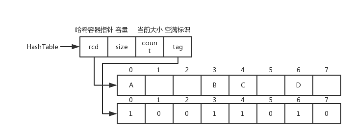

# main函数的参数

带形参的main函数，如 main( int argc, char* argv[], char **env ) ，是UNIX、Linux以及Mac OS操作系统中C/C++的main函数标准写法，并且是血统最纯正的main函数写法。
    在如今的Visual Studio编译器中，main()函数带有参数argc和argv或者不带，即无论是否在函数体中使用argc和argv，返回值为void或不为void，都是合法的。

## argc、argv的具体含义

​    argc和argv参数在用命令行编译程序时有用。main( int argc, char* argv[], char **env ) 中
​    第一个参数，int型的argc，为整型，用来统计程序运行时发送给main函数的命令行参数的个数，在VS中默认值为1。
​    第二个参数，char*型的argv[]，为字符串数组，用来存放指向的字符串参数的指针数组，每一个元素指向一个参数。各成员含义如下：
​    argv[0]指向程序运行的全路径名
​    argv[1]指向在DOS命令行中执行程序名后的第一个字符串
​    argv[2]指向执行程序名后的第二个字符串
​    argv[3]指向执行程序名后的第三个字符串
​    argv[argc]为NULL
​    第三个参数，char**型的env，为字符串数组。env[]的每一个元素都包含ENVVAR=value形式的字符串，其中ENVVAR为环境变量，value为其对应的值。平时使用到的比较少。

# 一些函数

isdigit() 判断char是否是数字

stoi()字符串变换为数字

## find()函数


memset()函数

fill(first,last,val)填充函数

返回最大值

*max_element(first,size)


## sort函数

二维的排序

第一层按照升序，第二层按照降序

```c++
bool cmp(vector<int>&a,vector<int>&b){
    if(a[0]!=b[0]) return a[0]<b[0];
    else return a[1]>b[1];
 }

vector<vector<int> >a(6);
    int x;
    for(int i=0;i<6;i++){
        for(int j=0;j<2;j++){
            cin>>x;
            a[i].push_back(x);
        }
    }
    cout<<endl;
    sort(a.begin(),a.end(),cmp);
    for(int i=0;i<6;i++){
        for(int j=0;j<2;j++){
            cout<<a[i][j]<<" ";
        }
```

## C++ lower_bound()函数

```c++
ForwardIterator lower_bound (ForwardIterator first, ForwardIterator last,
                             const T& val);
```

函数用于在指定区域内查找不小于目标值的第一个元素。也就是说，使用该函数在指定范围内查找某个目标值时，最终查找到的不一定是和目标值相等的元素，还可能是比目标值大的元素。

[first, last) 用于指定函数的作用范围；val 用于指定目标元素；comp 用于自定义比较规则

# c++引用

引用在定义时需要添加`&`，在使用时不能添加`&`，使用时添加`&`表示取地址。

### C++引用作为函数参数

\1) swap1() 直接传递参数的内容，不能达到交换两个数的值的目的。对于 swap1() 来说，a、b 是形参，是作用范围仅限于函数内部的局部变量，它们有自己独立的内存，和 num1、num2 指代的数据不一样。调用函数时分别将 num1、num2 的值传递给 a、b，此后 num1、num2 和 a、b 再无任何关系，在 swap1() 内部修改 a、b 的值不会影响函数外部的 num1、num2，更不会改变 num1、num2 的值。

\2) swap2() 传递的是指针，能够达到交换两个数的值的目的。调用函数时，分别将 num1、num2 的指针传递给 p1、p2，此后 p1、p2 指向 a、b 所代表的数据，在函数内部可以通过指针间接地修改 a、b 的值。我们在《[C语言指针变量作为函数参数](https://xinbaoku.com/archive/3AFKCAcA.html)》中也对比过第 1)、2) 中方式的区别。

\2) swap3() 是按引用传递，能够达到交换两个数的值的目的。调用函数时，分别将 r1、r2 绑定到 num1、num2 所指代的数据，此后 r1 和 num1、r2 和 num2 就都代表同一份数据了，通过 r1 修改数据后会影响 num1，通过 r2 修改数据后也会影响 num2。

从以上代码的编写中可以发现，按引用传参在使用形式上比指针更加直观。在以后的 C++ 编程中，我鼓励读者大量使用引用，它一般可以代替指针（当然指针在C++中也不可或缺），C++ 标准库也是这样做的。

### C++引用作为函数返回值

```c++
int &plus10(int &r) {
    r += 10;
    return r;
}
int main() {
    int num1 = 10;
    int num2 = plus10(num1);
    cout << num1 << " " << num2 << endl;
```


# GUN的c/c++b编译器

```
gcc main.cpp -lstdc++ -o main
```

linux下简单的编译方式

g++ hel.cpp -o hel

hel为可执行文件

多个文件：g++ one.cpp two.cpp -o together

# cout与cin

### 以不同进制输出数字

`cout` 在输出数字时，默认是十进制的方式，还可以使用 `hex` 、`oct` 、`dec` 来控制输出的进制，这三个控制符都包含在 `<iostream>` 库中。例如：

```cpp
using namespace std;
auto i = 65534;
cout.setf(ios::uppercase); //输出为大写字母
cout << hex << i << endl; //十六进制输出（默认为小写字母）
cout << oct << i << endl; //八进制输出
cout << dec << i << endl; //十进制输出
int x=63;
    //输出x的二进制输出
    cout<<"二进制："<<bitset<8>(x)<<endl;
cout << setbase(16) << i << endl; //以16进制输出
```

其中的 `setiosflags(ios::uppercase)` 表示以大写字母输出（默认是 `ios::lowercase`）， `setbase(n)` 方法表示以 n 进制输出，其中的 n 取值为 8、10 或者 16，其余值无输出。这两个函数都包含在库 `<iomanip>` 中。
使用 `setiosflags()` 时，可以使用 `|` 来同时设置多个位，例如：

```cpp
cout << setiosflags(ios::scientific | ios::showpos) << 12.01 << endl;
```

### 控制浮点数的输出

可以通过 `setprecision(n)` 、`setiosflags(ios::fixed)` 或 `fixed` 来对 `cout` 输出的精度进行控制。这几个控制符都包含在库 `<iomanip>` 库的 `std` 命名空间中。

```cpp
#include <iostream>
#include <climits>
#include <iomanip>

int main(void)
{
    using namespace std;
    system("chcp 65001");
    system("cls");

    double p = 1233.141592653;
    cout << p << endl;
    cout << setprecision(3) << p << endl; //保留两位小数
    cout << setprecision(15) << p << endl;
    cout << setiosflags(ios::fixed);
    cout << p << endl;
    cout << fixed << p << endl;
    return 0;
}
```

运行结果如下：

```plaintext
1233.14
1.23e+03
1233.141592653
1233.141592653000089
1233.141592653000089
```

### 显示小数点和正负号

此外，还可以使用 `setiosflags(ios::showpoint)` 来显示小数点，使用 `setiosflags(ios::showpos)` 来显示正负号。例如：

```cpp
double i2 = 100;
double d2 = -3.14;
cout << setprecision(4);
cout << setiosflags(ios::showpoint); //显示小数点
cout << i2 << endl;
cout << setiosflags(ios::showpos); //显示正负号
cout << d2 << "\t" << i2 << endl;
```

输出结果如下：

```plaintext
100.0000
-3.1400   +100.0000
```

默认显示6个有效位数。

### 设置宽度和对齐方式

可以通过 `setw(n)` 函数来设置输出的宽度，当不足宽度的时候，以空格填充剩余的空间，如果超出宽度，则忽略设置的宽度；使用 `setiosflags(ios::left|ios::right)` 来设置对齐方式。这些都定义在 `<iomanip>` 库中的 `std` 命名空间中。例如：

```cpp
cout.fill(' ');
cout << setw(10) << 100 << setw(10) << 100 << endl;
cout << setiosflags(ios::left) << setw(10) << 100 << setw(10) << 100 << endl;
cout << setiosflags(ios::right) << setw(10) << 100 << setw(10) << 100 << endl;
```

输出结果为：

```plaintext
       100       100
100       100
       100       100
```

输出的结果默认为右对齐。

### 设置填充字符

在宽度大于字符数量时，`cout` 默认使用空格填充剩余的空间，可以使用 `setfill('*')` 来设置为其他的填充字符。例如：

```cpp
cout << setfill('*') << setiosflags(ios::right) << setw(10) << 100 << setw(10) << 100 << endl;
```

### 使用 cout 的成员函数

`ostream` 类还有一些成员函数，通过 `cout` 来调用它们也可以控制格式输出。和前面的控制符不同的是，使用成员函数会影响后面所有使用默认格式的输出。如下表：

| 成员函数     | 控制符              | 说明                                            |
| ------------ | ------------------- | ----------------------------------------------- |
| precision(n) | setprecision(n)     | 设置输出浮点数的精度为n                         |
| width(w)     | setw(w)             | 指定输出宽度为w个字符                           |
| fill(c)      | setfill(c)          | 在指定输出宽度的情况下，多余的空白使用字符c填充 |
| setf(flag)   | setiosflags(flag)   | 将摸个输出格式标志设置为1                       |
| unset(flag)  | resetiosflags(flag) | 将某个输出格式标志设置为0                       |

```cpp
cout.precision(5);
double x = 1123.23456;
cout << x << endl;

cout.width(20);
cout.fill('*');
cout << x << endl;
```

## cin 常用的读取方法

当使用 `cin` 从标准输入读取数据时，通常用到的方法有 `cin >>` 、`cin.get()` 、`cin.getline()` 。

### cin >>

`cin >>` 可以连续的从键盘读取数据，以空格、Tab 键或者换行符作为分隔符或者结束符。
当从缓冲区读取数据时，如果第一个字符是空白字符，`cin>>` 会忽略并将其清除，继续读取下一个字符，如果缓冲区为空，则继续等待。如果读取成功，字符后面的分隔符都是残留在缓冲区内的，`cin >>` 不做处理。

```cpp
int a, b, c;
cin >> a >> b >> c;
cout << a << b << c << endl;
```

上面的代码，将会要求我们输入三个数，并以空白分隔，输出才算完成。
`cin>>` 等价于 `cin.operator>>()`，即调用成员函数 `operator>>()` 进行读取数据。
如果不想略过开头的空白字符，那就使用 `noskipws` 流控制符。如下：

```cpp
cin >> noskipws >> a;
```

### cin.get()

这个函数有多个版本的重载。如下：

```cpp
int cin.get(); 
istream& cin.get(char& var);
istream& get(char* s, streamsize n);
istream& get(char* s, streamsize n, char delim);
```

其中的 `streamsize` 被定义为 `long long` 类型。

#### int cin.get() 和 istream& cin.get(char& var)

这两种版本都是一次读取一个字符。
例如下面的代码：

```cpp
char c1, c2;
c1 = cin.get();
cin.get(c2);
cout << c1 << '\t' << (int)c2 << endl;
```

运行，输入 a，然后回车，输出如下：

```plaintext
a
a
```

如上面的代码：

- `cin.get()` 从缓冲区读取单个字符时不忽略空白，直接将其读取，所以变量 `c2` 保存的是一个空行 `\r`。它的返回值是 `int` 类型，成功则返回读取字符的 ASCII 码值，遇到文件结束符时，返回 `EOF`，即 `-1` 。在 Windows 中，可以使用 Ctrl+Z 来输入文件结束符。
- `cin.get(char var)` 如果成功返回的是 `cin` 对象，所以可以支持链式操作，比如 `cin.get(a).get(c)` 。
- 可以使用 `cin.get()` 来删除缓冲区上一次遗留下来的换行符。

#### 使用 cin.get() 读取一行

`cin.get()` 的后面两种重载形式，

```cpp
istream& get(char* s, streamsize n);
istream& get(char* s, streamsize n, char delim);
```

可以用来读取一行。这两个版本的区别是，前者默认以换行符结束，后者可以指定结束符。参数里的 `n` 表示目标空间的大小。
例如下面的代码：

```cpp
#include <iostream>

int main(void)
{
    using namespace std;
    system("chcp 65001");
    system("cls");

    char arr1[100] = {NULL};
    cin.get(arr1, 100);
    char a;
    cin.get(a);
    cout << arr1 << " " << (int)a << endl;

    system("pause");
    return 0;
}
```

运行的结果：

```plaintext
hello world  //输入
hello world 10
```

从上面的代码中，可以看出：

- 读取一行时，遇到换行符时停止读取，但是对换行符不做处理，换行符依然残留在输入缓冲区。
- 第二次使用 `cin.get(a)` 将换行符读入变量 `a` ，输出的 ASCII 码值为 10 。就是上一次残留的换行符。
- 这种方法读取一行时，只能将字符串读入 C 风格的字符串中，即 `char*` ，使用 C++ 的 `getline()` 函数可以将字符串读入 `string` 类型。

### cin.getline 读取一行

这个函数可以从键盘读取一个字符串，还可以以指定的结束符结束。它不会将换行符残留在缓冲区。函数有两个重载的版本，如下：

```cpp
istream& getline(char* s, streamsize count); //默认的换行符结束
istream& getline(char* s, streamsize count, char delim); //delim 指定结束符
```

例如下面的代码：

```cpp
#include <iostream>

int main(void)
{
    using namespace std;

    char arr1[100] {0};
    cin.getline(arr1, 100);
    cout << arr1 << endl;

    system("pause");
    return 0;
}
```

## cin 的条件状态

使用 `cin` 读取键盘输入时，一旦出错，`cin` 将设置条件状态(condition state)。条件状态定义如下：

- goodbit ：无错误
- eofbit ：已经到达文件尾
- failbit ：非致命的输入/输出错误，可挽回
- badbit ：致命的输入/输出错误，无法挽回

这些条件状态都有对应的成员函数，可以用来设置、读取当前的条件状态。这些成员函数如下：

| 函数                  | 说明                                                         |
| --------------------- | ------------------------------------------------------------ |
| `cin.eof()`           | 如果流 cin 的 eofbit 为1，则返回 true                        |
| `cin.fail()`          | 如果流 cin 的 failbit 位为1，则返回 true                     |
| `cin.bad()`           | 如果流 cin 的 badbit 位为1，则返回 true                      |
| `cin.good()`          | 如果流 cin 的 goodbit 位为1，则返回 true                     |
| `cin.clear(flags)`    | 清空状态标志位，将给定的标志位 flags 设置为0，无返回值，如果不带参数，那么则是将清除所有的非good状态 |
| `cin.setstate(flags)` | 将对应的 flags 设置为1，无返回值                             |
| `cin.rdstate()`       | 返回当前状态。返回值类型为 iostate                           |
| `cin.ignore()`        | 它有两个参数，第一个是整型，第二个是 char 类型。它表示从输入流 cin 中提取第一个参数指定的字符数量，然后将这些字符忽略，如果提取的数量达到指定值或者字符等于第二个参数指定的字符时，该函数将终止。否则，继续等待，直到两个条件之一满足。第二个参数默认值为 EOF |

例如下面的代码：

```cpp
#include <iostream>

int main(void)
{
    using namespace std;
    system("chcp 65001");
    system("cls");
    
    int a;
    while(true)
    {
        cin >> a;
        cout << "位状态：good=" << cin.good() << ", eof=" << cin.eof() << ", bad=" << cin.bad() << ", fail=" << cin.fail() << endl;
        //文件尾，可以使用Ctrl+Z
        if(cin.eof())
        {
            cout << "文件尾命令" << endl;
            exit(1);
        }
        if(cin.fail())
        {
            cout << "输入的非数字。" << endl;
            cin.clear();
            cin.ignore(1000,'\n'); //忽略后面的所有内容
            continue;
        }
    }
    system("pause");
    return 0;
}
```

运行结果：

```plaintext
1
位状态：good=1, eof=0, bad=0, fail=0
a
位状态：good=0, eof=0, bad=0, fail=1
输入的非数字。
^Z
位状态：good=0, eof=1, bad=0, fail=1
文件尾命令
```

我们可以看到，在输入正确的类型（int）后，good 位标志为1。输入非数字时，fail 位被设置。当使用 clear() 函数进行清除状态后，除 good 位外所有的位都被设置为0。

## 其他用于读取的函数

这些函数不是 `cin` 的成员函数，但也可以用于读取输入。

### gets() 函数

`gets()` 函数可以一直读取，直到遇到换行符或者文件尾，它的读取不设上限，所以必须保证缓冲区足够大。它不会让换行符残留在缓冲区。它是 C 语言的库函数。使用如下：

```cpp
#include <iostream>

int main(void)
{
    using namespace std;

    char arr1[100] {0};
    gets(arr1);
    cout << arr1 << endl;

    system("pause");
    return 0;
}
```

### getchar() 函数

`getchar()` 读取一个字符并返回，可以读取空白，遇到换行符停止。也会处理结尾的换行符。

```cpp
#include <iostream>

int main(void)
{
    using namespace std;

    char c;
    c = getchar();
    cout << c << endl;

    system("pause");
    return 0;
}
```

### getline() 函数

`getline()` 函数读取一整行，它是在 `std` 命名空间中的全局函数，这个函数的参数使用了 `string` 类型，所以声明在了 `<string>` 头文件中。
`getline()` 从标准输入设备中读取一行，当遇到下面三种情况之一会结束读取：

1. 文件结束 EOF。
2. 遇到行分隔符。
3. 输入达到最大的限度。

这个函数有两个重载的版本：

```cpp
istream& getline(istream& is, string& str); //默认以换行符 \n 分隔行
istream& getline(istream& is, string& str, char delim); //指定分隔符
```

例如下面的代码：

```cpp
#include <iostream>

int main(void)
{
    using namespace std;
    
    while(true)
    {
        string str;
        getline(cin, str);
        cout << str << endl;
    }
    system("pause");
    return 0;
}
```

`getline()` 函数遇到结束符时，会将结束符一并读入指定的 string 中，再将结束符替换为空字符。

# C++字符串操作

C++ 中有大量的函数用来操作以 null 结尾的字符串:

| 序号 | 函数 & 目的                                                  |
| :--- | :----------------------------------------------------------- |
| 1    | **strcpy(s1, s2);** 复制字符串 s2 到字符串 s1。              |
| 2    | **strcat(s1, s2);** 连接字符串 s2 到字符串 s1 的末尾。连接字符串也可以用 **+** 号，例如: `string str1 = "runoob"; string str2 = "google"; string str = str1 + str2;` |
| 3    | **strlen(s1);** 返回字符串 s1 的长度。                       |
| 4    | **strcmp(s1, s2);** 如果 s1 和 s2 是相同的，则返回 0；如果 s1<s2 则返回值小于 0；如果 s1>s2 则返回值大于 0。 |
| 5    | **strchr(s1, ch);** 返回一个指针，指向字符串 s1 中字符 ch 的第一次出现的位置。 |
| 6    | **strstr(s1, s2);** 返回一个指针，指向字符串 s1 中字符串 s2 的第一次出现的位置。 |

## string的子串：

```
string substr(int pos = 0,int n = npos) const;//返回pos开始的n个字符组成的字符串
```

## C++ string append()

添加文本
使用append()添加文本常用方法:
直接添加另一个完整的字符串:
如str1.append(str2);
添加另一个字符串的某一段子串:
如str1.append(str2, 11, 7);
添加几个相同的字符:
如str1.append(5, ‘.’);
注意,个数在前字符在后.上面的代码意思为在str1后面添加5个".".

## substr()详解

**s.substr(pos, n)：**
返回一个string，包含s中从pos开始的n个字符的拷贝（pos的默认值是0，n的默认值是s.size() - pos，即不加参数会默认拷贝整个s）

若pos的值超过了string的大小，则substr函数会抛出一个out_of_range异常；若pos+n的值超过了string的大小，则substr会调整n的值，只拷贝到string的末尾。

# 数据结构部分

## 顺序结构

### Sequence Stack

```c++
typedef struct {
    ElemType *elem;
    int top;
    int size;
    int increment;
} SqSrack;
```


### 队列Sequence Queue

```c++
typedef struct {
    ElemType * elem;
    int front;
    int rear;
    int maxSize;
}SqQueue;
```


非循环队列SqQuene.rear++

#### 循环队列


SqQueue.rear = (SqQueue.rear + 1) % SqQueue.maxSize

### 顺序表(Sequence List)

```c++
typedef struct {
    ElemType *elem;
    int length;
    int size;
    int increment;
} SqList;
```


## 链式结构

```c++
typedef struct LNode {
    ElemType data;
    struct LNode *next;
} LNode, *LinkList;
```

### 链队列（Link Queue）

链队列图片


线性表的链式表示

#### 单链表（Link List）

单链表图片


#### 双向链表（Du-Link-List）

双向链表图片


#### 循环链表（Cir-Link-List）

循环链表图片


## 哈希表

哈希函数：`H(key): K -> D , key ∈ K`

### 构造方法

- 直接定址法
- 除留余数法
- 数字分析法
- 折叠法
- 平方取中法

### 冲突处理方法

- 链地址法：key 相同的用单链表链接
- 开放定址法
  - 线性探测法：key 相同 -> 放到 key 的下一个位置，`Hi = (H(key) + i) % m`
  - 二次探测法：key 相同 -> 放到 `Di = 1^2, -1^2, ..., ±（k)^2,(k<=m/2）`
  - 随机探测法：`H = (H(key) + 伪随机数) % m`

线性探测数据结构：

```c++
typedef char KeyType;
typedef struct {
    KeyType key;
}RcdType;
typedef struct {
    RcdType *rcd;
    int size;
    int count;
    bool *tag;
}HashTable;
```



## 广义表

```c++
// 广义表的头尾链表存储表示
typedef enum {ATOM, LIST} ElemTag;
// ATOM==0：原子，LIST==1：子表
typedef struct GLNode {
    ElemTag tag;
    // 公共部分，用于区分原子结点和表结点
    union {
        // 原子结点和表结点的联合部分
        AtomType atom;
        // atom 是原子结点的值域，AtomType 由用户定义
        struct {
            struct GLNode *hp, *tp;
        } ptr;
        // ptr 是表结点的指针域，prt.hp 和 ptr.tp 分别指向表头和表尾
    } a;
} *GList, GLNode;
```


扩展线性表存储：

```c++
// 广义表的扩展线性链表存储表示
typedef enum {ATOM, LIST} ElemTag;
// ATOM==0：原子，LIST==1：子表
typedef struct GLNode1 {
    ElemTag tag;
    // 公共部分，用于区分原子结点和表结点
    union {
        // 原子结点和表结点的联合部分
        AtomType atom; // 原子结点的值域
        struct GLNode1 *hp; // 表结点的表头指针
    } a;
    struct GLNode1 *tp;
    // 相当于线性链表的 next，指向下一个元素结点
} *GList1, GLNode1;
```


## 二叉树

### 性质

1. 非空二叉树第 i 层最多 2(i-1) 个结点 （i >= 1）
2. 深度为 k 的二叉树最多 2k - 1 个结点 （k >= 1）
3. 度为 0 的结点数为 n0，度为 2 的结点数为 n2，则 n0 = n2 + 1
4. 有 n 个结点的完全二叉树深度 k = ⌊ log2(n) ⌋ + 1
5. 对于含 n 个结点的完全二叉树中编号为 i （1 <= i <= n） 的结点
   1. 若 i = 1，为根，否则双亲为 ⌊ i / 2 ⌋
   2. 若 2i > n，则 i 结点没有左孩子，否则孩子编号为 2i
   3. 若 2i + 1 > n，则 i 结点没有右孩子，否则孩子编号为 2i + 1

```c++
typedef struct BiTNode
{
    TElemType data;
    struct BiTNode *lchild, *rchild;
}BiTNode, *BiTree;
```

### 顺序存储

二叉树顺序存储图片


### 链式存储

二叉树链式存储图片


### 遍历方式

- 先序遍历
- 中序遍历
- 后续遍历
- 层次遍历

### 分类

- 满二叉树
- 完全二叉树（堆）
  - 大顶堆：根 >= 左 && 根 >= 右
  - 小顶堆：根 <= 左 && 根 <= 右
- 二叉查找树（二叉排序树）：左 < 根 < 右
- 平衡二叉树（AVL树）：| 左子树树高 - 右子树树高 | <= 1
- 最小失衡树：平衡二叉树插入新结点导致失衡的子树：调整：
  - LL型：根的左孩子右旋
  - RR型：根的右孩子左旋
  - LR型：根的左孩子左旋，再右旋
  - RL型：右孩子的左子树，先右旋，再左旋

## 其他树及森林

### 树的存储结构

- 双亲表示法
- 双亲孩子表示法
- 孩子兄弟表示法

### 并查集

一种不相交的子集所构成的集合 S = {S1, S2, …, Sn}

### 平衡二叉树（AVL树）

#### 性质

- | 左子树树高 - 右子树树高 | <= 1
- 平衡二叉树必定是二叉搜索树，反之则不一定
- 最小二叉平衡树的节点的公式：`F(n)=F(n-1)+F(n-2)+1` （1 是根节点，F(n-1) 是左子树的节点数量，F(n-2) 是右子树的节点数量）

平衡二叉树图片


### 最小失衡树

平衡二叉树插入新结点导致失衡的子树

调整：

- LL 型：根的左孩子右旋
- RR 型：根的右孩子左旋
- LR 型：根的左孩子左旋，再右旋
- RL 型：右孩子的左子树，先右旋，再左旋

### 红黑树

#### 红黑树的特征是什么？

1. 节点是红色或黑色。
2. 根是黑色。
3. 所有叶子都是黑色（叶子是 NIL 节点）。
4. 每个红色节点必须有两个黑色的子节点。（从每个叶子到根的所有路径上不能有两个连续的红色节点。）（新增节点的父节点必须相同）
5. 从任一节点到其每个叶子的所有简单路径都包含相同数目的黑色节点。（新增节点必须为红）

#### 调整

1. 变色
2. 左旋
3. 右旋

#### 应用

- 关联数组：如 STL 中的 map、set

#### 红黑树、B 树、B+ 树的区别？

- 红黑树的深度比较大，而 B 树和 B+ 树的深度则相对要小一些
- B+ 树则将数据都保存在叶子节点，同时通过链表的形式将他们连接在一起。

### B 树（B-tree）、B+ 树（B+-tree）

B 树、B+ 树图片


#### 特点

- 一般化的二叉查找树（binary search tree）
- “矮胖”，内部（非叶子）节点可以拥有可变数量的子节点（数量范围预先定义好）

#### 应用

- 大部分文件系统、数据库系统都采用B树、B+树作为索引结构

#### 区别

- B+树中只有叶子节点会带有指向记录的指针（ROWID），而B树则所有节点都带有，在内部节点出现的索引项不会再出现在叶子节点中。
- B+树中所有叶子节点都是通过指针连接在一起，而B树不会。

#### B树的优点

对于在内部节点的数据，可直接得到，不必根据叶子节点来定位。

#### B+树的优点

- 非叶子节点不会带上 ROWID，这样，一个块中可以容纳更多的索引项，一是可以降低树的高度。二是一个内部节点可以定位更多的叶子节点。
- 叶子节点之间通过指针来连接，范围扫描将十分简单，而对于B树来说，则需要在叶子节点和内部节点不停的往返移动。

> B 树、B+ 树区别来自：[differences-between-b-trees-and-b-trees](https://stackoverflow.com/questions/870218/differences-between-b-trees-and-b-trees)、[B树和B+树的区别](https://www.cnblogs.com/ivictor/p/5849061.html)

### 八叉树

八叉树图片


八叉树（octree），或称八元树，是一种用于描述三维空间（划分空间）的树状数据结构。八叉树的每个节点表示一个正方体的体积元素，每个节点有八个子节点，这八个子节点所表示的体积元素加在一起就等于父节点的体积。一般中心点作为节点的分叉中心。

用途

- 三维计算机图形
- 最邻近搜索


# lambda表达式

语法定义

```c++
[cpature list](paramters list) mutable exception-> return type{function body}
```

1. **capture list**，捕获外部变量列表；
2. **paramters list**，形参列表；
3. **mutable**，用来说明是否可以修改捕获的外部变量；
4. **exception**，抛出异常；
5. **return type**，返回类型；
6. **function body**，函数体。

除此之外，还可以缺省部分声明构成不完整的Lambda表达式，常见的有以下几种——

| 序号 | 格式                                                        |
| :--- | :---------------------------------------------------------- |
| 1    | [capture list] (params list) -> return type {function body} |
| 2    | [capture list] (params list) {function body}                |
| 3    | [capture list] {function body}                              |

其中——

1. 格式1省略了mutable关键字和exception，声明的是一个const类型的表达式，这种表达式不能修改捕获列表中的值；
2. 格式2 省略了返回类型return type，但是编译器可以根据functionbody中的return语句推断出Lambda表达式的返回类型，如果没有return语句，默认为void类型；
3. 格式3中省略了参数列表，即无参的Lambda表达式。

```c++
#include<iostream>
#include<vector>
#include<algorithm>
using namespace std;
int main(){
	vector<int> v{12,52,67,87,34,95,16,48};
	//使用格式3的Lambda表达式定义sort排序规则
	sort(v.begin(),v.end(),
		[](int&a,int&b){return a<b;});
	for(auto&elem:v){
		cout<<elem<<" ";
	}
	return 0;
}
```

## Lambda捕获外部参数

Lambda表达式可以使用其可见范围内的外部变量，但必须明确声明。主要通过中括号[]来捕获外部变量，比如——

```c++
#include<iostream>
using namespace std;
int main(){
	int a = 100;
	auto f = [a]{cout<<a<<endl;};
	f();// f相当于一个无参的函数调用
	return 0;
}
```

这种方式有别于传统的函数参数，增加了语言使用的灵活性。
Lambda表达式的外部变量捕获有4种方式：**值捕获、引用捕获、隐式捕获和混合捕获**。

### 值捕获

值捕获与函数传参数相似，都是按值传递，外部变量的改变不会影响表达式已捕获变量的值

```c++
#include<iostream>
using namespace std;
int main(){
	int a = 100;
	auto f = [a]{cout<<a<<endl;};
	a = 200;// 此时改变a的值
	f();// 依旧输出100，而不是200
	return 0;
}
//输出结果为100
```

需要注意的是，捕获的外部变量是const的，无法修改。
如果需要修改，需添加mutable关键字，括号也不能省略，比如说

```c++
#include<iostream>
using namespace std;
int main(){
	int a = 100;
	auto f = [a]()mutable{cout<<++a<<endl;};
	a = 200;// 
	f();
	return 0;
}
//输出结果为101
```

### 引用捕获

顾名思义，就是捕获一个外部变量的引用，只需要在捕获的外部变量前面加上一个&即可

```c++
#include<iostream>
using namespace std;
int main(){
	int a = 100;
	auto f = [&a]{cout<<a<<endl;};
	a = 200;// 此时改变a的值
	f();// 输出200
	a = 300；
	f();//输出300
	return 0;
}
//传进来的是引用此时变量值发生改变就会调用f()发生改变
```

### 隐式捕获

有时候，捕获的变量比较多的情况，一一书写变量名，可能就会很麻烦。
针对这种情况，**Lambda提供了一种隐式捕获的方法，让编译器自行推断需要捕获哪些变量。
我们只需要定义捕获的方式是值捕获还是引用捕获，这就是隐式捕获**。
具体使用方法，举例如下——

```c++
#include<iostream>
using namespace std;
int main(){
	int a = 100;
	int b = 200;
	int c = 300;
	int d = 400;
	auto f = [=]{
		cout<<"a = "<<a<<endl
		<<"b = "<<b<<endl
		<<"c = "<<c<<endl
		<<"d = "<<d <<endl;};// 值捕获 
	f();
	return 0;
}
```

只需要把`=`改成`&`，就变成引用捕获了

### 混合方式

Lambda还支持以上几种方式的混合使用，具体语法，总结如下——

| 序号 | 语法     | 作用                                                        |
| :--- | :------- | :---------------------------------------------------------- |
| 1    | []       | 不捕获任何外部变量                                          |
| 2    | [args …] | 默认是值捕获的方式，如果需要引用捕获，需要单独在变量名前加& |
| 3    | [this]   | 以值捕获的形式捕获this指针                                  |
| 4    | [=]      | 以值捕获的形式捕获所有外部变量                              |
| 5    | [&]      | 以引用捕获的方式捕获所有的外部变量                          |
| 6    | [=,&x]   | 变量x以引用捕获，其余值捕获                                 |
| 7    | [&,x]    | 变量x值捕获，其余引用捕获                                   |

## Lambda参数列表

Lambda表达式的参数列表和函数的参数列表类似，但是又有所不同，具体表现为——

1. 不支持默认参数列表
2. 不支持可变参数列表
3. 所有参数必须有参数名

相同之处在于，Lambda表达式的参数列表同样可以作为局部变量看待，能够覆盖同名的全局变量。

### 参数绑定


# 函数重载运算符

## 运算符的重载

重载加号实现复数的相加

```c++
#include <iostream>
using namespace std;
class complex{
public:
    complex();
    complex(double real, double imag);
public:
    //声明运算符重载
    complex operator+(const complex &A) const;
    void display() const;
private:
    double m_real;  //实部
    double m_imag;  //虚部
};
complex::complex(): m_real(0.0), m_imag(0.0){ }
complex::complex(double real, double imag): m_real(real), m_imag(imag){ }
//实现运算符重载
complex complex::operator+(const complex &A) const{
    complex B;
    B.m_real = this->m_real + A.m_real;
    B.m_imag = this->m_imag + A.m_imag;
    return B;
}
void complex::display() const{
    cout<<m_real<<" + "<<m_imag<<"i"<<endl;
}

int main(){
    complex c1(4.3, 5.8);
    complex c2(2.4, 3.7);
    complex c3;
    c3 = c1 + c2;
    c3.display();
 
    return 0;
}
```


### 重载operator()运算符

函数调用运算符必须定义为成员函数。一个类可以定义多个不同版本的调用运算符，相互之间必须在参数数量或类型上有所区别。该类也可以称为可调用对象，或函数对象。

```c++
class PrintString
{
public:
    PrintString(ostream &o = cout, char c = ' '):
        os(o), sep(c) { }
    void operator()(const string &s) const
    {
        os << s << sep;
    }

private:
    ostream &os;   // 用于写入的目的流
    char sep;      // 用于将不同输出隔开的字符
};

PrintString printer;  // uses the defaults; prints to cout
printer(s);     // prints s followed by a space on cout
```

如果类定义了调用运算符，则该类的对象被称作函数对象（function object），函数对象常常作为泛型算法的实参。

```c++
for_each(vs.begin(), vs.end(), PrintString(cerr, '\n'));
```

# 类与对象，继承与多态

## 对象与类

### 对象指针

创建的对象 stu 在栈上分配内存，需要使用`&`获取它的地址，例如：

```
Student stu;Student *pStu = &stu;
```

pStu 是一个指针，它指向 Student 类型的数据，也就是通过 Student 创建出来的对象。

当然，你也可以在堆上创建对象，这个时候就需要使用前面讲到的`new`关键字（[C++ new和delete运算符简介](https://xinbaoku.com/archive/r6F9crfN.html)），例如：

```
Student *pStu = new Student;
```

在栈上创建出来的对象都有一个名字，比如 stu，使用指针指向它不是必须的。但是通过 new 创建出来的对象就不一样了，它在堆上分配内存，没有名字，只能得到一个指向它的指针，所以必须使用一个指针变量来接收这个指针，否则以后再也无法找到这个对象了，更没有办法使用它。也就是说，使用 new 在堆上创建出来的对象是匿名的，没法直接使用，必须要用一个指针指向它，再借助指针来访问它的成员变量或成员函数。

栈内存是程序自动管理的，不能使用 delete 删除在栈上创建的对象；堆内存由程序员管理，对象使用完毕后可以通过 delete 删除。在实际开发中，new 和 delete 往往成对出现，以保证及时删除不再使用的对象，防止无用内存堆积。

有了对象指针后，可以通过箭头`->`来访问对象的成员变量和成员函数，这和通过[结构体指针](https://xinbaoku.com/archive/GewFbtAG.html)来访问它的成员类似，请看下面的示例：

```c++
纯文本复制
pStu -> name = "小明";pStu -> age = 15;pStu -> score = 92.5f;pStu -> say();
```

### 在类体中和类体外定义成员函数的区别

在类体中和类体外定义成员函数是有区别的：在类体中定义的成员函数会自动成为内联函数，在类体外定义的不会。当然，在类体内部定义的函数也可以加 inline 关键字，但这是多余的，因为类体内部定义的函数默认就是内联函数。

内联函数一般不是我们所期望的，它会将函数调用处用函数体替代，所以我建议在类体内部对成员函数作声明，而在类体外部进行定义，这是一种良好的编程习惯，实际开发中大家也是这样做的。

当然，如果你的函数比较短小，希望定义为内联函数，那也没有什么不妥的。

### 类成员的访问权限以及类的封装

[C++](https://xinbaoku.com/cplus/)通过 public、protected、private 三个关键字来控制成员变量和成员函数的访问权限，它们分别表示公有的、受保护的、私有的，被称为成员访问限定符。所谓访问权限，就是你能不能使用该类中的成员。

> [Java](https://xinbaoku.com/java/)、[C#](https://xinbaoku.com/csharp/) 程序员注意，C++ 中的 public、private、protected 只能修饰类的成员，不能修饰类，C++中的类没有共有私有之分。

在类的内部（定义类的代码内部），无论成员被声明为 public、protected 还是 private，都是可以互相访问的，没有访问权限的限制。

在类的外部（定义类的代码之外），只能通过对象访问成员，并且通过对象只能访问 public 属性的成员，不能访问 private、protected 属性的成员。

#### 类的封装

private 关键字的作用在于更好地隐藏类的内部实现，该向外暴露的接口（能通过对象访问的成员）都声明为 public，不希望外部知道、或者只在类内部使用的、或者对外部没有影响的成员，都建议声明为 private。

根据C++软件设计规范，实际项目开发中的成员变量以及只在类内部使用的成员函数（只被成员函数调用的成员函数）都建议声明为 private，而只将允许通过对象调用的成员函数声明为 public。

> 另外还有一个关键字 protected，声明为 protected 的成员在类外也不能通过对象访问，但是在它的派生类内部可以访问，这点我们将在后续章节中介绍，现在你只需要知道 protected 属性的成员在类外无法访问即可。

**有读者可能会提出疑问，将成员变量都声明为 private，如何给它们赋值呢，又如何读取它们的值呢？**

我们可以额外添加两个 public 属性的成员函数，一个用来设置成员变量的值，一个用来获取成员变量的值。上面的代码中，setname()、setage()、setscore() 函数就用来设置成员变量的值；如果希望获取成员变量的值，可以再添加三个函数 getname()、getage()、getscore()。

给成员变量赋值的函数通常称为 set 函数，它们的名字通常以`set`开头，后跟成员变量的名字；读取成员变量的值的函数通常称为 get 函数，它们的名字通常以`get`开头，后跟成员变量的名字。

### 构造函数的重载

和普通成员函数一样，构造函数是允许重载的。一个类可以有多个重载的构造函数，创建对象时根据传递的实参来判断调用哪一个构造函数。

构造函数的调用是强制性的，一旦在类中定义了构造函数，那么创建对象时就一定要调用，不调用是错误的。如果有多个重载的构造函数，那么创建对象时提供的实参必须和其中的一个构造函数匹配；反过来说，创建对象时只有一个构造函数会被调用。

#### 默认构造函数

如果用户自己没有定义构造函数，那么编译器会自动生成一个默认的构造函数，只是这个构造函数的函数体是空的，也没有形参，也不执行任何操作。比如上面的 Student 类，默认生成的构造函数如下：

```
Student(){}
```

一个类必须有构造函数，要么用户自己定义，要么编译器自动生成。一旦用户自己定义了构造函数，不管有几个，也不管形参如何，编译器都不再自动生成。在示例1中，Student 类已经有了一个构造函数`Student(char *, int, float)`，也就是我们自己定义的，编译器不会再额外添加构造函数`Student()`，在示例2中我们才手动添加了该构造函数。

> 实际上编译器只有在必要的时候才会生成默认构造函数，而且它的函数体一般不为空。默认构造函数的目的是帮助编译器做初始化工作，而不是帮助程序员。这是C++的内部实现机制，这里不再深究，初学者可以按照上面说的“一定有一个空函数体的默认构造函数”来理解。

最后需要注意的一点是，调用没有参数的构造函数也可以省略括号。对于示例2的代码，在栈上创建对象可以写作`Student stu()`或`Student stu`，在堆上创建对象可以写作`Student *pstu = new Student()`或`Student *pstu = new Student`，它们都会调用构造函数 Student()。

#### 拷贝构造函数


## 继承

继承的一般语法为：

class 派生类名:［继承方式］ 基类名{
  派生类新增加的成员
};

继承方式包括 public（公有的）、private（私有的）和 protected（受保护的），此项是可选的，如果不写，那么默认为 private。我们将在下节详细讲解这些不同的继承方式。

## 虚函数

[完整介绍](https://xiaomaweifu.blog.csdn.net/article/details/81326699?spm=1001.2101.3001.6650.1&utm_medium=distribute.pc_relevant.none-task-blog-2%7Edefault%7ELandingCtr%7ERate-1.queryctrv4&depth_1-utm_source=distribute.pc_relevant.none-task-blog-2%7Edefault%7ELandingCtr%7ERate-1.queryctrv4&utm_relevant_index=2)

- 1、纯虚函数声明如下： **virtual void funtion1()=0;** 纯虚函数一定没有定义，纯虚函数用来规范派生类的行为，即接口。包含纯虚函数的类是抽象类，抽象类不能定义实例，但可以声明指向实现该抽象类的具体类的指针或引用。

- 2、虚函数声明如下：**virtual ReturnType FunctionName(Parameter)** 虚函数必须实现，如果不实现，编译器将报错，错误提示为：

  ```
  error LNK****: unresolved external symbol "public: virtual void __thiscall ClassName::virtualFunctionName(void)"
  ```

- 3、对于虚函数来说，父类和子类都有各自的版本。由多态方式调用的时候动态绑定。

- 4、实现了纯虚函数的子类，该纯虚函数在子类中就编程了虚函数，子类的子类即孙子类可以覆盖该虚函数，由多态方式调用的时候动态绑定。

- 5、虚函数是C++中用于实现多态(polymorphism)的机制。核心理念就是通过基类访问派生类定义的函数。

- 6、在有动态分配堆上内存的时候，析构函数必须是虚函数，但没有必要是纯虚的。

- 7、友元不是成员函数，只有成员函数才可以是虚拟的，因此友元不能是虚拟函数。但可以通过让友元函数调用虚拟成员函数来解决友元的虚拟问题。

- 8、析构函数应当是虚函数，将调用相应对象类型的析构函数，因此，如果指针指向的是子类对象，将调用子类的析构函数，然后自动调用基类的析构函数。

有纯虚函数的类是抽象类，不能生成对象，只能派生。他派生的类的纯虚函数没有被改写，那么，它的派生类还是个抽象类。

定义纯虚函数就是为了让基类不可实例化化，因为实例化这样的抽象数据结构本身并没有意义，或者给出实现也没有意义。

实际上我个人认为纯虚函数的引入，是出于两个目的：

- 1、为了安全，因为避免任何需要明确但是因为不小心而导致的未知的结果，提醒子类去做应做的实现。
- 2、为了效率，不是程序执行的效率，而是为了编码的效率。

虚函数的作用和实现原理，什么是虚函数,有什么作用?

```
C++的多态分为静态多态（编译时多态）和动态多态（运行时多态）两大类。静态多态通过重载、模板来实现；动态多态就是通过本文的主角虚函数来体现的。	
	
虚函数实现原理:包括虚函数表、虚函数指针等 

虚函数的作用说白了就是：当调用一个虚函数时，被执行的代码必须和调用函数的对象的动态类型相一致。编译器需要做的就是如何高效的实现提供这种特性。不同编译器实现细节也不相同。大多数编译器通过vtbl（virtual table）和vptr（virtual table pointer）来实现的。 当一个类声明了虚函数或者继承了虚函数，这个类就会有自己的vtbl。vtbl实际上就是一个函数指针数组，有的编译器用的是链表，不过方法都是差不多。vtbl数组中的每一个元素对应一个函数指针指向该类的一个虚函数，同时该类的每一个对象都会包含一个vptr，vptr指向该vtbl的地址。
```


结论：

```
每个声明了虚函数或者继承了虚函数的类，都会有一个自己的vtbl
同时该类的每个对象都会包含一个vptr去指向该vtbl
虚函数按照其声明顺序放于vtbl表中, vtbl数组中的每一个元素对应一个函数指针指向该类的虚函数
如果子类覆盖了父类的虚函数，将被放到了虚表中原来父类虚函数的位置
在多继承的情况下，每个父类都有自己的虚表。子类的成员函数被放到了第一个父类的表中
```


衍生问题:为什么 C++里访问虚函数比访问普通函数慢?

```
单继承时性能差不多，多继承的时候会慢
```

# STL 教程

C++ 标准模板库的核心包括以下三个组件：

| 组件                | 描述                                                         |
| :------------------ | :----------------------------------------------------------- |
| 容器（Containers）  | 容器是用来管理某一类对象的集合。C++ 提供了各种不同类型的容器，比如 deque、list、vector、map 等。 |
| 算法（Algorithms）  | 算法作用于容器。它们提供了执行各种操作的方式，包括对容器内容执行初始化、排序、搜索和转换等操作。 |
| 迭代器（iterators） | 迭代器用于遍历对象集合的元素。这些集合可能是容器，也可能是容器的子集。 |


- push_back( ) 成员函数在向量的末尾插入值，如果有必要会扩展向量的大小。
- size( ) 函数显示向量的大小。
- begin( ) 函数返回一个指向向量开头的迭代器。
- end( ) 函数返回一个指向向量末尾的迭代器。

# pair


```c++
//例题代码
pair<string, int>p;
	typedef vector< pair<string, int> > VP;
	VP vp;
	for (int i = 0; i < 5; i++) {
		cin >> p.first >> p.second;
		vp.push_back(make_pair(p.first, p.second));
	}
	VP::iterator it;
	for (it = vp.begin(); it != vp.end(); it++)
		cout << it->first << "," << it->second << endl;
```


# C++ 标准库

C++ 标准库可以分为两部分：

- **标准函数库：** 这个库是由通用的、独立的、不属于任何类的函数组成的。函数库继承自 C 语言。
- **面向对象类库：** 这个库是类及其相关函数的集合。

C++ 标准库包含了所有的 C 标准库，为了支持类型安全，做了一定的添加和修改。

## 标准函数库

标准函数库分为以下几类：

- 输入/输出 I/O
- 字符串和字符处理
- 数学
- 时间、日期和本地化
- 动态分配
- 其他
- 宽字符函数

## 面向对象类库

标准的 C++ 面向对象类库定义了大量支持一些常见操作的类，比如输入/输出 I/O、字符串处理、数值处理。面向对象类库包含以下内容：

- 标准的 C++ I/O 类
- String 类
- 数值类
- STL 容器类
- STL 算法
- STL 函数对象
- STL 迭代器
- STL 分配器
- 本地化库
- 异常处理类
- 杂项支持库

# 多线程

- 基于进程的多任务处理是程序的并发执行。
- 基于线程的多任务处理是同一程序的片段的并发执行

```c++
#include<pthread.h>
//创建POSIX线程
pthread_create(thread, att ,start_routin,arg)
//终止线程
pthread_exit(status)
```

thread 指向线程标识符指针。
attr	一个不透明的属性对象，可以被用来设置线程属性。您可以指定线程属性对象，也可以使用默认值 NULL。
start_routine	线程运行函数起始地址，一旦线程被创建就会执行。
arg	运行函数的参数。它必须通过把引用作为指针强制转换为 void 类型进行传递。如果没有传递参数，则使用 NULL。

**pthread_exit** 用于显式地退出一个线程。通常情况下，pthread_exit() 函数是在线程完成工作后无需继续存在时被调用。

如果 main() 是在它所创建的线程之前结束，并通过 pthread_exit() 退出，那么其他线程将继续执行。否则，它们将在 main() 结束时自动被终止。

向线程传递参数

```c++
rc = pthread_create(&threads[i], NULL,
                          PrintHello, (void *)&td[i]);
// 对传入的参数进行强制类型转换，由无类型指针变为整形数指针，然后再读取
// 传入的时候必须强制转换为void* 类型，即无类型指针 
```

## 连接和分离线程

```c++
pthread_join (threadid, status) 
pthread_detach (threadid) 
    pthread_attr_t attr;
    // 初始化并设置线程为可连接的（joinable）
   pthread_attr_init(&attr);
   pthread_attr_setdetachstate(&attr, PTHREAD_CREATE_JOINABLE);
// 删除属性，并等待其他线程
   pthread_attr_destroy(&attr);
```

pthread_join() 子程序阻碍调用程序，直到指定的 threadid 线程终止为止。当创建一个线程时，它的某个属性会定义它是否是可连接的（joinable）或可分离的（detached）。只有创建时定义为可连接的线程才可以被连接。如果线程创建时被定义为可分离的，则它永远也不能被连接。

c++11之后新的线程标准库std::thread

std::thread thread_object(callable)

可调用对象可以是函数指针，函数对象，lambda表达式，定义callable后，将其传递给std::thread 的构造函数

```c++
// 演示多线程的CPP程序
// 使用三个不同的可调用对象
#include <iostream>
#include <thread>
using namespace std;
// 一个虚拟函数
void foo(int Z)
{
    for (int i = 0; i < Z; i++) {
        cout << "线程使用函数指针作为可调用参数\n";
    }
}
// 可调用对象
class thread_obj {
public:
    void operator()(int x)
    {
        for (int i = 0; i < x; i++)
            cout << "线程使用函数对象作为可调用参数\n";
    }
};
int main()
{
    cout << "线程 1 、2 、3 "
         "独立运行" << endl;
    // 函数指针
    thread th1(foo, 3);
    // 函数对象
    thread th2(thread_obj(), 3);
    // 定义 Lambda 表达式
    auto f = [](int x) {
        for (int i = 0; i < x; i++)
            cout << "线程使用 lambda 表达式作为可调用参数\n";
    };
    // 线程通过使用 lambda 表达式作为可调用的参数
    thread th3(f, 3);
    // 等待线程完成
    // 等待线程 t1 完成
    th1.join();
    // 等待线程 t2 完成
    th2.join();
    // 等待线程 t3 完成
    th3.join();
    return 0;
}
g++ -std=c++11 test.cpp  使用参数来进行编译
```

# c++ 11新语法

自动类型推导auto

```c++
auto i = 0;
auto c = 'c';
auto s = "hello"

for(auto its = v.begin();its!=v.end();its++)
{
    cout<<*its<<endl;
}

```

lambda表达式

Range-based for-loop

支持数组和迭代器的遍历

```c++
int p[8]={2,3,4,56,6,7,7,7};
    for(auto &x : p)
    {
        cout<<x;
    }
```

