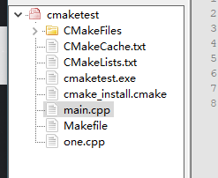

# xmake

[教程 ✍️ (xmake.io)](https://xmake.io/#/zh-cn/about/course)

# cmake是什么

允许开发者编写与平台无关的CMakeList.txt文件来定制整个编译流程，再根据目标用户的平台进一步生成所需的本地化 Makefile 和工程文件，如 Unix 的 Makefile 或 Windows 的 Visual Studio 工程。从而做到“Write once, run everywhere”。显然，CMake 是一个比上述几种 make 更高级的编译配置工具。一些使用 CMake 作为项目架构系统的知名开源项目有 VTK、ITK、KDE、OpenCV、OSG 等。


# cmake常见语法罗列

CMakeLists.txt 的语法比较简单,由命令、注释和空格组成,其中命令是不区分大小写的,符号"#"后面的内容被认为是注释。命令由命令名称、小括号和参数组成,参数之间使用空格进行间隔。

- **PROJECT(hello_cmake)**：该命令表示项目的名称是 hello_cmake。
  CMake构建包含一个项目名称，上面的命令会自动生成一些变量，在使用多个项目时引用某些变量会更加容易。比如生成了： PROJECT_NAME 这个变量。
  PROJECT_NAME是变量名，${PROJECT_NAME}是变量值，值为hello_cmake
- **CMAKE_MINIMUM_REQUIRED(VERSION 2.6)** ：限定了 CMake 的版本。
- **AUX_SOURCE_DIRECTORY(< dir > < variable >)**： `AUX_SOURCE_DIRECTORY ( . DIR_SRCS)`：将当前目录中的源文件名称赋值给变量 DIR_SRCS
- **ADD_SUBDIRECTORY(src)**： 指明本项目包含一个子目录 src
- **SET(SOURCES src/Hello.cpp src/main.cpp)**：创建一个变量，名字叫SOURCE。它包含了这些cpp文件。
- **ADD_EXECUTABLE(main ${SOURCES })**：指示变量 SOURCES 中的源文件需要编译 成一个名称为 main 的**可执行文件**。 ADD_EXECUTABLE() 函数的第一个参数是可执行文件名，第二个参数是要编译的源文件列表。因为这里定义了SOURCE变量，所以就不需要罗列cpp文件了。等价于命令：`ADD_EXECUTABLE(main src/Hello.cpp src/main.cpp)`
- **ADD_LIBRARY(hello_library STATIC src/Hello.cpp)**：用于从某些源文件创建一个库，默认生成在构建文件夹。在add_library调用中包含了源文件，用于创建名称为libhello_library.a的静态库。
- **TARGET_LINK_LIBRARIES( main Test )**：指明可执行文件 main 需要连接一个名为Test的链接库。添加链接库。
- **TARGET_INCLUDE_DIRECTORIES(hello_library PUBLIC ${PROJECT_SOURCE_DIR}/include)**：添加了一个目录，这个目录是库所包含的头文件的目录，并设置库属性为[PUBLIC](https://github.com/SFUMECJF/cmake-examples-Chinese/blob/main/01-basic/1.3  Static Library.md)。
- **MESSAGE(STATUS “Using bundled Findlibdb.cmake…”)**：命令 MESSAGE 会将参数的内容输出到终端。
- **FIND_PATH ()** ：指明头文件查找的路径，原型如下：`find_path(< VAR > name1 [path1 path2 ...])` 该命令在参数 path* 指示的目录中查找文件 name1 并将查找到的路径保存在变量 VAR 中。
- **FIND_LIBRARY()**： 同 FIND_PATH 类似,用于查找链接库并将结果保存在变量中。


# CMake可用变量

CMake语法指定了许多变量，可用于帮助您在项目或源代码树中找到有用的目录。 其中一些包括：

| Variable                 | Info                                                       |
| ------------------------ | ---------------------------------------------------------- |
| CMAKE_SOURCE_DIR         | 根源代码目录，工程顶层目录。暂认为就是PROJECT_SOURCE_DIR   |
| CMAKE_CURRENT_SOURCE_DIR | 当前处理的 CMakeLists.txt 所在的路径                       |
| PROJECT_SOURCE_DIR       | 工程顶层目录                                               |
| CMAKE_BINARY_DIR         | 运行cmake的目录。外部构建时就是build目录                   |
| CMAKE_CURRENT_BINARY_DIR | The build directory you are currently in.当前所在build目录 |
| PROJECT_BINARY_DIR       | 暂认为就是CMAKE_BINARY_DIR                                 |

想仔细体会一下，可以在CMakeLists中，利用message（）命令输出一下这些变量。

另外，这些变量不仅可以在CMakeLists中使用，同样可以在**源代码.cpp**中使用。

# 案例

## 单个源文件

先编写一个main.cpp文件

再编写CMakeList.txt文件，两者保存在一个源目录下

```cmake
# CMake 最带版本号要求
cmake_minimum_required(VERSION 3.21)
# 项目信息
project(cmaketest1)

set(CMAKE_CXX_STANDARD 14)

# 指定生成目标
add_executable(cmaketest main.cpp)
```

## 多个源文件

### 同一目录，多个源文件




```cmake
cmake_minimum_required(VERSION 3.21)
# 项目信息
project(cmaketest1)

set(CMAKE_CXX_STANDARD 14)

# 指定生成目标
add_executable(cmaketest main.cpp one.cpp)
```

加入变量

语法

`aux_source_directory(<dir、> <variable>)`

```cmake
# CMake 最低版本号要求
cmake_minimum_required (VERSION 2.8)
# 项目信息
project (Demo2)
# 查找当前目录下的所有源文件
# 并将名称保存到 DIR_SRCS 变量
aux_source_directory(. DIR_SRCS)
# 指定生成目标
add_executable(Demo ${DIR_SRCS})
```

多个目录多个源文件

主目录

```cmake
# CMake 最低版本号要求
cmake_minimum_required (VERSION 2.8)
# 项目信息
project (Demo3)
# 查找当前目录下的所有源文件
# 并将名称保存到 DIR_SRCS 变量
aux_source_directory(. DIR_SRCS)
# 添加 math 子目录
add_subdirectory(math)
# 指定生成目标
add_executable(Demo main.cc)
# 添加链接库
target_link_libraries(Demo MathFunctions)

```

子目录

```cmake
# 查找当前目录下的所有源文件
# 并将名称保存到 DIR_LIB_SRCS 变量
aux_source_directory(. DIR_LIB_SRCS)
# 生成链接库
add_library (MathFunctions ${DIR_LIB_SRCS})

```

- 第7行的 configure_file 命令用于加入一个配置头文件 config.h ，这个文件由 CMake 从 config.h.in 生成，通过这样的机制，将可以通过预定义一些参数和变量来控制代码的生成。
- 第13行的 option 命令添加了一个 USE_MYMATH 选项，并且默认值为 ON 。
- 第17行根据 USE_MYMATH 变量的值来决定是否使用我们自己编写的 MathFunctions 库。


# 遇见问题

出现系统无法找到路径，可能是Windows下mingw的make文件名不一样


