# 进制的转换

十进制整数转换为 N 进制整数采用“除 N 取余，逆序排列”法。具体做法是：

- 将 N 作为除数，用十进制整数除以 N，可以得到一个商和余数；
- 保留余数，用商继续除以 N，又得到一个新的商和余数；
- 仍然保留余数，用商继续除以 N，还会得到一个新的商和余数；
- ……
- 如此反复进行，每次都保留余数，用商接着除以 N，直到商为 0 时为止。

十进制小数转换成 N 进制小数采用“乘 N 取整，顺序排列”法。具体做法是：

- 用 N 乘以十进制小数，可以得到一个积，这个积包含了整数部分和小数部分；
- 将积的整数部分取出，再用 N 乘以余下的小数部分，又得到一个新的积；
- 再将积的整数部分取出，继续用 N 乘以余下的小数部分；
- ……
- 如此反复进行，每次都取出整数部分，用 N 接着乘以小数部分，直到积中的小数部分为 0，或者达到所要求的精度为止。


把取出的整数部分按顺序排列起来，先取出的整数作为 N 进制小数的高位数字，后取出的整数作为低位数字，这样就得到了 N 进制小数。


## C语言中十进制、八进制和十六进制整常量是如何表示的？

- 整型常量即整常数。C整常数可用以下三种形式表示：
- ①十进制整数；
- ②八进制整数：以数字0开头的数是八进制数，如0123表示八进制数123；
- 十六进制整数：以0x开头的数是十六进制数。如0x123，代表十六进制数123；

## 进制转换

- 实现思路:

  - 将二进制、八进制、十进制、十六进制所有可能的字符都存入数组

  - 利用按位与运算符和右移依次取出当前进制对应位置的值

  - 利用取出的值到数组中查询当前位输出的结果

  - 将查询的结果存入一个新的数组, 当所有位都查询存储完毕, 新数组中的值就是对应进制的值

```c
#include <stdio.h>
void toBinary(int num)
{
    total(num, 1, 1);
}
void toOct(int num)
{
    total(num, 7, 3);
}
void toHex(int num)
{
    total(num, 15, 4);
}

void total(int num , int base, int offset)
{
    //    1.定义表用于查询结果
    char cs[] = {
        '0', '1', '2', '3', '4', '5',
        '6', '7', '8', '9', 'a', 'b',
        'c', 'd', 'e', 'f'
    };
    //    2.定义保存结果的数组
    char rs[32];
    //    计算最大的角标位置
    int length = sizeof(rs)/sizeof(char);
    int pos = length;//8

    while (num != 0) {
        int index = num & base;
        rs[--pos] = cs[index];
        num = num >> offset;
    }

    for (int i = pos; i < length; i++) {
        printf("%c", rs[i]);
    }
    printf("\n");
}
int main()
{
    toBinary(9);
    return 0;
}
```


# 关键字

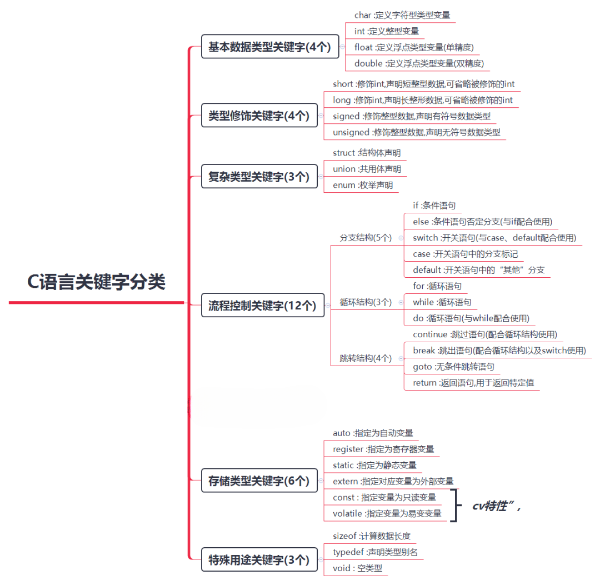


## \#define定义const定义常亮的区别

```
1、两者的区别
(1) 编译器处理方式不同
#define 宏是在预处理阶段展开。
const 常量是编译运行阶段使用。
(2) 类型和安全检查不同
#define 宏没有类型，不做任何类型检查，仅仅是展开。
const 常量有具体的类型，在编译阶段会执行类型检查。
(3) 存储方式不同
#define宏仅仅是展开，有多少地方使用，就展开多少次，不会分配内存。（宏定义不分配内存，变量定义分配内存。）
const定义的变量属于只读变量。是有分配内存的。
```

Const作用：定义常量、修饰函数参数、修饰函数返回值三个作用。被Const修饰的东西都受到强制保护，可以预防意外的变动，能提高程序的健壮性。 1） const 常量有数据类型，而宏常量没有数据类型。编译器可以对前者进行类型安全检查。而对后者只进行字符替换，没有类型安全检查，并且在字符替换可能会产生意料不到的错误。 2） 有些集成化的调试工具可以对const 常量进行调试，但是不能对宏常量进行调试

## 使用const关键字的情况

### 修饰函数的参数

根据常量指针与指针常量，const修饰函数的参数也是分为三种情况

1、防止修改指针指向的内容

void StringCopy(char *strDestination, const char *strSource);

其中 strSource 是输入参数，strDestination 是输出参数。给 strSource 加上 const 修饰后，如果函数体内的语句试图改动 strSource 的内容，编译器将指出错误。

2、防止修改指针指向的地址

void swap ( int * const p1 , int * const p2 )

指针p1和指针p2指向的地址都不能修改。

3、以上两种的结合。

###  修饰函数的返回值

如果给以“指针传递”方式的函数返回值加 const 修饰，那么函数返回值（即指针）的内容不能被修改，该返回值只能被赋给加const 修饰的同类型指针。 例如函数

const char * GetString(void);

如下语句将出现编译错误：

char *str = GetString();

正确的用法是

const char *str = GetString();

###  修饰全局变量

全局变量的作用域是整个文件，我们应该尽量避免使用全局变量，因为一旦有一个函数改变了全局变量的值，它也会影响到其他引用这个变量的函数，

导致除了bug后很难发现，如果一定要用全局变量，我们应该尽量的使用const修饰符进行修饰，这样防止不必要的人为修改，使用的方法与局部变量是相同的。

### 寄存器变量定义和寄存器读取

例如：

uint32_t* R0 =（uint32*）0x400F00FF; //定义一个地址为0x400F00FF的32bit寄存器变量

正确的定义方法：

uint32_t* const R0 =（uint32*）0x400F00FF; //定义一个指针常量R0指向地址为0x400F00FF的寄存器 这样就保证变量R0指向的地址的唯一性，

若是指向一个只读寄存器则应该按如下定义：

const uint32_t* const R0 =（uint32*）0x400F00FF; //定义一个指向常量的常指针 R0 指向地址为0x400F00FF的只读寄存器，这样就保证变量R0指向的地址的唯一性，同时不会因操作该指针修改指向地址的值

# 数据类型


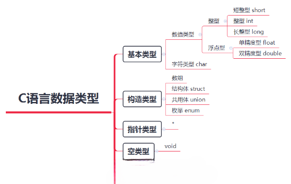

 int 4字节 %d,%i           float 4字节 %f         double 8字节 %lf   char 1字节 %c

​        枚举: 枚举本质是整形(enum)  场合: 当某个东西只有固定的几个取值的时候,使用枚举

​          特点: 先定义枚举类型,根据枚举类型定义枚举变量

记住常用ascll 

| 符号 | 值   |
| ---- | ---- |
| 0    | 48   |
| A    | 65   |
| a    | 97   |


数组，结构体；

实型字面值常量有两种表示方式：小数形式和指数形式

小数形式：由最前面的额正负号，数字0-9和小数点组成，不允许有其他符号；

指数形式；包括指数和尾数两个不可缺少的部分，用符号E(e)分割；E(e)左边是尾数，为十进制整数或小数形式的实数，右边为指数，必须为十进制整数，表示乘以10的多少次方

## 运算符

sizeof返回占用的存储空间字节数

### strlen与sizeof的区别：

> 1、strlen计算字符串的具体长度（只能是字符串），不包括字符串结束符。返回的是字符个数。
>
> 2、sizeof计算声明后所占的内存数（字节大小），不是实际长度。
>
> 3、sizeof是一个取字节运算符，而strlen是个函数。
>
> 4、sizeof的返回值=字符个数*字符所占的字节数，字符实际长度小于定义的长度，此时字符个数就等于定义的长度。若未给出定义的大小，分类讨论，对于字符串数组，字符大 小等于实际的字符个数+1；对于整型数组，字符个数为实际的字符个数。字符串每个字符占1个字节，整型数据每个字符占的字节数需根据系统的位数类确定，32位占4个字节。

### 运算符优先级

- C语言中,运算符的运算优先级共分为15 级。1 级最高,15 级最低
- 在C语言表达式中,不同优先级的运算符, 运算次序按照由高到低执行

- 在C语言表达式中,相同优先级的运算符, 运算次序按照结合性规定的方向执行


运算符注意：

- 如果参与运算的两个操作数皆为整数, 那么结果也为整数
- 如果参与运算的两个操作数其中一个是浮点数, 那么结果一定是浮点数
- 求余运算符, 本质上就是数学的商和余"中的余数
- 求余运算符, 参与运算的两个操作数必须都是整数, 不能包含浮点数
- 求余运算符, 被除数小于除数, 那么结果就是被除数
- 求余运算符, 运算结果的正负性取决于被除数,跟除数无关, 被除数是正数结果就是正数,被除数是负数结果就是负数
- 求余运算符, 被除数为0, 结果为0
- 求余运算符, 除数为0, 没有意义(不要这样写)

赋值运算符

| 14   | 赋值运算符                | =    | 双目运算符,具有右结合性 |
| ---- | ------------------------- | ---- | ----------------------- |
| 14   | 除后赋值运算符            | /=   | 双目运算符,具有右结合性 |
| 14   | 乘后赋值运算符 (模运算符) | *=   | 双目运算符,具有右结合性 |
| 14   | 取模后赋值运算符          | %=   | 双目运算符,具有右结合性 |
| 14   | 加后赋值运算符            | +=   | 双目运算符,具有右结合性 |
| 14   | 减后赋值运算符            | -=   | 双目运算符,具有右结合性 |

| 优先级 | 名称             | 符号 | 说明                    |
| :----- | :--------------- | :--- | :---------------------- |
| 2      | 自增运算符(在后) | i++  | 单目运算符,具有左结合性 |
| 2      | 自增运算符(在前) | ++i  | 单目运算符,具有右结合性 |
| 2      | 自减运算符(在后) | i--  | 单目运算符,具有左结合性 |
| 2      | 自减运算符(在前) | --i  | 单目运算符,具有右结合性 |

如果出现在一个表达式中, 那么++写在前面和后面就会有所区别

- - 前缀表达式:++x, --x;其中x表示变量名,先完成变量的自增自减1运算,再用x的值作为表达式的值;即“先变后用”,也就是变量的值先变,再用变量的值参与运算
  - 后缀表达式:x++, x--;先用x的当前值作为表达式的值,再进行自增自减1运算。即“先用后变”,也就是先用变量的值参与运算,变量的值再进行自增自减变化

- 自增、自减运算只能用于单个变量,只要是标准类型的变量,不管是整型、实型,还是字符型变量等,但不能用于表达式或常量

## 字符常量和字符串常量的区别

- 字符常量就是一个字符，用单引号括起来，占一个字节；而字符串常量是由若干个字符组合而成，用双引号括起来，存储时自动在后面加“\0”，即使同样是一个字符，字符串常量后面还要加一个“\0”。

## 文本文件和二进制文件的使用场景

- 能存储的数据类型不同：
  文本文件只能存储char型字符变量。
  二进制文件可以存储char/int/short/long/float/…各种变量值。
- 每条数据的长度
  文本文件每条数据通常是固定长度的。
  二进制文件每条数据不固定。
- 读取的软件不同。
  文本文件编辑器就可以读写。
  二进制文件需要特别的解码器。
- 操作系统对换行符（‘\n’）的处理不同（不重要）。
  文本文件，操作系统对‘\n’进行一些隐式变换，因此文本文件直接跨平台使用会出问题。
  二进制文件，操作系统不会对‘\n’进行隐式变换，很多二进制文件（如电影、图片等）可以跨平台使用。


## C语言中，动态存储区主要存放哪些数据？

答：动态存储区中存放以下数据：

1. 函数的形参
2. 函数调用时的现场保护和地址等。
3. Auto register型局部变量

对以上数据，当进行函数调用时分配动态存储空间，当函数调用结束时，释放这些存储单元。在程序的执行过程中，这种分配和释放是动态的

## 类型的转化

- 强制类型转换(显示转换)

```
// 将double转换为int
int a = (int)10.5;
```

- 算数转换

- - 系统会自动对占用内存较少的类型做一个“自动类型提升”的操作, 先将其转换为当前算数表达式中占用内存高的类型, 然后再参与运算

```c
// 当前表达式用1.0占用8个字节, 2占用4个字节
// 所以会先将整数类型2转换为double类型之后再计算
double b = 1.0 / 2;
```

- 赋值转换

```c
// 赋值时左边是什么类型,就会自动将右边转换为什么类型再保存
int a = 10.6;
```

- 注意点:

- 参与计算的是什么类型, 结果就是什么类型

```c
// 结果为0, 因为参与运算的都是整型
double a = (double)(1 / 2);
// 结果为0.5, 因为1被强制转换为了double类型, 2也会被自动提升为double类型
double b = (double)1 / 2;
```

- 类型转换并不会影响到原有变量的值

```c
#include <stdio.h>
int main(){
    double d = 3.14;
    int num = (int)d;
    printf("num = %i\n", num); // 3
    printf("d = %lf\n", d); // 3.140000
}
```

# 内存

| 类型      | 16位编译器 | 32位编译器 | 64位编译器 |
| :-------- | :--------- | :--------- | :--------- |
| char      | 1          | 1          | 1          |
| int       | 2          | 4          | 4          |
| float     | 4          | 4          | 4          |
| double    | 8          | 8          | 8          |
| short     | 2          | 2          | 2          |
| long      | 4          | 4          | 8          |
| long long | 8          | 8          | 8          |
| void*     | 2          | 4          | 8          |

## 内存分配的方式

1、从静态存储区域分配。内存在程序编译的时候就已经分配好，这块内存在程序的整个运行期间都存在。例如全局变量，static变量。 　　

2、在栈上创建。在执行函数时，函数内局部变量的存储单元都可以在栈上创建，函数执行结束时这些存储单元自动被释放。栈内存分配运算内置于处理器的指令集中，效率很高，但是分配的内存容量有限。 　　

3、从堆上分配，亦称动态内存分配。程序在运行的时候用malloc或new申请任意多少的内存，程序员自己负责在何时用free或delete释放内存。动态内存的生存期由程序员决定，使用非常灵活，但如果在堆上分配了空间，就有责任回收它，否则运行的程序会出现内存泄漏，频繁地分配和释放不同大小的堆空间将会产生堆内碎块

## 读写过程

- CPU 读写内存

- - 存储单元的地址（地址信息）
  - 器件的选择，读 or 写 （控制信息）
  - 读写的数据 （数据信息）
  - CPU 在运作时要明确三件事

- 如何明确这三件事情

- - 通过地址总线找到存储单元的地址
  - 通过控制总线发送内存读写指令
  - 通过数据总线传输需要读写的数据

> - 地址总线:  地址总线宽度决定了CPU可以访问的物理地址空间(寻址能力)
>
> - - 例如: 地址总线的宽度是1位, 那么表示可以访问 0 和 1的内存
>   - 例如: 地址总线的位数是2位, 那么表示可以访问 00、01、10、11的内存
>
> - 数据总线: 数据总线的位数决定CPU单次通信能交换的信息数量
>
> - - 例如: 数据总线:的宽度是1位, 那么一次可以传输1位二进制数据
>   - 例如: 地址总线的位数是2位,那么一次可以传输2位二进制数据
>
> - 控制总线: 用来传送各种控制信号

​			

- 写入流程
  - CPU 通过地址线将找到地址为 FFFFFFFB 的内存
  - CPU 通过控制线发出内存写入命令，选中存储器芯片，并通知它，要其写入数据。
  - CPU 通过数据线将数据 8 送入内存 FFFFFFFB 单元中
- 读取流程

  - CPU 通过地址线将找到地址为 FFFFFFFB 的内存

  - CPU 通过控制线发出内存读取命令，选中存储器芯片，并通知它，将要从中读取数据
  - 存储器将 FFFFFFFB 号单元中的数据 8 通过数据线送入 CPU寄存器中 


- 结论:

  - 1.通过地址线找到对应地址的存储单元

  - 2.通过控制线发送内存读取指令

  - 3.通过数据线将内存中的值传输到CPU寄存器中

  - 4.在CPU中完成计算操作

  - 5.通过地址线找到对应地址的存储单元

  - 6.通过控制线发送内存写入指令
  - 7.通过数据线将计算结果传输到内存中

- 变量的存储原则

  	- 先分配字节地址大内存,然后分配字节地址小的内存(内存寻址是由大到小)
  	
  		- 变量的首地址,是变量所占存储空间字节地址(最小的那个地址 )

  - 低位保存在低地址字节上,高位保存在高地址字节上

## 进程空间

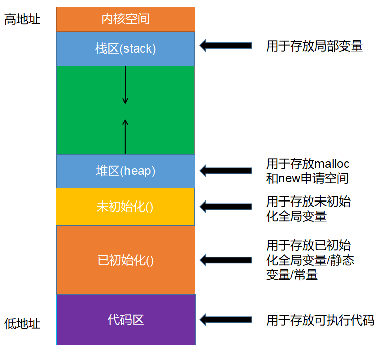

## 栈内存(Stack)

- 栈中存放任意类型的变量，但必须是 auto 类型修饰的，即自动类型的局部变量， 随用随开，用完即消。
- 内存的分配和销毁系统自动完成，不需要人工干预
- 栈的最大尺寸固定，超出则引起栈溢出

- 局部变量过多，过大 或 递归层数太多等就会导致栈溢出

```
int ages[10240*10240]; // 程序会崩溃, 栈溢出
#include <stdio.h>

int main()
{
    // 存储在栈中, 内存地址从大到小
    int a = 10;
    int b = 20;
    printf("&a = %p\n", &a); // &a = 0060FEAC
    printf("&b = %p\n", &b); // &b = 0060FEA8

    return 0;
}
```

------

## 堆内存(Heap)

- 堆内存可以存放任意类型的数据，但需要自己申请与释放
- 堆大小，想像中的无穷大，但实际使用中，受限于实际内存的大小和内存是否连续性

```
int *p = (int *)malloc(10240 * 1024); // 不一定会崩溃
#include <stdio.h>
#include <stdlib.h>

int main()
{
    // 存储在栈中, 内存地址从小到大
    int *p1 = malloc(4);
    *p1 = 10;
    int *p2 = malloc(4);
    *p2 = 20;
   
    printf("p1 = %p\n", p1); //  p1 = 00762F48
    printf("p2 = %p\n", p2); // p2 = 00762F58

    return 0;
}
```

## malloc函数

| 函数声明           | void * malloc(size_t _Size);                          |
| :----------------- | :---------------------------------------------------- |
| 所在文件           | stdlib.h                                              |
| 函数功能           | 申请堆内存空间并返回,所申请的空间并未初始化。         |
| 常见的初始化方法是 | memset 字节初始化。                                   |
| 参数及返回解析     |                                                       |
| 参数               | size_t _size 表示要申请的字符数                       |
| 返回值             | void * 成功返回非空指针指向申请的空间 ，失败返回 NULL |

## free函数

- 注意: 通过malloc申请的存储空间一定要释放, 所以malloc和free函数总是成对出现

| 函数声明       | void free(void *p);        |
| :------------- | :------------------------- |
| 所在文件       | stdlib.h                   |
| 函数功能       | 释放申请的堆内存           |
| 参数及返回解析 |                            |
| 参数           | void* p 指向手动申请的空间 |
| 返回值         | void 无返回                |

## calloc函数

| 函数声明       | void *calloc(size_t nmemb, size_t size);              |
| :------------- | :---------------------------------------------------- |
| 所在文件       | stdlib.h                                              |
| 函数功能       | 申请堆内存空间并返回，所申请的空间，自动清零          |
| 参数及返回解析 |                                                       |
| 参数           | size_t nmemb 所需内存单元数量                         |
| 参数           | size_t size 内存单元字节数量                          |
| 返回值         | void * 成功返回非空指针指向申请的空间 ，失败返回 NULL |

## realloc函数

| 函数声明       | void *realloc(void *ptr, size_t size);                       |
| :------------- | :----------------------------------------------------------- |
| 所在文件       | stdlib.h                                                     |
| 函数功能       | 扩容(缩小)原有内存的大小。通常用于扩容，缩小会会导致内存缩去的部分数据丢失。 |
| 参数及返回解析 |                                                              |
| 参数           | void * ptr 表示待扩容(缩小)的指针， ptr 为之前用 malloc 或者 calloc 分配的内存地址。 |
| 参数           | size_t size 表示扩容(缩小)后内存的大小。                     |
| 返回值         | void* 成功返回非空指针指向申请的空间 ，失败返回 NULL。       |

- 注意点:
- - 若参数ptr==NULL，则该函数等同于 malloc
  - 返回的指针，可能与 ptr 的值相同，也有可能不同。若相同，则说明在原空间后面申请，否则，则可能后续空间不足，重新申请的新的连续空间，原数据拷贝到新空间， 原有空间自动释放

```c++
int main()
{
    // 1.申请4个字节存储空间
    int *p = NULL;
    p = realloc(p, sizeof(int)); // 此时等同于malloc
    // 2.使用申请好的空间
    *p = 666;
    printf("*p = %i\n",  *p);
    // 3.释放空间
    free(p);

    return 0;
}
```

## 链表

### 动态链表

- 静态链表的意义不是很大，主要原因，数据存储在栈上，栈的存储空间有限，不能动态分配。所以链表要实现存储的自由，要动态的申请堆里的空间。
- 有一个点要说清楚，我们的实现的链表是带头节点。至于，为什么带头节点，需等大家对链表有个整体的的认知以后，再来体会，会更有意义。
- 空链表

- 头指针带了一个空链表节点, 空链表节点中的next指向NULL

```c++
// 1.定义链表节点
typedef struct node{
    int data;
    struct node *next;
}Node;
int main()
{
    Node *head = createList();
    return 0;
}
// 创建空链表
Node *createList(){
    // 1.创建一个节点
    Node *node = (Node *)malloc(sizeof(Node));
    if(node == NULL){
        exit(-1);
    }
    // 2.设置下一个节点为NULL
    node->next = NULL;
    // 3.返回创建好的节点
    return node;
}
```

- 非空链表

- 头指针带了一个非空节点, 最后一个节点中的next指向NULL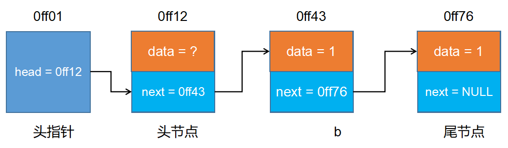

### 动态链表头插法

- 1.让新节点的下一个节点等于头结点的下一个节点
- 2.让头节点的下一个节点等于新节点

```
#include <stdio.h>
#include <stdlib.h>

// 1.定义链表节点
typedef struct node{
    int data;
    struct node *next;
}Node;
Node *createList();
void printNodeList(Node *node);
int main()
{
    Node *head = createList();
    printNodeList(head);
    return 0;
}
/**
 * @brief createList 创建链表
 * @return  创建好的链表
 */
Node *createList(){
    // 1.创建头节点
    Node *head = (Node *)malloc(sizeof(Node));
    if(head == NULL){
        return NULL;
    }
    head->next = NULL;

    // 2.接收用户输入数据
    int num = -1;
    printf("请输入节点数据\n");
    scanf("%i", &num);

    // 3.通过循环创建其它节点
    while(num != -1){
        // 3.1创建一个新的节点
        Node *cur = (Node *)malloc(sizeof(Node));
        cur->data = num;

        // 3.2让新节点的下一个节点指向头节点的下一个节点
        cur->next = head->next;
        // 3.3让头节点的下一个节点指向新节点
        head->next = cur;

        // 3.4再次接收用户输入数据
        scanf("%i", &num);
    }

    // 3.返回创建好的节点
    return head;
}
/**
 * @brief printNodeList 遍历链表
 * @param node 链表指针头
 */
void printNodeList(Node *node){
    Node *head = node->next;
    while(head != NULL){
        int currentData = head->data;
        printf("currentData = %i\n", currentData);
        head = head->next;
    }
}
```

### 动态链表尾插法

- 1.定义变量记录新节点的上一个节点
- 2.将新节点添加到上一个节点后面
- 3.让新节点成为下一个节点的上一个节点

```
#include <stdio.h>
#include <stdlib.h>

// 1.定义链表节点
typedef struct node{
    int data;
    struct node *next;
}Node;
Node *createList();
void printNodeList(Node *node);
int main()
{
    Node *head = createList();
    printNodeList(head);
    return 0;
}
/**
 * @brief createList 创建链表
 * @return  创建好的链表
 */
Node *createList(){
    // 1.创建头节点
    Node *head = (Node *)malloc(sizeof(Node));
    if(head == NULL){
        return NULL;
    }
    head->next = NULL;

    // 2.接收用户输入数据
    int num = -1;
    printf("请输入节点数据\n");
    scanf("%i", &num);

    // 3.通过循环创建其它节点
    // 定义变量记录上一个节点
    Node *pre = head;
    while(num != -1){
        // 3.1创建一个新的节点
        Node *cur = (Node *)malloc(sizeof(Node));
        cur->data = num;

        // 3.2让新节点链接到上一个节点后面
        pre->next = cur;
        // 3.3当前节点下一个节点等于NULL
        cur->next = NULL;
        // 3.4让当前节点编程下一个节点的上一个节点
        pre = cur;

        // 3.5再次接收用户输入数据
        scanf("%i", &num);
    }

    // 3.返回创建好的节点
    return head;
}
/**
 * @brief printNodeList 遍历链表
 * @param node 链表指针头
 */
void printNodeList(Node *node){
    Node *head = node->next;
    while(head != NULL){
        int currentData = head->data;
        printf("currentData = %i\n", currentData);
        head = head->next;
    }
}
```

### 动态链优化

```
#include <stdio.h>
#include <stdlib.h>

// 1.定义链表节点
typedef struct node{
    int data;
    struct node *next;
}Node;
Node *createList();
void printNodeList(Node *node);
void insertNode1(Node *head, int data);
void insertNode2(Node *head, int data);
int main()
{
    // 1.创建一个空链表
    Node *head = createList();
    // 2.往空链表中插入数据
    insertNode1(head, 1);
    insertNode1(head, 3);
    insertNode1(head, 5);
    printNodeList(head);
    return 0;
}
/**
 * @brief createList 创建空链表
 * @return  创建好的空链表
 */
Node *createList(){
    // 1.创建头节点
    Node *head = (Node *)malloc(sizeof(Node));
    if(head == NULL){
        return NULL;
    }
    head->next = NULL;
    // 3.返回创建好的节点
    return head;
}
/**
 * @brief insertNode1 尾插法插入节点
 * @param head 需要插入的头指针
 * @param data 需要插入的数据
 * @return  插入之后的链表
 */
void insertNode1(Node *head, int data){
    // 1.定义变量记录最后一个节点
    Node *pre = head;
    while(pre != NULL && pre->next != NULL){
        pre = pre->next;
    }
    // 2.创建一个新的节点
    Node *cur = (Node *)malloc(sizeof(Node));
    cur->data = data;

    // 3.让新节点链接到上一个节点后面
    pre->next = cur;
    // 4.当前节点下一个节点等于NULL
    cur->next = NULL;
    // 5.让当前节点编程下一个节点的上一个节点
    pre = cur;
}
/**
 * @brief insertNode1 头插法插入节点
 * @param head 需要插入的头指针
 * @param data 需要插入的数据
 * @return  插入之后的链表
 */
void insertNode2(Node *head, int data){
    // 1.创建一个新的节点
    Node *cur = (Node *)malloc(sizeof(Node));
    cur->data = data;

    // 2.让新节点的下一个节点指向头节点的下一个节点
    cur->next = head->next;
    // 3.让头节点的下一个节点指向新节点
    head->next = cur;
}
/**
 * @brief printNodeList 遍历链表
 * @param node 链表指针头
 */
void printNodeList(Node *node){
    Node *head = node->next;
    while(head != NULL){
        int currentData = head->data;
        printf("currentData = %i\n", currentData);
        head = head->next;
    }
}
```

### 链表销毁

```
/**
 * @brief destroyList 销毁链表
 * @param head 链表头指针
 */
void destroyList(Node *head){
    Node *cur = NULL;
    while(head != NULL){
        cur = head->next;
        free(head);
        head = cur;
    }
}
```

### 链表长度计算

```
/**
 * @brief listLength 计算链表长度
 * @param head 链表头指针
 * @return 链表长度
 */
int listLength(Node *head){
    int count = 0;
    head = head->next;
    while(head){
       count++;
       head = head->next;
    }
    return count;
}
```

### 链表查找

```
/**
 * @brief searchList 查找指定节点
 * @param head 链表头指针
 * @param key 需要查找的值
 * @return
 */
Node *searchList(Node *head, int key){
    head = head->next;
    while(head){
        if(head->data == key){
            break;
        }else{
            head = head->next;
        }
    }
    return head;
}
```

### 链表删除

```
void deleteNodeList(Node *head, Node *find){
    while(head->next != find){
        head = head->next;
    }
    head->next = find->next;
    free(find);
}
```

### 给链表排序

```c
/**
 * @brief bubbleSort 对链表进行排序
 * @param head 链表头指针
 */
void bubbleSort(Node *head){
    // 1.计算链表长度
    int len = listLength(head);
    // 2.定义变量记录前后节点
    Node *cur = NULL;
   // 3.相邻元素进行比较, 进行冒泡排序
    for(int i = 0; i < len - 1; i++){
        cur = head->next;
        for(int j = 0; j < len - 1 - i; j++){
            printf("%i, %i\n", cur->data, cur->next->data);
            if((cur->data) > (cur->next->data)){
                int temp = cur->data;
                cur->data = cur->next->data;
                cur->next->data = temp;
            }
            cur = cur->next;
        }
    }
}
/**
 * @brief sortList 对链表进行排序
 * @param head 链表头指针
 */
void sortList(Node *head){
    // 0.计算链表长度
    int len = listLength(head);
    // 1.定义变量保存前后两个节点
    Node *sh, *pre, *cur;
    for(int i = 0; i < len - 1; i ++){
        sh = head; // 头节点
        pre = sh->next; // 第一个节点
        cur = pre->next; // 第二个节点
        for(int j = 0; j < len - 1 - i; j++){
            if(pre->data > cur->data){
                // 交换节点位置
                sh->next = cur;
                pre->next = cur->next;
                cur->next = pre;
                // 恢复节点名称
                Node *temp = pre;
                pre = cur;
                cur = temp;
            }
            // 让所有节点往后移动
            sh = sh->next;
            pre = pre->next;
            cur = cur->next;
        }
    }
}
```

### 链表反转

```c
/**
 * @brief reverseList 反转链表
 * @param head 链表头指针
 */
void reverseList(Node *head){
    // 1.将链表一分为二
    Node *pre, *cur;
    pre = head->next;
    head->next = NULL;
    // 2.重新插入节点
    while(pre){
        cur = pre->next;
        pre->next = head->next;
        head->next = pre;

        pre = cur;
    }
}
```

# 输出与输入

## 输出

- - 类型字符串用以表示输出数据的类型, 其格式符和意义如下所示

| 类型  | 含义                                |
| :---- | :---------------------------------- |
| d     | 有符号10进制整型                    |
| i     | 有符号10进制整型                    |
| u     | 无符号10进制整型                    |
| o     | 无符号8进制整型                     |
| x     | 无符号16进制整型                    |
| X     | 无符号16进制整型                    |
| f     | 单、双精度浮点数(默认保留6位小数)   |
| e / E | 以指数形式输出单、双精度浮点数      |
| g / G | 以最短输出宽度,输出单、双精度浮点数 |
| c     | 字符                                |
| s     | 字符串                              |
| p     | 地址                                |

```c
int main(){
    int a = 10;
    int b = -10;
    float c = 6.6f;
    double d = 3.1415926;
    double e = 10.10;
    char f = 'a';
    // 有符号整数(可以输出负数)
    printf("a = %d\n", a); // 10
    printf("a = %i\n", a); // 10

    // 无符号整数(不可以输出负数)
    printf("a = %u\n", a); // 10
    printf("b = %u\n", b); // 429496786

    // 无符号八进制整数(不可以输出负数)
    printf("a = %o\n", a); // 12
    printf("b = %o\n", b); // 37777777766

    // 无符号十六进制整数(不可以输出负数)
    printf("a = %x\n", a); // a
    printf("b = %x\n", b); // fffffff6

    // 无符号十六进制整数(不可以输出负数)
    printf("a = %X\n", a); // A
    printf("b = %X\n", b); // FFFFFFF6

    // 单、双精度浮点数(默认保留6位小数)
    printf("c = %f\n", c); // 6.600000
    printf("d = %lf\n", d); // 3.141593

    // 以指数形式输出单、双精度浮点数
    printf("e = %e\n", e); // 1.010000e+001
    printf("e = %E\n", e); // 1.010000E+001
    
    // 以最短输出宽度,输出单、双精度浮点数
    printf("e = %g\n", e); // 10.1
    printf("e = %G\n", e); // 10.1
    
    // 输出字符
    printf("f = %c\n", f); // a
}
```

宽度

- - 格式: `printf("a = %[标志][宽度]类型", a);`

| 标志 | 含义                                                  |
| :--- | :---------------------------------------------------- |
| -    | 左对齐, 默认右对齐                                    |
| +    | 当输出值为正数时,在输出值前面加上一个+号, 默认不显示  |
| 0    | 右对齐时, 用0填充宽度.(默认用空格填充)                |
| 空格 | 输出值为正数时,在输出值前面加上空格, 为负数时加上负号 |
| #    | 对c、s、d、u类型无影响                                |
| #    | 对o类型, 在输出时加前缀o                              |
| #    | 对x类型,在输出时加前缀0x                              |

精度

- - 格式: `printf("a = %[精度]类型", a);`
  - 精度格式符以"."开头, 后面跟上十进制整数, 用于指定需要输出多少位小数, 如果输出位数大于指定的精度, 则删除超出的部分

```c
int main(){
    double a = 3.1415926;
    printf("a = %.2f\n", a); // 3.14
}
```


- 动态指定保留小数位数

- - 格式: `printf("a = %.*f", a);`

```
#include <stdio.h>
int main(){
    double a = 3.1415926;
    printf("a = %.*f", 2, a); // 3.14
}
```

- 实型(浮点类型)有效位数问题

- - 对于单精度数,使用%f格式符输出时,仅前6~7位是有效数字
  - 对于双精度数,使用%lf格式符输出时,前15~16位是有效数字
  - 有效位数和精度(保留多少位)不同, 有效位数是指从第一个非零数字开始,误差不超过本数位半个单位的、精确可信的数位
  - 有效位数包含小数点前的非零数位

```
#include <stdio.h>
int main(){
    //        1234.567871093750000
    float a = 1234.567890123456789;
    //         1234.567890123456900
    double b = 1234.567890123456789;
    printf("a = %.15f\n", a); // 前8位数字是准确的, 后面的都不准确
    printf("b = %.15f\n", b); // 前16位数字是准确的, 后面的都不准确
}
```

长度

- - 格式: `printf("a = %[长度]类型", a);`

| 长度 | 修饰类型      | 含义               |
| :--- | :------------ | :----------------- |
| hh   | d、i、o、u、x | 输出char           |
| h    | d、i、o、u、x | 输出 short int     |
| l    | d、i、o、u、x | 输出 long int      |
| ll   | d、i、o、u、x | 输出 long long int |

```
#include <stdio.h>
int main(){
    char a = 'a';
    short int b = 123;
    int  c = 123;
    long int d = 123;
    long long int e = 123;
    printf("a = %hhd\n", a); // 97
    printf("b = %hd\n", b); // 123
    printf("c = %d\n", c); // 123
    printf("d = %ld\n", d); // 123
    printf("e = %lld\n", e); // 123
}
```

- 转义字符

- - 格式: `printf("%f%%", 3.1415);`
  - %号在格式控制字符串中有特殊含义, 所以想输出%必须添加一个转移字符

```c
#include <stdio.h>
int main(){
    printf("%f%%", 3.1415); // 输出结果3.1415%
}
```

## 输入

### sscanf允许原理

- 系统会将用户输入的内容先放入输入缓冲区
- scanf方式会从输入缓冲区中逐个取出内容赋值给变量
- 如果输入缓冲区的内容不为空,scanf会一直从缓冲区中获取,而不要求再次输入

#### 清空输入缓冲区

- 利用fflush方法清空缓冲区(不是所有平台都能使用)

- - 格式: `fflush(stdin);`
  - C和C++的标准里从来没有定义过 fflush(stdin)
  - MSDN 文档里清除的描述着"fflush on input stream is an extension to the C standard" （fflush 是在标准上扩充的函数, 不是标准函数, 所以不是所有平台都支持）

- 利用setbuf方法清空缓冲区(所有平台有效)

- - 格式: `setbuf(stdin, NULL);`

- ## putchar和getchar

- - putchar: 向屏幕输出一个字符

- ```
  #include <stdio.h>
  int main(){
      char ch = 'a';
      putchar(ch); // 输出a
  }
  ```

- - getchar: 从键盘获得一个字符

- ```c
  #include <stdio.h>
  int main(){
      char ch;
      ch = getchar();// 获取一个字符
      printf("ch = %c\n", ch);
  }
  ```


# 循环相关

- break注意点:

- - break离开应用范围，存在是没有意义的

```c
if(1) {
  break; // 会报错
}
```

- 在多层循环中,一个break语句只向外跳一层

```c
while(1) {
  while(2) {
    break;// 只对while2有效, 不会影响while1
  }
  printf("while1循环体\n");
}
```

- break下面不可以有语句，因为执行不到

```c
while(2){
  break;
  printf("打我啊!");// 执行不到
}
```

------

- continue

- 结束**本轮**循环，进入**下一轮**循环

- continue注意点:

- continue离开应用范围，存在是没有意义的

```
if(1) {
  continue; // 会报错
}
```

------

- goto
- 这是一个不太值得探讨的话题，goto 会破坏结构化程序设计流程，它将使程序层次不清，且不易读，所以慎用
- goto 语句，仅能在本函数内实现跳转，不能实现跨函数跳转(短跳转)。但是他在跳出多重循环的时候效率还是蛮高的

# 算法的特性

特性：（1）有穷性；（2）确定性；（3）有零个或多个输入；（4）有一个或多个输出；（5）有效性。

## 算法几种结构

- 顺序结构：由顺序执行的一组语句或结构组成。
- 分支结构：根据判断条件，做出取舍，要么执行A分支要么执行B分支，必须执行其中的一个，不可全执行也不可全不执行。
- 循环结构：由需要反复执行的一段代码或者结构组成。
  任何算法功能都可以通过以上三种基本程序结构的组合来实现。-

## 查找

- **实现步骤**
- 在有序表中,取中间元素作为比较对象,若给定值与中间元素的要查找的数相等,则查找成功;
- 若给定值小于中间元素的要查找的数,则在中间元素的左半区继续查找;
- 若给定值大于中间元素的要查找的数,则在中间元素的右半区继续查找。
- 不断重复上述查找过 程,直到查找成功,或所查找的区域无数据元素,查找失败。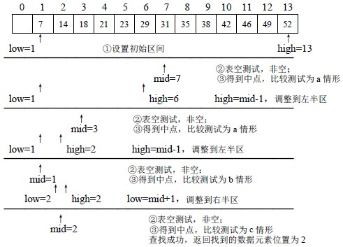

```c
int findKey(int values[], int length, int key) {
    // 定义一个变量记录最小索引
    int min = 0;
    // 定义一个变量记录最大索引
    int max = length - 1;
    // 定义一个变量记录中间索引
    int mid = (min + max) * 0.5;
    
    while (min <= max) {
        // 如果mid对应的值 大于 key, 那么max要变小
        if (values[mid] > key) {
            max = mid - 1;
            // 如果mid对应的值 小于 key, 那么min要变
        }else if (values[mid] < key) {
            min = mid + 1;
        }else {
            return mid;
        }
        // 修改完min/max之后, 重新计算mid的值
        mid = (min + max) * 0.5;
    }
    return -1;
}
```


# c位运算符使用

| 位运算符 | 含义     |
| -------- | -------- |
| <<       | 左移     |
| >>       | 右移     |
| ~        | 取反     |
| \|       | 按位或   |
| &        | 按位与   |
| ^        | 按位异或 |


# 程序编译过程

## gcc的编译过程？

gcc编译过程分为4个阶段：预处理、编译、汇编、链接。 预处理：头文件包含、宏替换、条件编译、删除注释 编译：主要进行词法、语句、语义分析等，检查无误后将预处理好的文件编译成汇编文件。 汇编：将汇编文件转换成二进制目标文件 链接：将项目中的各个二进制文件+所需的库+启动代码链接成可执行文件。

- 编译就是将我们编写的源代码“翻译”成计算机可以识别的二进制格式，它们以目标文件的形式存在；
- 链接就是一个“打包”的过程，它将所有的目标文件以及系统组件组合成一个可执行文件。

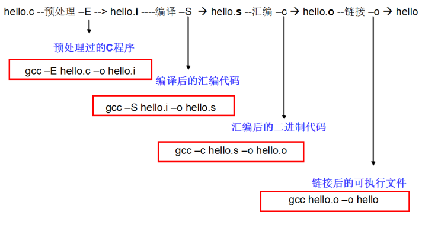

## c的执行过程

(1) file.c是源文件,通过编辑得到; (2) file.obj 是目标文件,即计算机能够处理的由二进制指令组成的文件,通过对源文件进行编译得到; (3) file.exe 是可执行文件,通过将目标文件与其他目标文件或库函数连接得到。

内存的最小存储单位以及内存的最小计量单位分别是？

内存的最小存储单位为二进制，内存的最小计量单位是字节

# 地址和指针的区别

1.由float x=3e-6,y=3e-6;不能得到x= =y的逻辑值为真。
解析：float类型的变量只能进行>或<运算，不能进行==运算
2.自增和自减运算：
int a=5；a++；使用时a=5；使用完a=a+1；a=6；
int a=5；++a；使用前a=a+1；使用时a=6；
3.只有在使用时才为该类型变量分配[内存](https://so.csdn.net/so/search?q=内存&spm=1001.2101.3001.7020)的存储类型是auto和register
4.形参和实参的区别和联系
（1）形参变量只有在函数被调用时才会分配内存，调用结束后，立刻释放内存，所以形参变量只有在函数内部有效，不能在函数外部使用。
（2）实参可以是常量、变量、表达式、函数等，无论实参是何种类型的数据，在进行函数调用时，它们都必须有确定的值，以便把这些值传送给形参，所以应该提前用赋值、输入等办法使实参获得确定值。
（3）实参和形参在数量上、类型上、顺序上必须严格一致，否则会发生“类型不匹配”的错误。当然，如果能够进行自动类型转换，或者进行了强制类型转换，那么实参类型也可以不同于形参类型。
（4）函数调用中发生的数据传递是单向的，只能把实参的值传递给形参，而不能把形参的值反向地传递给实参；换句话说，一旦完成数据的传递，实参和形参就再也没有瓜葛了，所以，在函数调用过程中，形参的值发生改变并不会影响实参。


1. 引用必须被初始化，指针不必。 2) 引用初始化以后不能被改变，指针可以改变所指的对象。 3) 不存在指向空值的引用，但是存在指向空值的指针。 指针通过某个指针变量指向一个对象后，对它所指向的变量间接操作。程序中使用指针，程序的可读性差；而引用本身就是目标变量的别名，对引用的操作就是对目标变量的操作

## 指针

- 虽然在同一种编译器下, 所有指针占用的内存空间是一样的,但不同类型的变量却占不同的字节数

- 一个int占用4个字节，一个char占用1个字节，而一个double占用8字节；
- 现在只有一个地址，我怎么才能知道要从这个地址开始向后访问多少个字节的存储空间呢，是4个，是1个，还是8个。
- 所以指针变量需要它所指向的数据类型告诉它要访问多少个字节存储空间

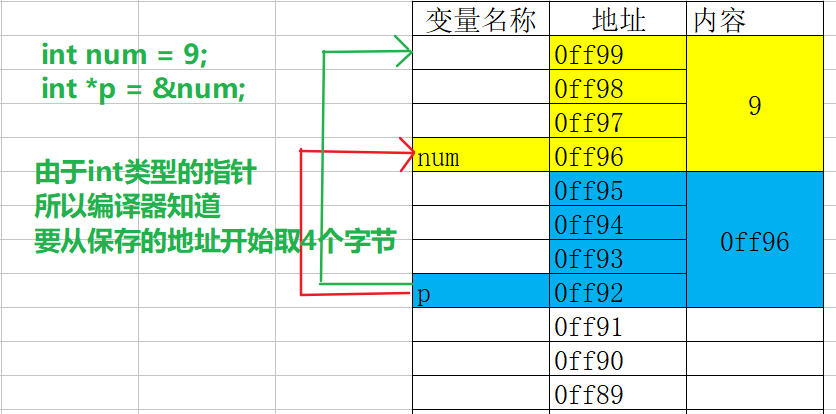

### 二级指针

- 如果一个指针变量存放的又是另一个指针变量的地址,则称这个指针变量为指向指针的指针变量。也称为“二级指针”

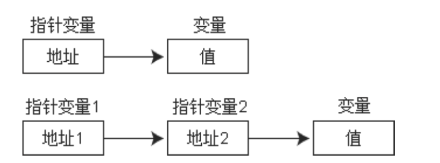

- 多级指针的取值规则

```c
int ***m1;  //取值***m1
int *****m2; //取值*****m2
```

如果指针变量p已指向数组中的一个元素,则p+1`指向`同一数组中的下一个元素,p-1`指向`同 一数组中的上一个元素

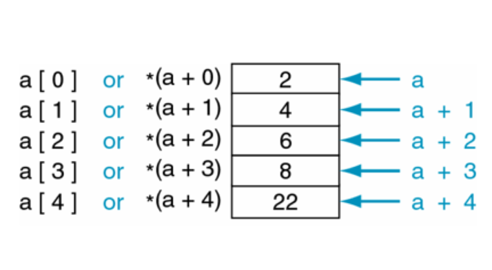

- 数组名虽然是数组的首地址，但是数组名所所保存的数组的首地址是不可以更改的

## 指向函数指针

- 为什么指针可以指向一个函数？

  - 函数作为一段程序，在内存中也要占据部分存储空间，它也有一个起始地址

  - 函数有自己的地址，那就好办了，我们的指针变量就是用来存储地址的。

  - 因此可以利用一个指针指向一个函数。其中，函数名就代表着函数的地址。

- 指针函数的定义

- 格式: `返回值类型 (*指针变量名)(形参1, 形参2, ...);`

- 指针函数定义技巧

  - 1、把要指向函数头拷贝过来

  - 2、把函数名称使用小括号括起来

  - 3、在函数名称前面加上一个*

  - 4、修改函数名称

- 应用场景

  - 调用函数

  - 将函数作为参数在函数间传递

- 注意点:

  - 由于这类指针变量存储的是一个函数的入口地址，所以对它们作加减运算(比如p++)是无意义的

  - 函数调用中"(指针变量名)"的两边的括号不可少,其中的不应该理解为求值运算,在此处它 只是一种表示符号

# 结构体

## 结构体类型作用域

- 结构类型定义在函数内部的作用域与局部变量的作用域是相同的

- 从定义的那一行开始, 直到遇到return或者大括号结束为止

- 结构类型定义在函数外部的作用域与全局变量的作用域是相同的

- 从定义的那一行开始,直到本文件结束为止

## 结构体数组

- 结构体数组和普通数组并无太大差异, 只不过是数组中的元素都是结构体而已
- 格式:  `struct 结构体类型名称 数组名称[元素个数]`

```
struct Student {
    char *name;
    int age;
};
struct Student stu[2]; 
```

- 结构体数组初始化和普通数组也一样, 分为先定义后初始化和定义同时初始化

- - 定义同时初始化

```
struct Student {
    char *name;
    int age;
};
struct Student stu[2] = {{"lnj", 35},{"zs", 18}}; 
```

- 

- - 先定义后初始化

```
struct Student {
    char *name;
    int age;
};
struct Student stu[2]; 
stu[0] = {"lnj", 35};
stu[1] = {"zs", 18};
```

------

## 结构体指针

- 一个指针变量当用来指向一个结构体变量时,称之为结构体指针变量
- 格式: `struct 结构名 *结构指针变量名`
- 示例:

```
      // 定义一个结构体类型
      struct Student {
          char *name;
          int age;
      };

     // 定义一个结构体变量
     struct Student stu = {“lnj", 18};

     // 定义一个指向结构体的指针变量
     struct Student *p;

    // 指向结构体变量stu
    p = &stu;

     /*
      这时候可以用3种方式访问结构体的成员
      */
     // 方式1：结构体变量名.成员名
     printf("name=%s, age = %d \n", stu.name, stu.age);

     // 方式2：(*指针变量名).成员名
     printf("name=%s, age = %d \n", (*p).name, (*p).age);

     // 方式3：指针变量名->成员名
     printf("name=%s, age = %d \n", p->name, p->age);

     return 0;
 }
```

- 通过结构体指针访问结构体成员, 可以通过以下两种方式

- (*结构指针变量).成员名
- 结构指针变量->成员名(用熟)

> - (pstu)两侧的括号不可少,因为成员符“.”的优先级高于“”。
> - 如去掉括号写作pstu.num则等效于(pstu.num),这样,意义就完全不对了。

## 结构体变量占用存储空间大小

```
    struct Person{
        int age; // 4
        char ch; // 1
        double score; // 8
    };
    struct Person p;
    printf("sizeof = %i\n", sizeof(p)); // 16
```

- 占用内存最大属性是score, 占8个字节, 所以第一次会分配8个字节
- 将第一次分配的8个字节分配给age4个,分配给ch1个, 还剩下3个字节
- 当需要分配给score时, 发现只剩下3个字节, 所以会再次开辟8个字节存储空间
- 一共开辟了两次8个字节空间, 所以最终p占用16个字节

```
    struct Person{
        int age; // 4
        double score; // 8
        char ch; // 1
    };
    struct Person p;
    printf("sizeof = %i\n", sizeof(p)); // 24
```

- 占用内存最大属性是score, 占8个字节, 所以第一次会分配8个字节
- 将第一次分配的8个字节分配给age4个,还剩下4个字节
- 当需要分配给score时, 发现只剩下4个字节, 所以会再次开辟8个字节存储空间
- 将新分配的8个字节分配给score, 还剩下0个字节
- 当需要分配给ch时, 发现上一次分配的已经没有了, 所以会再次开辟8个字节存储空间
- 一共开辟了3次8个字节空间, 所以最终p占用24个字节

## 结构体嵌套定义

- 成员也可以又是一个结构,即构成了嵌套的结构

```
struct Date{
     int month;
     int day;
     int year;
}
struct  stu{
     int num;
    char *name;
    char sex;
    struct Date birthday;
    Float score;
}
```

- 在stu中嵌套存储Date结构体内容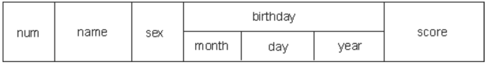

> - 注意:
> - 结构体不可以嵌套自己变量,可以嵌套指向自己这种类型的指针
>
> ```
> struct Student {
>    int age;
>    struct Student stu;
> };
> ```

- 对嵌套结构体成员的访问

- - 如果某个成员也是结构体变量，可以连续使用成员运算符"."访问最低一级成员

```
struct Date {
       int year;
       int month;
       int day;
  };

  struct Student {
      char *name;
      struct Date birthday;
 };

 struct Student stu;
 stu.birthday.year = 1986;
 stu.birthday.month = 9;
 stu.birthday.day = 10;
```

------

## 结构体和函数

- 结构体虽然是构造类型, 但是结构体之间赋值是值拷贝, 而不是地址传递

```
    struct Person{
        char *name;
        int age;
    };
    struct Person p1 = {"lnj", 35};
    struct Person p2;
    p2 = p1;
    p2.name = "zs"; // 修改p2不会影响p1
    printf("p1.name = %s\n", p1.name); // lnj
    printf("p2.name = %s\n", p2.name); //  zs
```

- 所以结构体变量作为函数形参时也是值传递, 在函数内修改形参, 不会影响外界实参

```
#include <stdio.h>

struct Person{
    char *name;
    int age;
};

void test(struct Person per);

int main()
{
    struct Person p1 = {"lnj", 35};
    printf("p1.name = %s\n", p1.name); // lnj
    test(p1);
    printf("p1.name = %s\n", p1.name); // lnj
    return 0;
}
void test(struct Person per){
    per.name = "zs";
}
```

------

## 共用体

- 和结构体不同的是, 结构体的每个成员都是占用一块独立的存储空间, 而共用体所有的成员都占用同一块存储空间
- 和结构体一样, 共用体在使用之前必须先定义共用体类型, 再定义共用体变量
- 定义共用体类型格式:

```
union 共用体名{
    数据类型 属性名称;
    数据类型 属性名称;
    ...   ....
};
```

- 定义共用体类型变量格式:

```
union 共用体名 共用体变量名称;
```

- 特点: 由于所有属性共享同一块内存空间, 所以只要其中一个属性发生了改变, 其它的属性都会受到影响
- 示例:

```
    union Test{
        int age;
        char ch;
    };
    union Test t;
    printf("sizeof(p) = %i\n", sizeof(t));

    t.age = 33;
    printf("t.age = %i\n", t.age); // 33
    t.ch = 'a';
    printf("t.ch = %c\n", t.ch); // a
    printf("t.age = %i\n", t.age); // 97
```

- 共用体的应用场景

- - （1）通信中的数据包会用到共用体，因为不知道对方会发送什么样的数据包过来，用共用体的话就简单了，定义几种格式的包，收到包之后就可以根据包的格式取出数据。
  - （2）节约内存。如果有2个很长的数据结构，但不会同时使用，比如一个表示老师，一个表示学生，要统计老师和学生的情况，用结构体就比较浪费内存，这时就可以考虑用共用体来设计。+（3）某些应用需要大量的临时变量，这些变量类型不同，而且会随时更换。而你的堆栈空间有限，不能同时分配那么多临时变量。这时可以使用共用体让这些变量共享同一个内存空间，这些临时变量不用长期保存，用完即丢，和寄存器差不多，不用维护。

# 全局变量和局部变量

- 变量作用域基本概念

- 变量作用域：变量的可用范围
- 按照作用域的不同，变量可以分为：局部变量和全局变量

- 局部变量

- 定义在函数内部的变量以及函数的形参, 我们称为局部变量
- 作用域：从定义的那一行开始, 直到遇到}结束或者遇到return为止
- 生命周期: 从程序运行到定义哪一行开始分配存储空间到程序离开该变量所在的作用域
- 存储位置: 局部变量会存储在内存的栈区中
- 特点：
- 相同作用域内不可以定义同名变量
- 不同作用范围可以定义同名变量，内部作用域的变量会覆盖外部作用域的变量

- 全局变量

- 定义在函数外面的变量称为全局变量
- 作用域范围：从定义哪行开始直到文件结尾
- 生命周期:程序一启动就会分配存储空间,直到程序结束
- 存储位置：静态存储区
- 特点: 多个同名的全局变量指向同一块存储空间

# 关键字

## auto和register关键字

- auto关键字(忘记)

- 只能修饰局部变量, 局部变量如果没有其它修饰符, 默认就是auto的
- 特点: 随用随开, 用完即销

```
auto int num; // 等价于 int num;
```

- register关键字(忘记)

- 只能修饰局部变量, 原则上将内存中变量提升到CPU寄存器中存储, 这样访问速度会更快
- 但是由于CPU寄存器数量相当有限,  通常不同平台和编译器在优化阶段会自动转换为auto

```
register int num; 
```

## static关键字

- **对局部变量的作用**

- 延长局部变量的生命周期,从程序启动到程序退出,但是它并没有改变变量的作用域
- 定义变量的代码在整个程序运行期间仅仅会执行一次

```
#include <stdio.h>
void test();
int main()
{
    test();
    test();
    test();

    return 0;
}
void test(){
    static int num = 0; // 局部变量
    num++; 
    // 如果不加static输出 1 1 1
    // 如果添加static输出 1 2 3
    printf("num = %i\n", num); 
}
```

- **对全局变量的作用**
- 全局变量分类：

- 内部变量:只能在本文件中访问的变量
- 外部变量:可以在其他文件中访问的变量,默认所有全局变量都是外部变量

- 默认情况下多个同名的全局变量共享一块空间, 这样会导致全局变量污染问题
- 如果想让某个全局变量只在某个文件中使用, 并且不和其他文件中同名全局变量共享同一块存储空间, 那么就可以使用static

```
// A文件中的代码
int num; // 和B文件中的num共享
void test(){
    printf("ds.c中的 num = %i\n", num);
}
// B文件中的代码
#include <stdio.h>
#include "ds.h"

int num; // 和A文件中的num共享
int main()
{
    num = 666;
    test(); // test中输出666
    return 0;
}
// A文件中的代码
static int num; // 不和B文件中的num共享
void test(){
    printf("ds.c中的 num = %i\n", num);
}
// B文件中的代码
#include <stdio.h>
#include "ds.h"

int num; // 不和A文件中的num共享
int main()
{
    num = 666;
    test(); // test中输出0
    return 0;
}
```

------

## extern关键字

- 对局部变量的作用

- extern不能用于局部变量
- extern代表声明一个变量, 而不是定义一个变量, 变量只有定义才会开辟存储空间
- 所以如果是局部变量, 虽然提前声明有某个局部变量, 但是局部变量只有执行到才会分配存储空间

```
#include <stdio.h>

int main()
{
    extern int num;
    num = 998; // 使用时并没有存储空间可用, 所以声明了也没用
    int num; // 这里才会开辟
    printf("num = %i\n", num);
    return 0;
}
```

- 对全局变量的作用

- 声明一个全局变量, 代表告诉编译器我在其它地方定义了这个变量, 你可以放心使用

```
#include <stdio.h>

int main()
{
    extern int num; // 声明我们有名称叫做num变量
    num = 998; // 使用时已经有对应的存储空间
    printf("num = %i\n", num);
    return 0;
}
int num; // 全局变量, 程序启动就会分配存储空间
```

------

## static与extern对函数的作用

- 内部函数:只能在本文件中访问的函数
- 外部函数:可以在本文件中以及其他的文件中访问的函数
- 默认情况下所有的函数都是外部函数
- **static 作用**
- 声明一个内部函数

```
static int sum(int num1,int num2);
```

- 定义一个内部函数

```
static int sum(int num1,int num2)
{
  return num1 + num2;
}
```

- **extern作用**

- 声明一个外部函数

```
extern int sum(int num1,int num2);
```

- 定义一个外部函数

```
extern int sum(int num1,int num2)
{
  return num1 + num2;
}
```

> - 注意点:
> - 由于默认情况下所有的函数都是外部函数, 所以extern一般会省略
> - 如果只有函数声明添加了static与extern, 而定义中没有添加static与extern, 那么无效

## typedef关键字

- C语言不仅􏰀供了丰富的数据类型,而且还允许由用户自己定义类型说明符,也就是说允许由用户为数据类型取“别名”。
- 格式: `typedef 原类型名 新类型名;`

- 其中原类型名中含有定义部分,新类型名一般用大写表示,以便于区别。
- 有时也可用宏定义来代替typedef的功能,但是宏定义是由预处理完成的,而typedef则是在编译 时完成的,后者更为灵活方便。##typedef使用

- 基本数据类型

```
typedef int INTEGER
INTEGER a; // 等价于 int a;
```

- 也可以在别名的基础上再起一个别名

```
typedef int Integer;

typedef Integer MyInteger;
```

- 用typedef定义数组、指针、结构等类型将带来很大的方便,不仅使程序书写简单而且使意义更为 明确,因而增强了可读性。
- 数组类型

```
typedef char NAME[20]; // 表示NAME是字符数组类型,数组长度为20。然后可用NAME 说明变量,
NAME a; // 等价于 char a[20];
```

- 结构体类型

- 第一种形式:

```
 struct Person{
    int age;
    char *name;
};

typedef struct Person PersonType;
+ 第二种形式:
typedef struct Person{
    int age;
    char *name;
} PersonType;
+ 第三种形式:
typedef struct {
    int age;
    char *name;
} PersonType;
```

- 枚举

- 第一种形式:

```
enum Sex{
    SexMan,
    SexWoman,
    SexOther
};
typedef enum Sex SexType;
+ 第二种形式:
typedef enum Sex{
    SexMan,
    SexWoman,
    SexOther
} SexType;
+ 第三种形式:
typedef enum{
    SexMan,
    SexWoman,
    SexOther
} SexType;
```

- 指针

- typedef与指向结构体的指针

```
 // 定义一个结构体并起别名
  typedef struct {
      float x;
      float y;
  } Point;

 // 起别名
 typedef Point *PP;
```

- typedef与指向函数的指针

```
// 定义一个sum函数，计算a跟b的和
  int sum(int a, int b) {
      int c = a + b;
      printf("%d + %d = %d", a, b, c);
      return c;
 }
 typedef int (*MySum)(int, int);

// 定义一个指向sum函数的指针变量p
 MySum p = sum;
```

## 宏定义与函数以及typedef区别

- 与函数的区别

- 从整个使用过程可以发现，带参数的宏定义，在源程序中出现的形式与函数很像。但是两者是有本质区别的：
- 1> 宏定义不涉及存储空间的分配、参数类型匹配、参数传递、返回值问题
- 2> 函数调用在程序运行时执行，而宏替换只在编译预处理阶段进行。所以带参数的宏比函数具有更高的执行效率

- typedef和#define的区别

- 用宏定义表示数据类型和用typedef定义数据说明符的区别。
- 宏定义只是简单的字符串替换,是在预处理完成的
- typedef是在编译时处理的,它不是作简单的代换,而是对类型说明符重新命名。被命名的标识符具有类型定义说明的功能

```
typedef char *String;
int main(int argc, const char * argv[])
{
     String str = "This is a string!";
     return 0;
}


#define String char *
int main(int argc, const char * argv[])
{
    String str = "This is a string!";
     return 0;
}
typedef char *String1; // 给char *起了个别名String1
#define String2 char * // 定义了宏String2
int main(int argc, const char * argv[]) {
        /*
        只有str1、str2、str3才是指向char类型的指针变量
        由于String1就是char *，所以上面的两行代码等于:
        char *str1;
        char *str2;
        */
      String1 str1, str2;
        /*
        宏定义只是简单替换, 所以相当于
        char *str3, str4;
        *号只对最近的一个有效, 所以相当于
        char *str3;
        char str4;
        */
      String2 str3, str4;
      return 0;
}
```

## const关键字

- const是一个类型修饰符

- 使用const修饰变量则可以让变量的值不能改变 ##const有什么主要的作用?

- (1)可以定义const常量,具有不可变性

```
const int Max=100;
int Array[Max];
```

- (2)便于进行类型检查,使编译器对处理内容有更多了解,消除了一些隐患。

```
 void f(const int i) { .........}
```

- 编译器就会知道i是一个常量,不允许修改;

- (3)可以避免意义模糊的数字出现,同样可以很方便地进行参数的调整和修改。同宏定义一样,可以做到不变则已,一变都变!如(1)中,如果想修改Max的内容,只需要:const int Max=you want;即可!
- (4)可以保护被修饰的东西,防止意外的修改,增强程序的健壮性。还是上面的例子,如果在 函数体内修改了i,编译器就会报错;

```
void f(const int i) { i=10;//error! }
```

- (5) 可以节省空间,避免不必要的内存分配。

```
#define PI 3.14159 //常量宏
const doulbe Pi=3.14159; //此时并未将Pi放入ROM中 ...... double i=Pi; //此时为Pi分配内存,以后不再分配!
double I=PI; //编译期间进行宏替换,分配内存
double j=Pi; //没有内存分配
double J=PI; //再进行宏替换,又一次分配内存! const定义常量从汇编的角度来看,只是给出了对应的内存地址,而不是象#define一样给出的是立即数,所以,const定义的常量在程序运行过程中只有一份拷贝,而#define定义的常量在内存 中有若干个拷贝。
```

- (6) 􏰀高了效率。编译器通常不为普通const常量分配存储空间,而是将它们保存在符号表 中,这使得它成为一个编译期间的常量,没有了存储与读内存的操作,使得它的效率也很高。

------

## 如何使用const?

- (1)修饰一般常量一般常量是指简单类型的常量。这种常量在定义时,修饰符const可以用在类型说明符前,也可以用在类型说明符后

```
int const x=2; 或 const int x=2;
```

- (当然,我们可以偷梁换柱进行更新: 通过强制类型转换,将地址赋给变量,再作修改即可以改变const常量值。)

```
    // const对于基本数据类型, 无论写在左边还是右边, 变量中的值不能改变
    const int a = 5;
    // a = 666; // 直接修改会报错
    // 偷梁换柱, 利用指针指向变量
    int *p;
    p = &a;
    // 利用指针间接修改变量中的值
    *p = 10;
    printf("%d\n", a); 
    printf("%d\n", *p);
```

- (2)修饰常数组(值不能够再改变了)定义或说明一个常数组可采用如下格式:

```
int const a[5]={1, 2, 3, 4, 5};
const int a[5]={1, 2, 3, 4, 5};
const int a[5]={1, 2, 3, 4, 5};
a[1] = 55; // 错误
```

- (3)修饰函数的常参数const修饰符也可以修饰函数的传递参数,格式如下:void Fun(const int Var); 告诉编译器Var在函数体中的无法改变,从而防止了使用者的一些无 意的或错误的修改。
- (4)修饰函数的返回值: const修饰符也可以修饰函数的返回值,是返回值不可被改变,格式如 下:

```
const int Fun1();
const MyClass Fun2();
```

- (5)修饰常指针

- - const int *A; //const修饰指针,A可变,A指向的值不能被修改
  - int const *A; //const修饰指向的对象,A可变,A指向的对象不可变
  - int *const A; //const修饰指针A, A不可变,A指向的对象可变
  - const int *const A;//指针A和A指向的对象都不可变

- 技巧

```
 先看“*”的位置
 如果const 在 *的左侧 表示值不能修改,但是指向可以改。
 如果const 在 *的右侧 表示指向不能改,但是值可以改
 如果在“*”的两侧都有const 标识指向和值都不能改。
```


# 条件编译

## 条件编译

- 在很多情况下，我们希望程序的其中一部分代码只有在满足一定条件时才进行编译，否则不参与编译(只有参与编译的代码最终才能被执行)，这就是条件编译。

- 为什么要使用条件编译

- - 1)按不同的条件去编译不同的程序部分,因而产生不同的目标代码文件。有利于程序的移植和调试。
  - 2)条件编译当然也可以用条件语句来实现。但是用条件语句将会对整个源程序进行编译,生成 的目标代码程序很长,而采用条件编译,则根据条件只编译其中的程序段1或程序段2,生成的目 标程序较短。##if-#else 条件编译指令

- 第一种格式:

- - 它的功能是,如常量表达式的值为真(非0),则将code1 编译到程序中,否则对code2编译到程序中。
  - 注意:
  - 是将代码编译进可执行程序, 而不是执行代码
  - 条件编译后面的条件表达式中不能识别变量,它里面只能识别常量和宏定义

# 文件

- 文件流:
  - C 语言把文件看作是一个字符的序列，即文件是由一个一个字符组成的字符流，因此 c 语言将文件也称之为文件流。

- 文件分类

  - 文本文件
    - 以 ASCII 码格式存放，**一个字节存放一个字符**。`文本文件的每一个字节存放一个 ASCII 码，代表一个字符`。这便于对字符的逐个处理，但占用存储空间 较多，而且要花费时间转换。

  - .c文件就是以文本文件形式存放的

  - 二进制文件

    - 以补码格式存放。二进制文件是把数据以二进制数的格式存放在文件中的，其占用存储空间较少。`数据按其内存中的存储形式原样存放`

    - .exe文件就是以二进制文件形式存放的

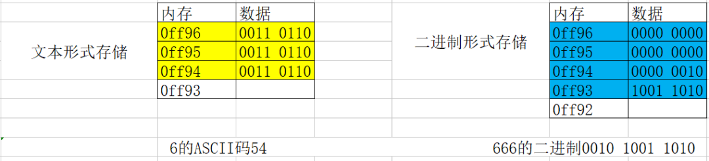

文本工具默认会按照ASCII码逐个直接解码文件, 由于文本文件存储的就是ASCII码, 所以可以正常解析显示, 由于二进制文件存储的不是ASCII码, 所以解析出来之后是乱码

## fileopen函数

| 函数声明 | FILE * fopen ( const char * filename, const char * mode );   |
| :------- | :----------------------------------------------------------- |
| 所在文件 | stdio.h                                                      |
| 函数功能 | 以 mode 的方式，打开一个 filename 命名的文件，返回一个指向该文件缓冲的 FILE 结构体指针。 |

|参数及返回解析 |参数| char*filaname :要打开，或是创建文件的路径。| |参数| char*mode :打开文件的方式。| |返回值| FILE* 返回指向文件缓冲区的指针，该指针是后序操作文件的句柄。|

| mode | 处理方式  | 当文件不存在时 | 当文件存在时     | 向文件输入 | 从文件输出 |
| :--- | :-------- | :------------- | :--------------- | :--------- | :--------- |
| r    | 读取      | 出错           | 打开文件         | 不能       | 可以       |
| w    | 写入      | 建立新文件     | 覆盖原有文件     | 可以       | 不能       |
| a    | 追加      | 建立新文件     | 在原有文件后追加 | 可以       | 不能       |
| r+   | 读取/写入 | 出错           | 打开文件         | 可以       | 可以       |
| w+   | 写入/读取 | 建立新文件     | 覆盖原有文件     | 可以       | 可以       |
| a+   | 读取/追加 | 建立新文件     | 在原有文件后追加 | 可以       | 可以       |

> 注意点:
>
> - Windows如果读写的是二进制文件，则还要加 b,比如 rb, r+b 等。unix/linux 不区分文本和二进制文件

## fclose函数

| 函数声明       | int fclose ( FILE * stream );                                |
| :------------- | :----------------------------------------------------------- |
| 所在文件       | stdio.h                                                      |
| 函数功能       | fclose()用来关闭先前 fopen()打开的文件.                      |
| 函数功能       | 此动作会让缓冲区内的数据写入文件中, 并释放系统所提供的文件资源 |
| 参数及返回解析 |                                                              |
| 参数           | FILE* stream :指向文件缓冲的指针。                           |
| 返回值         | int 成功返回 0 ，失败返回 EOF(-1)。                          |

```c
#include <stdio.h>

int main()
{
    FILE *fp = fopen("test.txt", "w+");
    fclose(fp);
    return 0;
}
```

## 不同类型读写

### 一次读写一个字符

- 写入

| 函数声明       | int fputc (int ch, FILE * stream );                  |
| :------------- | :--------------------------------------------------- |
| 所在文件       | stdio.h                                              |
| 函数功能       | 将 ch 字符，写入文件。                               |
| 参数及返回解析 |                                                      |
| 参数           | FILE* stream :指向文件缓冲的指针。                   |
| 参数           | int : 需要写入的字符。                               |
| 返回值         | int 写入成功，返回写入成功字符，如果失败，返回 EOF。 |

```
#include <stdio.h>

int main()
{
    // 1.打开一个文件
    FILE *fp = fopen("test.txt", "w+");

    // 2.往文件中写入内容
    for(char ch = 'a'; ch <= 'z'; ch++){
        // 一次写入一个字符
        char res = fputc(ch, fp);
        printf("res = %c\n", res);
    }

    // 3.关闭打开的文件
    fclose(fp);
    return 0;
}
```

- 读取

| 函数声明       | int fgetc ( FILE * stream );                           |
| :------------- | :----------------------------------------------------- |
| 所在文件       | stdio.h                                                |
| 函数功能       | 从文件流中读取一个字符并返回。                         |
| 参数及返回解析 |                                                        |
| 参数           | FILE* stream :指向文件缓冲的指针。                     |
| 返回值         | int 正常，返回读取的字符；读到文件尾或出错时，为 EOF。 |

```
#include <stdio.h>

int main()
{
    // 1.打开一个文件
    FILE *fp = fopen("test.txt", "r+");

    // 2.从文件中读取内容
    char res = EOF;
    while((res = fgetc(fp)) != EOF){
        printf("res = %c\n", res);
    }

    // 3.关闭打开的文件
    fclose(fp);
    return 0;
}
```

- 判断文件末尾

- - feof函数

| 函数声明       | int feof( FILE * stream );                |
| :------------- | :---------------------------------------- |
| 所在文件       | stdio.h                                   |
| 函数功能       | 判断文件是否读到文件结尾                  |
| 参数及返回解析 |                                           |
| 参数           | FILE* stream :指向文件缓冲的指针。        |
| 返回值         | int 0 未读到文件结尾，非零 读到文件结尾。 |

```
#include <stdio.h>

int main()
{
    // 1.打开一个文件
    FILE *fp = fopen("test.txt", "r+");

    // 2.从文件中读取内容
    char res = EOF;
    // 注意: 由于只有先读了才会修改标志位,
    // 所以通过feof判断是否到达文件末尾, 一定要先读再判断, 不能先判断再读
    while((res = fgetc(fp)) && (!feof(fp))){
        printf("res = %c\n", res);
    }

    // 3.关闭打开的文件
    fclose(fp);
    return 0;
}
```

> - 注意点:
> - feof 这个函数，是去读标志位判断文件是否结束的。
> - 而标志位只有读完了才会被修改, 所以如果先判断再读标志位会出现多打一次的的现象
> - 所以企业开发中使用feof函数一定要先读后判断, 而不能先判断后读

- 作业

- 实现文件的简单加密和解密

```
#include <stdio.h>
#include <string.h>
void encode(char *name, char *newName, int code);
void decode(char *name, char *newName, int code);
int main()
{
    encode("main.c", "encode.c", 666);
    decode("encode.c", "decode.c", 666);
    return 0;
}
/**
 * @brief encode 加密文件
 * @param name 需要加密的文件名称
 * @param newName 加密之后的文件名称
 * @param code 秘钥
 */
void encode(char *name, char *newName, int code){
    FILE *fw = fopen(newName, "w+");
    FILE *fr = fopen(name, "r+");
    char ch = EOF;
    while((ch = fgetc(fr)) && (!feof(fr))){
        fputc(ch ^ code, fw);
    }
    fclose(fw);
    fclose(fr);
}
/**
 * @brief encode 解密文件
 * @param name 需要解密的文件名称
 * @param newName 解密之后的文件名称
 * @param code 秘钥
 */
void decode(char *name, char *newName, int code){
    FILE *fw = fopen(newName, "w+");
    FILE *fr = fopen(name, "r+");
    char ch = EOF;
    while((ch = fgetc(fr)) && (!feof(fr))){
        fputc(ch ^ code, fw);
    }
    fclose(fw);
    fclose(fr);
}
```

------

### 一次读写一行字符

- 什么是行
  - 行是文本编辑器中的概念，文件流中就是一个字符。这个在不同的平台是有差异的。window 平台 '\r\n'，linux 平台是'\n'

- 平台差异

  - ​	windows 平台在写入'\n'是会体现为'\r\n'，linux 平台在写入'\n'时会体现为'\n'。windows 平台在读入'\r\n'时，体现为一个字符'\n'，linux 平台在读入'\n'时，体现为一个字符'\n'

  - linux 读 windows 中的换行，则会多读一个字符，windows 读 linux 中的换行，则没有问题

```
#include <stdio.h>

int main()
{
    FILE *fw = fopen("test.txt", "w+");
    fputc('a', fw);
    fputc('\n', fw);
    fputc('b', fw);
    fclose(fw);
    return 0;
}
```

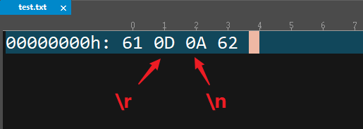

------

### 写入一行

| 函数声明       | int fputs(char *str,FILE *fp)             |
| :------------- | :---------------------------------------- |
| 所在文件       | stdio.h                                   |
| 函数功能       | 把 str 指向的字符串写入 fp 指向的文件中。 |
| 参数及返回解析 |                                           |
| 参数           | char * str : 表示指向的字符串的指针。     |
| 参数           | FILE *fp : 指向文件流结构的指针。         |
| 返回值         | int 正常，返 0；出错返 EOF。              |

```
#include <stdio.h>

int main()
{
    FILE *fw = fopen("test.txt", "w+");
    // 注意: fputs不会自动添加\n
    fputs("lnj\n", fw);
    fputs("it666\n", fw);
    fclose(fw);
    return 0;
}
```

- 遇到\0自动终止写入

```
#include <stdio.h>

int main()
{
    FILE *fp = fopen("test.txt", "w+");
    // 注意: fputs写入时遇到\0就会自动终止写入
    fputs("lnj\0it666\n", fp);

    fclose(fp);
    return 0;
}
```

------

### 读取一行

| 函数声明       | char *fgets(char *str,int length,FILE *fp)                   |
| :------------- | :----------------------------------------------------------- |
| 所在文件       | stdio.h                                                      |
| 函数功能       | 从 fp 所指向的文件中，至多读 length-1 个字符，送入字符数组 str 中， 如果在读入 length-1 个字符结束前遇\n 或 EOF，读入即结束，字符串读入后在最后加一个‘\0’字符。 |
| 参数及返回解析 |                                                              |
| 参数           | char * str :指向需要读入数据的缓冲区。                       |
| 参数           | int length :每一次读数字符的字数。                           |
| 参数           | FILE*  fp :文件流指针。                                      |
| 返回值         | char * 正常，返 str 指针；出错或遇到文件结尾 返空指针 NULL。 |

- 最多只能读取N-1个字符

```
#include <stdio.h>

int main()
{
    FILE *fp = fopen("test.txt", "w+");
    // 注意: fputs不会自动添加\n
    fputs("it666\n", fp);

    // 将FILE结构体中的读写指针重新移动到最前面
    // 注意: FILE结构体中读写指针每读或写一个字符后都会往后移动
    rewind(fp);
    char str[1024];
    // 从fp中读取4个字符, 存入到str中
    // 最多只能读取N-1个字符, 会在最后自动添加\0
    fgets(str, 4, fp);

    printf("str = %s", str); // it6
    fclose(fp);
    return 0;
}
```

- 遇到\n自动结束

```
#include <stdio.h>
int main()
{
    FILE *fp = fopen("test.txt", "w+");
    // 注意: fputs不会自动添加\n
    fputs("lnj\n", fp);
    fputs("it666\n", fp);

    // 将FILE结构体中的读写指针重新移动到最前面
    // 注意: FILE结构体中读写指针每读或写一个字符后都会往后移动
    rewind(fp);
    char str[1024];
    // 从fp中读取1024个字符, 存入到str中
    // 但是读到第4个就是\n了, 函数会自动停止读取
    // 注意点: \n会被读取进来
    fgets(str, 1024, fp);

    printf("str = %s", str); // lnj
    fclose(fp);
    return 0;
}
```

- 读取到EOF自动结束

```
#include <stdio.h>

int main()
{
    FILE *fp = fopen("test.txt", "w+");
    // 注意: fputs不会自动添加\n
    fputs("lnj\n", fp);
    fputs("it666", fp);

    // 将FILE结构体中的读写指针重新移动到最前面
    // 注意: FILE结构体中读写指针每读或写一个字符后都会往后移动
    rewind(fp);
    char str[1024];
    // 每次从fp中读取1024个字符, 存入到str中
    // 读取到文件末尾自动结束
    while(fgets(str, 1024, fp)){
        printf("str = %s", str);
    }
    fclose(fp);
    return 0;
}
```

- 注意点:

- - 企业开发中能不用feof函数就不用feof函数
  - 如果最后一行，没有行‘\n’的话则少读一行

```
#include <stdio.h>

int main()
{
    FILE *fp = fopen("test.txt", "w+");
    // 注意: fputs不会自动添加\n
    fputs("12345678910\n", fp);
    fputs("12345678910\n", fp);
    fputs("12345678910", fp);

    // 将FILE结构体中的读写指针重新移动到最前面
    // 注意: FILE结构体中读写指针每读或写一个字符后都会往后移动
    rewind(fp);
    char str[1024];
    // 每次从fp中读取1024个字符, 存入到str中
    // 读取到文件末尾自动结束
    while(fgets(str, 1024, fp) && !feof(fp)){
        printf("str = %s", str);
    }
    fclose(fp);
    return 0;
}
```

### 一次读写一块数据

- C 语言己经从接口的层面区分了，文本的读写方式和二进制的读写方式。前面我们讲的是文本的读写方式。
- 所有的文件接口函数，要么以 '\0'，表示输入结束，要么以 '\n'， EOF(0xFF)表示读取结束。'\0' '\n' 等都是文本文件的重要标识，而所有的二进制接口对于这些标识，是不敏感的。+二进制的接口可以读文本，而文本的接口不可以读二进制

- 一次写入一块数据

| 函数声明 | int fwrite(void *buffer, int num_bytes, int count, FILE *fp) |
| :------- | :----------------------------------------------------------- |
| 所在文件 | stdio.h                                                      |
| 函数功能 | 把buffer 指向的数据写入fp 指向的文件中                       |
| 参数     | char * buffer : 指向要写入数据存储区的首地址的指针           |
|          | int num_bytes: 每个要写的字段的字节数count                   |
|          | int count : 要写的字段的个数                                 |
|          | FILE* fp : 要写的文件指针                                    |
| 返回值   | int 成功，返回写的字段数；出错或文件结束，返回 0。           |

```c
#include <stdio.h>
#include <string.h>

int main()
{
    FILE *fp = fopen("test.txt", "wb+");
    // 注意: fwrite不会关心写入数据的格式
    char *str = "lnj\0it666";
     /*
     * 第一个参数: 被写入数据指针
     * 第二个参数: 每次写入多少个字节
     * 第三个参数: 需要写入多少次
     * 第四个参数: 已打开文件结构体指针
     */
    fwrite((void *)str, 9, 1, fp);

    fclose(fp);
    return 0;
}
```

- 一次读取一块数据

| 函数声明 | int fread(void  *buffer,  int  num_bytes,  int count, FILE *fp) |
| :------- | :----------------------------------------------------------- |
| 所在文件 | stdio.h                                                      |
| 函数功能 | 把fp 指向的文件中的数据读到 buffer 中。                      |
| 参数     | char * buffer : 指向要读入数据存储区的首地址的指针           |
|          | int num_bytes: 每个要读的字段的字节数count                   |
|          | int count : 要读的字段的个数                                 |
|          | FILE* fp : 要读的文件指针                                    |
| 返回值   | int 成功，返回读的字段数；出错或文件结束，返回 0。           |

```c
#include <stdio.h>

int main()
{
    // test.txt中存放的是"lnj\0it666"
    FILE *fr = fopen("test.txt", "rb+");
    char buf[1024] = {0};
    // fread函数读取成功返回读取到的字节数, 读取失败返回0
    /*
     * 第一个参数: 存储读取到数据的容器
     * 第二个参数: 每次读取多少个字节
     * 第三个参数: 需要读取多少次
     * 第四个参数: 已打开文件结构体指针
     */ 
    int n = fread(buf, 1, 1024, fr);
    printf("%i\n", n);
    for(int i = 0; i < n; i++){
        printf("%c", buf[i]);
    }
    fclose(fr);
    return 0;
}
```

> - 注意点:
> - 读取时num_bytes应该填写读取数据类型的最小单位, 而count可以随意写
> - 如果读取时num_bytes不是读取数据类型最小单位, 会引发读取失败
> - 例如:  存储的是char类型  6C 6E 6A 00 69 74 36 36 36 如果num_bytes等于1, count等于1024, 那么依次取出 6C 6E 6A 00 69 74 36 36 36 , 直到取不到为止 如果num_bytes等于4, count等于1024, 那么依次取出[6C 6E 6A 00][69 74 36 36] , 但是最后还剩下一个36, 但又不满足4个字节, 那么最后一个36则取不到

```c
#include <stdio.h>

int main()
{

    FILE *fp = fopen("test.txt", "wb+");
    int ages[4] = {1, 3, 5, 6};
    fwrite(ages, sizeof(ages), 1, fp);
    rewind(fp);
    int data;
    while(fread(&data, sizeof(int), 1, fp) > 0){
        printf("data = %i\n", data);
    }
    return 0;
}
```

## 读写结构体

- 结构体中的数据类型不统一，此时最适合用二进制的方式进行读写
- 读写单个结构体

```
#include <stdio.h>

typedef struct{
    char *name;
    int age;
    double height;
} Person;

int main()
{
    Person p1 = {"lnj", 35, 1.88};
//    printf("name = %s\n", p1.name);
//    printf("age = %i\n", p1.age);
//    printf("height = %lf\n", p1.height);

    FILE *fp = fopen("person.stu", "wb+");
    fwrite(&p1, sizeof(p1), 1, fp);

    rewind(fp);
    Person p2;
    fread(&p2, sizeof(p2), 1, fp);
    printf("name = %s\n", p2.name);
    printf("age = %i\n", p2.age);
    printf("height = %lf\n", p2.height);

    return 0;
}
```

- 读写结构体数组

```
#include <stdio.h>

typedef struct{
    char *name;
    int age;
    double height;
} Person;

int main()
{
    Person ps[] = {
      {"zs", 18, 1.65},
      {"ls", 21, 1.88},
      {"ww", 33, 1.9}
    };


    FILE *fp = fopen("person.stu", "wb+");
    fwrite(&ps, sizeof(ps), 1, fp);

    rewind(fp);
    Person p;
    while(fread(&p, sizeof(p), 1, fp) > 0){
        printf("name = %s\n", p.name);
        printf("age = %i\n", p.age);
        printf("height = %lf\n", p.height);
    }
    return 0;
}
```

- 读写结构体链表

```
#include <stdio.h>
#include <stdlib.h>

typedef struct person{
    char *name;
    int age;
    double height;
    struct person* next;
} Person;
Person *createEmpty();
void  insertNode(Person *head, char *name, int age, double height);
void printfList(Person *head);
int saveList(Person *head, char *name);
Person *loadList(char *name);

int main()
{

//    Person *head = createEmpty();
//    insertNode(head, "zs", 18, 1.9);
//    insertNode(head, "ls", 22, 1.65);
//    insertNode(head, "ws", 31, 1.78);
//    printfList(head);
//    saveList(head, "person.list");
    Person *head = loadList("person.list");
    printfList(head);
    return 0;
}

/**
 * @brief loadList 从文件加载链表
 * @param name 文件名称
 * @return  加载好的链表头指针
 */
Person *loadList(char *name){
    // 1.打开文件
    FILE *fp = fopen(name, "rb+");
    if(fp == NULL){
        return NULL;
    }
    // 2.创建一个空链表
    Person *head = createEmpty();
    // 3.创建一个节点
    Person *node = (Person *)malloc(sizeof(Person));
    while(fread(node, sizeof(Person), 1, fp) > 0){
        // 3.进行插入
        // 3.1让新节点的下一个节点 等于 头节点的下一个节点
        node->next = head->next;
        // 3.2让头结点的下一个节点 等于 新节点
        head->next = node;

        // 给下一个节点申请空间
        node = (Person *)malloc(sizeof(Person));
    }
    // 释放多余的节点空间
    free(node);
    fclose(fp);
    return head;
}

/**
 * @brief saveList 存储链表到文件
 * @param head 链表头指针
 * @param name 存储的文件名称
 * @return  是否存储成功 -1失败 0成功
 */
int saveList(Person *head, char *name){
    // 1.打开文件
    FILE *fp = fopen(name, "wb+");
    if(fp == NULL){
        return -1;
    }
    // 2.取出头节点的下一个节点
    Person *cur = head->next;
    // 3.将所有有效节点保存到文件中
    while(cur != NULL){
        fwrite(cur, sizeof(Person), 1, fp);
        cur = cur->next;
    }
    fclose(fp);
    return 0;
}
/**
 * @brief printfList 遍历链表
 * @param head 链表的头指针
 */
void printfList(Person *head){
    // 1.取出头节点的下一个节点
    Person *cur = head->next;
    // 2.判断是否为NULL, 如果不为NULL就开始遍历
    while(cur != NULL){
        // 2.1取出当前节点的数据, 打印
        printf("name = %s\n", cur->name);
        printf("age = %i\n", cur->age);
        printf("height = %lf\n", cur->height);
        printf("next = %x\n", cur->next);
        printf("-----------\n");
        // 2.2让当前节点往后移动
        cur = cur->next;
    }
}

/**
 * @brief insertNode 插入新的节点
 * @param head 链表的头指针
 * @param p 需要插入的结构体
 */
void  insertNode(Person *head, char *name, int age, double height){
    // 1.创建一个新的节点
    Person *node = (Person *)malloc(sizeof(Person));
    // 2.将数据保存到新节点中
    node->name = name;
    node->age = age;
    node->height = height;

    // 3.进行插入
    // 3.1让新节点的下一个节点 等于 头节点的下一个节点
    node->next = head->next;
    // 3.2让头结点的下一个节点 等于 新节点
    head->next = node;
}
/**
 * @brief createEmpty 创建一个空链表
 * @return 链表头指针, 创建失败返回NULL
 */
Person *createEmpty(){
    // 1.定义头指针
    Person *head = NULL;
    // 2.创建一个空节点, 并且赋值给头指针
    head = (Person *)malloc(sizeof(Person));
    if(head == NULL){
        return head;
    }
    head->next = NULL;
    // 3.返回头指针
    return head;
}
```

## 其它文件操作函数

- ftell 函数

| 函数声明       | long ftell ( FILE * stream );                                |
| :------------- | :----------------------------------------------------------- |
| 所在文件       | stdio.h                                                      |
| 函数功能       | 得到流式文件的当前读写位置,其返回值是当前读写位置偏离文件头部的字节数. |
| 参数及返回解析 |                                                              |
| 参数           | FILE * 流文件句柄                                            |
| 返回值         | int 成功，返回当前读写位置偏离文件头部的字节数。失败， 返回-1 |

```
#include <stdio.h>

int main()
{
    char *str = "123456789";
    FILE *fp = fopen("test.txt", "w+");
    long cp = ftell(fp);
    printf("cp = %li\n", cp); // 0
    // 写入一个字节
    fputc(str[0], fp);
    cp = ftell(fp);
    printf("cp = %li\n", cp); // 1
    fclose(fp);
    return 0;
}
```

- rewind 函数

| 函数声明                                  | void rewind ( FILE * stream ); |
| :---------------------------------------- | :----------------------------- |
| 所在文件                                  | stdio.h                        |
| 函数功能 将文件指针重新指向一个流的开头。 |                                |
| 参数及返回解析                            |                                |
| 参数                                      | FILE * 流文件句柄              |
| 返回值                                    | void 无返回值                  |

```
#include <stdio.h>

int main()
{
    char *str = "123456789";
    FILE *fp = fopen("test.txt", "w+");
    long cp = ftell(fp);
    printf("cp = %li\n", cp); // 0
    // 写入一个字节
    fputc(str[0], fp);
    cp = ftell(fp);
    printf("cp = %li\n", cp); // 1
    // 新指向一个流的开头
    rewind(fp);
    cp = ftell(fp);
    printf("cp = %li\n", cp); // 0
    fclose(fp);
    return 0;
}
```

- fseek 函数

| 函数声明       | int fseek ( FILE * stream, long offset, int where); |
| :------------- | :-------------------------------------------------- |
| 所在文件       | stdio.h                                             |
| 函数功能       | 偏移文件指针。                                      |
| 参数及返回解析 |                                                     |
| 参 数          | FILE * stream 文件句柄                              |
|                | long offset 偏移量                                  |
|                | int where 偏移起始位置                              |
| 返回值         | int 成功返回 0 ，失败返回-1                         |

- 常用宏

```
#define SEEK_CUR 1 当前文字
#define SEEK_END 2 文件结尾
#define SEEK_SET 0 文件开头
#include <stdio.h>

int main()
{
    FILE *fp = fopen("test.txt", "w+");
    fputs("123456789", fp);
    // 将文件指针移动到文件结尾, 并且偏移0个单位
    fseek(fp, 0, SEEK_END);
    int len = ftell(fp); // 计算文件长度
    printf("len = %i\n", len);
    fclose(fp);
    return 0;
}
#include <stdio.h>

int main()
{
    FILE *fp;
   fp = fopen("file.txt","w+");
   fputs("123456789", fp);

   fseek( fp, 7, SEEK_SET );
   fputs("lnj", fp);
   fclose(fp);
    return 0;
}
```
