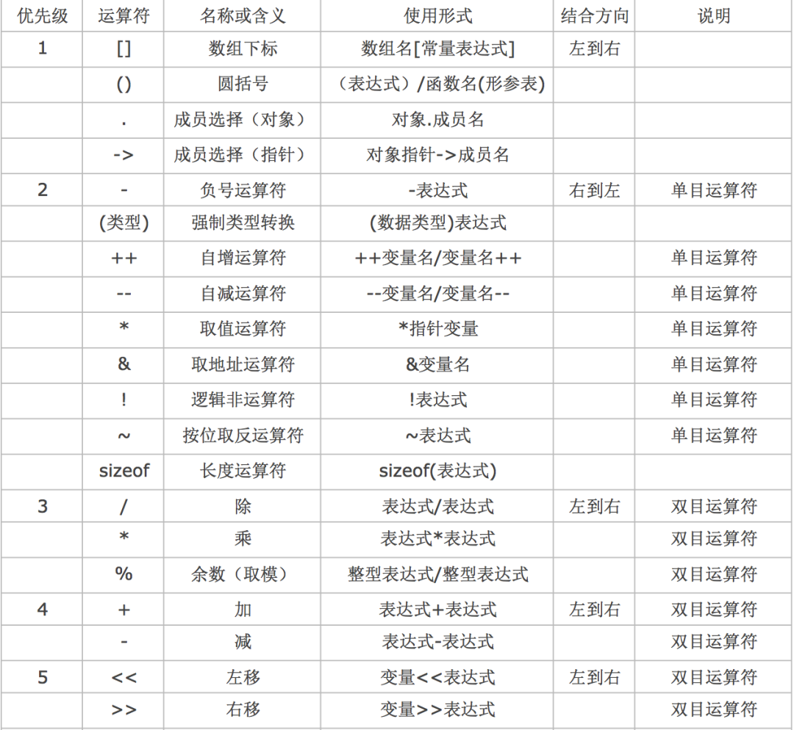

# 进制的转换

十进制整数转换为 N 进制整数采用“除 N 取余，逆序排列”法。具体做法是：

- 将 N 作为除数，用十进制整数除以 N，可以得到一个商和余数；
- 保留余数，用商继续除以 N，又得到一个新的商和余数；
- 仍然保留余数，用商继续除以 N，还会得到一个新的商和余数；
- ……
- 如此反复进行，每次都保留余数，用商接着除以 N，直到商为 0 时为止。

十进制小数转换成 N 进制小数采用“乘 N 取整，顺序排列”法。具体做法是：

- 用 N 乘以十进制小数，可以得到一个积，这个积包含了整数部分和小数部分；
- 将积的整数部分取出，再用 N 乘以余下的小数部分，又得到一个新的积；
- 再将积的整数部分取出，继续用 N 乘以余下的小数部分；
- ……
- 如此反复进行，每次都取出整数部分，用 N 接着乘以小数部分，直到积中的小数部分为 0，或者达到所要求的精度为止。


把取出的整数部分按顺序排列起来，先取出的整数作为 N 进制小数的高位数字，后取出的整数作为低位数字，这样就得到了 N 进制小数。


## C语言中十进制、八进制和十六进制整常量是如何表示的？

- 整型常量即整常数。C整常数可用以下三种形式表示：
- ①十进制整数；
- ②八进制整数：以数字0开头的数是八进制数，如0123表示八进制数123；
- 十六进制整数：以0x开头的数是十六进制数。如0x123，代表十六进制数123；

# 关键字


## \#define定义const定义常亮的区别

```
1、两者的区别
(1) 编译器处理方式不同
#define 宏是在预处理阶段展开。
const 常量是编译运行阶段使用。
(2) 类型和安全检查不同
#define 宏没有类型，不做任何类型检查，仅仅是展开。
const 常量有具体的类型，在编译阶段会执行类型检查。
(3) 存储方式不同
#define宏仅仅是展开，有多少地方使用，就展开多少次，不会分配内存。（宏定义不分配内存，变量定义分配内存。）
const定义的变量属于只读变量。是有分配内存的。
```

Const作用：定义常量、修饰函数参数、修饰函数返回值三个作用。被Const修饰的东西都受到强制保护，可以预防意外的变动，能提高程序的健壮性。 1） const 常量有数据类型，而宏常量没有数据类型。编译器可以对前者进行类型安全检查。而对后者只进行字符替换，没有类型安全检查，并且在字符替换可能会产生意料不到的错误。 2） 有些集成化的调试工具可以对const 常量进行调试，但是不能对宏常量进行调试

## 使用const关键字的情况

### 修饰函数的参数

根据常量指针与指针常量，const修饰函数的参数也是分为三种情况

1、防止修改指针指向的内容

void StringCopy(char *strDestination, const char *strSource);

其中 strSource 是输入参数，strDestination 是输出参数。给 strSource 加上 const 修饰后，如果函数体内的语句试图改动 strSource 的内容，编译器将指出错误。

2、防止修改指针指向的地址

void swap ( int * const p1 , int * const p2 )

指针p1和指针p2指向的地址都不能修改。

3、以上两种的结合。

###  修饰函数的返回值

如果给以“指针传递”方式的函数返回值加 const 修饰，那么函数返回值（即指针）的内容不能被修改，该返回值只能被赋给加const 修饰的同类型指针。 例如函数

const char * GetString(void);

如下语句将出现编译错误：

char *str = GetString();

正确的用法是

const char *str = GetString();

###  修饰全局变量

全局变量的作用域是整个文件，我们应该尽量避免使用全局变量，因为一旦有一个函数改变了全局变量的值，它也会影响到其他引用这个变量的函数，

导致除了bug后很难发现，如果一定要用全局变量，我们应该尽量的使用const修饰符进行修饰，这样防止不必要的人为修改，使用的方法与局部变量是相同的。

### 寄存器变量定义和寄存器读取

例如：

uint32_t* R0 =（uint32*）0x400F00FF; //定义一个地址为0x400F00FF的32bit寄存器变量

正确的定义方法：

uint32_t* const R0 =（uint32*）0x400F00FF; //定义一个指针常量R0指向地址为0x400F00FF的寄存器 这样就保证变量R0指向的地址的唯一性，

若是指向一个只读寄存器则应该按如下定义：

const uint32_t* const R0 =（uint32*）0x400F00FF; //定义一个指向常量的常指针 R0 指向地址为0x400F00FF的只读寄存器，这样就保证变量R0指向的地址的唯一性，同时不会因操作该指针修改指向地址的值

# 数据类型


 int 4字节 %d,%i           float 4字节 %f         double 8字节 %lf   char 1字节 %c

​        枚举: 枚举本质是整形(enum)  场合: 当某个东西只有固定的几个取值的时候,使用枚举

​          特点: 先定义枚举类型,根据枚举类型定义枚举变量

记住常用ascll 

| 符号 | 值   |
| ---- | ---- |
| 0    | 48   |
| A    | 65   |
| a    | 97   |


数组，结构体；

实型字面值常量有两种表示方式：小数形式和指数形式

小数形式：由最前面的额正负号，数字0-9和小数点组成，不允许有其他符号；

指数形式；包括指数和尾数两个不可缺少的部分，用符号E(e)分割；E(e)左边是尾数，为十进制整数或小数形式的实数，右边为指数，必须为十进制整数，表示乘以10的多少次方

## 运算符

sizeof返回占用的存储空间字节数

### strlen与sizeof的区别：

> 1、strlen计算字符串的具体长度（只能是字符串），不包括字符串结束符。返回的是字符个数。
>
> 2、sizeof计算声明后所占的内存数（字节大小），不是实际长度。
>
> 3、sizeof是一个取字节运算符，而strlen是个函数。
>
> 4、sizeof的返回值=字符个数*字符所占的字节数，字符实际长度小于定义的长度，此时字符个数就等于定义的长度。若未给出定义的大小，分类讨论，对于字符串数组，字符大 小等于实际的字符个数+1；对于整型数组，字符个数为实际的字符个数。字符串每个字符占1个字节，整型数据每个字符占的字节数需根据系统的位数类确定，32位占4个字节。

### 运算符优先级

- C语言中,运算符的运算优先级共分为15 级。1 级最高,15 级最低
- 在C语言表达式中,不同优先级的运算符, 运算次序按照由高到低执行

- 在C语言表达式中,相同优先级的运算符, 运算次序按照结合性规定的方向执行



运算符注意：

- 如果参与运算的两个操作数皆为整数, 那么结果也为整数
- 如果参与运算的两个操作数其中一个是浮点数, 那么结果一定是浮点数
- 求余运算符, 本质上就是数学的商和余"中的余数
- 求余运算符, 参与运算的两个操作数必须都是整数, 不能包含浮点数
- 求余运算符, 被除数小于除数, 那么结果就是被除数
- 求余运算符, 运算结果的正负性取决于被除数,跟除数无关, 被除数是正数结果就是正数,被除数是负数结果就是负数
- 求余运算符, 被除数为0, 结果为0
- 求余运算符, 除数为0, 没有意义(不要这样写)

赋值运算符

| 14   | 赋值运算符                | =    | 双目运算符,具有右结合性 |
| ---- | ------------------------- | ---- | ----------------------- |
| 14   | 除后赋值运算符            | /=   | 双目运算符,具有右结合性 |
| 14   | 乘后赋值运算符 (模运算符) | *=   | 双目运算符,具有右结合性 |
| 14   | 取模后赋值运算符          | %=   | 双目运算符,具有右结合性 |
| 14   | 加后赋值运算符            | +=   | 双目运算符,具有右结合性 |
| 14   | 减后赋值运算符            | -=   | 双目运算符,具有右结合性 |

| 优先级 | 名称             | 符号 | 说明                    |
| :----- | :--------------- | :--- | :---------------------- |
| 2      | 自增运算符(在后) | i++  | 单目运算符,具有左结合性 |
| 2      | 自增运算符(在前) | ++i  | 单目运算符,具有右结合性 |
| 2      | 自减运算符(在后) | i--  | 单目运算符,具有左结合性 |
| 2      | 自减运算符(在前) | --i  | 单目运算符,具有右结合性 |

如果出现在一个表达式中, 那么++写在前面和后面就会有所区别

- - 前缀表达式:++x, --x;其中x表示变量名,先完成变量的自增自减1运算,再用x的值作为表达式的值;即“先变后用”,也就是变量的值先变,再用变量的值参与运算
  - 后缀表达式:x++, x--;先用x的当前值作为表达式的值,再进行自增自减1运算。即“先用后变”,也就是先用变量的值参与运算,变量的值再进行自增自减变化

- 自增、自减运算只能用于单个变量,只要是标准类型的变量,不管是整型、实型,还是字符型变量等,但不能用于表达式或常量

## 字符常量和字符串常量的区别

- 字符常量就是一个字符，用单引号括起来，占一个字节；而字符串常量是由若干个字符组合而成，用双引号括起来，存储时自动在后面加“\0”，即使同样是一个字符，字符串常量后面还要加一个“\0”。

## 文本文件和二进制文件的使用场景

- 能存储的数据类型不同：
  文本文件只能存储char型字符变量。
  二进制文件可以存储char/int/short/long/float/…各种变量值。
- 每条数据的长度
  文本文件每条数据通常是固定长度的。
  二进制文件每条数据不固定。
- 读取的软件不同。
  文本文件编辑器就可以读写。
  二进制文件需要特别的解码器。
- 操作系统对换行符（‘\n’）的处理不同（不重要）。
  文本文件，操作系统对‘\n’进行一些隐式变换，因此文本文件直接跨平台使用会出问题。
  二进制文件，操作系统不会对‘\n’进行隐式变换，很多二进制文件（如电影、图片等）可以跨平台使用。


## C语言中，动态存储区主要存放哪些数据？

答：动态存储区中存放以下数据：

1. 函数的形参
2. 函数调用时的现场保护和地址等。
3. Auto register型局部变量

对以上数据，当进行函数调用时分配动态存储空间，当函数调用结束时，释放这些存储单元。在程序的执行过程中，这种分配和释放是动态的

## 类型的转化

- 强制类型转换(显示转换)

```
// 将double转换为int
int a = (int)10.5;
```

- 算数转换

- - 系统会自动对占用内存较少的类型做一个“自动类型提升”的操作, 先将其转换为当前算数表达式中占用内存高的类型, 然后再参与运算

```c
// 当前表达式用1.0占用8个字节, 2占用4个字节
// 所以会先将整数类型2转换为double类型之后再计算
double b = 1.0 / 2;
```

- 赋值转换

```c
// 赋值时左边是什么类型,就会自动将右边转换为什么类型再保存
int a = 10.6;
```

- 注意点:

- 参与计算的是什么类型, 结果就是什么类型

```c
// 结果为0, 因为参与运算的都是整型
double a = (double)(1 / 2);
// 结果为0.5, 因为1被强制转换为了double类型, 2也会被自动提升为double类型
double b = (double)1 / 2;
```

- 类型转换并不会影响到原有变量的值

```c
#include <stdio.h>
int main(){
    double d = 3.14;
    int num = (int)d;
    printf("num = %i\n", num); // 3
    printf("d = %lf\n", d); // 3.140000
}
```

# 内存

| 类型      | 16位编译器 | 32位编译器 | 64位编译器 |
| :-------- | :--------- | :--------- | :--------- |
| char      | 1          | 1          | 1          |
| int       | 2          | 4          | 4          |
| float     | 4          | 4          | 4          |
| double    | 8          | 8          | 8          |
| short     | 2          | 2          | 2          |
| long      | 4          | 4          | 8          |
| long long | 8          | 8          | 8          |
| void*     | 2          | 4          | 8          |

## 内存分配的方式

1、从静态存储区域分配。内存在程序编译的时候就已经分配好，这块内存在程序的整个运行期间都存在。例如全局变量，static变量。 　　

2、在栈上创建。在执行函数时，函数内局部变量的存储单元都可以在栈上创建，函数执行结束时这些存储单元自动被释放。栈内存分配运算内置于处理器的指令集中，效率很高，但是分配的内存容量有限。 　　

3、从堆上分配，亦称动态内存分配。程序在运行的时候用malloc或new申请任意多少的内存，程序员自己负责在何时用free或delete释放内存。动态内存的生存期由程序员决定，使用非常灵活，但如果在堆上分配了空间，就有责任回收它，否则运行的程序会出现内存泄漏，频繁地分配和释放不同大小的堆空间将会产生堆内碎块

# 输出与输入

## 输出

- - 类型字符串用以表示输出数据的类型, 其格式符和意义如下所示

| 类型  | 含义                                |
| :---- | :---------------------------------- |
| d     | 有符号10进制整型                    |
| i     | 有符号10进制整型                    |
| u     | 无符号10进制整型                    |
| o     | 无符号8进制整型                     |
| x     | 无符号16进制整型                    |
| X     | 无符号16进制整型                    |
| f     | 单、双精度浮点数(默认保留6位小数)   |
| e / E | 以指数形式输出单、双精度浮点数      |
| g / G | 以最短输出宽度,输出单、双精度浮点数 |
| c     | 字符                                |
| s     | 字符串                              |
| p     | 地址                                |

```c
int main(){
    int a = 10;
    int b = -10;
    float c = 6.6f;
    double d = 3.1415926;
    double e = 10.10;
    char f = 'a';
    // 有符号整数(可以输出负数)
    printf("a = %d\n", a); // 10
    printf("a = %i\n", a); // 10

    // 无符号整数(不可以输出负数)
    printf("a = %u\n", a); // 10
    printf("b = %u\n", b); // 429496786

    // 无符号八进制整数(不可以输出负数)
    printf("a = %o\n", a); // 12
    printf("b = %o\n", b); // 37777777766

    // 无符号十六进制整数(不可以输出负数)
    printf("a = %x\n", a); // a
    printf("b = %x\n", b); // fffffff6

    // 无符号十六进制整数(不可以输出负数)
    printf("a = %X\n", a); // A
    printf("b = %X\n", b); // FFFFFFF6

    // 单、双精度浮点数(默认保留6位小数)
    printf("c = %f\n", c); // 6.600000
    printf("d = %lf\n", d); // 3.141593

    // 以指数形式输出单、双精度浮点数
    printf("e = %e\n", e); // 1.010000e+001
    printf("e = %E\n", e); // 1.010000E+001
    
    // 以最短输出宽度,输出单、双精度浮点数
    printf("e = %g\n", e); // 10.1
    printf("e = %G\n", e); // 10.1
    
    // 输出字符
    printf("f = %c\n", f); // a
}
```

宽度

- - 格式: `printf("a = %[标志][宽度]类型", a);`

| 标志 | 含义                                                  |
| :--- | :---------------------------------------------------- |
| -    | 左对齐, 默认右对齐                                    |
| +    | 当输出值为正数时,在输出值前面加上一个+号, 默认不显示  |
| 0    | 右对齐时, 用0填充宽度.(默认用空格填充)                |
| 空格 | 输出值为正数时,在输出值前面加上空格, 为负数时加上负号 |
| #    | 对c、s、d、u类型无影响                                |
| #    | 对o类型, 在输出时加前缀o                              |
| #    | 对x类型,在输出时加前缀0x                              |

精度

- - 格式: `printf("a = %[精度]类型", a);`
  - 精度格式符以"."开头, 后面跟上十进制整数, 用于指定需要输出多少位小数, 如果输出位数大于指定的精度, 则删除超出的部分

```c
int main(){
    double a = 3.1415926;
    printf("a = %.2f\n", a); // 3.14
}
```


- 动态指定保留小数位数

- - 格式: `printf("a = %.*f", a);`

```
#include <stdio.h>
int main(){
    double a = 3.1415926;
    printf("a = %.*f", 2, a); // 3.14
}
```

- 实型(浮点类型)有效位数问题

- - 对于单精度数,使用%f格式符输出时,仅前6~7位是有效数字
  - 对于双精度数,使用%lf格式符输出时,前15~16位是有效数字
  - 有效位数和精度(保留多少位)不同, 有效位数是指从第一个非零数字开始,误差不超过本数位半个单位的、精确可信的数位
  - 有效位数包含小数点前的非零数位

```
#include <stdio.h>
int main(){
    //        1234.567871093750000
    float a = 1234.567890123456789;
    //         1234.567890123456900
    double b = 1234.567890123456789;
    printf("a = %.15f\n", a); // 前8位数字是准确的, 后面的都不准确
    printf("b = %.15f\n", b); // 前16位数字是准确的, 后面的都不准确
}
```

长度

- - 格式: `printf("a = %[长度]类型", a);`

| 长度 | 修饰类型      | 含义               |
| :--- | :------------ | :----------------- |
| hh   | d、i、o、u、x | 输出char           |
| h    | d、i、o、u、x | 输出 short int     |
| l    | d、i、o、u、x | 输出 long int      |
| ll   | d、i、o、u、x | 输出 long long int |

```
#include <stdio.h>
int main(){
    char a = 'a';
    short int b = 123;
    int  c = 123;
    long int d = 123;
    long long int e = 123;
    printf("a = %hhd\n", a); // 97
    printf("b = %hd\n", b); // 123
    printf("c = %d\n", c); // 123
    printf("d = %ld\n", d); // 123
    printf("e = %lld\n", e); // 123
}
```

- 转义字符

- - 格式: `printf("%f%%", 3.1415);`
  - %号在格式控制字符串中有特殊含义, 所以想输出%必须添加一个转移字符

```c
#include <stdio.h>
int main(){
    printf("%f%%", 3.1415); // 输出结果3.1415%
}
```

## 输入

### sscanf允许原理

- 系统会将用户输入的内容先放入输入缓冲区
- scanf方式会从输入缓冲区中逐个取出内容赋值给变量
- 如果输入缓冲区的内容不为空,scanf会一直从缓冲区中获取,而不要求再次输入

#### 清空输入缓冲区

- 利用fflush方法清空缓冲区(不是所有平台都能使用)

- - 格式: `fflush(stdin);`
  - C和C++的标准里从来没有定义过 fflush(stdin)
  - MSDN 文档里清除的描述着"fflush on input stream is an extension to the C standard" （fflush 是在标准上扩充的函数, 不是标准函数, 所以不是所有平台都支持）

- 利用setbuf方法清空缓冲区(所有平台有效)

- - 格式: `setbuf(stdin, NULL);`

- ## putchar和getchar

- - putchar: 向屏幕输出一个字符

- ```
  #include <stdio.h>
  int main(){
      char ch = 'a';
      putchar(ch); // 输出a
  }
  ```

- - getchar: 从键盘获得一个字符

- ```c
  #include <stdio.h>
  int main(){
      char ch;
      ch = getchar();// 获取一个字符
      printf("ch = %c\n", ch);
  }
  ```


# 算法的特性

特性：（1）有穷性；（2）确定性；（3）有零个或多个输入；（4）有一个或多个输出；（5）有效性。

## 算法几种结构

- 顺序结构：由顺序执行的一组语句或结构组成。
- 分支结构：根据判断条件，做出取舍，要么执行A分支要么执行B分支，必须执行其中的一个，不可全执行也不可全不执行。
- 循环结构：由需要反复执行的一段代码或者结构组成。
  任何算法功能都可以通过以上三种基本程序结构的组合来实现。-


# c位运算符使用

| 位运算符 | 含义     |
| -------- | -------- |
| <<       | 左移     |
| >>       | 右移     |
| ~        | 取反     |
| \|       | 按位或   |
| &        | 按位与   |
| ^        | 按位异或 |


# 程序编译过程

## gcc的编译过程？

gcc编译过程分为4个阶段：预处理、编译、汇编、链接。 预处理：头文件包含、宏替换、条件编译、删除注释 编译：主要进行词法、语句、语义分析等，检查无误后将预处理好的文件编译成汇编文件。 汇编：将汇编文件转换成二进制目标文件 链接：将项目中的各个二进制文件+所需的库+启动代码链接成可执行文件。

- 编译就是将我们编写的源代码“翻译”成计算机可以识别的二进制格式，它们以目标文件的形式存在；
- 链接就是一个“打包”的过程，它将所有的目标文件以及系统组件组合成一个可执行文件。

## c的执行过程

(1) file.c是源文件,通过编辑得到; (2) file.obj 是目标文件,即计算机能够处理的由二进制指令组成的文件,通过对源文件进行编译得到; (3) file.exe 是可执行文件,通过将目标文件与其他目标文件或库函数连接得到。

内存的最小存储单位以及内存的最小计量单位分别是？

内存的最小存储单位为二进制，内存的最小计量单位是字节

# 地址和指针的区别

1.由float x=3e-6,y=3e-6;不能得到x= =y的逻辑值为真。
解析：float类型的变量只能进行>或<运算，不能进行==运算
2.自增和自减运算：
int a=5；a++；使用时a=5；使用完a=a+1；a=6；
int a=5；++a；使用前a=a+1；使用时a=6；
3.只有在使用时才为该类型变量分配[内存](https://so.csdn.net/so/search?q=内存&spm=1001.2101.3001.7020)的存储类型是auto和register
4.形参和实参的区别和联系
（1）形参变量只有在函数被调用时才会分配内存，调用结束后，立刻释放内存，所以形参变量只有在函数内部有效，不能在函数外部使用。
（2）实参可以是常量、变量、表达式、函数等，无论实参是何种类型的数据，在进行函数调用时，它们都必须有确定的值，以便把这些值传送给形参，所以应该提前用赋值、输入等办法使实参获得确定值。
（3）实参和形参在数量上、类型上、顺序上必须严格一致，否则会发生“类型不匹配”的错误。当然，如果能够进行自动类型转换，或者进行了强制类型转换，那么实参类型也可以不同于形参类型。
（4）函数调用中发生的数据传递是单向的，只能把实参的值传递给形参，而不能把形参的值反向地传递给实参；换句话说，一旦完成数据的传递，实参和形参就再也没有瓜葛了，所以，在函数调用过程中，形参的值发生改变并不会影响实参。


1. 引用必须被初始化，指针不必。 2) 引用初始化以后不能被改变，指针可以改变所指的对象。 3) 不存在指向空值的引用，但是存在指向空值的指针。 指针通过某个指针变量指向一个对象后，对它所指向的变量间接操作。程序中使用指针，程序的可读性差；而引用本身就是目标变量的别名，对引用的操作就是对目标变量的操作