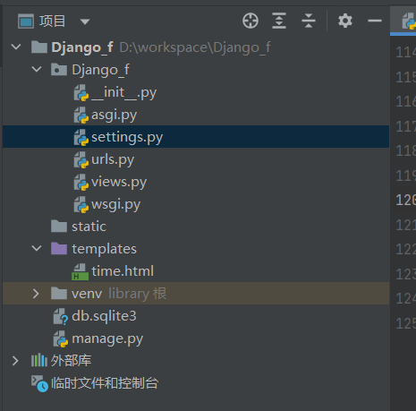
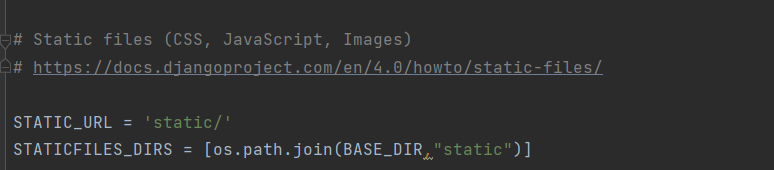
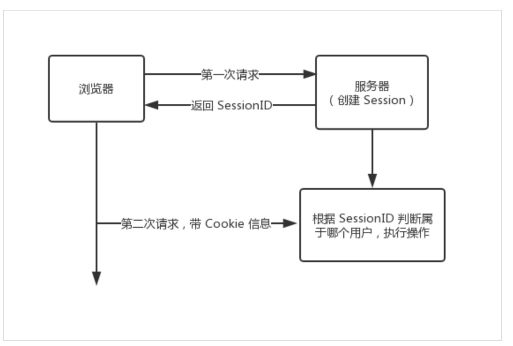
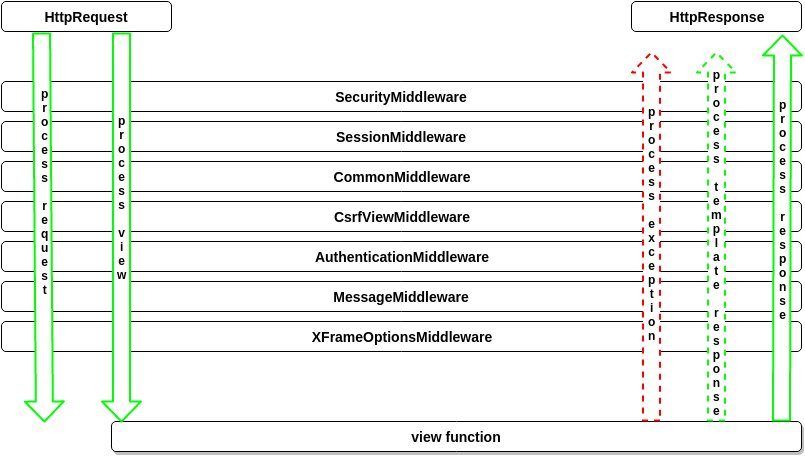
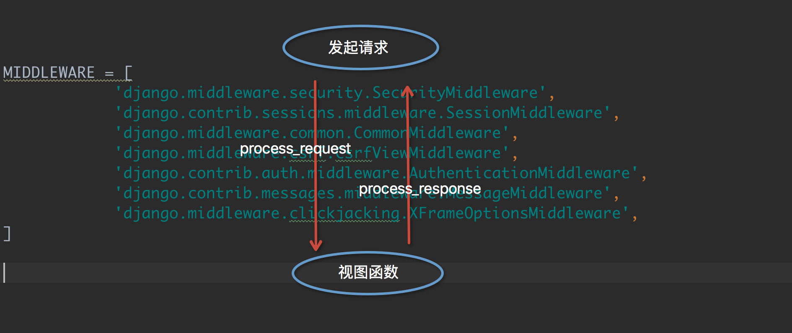
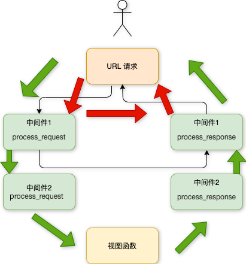
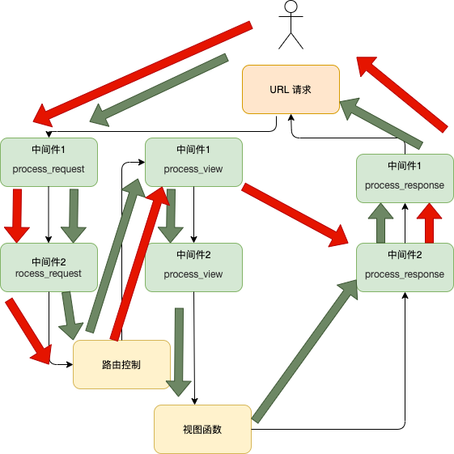

# 模板

```python
def timenow(request):
    import datetime
    now =datetime.datetime.now()
    return render(request,"time.html",{"time":now})
```

返回时间

前端页面接受

```html
{{ time|date:"Y-m-d"}}
//上面会显示时间

//会截取view_str的前两位字符，截断的字符串将以 ... 结尾。
{{view_str|truncatechars:2}}

safe
将字符串标记为安全，不需要转义。
要保证 views.py 传过来的数据绝对安全，才能用 safe。
和后端 views.py 的 mark_safe 效果相同。
Django 会自动对 views.py 传到HTML文件中的标签语法进行转义，令其语义失效。加 safe 过滤器是告诉 Django 该数据是安全的，不必对其进行转义，可以让该数据语义生效。
{{ views_str|safe }}
```

### if/else 标签

基本语法格式如下：

```

     ... display

```

或者：

```

   ... display 1

   ... display 2

   ... display 3

```

根据条件判断是否输出。if/else 支持嵌套。

 标签接受 and ， or 或者 not 关键字来对多个变量做判断 ，或者对变量取反（ not )，例如：

```

     athletes 和 coaches 变量都是可用的。

```

### for 标签

 允许我们在一个序列上迭代。

与 Python 的 for 语句的情形类似，循环语法是 for X in Y ，Y 是要迭代的序列而 X 是在每一个特定的循环中使用的变量名称。

每一次循环中，模板系统会渲染在 **** 和 **** 之间的所有内容。例如，给定一个运动员列表 athlete_list 变量，我们可以使用下面的代码来显示这个列表：

```
<ul>

    <li>{{ athlete.name }}</li>

</ul>


...

//加上reversed使得该列表反向迭代
```

**遍历字典**: 可以直接用字典 **.items** 方法，用变量的解包分别获取键和值。

```

{{ i }}---{{ j }}

```

在  标签里可以通过 {{forloop}} 变量获取循环序号。

- forloop.counter: 顺序获取循环序号，从 1 开始计算
- forloop.counter0: 顺序获取循环序号，从 0 开始计算
- forloop.revcounter: 倒序获取循环序号，结尾序号为 1
- forloop.revcounter0: 倒序获取循环序号，结尾序号为 0
- forloop.first（一般配合if标签使用）: 第一条数据返回 True，其他数据返回 False
- forloop.last（一般配合if标签使用）: 最后一条数据返回 True，其他数据返回 False

### ifequal/ifnotequal 标签

 标签比较两个值，当他们相等时，显示在  和  之中所有的值。

下面的例子比较两个模板变量 user 和 currentuser :

```

    <h1>Welcome!</h1>

```

和  类似，  支持可选的  标签：8

```

    <h1>Site News</h1>

    <h1>No News Here</h1>

```

### 注释标签

Django 注释使用 {# #}。

```
{# 这是一个注释 #}
```

### include 标签

 标签允许在模板中包含其它的模板的内容。

下面这个例子都包含了 nav.html 模板：

```

```

------

## csrf_token

csrf_token 用于form表单中，作用是跨站请求伪造保护。

如果不用｛% csrf_token %｝标签，在用 form 表单时，要再次跳转页面会报403权限错误。

用了｛% csrf_token %｝标签，在 form 表单提交数据时，才会成功。

**解析：**

首先，向服务器发送请求，获取登录页面，此时中间件 csrf 会自动生成一个隐藏input标签，该标签里的 value 属性的值是一个随机的字符串，用户获取到登录页面的同时也获取到了这个隐藏的input标签。

然后，等用户需要用到form表单提交数据的时候，会携带这个 input 标签一起提交给中间件 csrf，原因是 form 表单提交数据时，会包括所有的 input 标签，中间件 csrf 接收到数据时，会判断，这个随机字符串是不是第一次它发给用户的那个，如果是，则数据提交成功，如果不是，则返回403权限错误。

------

## 自定义标签和过滤器

1、在应用目录下创建 **templatetags** 目录(与 templates 目录同级，目录名只能是 templatetags)。

```
HelloWorld/
|-- HelloWorld
|   |-- __init__.py
|   |-- __init__.pyc
|   |-- settings.py
...
|-- manage.py
`-- templatetags
`-- templates
```

2、在 templatetags 目录下创建任意 py 文件，如：**my_tags.py**。

3、my_tags.py 文件代码如下：

```
from django import template

register = template.Library()   #register的名字是固定的,不可改变
```

修改 settings.py 文件的 TEMPLATES 选项配置，添加 libraries 配置：

settings.py 配置文件

```
TEMPLATES = [
  {
    'BACKEND': 'django.template.backends.django.DjangoTemplates',
    'DIRS': [BASE_DIR, "/templates",],
    'APP_DIRS': True,
    'OPTIONS': {
      'context_processors': [
        'django.template.context_processors.debug',
        'django.template.context_processors.request',
        'django.contrib.auth.context_processors.auth',
        'django.contrib.messages.context_processors.messages',
      ],
      "libraries":{              # 添加这边三行配置
        'my_tags':'templatetags.my_tags'  # 添加这边三行配置     
      }                    # 添加这边三行配置
    },
  },
]
```

4、利用装饰器 @register.filter 自定义过滤器。

**注意：**装饰器的参数最多只能有 2 个。

```
@register.filter
def my_filter(v1, v2):
    return v1 * v2
```

5、利用装饰器 @register.simple_tag 自定义标签。

```
@register.simple_tag
def my_tag1(v1, v2, v3):
    return v1 * v2 * v3
```

6、在使用自定义标签和过滤器前，要在 html 文件 body 的最上方中导入该 py 文件。

```

```

7、在 HTML 中使用自定义过滤器。

```
{{ 11|my_filter:22 }}
```

8、在 HTML 中使用自定义标签。

```

```

9、语义化标签

在该 py 文件中导入 mark_safe。

```
from django.utils.safestring import mark_safe
```

定义标签时，用上 mark_safe 方法，令标签语义化，相当于 jQuery 中的 html() 方法。

和前端HTML文件中的过滤器 safe 效果一样。

```
@register.simple_tag
def my_html(v1, v2):
    temp_html = "<input type='text' id='%s' class='%s' />" %(v1, v2)
    return mark_safe(temp_html)
```

在HTML中使用该自定义标签，在页面中动态创建标签。

```

```

## 配置静态文件

1、在项目根目录下创建 statics 目录。



2、在 settings 文件的最下方配置添加以下配置：



3、在 statics 目录下创建 css 目录，js 目录，images 目录，plugins 目录， 分别放 css文件，js文件，图片，插件。

4、把 bootstrap 框架放入插件目录 plugins。

5、在 HTML 文件的 head 标签中引入 bootstrap。

**注意：**此时引用路径中的要用配置文件中的别名 static，而不是目录 statics。

## 模板继承

模板可以用继承的方式来实现复用，减少冗余内容。

网页的头部和尾部内容一般都是一致的，我们就可以通过模板继承来实现复用。

父模板用于放置可重复利用的内容，子模板继承父模板的内容，并放置自己的内容。

### 父模板

**标签 block...endblock:** 父模板中的预留区域，该区域留给子模板填充差异性的内容，不同预留区域名字不能相同。

```
 
预留给子模板的区域，可以设置设置默认内容

```

### 子模板

子模板使用标签 extends 继承父模板：

```
 
```

子模板如果没有设置父模板预留区域的内容，则使用在父模板设置的默认内容，当然也可以都不设置，就为空。

子模板设置父模板预留区域的内容：

```
{ % block 名称 % }
内容 

```

接下来我们先创建之前项目的 templates 目录中添加 base.html 文件，代码如下：

# Django模型

```
pip install pymysql
```

Django 模型使用自带的 ORM。

对象关系映射（Object Relational Mapping，简称 ORM ）用于实现面向对象编程语言里不同类型系统的数据之间的转换。

ORM 在业务逻辑层和数据库层之间充当了桥梁的作用。

ORM 是通过使用描述对象和数据库之间的映射的元数据，将程序中的对象自动持久化到数据库中。


使用 ORM 的好处：

- 提高开发效率。
- 不同数据库可以平滑切换。

使用 ORM 的缺点：

- ORM 代码转换为 SQL 语句时，需要花费一定的时间，执行效率会有所降低。
- 长期写 ORM 代码，会降低编写 SQL 语句的能力。

ORM 解析过程:

- 1、ORM 会将 Python 代码转成为 SQL 语句。
- 2、SQL 语句通过 pymysql 传送到数据库服务端。
- 3、在数据库中执行 SQL 语句并将结果返回。

ORM 对应关系表：


## 数据库配置

### Django 如何使用 mysql 数据库

创建 MySQL 数据库( ORM 无法操作到数据库级别，只能操作到数据表)语法：

```sql
create database myblog defailt charset=utf8;
```

配置项目里面的setting.py对应的DATABASES

```python
DATABASES = { 
    'default': 
    { 
        'ENGINE': 'django.db.backends.mysql',    # 数据库引擎
        'NAME': 'runoob', # 数据库名称
        'HOST': '127.0.0.1', # 数据库地址，本机 ip 地址 127.0.0.1 
        'PORT': 3306, # 端口 
        'USER': 'root',  # 数据库用户名
        'PASSWORD': '123456', # 数据库密码
    }  
}
```

告诉 Django 使用 pymysql 模块连接 mysql 数据库：

实例在与 settings.py 同级目录下的 __init__.py 中引入模块和进行配置

```python
import pymysql
pymysql.install_as_MySQLdb()
```

## 定义模型

### 创建 APP

Django 规定，如果要使用模型，必须要创建一个 app。我们使用以下命令创建一个 TestModel 的 app:

```
django-admin startapp TestModel
```

目录结构如下：

```
HelloWorld
|-- HelloWorld
|-- manage.py
...
|-- TestModel
|   |-- __init__.py
|   |-- admin.py
|   |-- models.py
|   |-- tests.py
|   `-- views.py
```

我们修改 TestModel/models.py 文件，代码如下：

HelloWorld/TestModel/models.py: 文件代码：

```python
from django.db import models

# Create your models here.
class Test(models.Model):
    name = models.CharField(max_length=20)
    time =models.DateTimeField()
    age = models.IntegerField(default=0);
```


以上的类名代表了数据库表名，且继承了models.Model，类里面的字段代表数据表中的字段(name)，数据类型则由CharField（相当于varchar）、DateField（相当于datetime）， max_length 参数限定长度。

**可以参照官方文档来看**

接下来在 settings.py 中找到INSTALLED_APPS这一项，如下：

```
INSTALLED_APPS = (
    'django.contrib.admin',
    'django.contrib.auth',
    'django.contrib.contenttypes',
    'django.contrib.sessions',
    'django.contrib.messages',
    'django.contrib.staticfiles',
    'TestModel',               # 添加此项
)
```

在命令行中运行：

```
$ python3 manage.py migrate   # 创建表结构

$ python3 manage.py makemigrations TestModel  # 让 Django 知道我们在我们的模型有一些变更
$ python3 manage.py migrate TestModel   # 创建表结构
```

看到几行 "Creating table…" 的字样，你的数据表就创建好了。

```
Creating tables ...
……
Creating table TestModel_test  #我们自定义的表
……
```

表名组成结构为：应用名_类名（如：TestModel_test）。

**注意：**尽管我们没有在 models 给表设置主键，但是 Django 会自动添加一个 id 作为主键。


## Django模型（Model）字段类型级参数详解

| 序号 | 字段类型（Filed Types） | 描述                                                         |
| ---- | ----------------------- | ------------------------------------------------------------ |
| 1    | AutoField               | 根据可用id自动递增的整数字段。通常不需要直接使用它;如果不指定[主键](https://so.csdn.net/so/search?q=主键&spm=1001.2101.3001.7020)字段，则会自动将主键字段添加到模型中。 |
| 2    | CharField               | 用来存储字符串，必须制定范围，如果存储大文本字符串，应当用TextField. |
| 3    | DateField               | 使用Python的datetime.date实例保存的日期。auto_now = True:每次保存对象时，自动设置该字段为当前时间;auto_now_add=True:对象第一次被创建时自动设置当前时间。需要注意的是，自动保存的时间的时区使用的是默认时区。 |
| 4    | DateTimeField           | 使用Python的datetime.datetime实例表示的日期和时间。          |
| 5    | TextField               | 存储大字符串                                                 |
| 6    | BigIntegerField         | 64位的整型数值，从 -2^63 (-9223372036854775808) 到 2^63-1(9223372036854775807) |
| 7    | BinaryField             | 存储二进制码的Field. 只支持bytes 赋值。                      |
| 8    | BooleanField            | 该字段的默认表单控件是CheckboxInput，如果你需要设置null 值，则使用NullBooleanField 来代替BooleanField。 |
| 9    | FloatField              | 用Python的一个float 实例来表示一个浮点数。                   |
| 10   | UUIDField               | 一个用来存储UUID的字段。使用Python的UUID类。                 |
| 11   | ForeignKey              | 多对一关系                                                   |
| 12   | ManyToManyField         | 多对多关联                                                   |
| 13   | OneToOneField           | 一对一关联关系                                               |

1、null=True   数据库中字段是否可以为空

2、blank=True     django的 Admin 中添加数据时是否可允许空值

3、primary_key = False

主键，对AutoField设置主键后，就会代替原来的自增 id 列

如果您没有为模型中的任何字段指定primary_key=True, Django将自动添加一个IntegerField来保存主键，所以您不需要在任何字段上设置primary_key=True，除非您想要覆盖默认的主键行为。有关更多信息，请参见自动主键字段。

主键字段是只读的。如果您更改现有对象上的主键值，然后保存它，就会在旧对象旁边创建一个新对象。

4、auto_now 和 auto_now_add

auto_now  自动创建---无论添加或修改，都是当前操作的时间

auto_now_add  自动创建---永远是创建时的时间

5、choices

```python
GENDER_CHOICE = (
        (u'M', u'Male'),
        (u'F', u'Female'),
    )
gender = models.CharField(max_length=2,choices = GENDER_CHOICE)
```

6、max_length   字符串最大长度

7、default    默认值

8、verbose_name Admin     中字段的显示名称

9、name|db_column　　数据库中的字段名称

10、unique=True　　

不允许重复，例如用户名注册时候是不允许重复的,在username字段里设置,不让重复

11、db_index = True　　数据库索引   

12、editable=True　　在Admin里是否可编辑

13、error_messages=None　　

错误提示  

把错误提示修改成你想要的报错,这里加个字典来完成 gender = models.CharField(max_length=2,choices = GENDER_CHOICE,error_messages={"错误类型":"错误原因"})

14、auto_created=False　　自动创建

15、help_text　　在Admin中提示帮助信息

16、validators=[]   提示区间,例如电话号码范围

17、upload-to  文件上传功能 在 FileField 里加入 例如: file = modles.FileField(upload-to = "./upload/"    指明上传的文件防止根目录下的/upload/文件夹下

## model操作增删改查

```python
from django.shortcuts import render
from django.shortcuts import HttpResponse
# Create your views here.
from TestModel.models import Test
import datetime
def testdb(request):
    test1 =Test(name="aaa",age=12)
    test1.save();
    return HttpResponse("ok")
# 数据库操作获取数据
def dataget(request):
    # 初始化
    response = ""
    response1 = ""
    # 通过objects这个模型管理器的all()获得所有数据行，相当于SQL中的SELECT * FROM
    list = Test.objects.all()
    # filter相当于SQL中的WHERE，可设置条件过滤结果
    response2 = Test.objects.filter(id=1)
    # 获取单个对象
    response3 = Test.objects.get(id=1)
    # 限制返回的数据 相当于 SQL 中的 OFFSET 0 LIMIT 2;
    Test.objects.order_by('name')[0:2]
    # 数据排序
    Test.objects.order_by("id")
    # 上面的方法可以连锁使用
    Test.objects.filter(name="aaa").order_by("id")
    # 输出所有数据
    for var in list:
        response1 += var.name + " "
    response = response1
    return HttpResponse("<p>" + response + "</p>")
def datachange(request):
    # 修改其中一个id=1的name字段，再save，相当于SQL中的UPDATE
    test1 = Test.objects.get(id=1)
    test1.name = 'Google'
    test1.save()
    # 另外一种方式
    # Test.objects.filter(id=1).update(name='Google')
    # 修改所有的列
    # Test.objects.all().update(name='Google')
    return HttpResponse("<p>修改成功</p>")
# 数据库操作
def datadel(request):
    # 删除id=1的数据
    test1 = Test.objects.get(id=1)
    test1.delete()
    # 另外一种方式
    # Test.objects.filter(id=1).delete()
    # 删除所有数据
    # Test.objects.all().delete()
    return HttpResponse("<p>删除成功</p>")
```

## 数据好后的流程

python manage.py makemigrations //存在子应用的migrations目录里面

python manage.py migrate 执行迁移

# Django表单

## HTTP 请求

HTTP协议以"请求－回复"的方式工作。客户发送请求时，可以在请求中附加数据。服务器通过解析请求，就可以获得客户传来的数据，并根据URL来提供特定的服务。

## form get获取请求

1、提交的步骤：

1）form表单通过action 确定提交的位置，不写或者为空代表提交到当前路由

2）form表单同method确认请求的方式，不写默认为空，或者代表get方式提交

3）form表单提交的时候，表单元素必须有name，且唯一

2、发起提交事件


3、后端（views）处理数据

（1）接收数据

​        request.GET 可以接受前端传递过来的get请求的数据

​        request.GET 是一个类字典对象

（2）处理数据

​         对数据进行增删改查

（3）返回处理

​         locals（）

## form POST请求

CSRF（Cross-site-request-forgery）跨站请求伪造 . XSRF

默认的Django请求必须经过CSRF请求，否则，POST请求会被拒绝

解决办法：

Django post请求步骤：

  1、使用render方法进行返回

​      render方法 的第一个参数必须是request，其他地方和render_to_reponse方法相似。

 2、在form表单的最上层添加{% csrf-token % }

3、开始和get请求类似的接收数据和处理数据的步骤。

## Request 对象

每个视图函数的第一个参数是一个 HttpRequest 对象，就像下面这个 runoob() 函数:

```
from django.http import HttpResponse

def runoob(request):
    return HttpResponse("Hello world")
```

HttpRequest对象包含当前请求URL的一些信息：

| **属性**      | **描述**                                                     |
| ------------- | ------------------------------------------------------------ |
| path          | 请求页面的全路径,不包括域名—例如, "/hello/"。                |
| method        | 请求中使用的HTTP方法的字符串表示。全大写表示。例如:if request.method == 'GET':   do_something() elif request.method == 'POST':   do_something_else() |
| GET           | 包含所有HTTP GET参数的类字典对象。参见QueryDict 文档。       |
| POST          | 包含所有HTTP POST参数的类字典对象。参见QueryDict 文档。服务器收到空的POST请求的情况也是有可能发生的。也就是说，表单form通过HTTP POST方法提交请求，但是表单中可以没有数据。因此，不能使用语句if request.POST来判断是否使用HTTP POST方法；应该使用if request.method == "POST" (参见本表的method属性)。注意: POST不包括file-upload信息。参见FILES属性。 |
| REQUEST       | 为了方便，该属性是POST和GET属性的集合体，但是有特殊性，先查找POST属性，然后再查找GET属性。借鉴PHP's $_REQUEST。例如，如果GET = {"name": "john"} 和POST = {"age": '34'},则 REQUEST["name"] 的值是"john", REQUEST["age"]的值是"34".强烈建议使用GET and POST,因为这两个属性更加显式化，写出的代码也更易理解。 |
| COOKIES       | 包含所有cookies的标准Python字典对象。Keys和values都是字符串。 |
| FILES         | 包含所有上传文件的类字典对象。FILES中的每个Key都是<input type="file" name="" />标签中name属性的值. FILES中的每个value 同时也是一个标准Python字典对象，包含下面三个Keys:filename: 上传文件名,用Python字符串表示content-type: 上传文件的Content typecontent: 上传文件的原始内容注意：只有在请求方法是POST，并且请求页面中<form>有enctype="multipart/form-data"属性时FILES才拥有数据。否则，FILES 是一个空字典。 |
| META          | 包含所有可用HTTP头部信息的字典。 例如:CONTENT_LENGTHCONTENT_TYPEQUERY_STRING: 未解析的原始查询字符串REMOTE_ADDR: 客户端IP地址REMOTE_HOST: 客户端主机名SERVER_NAME: 服务器主机名SERVER_PORT: 服务器端口META 中这些头加上前缀 **HTTP_** 为 Key, 冒号(:)后面的为 Value， 例如:HTTP_ACCEPT_ENCODINGHTTP_ACCEPT_LANGUAGEHTTP_HOST: 客户发送的HTTP主机头信息HTTP_REFERER: referring页HTTP_USER_AGENT: 客户端的user-agent字符串HTTP_X_BENDER: X-Bender头信息 |
| user          | 是一个django.contrib.auth.models.User 对象，代表当前登录的用户。如果访问用户当前没有登录，user将被初始化为django.contrib.auth.models.AnonymousUser的实例。你可以通过user的is_authenticated()方法来辨别用户是否登录：`if request.user.is_authenticated():    # Do something for logged-in users. else:    # Do something for anonymous users.`只有激活Django中的AuthenticationMiddleware时该属性才可用 |
| session       | 唯一可读写的属性，代表当前会话的字典对象。只有激活Django中的session支持时该属性才可用。 |
| raw_post_data | 原始HTTP POST数据，未解析过。 高级处理时会有用处。           |

Request对象也有一些有用的方法：

| 方法              | 描述                                                         |
| :---------------- | :----------------------------------------------------------- |
| \__getitem__(key) | 返回GET/POST的键值,先取POST,后取GET。如果键不存在抛出 KeyError。 这是我们可以使用字典语法访问HttpRequest对象。 例如,request["foo"]等同于先request.POST["foo"] 然后 request.GET["foo"]的操作。 |
| has_key()         | 检查request.GET or request.POST中是否包含参数指定的Key。     |
| get_full_path()   | 返回包含查询字符串的请求路径。例如， "/music/bands/the_beatles/?print=true" |
| is_secure()       | 如果请求是安全的，返回True，就是说，发出的是HTTPS请求。      |

## QueryDict对象

在HttpRequest对象中, GET和POST属性是django.http.QueryDict类的实例。

QueryDict类似字典的自定义类，用来处理单键对应多值的情况。

QueryDict实现所有标准的词典方法。还包括一些特有的方法：

| **方法**     | **描述**                                                     |
| :----------- | :----------------------------------------------------------- |
| \__getitem__ | 和标准字典的处理有一点不同，就是，如果Key对应多个Value，__getitem__()返回最后一个value。 |
| \__setitem__ | 设置参数指定key的value列表(一个Python list)。注意：它只能在一个mutable QueryDict 对象上被调用(就是通过copy()产生的一个QueryDict对象的拷贝). |
| get()        | 如果key对应多个value，get()返回最后一个value。               |
| update()     | 参数可以是QueryDict，也可以是标准字典。和标准字典的update方法不同，该方法添加字典 items，而不是替换它们:`>>> q = QueryDict('a=1') >>> q = q.copy() # to make it mutable >>> q.update({'a': '2'}) >>> q.getlist('a')  ['1', '2'] >>> q['a'] # returns the last ['2']` |
| items()      | 和标准字典的items()方法有一点不同,该方法使用单值逻辑的__getitem__():`>>> q = QueryDict('a=1&a=2&a=3') >>> q.items() [('a', '3')]` |
| values()     | 和标准字典的values()方法有一点不同,该方法使用单值逻辑的__getitem__(): |

此外, QueryDict也有一些方法，如下表：

| **方法**                 | **描述**                                                     |
| :----------------------- | :----------------------------------------------------------- |
| copy()                   | 返回对象的拷贝，内部实现是用Python标准库的copy.deepcopy()。该拷贝是mutable(可更改的) — 就是说，可以更改该拷贝的值。 |
| getlist(key)             | 返回和参数key对应的所有值，作为一个Python list返回。如果key不存在，则返回空list。 It's guaranteed to return a list of some sort.. |
| setlist(key,list_)       | 设置key的值为list_ (unlike __setitem__()).                   |
| appendlist(key,item)     | 添加item到和key关联的内部list.                               |
| setlistdefault(key,list) | 和setdefault有一点不同，它接受list而不是单个value作为参数。  |
| lists()                  | 和items()有一点不同, 它会返回key的所有值，作为一个list, 例如:`>>> q = QueryDict('a=1&a=2&a=3') >>> q.lists() [('a', ['1', '2', '3'])] ` |
| urlencode()              | 返回一个以查询字符串格式进行格式化后的字符串(例如："a=2&b=3&b=5")。 |

# Django 视图

### 视图层

一个视图函数，简称视图，是一个简单的 Python 函数，它接受 Web 请求并且返回 Web 响应。

响应可以是一个 HTML 页面、一个 404 错误页面、重定向页面、XML 文档、或者一张图片...

无论视图本身包含什么逻辑，都要返回响应。代码写在哪里都可以，只要在 Python 目录下面，一般放在项目的 views.py 文件中。

每个视图函数都负责返回一个 HttpResponse 对象，对象中包含生成的响应。

视图层中有两个重要的对象：请求对象(request)与响应对象(HttpResponse)。

## 请求对象: HttpRequest 对象（简称 request 对象）

以下介绍几个常用的 request 属性。

### 1、GET

数据类型是 QueryDict，一个类似于字典的对象，包含 HTTP GET 的所有参数。

有相同的键，就把所有的值放到对应的列表里。

取值格式：**对象.方法**。

**get()**：返回字符串，如果该键对应有多个值，取出该键的最后一个值。

### 2、POST

数据类型是 QueryDict，一个类似于字典的对象，包含 HTTP POST 的所有参数。

常用于 form 表单，form 表单里的标签 name 属性对应参数的键，value 属性对应参数的值。

取值格式： **对象.方法**。

**get()**：返回字符串，如果该键对应有多个值，取出该键的最后一个值。

### 3、body

数据类型是二进制字节流，是原生请求体里的参数内容，在 HTTP 中用于 POST，因为 GET 没有请求体。

在 HTTP 中不常用，而在处理非 HTTP 形式的报文时非常有用，例如：二进制图片、XML、Json 等。

### 4、path

获取 URL 中的路径部分，数据类型是字符串。

### 5、method

获取当前请求的方式，数据类型是字符串，且结果为大写。

## 响应对象：HttpResponse 对象

响应对象主要有三种形式：HttpResponse()、render()、redirect()。

**HttpResponse():** 返回文本，参数为字符串，字符串中写文本内容。如果参数为字符串里含有 html 标签，也可以渲染。

**render():** 返回文本，第一个参数为 request，第二个参数为字符串（页面名称），第三个参数为字典（可选参数，向页面传递的参数：键为页面参数名，值为views参数名）。

**redirect()**：重定向，跳转新页面。参数为字符串，字符串中填写页面路径。一般用于 form 表单提交后，跳转到新页面。

# Django 路由

路由简单的来说就是根据用户请求的 URL 链接来判断对应的处理程序，并返回处理结果，也就是 URL 与 Django 的视图建立映射关系。

Django 路由在 urls.py 配置，urls.py 中的每一条配置对应相应的处理方法。

- path：用于普通路径，不需要自己手动添加正则首位限制符号，底层已经添加。
- re_path：用于正则路径，需要自己手动添加正则首位限制符号。

实例

```python
from django.urls import re_path # 用re_path 需要引入
urlpatterns = [
  path('admin/', admin.site.urls),
  path('index/', views.index), # 普通路径
  re_path(r'^articles/([0-9]{4})/$', views.articles), # 正则路径
]
```

## 正则路径中的分组

### 正则路径中的无名分组

无名分组按位置传参，一一对应。

views 中除了 request，其他形参的数量要与 urls 中的分组数量一致。

### 正则路径中的有名分组

语法：

```
(?P<组名>正则表达式)
```

有名分组按关键字传参，与位置顺序无关。

views 中除了 request，其他形参的数量要与 urls 中的分组数量一致， 并且 views 中的形参名称要与 urls 中的组名对应。

### 路由分发(include)

**存在问题**：Django 项目里多个app目录共用一个 urls 容易造成混淆，后期维护也不方便。

**解决**：使用路由分发（include），让每个app目录都单独拥有自己的 urls。

**步骤：**

- 1、在每个 app 目录里都创建一个 urls.py 文件。
- 2、在项目名称目录下的 urls 文件里，统一将路径分发给各个 app 目录。

## 反向解析

随着功能的增加，路由层的 url 发生变化，就需要去更改对应的视图层和模板层的 url，非常麻烦，不便维护。

这时我们可以利用反向解析，当路由层 url 发生改变，在视图层和模板层动态反向解析出更改后的 url，免去修改的操作。

反向解析一般用在模板中的超链接及视图中的重定向。

### 普通路径

在 urls.py 中给路由起别名，**name="路由别名"**。

```python
path("login1/", views.login, name="login")
```

在 views.py 中，从 django.urls 中引入 reverse，利用 **reverse("路由别名")** 反向解析:

```python
return redirect(reverse("login"))
```

在模板 templates 中的 HTML 文件中，利用 **** 反向解析。

```python
<form action="" method="post"> 
```

### 正则路径（无名分组）

在 urls.py 中给路由起别名，**name="路由别名"**。

```
re_path(r"^login/([0-9]{2})/$", views.login, name="login")
```

在 views.py 中，从 django.urls 中引入 reverse，利用 **reverse("路由别名"，args=(符合正则匹配的参数,))** 反向解析。

```python
return redirect(reverse("login",args=(10,)))
```

在模板 templates 中的 HTML 文件中利用 **** 反向解析。

```python
<form action="" method="post"> 
```

### 正则路径（有名分组）

在 urls.py 中给路由起别名，**name="路由别名"**。

```python
re_path(r"^login/(?P<year>[0-9]{4})/$", views.login, name="login")
```

在 views.py 中，从 django.urls 中引入 reverse，利用 **reverse("路由别名"，kwargs={"分组名":符合正则匹配的参数})** 反向解析。

```python
return redirect(reverse("login",kwargs={"year":3333}))
```

在模板 templates 中的 HTML 文件中，利用 **** 反向解析。

```html
<form action="" method="post">
```

## 命名空间

命名空间（英语：Namespace）是表示标识符的可见范围。

一个标识符可在多个命名空间中定义，它在不同命名空间中的含义是互不相干的。

一个新的命名空间中可定义任何标识符，它们不会与任何重复的标识符发生冲突，因为重复的定义都处于其它命名空间中。

**存在问题：**路由别名 name 没有作用域，Django 在反向解析 URL 时，会在项目全局顺序搜索，当查找到第一个路由别名 name 指定 URL 时，立即返回。当在不同的 app 目录下的urls 中定义相同的路由别名 name 时，可能会导致 URL 反向解析错误。

**解决：**使用命名空间。

### 普通路径

```
include(("app名称：urls"，"app名称"))
```

实例：

```
path("app01/", include(("app01.urls","app01"))) 
path("app02/", include(("app02.urls","app02")))
```

在 app01/urls.py 中起相同的路由别名。

```
path("login/", views.login, name="login")
```

在 views.py 中使用名称空间，语法格式如下：

```
reverse("app名称：路由别名")
```

实例：

```
return redirect(reverse("app01:login")
```

在 templates 模板的 HTML 文件中使用名称空间，语法格式如下：

```

```

实例：

```
<form action="" method="post">
```

# Django Admin 管理工具

```python
python manage.py createsuperuser
```

使用管理工具

model里面定义

admin里面注册

## 自定义表单

定义后台显示样式与添加方式

## 内联(Inline)显示

可以让有关系的数据在一页显示

## 列表页的显示

在指定列表下可以设置list_display属性来显示内容

```python
list_display = ('name', 'age', 'email')
```

当有大量数据时候也可以search_fields来显示搜索栏

```python
search_fields = ("name",)
```

andmin官网文档里面还有很多实用功能，可以参照官方文档来学习

# Django orm -单表实例

**方式1**：模型类实例化对象

需从 app 目录引入 models.py 文件：

```
from app 目录 import models
```

并且实例化对象后要执行 **对象.save()** 才能在数据库中新增成功。

**方式二：**通过 ORM 提供的 objects 提供的方法 create 来实现（推荐）

```python
books = models.Book.objects.create(title="如来神掌",price=200,publish="功夫出版社",pub_date="2010-10-10") 
```

### 查找

使用 **all()** 方法来查询所有内容。

返回的是 QuerySet 类型数据，类似于 list，里面放的是一个个模型类的对象，可用索引下标取出模型类的对象。

```python
 books = models.Book.objects.all()
```

## **filter()** 方法

用于查询符合条件的数据。

返回的是 QuerySet 类型数据，类似于 list，里面放的是满足条件的模型类的对象，可用索引下标取出模型类的对象。

pk=3 的意思是主键 primary key=3，相当于 id=3。

因为 id 在 pycharm 里有特殊含义，是看内存地址的内置函数 id()，因此用 pk。

```python
 books = models.Book.objects.filter(pk=5)
    
 books = models.Book.objects.filter(publish='菜鸟出版社', price=300)
```

## **exclude()** 方法

用于查询不符合条件的数据。

返回的是 QuerySet 类型数据，类似于 list，里面放的是不满足条件的模型类的对象，可用索引下标取出模型类的对象。

```python
books = models.Book.objects.exclude(pk=5)
```

## **get()** 方法

用于查询符合条件的返回模型类的对象符合条件的对象只能为一个，如果符合筛选条件的对象超过了一个或者没有一个都会抛出错误。

```python
books = models.Book.objects.get(pk=5)
books = models.Book.objects.get(pk=18)  # 报错，没有符合条件的对象
books = models.Book.objects.get(price=200)  # 报错，符合条件的对象超过一个
```

## **order_by()** 方法

用于对查询结果进行排序。

返回的是 QuerySet类型数据，类似于list，里面放的是排序后的模型类的对象，可用索引下标取出模型类的对象。

**注意：**

- a、参数的字段名要加引号。
- b、降序为在字段前面加个负号 **-**。

```python
books = models.Book.objects.order_by("price") # 查询所有，按照价格升序排列 
books = models.Book.objects.order_by("-price") # 查询所有，按照价格降序排列
```

## **reverse()** 方法

用于对查询结果进行反转。

返回的是 QuerySe t类型数据，类似于 list，里面放的是反转后的模型类的对象，可用索引下标取出模型类的对象。

```python
books = models.Book.objects.order_by("-price").reverse()
```

## **count()** 方法

用于查询数据的数量返回的数据是整数。

```python
books = models.Book.objects.count() # 查询所有数据的数量 
books = models.Book.objects.filter(price=200).count() # 查询符合条件数据的数量
```

## **first()** 方法

返回第一条数据返回的数据是模型类的对象也可以用索引下标 **[0]**。

```python
books = models.Book.objects.first() # 返回所有数据的第一条数据
```

last() 方法返回最后一条数据返回的数据是模型类的对象不能用索引下标 **[-1]**，ORM 没有逆序索引。

```python
books = models.Book.objects.last() # 返回所有数据的最后一条数据
```

## **exists()** 方法

用于判断查询的结果 QuerySet 列表里是否有数据。

返回的数据类型是布尔，有为 true，没有为 false。

**注意：**判断的数据类型只能为 QuerySet 类型数据，不能为整型和模型类的对象。

```python
books = models.Book.objects.exists()
    # 报错，判断的数据类型只能为QuerySet类型数据，不能为整型
books = models.Book.objects.count().exists()
    # 报错，判断的数据类型只能为QuerySet类型数据，不能为模型类对象
books = models.Book.objects.first().exists()  
```

## **values()** 方法

用于查询部分字段的数据。

返回的是 QuerySet 类型数据，类似于 list，里面不是模型类的对象，而是一个可迭代的字典序列，字典里的键是字段，值是数据。

**注意：**

- 参数的字段名要加引号
- 想要字段名和数据用 **values**

```python
# 查询所有的id字段和price字段的数据
books = models.Book.objects.values("pk","price")
```

## **values_list()** 方法

用于查询部分字段的数据。

返回的是 QuerySet 类型数据，类似于 list，里面不是模型类的对象，而是一个个元组，元组里放的是查询字段对应的数据。

**注意：**

- 参数的字段名要加引号
- 只想要数据用 values_list

```python
# 查询所有的price字段和publish字段的数据
books = models.Book.objects.values_list("price","publish")
print(books[0][0],type(books)) # 得到的是第一条记录的price字段的数据
```

## **distinct()** 方法

用于对数据进行去重。

返回的是 QuerySet 类型数据。

**注意：**

- 对模型类的对象去重没有意义，因为每个对象都是一个不一样的存在。
- distinct() 一般是联合 values 或者 values_list 使用。

```python
 # 查询一共有多少个出版社
    books = models.Book.objects.values_list("publish").distinct() # 对模型类的对象去重没有意义，因为每个对象都是一个不一样的存在。
    books = models.Book.objects.distinct()
```

## **filter()** 方法

基于双下划线的模糊查询（exclude 同理）。

**注意：**filter 中运算符号只能使用等于号 = ，不能使用大于号 > ，小于号 < ，等等其他符号。

__in 用于读取区间，= 号后面为列表 。

```python
# 查询价格为200或者300的数据
    books = models.Book.objects.filter(price__in=[200,300])
```

**__gt** 大于号 ，= 号后面为数字。

```
# 查询价格大于200的数据 
books = models.Book.objects.filter(price__gt=200)
```

**__gte** 大于等于，= 号后面为数字。

```
# 查询价格大于等于200的数据 
books = models.Book.objects.filter(price__gte=200)
```

**__lt** 小于，=号后面为数字。

```
# 查询价格小于300的数据 
books=models.Book.objects.filter(price__lt=300)
```

**__lte** 小于等于，= 号后面为数字。

```
# 查询价格小于等于300的数据 
books=models.Book.objects.filter(price__lte=300)
```

**__range** 在 ... 之间，左闭右闭区间，= 号后面为两个元素的列表。

```python
books=models.Book.objects.filter(price__range=[200,300])
```

**__contains** 包含，= 号后面为字符串。

```python
books=models.Book.objects.filter(title__contains="菜")
```

**__icontains** 不区分大小写的包含，= 号后面为字符串。

```python
books=models.Book.objects.filter(title__icontains="python") # 不区分大小写
```

**__startswith** 以指定字符开头，= 号后面为字符串。

```python
books=models.Book.objects.filter(title__startswith="菜")
```

**__endswith** 以指定字符结尾，= 号后面为字符串。

```
books=models.Book.objects.filter(title__endswith="教程")
```

**__year** 是 DateField 数据类型的年份，= 号后面为数字。

```
books=models.Book.objects.filter(pub_date__year=2008) 
```

**__month** 是DateField 数据类型的月份，= 号后面为数字。

```
books=models.Book.objects.filter(pub_date__month=10) 
```

**__day** 是DateField 数据类型的天数，= 号后面为数字。

```
books=models.Book.objects.filter(pub_date__day=01)
```

### 删除

**方式一：**使用模型类的 **对象.delete()**。

**返回值：**元组，第一个元素为受影响的行数。

```
books=models.Book.objects.filter(pk=8).first().delete()
```

**方式二**：使用 QuerySet **类型数据.delete()**(推荐)

**返回值：**元组，第一个元素为受影响的行数。

```
books=models.Book.objects.filter(pk__in=[1,2]).delete()
```

**注意：**

- a. Django 删除数据时，会模仿 SQL约束 ON DELETE CASCADE 的行为，也就是删除一个对象时也会删除与它相关联的外键对象。
- b. delete() 方法是 QuerySet 数据类型的方法，但并不适用于 Manager 本身。也就是想要删除所有数据，不能不写 all。

```
books=models.Book.objects.delete()　 # 报错
books=models.Book.objects.all().delete()　　 # 删除成功
```

### 修改

**方式一：**

```
模型类的对象.属性 = 更改的属性值
模型类的对象.save()
```

**返回值：**编辑的模型类的对象。

```
books = models.Book.objects.filter(pk=7).first() 
books.price = 400 
books.save()
```

**方式二：**QuerySet 类型数据.update(字段名=更改的数据)（推荐）

**返回值：**整数，受影响的行数

```python
books = models.Book.objects.filter(pk__in=[7,8]).update(price=888)
```

# Django ORM -多表

三种

一对一 unique

一对多 外键

多对多 第三张表来进行关联

```python
# EmailField 数据类型是邮箱格式，底层继承 CharField，进行了封装，相当于 MySQL 中的 varchar。
# OneToOneField = ForeignKey(...，unique=True)设置一对一。
# 若有模型类存在外键，创建数据时，要先创建外键关联的模型类的数据，不然创建包含外键的模型类的数据时，外键的关联模型类的数据会找不到。
id = models.AutoField(primary_key=True)  # id 自动创建，也可手写
title = models.CharField(max_length=32)   # book_name
price = models.DecimalField(max_digits=5, decimal_places=2)  #b ook_price
pub_date = models.DateField()  # 出版时间
    publish = models.ForeignKey("Publish", on_delete=models.CASCADE)   # 出版社名称
    authors = models.ManyToManyField("Authors"
                                     
```

### 遇到问题

之前数据对后迁移造成影响，删除migrate下除_init_.py的文件再重新执行

## orm 添加数据

一对多(ForeignKey)

**方式一:** 传对象的形式，返回值的数据类型是对象，书籍对象。

**步骤：**

- a. 获取出版社对象
- b. 给书籍的出版社属性 pulish 传出版社对象

```python
#  获取出版社对象
    pub_obj = models.Publish.objects.filter(pk=1).first()
    #  给书籍的出版社属性publish传出版社对象
    book = models.Book.objects.create(title="菜鸟教程", price=200, pub_date="2010-10-10", publish=pub_obj)
```

方式二: 传对象 id 的形式(由于传过来的数据一般是 id,所以传对象 id 是常用的)。

一对多中，设置外键属性的类(多的表)中，MySQL 中显示的字段名是:**外键属性名_id**。

返回值的数据类型是对象，书籍对象。

**步骤：**

- a. 获取出版社对象的 id
- b. 给书籍的关联出版社字段 pulish_id 传出版社对象的 id

```python
#  获取出版社对象
    pub_obj = models.Publish.objects.filter(pk=1).first()
    #  获取出版社对象的id
    pk = pub_obj.pk
    #  给书籍的关联出版社字段 publish_id 传出版社对象的id
    book = models.Book.objects.create(title="冲灵剑法", price=100, pub_date="2004-04-04", publish_id=pk)
```

### 多对多(ManyToManyField)：在第三张关系表中新增数据

**方式一:** 传对象形式，无返回值。

**步骤：**

- a. 获取作者对象
- b. 获取书籍对象
- c. 给书籍对象的 authors 属性用 add 方法传作者对象

```python
#  获取作者对象
    chong = models.Author.objects.filter(name="令狐冲").first()
    ying = models.Author.objects.filter(name="任盈盈").first()
    #  获取书籍对象
    book = models.Book.objects.filter(title="菜鸟教程").first()
    #  给书籍对象的 authors 属性用 add 方法传作者对象
    book.authors.add(chong, ying)
```

**方式二:** 传对象id形式，无返回值。

**步骤：**

- a. 获取作者对象的 id
- b. 获取书籍对象
- c. 给书籍对象的 authors 属性用 add 方法传作者对象的 id

```python
 #  获取作者对象
    chong = models.Author.objects.filter(name="令狐冲").first()
    #  获取作者对象的id
    pk = chong.pk
    #  获取书籍对象
    book = models.Book.objects.filter(title="冲灵剑法").first()
    #  给书籍对象的 authors 属性用 add 方法传作者对象的id
    book.authors.add(pk)
```

### 关联管理器(对象调用)

**前提：**

- 多对多（双向均有关联管理器）
- 一对多（只有多的那个类的对象有关联管理器，即反向才有）

**语法格式：**

```
正向：属性名
反向：小写类名加 _set
```

**注意：**一对多只能反向

**常用方法：**

**add()**：用于多对多，把指定的模型对象添加到关联对象集（关系表）中。

**注意：**add() 在一对多(即外键)中，只能传对象（ *QuerySet数据类型），不能传 id（*[id表]）。

***[ ]** 的使用:

\# 方式一：传对象

```python
book_obj = models.Book.objects.get(id=10)
author_list = models.Author.objects.filter(id__gt=2)
book_obj.authors.add(*author_list) # 将 id 大于2的作者对象添加到这本书的作者集合中

# 方式二：传对象 id
book_obj.authors.add(*[1,3]) # 将 id=1 和 id=3 的作者对象添加到这本书的作者集合中
**return** HttpResponse("ok")
```

**create()**：创建一个新的对象，并同时将它添加到关联对象集之中。

返回新创建的对象。

```python
pub = models.Publish.objects.filter(name="明教出版社").first()
wo = models.Author.objects.filter(name="任我行").first()
book = wo.book_set.create(title="吸星大法", price=300, pub_date="1999-9-19", publish=pub)
print(book, type(book))
```

**remove()**：从关联对象集中移除执行的模型对象。

对于 ForeignKey 对象，这个方法仅在 null=True（可以为空）时存在，无返回值。

实例

```python
author_obj =models.Author.objects.get(id=1)
book_obj = models.Book.objects.get(id=11)
author_obj.book_set.remove(book_obj)
**return** HttpResponse("ok")
```

**clear()**：从关联对象集中移除一切对象，删除关联，不会删除对象。

对于 ForeignKey 对象，这个方法仅在 null=True（可以为空）时存在。

无返回值。

```python
#  清空独孤九剑关联的所有作者
book = models.Book.objects.filter(title="菜鸟教程").first()
book.authors.clear()
```

## ORM 查询

基于对象的跨表查询。

```
正向：属性名称
反向：小写类名_set
```

### 一对多

查询主键为 1 的书籍的出版社所在的城市（正向）。

实例

```python
book = models.Book.objects.filter(pk=10).first()
res = book.publish.city
print(res, type(res))
return HttpResponse("ok")
```

查询明教出版社出版的书籍名（反向）。

反向：**对象.小写类名_set(pub.book_set)** 可以跳转到关联的表(书籍表)。

**pub.book_set.all()**：取出书籍表的所有书籍对象，在一个 QuerySet 里，遍历取出一个个书籍对象。

实例

```python
pub = models.Publish.objects.filter(name="明教出版社").first()`
res = pub.book_set.all()`
for i in res:
    print(i.title)`
    return HttpResponse("ok")
```

一对一
查询令狐冲的电话（正向）

正向：对象.属性 (author.au_detail) 可以跳转到关联的表(作者详情表)

实例

```python
author = models.Author.objects.filter(name="令狐冲").first()
res = author.au_detail.tel
print(res, type(res))
return HttpResponse("ok")
```

查询所有住址在黑木崖的作者的姓名（反向）。

一对一的反向，用 **对象.小写类名** 即可，不用加 _set。

反向：对象.小写类名(addr.author)可以跳转到关联的表(作者表)。

实例

```python
addr = models.AuthorDetail.objects.filter(addr="黑木崖").first()
res = addr.author.name
print(res, type(res))
return HttpResponse("ok")
```

### 多对多

菜鸟教程所有作者的名字以及手机号（正向）。

正向：**对象.属性(book.authors)**可以跳转到关联的表(作者表)。

作者表里没有作者电话，因此再次通过**对象.属性(i.au_detail)**跳转到关联的表（作者详情表）。

实例

```python
book = models.Book.objects.filter(title="菜鸟教程").first()
res = book.authors.all()
for i in res:
    print(i.name, i.au_detail.tel)
return HttpResponse("ok")
```

查询任我行出过的所有书籍的名字（反向）。

```python
author = models.Author.objects.filter(name="任我行").first()
res = author.book_set.all()
for i in res:
    print(i.title)
return HttpResponse("ok")
```

## 基于双下划线的跨表查询

### 正向：属性名称__跨表的属性名称 反向：小写类名__跨表的属性名称

### 一对多

查询菜鸟出版社出版过的所有书籍的名字与价格。

```python
res = models.Book.objects.filter(publish__name="菜鸟出版社").values_list("title", "price")
```

### 多对多

查询任我行出过的所有书籍的名字。

正向：通过 属性名称__跨表的属性名称(authors__name) 跨表获取数据：

```python
res = models.Book.objects.filter(authors__name="任我行").values_list("title")
```

反向：通过 小写类名__跨表的属性名称（book__title） 跨表获取数据：

```python
res = models.Author.objects.filter(name="任我行").values_list("book__title")
```

### 一对一

查询任我行的手机号。

正向：通过 **属性名称__跨表的属性名称(au_detail__tel)** 跨表获取数据。

```python
res = models.Author.objects.filter(name="任我行").values_list("au_detail__tel")
```

反向：通过 **小写类名__跨表的属性名称（author__name）** 跨表获取数据。

```
res = models.AuthorDetail.objects.filter(author__name="任我行").values_list("tel")
```

# 聚合查询

聚合查询函数是对一组值执行计算，并返回单个值。

Django 使用聚合查询前要先从 django.db.models 引入 Avg、Max、Min、Count、Sum（首字母大写）。

```
from django.db.models import Avg,Max,Min,Count,Sum  #   引入函数
```

聚合查询返回值的数据类型是字典。

聚合函数 aggregate() 是 QuerySet 的一个终止子句， 生成的一个汇总值，相当于 count()。

使用 aggregate() 后，数据类型就变为字典，不能再使用 QuerySet 数据类型的一些 API 了。

日期数据类型(DateField)可以用 Max 和 Min。

返回的字典中：键的名称默认是（属性名称加上__聚合函数名），值是计算出来的聚合值。

如果要自定义返回字典的键的名称，可以起别名：

```
aggregate(别名 = 聚合函数名("属性名称"))
```

计算所有图书的平均价格:

```python
res = models.Book.objects.aggregate(Avg("price"))
```

## 分组查询（annotate）

分组查询一般会用到聚合函数，所以使用前要先从 django.db.models 引入 Avg,Max,Min,Count,Sum（首字母大写）。

```
from django.db.models import Avg,Max,Min,Count,Sum  #   引入函数
```

**返回值：**

- 分组后，用 values 取值，则返回值是 QuerySet 数据类型里面为一个个字典；
- 分组后，用 values_list 取值，则返回值是 QuerySet 数据类型里面为一个个元组。

MySQL 中的 limit 相当于 ORM 中的 QuerySet 数据类型的切片。

**注意：**

annotate 里面放聚合函数。

- **values 或者 values_list 放在 annotate 前面：**values 或者 values_list 是声明以什么字段分组，annotate 执行分组。
- **values 或者 values_list 放在annotate后面：** annotate 表示直接以当前表的pk执行分组，values 或者 values_list 表示查询哪些字段， 并且要将 annotate 里的聚合函数起别名，在 values 或者 values_list 里写其别名。

统计每一本以"菜"开头的书籍的作者个数：

```python
res = models.Book.objects.filter(title__startswith="菜").annotate(c = Count("authors__name")).values("title","c")
```

统计每一本书的作者个数：

res = models.Book.objects.annotate(c = Count("authors__name")).values("title","c")

根据一本图书作者数量的多少对查询集 QuerySet 进行降序排序:
res = models.Book.objects.annotate(c = Count("authors__name")).order_by("-c").values("title","c")

查询各个作者出的书的总价格:
res = models.Author.objects.annotate(all = Sum("book__price")).values("name","all")

### F() 查询

F() 的实例可以在查询中引用字段，来比较同一个 model 实例中两个不同字段的值。

之前构造的过滤器都只是将字段值与某个常量做比较，如果想要对两个字段的值做比较，就需要用到 F()。

使用前要先从 django.db.models 引入 F:

```
from django.db.models import F
```

**用法：**

```
F("字段名称")
```

F 动态获取对象字段的值，可以进行运算。

Django 支持 F() 对象之间以及 F() 对象和常数之间的加减乘除和取余的操作。

修改操作（update）也可以使用 F() 函数。

查询工资大于年龄的人：

```python
from django.db.models import F
...
book=models.Emp.objects.filter(salary__gt=F("age")).values("name","age")
...
```

将每一本书的价格提高100元:

res = models.Book.objects.update(price=F("price")+100)

### Q() 查询

```
from django.db.models import Q
```

用法：

```
Q(条件判断)
```

例如：

```
Q(title__startswith="菜")
```

之前构造的过滤器里的多个条件的关系都是 and，如果需要执行更复杂的查询（例如 or 语句），就可以使用 Q 。

Q 对象可以使用 & | ~ （与 或 非）操作符进行组合。

优先级从高到低：~ & |。

可以混合使用 Q 对象和关键字参数，Q 对象和关键字参数是用"and"拼在一起的（即将逗号看成 and ），但是 Q 对象必须位于所有关键字参数的前面。

查询价格大于 350 或者名称以菜开头的书籍的名称和价格。
`res=models.Book.objects.filter(Q(price__gt=350)|Q(title__startswith="菜")).values("title","price")`

查询以"菜"结尾或者不是 2010 年 10 月份的书籍:

`res = models.Book.objects.filter(Q(title__endswith="菜") | ~Q(Q(pub_date__year=2010) & Q(pub_date__month=10)))`

查询出版日期是 2004 或者 1999 年，并且书名中包含有"菜"的书籍。

Q 对象和关键字混合使用，Q 对象要在所有关键字的前面:

`res = models.Book.objects.filter(Q(pub_date__year=2004) | Q(pub_date__year=1999), title__contains="菜")`

# Django form组件

Django Form 组件用于对页面进行初始化，生成 HTML 标签，此外还可以对用户提交对数据进行校验（显示错误信息）。

**报错信息显示顺序：**

- 先显示字段属性中的错误信息，然后再显示局部钩子的错误信息。
- 若显示了字段属性的错误信息，就不会显示局部钩子的错误信息。
- 若有全局钩子，则全局钩子是等所有的数据都校验完，才开始进行校验，并且全局钩子的错误信息一定会显示。

使用 Form 组件，需要先导入 forms：

```
from django import forms
```

- **label**：输入框前面的文本信息。
- **error_message**：自定义显示的错误信息，属性值是字典， 其中 required 为设置不能为空时显示的错误信息的 key

### 局部钩子和全局钩子

```python
from django import forms
from django.core.exceptions import ValidationError
from app01 import models
class EmpForm(forms.Form):
    name = forms.CharField(min_length=5, label="姓名", error_messages={"required": "该字段不能为空!", "min_length": "用户名太短。"})
    age = forms.IntegerField(label="年龄")
    salary = forms.DecimalField(max_digits=5, decimal_places=2, label="工资")
    r_salary = forms.DecimalField(max_digits=5, decimal_places=2, label="请再输入工资")
    def clean_name(self):  # 局部钩子
        val = self.cleaned_data.get("name")
        if val.isdigit():
            raise ValidationError("用户名不能是纯数字")
        elif models.Emp.objects.filter(name=val):
            raise ValidationError("用户名已存在！")
        else:
            return val
    def clean(self):  # 全局钩子 确认两次输入的工资是否一致。
        val = self.cleaned_data.get("salary")
        r_val = self.cleaned_data.get("r_salary")
        if val == r_val:
            return self.cleaned_data
        else:
            raise ValidationError("请确认工资是否一致。")
```

# Django 用户认证（Auth）组件

Django 用户认证（Auth）组件一般用在用户的登录注册上，用于判断当前的用户是否合法，并跳转到登陆成功或失败页面。

Django 用户认证（Auth）组件需要导入 auth 模块:

```
# 认证模块
from django.contrib import auth

# 对应数据库
from django.contrib.auth.models import User
```

返回值是用户对象。

创建用户对象的三种方法：

- **create()**：创建一个普通用户，密码是明文的。
- **create_user()**：创建一个普通用户，密码是密文的。
- **create_superuser()**：创建一个超级用户，密码是密文的，要多传一个邮箱 email 参数。

**参数：**

- username: 用户名。
- password：密码。
- email：邮箱 (create_superuser 方法要多加一个 email)。

```python
from django.contrib.auth.models import User 
User.objects.create(username='runboo',password='123')

from django.contrib.auth.models import User 
User.objects.create_superuser(username='runboooo',password='123',email='runboo@163.com')
```

验证用户的用户名和密码使用 authenticate() 方法，从需要 auth_user 表中过滤出用户对象。

使用前要导入：

```
from django.contrib import auth
```

参数：

- username：用户名
- password：密码

**返回值：**如果验证成功，就返回用户对象，反之，返回 None。

```python
def login(request):
    if request.method == "GET":
        return render(request, "login.html")
    username = request.POST.get("username")
    password = request.POST.get("pwd")
    valid_num = request.POST.get("valid_num")
    keep_str = request.session.get("keep_str")
    if keep_str.upper() == valid_num.upper():
        user_obj = auth.authenticate(username=username, password=password)
        print(user_obj.username)
```

给验证成功的用户加 session，将 request.user 赋值为用户对象。

使用前要导入：

```
from django.contrib import auth
```

参数：

- request：用户对象

返回值：None

```python
def login(request):
    if request.method == "GET":
        return render(request, "login.html")
    username = request.POST.get("username")
    password = request.POST.get("pwd")
    valid_num = request.POST.get("valid_num")
    keep_str = request.session.get("keep_str")
    if keep_str.upper() == valid_num.upper():
        user_obj = auth.authenticate(username=username, password=password)
        print(user_obj.username)
        if not user_obj:
            return redirect("/login/")
        else:
            auth.login(request, user_obj)
            path = request.GET.get("next") or "/index/"
            print(path)
            return redirect(path)
    else:
        return redirect("/login/")
```

注销用户使用 logout() 方法，需要清空 session 信息，将 request.user 赋值为匿名用户。

使用前要导入：

```
from django.contrib import auth
```

参数：

- request：用户对象

返回值：None

```python
def logout(request):
    ppp = auth.logout(request)
    print(ppp) # None
    return redirect("/login/")
```

设置装饰器，给需要登录成功后才能访问的页面统一加装饰器。

使用前要导入：

```
from django.contrib.auth.decorators import login_required
```

## 实例

```python
from django.contrib.auth.decorators import login_required @login_required
def index(request):
  return HttpResponse("index页面。。。")
```

设置从哪个页面访问，登录成功后就返回哪个页面。

**解析：**

django 在用户访问页面时，如果用户是未登录的状态，就给用户返回登录页面。

此时，该登录页面的 URL 后面有参数：next=用户访问的页面的 URL。

因此，设置在用户登录成功后重定向的 URL 为 next 参数的值。

但是，若用户一开始就输入登录页面 logi，request.GET.get("next") 就取不到值，所以在后面加 or，可以设置自定义返回的页面。

```python
# 如果直接输入 login、get() 就取不到值，path 可以自定义设置返回的页面
path = request.GET.get("next") or "/index/"
return redirect(path)
```

# Django cookie 与 session

Cookie 是存储在客户端计算机上的文本文件，并保留了各种跟踪信息。

识别返回用户包括三个步骤：

- 服务器脚本向浏览器发送一组 Cookie。例如：姓名、年龄或识别号码等。
- 浏览器将这些信息存储在本地计算机上，以备将来使用。
- 当下一次浏览器向 Web 服务器发送任何请求时，浏览器会把这些 Cookie 信息发送到服务器，服务器将使用这些信息来识别用户。

HTTP 是一种"无状态"协议，这意味着每次客户端检索网页时，客户端打开一个单独的连接到 Web 服务器，服务器会自动不保留之前客户端请求的任何记录。

但是仍然有以下三种方式来维持 Web 客户端和 Web 服务器之间的 session 会话：

## Cookies

一个 Web 服务器可以分配一个唯一的 session 会话 ID 作为每个 Web 客户端的 cookie，对于客户端的后续请求可以使用接收到的 cookie 来识别。

在Web开发中，使用 session 来完成会话跟踪，session 底层依赖 Cookie 技术。


### Django 中 Cookie 的语法

设置 cookie:

```
rep.set_cookie(key,value,...) 
rep.set_signed_cookie(key,value,salt='加密盐',...)
```

获取 cookie:

```
request.COOKIES.get(key)
```

删除 cookie:

```
rep =HttpResponse || render || redirect 
rep.delete_cookie(key)
```

## Session(保存在服务端的键值对)

服务器在运行时可以为每一个用户的浏览器创建一个其独享的 session 对象，由于 session 为用户浏览器独享，所以用户在访问服务器的 web 资源时，可以把各自的数据放在各自的 session 中，当用户再去访问该服务器中的其它 web 资源时，其它 web 资源再从用户各自的 session 中取出数据为用户服务。



### 工作原理

- a. 浏览器第一次请求获取登录页面 login。

- b. 浏览器输入账号密码第二次请求，若输入正确，服务器响应浏览器一个 index 页面和一个键为 sessionid，值为随机字符串的 cookie，即 set_cookie ("sessionid",随机字符串)。

- c. 服务器内部在 django.session 表中记录一条数据。

  django.session 表中有三个字段。

  - session_key：存的是随机字符串，即响应给浏览器的 cookie 的 sessionid 键对应的值。
  - session_data：存的是用户的信息，即多个 request.session["key"]=value，且是密文。
  - expire_date：存的是该条记录的过期时间（默认14天）

- d. 浏览器第三次请求其他资源时，携带 cookie :{sessionid:随机字符串}，服务器从 django.session 表中根据该随机字符串取出该用户的数据，供其使用（即保存状态）。

**注意:** django.session 表中保存的是浏览器的信息，而不是每一个用户的信息。 因此， 同一浏览器多个用户请求只保存一条记录（后面覆盖前面）,多个浏览器请求才保存多条记录。

cookie 弥补了 http 无状态的不足，让服务器知道来的人是"谁"，但是 cookie 以文本的形式保存在浏览器端，安全性较差，且最大只支持 4096 字节，所以只通过 cookie 识别不同的用户，然后，在对应的 session 里保存私密的信息以及超过 4096 字节的文本。

session 设置：

```
request.session["key"] = value
```

执行步骤：

- a. 生成随机字符串
- b. 把随机字符串和设置的键值对保存到 django_session 表的 session_key 和 session_data 里
- c. 设置 **cookie：set_cookie("sessionid",随机字符串)** 响应给浏览器

session 获取：

```
request.session.get('key')
```

执行步骤：

- a. 从 cookie 中获取 sessionid 键的值，即随机字符串。
- b. 根据随机字符串从 django_session 表过滤出记录。
- c. 取出 session_data 字段的数据。

session 删除，删除整条记录（包括 session_key、session_data、expire_date 三个字段）：

```
request.session.flush()
```

删除 session_data 里的其中一组键值对：

```
del request.session["key"]
```

执行步骤：

- a. 从 cookie 中获取 sessionid 键的值，即随机字符串
- b. 根据随机字符串从 django_session 表过滤出记录
- c. 删除过滤出来的记录

```python
from session import views as session_views
urlpatterns = [
    path('session_login/', session_views.login),
    path('s_index/', session_views.s_index),
    path('s_logout/', session_views.s_logout),
]
```

# Django 中间件

Django 中间件是修改 Django request 或者 response 对象的钩子，可以理解为是介于 HttpRequest 与 HttpResponse 处理之间的一道处理过程。

浏览器从请求到响应的过程中，Django 需要通过很多中间件来处理，可以看如下图所示：



Django 中间件作用：

- 修改请求，即传送到 view 中的 HttpRequest 对象。
- 修改响应，即 view 返回的 HttpResponse 对象。

中间件组件配置在 settings.py 文件的 MIDDLEWARE 选项列表中。

Django 默认的中间件配置：

```python
MIDDLEWARE = [
    'django.middleware.security.SecurityMiddleware',
    'django.contrib.sessions.middleware.SessionMiddleware',
    'django.middleware.common.CommonMiddleware',
    'django.middleware.csrf.CsrfViewMiddleware',
    'django.contrib.auth.middleware.AuthenticationMiddleware',
    'django.contrib.messages.middleware.MessageMiddleware',
    'django.middleware.clickjacking.XFrameOptionsMiddleware',
]
```

### 自定义中间件

中间件可以定义四个方法，分别是：

process_request(self,request)
process_view(self, request, view_func, view_args, view_kwargs)
process_exception(self, request, exception)
process_response(self, request, response)

自定义中间的步骤：

在 app 目录下新建一个 py 文件，名字自定义，并在该 py 文件中导入 MiddlewareMixin：

```
from django.utils.deprecation import MiddlewareMixin
```

自定义的中间件类，要继承父类 MiddlewareMixin:

```
class MD1(MiddlewareMixin): 
    pass
```

```pyth
MIDDLEWARE = [
  'django.middleware.security.SecurityMiddleware',
  'django.contrib.sessions.middleware.SessionMiddleware',
  'django.middleware.common.CommonMiddleware',
  'django.middleware.csrf.CsrfViewMiddleware',
  'django.contrib.auth.middleware.AuthenticationMiddleware',
  'django.contrib.messages.middleware.MessageMiddleware',
  'django.middleware.clickjacking.XFrameOptionsMiddleware',
  'app01.middlewares.MD1',
]
```

## 自定义中间件类的方法

自定义中间件类的方法有：process_request 和 process_response。



### process_request 方法

process_request 方法有一个参数 request，这个 request 和视图函数中的 request 是一样的。

process_request 方法的返回值可以是 None 也可以是 HttpResponse 对象。

- 返回值是 None 的话，按正常流程继续走，交给下一个中间件处理。
- 返回值是 HttpResponse 对象，Django 将不执行后续视图函数之前执行的方法以及视图函数，直接以该中间件为起点，倒序执行中间件，且执行的是视图函数之后执行的方法。

process_request 方法是在视图函数之前执行的。

当配置多个中间件时，会按照 MIDDLEWARE中 的注册顺序，也就是列表的索引值，顺序执行。

不同中间件之间传递的 request 参数都是同一个请求对象。

```python
from django.utils.deprecation import MiddlewareMixin
from django.shortcuts import render, HttpResponse
class MD1(MiddlewareMixin):
    def process_request(self, request):
       print("md1  process_request 方法。", id(request)) #在视图之前执行
```

### process_response

process_response 方法有两个参数，一个是 request，一个是 response，request 是请求对象，response 是视图函数返回的 HttpResponse 对象，该方法必须要有返回值，且必须是response。

process_response 方法是在视图函数之后执行的。

当配置多个中间件时，会按照 MIDDLEWARE 中的注册顺序，也就是列表的索引值，倒序执行

```python
class MD1(MiddlewareMixin):
    def process_request(self, request):
        print("md1  process_request 方法。", id(request)) #在视图之前执行
    def process_response(self,request, response): :#基于请求响应
        print("md1  process_response 方法！", id(request)) #在视图之后
        return response
```

从下图看，正常的情况下按照绿色的路线进行执行,假设**中间件1**有返回值，则按照红色的路线走，直接执行该类下的 process_response 方法返回，后面的其他中间件就不会执行。



### process_view

process_view 方法格式如下：

```
process_view(request, view_func, view_args, view_kwargs)
```

- request 是 HttpRequest 对象。
- view_func 是 Django 即将使用的视图函数。
- view_args 是将传递给视图的位置参数的列表。
- view_kwargs 是将传递给视图的关键字参数的字典。

view_args 和 view_kwargs 都不包含第一个视图参数（request）。

process_view 方法是在视图函数之前，process_request 方法之后执行的。

返回值可以是 None、view_func(request) 或 HttpResponse 对象。

- 返回值是 None 的话，按正常流程继续走，交给下一个中间件处理。
- 返回值是 HttpResponse 对象，Django 将不执行后续视图函数之前执行的方法以及视图函数，直接以该中间件为起点，倒序执行中间件，且执行的是视图函数之后执行的方法。
- c.返回值是 view_func(request)，Django 将不执行后续视图函数之前执行的方法，提前执行视图函数，然后再倒序执行视图函数之后执行的方法。
- 当最后一个中间件的 process_request 到达路由关系映射之后，返回到第一个中间件 process_view，然后依次往下，到达视图函数。

```python
class MD1(MiddlewareMixin):
    def process_request(self, request):
        print("md1  process_request 方法。", id(request)) #在视图之前执行

    def process_response(self,request, response): :#基于请求响应
        print("md1  process_response 方法！", id(request)) #在视图之后
        return response

    def process_view(self,request, view_func, view_args, view_kwargs):
        print("md1  process_view 方法！") #在视图之前执行 顺序执行
        #return view_func(request)
```



### process_exception

process_exception 方法如下：

```
process_exception(request, exception)
```

参数说明：

- request 是 HttpRequest 对象。
- exception 是视图函数异常产生的 Exception 对象。

process_exception 方法只有在视图函数中出现异常了才执行，按照 settings 的注册倒序执行。

在视图函数之后，在 process_response 方法之前执行。

process_exception 方法的返回值可以是一个 None 也可以是一个 HttpResponse 对象。

返回值是 None，页面会报 500 状态码错误，视图函数不会执行。

process_exception 方法倒序执行，然后再倒序执行 process_response 方法。

返回值是 HttpResponse 对象，页面不会报错，返回状态码为 200。

视图函数不执行，该中间件后续的 process_exception 方法也不执行，直接从最后一个中间件的 process_response 方法倒序开始执行。

若是 process_view 方法返回视图函数，提前执行了视图函数，且视图函数报错，则无论 process_exception 方法的返回值是什么，页面都会报错， 且视图函数和 process_exception 方法都不执行。

直接从最后一个中间件的 process_response 方法开始倒序执行：

```python
class MD1(MiddlewareMixin):
    def process_request(self, request):
        print("md1  process_request 方法。", id(request)) #在视图之前执行
    def process_response(self,request, response): :#基于请求响应
        print("md1  process_response 方法！", id(request)) #在视图之后
        return response
    def process_view(self,request, view_func, view_args, view_kwargs):
        print("md1  process_view 方法！") #在视图之前执行 顺序执行
        #return view_func(request)
    def process_exception(self, request, exception):#引发错误 才会触发这个方法
        print("md1  process_exception 方法！")
        # return HttpResponse(exception) #返回错误信息
```

# Django 视图 - FBV 与 CBV

**FBV（function base views）** 基于函数的视图，就是在视图里使用函数处理请求。

**CBV（class base views）** 基于类的视图，就是在视图里使用类处理请求。

### FBV

基于函数的视图其实我们前面章节一直在使用，就是使用了函数来处理用户的请求，查看以下实例：

```python
#urls.py
urlpatterns = [
    path("login/", views.login),
]
#view.py
from django.shortcuts import render,HttpResponse

def login(request):
    if request.method == "GET":
        return HttpResponse("GET 方法")
    if request.method == "POST":
        user = request.POST.get("user")
        pwd = request.POST.get("pwd")
        if user == "runoob" and pwd == "123456":
            return HttpResponse("POST 方法")
        else:
            return HttpResponse("POST 方法1")
```

### CBV

基于类的视图，就是使用了类来处理用户的请求，不同的请求我们可以在类中使用不同方法来处理，这样大大的提高了代码的可读性。

定义的类要继承父类 View，所以需要先引入库：

```
from django.views import View
```

执行对应请求的方法前会优先执行 dispatch 方法(在get/post/put...方法前执行)，dispatch() 方法会根据请求的不同调用相应的方法来处理。

其实，在我们前面学到的知识都知道 Django 的 url 是将一个请求分配给可调用的函数的，而不是一个类，那是如何实现基于类的视图的呢？ 主要还是通过父类 View 提供的一个静态方法 as_view() ，as_view 方法是基于类的外部接口， 他返回一个视图函数，调用后请求会传递给 dispatch 方法，dispatch 方法再根据不同请求来处理不同的方法。

```python
#urls.py
urlpatterns = [
    path("login/", views.Login.as_view()),
]
#view.py
from django.shortcuts import render,HttpResponse
from django.views import View

class Login(View):
    def get(self,request):
        return HttpResponse("GET 方法")

    def post(self,request):
        user = request.POST.get("user")
        pwd = request.POST.get("pwd")
        if user == "runoob" and pwd == "123456":
            return HttpResponse("POST 方法")
        else:
            return HttpResponse("POST 方法 1")
```

# 部署

## uwsgi 配置

uwsgi支持ini、xml等多种配置方式，本文以 ini 为例， 在/etc/目录下新建uwsgi9090.ini，添加如下配置：

```
[uwsgi]
socket = 127.0.0.1:9090
master = true         //主进程
vhost = true          //多站模式
no-site = true        //多站模式时不设置入口模块和文件
workers = 2           //子进程数
reload-mercy = 10     
vacuum = true         //退出、重启时清理文件
max-requests = 1000   
limit-as = 512
buffer-size = 30000
pidfile = /var/run/uwsgi9090.pid    //pid文件，用于下面的脚本启动、停止该进程
daemonize = /website/uwsgi9090.log
```

## Nginx 配置

找到nginx的安装目录（如：/usr/local/nginx/），打开conf/nginx.conf文件，修改server配置：

```
server {
        listen       80;
        server_name  localhost;
        
        location / {            
            include  uwsgi_params;
            uwsgi_pass  127.0.0.1:9090;              //必须和uwsgi中的设置一致
            uwsgi_param UWSGI_SCRIPT demosite.wsgi;  //入口文件，即wsgi.py相对于项目根目录的位置，“.”相当于一层目录
            uwsgi_param UWSGI_CHDIR /demosite;       //项目根目录
            index  index.html index.htm;
            client_max_body_size 35m;
        }
    }
```

[install Nginx](https://www.runoob.com/linux/nginx-install-setup.html)

