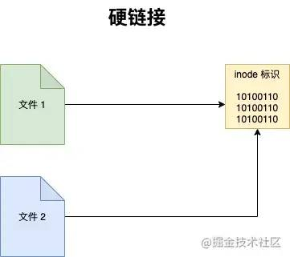

[2万字系统总结，带你实现Linux命令自由 (qq.com)](https://mp.weixin.qq.com/s/3v2mS73UVOywFhuMXZzbeg)

[Apache | Linux 实践指南 (websoft9.com)](https://support.websoft9.com/docs/linux/zh/webs-apache.html#配置说明)

# 切换用户

```shell
(1)sudo 命令  
这样输入当前管理员用户密码就可以得到超级用户的权限。但默认的情况下5分钟root权限就失效了。
(2)sudo -i
通过这种方法输入当前管理员用户的密码就可以进到root用户。
(3)如果想一直使用root权限，要通过su切换到root用户。
那我们首先要重设置root用户的密码：
sudo passwd root
这样就可以设置root用户的密码了。

之后就可以自由的切换到root用户了
su
输入root用户的密码即可。

当然，如果想从root用户切换回一般用户，则可使用  su -val(一般用户名)

而当你再次切回到root用户，则只需要键入exit,再次输入exit则回到最初的用户下
```

# 快捷方式

在开始学习 `Linux` 命令之前，有这么一些快捷方式，是必须要提前掌握的，它将贯穿整个 `Linux` 使用生涯。

- 通过上下方向键 ↑ ↓ 来调取过往执行过的 `Linux` 命令；
- 命令或参数仅需输入前几位就可以用 `Tab` 键补全；
- `Ctrl + R` ：用于查找使用过的命令（`history` 命令用于列出之前使用过的所有命令，然后输入 `!` 命令加上编号( `!2` )就可以直接执行该历史命令）；
- `Ctrl + L`：清除屏幕并将当前行移到页面顶部；
- `Ctrl + C`：中止当前正在执行的命令；
- `Ctrl + U`：从光标位置剪切到行首；
- `Ctrl + K`：从光标位置剪切到行尾；
- `Ctrl + W`：剪切光标左侧的一个单词；
- `Ctrl + Y`：粘贴 `Ctrl + U | K | Y` 剪切的命令；
- `Ctrl + A`：光标跳到命令行的开头；
- `Ctrl + E`：光标跳到命令行的结尾；
- `Ctrl + D`：关闭 `Shell` 会话；


# 文件和目录



**pwd**

显示当前目录的路径

**which**

查看命令的可执行文件所在路径， `Linux` 下，每一条命令其实都对应一个可执行程序，在终端中输入命令，按回车的时候，就是执行了对应的那个程序， `which` 命令本身对应的程序也存在于 `Linux` 中。

**ls**

列出文件和目录，它是 `Linux` 最常用的命令之一。

【常用参数】

- `-a` 显示所有文件和目录包括隐藏的
- `-l` 显示详细列表
- `-h` 适合人类阅读的
- `-t` 按文件最近一次修改时间排序
- `-i` 显示文件的 `inode` （ `inode` 是文件内容的标识）
