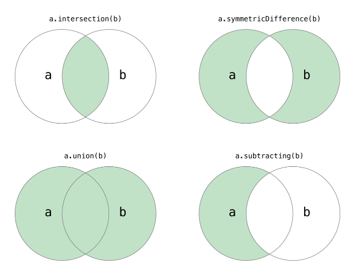
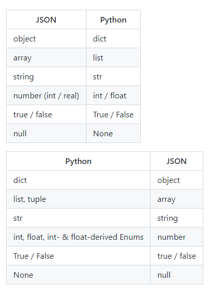

# 创建虚拟环境

通过执行venv指令来创建

```pyth
python -m venv /path/to/new/virtual/environment
```

启动虚拟环境

```python
.\Scripts\activate
//退出虚拟环境
.\Scripts\deactivate
```


# 面向对象

原则

单一类原则

开放关闭原则

对扩展开放对修改关闭


# 字符串

| in     | 成员运算符 - 如果字符串中包含给定的字符返回 True             | **'H' in a** 输出结果 True     |
| ------ | ------------------------------------------------------------ | ------------------------------ |
| not in | 成员运算符 - 如果字符串中不包含给定的字符返回 True           | **'M' not in a** 输出结果 True |
| r/R    | 原始字符串 - 原始字符串：所有的字符串都是直接按照字面的意思来使用，没有转义特殊或不能打印的字符。 原始字符串除在字符串的第一个引号前加上字母 **r**（可以大小写）以外，与普通字符串有着几乎完全相同的语法。 |                                |

| %c   | 格式化字符及其ASCII码                |
| ---- | ------------------------------------ |
| %s   | 格式化字符串                         |
| %d   | 格式化整数                           |
| %u   | 格式化无符号整型                     |
| %o   | 格式化无符号八进制数                 |
| %x   | 格式化无符号十六进制数               |
| %X   | 格式化无符号十六进制数（大写）       |
| %f   | 格式化浮点数字，可指定小数点后的精度 |
| %e   | 用科学计数法格式化浮点数             |
| %E   | 作用同%e，用科学计数法格式化浮点数   |
| %g   | %f和%e的简写                         |
| %G   | %f 和 %E 的简写                      |
| %p   | 用十六进制数格式化变量的地址         |

f-string

x = 1
print(f'{x+1}')  # Python 3.6
2

## 内建函数

| 1    | [capitalize()](https://www.runoob.com/python3/python3-string-capitalize.html) 将字符串的第一个字符转换为大写 |
| ---- | ------------------------------------------------------------ |
| 2    | [center(width, fillchar)](https://www.runoob.com/python3/python3-string-center.html)返回一个指定的宽度 width 居中的字符串，fillchar 为填充的字符，默认为空格。 |
| 3    | [count(str, beg= 0,end=len(string))](https://www.runoob.com/python3/python3-string-count.html) 返回 str 在 string 里面出现的次数，如果 beg 或者 end 指定则返回指定范围内 str 出现的次数 |
| 4    | [bytes.decode(encoding="utf-8", errors="strict")](https://www.runoob.com/python3/python3-string-decode.html) Python3 中没有 decode 方法，但我们可以使用 bytes 对象的 decode() 方法来解码给定的 bytes 对象，这个 bytes 对象可以由 str.encode() 来编码返回。 |
| 5    | [encode(encoding='UTF-8',errors='strict')](https://www.runoob.com/python3/python3-string-encode.html) 以 encoding 指定的编码格式编码字符串，如果出错默认报一个ValueError 的异常，除非 errors 指定的是'ignore'或者'replace' |
| 6    | [endswith(suffix, beg=0, end=len(string))](https://www.runoob.com/python3/python3-string-endswith.html) 检查字符串是否以 obj 结束，如果beg 或者 end 指定则检查指定的范围内是否以 obj 结束，如果是，返回 True,否则返回 False. |
| 7    | [expandtabs(tabsize=8)](https://www.runoob.com/python3/python3-string-expandtabs.html) 把字符串 string 中的 tab 符号转为空格，tab 符号默认的空格数是 8 。 |
| 8    | [find(str, beg=0, end=len(string))](https://www.runoob.com/python3/python3-string-find.html) 检测 str 是否包含在字符串中，如果指定范围 beg 和 end ，则检查是否包含在指定范围内，如果包含返回开始的索引值，否则返回-1 |
| 9    | [index(str, beg=0, end=len(string))](https://www.runoob.com/python3/python3-string-index.html) 跟find()方法一样，只不过如果str不在字符串中会报一个异常。 |
| 10   | [isalnum()](https://www.runoob.com/python3/python3-string-isalnum.html) 如果字符串至少有一个字符并且所有字符都是字母或数字则返 回 True，否则返回 False |
| 11   | [isalpha()](https://www.runoob.com/python3/python3-string-isalpha.html) 如果字符串至少有一个字符并且所有字符都是字母或中文字则返回 True, 否则返回 False |
| 12   | [isdigit()](https://www.runoob.com/python3/python3-string-isdigit.html) 如果字符串只包含数字则返回 True 否则返回 False.. |
| 13   | [islower()](https://www.runoob.com/python3/python3-string-islower.html) 如果字符串中包含至少一个区分大小写的字符，并且所有这些(区分大小写的)字符都是小写，则返回 True，否则返回 False |
| 14   | [isnumeric()](https://www.runoob.com/python3/python3-string-isnumeric.html) 如果字符串中只包含数字字符，则返回 True，否则返回 False |
| 15   | [isspace()](https://www.runoob.com/python3/python3-string-isspace.html) 如果字符串中只包含空白，则返回 True，否则返回 False. |
| 16   | [istitle()](https://www.runoob.com/python3/python3-string-istitle.html) 如果字符串是标题化的(见 title())则返回 True，否则返回 False |
| 17   | [isupper()](https://www.runoob.com/python3/python3-string-isupper.html) 如果字符串中包含至少一个区分大小写的字符，并且所有这些(区分大小写的)字符都是大写，则返回 True，否则返回 False |
| 18   | [join(seq)](https://www.runoob.com/python3/python3-string-join.html) 以指定字符串作为分隔符，将 seq 中所有的元素(的字符串表示)合并为一个新的字符串 |
| 19   | [len(string)](https://www.runoob.com/python3/python3-string-len.html) 返回字符串长度 |
| 20   | [ljust(width[, fillchar\])](https://www.runoob.com/python3/python3-string-ljust.html) 返回一个原字符串左对齐,并使用 fillchar 填充至长度 width 的新字符串，fillchar 默认为空格。 |
| 21   | [lower()](https://www.runoob.com/python3/python3-string-lower.html) 转换字符串中所有大写字符为小写. |
| 22   | [lstrip()](https://www.runoob.com/python3/python3-string-lstrip.html) 截掉字符串左边的空格或指定字符。 |
| 23   | [maketrans()](https://www.runoob.com/python3/python3-string-maketrans.html) 创建字符映射的转换表，对于接受两个参数的最简单的调用方式，第一个参数是字符串，表示需要转换的字符，第二个参数也是字符串表示转换的目标。 |
| 24   | [max(str)](https://www.runoob.com/python3/python3-string-max.html) 返回字符串 str 中最大的字母。 |
| 25   | [min(str)](https://www.runoob.com/python3/python3-string-min.html) 返回字符串 str 中最小的字母。 |
| 26   | [replace(old, new [, max\])](https://www.runoob.com/python3/python3-string-replace.html) 把 将字符串中的 old 替换成 new,如果 max 指定，则替换不超过 max 次。 |
| 27   | [rfind(str, beg=0,end=len(string))](https://www.runoob.com/python3/python3-string-rfind.html) 类似于 find()函数，不过是从右边开始查找. |
| 28   | [rindex( str, beg=0, end=len(string))](https://www.runoob.com/python3/python3-string-rindex.html) 类似于 index()，不过是从右边开始. |
| 29   | [rjust(width,[, fillchar\])](https://www.runoob.com/python3/python3-string-rjust.html) 返回一个原字符串右对齐,并使用fillchar(默认空格）填充至长度 width 的新字符串 |
| 30   | [rstrip()](https://www.runoob.com/python3/python3-string-rstrip.html) 删除字符串末尾的空格或指定字符。 |
| 31   | [split(str="", num=string.count(str))](https://www.runoob.com/python3/python3-string-split.html) 以 str 为分隔符截取字符串，如果 num 有指定值，则仅截取 num+1 个子字符串 |
| 32   | [splitlines([keepends\])](https://www.runoob.com/python3/python3-string-splitlines.html) 按照行('\r', '\r\n', \n')分隔，返回一个包含各行作为元素的列表，如果参数 keepends 为 False，不包含换行符，如果为 True，则保留换行符。 |
| 33   | [startswith(substr, beg=0,end=len(string))](https://www.runoob.com/python3/python3-string-startswith.html) 检查字符串是否是以指定子字符串 substr 开头，是则返回 True，否则返回 False。如果beg 和 end 指定值，则在指定范围内检查。 |
| 34   | [strip([chars\])](https://www.runoob.com/python3/python3-string-strip.html) 在字符串上执行 lstrip()和 rstrip() |
| 35   | [swapcase()](https://www.runoob.com/python3/python3-string-swapcase.html) 将字符串中大写转换为小写，小写转换为大写 |
| 36   | [title()](https://www.runoob.com/python3/python3-string-title.html) 返回"标题化"的字符串,就是说所有单词都是以大写开始，其余字母均为小写(见 istitle()) |
| 37   | [translate(table, deletechars="")](https://www.runoob.com/python3/python3-string-translate.html) 根据 table 给出的表(包含 256 个字符)转换 string 的字符, 要过滤掉的字符放到 deletechars 参数中 |
| 38   | [upper()](https://www.runoob.com/python3/python3-string-upper.html) 转换字符串中的小写字母为大写 |
| 39   | [zfill (width)](https://www.runoob.com/python3/python3-string-zfill.html) 返回长度为 width 的字符串，原字符串右对齐，前面填充0 |
| 40   | [isdecimal()](https://www.runoob.com/python3/python3-string-isdecimal.html) 检查字符串是否只包含十进制字符，如果是返回 true，否则返回 false。 |

# 数据结构

列表 list=[]

append()添加insert()插入extend()合并两个列表pop()删除元素clear()清空列表

元组()

```
print(sys.getsizeof(f))  # 查看对象占用内存的字节数
# 请注意下面的代码创建的不是一个列表而是一个生成器对象
# 通过生成器可以获取到数据但它不占用额外的空间存储数据
# 每次需要数据的时候就通过内部的运算得到数据(需要花费额外的时间)
f = (x ** 2 for x in range(1, 1000))
print(sys.getsizeof(f))  # 相比生成式生成器不占用存储数据的空间
print(f)
for val in f:
    print(val)
```

1. 元组中的元素是无法修改的，事实上我们在项目中尤其是[多线程](https://zh.wikipedia.org/zh-hans/多线程)环境（后面会讲到）中可能更喜欢使用的是那些不变对象（一方面因为对象状态不能修改，所以可以避免由此引起的不必要的程序错误，简单的说就是一个不变的对象要比可变的对象更加容易维护；另一方面因为没有任何一个线程能够修改不变对象的内部状态，一个不变对象自动就是线程安全的，这样就可以省掉处理同步化的开销。一个不变对象可以方便的被共享访问）。所以结论就是：如果不需要对元素进行添加、删除、修改的时候，可以考虑使用元组，当然如果一个方法要返回多个值，使用元组也是不错的选择。
2. 元组在创建时间和占用的空间上面都优于列表。我们可以使用sys模块的getsizeof函数来检查存储同样的元素的元组和列表各自占用了多少内存空间，这个很容易做到。我们也可以在ipython中使用魔法指令%timeit来分析创建同样内容的元组和列表所花费的时间。

集合{}

不允许有重复元素，可以进行交集等运算



向集合添加元素和从集合删除元素。

```
set1.add(4)
set1.add(5)
set2.update([11, 12])
set2.discard(5)
if 4 in set2:
    set2.remove(4)
print(set1, set2)
print(set3.pop())
print(set3)
```

集合的成员、交集、并集、差集等运算。

```
# 集合的交集、并集、差集、对称差运算
print(set1 & set2)
# print(set1.intersection(set2))
print(set1 | set2)
# print(set1.union(set2))
print(set1 - set2)
# print(set1.difference(set2))
print(set1 ^ set2)
# print(set1.symmetric_difference(set2))
# 判断子集和超集
print(set2 <= set1)
# print(set2.issubset(set1))
print(set3 <= set1)
# print(set3.issubset(set1))
print(set1 >= set2)
# print(set1.issuperset(set2))
print(set1 >= set3)
# print(set1.issuperset(set3))
```

### 使用字典

字典是另一种可变容器模型，Python中的字典跟我们生活中使用的字典是一样一样的，它可以存储任意类型对象，与列表、集合不同的是，字典的每个元素都是由一个键和一个值组成的“键值对”，键和值通过冒号分开。下面的代码演示了如何定义和使用字典。

```
# 创建字典的字面量语法
scores = {'骆昊': 95, '白元芳': 78, '狄仁杰': 82}
print(scores)
# 创建字典的构造器语法
items1 = dict(one=1, two=2, three=3, four=4)
# 通过zip函数将两个序列压成字典
items2 = dict(zip(['a', 'b', 'c'], '123'))
# 创建字典的推导式语法
items3 = {num: num ** 2 for num in range(1, 10)}
print(items1, items2, items3)
# 通过键可以获取字典中对应的值
print(scores['骆昊'])
print(scores['狄仁杰'])
# 对字典中所有键值对进行遍历
for key in scores:
    print(f'{key}: {scores[key]}')
# 更新字典中的元素
scores['白元芳'] = 65
scores['诸葛王朗'] = 71
scores.update(冷面=67, 方启鹤=85)
print(scores)
if '武则天' in scores:
    print(scores['武则天'])
print(scores.get('武则天'))
# get方法也是通过键获取对应的值但是可以设置默认值
print(scores.get('武则天', 60))
# 删除字典中的元素
print(scores.popitem())
print(scores.popitem())
print(scores.pop('骆昊', 100))
# 清空字典
scores.clear()
print(scores)
```


# 数据精度问题

python中的浮点数可能影响精度问题，因为浮点数运算快，精度不够
eg.2/3=0   2.0/3=0.66666666666666

```python
from decimal import getcontext,Decimal
getcontext().prec=1
print (Decimal(0.1)+Decimal(0.2)
```
从decimal 模块中导入getcontext 和Decimal。
将舍入精度设定为一位小数。decimal 模块将大部分的舍入和精度设置保存在默认的上
下文（context）中。本行代码将上下文的精度改成只保留一位小数。
对两个小数（一个值为0.1，一个值为0.2）求和。
## 字符串
.upper（）；大写
.strip();去除末尾空格
## 内置函数
type（）
dir() 
细节查看，帮助记忆
help（)

# 类和对象

python没有明确的私有和保护，在Python中，属性和方法的访问权限只有两种，也就是公开的和私有的，如果希望属性是私有的，在给属性命名时可以用两个下划线作为开头，Python并没有从语法上严格保证私有属性或方法的私密性，它只是给私有的属性和方法换了一个名字来妨碍对它们的访问，事实上如果你知道更换名字的规则仍然可以访问到它们

## @property装饰器

想访问属性可以通过属性的getter（访问器）和setter（修改器）方法进行对应的操作。如果要做到这点，就可以考虑使用@property包装器来包装getter和setter方法

## \_\_slots\_\_魔法

如果我们需要限定自定义类型的对象只能绑定某些属性，可以通过在类中定义\_\_slots_\_变量来进行限定。需要注意的是__slots__的限定只对当前类的对象生效，对子类并不起任何作用。

```python
# 限定Person对象只能绑定_name, _age和_gender属性
    __slots__ = ('_name', '_age', '_gender')
```


静态方法和类方法

在类中定义类方法，类方法的第一个参数约定名为cls，它代表的是当前类相关的信息的对象（类本身也是一个对象，有的地方也称之为类的元数据对象），通过这个参数我们可以获取和类相关的信息并且可以创建出类的对象

相当于在类的内部生成了一个类的对象来返回

抽象类

@abstracttmethod

@one.setter

重写就是子类在父类已有给出新的实现版本

# 文件

| 操作模式 | 具体含义                         |
| -------- | -------------------------------- |
| `'r'`    | 读取 （默认）                    |
| `'w'`    | 写入（会先截断之前的内容）       |
| `'x'`    | 写入，如果文件已经存在会产生异常 |
| `'a'`    | 追加，将内容写入到已有文件的末尾 |
| `'b'`    | 二进制模式                       |
| `'t'`    | 文本模式（默认）                 |
| `'+'`    | 更新（既可以读又可以写）         |

```python
def main():
    f = None
    try:
        f = open('致橡树.txt', 'r', encoding='utf-8')
        print(f.read())
    except FileNotFoundError:
        print('无法打开指定的文件!')
    except LookupError:
        print('指定了未知的编码!')
    except UnicodeDecodeError:
        print('读取文件时解码错误!')
    finally:
        if f:
            f.close()


if __name__ == '__main__':
    main()
    
# 可以多种读取方式
import time


def main():
    # 一次性读取整个文件内容
    with open('致橡树.txt', 'r', encoding='utf-8') as f:
        print(f.read())

    # 通过for-in循环逐行读取
    with open('致橡树.txt', mode='r') as f:
        for line in f:
            print(line, end='')
            time.sleep(0.5)
    print()

    # 读取文件按行读取到列表中
    with open('致橡树.txt') as f:
        lines = f.readlines()
    print(lines)
    

if __name__ == '__main__':
    main()
```


## 读取json文件

json文件的例子

```
{
    "name": "骆昊",
    "age": 38,
    "qq": 957658,
    "friends": ["王大锤", "白元芳"],
    "cars": [
        {"brand": "BYD", "max_speed": 180},
        {"brand": "Audi", "max_speed": 280},
        {"brand": "Benz", "max_speed": 320}
    ]
}
```



数据格式的对应关系，

```python
import json
def main():
    mydict = {
        'name': '骆昊',
        'age': 38,
        'qq': 957658,
        'friends': ['王大锤', '白元芳'],
        'cars': [
            {'brand': 'BYD', 'max_speed': 180},
            {'brand': 'Audi', 'max_speed': 280},
            {'brand': 'Benz', 'max_speed': 320}
        ]
    }
    try:
        with open('data.json', 'w', encoding='utf-8') as fs:
            json.dump(mydict, fs)
    except IOError as e:
        print(e)
    print('保存数据完成!')
if __name__ == '__main__':
    main()
```


json模块主要有四个比较重要的函数，分别是：

- `dump` - 将Python对象按照JSON格式序列化到文件中
- `dumps` - 将Python对象处理成JSON格式的字符串
- `load` - 将文件中的JSON数据反序列化成对象
- `loads` - 将字符串的内容反序列化成Python对象

使用 JSON 函数需要导入 json 库：**import json**。

| 函数       | 描述                                     |
| :--------- | :--------------------------------------- |
| json.dumps | 将 Python 对象编码成 JSON 字符串         |
| json.loads | 将已编码的 JSON 字符串解码为 Python 对象 |

序列化（serialization）在计算机科学的数据处理中，是指将数据结构或对象状态转换为可以存储或传输的形式，这样在需要的时候能够恢复到原先的状态，而且通过序列化的数据重新获取字节时，可以利用这些字节来产生原始对象的副本（拷贝）。与这个过程相反的动作，即从一系列字节中提取数据结构的操作，就是反序列化（deserialization）”。

通过调用api接口等到一个json的数据，前端可以通过读取json的数据来进行显示

# lambda

```python
x = lambda a : a + 10
print(x(5))
```


# Python中一些方法

```python
from time import time,loacltime,sleep
# 当前时间
localtime(time())
sleep(1)#等待一秒
```

# 正则表达式

| 符号         | 解释                             | 示例             | 说明                                                         |
| ------------ | -------------------------------- | ---------------- | ------------------------------------------------------------ |
| .            | 匹配任意字符                     | b.t              | 可以匹配bat / but / b#t / b1t等                              |
| \w           | 匹配字母/数字/下划线             | b\wt             | 可以匹配bat / b1t / b_t等 但不能匹配b#t                      |
| \s           | 匹配空白字符（包括\r、\n、\t等） | love\syou        | 可以匹配love you                                             |
| \d           | 匹配数字                         | \d\d             | 可以匹配01 / 23 / 99等                                       |
| \b           | 匹配单词的边界                   | \bThe\b          |                                                              |
| ^            | 匹配字符串的开始                 | ^The             | 可以匹配The开头的字符串                                      |
| $            | 匹配字符串的结束                 | .exe$            | 可以匹配.exe结尾的字符串                                     |
| \W           | 匹配非字母/数字/下划线           | b\Wt             | 可以匹配b#t / b@t等 但不能匹配but / b1t / b_t等              |
| \S           | 匹配非空白字符                   | love\Syou        | 可以匹配love#you等 但不能匹配love you                        |
| \D           | 匹配非数字                       | \d\D             | 可以匹配9a / 3# / 0F等                                       |
| \B           | 匹配非单词边界                   | \Bio\B           |                                                              |
| []           | 匹配来自字符集的任意单一字符     | [aeiou]          | 可以匹配任一元音字母字符                                     |
| [^]          | 匹配不在字符集中的任意单一字S符  | [^aeiou]         | 可以匹配任一非元音字母字符                                   |
| *            | 匹配0次或多次                    | \w*              |                                                              |
| +            | 匹配1次或多次                    | \w+              |                                                              |
| ?            | 匹配0次或1次                     | \w?              |                                                              |
| {N}          | 匹配N次                          | \w{3}            |                                                              |
| {M,}         | 匹配至少M次                      | \w{3,}           |                                                              |
| {M,N}        | 匹配至少M次至多N次               | \w{3,6}          |                                                              |
| \|           | 分支                             | foo\|bar         | 可以匹配foo或者bar                                           |
| (?#)         | 注释                             |                  |                                                              |
| (exp)        | 匹配exp并捕获到自动命名的组中    |                  |                                                              |
| (?<name\>exp) | 匹配exp并捕获到名为name的组中    |                  |                                                              |
| (?:exp)      | 匹配exp但是不捕获匹配的文本      |                  |                                                              |
| (?=exp)      | 匹配exp前面的位置                | \b\w+(?=ing)     | 可以匹配I'm dancing中的danc                                  |
| (?<=exp)     | 匹配exp后面的位置                | (?<=\bdanc)\w+\b | 可以匹配I love dancing and reading中的第一个ing              |
| (?!exp)      | 匹配后面不是exp的位置            |                  |                                                              |
| (?<!exp)     | 匹配前面不是exp的位置            |                  |                                                              |
| *?           | 重复任意次，但尽可能少重复       | a.*b a.*?b       | 将正则表达式应用于aabab，前者会匹配整个字符串aabab，后者会匹配aab和ab两个字符串 |
| +?           | 重复1次或多次，但尽可能少重复    |                  |                                                              |
| ??           | 重复0次或1次，但尽可能少重复     |                  |                                                              |
| {M,N}?       | 重复M到N次，但尽可能少重复       |                  |                                                              |
| {M,}?        | 重复M次以上，但尽可能少重复      |                  |                                                              |

> **说明：** 如果需要匹配的字符是正则表达式中的特殊字符，那么可以使用\进行转义处理，例如想匹配小数点可以写成\.就可以了，因为直接写.会匹配任意字符；同理，想匹配圆括号必须写成\(和\)，否则圆括号被视为正则表达式中的分组。

### Python对正则表达式的支持

Python提供了re模块来支持正则表达式相关操作，下面是re模块中的核心函数。

| 函数                                         | 说明                                                         |
| -------------------------------------------- | ------------------------------------------------------------ |
| compile(pattern, flags=0)                    | 编译正则表达式返回正则表达式对象                             |
| match(pattern, string, flags=0)              | 用正则表达式匹配字符串 成功返回匹配对象 否则返回None         |
| search(pattern, string, flags=0)             | 搜索字符串中第一次出现正则表达式的模式 成功返回匹配对象 否则返回None |
| split(pattern, string, maxsplit=0, flags=0)  | 用正则表达式指定的模式分隔符拆分字符串 返回列表              |
| sub(pattern, repl, string, count=0, flags=0) | 用指定的字符串替换原字符串中与正则表达式匹配的模式 可以用count指定替换的次数 |
| fullmatch(pattern, string, flags=0)          | match函数的完全匹配（从字符串开头到结尾）版本                |
| findall(pattern, string, flags=0)            | 查找字符串所有与正则表达式匹配的模式 返回字符串的列表        |
| finditer(pattern, string, flags=0)           | 查找字符串所有与正则表达式匹配的模式 返回一个迭代器          |
| purge()                                      | 清除隐式编译的正则表达式的缓存                               |
| re.I / re.IGNORECASE                         | 忽略大小写匹配标记                                           |
| re.M / re.MULTILINE                          | 多行匹配标记                                                 |

> **说明：** 上面提到的re模块中的这些函数，实际开发中也可以用正则表达式对象的方法替代对这些函数的使用，如果一个正则表达式需要重复的使用，那么先通过compile函数编译正则表达式并创建出正则表达式对象无疑是更为明智的选择。

## re.match与re.search的区别

re.match 只匹配字符串的开始，如果字符串开始不符合正则表达式，则匹配失败，函数返回 None，而 re.search 匹配整个字符串，直到找到一个匹配。

一些例子

```python
r'^[1-9]\d{4,11}'  表示匹配以1到9开头然后4位到11位数字结尾的字符串
r'[0-9a-zA-Z]{6,20}$' 表示6到20位的用户名
r表示原始字符串 每个字符数其原来的意思
(?<=\D)(1[38]\d{9}|14[57]\d{8}|15[0-35-9]\d{8}|17[678]\d{8})(?=\D) 匹配国内的手机号码
还可以替换字符串里面内容
re.sub()
import re
def main():
    sentence = '你丫是傻叉吗? 我操你大爷的. Fuck you.'
    purified = re.sub('[操肏艹]|fuck|shit|傻[比屄逼叉缺吊屌]|煞笔',
                      '*', sentence, flags=re.IGNORECASE)
    print(purified)  # 你丫是*吗? 我*你大爷的. * you.
if __name__ == '__main__':
    main()
### 说明： re模块的正则表达式相关函数中都有一个flags参数，它代表了正则表达式的匹配标记，可以通过该标记来指定匹配时是否忽略大小写、是否进行多行匹配、是否显示调试信息等。如果需要为flags参数指定多个值，可以使用按位或运算符进行叠加，如flags=re.I | re.M。
###
#拆分字符串
poem = '窗前明月光，疑是地上霜。举头望明月，低头思故乡。'
    sentence_list = re.split(r'[，。, .]', poem)
    while '' in sentence_list:
        sentence_list.remove('')
    print(sentence_list)  # ['窗前明月光', '疑是地上霜', '举头望明月', '低头思故乡']

```


# 图形用户界面和游戏开发

tkinter模块的GUI

基本上使用tkinter来开发GUI应用需要以下5个步骤：

1. 导入tkinter模块中我们需要的东西。
2. 创建一个顶层窗口对象并用它来承载整个GUI应用。
3. 在顶层窗口对象上添加GUI组件。
4. 通过代码将这些GUI组件的功能组织起来。
5. 进入主事件循环(main loop)。

与数据库的互动

```python
import pymysql
# 打开数据库连接
db = pymysql.connect("localhost","testuser","test123","TESTDB" )
# 使用cursor()方法获取操作游标 
cursor = db.cursor()
# SQL 插入语句
sql = """INSERT INTO STUDENT(s_name, s_tel)
         VALUES (%s, %s)""" % ('张三', '15664322132')
try:
   # 执行sql语句
   cursor.execute(sql)
   # 提交到数据库执行
   db.commit()
except:
   # 如果发生错误则回滚
   db.rollback()
# 关闭数据库连接
db.close()
```


redis

```
那么为什么不直接全部用redis存储呢？
因为redis存储在内存中，如果存储在内存中，存储容量肯定要比磁盘少很多，那么要存储大量数据，只能花更多的钱去购买内存，造成在一些不需要高性能的地方是相对比较浪费的，所以目前基本都是mysql(主) + redis(辅)，在需要性能的地方使用redis，在不需要高性能的地方使用mysql，好钢用在刀刃上
1）mysql支持sql查询，可以实现一些关联的查询以及统计；
2）redis对内存要求比较高，在有限的条件下不能把所有数据都放在redis；
3）mysql偏向于存数据，redis偏向于快速取数据，但redis查询复杂的表关系时不如mysql，
所以可以把热门的数据放redis，mysql存基本数据
```

# 网络编程


## socket()函数

Python 中，我们用 socket（）函数来创建套接字，语法格式如下：

```
socket.socket([family[, type[, proto]]])
test=socket.socket(socket.AF_INET,socket.SOCK_STREAM)
```

### 参数

- family: 套接字家族可以使 AF_UNIX 或者 AF_INET。
- type: 套接字类型可以根据是面向连接的还是非连接分为 `SOCK_STREAM` 或 `SOCK_DGRAM`。
- protocol: 一般不填默认为 0。

| s.bind()                             | 绑定地址（host,port）到套接字， 在 AF_INET下，以元组（host,port）的形式表示地址。 |
| ------------------------------------ | ------------------------------------------------------------ |
| s.listen()                           | 开始 TCP 监听。backlog 指定在拒绝连接之前，操作系统可以挂起的最大连接数量。该值至少为 1，大部分应用程序设为 5 就可以了。 |
| s.accept()                           | 被动接受TCP客户端连接,(阻塞式)等待连接的到来                 |
| 客户端套接字                         |                                                              |
| s.connect()                          | 主动初始化TCP服务器连接，。一般address的格式为元组（hostname,port），如果连接出错，返回socket.error错误。 |
| s.connect_ex()                       | connect()函数的扩展版本,出错时返回出错码,而不是抛出异常      |
| 公共用途的套接字函数                 |                                                              |
| s.recv()                             | 接收 TCP 数据，数据以字符串形式返回，bufsize 指定要接收的最大数据量。flag 提供有关消息的其他信息，通常可以忽略。 |
| s.send()                             | 发送 TCP 数据，将 string 中的数据发送到连接的套接字。返回值是要发送的字节数量，该数量可能小于 string 的字节大小。 |
| s.sendall()                          | 完整发送 TCP 数据。将 string 中的数据发送到连接的套接字，但在返回之前会尝试发送所有数据。成功返回 None，失败则抛出异常。 |
| s.recvfrom()                         | 接收 UDP 数据，与 recv() 类似，但返回值是（data,address）。其中 data 是包含接收数据的字符串，address 是发送数据的套接字地址。 |
| s.sendto()                           | 发送 UDP 数据，将数据发送到套接字，address 是形式为（ipaddr，port）的元组，指定远程地址。返回值是发送的字节数。 |
| s.close()                            | 关闭套接字                                                   |
| s.getpeername()                      | 返回连接套接字的远程地址。返回值通常是元组（ipaddr,port）。  |
| s.getsockname()                      | 返回套接字自己的地址。通常是一个元组(ipaddr,port)            |
| s.setsockopt(level,optname,value)    | 设置给定套接字选项的值。                                     |
| s.getsockopt(level,optname[.buflen]) | 返回套接字选项的值。                                         |
| s.settimeout(timeout)                | 设置套接字操作的超时期，timeout是一个浮点数，单位是秒。值为None表示没有超时期。一般，超时期应该在刚创建套接字时设置，因为它们可能用于连接的操作（如connect()） |
| s.gettimeout()                       | 返回当前超时期的值，单位是秒，如果没有设置超时期，则返回None。 |
| s.fileno()                           | 返回套接字的文件描述符。                                     |
| s.setblocking(flag)                  | 如果flag为0，则将套接字设为非阻塞模式，否则将套接字设为阻塞模式（默认值）。非阻塞模式下，如果调用recv()没有发现任何数据，或send()调用无法立即发送数据，那么将引起socket.error异常。 |
| s.makefile()                         | 创建一个与该套接字相关连的文件                               |

```

```


# 多线程多进程

Unix和Linux操作系统上提供了`fork()`系统调用来创建进程，调用`fork()`函数的是父进程，创建出的是子进程，子进程是父进程的一个拷贝，但是子进程拥有自己的PID。`fork()`函数非常特殊它会返回两次，父进程中可以通过`fork()`函数的返回值得到子进程的PID，而子进程中的返回值永远都是0。Python的os模块提供了`fork()`函数。由于Windows系统没有`fork()`调用，因此要实现跨平台的多进程编程，可以使用multiprocessing模块的`Process`类来创建子进程，而且该模块还提供了更高级的封装，例如批量启动进程的进程池（`Pool`）、用于进程间通信的队列（`Queue`）和管道（`Pipe`）等。

```python
from random import randint
from threading import Thread
from time import time, sleep
def download(filename):
    print('开始下载%s...' % filename)
    time_to_download = randint(5, 10)
    sleep(time_to_download)
    print('%s下载完成! 耗费了%d秒' % (filename, time_to_download)
def main():
    start = time()
    t1 = Thread(target=download, args=('Python从入门到住院.pdf',))
    t1.start()
    t2 = Thread(target=download, args=('Peking Hot.avi',))
    t2.start()
    t1.join()
    t2.join()
    end = time()
    print('总共耗费了%.3f秒' % (end - start))
if __name__ == '__main__':
    main()
```


```python
from multiprocessing import Process
from os import getpid
from random import randint
from time import time, sleep
def download_task(filename):
    print('启动下载进程，进程号[%d].' % getpid())
    print('开始下载%s...' % filename)
    time_to_download = randint(5, 10)
    sleep(time_to_download)
    print('%s下载完成! 耗费了%d秒' % (filename, time_to_download))
def main():
    start = time()
    #创建进程对象，通过target参数传入函数，args是一个元组表示传递个函数的参数
    #通过start来启动进程，join表示进程执行结束
    p1 = Process(target=download_task, args=('Python从入门到住院.pdf', ))
    p1.start()
    p2 = Process(target=download_task, args=('Peking Hot.avi', ))
    p2.start()
    p1.join()
    p2.join()
    end = time()
    print('总共耗费了%.2f秒.' % (end - start))
if __name__ == '__main__':
    main()
```

multiprocessing模块中的`Queue`类，它是可以被多个进程共享的队列，底层是通过管道和[信号量（semaphore）](https://github.com/jackfrued/Python-100-Days/blob/master/Day01-15)机制来实现的

```python
from multiprocessing import Process, Queue
from random import randint
from time import time
def task_handler(curr_list, result_queue):
    total = 0
    for number in curr_list:
        total += number
    result_queue.put(total)
def main():
    processes = []
    number_list = [x for x in range(1, 100000001)]
    result_queue = Queue()
    index = 0
    # 启动8个进程将数据切片后进行运算
    for _ in range(8):
        p = Process(target=task_handler,
                    args=(number_list[index:index + 12500000], result_queue))
        index += 12500000
        processes.append(p)
        p.start()
    # 开始记录所有进程执行完成花费的时间
    start = time()
    for p in processes:
        p.join()
    # 合并执行结果
    total = 0
    while not result_queue.empty():
        total += result_queue.get()
    print(total)
    end = time()
    print('Execution time: ', (end - start), 's', sep='')
if __name__ == '__main__':
    main()
```


### 多进程还是多线程

进程优点：编程、调试简单，可靠性较高。
进程缺点：创建、销毁、切换速度慢，内存、资源占用大。
线程优点：创建、销毁、切换速度快，内存、资源占用小。
线程缺点：编程、调试复杂，可靠性较差。

无论是多进程还是多线程，只要数量一多，效率肯定上不去，为什么呢？我们打个比方，假设你不幸正在准备中考，每天晚上需要做语文、数学、英语、物理、化学这5科的作业，每项作业耗时1小时。如果你先花1小时做语文作业，做完了，再花1小时做数学作业，这样，依次全部做完，一共花5小时，这种方式称为单任务模型。如果你打算切换到多任务模型，可以先做1分钟语文，再切换到数学作业，做1分钟，再切换到英语，以此类推，只要切换速度足够快，这种方式就和单核CPU执行多任务是一样的了，以旁观者的角度来看，你就正在同时写5科作业。

但是，切换作业是有代价的，比如从语文切到数学，要先收拾桌子上的语文书本、钢笔（这叫保存现场），然后，打开数学课本、找出圆规直尺（这叫准备新环境），才能开始做数学作业。操作系统在切换进程或者线程时也是一样的，它需要先保存当前执行的现场环境（CPU寄存器状态、内存页等），然后，把新任务的执行环境准备好（恢复上次的寄存器状态，切换内存页等），才能开始执行。这个切换过程虽然很快，但是也需要耗费时间。如果有几千个任务同时进行，操作系统可能就主要忙着切换任务，根本没有多少时间去执行任务了，这种情况最常见的就是硬盘狂响，点窗口无反应，系统处于假死状态。所以，多任务一旦多到一个限度，反而会使得系统性能急剧下降，最终导致所有任务都做不好。

是否采用多任务的第二个考虑是任务的类型，可以把任务分为计算密集型和I/O密集型。计算密集型任务的特点是要进行大量的计算，消耗CPU资源，比如对视频进行编码解码或者格式转换等等，这种任务全靠CPU的运算能力，虽然也可以用多任务完成，但是任务越多，花在任务切换的时间就越多，CPU执行任务的效率就越低。计算密集型任务由于主要消耗CPU资源，这类任务用Python这样的脚本语言去执行效率通常很低，最能胜任这类任务的是C语言，我们之前提到过Python中有嵌入C/C++代码的机制。

除了计算密集型任务，其他的涉及到网络、存储介质I/O的任务都可以视为I/O密集型任务，这类任务的特点是CPU消耗很少，任务的大部分时间都在等待I/O操作完成（因为I/O的速度远远低于CPU和内存的速度）。对于I/O密集型任务，如果启动多任务，就可以减少I/O等待时间从而让CPU高效率的运转。有一大类的任务都属于I/O密集型任务，这其中包括了我们很快会涉及到的网络应用和Web应用。

| **对比维度**   | **多进程**                                                   | **多线程**                                                   | **总结** |
| -------------- | ------------------------------------------------------------ | ------------------------------------------------------------ | -------- |
| 数据共享、同步 | 数据共享复杂，需要用IPC；数据是分开的，同步简单              | 因为共享进程数据，数据共享简单，但也是因为这个原因导致同步复杂 | 各有优势 |
| 内存、CPU      | 占用内存多，切换复杂，CPU利用率低                            | 占用内存少，切换简单，CPU利用率高                            | 线程占优 |
| 创建销毁、切换 | 创建销毁、切换复杂，速度慢                                   | 创建销毁、切换简单，速度很快                                 | 线程占优 |
| 编程、调试     | 编程简单，调试简单                                           | 编程复杂，调试复杂                                           | 进程占优 |
| 可靠性         | 进程间不会互相影响                                           | 一个线程挂掉将导致整个进程挂掉                               | 进程占优 |
| 分布式         | 适应于多核、多机分布式；如果一台机器不够，扩展到多台机器比较简单 | 适应于多核分布式                                             | 进程占优 |

**1.需要频繁创建销毁的优先用线程** 

原因请看上面的对比。

这种原则最常见的应用就是Web服务器了，来一个连接建立一个线程，断了就销毁线程，要是用进程，创建和销毁的代价是很难承受的

**2.需要进行大量计算的优先使用线程**

所谓大量计算，当然就是要耗费很多CPU，切换频繁了，这种情况下线程是最合适的。

这种原则最常见的是图像处理、算法处理。

**3.强相关的处理用线程，弱相关的处理用进程**

什么叫强相关、弱相关？理论上很难定义，给个简单的例子就明白了。

一般的Server需要完成如下任务：消息收发、消息处理。“消息收发”和“消息处理”就是弱相关的任务，而“消息处理”里面可能又分为“消息解码”、“业务处理”，这两个任务相对来说相关性就要强多了。因此“消息收发”和“消息处理”可以分进程设计，“消息解码”、“业务处理”可以分线程设计。

当然这种划分方式不是一成不变的，也可以根据实际情况进行调整。

**4可能要扩展到多机分布的用进程，多核分布的用线程**

原因请看上面对比。

**5都满足需求的情况下，用你最熟悉、最拿手的方式**

至于“数据共享、同步”、“编程、调试”、“可靠性”这几个维度的所谓的“复杂、简单”应该怎么取舍，我只能说：没有明确的选择方法。但我可以告诉你一个选择原则：如果多进程和多线程都能够满足要求，那么选择你最熟悉、最拿手的那个。


# 数据学习

CSV 文件（简称为CSV）是指将数据列用逗号分隔的文件。文件的扩展名是.csv。
作制表符分隔值（tab-separated values，TSV）数据，有时也与CSV归为一类。TSV 与CSV 唯一的不同之处在于，数据列之间的分隔符是制表符（tab），而不是逗号。文件的扩展名通常是.tsv，但有时也用.csv 作为扩展名。从本质上来看，.tsv 文件与.csv 文件在Python 中的作用是相同的。如果文件的扩展名是.tsv，那么里面包含的很可能是TSV 数据。如果文件的
扩展名是.csv，那么里面包含的可能是CSV 数据，但也可能是TSV 数据。
一定要打开文件查看一下，这样你可以在导入数据之前就明确所处理的数据
类型。
