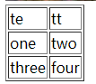

# HTML基础

[HTML 元素 | 菜鸟教程 (runoob.com)](https://www.runoob.com/html/html-elements.html)

[HTML 标签列表(字母排序) | 菜鸟教程 (runoob.com)](https://www.runoob.com/tags/html-reference.html)

[HTML 速查列表 | 菜鸟教程 (runoob.com)](https://www.runoob.com/html/html-quicklist.html)

常用

```html
<meta> 为搜索引擎定义关键词
<meta http-equiv="refresh" content="30">每30s刷新页面
<script>客户端脚本文件
<style>html的样式文件
```

# 图像

```
定义图像
<map>定义图像地图
<area>定义图像可点击区域
```

# 表格



```
<table border="1">
        <tr>//行
            <td>te</td>//表头
            <td>tt</td>
        </tr>
        <tr>
            <td>one</td>
            <td>two</td>
        </tr>
        <tr>
            <td>three</td>
            <td>four</td>
        </tr>
    </table>
```


标签	描述

<table\>	定义表格
<th\>	定义表格的表头
<tr\>	定义表格的行
<td\>	定义表格单元
<caption\>	定义表格标题
<colgroup\>	定义表格列的组
<col\>	定义用于表格列的属性
<thead\>	定义表格的页眉
<tbody\>	定义表格的主体
<tfoot\>	定义表格的页脚

有序表

```
<ol>
<li>Coffee</li>
<li>Milk</li>
</ol>
```

自定义列表

```
<dl>
<dt>Coffee</dt>
<dd>- black hot drink</dd>
<dt>Milk</dt>
<dd>- white cold drink</dd>
</dl>
```


无序表

```
<ul>
<li>Coffee</li>
<li>Milk</li>
</ul>
```

# <div\>和<span\>

**HTML 区块元素**

大多数 HTML 元素被定义为**块级元素**或**内联元素**。

块级元素在浏览器显示时，通常会以新行来开始（和结束）。

实例: `<h1>, <p>, <ul>, <table>`

------

**HTML 内联元素**

内联元素在显示时通常不会以新行开始。

实例: `<b>, <td>, <a>, `

------

**HTML `<div>` 元素**

HTML `<div>` 元素是块级元素，它可用于组合其他 HTML 元素的容器。

<div> 元素没有特定的含义。除此之外，由于它属于块级元素，浏览器会在其前后显示折行。

如果与 CSS 一同使用，`<div>` 元素可用于对大的内容块设置样式属性。

<div> 元素的另一个常见的用途是文档布局。它取代了使用表格定义布局的老式方法。使用 <table> 元素进行文档布局不是表格的正确用法。<table> 元素的作用是显示表格化的数据。

------

**HTML `<span`> 元素**

HTML `<span>` 元素是内联元素，可用作文本的容器

`<span>` 元素也没有特定的含义。

当与 CSS 一同使用时，`<span`> 元素可用于为部分文本设置样式属性。

# 表单

[HTML 表单 | 菜鸟教程 (runoob.com)](https://www.runoob.com/html/html-forms.html)

`<form>`

```
<form>	定义供用户输入的表单
<input>	定义输入域
<textarea>	定义文本域 (一个多行的输入控件)
<label>	定义了 <input> 元素的标签，一般为输入标题
<fieldset>	定义了一组相关的表单元素，并使用外框包含起来
<legend>	定义了 <fieldset> 元素的标题
<select>	定义了下拉选项列表
<optgroup>	定义选项组
<option>	定义下拉列表中的选项
<button>	定义一个点击按钮
<datalist>New	指定一个预先定义的输入控件选项列表
<keygen>New	定义了表单的密钥对生成器字段
<output>New	定义一个计算结果
```

`<iframe>`框架在页面里面不止显示一个页面

<iframe src="https://www.runoob.com/html/html-colors.html" frameborder="0"></iframe>

# 颜色

[HTML 颜色名 | 菜鸟教程 (runoob.com)](https://www.runoob.com/html/html-colornames.html)

# 脚本

```
<div >
        <p>点击</p>
        <p id="demo">one</p>
        <button onclick="myFunction()">点击</button>
        <button onclick="clearname()">清除</button>
    </div>
    <script>
        var count=1;
        function myFunction() {
            var x = document.getElementById("demo");
            count++;
            x.innerHTML = count;
        }
        function clearname(){
            count=0;
            document.getElementById("demo").innerHTML=count;
        }
```


# 实体字符

```
 	空格	&nbsp;	&#160;
<	小于号	&lt;	&#60;
>	大于号	&gt;	&#62;
&	和号	&amp;	&#38;
"	引号	&quot;	&#34;
'	撇号 	&apos; (IE不支持)	&#39;
￠	分	&cent;	&#162;
£	镑	&pound;	&#163;
¥	人民币/日元	&yen;	&#165;
€	欧元	&euro;	&#8364;
§	小节	&sect;	&#167;
©	版权	&copy;	&#169;
®	注册商标	&reg;	&#174;
™	商标	&trade;	&#8482;
×	乘号	&times;	&#215;
÷	除号	&divide;	&#247;
```


# url

```
http	超文本传输协议	以 http:// 开头的普通网页。不加密。
https	安全超文本传输协议	安全网页，加密所有信息交换。
ftp	文件传输协议	用于将文件下载或上传至网站。
file	 	您计算机上的文件。
```

URL 只能使用 [ASCII 字符集](https://www.runoob.com/tags/html-ascii.html).

# HTML5

[HTML 标签列表(字母排序) | 菜鸟教程 (runoob.com)](https://www.runoob.com/tags/html-reference.html)

html5支持

- 新元素
- 新属性
- 完全支持 CSS3
- Video 和 Audio
- 2D/3D 制图
- 本地存储
- 本地 SQL 数据
- Web 应用

使用 HTML5 你可以简单的在网页中播放 视频(video)与音频 (audio) 。

HTML5 应用

使用 HTML5 你可以简单地开发应用

- 本地数据存储
- 访问本地文件
- 本地 SQL 数据
- 缓存引用
- Javascript 工作者
- XHTMLHttpRequest 2

```
<article>	定义页面独立的内容区域。
<aside>	定义页面的侧边栏内容。
<bdi>	允许您设置一段文本，使其脱离其父元素的文本方向设置。
<command>	定义命令按钮，比如单选按钮、复选框或按钮
<details>	用于描述文档或文档某个部分的细节
<dialog>	定义对话框，比如提示框
<summary>	标签包含 details 元素的标题
<figure>	规定独立的流内容（图像、图表、照片、代码等等）。
<figcaption>	定义 <figure> 元素的标题
<footer>	定义 section 或 document 的页脚。
<header>	定义了文档的头部区域
<mark>	定义带有记号的文本。
<meter>	定义度量衡。仅用于已知最大和最小值的度量。
<nav>	定义导航链接的部分。
<progress>	定义任何类型的任务的进度。
<ruby>	定义 ruby 注释（中文注音或字符）。
<rt>	定义字符（中文注音或字符）的解释或发音。
<rp>	在 ruby 注释中使用，定义不支持 ruby 元素的浏览器所显示的内容。
<section>	定义文档中的节（section、区段）。
<time>	定义日期或时间。
<wbr>	规定在文本中的何处适合添加换行符。
```

## Canvas画布

[HTML 画布 | 菜鸟教程 (runoob.com)](https://www.runoob.com/tags/ref-canvas.html)

