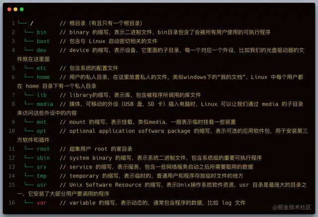
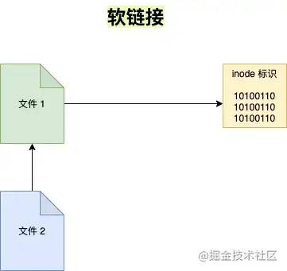
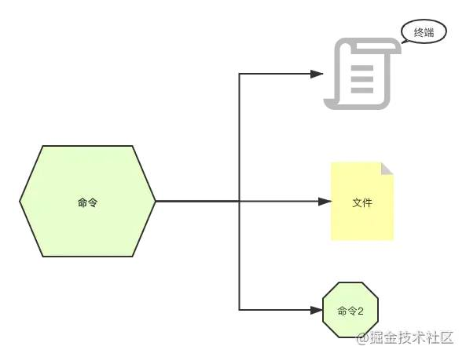
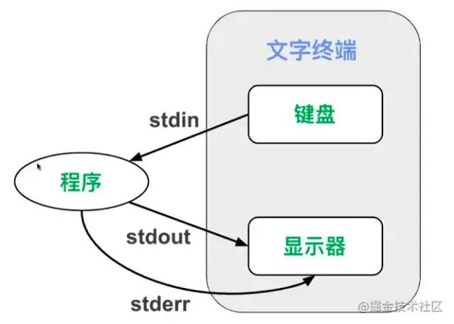
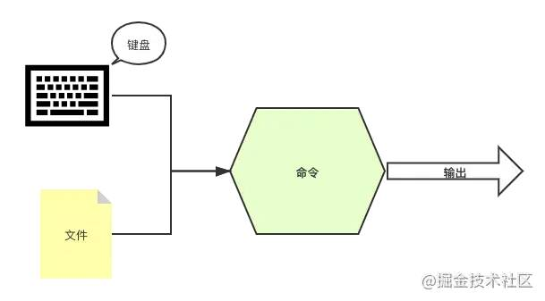
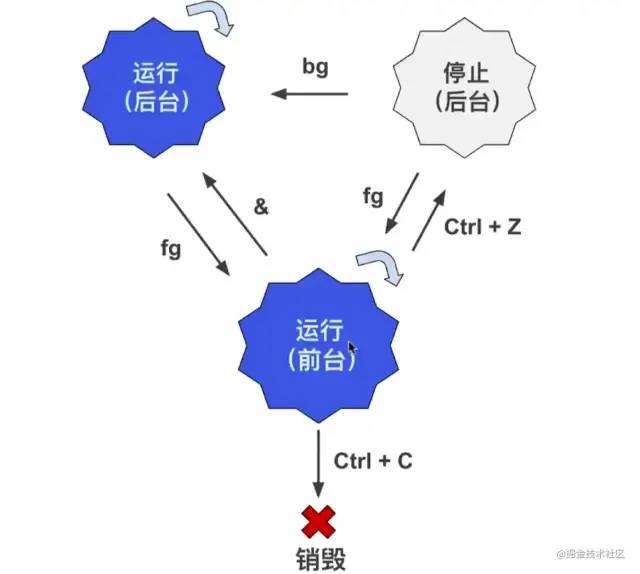
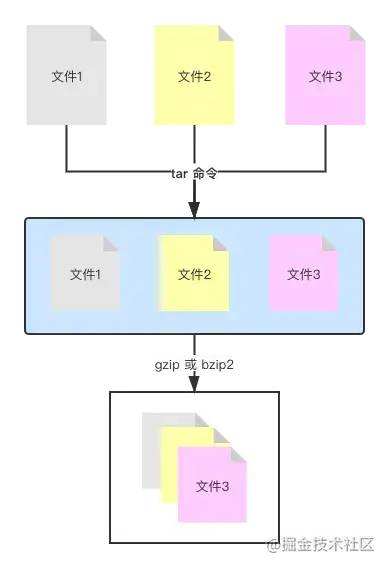

# 配置国内镜像源

[配置清华镜像源](https://cloud.tencent.com/developer/article/1726035)

# 文件操作

## 基本

- ls（英文全拼：list files）: 列出目录及文件名
  - `-a` 显示所有文件和目录包括隐藏的
  - `-l` 显示详细列表
  - `-h` 适合人类阅读的
  - `-t` 按文件最近一次修改时间排序
  - `-i` 显示文件的 `inode` （ `inode` 是文件内容的标识）


- cd（英文全拼：change directory）：切换目录

```text
cd / --> 跳转到根目录
cd ~ --> 跳转到家目录
cd .. --> 跳转到上级目录
cd ./home --> 跳转到当前目录的home目录下
cd /home/lion --> 跳转到根目录下的home目录下的lion目录
cd --> 不添加任何参数，也是回到家目录
```


- pwd（英文全拼：print work directory）：显示目前的目录
- mkdir（英文全拼：make directory）：创建一个新的目录
- rmdir（英文全拼：remove directory）：删除一个空的目录
- cp（英文全拼：copy file）: 复制文件或目录
- rm（英文全拼：remove）: 删除文件或目录
- mv（英文全拼：move file）: 移动文件与目录，或修改文件与目录的名称


du 列举目录大小信息。

- `-h` 适合人类阅读的；
- `-a` 同时列举出目录下文件的大小信息；
- `-s` 只显示总计大小，不显示具体信息。


## 浏览可创建文件

cat 一次性显示文件所有内容，更适合查看小的文件。

cat -n 显示行号

less 分页显示文件内容，更适合查看大的文件。

- 空格键：前进一页（一个屏幕）；
- `b` 键：后退一页；
- 回车键：前进一行；
- `y` 键：后退一行；
- 上下键：回退或前进一行；
- `d` 键：前进半页；
- `u` 键：后退半页；
- `q` 键：停止读取文件，中止 `less` 命令；
- `=` 键：显示当前页面的内容是文件中的第几行到第几行以及一些其它关于本页内容的详细信息；
- `h` 键：显示帮助文档；
- `/` 键：进入搜索模式后，按 `n` 键跳到一个符合项目，按 `N` 键跳到上一个符合项目，同时也可以输入正则表达式匹配。

head 显示文件的开头几行（默认是10行）

- `-n` 指定行数 `head cloud-init.log -n 2`

tail 显示文件的结尾几行（默认是10行）

- `-n` 指定行数 `tail cloud-init.log -n 2`
- `-f` 会每过1秒检查下文件是否有更新内容，也可以用 `-s` 参数指定间隔时间 `tail -f -s 4 xxx.log`

touch 创建一个文件


## 文件复制和移动

cp 拷贝文件和目录

- `-r` 递归的拷贝，常用来拷贝一整个目录

mv 移动（重命名）文件或目录，与cp命令用法相似。


## 文件的删除和链接

rm 删除文件和目录，由于 Linux 下没有回收站，一旦删除非常难恢复，因此需要谨慎操作

- `-i` 向用户确认是否删除；
- `-f` 文件强制删除；
- `-r` 递归删除文件夹，著名的删除操作 `rm -rf` 。

ln

英文 `Link` 的缩写，表示创建链接。

**硬链接**

使链接的两个文件共享同样文件内容，就是同样的 `inode` ，一旦文件1和文件2之间有了硬链接，那么修改任何一个文件，修改的都是同一块内容，它的缺点是，只能创建指向文件的硬链接，不能创建指向目录的（其实也可以，但比较复杂）而软链接都可以，因此软链接使用更加广泛。



如果我们用 `rm file1` 来删除 `file1` ，对 `file2` 没有什么影响，对于硬链接来说，删除任意一方的文件，共同指向的文件内容并不会从硬盘上删除。只有同时删除了 `file1` 与`file2` 后，它们共同指向的文件内容才会消失。

**软链接**

软链接就类似 windows 下快捷方式。



其实 `file2` 只是 `file1` 的一个快捷方式，它指向的是 `file1` ，所以显示的是 `file1` 的内容，但其实 `file2` 的 `inode` 与 `file1` 并不相同。如果我们删除了 `file2` 的话， `file1`是不会受影响的，但如果删除 `file1` 的话， `file2` 就会变成死链接，因为指向的文件不见了。


## 查找文件

locate
搜索包含关键字的所有文件和目录。后接需要查找的文件名，也可以用正则表达式。


find
用于查找文件，它会去遍历你的实际硬盘进行查找，而且它允许我们对每个找到的文件进行后续操作，功能非常强大。

根据文件名查找

```
find -name "file.txt" --> 当前目录以及子目录下通过名称查找文件find . -name "syslog" --> 当前目录以及子目录下通过名称查找文件find / -name "syslog" --> 整个硬盘下查找syslogfind /var/log -name "syslog" --> 在指定的目录/var/log下查找syslog文件find /var/log -name "syslog*" --> 查找syslog1、syslog2 ... 等文件，通配符表示所有find /var/log -name "*syslog*" --> 查找包含syslog的文件 复制代码
```

[注意] `find` 命令只会查找完全符合 “何物” 字符串的文件，而 `locate` 会查找所有包含关键字的文件。

根据文件大小查找

```
find /var -size +10M --> /var 目录下查找文件大小超过 10M 的文件find /var -size -50k --> /var 目录下查找文件大小小于 50k 的文件find /var -size +1G --> /var 目录下查找文件大小查过 1G 的文件find /var -size 1M --> /var 目录下查找文件大小等于 1M 的文件复制代码
```

根据文件最近访问时间查找

```
find -name "*.txt" -atime -7  --> 近 7天内访问过的.txt结尾的文件复制代码
```

仅查找目录或文件

```
find . -name "file" -type f  --> 只查找当前目录下的file文件find . -name "file" -type d  --> 只查找当前目录下的file目录复制代码
```

操作查找结果

```
find -name "*.txt" -printf "%p - %u\n" --> 找出所有后缀为txt的文件，并按照 %p - %u\n 格式打印，其中%p=文件名，%u=文件所有者find -na
```


# 用户操作

sudo 管理员身份运行


user add 选项 用户名

- -c comment 指定一段注释性描述。
- -d 目录 指定用户主目录，如果此目录不存在，则同时使用-m选项，可以创建主目录。
- -g 用户组 指定用户所属的用户组。
- -G 用户组，用户组 指定用户所属的附加组。
- -s Shell文件 指定用户的登录Shell。
- -u 用户号 指定用户的用户号，如果同时有-o选项，则可以重复使用其他用户的标识号。

useradd + passwd
useradd 添加新用户
passwd 修改用户密码

userdel -r 用户名  //连带用户主目录一起删除

usermod 修改账号 -c, -d, -m, -g, -G, -s, -u以及-o等与add类似

## 群组管理

groupadd
创建群组，用法和 useradd 类似。

groupdel
删除一个已存在的群组

groups
查看用户所在群组

usermod
用于修改用户的账户。

【常用参数】

-l 对用户重命名。需要注意的是 /home 中的用户家目录的名字不会改变，需要手动修改。
-g 修改用户所在的群组，例如 usermod -g friends lion修改 lion 用户的群组为 friends 。
-G 一次性让用户添加多个群组，例如 usermod -G friends,foo,bar lion 。
-a -G 会让你离开原先的群组，如果你不想这样做的话，就得再添加 -a 参数，意味着append 追加的意思。

chgrp
用于修改文件的群组。

chown
改变文件的所有者，需要 root 身份才能运行。

-R 递归设置子目录和子文件， chown -R lion:lion /home/frank 把 frank 文件夹的用户和群组都改为 lion 。

## 权限管理

chmod
修改访问权限。

-R 可以递归地修改文件访问权限，例如 chmod -R 777 /home/lion


linux文件权限


数字分配权限

| 权限 | 数字 |
| :--- | :--- |
| r    | 4    |
| w    | 2    |
| x    | 1    |

因此要改变权限，只要做一些简单的加法就行：

```
chmod 640 hello.c # 分析6 = 4 + 2 + 0 表示所有者具有 rw 权限4 = 4 + 0 + 0 表示群组用户具有 r 权限0 = 0 + 0 + 0 表示其它用户没有权限对应
```

用字母来分配权限

- `u` ：`user` 的缩写，用户的意思，表示所有者。
- `g` ：`group` 的缩写，群组的意思，表示群组用户。
- `o` ：`other` 的缩写，其它的意思，表示其它用户。
- `a` ：`all` 的缩写，所有的意思，表示所有用户。
- `+` ：加号，表示添加权限。
- `-` ：减号，表示去除权限。
- `=` ：等于号，表示分配权限。


# 磁盘管理

## df

df命令参数功能：检查文件系统的磁盘空间占用情况。可以利用该命令来获取硬盘被占用了多少空间，目前还剩下多少空间等信息。

语法：

```
df [-ahikHTm] [目录或文件名]
```

选项与参数：

- -a ：列出所有的文件系统，包括系统特有的 /proc 等文件系统；
- -k ：以 KBytes 的容量显示各文件系统；
- -m ：以 MBytes 的容量显示各文件系统；
- -h ：以人们较易阅读的 GBytes, MBytes, KBytes 等格式自行显示；
- -H ：以 M=1000K 取代 M=1024K 的进位方式；
- -T ：显示文件系统类型, 连同该 partition 的 filesystem 名称 (例如 ext3) 也列出；
- -i ：不用硬盘容量，而以 inode 的数量来显示

## du

Linux du 命令也是查看使用空间的，但是与 df 命令不同的是 Linux du 命令是对文件和目录磁盘使用的空间的查看，还是和df命令有一些区别的，这里介绍 Linux du 命令。

语法：

```
du [-ahskm] 文件或目录名称
```

选项与参数：

- -a ：列出所有的文件与目录容量，因为默认仅统计目录底下的文件量而已。
- -h ：以人们较易读的容量格式 (G/M) 显示；
- -s ：列出总量而已，而不列出每个各别的目录占用容量；
- -S ：不包括子目录下的总计，与 -s 有点差别。
- -k ：以 KBytes 列出容量显示；
- -m ：以 MBytes 列出容量显示；

## fdisk

fdisk 是 Linux 的磁盘分区表操作工具。

语法：

```
fdisk [-l] 装置名称
```

选项与参数：

- -l ：输出后面接的装置所有的分区内容。若仅有 fdisk -l 时， 则系统将会把整个系统内能够搜寻到的装置的分区均列出来。

## 磁盘格式化

磁盘分割完毕后自然就是要进行文件系统的格式化，格式化的命令非常的简单，使用 `mkfs`（make filesystem） 命令。

语法：

```
mkfs [-t 文件系统格式] 装置文件名
```

## 磁盘挂载与卸除

Linux 的磁盘挂载使用 `mount` 命令，卸载使用 `umount` 命令。

磁盘挂载语法：

```
mount [-t 文件系统] [-L Label名] [-o 额外选项] [-n]  装置文件名  挂载点
```

磁盘卸载命令 `umount` 语法：

```
umount [-fn] 装置文件名或挂载点
```

选项与参数：

- -f ：强制卸除！可用在类似网络文件系统 (NFS) 无法读取到的情况下；
- -n ：不升级 /etc/mtab 情况下卸除。

卸载/dev/hdc6

```
[root@www ~]# umount /dev/hdc6     
```

# vim操作

[菜鸟教程](https://www.runoob.com/linux/linux-vim.html)

分屏模式下的快捷键

- `Ctrl + w` 再加 `Ctrl + w` ，表示从一个 `viewport` 移动光标到另外一个 `viewport` ；
- `Ctrl + w` 再加 “方向键”，就可以移动到这个方向所处的下一个视口了；
- `Ctrl + w` 再加 `+` 号，表示扩大当前视口；
- `Ctrl + w` 再加 `-` 号，表示缩小当前视口；
- `Ctrl + w` 再加 `=` 号，表示平均当前视口；
- `Ctrl + w` 再加 `r` 键，会反向调换视口位置；
- `Ctrl + w` 再加 `q` 键，会关闭当前视口；
- `Ctrl + w` 再加 `o` 键，会关闭除当前视口以外的所有视口；

## Vim 配置

### 选项参数

在 `Vim` 被启动后，可以运行一些指令来激活一些选项参数，但是这些选项参数的配置在退出`Vim` 时会被忘记，例如前面讲解的激活行号。如果希望所在的配置是永久性的，那么需要在家目录（ `cd ~` ）创建一个 `Vim` 的配置文件 `.vimrc` 。

### .vimrc

```
set number " 显示行号
syntax on " 激活语法高亮
set showcmd " 实时看到输入的命令
set ignorecase " 搜索时不区分大小写
set mouse=a " 激活鼠标，用鼠标选中时相当于进入可视模式
复制代码
```

`Vim` 配置非常丰富，我们可以通过个性化配置把 `Vim` 打造成属于自己的 `IDE` 等等。在 `github` 上也可以搜索到一些强大的 `Vim` 配置文件。

# apt操作

## apt 常用命令

- 列出所有可更新的软件清单命令：**sudo apt update**

- 升级软件包：**sudo apt upgrade**

  列出可更新的软件包及版本信息：**apt list --upgradeable**

  升级软件包，升级前先删除需要更新软件包：**sudo apt full-upgrade**

- 安装指定的软件命令：**sudo apt install <package_name>**

  安装多个软件包：**sudo apt install <package_1> <package_2> <package_3>**

- 更新指定的软件命令：**sudo apt update <package_name>**

- 显示软件包具体信息,例如：版本号，安装大小，依赖关系等等：**sudo apt show <package_name>**

- 删除软件包命令：**sudo apt remove <package_name>**

- 清理不再使用的依赖和库文件: **sudo apt autoremove**

- 移除软件包及配置文件: **sudo apt purge <package_name>**

- 查找软件包命令： **sudo apt search <keyword>**

- 列出所有已安装的包：**apt list --installed**

- 列出所有已安装的包的版本信息：**apt list --all-versions**


## man

安装更新 man

```
sudo yum install -y man-pages --> 安装sudo mandb --> 更新复制代码
```

man 手册种类

1. 可执行程序或 `Shell` 命令；
2. 系统调用（ `Linux` 内核提供的函数）；
3. 库调用（程序库中的函数）；
4. 文件（例如 `/etc/passwd` ）；
5. 特殊文件（通常在 `/dev` 下）；
6. 游戏；
7. 杂项（ `man(7)` ，`groff(7)` ）；
8. 系统管理命令（通常只能被 `root` 用户使用）；
9. 内核子程序。

man + 数字 + 命令

输入 man + 数字 + 命令/函数，可以查到相关的命令和函数，若不加数字， `man` 默认从数字较小的手册中寻找相关命令和函数

```
man 3 rand  --> 表示在手册的第三部分查找 rand 函数man ls    --> 查找 ls 用法手册复制代码
```

man 手册核心区域解析：(以 `man pwd` 为例)

```
NAME # 命令名称和简单描述     pwd -- return working directory nameSYNOPSIS # 使用此命令的所有方法     pwd [-L | -P]DESCRIPTION # 包括所有参数以及用法     The pwd utility writes the absolute pathname of the current working directory to the standard output.     Some shells may provide a builtin pwd command which is similar or identical to this utility.  Consult the builtin(1) manual page.     The options are as follows:     -L      Display the logical current working directory.     -P      Display the physical current working directory (all symbolic links resolved).     If no options are specified, the -L option is assumed.SEE ALSO # 扩展阅读相关命令     builtin(1), cd(1), csh(1), sh(1), getcwd(3)复制代码
```

help

`man` 命令像新华词典一样可以查询到命令或函数的详细信息，但其实我们还有更加快捷的方式去查询， `command --help` 或 `command -h` ，它没有 `man` 命令显示的那么详细，但是它更加易于阅读。


# 进阶

grep

全局搜索一个正则表达式，并且打印到屏幕。简单来说就是，在文件中查找关键字，并显示关键字所在行。

基础语法

```
grep text file # text代表要搜索的文本，file代表供搜索的文件# 实例[root@lion ~]# grep path /etc/profilepathmunge () {    pathmunge /usr/sbin    pathmunge /usr/local/sbin    pathmunge /usr/local/sbin after    pathmunge /usr/sbin afterunset -f pathmunge复制代码
```

常用参数

- `-i` 忽略大小写， `grep -i path /etc/profile`
- `-n` 显示行号，`grep -n path /etc/profile`
- `-v` 只显示搜索文本不在的那些行，`grep -v path /etc/profile`
- `-r` 递归查找， `grep -r hello /etc` ，Linux 中还有一个 rgrep 命令，作用相当于 `grep -r`

高级用法

`grep` 可以配合正则表达式使用。

```
grep -E path /etc/profile --> 完全匹配pathgrep -E ^path /etc/profile --> 匹配path开头的字符串grep -E [Pp]ath /etc/profile --> 匹配path或Path
```

sort

对文件的行进行排序。

基础语法

```
sort name.txt # 对name.txt文件进行排序复制代码
```

实例用法

为了演示方便，我们首先创建一个文件 `name.txt` ，放入以下内容：

```
ChristopherShawnTedRockNoahZacharyBella
```

执行 `sort name.txt` 命令，会对文本内容进行排序。

常用参数

- `-o` 将排序后的文件写入新文件， `sort -o name_sorted.txt name.txt` ；
- `-r` 倒序排序， `sort -r name.txt` ；
- `-R` 随机排序， `sort -R name.txt` ；
- `-n` 对数字进行排序，默认是把数字识别成字符串的，因此 138 会排在 25 前面，如果添加了 `-n` 数字排序的话，则 25 会在 138 前面。

wc

`word count` 的缩写，用于文件的统计。它可以统计单词数目、行数、字符数，字节数等。

基础语法

```
wc name.txt # 统计name.txt复制代码
```

实例用法

```
[root@lion ~]# wc name.txt 13 13 91 name.txt复制代码
```

- 第一个13，表示行数；
- 第二个13，表示单词数；
- 第三个91，表示字节数。

常用参数

- `-l` 只统计行数， `wc -l name.txt` ；
- `-w` 只统计单词数， `wc -w name.txt` ；
- `-c` 只统计字节数， `wc -c name.txt` ；
- `-m` 只统计字符数， `wc -m name.txt` 。

uniq

删除文件中的重复内容。

基础语法

```
uniq name.txt # 去除name.txt重复的行数，并打印到屏幕上uniq name.txt uniq_name.txt # 把去除重复后的文件保存为 uniq_name.txt复制代码
```

【注意】它只能去除连续重复的行数。

常用参数

- `-c` 统计重复行数， `uniq -c name.txt` ；
- `-d` 只显示重复的行数， `uniq -d name.txt` 。

cut

剪切文件的一部分内容。

基础语法

```
cut -c 2-4 name.txt # 剪切每一行第二到第四个字符复制代码
```

常用参数

- `-d` 用于指定用什么分隔符（比如逗号、分号、双引号等等） `cut -d , name.txt` ；
- `-f` 表示剪切下用分隔符分割的哪一块或哪几块区域， `cut -d , -f 1 name.txt` 。


## 重定向 管道 流

在 `Linux` 中一个命令的去向可以有3个地方：终端、文件、作为另外一个命令的入参。命令一般都是通过键盘输入，然后输出到终端、文件等地方，它的标准用语是 `stdin` 、 `stdout` 以及 `stderr` 。

- 标准输入 `stdin` ，终端接收键盘输入的命令，会产生两种输出；
- 标准输出 `stdout` ，终端输出的信息（不包含错误信息）；
- 标准错误输出 `stderr` ，终端输出的错误信息。



重定向

把本来要显示在终端的命令结果，输送到别的地方（到文件中或者作为其他命令的输入）。

输出重定向 `>`

`>` 表示重定向到新的文件， `cut -d , -f 1 notes.csv > name.csv` ，它表示通过逗号剪切`notes.csv` 文件（剪切完有3个部分）获取第一个部分，重定向到 `name.csv` 文件。

我们来看一个具体示例，学习它的使用，假设我们有一个文件 `notes.csv` ，文件内容如下：

```
Mark1,951/100,很不错1
Mark2,952/100,很不错2
Mark3,953/100,很不错3
Mark4,954/100,很不错4
Mark5,955/100,很不错5
Mark6,956/100,很不错6
```

执行命令：`cut -d , -f 1 notes.csv > name.csv` 最后输出如下内容：

```
Mark1Mark2Mark3Mark4Mark5Mark6
```

【注意】使用 `>` 要注意，如果输出的文件不存在它会新建一个，如果输出的文件已经存在，则会覆盖。因此执行这个操作要非常小心，以免覆盖其它重要文件。

**输出重定向** `>>`

表示重定向到文件末尾，因此它不会像 `>` 命令这么危险，它是追加到文件的末尾（当然如果文件不存在，也会被创建）。

再次执行 `cut -d , -f 1 notes.csv >> name.csv` ，则会把名字追加到 `name.csv` 里面。

```
Mark1Mark2Mark3Mark4Mark5Mark6Mark1Mark2Mark3Mark4Mark5Mark6复制代码
```

我们平时读的 `log` 日志文件其实都是用这个命令输出的。

输出重定向 `2>`

标准错误输出

```
cat not_exist_file.csv > res.txt 2> errors.log复制代码
```

- 当我们 `cat` 一个文件时，会把文件内容打印到屏幕上，这个是标准输出；
- 当使用了 `> res.txt` 时，则不会打印到屏幕，会把标准输出写入文件 `res.txt` 文件中；
- `2> errors.log` 当发生错误时会写入 `errors.log` 文件中。

输出重定向 `2>>`

标准错误输出（追加到文件末尾）同 `>>` 相似。

输出重定向 `2>&1`

标准输出和标准错误输出都重定向都一个地方

```
cat not_exist_file.csv > res.txt 2>&1  # 覆盖输出cat not_exist_file.csv >> res.txt 2>&1 # 追加输出复制代码
```

目前为止，我们接触的命令的输入都来自命令的参数，其实命令的输入还可以来自文件或者键盘的输入。

未命名文件 (2).png

输入重定向 `<`

`<` 符号用于指定命令的输入。

```
cat < name.csv # 指定命令的输入为 name.csv复制代码
```

虽然它的运行结果与 `cat name.csv` 一样，但是它们的原理却完全不同。

- `cat name.csv` 表示 `cat` 命令接收的输入是 `notes.csv` 文件名，那么要先打开这个文件，然后打印出文件内容。
- `cat < name.csv` 表示 `cat` 命令接收的输入直接是 `notes.csv` 这个文件的内容， `cat`命令只负责将其内容打印，打开文件并将文件内容传递给 `cat` 命令的工作则交给终端完成。

输入重定向 `<<`

将键盘的输入重定向为某个命令的输入。

```
sort -n << END # 输入这个命令之后，按下回车，终端就进入键盘输入模式，其中END为结束命令（这个可以自定义）wc -m << END # 统计输入的单词复制代码
```

管道 `|`

把两个命令连起来使用，一个命令的输出作为另外一个命令的输入，英文是 `pipeline` ，可以想象一个个水管连接起来，管道算是重定向流的一种。

未命名文件 (1).png

举几个实际用法案例：

```
cut -d , -f 1 name.csv | sort > sorted_name.txt # 第一步获取到的 name 列表，通过管道符再进行排序，最后输出到sorted_name.txt
du | sort -nr | head # du 表示列举目录大小信息# sort 进行排序,-n 表示按数字排序，-r 表示倒序
# head 前10行文件
grep log -Ir /var/log | cut -d : -f 1 | sort | uniq
# grep log -Ir /var/log 表示在log文件夹下搜索 /var/log 文本，-r 表示递归，-I 用于排除二进制文件
# cut -d : -f 1 表示通过冒号进行剪切，获取剪切的第一部分# sort 进行排序# uniq 进行去
```

流

流并非一个命令，在计算机科学中，流 `stream` 的含义是比较难理解的，记住一点即可：**流就是读一点数据, 处理一点点数据。其中数据一般就是二进制格式。** 上面提及的重定向或管道，就是把数据当做流去运转的。

到此我们就接触了，流、重定向、管道等 `Linux` 高级概念及指令。其实你会发现关于流和管道在其它语言中也有广泛的应用。`Angular` 中的模板语法中可以使用管道。`Node.js` 中也有`stream` 流的概念。


## 查看进程


### w

帮助我们快速了解系统中目前有哪些用户登录着，以及他们在干什么。

```
[root@lion ~]# w 06:31:53 up 25 days,  9:53,  1 user,  load average: 0.00, 0.01, 0.05USER     TTY      FROM             LOGIN@   IDLE   JCPU   PCPU WHATroot     pts/0    118.31.243.53    05:56    1.00s  0.02s  0.00s w 06:31:53：表示当前时间up 25 days, 9:53：表示系统已经正常运行了“25天9小时53分钟”1 user：表示一个用户load average: 0.00, 0.01, 0.05：表示系统的负载，3个值分别表示“1分钟的平均负载”，“5分钟的平均负载”，“15分钟的平均负载” USER：表示登录的用于 TTY：登录的终端名称为pts/0 FROM：连接到服务器的ip地址 LOGIN@：登录时间 IDLE：用户有多久没有活跃了 JCPU：该终端所有相关的进程使用的 CPU 时间，每当进程结束就停止计时，开始新的进程则会重新计时 PCPU：表示 CPU 执行当前程序所消耗的时间，当前进程就是在 WHAT 列里显示的程序 WHAT：表示当下用户正运行的程序是什么，这里我运行的是 w复制代码
```

### ps

用于显示当前系统中的进程， `ps` 命令显示的进程列表不会随时间而更新，是静态的，是运行 `ps` 命令那个时刻的状态或者说是一个进程快照。

基础语法

```
[root@lion ~]# ps  PID TTY          TIME CMD 1793 pts/0    00:00:00 bash 4756 pts/0    00:00:00 ps  PID：进程号，每个进程都有唯一的进程号 TTY：进程运行所在的终端 TIME：进程运行时间 CMD：产生这个进程的程序名，如果在进程列表中看到有好几行都是同样的程序名，那么就是同样的程序产生了不止一个进程复制代码
```

常用参数

- `-ef` 列出所有进程;
- `-efH` 以乔木状列举出所有进程;
- `-u` 列出此用户运行的进程;
- `-aux` 通过 `CPU` 和内存使用来过滤进程 `ps -aux | less` ;
- `-aux --sort -pcpu` 按 `CPU` 使用降序排列， `-aux --sort -pmem` 表示按内存使用降序排列;
- `-axjf` 以树形结构显示进程， `ps -axjf` 它和 `pstree` 效果类似。

### top

获取进程的动态列表。

```
top - 07:20:07 up 25 days, 10:41,  1 user,  load average: 0.30, 0.10, 0.07Tasks:  67 total,   1 running,  66 sleeping,   0 stopped,   0 zombie%Cpu(s):  0.7 us,  0.3 sy,  0.0 ni, 99.0 id,  0.0 wa,  0.0 hi,  0.0 si,  0.0 stKiB Mem :  1882072 total,   552148 free,   101048 used,  1228876 buff/cacheKiB Swap:        0 total,        0 free,        0 used.  1594080 avail Mem   PID USER      PR  NI    VIRT    RES    SHR S %CPU %MEM     TIME+ COMMAND                                                                                                         956 root      10 -10  133964  15848  10240 S  0.7  0.8 263:13.01 AliYunDun                                                                                                         1 root      20   0   51644   3664   2400 S  0.0  0.2   3:23.63 systemd                                                                                                           2 root      20   0       0      0      0 S  0.0  0.0   0:00.05 kthreadd                                                                                                          4 root       0 -20       0      0      0 S  0.0  0.0   0:00.00 kworker/0:0H    复制代码
```

- `top - 07:20:07 up 25 days, 10:41, 1 user, load average: 0.30, 0.10, 0.07` 相当 `w`命令的第一行的信息。
- 展示的这些进程是按照使用处理器 `%CPU` 的使用率来排序的。

### kill

结束一个进程， `kill + PID` 。

```
kill 956 # 结束进程号为956的进程kill 956 957 # 结束多个进程kill -9 7291 # 强制结束进程复制代码
```

## 管理进程

### 进程状态

主要是切换进程的状态。我们先了解下 `Linux` 下进程的五种状态：

1. 状态码 `R` ：表示正在运行的状态；
2. 状态码 `S` ：表示中断（休眠中，受阻，当某个条件形成后或接受到信号时，则脱离该状态）；
3. 状态码 `D` ：表示不可中断（进程不响应系统异步信号，即使用kill命令也不能使其中断）；
4. 状态码 `Z` ：表示僵死（进程已终止，但进程描述符依然存在，直到父进程调用 `wait4()`系统函数后将进程释放）；
5. 状态码 `T` ：表示停止（进程收到 `SIGSTOP` 、 `SIGSTP` 、 `SIGTIN` 、 `SIGTOU` 等停止信号后停止运行）。

### 前台进程 & 后台进程

默认情况下，用户创建的进程都是前台进程，前台进程从键盘读取数据，并把处理结果输出到显示器。例如运行 `top` 命令，这就是一个一直运行的前台进程。

后台进程的优点是不必等待程序运行结束，就可以输入其它命令。在需要执行的命令后面添加`&` 符号，就表示启动一个后台进程。

### &

启动后台进程，它的缺点是后台进程与终端相关联，一旦关闭终端，进程就自动结束了。

```
cp name.csv name-copy.csv &复制代码
```

### nohup

使进程不受挂断（关闭终端等动作）的影响。

```
nohup cp name.csv name-copy.csv复制代码
```

`nohup` 命令也可以和 `&` 结合使用。

```
nohup cp name.csv name-copy.csv &复制代码
```

### bg

使一个“后台暂停运行”的进程，状态改为“后台运行”。

```
bg %1 # 不加任何参数的情况下，bg命令会默认作用于最近的一个后台进程，如果添加参数则会作用于指定标号的进程复制代码
```

实际案例1：

```
1. 执行 grep -r "log" / > grep_log 2>&1 命令启动一个前台进程，并且忘记添加 & 符号2. ctrl + z 使进程状态转为后台暂停3. 执行 bg 将命令转为后台运行复制代码
```

实际案例2：

```
前端开发时我们经常会执行 yarn start 启动项目此时我们执行 ctrl + z 先使其暂停然后执行 bg 使其转为后台运行这样当前终端就空闲出来可以干其它事情了，如果想要唤醒它就使用 fg 命令即可（后面会讲）复制代码
```

### jobs

显示当前终端后台进程状态。

```
[root@lion ~]# jobs[1]+  Stopped                 top[2]-  Running                 grep --color=auto -r "log" / > grep_log 2>&1 &复制代码
```

### fg

`fg` 使进程转为前台运行，用法和 `bg` 命令类似。

我们用一张图来表示前后台进程切换：



我们可以使程序在后台运行，成为后台进程，这样在当前终端中我们就可以做其他事情了，而不必等待此进程运行结束。

## 守护进程

一个运行起来的程序被称为进程。在 `Linux` 中有些进程是特殊的，它不与任何进程关联，不论用户的身份如何，都在后台运行，这些进程的父进程是 `PID` 为1的进程， `PID` 为1的进程只在系统关闭时才会被销毁。它们会在后台一直运行等待分配工作。我们将这类进程称之为守护进程 `daemon` 。

守护进程的名字通常会在最后有一个 `d` ，表示 `daemon` 守护的意思，例如 `systemd`、`httpd` 。

### systemd

`systemd` 是一个 `Linux` 系统基础组件的集合，提供了一个系统和服务管理器，运行为 `PID 1` 并负责启动其它程序。

```
[root@lion ~]# ps -auxUSER       PID %CPU %MEM    VSZ   RSS TTY      STAT START   TIME COMMANDroot         1  0.0  0.2  51648  3852 ?        Ss   Feb01   1:50 /usr/lib/systemd/systemd --switched-root --system --deserialize 22复制代码
```

通过命令也可以看到 `PID` 为1的进程就是 `systemd` 的系统进程。

`systemd` 常用命令（它是一组命令的集合）：

```
systemctl start nginx # 启动服务systemctl stop nginx # 停止服务systemctl restart nginx # 重启服务systemctl status nginx # 查看服务状态systemctl reload nginx # 重载配置文件(不停止服务的情况)systemctl enable nginx # 开机自动启动服务systemctl disable nginx # 开机不自动启动服务systemctl is-enabled nginx # 查看服务是否开机自动启动systemctl list-unit-files --type=service # 查看各个级别下服务的启动和禁用情况复制代码
```

## 文件压缩解压

- 打包：是将多个文件变成一个总的文件，它的学名叫存档、归档。
- 压缩：是将一个大文件（通常指归档）压缩变成一个小文件。

我们常常使用 `tar` 将多个文件归档为一个总的文件，称为 `archive` 。然后用 `gzip` 或 `bzip2` 命令将 `archive` 压缩为更小的文件。

未命名文件.png

### tar

创建一个 `tar` 归档。

基础用法

```
tar -cvf sort.tar sort/ # 将sort文件夹归档为sort.tartar -cvf archive.tar file1 file2 file3 # 将 file1 file2 file3 归档为archive.tar复制代码
```

常用参数

- `-cvf` 表示 `create`（创建）+ `verbose`（细节）+ `file`（文件），创建归档文件并显示操作细节；
- `-tf` 显示归档里的内容，并不解开归档；
- `-rvf` 追加文件到归档， `tar -rvf archive.tar file.txt` ；
- `-xvf` 解开归档， `tar -xvf archive.tar` 。

### gzip / gunzip

“压缩/解压”归档，默认用 `gzip` 命令，压缩后的文件后缀名为 `.tar.gz` 。

```
gzip archive.tar # 压缩gunzip archive.tar.gz # 解压复制代码
```

### tar 归档+压缩

可以用 `tar` 命令同时完成归档和压缩的操作，就是给 `tar` 命令多加一个选项参数，使之完成归档操作后，还是调用 `gzip` 或 `bzip2` 命令来完成压缩操作。

```
tar -zcvf archive.tar.gz archive/ # 将archive文件夹归档并压缩tar -zxvf archive.tar.gz # 将archive.tar.gz归档压缩文件解压复制代码
```

### zcat、zless、zmore

之前讲过使用 `cat less more` 可以查看文件内容，但是压缩文件的内容是不能使用这些命令进行查看的，而要使用 `zcat、zless、zmore` 进行查看。

```
zcat archive.tar.gz复制代码
```

### zip/unzip

“压缩/解压” `zip` 文件（ `zip` 压缩文件一般来自 `windows` 操作系统）。

命令安装

```
# Red Hat 一族中的安装方式yum install zip yum install unzip 
```

基础用法

```
unzip archive.zip # 解压 .zip 文件unzip -l archive.zip # 不解开 .zip 文件，只看其中内容zip -r sort.zip sort/ # 
```


## 安装软件


wget  + 下载地址


解压文件

```
tar -zxvf htop-3.0.0.tar.gz # 解压
cd htop-3.0.0 # 进入目录
```


配置

执行 `./configure` ，它会分析你的电脑去确认编译所需的工具是否都已经安装了。


编译

执行 `make` 命令

5、安装

执行 `make install` 命令，安装完成后执行 `ls /usr/local/bin/` 查看是否有 `htop` 命令。如果有就可以执行 `htop` 命令查看系统进程了。


## 网络

ifconfig

查看 `ip` 网络相关信息，如果命令不存在的话， 执行命令 `yum install net-tools` 安装。

- `eth0` 对应有线连接（对应你的有线网卡），就是用网线来连接的上网。`eth` 是 `Ethernet` 的缩写，表示“以太网”。有些电脑可能同时有好几条网线连着，例如服务器，那么除了`eht0` ，你还会看到 `eth1` 、 `eth2` 等。
- `lo` 表示本地回环（ `Local Loopback` 的缩写，对应一个虚拟网卡）可以看到它的 `ip` 地址是 `127.0.0.1` 。每台电脑都应该有这个接口，因为它对应着“连向自己的链接”。这也是被称之为“本地回环”的原因。所有经由这个接口发送的东西都会回到你自己的电脑。看起来好像并没有什么用，但有时为了某些缘故，我们需要连接自己。例如用来测试一个网络程序，但又不想让局域网或外网的用户查看，只能在此台主机上运行和查看所有的网络接口。例如在我们启动一个前端工程时，在浏览器输入 `127.0.0.1:3000` 启动项目就能查看到自己的 `web` 网站，并且它只有你能看到。
- `wlan0` 表示无线局域网（上面案例并未展示）。


host
ip 地址和主机名的互相转换。


### ssh 连接远程服务器

通过非对称加密以及对称加密的方式（同 HTTPS 安全连接原理相似）连接到远端服务器。

#### 配置 ssh

`config` 文件可以配置 `ssh` ，方便批量管理多个 `ssh` 连接。

配置文件分为以下几种：

- 全局 `ssh` 服务端的配置：`/etc/ssh/sshd_config` ；
- 全局 `ssh` 客户端的配置：`/etc/ssh/ssh_config`（很少修改）；
- 当前用户 `ssh` 客户端的配置：`~/.ssh/config` 。

【服务端 `config` 文件的常用配置参数】

| 服务端 config 参数     | 作用                                       |
| :--------------------- | :----------------------------------------- |
| Port                   | sshd 服务端口号（默认是22）                |
| PermitRootLogin        | 是否允许以 root 用户身份登录（默认是可以） |
| PasswordAuthentication | 是否允许密码验证登录（默认是可以）         |
| PubkeyAuthentication   | 是否允许公钥验证登录（默认是可以）         |
| PermitEmptyPasswords   | 是否允许空密码登录（不安全，默认不可以）   |

[注意] 修改完服务端配置文件需要重启服务 `systemctl restart sshd`

【客户端 `config` 文件的常用配置参数】

| 客户端 config 参数 | 作用                     |
| :----------------- | :----------------------- |
| Host               | 别名                     |
| HostName           | 远程主机名（或 IP 地址） |
| Port               | 连接到远程主机的端口     |
| User               | 用户名                   |

配置当前用户的 `config` ：

```
# 创建configvim ~/.ssh/config# 填写一下内容Host lion # 别名 HostName 172.x.x.x # ip 地址  Port 22 # 端口  User root # 用户复制代码
```

这样配置完成后，下次登录时，可以这样登录 `ssh lion` 会自动识别为 `root` 用户。

[注意] 这段配置不是在服务器上，而是你自己的机器上，它仅仅是设置了一个别名。

#### 免密登录

`ssh` 登录分两种，一种是基于口令（账号密码），另外一种是基于密钥的方式。

基于口令，就是每次登录输入账号和密码，显然这样做是比较麻烦的，今天主要学习如何基于密钥实现免密登录。

##### 基于密钥验证原理

客户机生成密钥对（公钥和私钥），把公钥上传到服务器，每次登录会与服务器的公钥进行比较，这种验证登录的方法更加安全，也被称为“公钥验证登录”。

##### 具体实现步骤

1、在客户机中生成密钥对（公钥和私钥） `ssh-keygen`（默认使用 RSA 非对称加密算法）

运行完 `ssh-keygen` 会在 `~/.ssh/` 目录下，生成两个文件：

- `id_rsa.pub` ：公钥
- `id_rsa` ：私钥

2、把客户机的公钥传送到服务

执行 `ssh-copy-id root@172.x.x.x`（`ssh-copy-id` 它会把客户机的公钥追加到服务器 `~/.ssh/authorized_keys` 的文件中）。

执行完成后，运行 `ssh root@172.x.x.x` 就可以实现免密登录服务器了。

配合上面设置好的别名，直接执行 `ssh lion` 就可以登录，是不是非常方便。


## 备份

### scp

它是 `Secure Copy` 的缩写，表示安全拷贝。`scp` 可以使我们通过网络，把文件从一台电脑拷贝到另一台电脑。

`scp` 是基于 `ssh` 的原理来运作的， `ssh` 会在两台通过网络连接的电脑之间创建一条安全通信的管道， `scp` 就利用这条管道安全地拷贝文件。

```
scp source_file destination_file # source_file 表示源文件，destination_file 表示目标文件复制代码
```

其中 `source_file` 和 `destination_file` 都可以这样表示：`user@ip:file_name` ， `user` 是登录名， `ip` 是域名或 `ip` 地址。`file_name` 是文件路径。

```
scp file.txt root@192.168.1.5:/root # 表示把我的电脑中当前文件夹下的 file.txt 文件拷贝到远程电脑scp root@192.168.1.5:/root/file.txt file.txt # 表示把远程电脑上的 file.txt 文件拷贝到本机复制代码
```

### rsync

`rsync` 命令主要用于远程同步文件。它可以同步两个目录，不管它们是否处于同一台电脑。它应该是最常用于“增量备份”的命令了。它就是智能版的 `scp` 命令。

软件安装

```
yum install rsync复制代码
```

基础用法

```
rsync -arv Images/ backups/ # 将Images 目录下的所有文件备份到 backups 目录下rsync -arv Images/ root@192.x.x.x:backups/ # 同步到服务器的backups目录下复制代码
```

常用参数

- `-a` 保留文件的所有信息，包括权限，修改日期等；
- `-r` 递归调用，表示子目录的所有文件也都包括；
- `-v` 冗余模式，输出详细操作信息。

默认地， `rsync` 在同步时并不会删除目标目录的文件，例如你在源目录中删除一个文件，但是用 `rsync` 同步时，它并不会删除同步目录中的相同文件。如果向删除也可以这么做：`rsync -arv --delete Images/ backups/` 。


## 系统

halt

关闭系统，需要 `root` 身份。

```
halt
```

reboot

重启系统，需要 `root` 身份。

```
reboot
```

poweroff

直接运行即可关机，不需要 `root` 身份。


