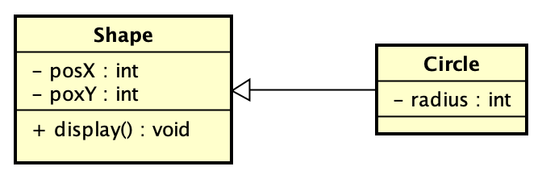
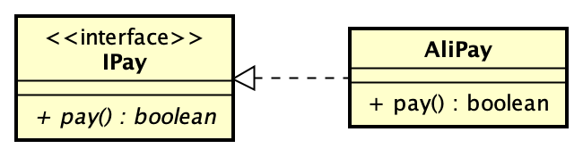
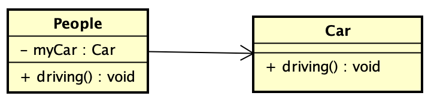
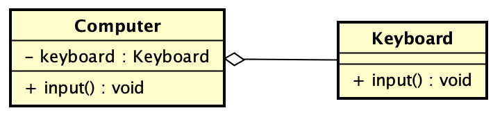
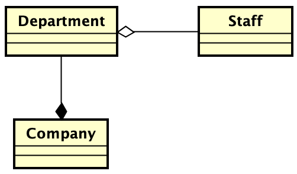
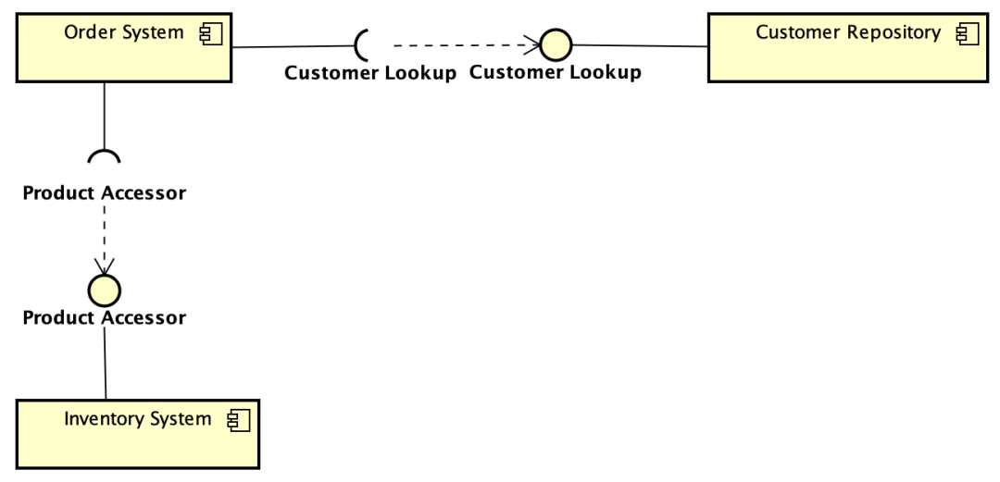
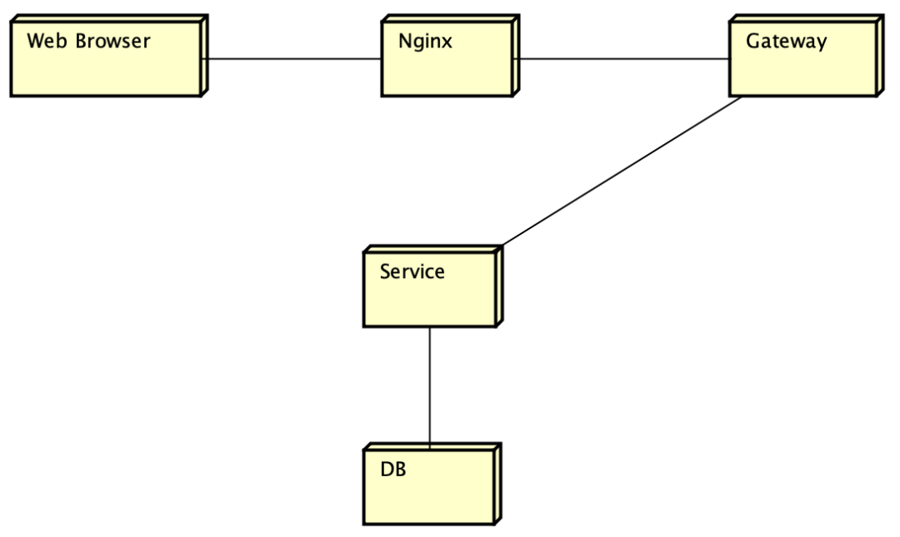
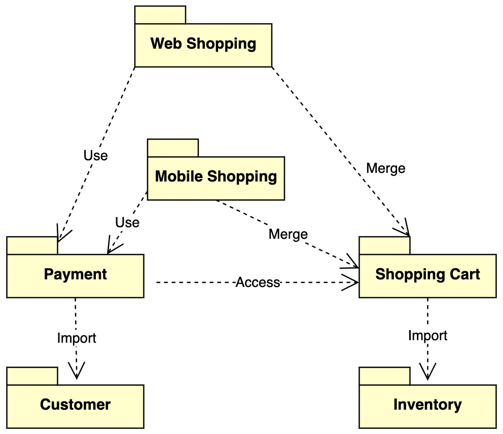

# 简介

提供极富表达的建模语言

UML图分为结构图和行为图

结构图分为类图，轮廓图，组件图，组合结构图，对象图，部署图，包图

行为图又分为活动图，用例图，状态机图和交互图

交互图又分为序列图，时序图，通讯图，交互概念图

| UML类型    | 目的                                                       |
| ---------- | ---------------------------------------------------------- |
| 类图       | 描述系统中对象类型以及它们之间存在的各种静态关系           |
| 组件图     | 描绘系统中组件提供，需要的接口，端口等，以及它们之间的关系 |
| 对象图     | 对象图是类图的实例，是系统在某个时间点的详细状态的快照     |
| 轮廓图     | 轮廓图提供一个通用的扩展机制，用于特定域和平台定制UML模型  |
| 组合结构图 | 描述组合结构的内部结构，以及他们之间的关系                 |
| 部署图     | 描述系统内部的软件如何分布在不同节点上                     |
| 包图       | 描绘系统在包层面上的结构设计                               |
|            |                                                            |
|            |                                                            |
|            |                                                            |
|            |                                                            |
|            |                                                            |
|            |                                                            |

# 类图

类图是一切面向对象方法的核心建模工具。类图描述了系统中对象的类型以及它们之间存在的各种静态关系。

表示类，接口以及它们之间静态结构和关系

## 常见关系

### 泛化（Generalization）

一种继承关系，表示子类继承父类的所有特征和行为

带三角箭头的实现，箭头指向父类

### 实现（Realization）

类和接口的关系，类是接口所有特征和行为的实现

带三角线的虚线，箭头指向接口

### 关联

一种拥有关系，一个类知道另一个类的属性和方法

代码体现在成员变量

带普通箭头的实现，指向被拥有者，双向关联的可以有两个箭头，或者没有箭头，单向关联的有一个箭头

### 聚合

整体与部分的关系，部分可以离开整体而单独存在，聚合关系是关联关系的一种，强的关联关系，关联和聚合在语法上无法区分，必须考察具体的逻辑关系

成员变量

带空心菱形的实线，空心菱形指向整体

### 组合

【组合关系】是一种整体与部分的关系。但部分不能离开整体而单独存在，组合关系是关联关系的一种，是比聚合关系还要强的关系。
【代码体现】成员变量
【箭头指向】带实心菱形的实线，实心菱形指向整体。

### 依赖（Dependency)

一个类的实现需要另一个类的协助

带普通箭头的虚线，普通箭头指向被使用者

# 组件图

描绘系统中组件提供的，需要的接口，端口等，以及它们之间的关系

展示各个组件之间的依赖关系

描述：订单系统组件依赖于客户资源库和库存系统组件。中间的虚线箭头表示依赖关系。另外两个符号，表示组件连接器，一个提供接口，一个需要接口

# 部署图

系统内部软件如何分布在不同的节点上

用来表示软件和硬件的映射关系

不同机器上部署不同的软件

# 对象图

对象图是类图的一个实例，是系统在某个时间点的详细状态的快照

用来表示两个或者多个对象之间在某一时刻之间的关系

# 包图

描绘系统在包层面上的结构设计

用来表示包和包之间的依赖关系

《Use》关系表示使用依赖 Web Shopping 依赖Payment

《Merge》关系表示合并 Web Shopping 合并了Shopping Cart 就拥有了Shopping Cart 的功能

《Access》关系表示私有引用，比如代码中指定包名类名

《Import》关系表示公共引入

# 结构组合图

描述一个组合结构的内部结构，以及他们之间的关系

用来表示系统中逻辑上的组合结构

# 轮廓图

提供一种通用的扩展机制，用于为特定域和平台定制UML模型

用于在特定领域中构建UML模型

# 用例图

指由参与者，用例，边界以及它们之间的关系构成的用于描述系统功能的视图

用来描述整个系统的功能

用例图中包含三种关系：

包含关系使用《include》 

扩展关系使用《extend》

泛化关系，子用例继承父用例所有结构，行为和关系

# 状态机图

状态机是对单独对象的行为建模，指明对象在它整个生命周期里，响应不同事件时，执行相关事件的顺序

用来指定对象，在整个生命周期，响应不同事件的不同状态

# 序列图

根据时间序列展示对象如何进行协作，展示在用例的特定场景中，对象如何与其他对象交互

通过描述对象之间发送消息的时间顺序显示多个对象之间的动态协作

# 通讯图

收发消息的对象组织关系，强调对象之间的合作关系而不是时间顺序

用来显示不同对象关系

# 交互概览图

交互概览图与活动图类似，但是它的节点是交互图

提供控制流的概述

# 时序图

时序图被用来显示随时间变化，一个或多个元素的值或者状态的更改，也显示时空事件之间的交互和管理它们的时间和期限约束

用来表示元素状态或者值随时间变化而变化的视图

