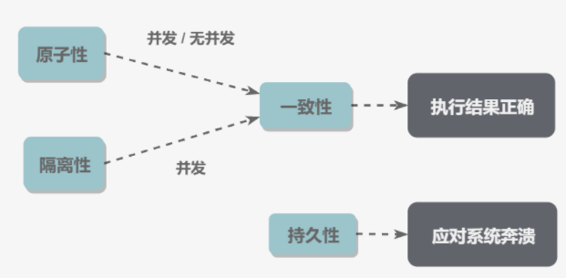
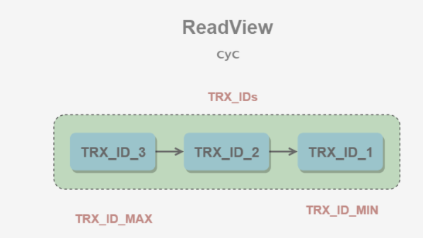

# mysql安装

官网下载

压缩包解压

初始化

```cmd
mysqld --initialize --console
```

会出现默认密码记得后续修改

ozQaNwhkQ4

安装服务

```mysql
mysqld install

启动服务
net start mysql
```

无法启动错误 密码输入时

1、首先以管理员身份启动cmd，要不然服务禁止访问。

2、然后在cmd中输入 mysqld --remove mysql或者mysqld --remove mysql57来移除服务。

3、然后进入MySQL安装目录中找到data文件，清空其中全部文件。我的目录是D:\MySQL\MySQL Server 5.7\data，没有data文件自己建一个。

4、接下来注册服务，mysqld -install。

5、然后开始初始化，mysqld --initialize，（第4步和第5步忘记了先后顺序，自己试试），然后可以看到data文件夹中文件正在初始化中（生成文件中。。。）。

6、初始化过程中会把登录密码初始化，可以在data文件中找到以.err结尾的文件，打开


3506022

## Mysql修改密码

```my
ALTER USER 'root'@'localhost' IDENTIFIED BY '123456';
```


# 数据库基础

## ACID



## 并发一致性问题

丢失修改

读脏数据

不可重复读

幻影读

# 封锁

MySQL 中提供了两种封锁粒度：行级锁以及表级锁。应该尽量只锁定需要修改的那部分数据，而不是所有的资源。锁定的数据量越少，发生锁争用的可能就越小，系统的并发程度就越高。

但是加锁需要消耗资源，锁的各种操作（包括获取锁、释放锁、以及检查锁状态）都会增加系统开销。因此封锁粒度越小，系统开销就越大。

在选择封锁粒度时，需要在锁开销和并发程度之间做一个权衡。

### 封锁类型

#### 1. 读写锁

- 互斥锁（Exclusive），简写为 X 锁，又称写锁。
- 共享锁（Shared），简写为 S 锁，又称读锁。

有以下两个规定：

- 一个事务对数据对象 A 加了 X 锁，就可以对 A 进行读取和更新。加锁期间其它事务不能对 A 加任何锁。
- 一个事务对数据对象 A 加了 S 锁，可以对 A 进行读取操作，但是不能进行更新操作。加锁期间其它事务能对 A 加 S 锁，但是不能加 X 锁。

#### 2. 意向锁

使用意向锁（Intention Locks）可以更容易地支持多粒度封锁。

在存在行级锁和表级锁的情况下，事务 T 想要对表 A 加 X 锁，就需要先检测是否有其它事务对表 A 或者表 A 中的任意一行加了锁，那么就需要对表 A 的每一行都检测一次，这是非常耗时的。

意向锁在原来的 X/S 锁之上引入了 IX/IS，IX/IS 都是表锁，用来表示一个事务想要在表中的某个数据行上加 X 锁或 S 锁。有以下两个规定：

- 一个事务在获得某个数据行对象的 S 锁之前，必须先获得表的 IS 锁或者更强的锁；
- 一个事务在获得某个数据行对象的 X 锁之前，必须先获得表的 IX 锁。

通过引入意向锁，事务 T 想要对表 A 加 X 锁，只需要先检测是否有其它事务对表 A 加了 X/IX/S/IS 锁，如果加了就表示有其它事务正在使用这个表或者表中某一行的锁，因此事务 T 加 X 锁失败。

解释如下：

- 任意 IS/IX 锁之间都是兼容的，因为它们只表示想要对表加锁，而不是真正加锁；
- 这里兼容关系针对的是表级锁，而表级的 IX 锁和行级的 X 锁兼容，两个事务可以对两个数据行加 X 锁。（事务 T1 想要对数据行 R1 加 X 锁，事务 T2 想要对同一个表的数据行 R2 加 X 锁，两个事务都需要对该表加 IX 锁，但是 IX 锁是兼容的，并且 IX 锁与行级的 X 锁也是兼容的，因此两个事务都能加锁成功，对同一个表中的两个数据行做修改。）

### 封锁协议

#### 1. 三级封锁协议

**一级封锁协议**

事务 T 要修改数据 A 时必须加 X 锁，直到 T 结束才释放锁。

可以解决丢失修改问题，因为不能同时有两个事务对同一个数据进行修改，那么事务的修改就不会被覆盖。

**二级封锁协议**

在一级的基础上，要求读取数据 A 时必须加 S 锁，读取完马上释放 S 锁。

可以解决读脏数据问题，因为如果一个事务在对数据 A 进行修改，根据 1 级封锁协议，会加 X 锁，那么就不能再加 S 锁了，也就是不会读入数据。

**三级封锁协议**

在二级的基础上，要求读取数据 A 时必须加 S 锁，直到事务结束了才能释放 S 锁。

可以解决不可重复读的问题，因为读 A 时，其它事务不能对 A 加 X 锁，从而避免了在读的期间数据发生改变。

#### 2. 两段锁协议

加锁和解锁分为两个阶段进行。

可串行化调度是指，通过并发控制，使得并发执行的事务结果与某个串行执行的事务结果相同。串行执行的事务互不干扰，不会出现并发一致性问题。

事务遵循两段锁协议是保证可串行化调度的充分条件。例如以下操作满足两段锁协议，它是可串行化调度。

```
lock-x(A)...lock-s(B)...lock-s(C)...unlock(A)...unlock(C)...unlock(B)
```

但不是必要条件，例如以下操作不满足两段锁协议，但它还是可串行化调度。

```
lock-x(A)...unlock(A)...lock-s(B)...unlock(B)...lock-s(C)...unlock(C)
```

### MySQL 隐式与显式锁定

MySQL 的 InnoDB 存储引擎采用两段锁协议，会根据隔离级别在需要的时候自动加锁，并且所有的锁都是在同一时刻被释放，这被称为隐式锁定。

InnoDB 也可以使用特定的语句进行显示锁定：

```mysql
SELECT ... LOCK In SHARE MODE;
SELECT ... FOR UPDATE;
```

# 隔离级别

### 未提交读（READ UNCOMMITTED）

事务中的修改，即使没有提交，对其它事务也是可见的。

### 提交读（READ COMMITTED）

一个事务只能读取已经提交的事务所做的修改。换句话说，一个事务所做的修改在提交之前对其它事务是不可见的。

### 可重复读（REPEATABLE READ）

保证在同一个事务中多次读取同一数据的结果是一样的。

### 可串行化（SERIALIZABLE）

强制事务串行执行，这样多个事务互不干扰，不会出现并发一致性问题。

该隔离级别需要加锁实现，因为要使用加锁机制保证同一时间只有一个事务执行，也就是保证事务串行执行。

## 多版本并发控制

多版本并发控制（Multi-Version Concurrency Control, MVCC）是 MySQL 的 InnoDB 存储引擎实现隔离级别的一种具体方式，用于实现提交读和可重复读这两种隔离级别。而未提交读隔离级别总是读取最新的数据行，要求很低，无需使用 MVCC。可串行化隔离级别需要对所有读取的行都加锁，单纯使用 MVCC 无法实现。

### 基本思想

在封锁一节中提到，加锁能解决多个事务同时执行时出现的并发一致性问题。在实际场景中读操作往往多于写操作，因此又引入了读写锁来避免不必要的加锁操作，例如读和读没有互斥关系。读写锁中读和写操作仍然是互斥的，而 MVCC 利用了多版本的思想，写操作更新最新的版本快照，而读操作去读旧版本快照，没有互斥关系，这一点和 CopyOnWrite 类似。

在 MVCC 中事务的修改操作（DELETE、INSERT、UPDATE）会为数据行新增一个版本快照。

脏读和不可重复读最根本的原因是事务读取到其它事务未提交的修改。在事务进行读取操作时，为了解决脏读和不可重复读问题，MVCC 规定只能读取已经提交的快照。当然一个事务可以读取自身未提交的快照，这不算是脏读。

### 版本号

- 系统版本号 SYS_ID：是一个递增的数字，每开始一个新的事务，系统版本号就会自动递增。
- 事务版本号 TRX_ID ：事务开始时的系统版本号。

### Undo 日志

MVCC 的多版本指的是多个版本的快照，快照存储在 Undo 日志中，该日志通过回滚指针 ROLL_PTR 把一个数据行的所有快照连接起来。

例如在 MySQL 创建一个表 t，包含主键 id 和一个字段 x。我们先插入一个数据行，然后对该数据行执行两次更新操作。

```
INSERT INTO t(id, x) VALUES(1, "a");
UPDATE t SET x="b" WHERE id=1;
UPDATE t SET x="c" WHERE id=1;
```

因为没有使用 `START TRANSACTION` 将上面的操作当成一个事务来执行，根据 MySQL 的 AUTOCOMMIT 机制，每个操作都会被当成一个事务来执行，所以上面的操作总共涉及到三个事务。快照中除了记录事务版本号 TRX_ID 和操作之外，还记录了一个 bit 的 DEL 字段，用于标记是否被删除。


INSERT、UPDATE、DELETE 操作会创建一个日志，并将事务版本号 TRX_ID 写入。DELETE 可以看成是一个特殊的 UPDATE，还会额外将 DEL 字段设置为 1。

### ReadView

MVCC 维护了一个 ReadView 结构，主要包含了当前系统未提交的事务列表 TRX_IDs {TRX_ID_1, TRX_ID_2, ...}，还有该列表的最小值 TRX_ID_MIN 和 TRX_ID_MAX。



在进行 SELECT 操作时，根据数据行快照的 TRX_ID 与 TRX_ID_MIN 和 TRX_ID_MAX 之间的关系，从而判断数据行快照是否可以使用：

- TRX_ID < TRX_ID_MIN，表示该数据行快照时在当前所有未提交事务之前进行更改的，因此可以使用。
- TRX_ID > TRX_ID_MAX，表示该数据行快照是在事务启动之后被更改的，因此不可使用。
- TRX_ID_MIN <= TRX_ID <= TRX_ID_MAX，需要根据隔离级别再进行判断：
  - 提交读：如果 TRX_ID 在 TRX_IDs 列表中，表示该数据行快照对应的事务还未提交，则该快照不可使用。否则表示已经提交，可以使用。
  - 可重复读：都不可以使用。因为如果可以使用的话，那么其它事务也可以读到这个数据行快照并进行修改，那么当前事务再去读这个数据行得到的值就会发生改变，也就是出现了不可重复读问题。

在数据行快照不可使用的情况下，需要沿着 Undo Log 的回滚指针 ROLL_PTR 找到下一个快照，再进行上面的判断。

### 快照读与当前读

#### 1. 快照读

MVCC 的 SELECT 操作是快照中的数据，不需要进行加锁操作。

```mysql
SELECT * FROM table ...;
```

#### 2. 当前读

MVCC 其它会对数据库进行修改的操作（INSERT、UPDATE、DELETE）需要进行加锁操作，从而读取最新的数据。可以看到 MVCC 并不是完全不用加锁，而只是避免了 SELECT 的加锁操作。

```mysql
INSERT;
UPDATE;
DELETE;
```

在进行 SELECT 操作时，可以强制指定进行加锁操作。以下第一个语句需要加 S 锁，第二个需要加 X 锁。

```mysql
SELECT * FROM table WHERE ? lock in share mode;
SELECT * FROM table WHERE ? for update;
```

## Next-Key Locks

Next-Key Locks 是 MySQL 的 InnoDB 存储引擎的一种锁实现。

MVCC 不能解决幻影读问题，Next-Key Locks 就是为了解决这个问题而存在的。在可重复读（REPEATABLE READ）隔离级别下，使用 MVCC + Next-Key Locks 可以解决幻读问题。

### Record Locks

锁定一个记录上的索引，而不是记录本身。

如果表没有设置索引，InnoDB 会自动在主键上创建隐藏的聚簇索引，因此 Record Locks 依然可以使用。

### Gap Locks

锁定索引之间的间隙，但是不包含索引本身。例如当一个事务执行以下语句，其它事务就不能在 t.c 中插入 15。

```
SELECT c FROM t WHERE c BETWEEN 10 and 20 FOR UPDATE;
```

### Next-Key Locks

它是 Record Locks 和 Gap Locks 的结合，不仅锁定一个记录上的索引，也锁定索引之间的间隙。它锁定一个前开后闭区间，例如一个索引包含以下值：10, 11, 13, and 20，那么就需要锁定以下区间：

```
(-∞, 10]
(10, 11]
(11, 13]
(13, 20]
(20, +∞)
```

# 关系数据库设计理论

### 函数依赖

记 A->B 表示 A 函数决定 B，也可以说 B 函数依赖于 A。

如果 {A1，A2，... ，An} 是关系的一个或多个属性的集合，该集合函数决定了关系的其它所有属性并且是最小的，那么该集合就称为键码。

对于 A->B，如果能找到 A 的真子集 A'，使得 A'-> B，那么 A->B 就是部分函数依赖，否则就是完全函数依赖。

对于 A->B，B->C，则 A->C 是一个传递函数依赖。

### 异常

以下的学生课程关系的函数依赖为 {Sno, Cname} -> {Sname, Sdept, Mname, Grade}，键码为 {Sno, Cname}。也就是说，确定学生和课程之后，就能确定其它信息。

| Sno  | Sname  | Sdept  | Mname  | Cname  | Grade |
| ---- | ------ | ------ | ------ | ------ | ----- |
| 1    | 学生-1 | 学院-1 | 院长-1 | 课程-1 | 90    |
| 2    | 学生-2 | 学院-2 | 院长-2 | 课程-2 | 80    |
| 2    | 学生-2 | 学院-2 | 院长-2 | 课程-1 | 100   |
| 3    | 学生-3 | 学院-2 | 院长-2 | 课程-2 | 95    |

不符合范式的关系，会产生很多异常，主要有以下四种异常：

- 冗余数据：例如 `学生-2` 出现了两次。
- 修改异常：修改了一个记录中的信息，但是另一个记录中相同的信息却没有被修改。
- 删除异常：删除一个信息，那么也会丢失其它信息。例如删除了 `课程-1` 需要删除第一行和第三行，那么 `学生-1` 的信息就会丢失。
- 插入异常：例如想要插入一个学生的信息，如果这个学生还没选课，那么就无法插入。

### 范式

范式理论是为了解决以上提到四种异常。

高级别范式的依赖于低级别的范式，1NF 是最低级别的范式。

#### 1. 第一范式 (1NF)

属性不可分。

#### 2. 第二范式 (2NF)

每个非主属性完全函数依赖于键码。

可以通过分解来满足。

**分解前**

| Sno  | Sname  | Sdept  | Mname  | Cname  | Grade |
| ---- | ------ | ------ | ------ | ------ | ----- |
| 1    | 学生-1 | 学院-1 | 院长-1 | 课程-1 | 90    |
| 2    | 学生-2 | 学院-2 | 院长-2 | 课程-2 | 80    |
| 2    | 学生-2 | 学院-2 | 院长-2 | 课程-1 | 100   |
| 3    | 学生-3 | 学院-2 | 院长-2 | 课程-2 | 95    |

以上学生课程关系中，{Sno, Cname} 为键码，有如下函数依赖：

- Sno -> Sname, Sdept
- Sdept -> Mname
- Sno, Cname-> Grade

Grade 完全函数依赖于键码，它没有任何冗余数据，每个学生的每门课都有特定的成绩。

Sname, Sdept 和 Mname 都部分依赖于键码，当一个学生选修了多门课时，这些数据就会出现多次，造成大量冗余数据。

**分解后**

关系-1

| Sno  | Sname  | Sdept  | Mname  |
| ---- | ------ | ------ | ------ |
| 1    | 学生-1 | 学院-1 | 院长-1 |
| 2    | 学生-2 | 学院-2 | 院长-2 |
| 3    | 学生-3 | 学院-2 | 院长-2 |

有以下函数依赖：

- Sno -> Sname, Sdept
- Sdept -> Mname

关系-2

| Sno  | Cname  | Grade |
| ---- | ------ | ----- |
| 1    | 课程-1 | 90    |
| 2    | 课程-2 | 80    |
| 2    | 课程-1 | 100   |
| 3    | 课程-2 | 95    |

有以下函数依赖：

- Sno, Cname -> Grade

#### 3. 第三范式 (3NF)

非主属性不传递函数依赖于键码。

上面的 关系-1 中存在以下传递函数依赖：

- Sno -> Sdept -> Mname

可以进行以下分解：

关系-11

| Sno  | Sname  | Sdept  |
| ---- | ------ | ------ |
| 1    | 学生-1 | 学院-1 |
| 2    | 学生-2 | 学院-2 |
| 3    | 学生-3 | 学院-2 |

关系-12

| Sdept  | Mname  |
| ------ | ------ |
| 学院-1 | 院长-1 |
| 学院-2 | 院长-2 |

# ER 图

Entity-Relationship，有三个组成部分：实体、属性、联系。

用来进行关系型数据库系统的概念设计。

### 实体的三种联系

包含一对一，一对多，多对多三种。

- 如果 A 到 B 是一对多关系，那么画个带箭头的线段指向 B；
- 如果是一对一，画两个带箭头的线段；
- 如果是多对多，画两个不带箭头的线段。

下图的 Course 和 Student 是一对多的关系。

[](https://camo.githubusercontent.com/9f6a898d53bd31455a94cd12b919b3ef66f2340fae3bd0b6e9f5aaf66bbd3d55/68747470733a2f2f63732d6e6f7465732d313235363130393739362e636f732e61702d6775616e677a686f752e6d7971636c6f75642e636f6d2f31643238616430352d333965352d343961322d613661312d6136663439366164626136612e706e67)


### 表示出现多次的关系

一个实体在联系出现几次，就要用几条线连接。

下图表示一个课程的先修关系，先修关系出现两个 Course 实体，第一个是先修课程，后一个是后修课程，因此需要用两条线来表示这种关系。

[](https://camo.githubusercontent.com/49aceba36378ee008904db72f03acdf38b51e767dfa56cca5f5fab61931f09fa/68747470733a2f2f63732d6e6f7465732d313235363130393739362e636f732e61702d6775616e677a686f752e6d7971636c6f75642e636f6d2f61633932396561332d646163612d343065632d396539352d3462326661363637383234332e706e67)


### 联系的多向性

虽然老师可以开设多门课，并且可以教授多名学生，但是对于特定的学生和课程，只有一个老师教授，这就构成了一个三元联系。

[](https://camo.githubusercontent.com/fe98dcae5765d7312d288f60c326181ec41bfba8385d7c3eb366aaacdb79b826/68747470733a2f2f63732d6e6f7465732d313235363130393739362e636f732e61702d6775616e677a686f752e6d7971636c6f75642e636f6d2f35626231623338612d353237652d343830322d613338352d3236376461646264333062612e706e67)


### 表示子类

用一个三角形和两条线来连接类和子类，与子类有关的属性和联系都连到子类上，而与父类和子类都有关的连到父类上。

[](https://camo.githubusercontent.com/ababb8a64ed6181a2a28297b757392ad4e909b251621d9c25d636f2fec70142e/68747470733a2f2f63732d6e6f7465732d313235363130393739362e636f732e61702d6775616e677a686f752e6d7971636c6f75642e636f6d2f31343338396561342d386439362d346539362d396637362d3536346361333332346331652e706e67)


# MySQL 常用数据类型
## 数值类型
| 类型名称 | 大小（字节） | 范围（有符号） | 范围（无符号） |
| -------- | ------------ | -------------- | -------------- |
| TINYINT  | 1            | -128~127      | 0~255          |
| SMALLINT | 2            | -32768~32767  | 0~65535        |
| MEDIUMINT| 3            | -8388608~8388607 | 0~16777215   |
| INT      | 4            | -2147483648~2147483647 | 0~4294967295 |
| BIGINT   | 8            | -2^63~2^63-1  | 0~2^64-1       |
| FLOAT    | 4            | -3.402823466E+38~3.402823466E+38 | 0~3.402823466E+38 |
| DOUBLE   | 8            | -1.7976931348623157E+308~1.7976931348623157E+308 | 0~1.7976931348623157E+308 |
| DECIMAL  | 依赖于参数   | 依赖于参数     | 依赖于参数     |

## 日期和时间类型
| 类型名称 | 大小（字节） | 范围（有符号） | 范围（无符号） |
| -------- | ------------ | -------------- | -------------- |
| DATE     | 3            | 1000-01-01~9999-12-31 | 1000-01-01~9999-12-31 |
| TIME     | 3            | -838:59:59~838:59:59 | 0~838:59:59    |
| DATETIME | 8            | 1000-01-01 00:00:00~9999-12-31 23:59:59 | 1000-01-01 00:00:00~9999-12-31 23:59:59 |
| TIMESTAMP| 4            | 1970-01-01 00:00:00~2038-01-19 03:14:07 | 1970-01-01 00:00:00~2038-01-19 03:14:07 |

## 字符串类型
| 类型名称 | 大小（字节） | 范围（有符号） | 范围（无符号） |
| -------- | ------------ | -------------- | -------------- |
| CHAR     | 0~255        | 0~255          | 0~255          |
| VARCHAR  | 0~65535      | 0~65535        | 0~65535        |
| TINYBLOB | 0~255        | 0~255          | 0~255          |
| TINYTEXT | 0~255        | 0~255          | 0~255          |
| BLOB     | 0~65535      | 0~65535        | 0~65535        |
| TEXT     | 0~65535      | 0~65535        | 0~65535        |
| MEDIUMBLOB | 0~16777215 | 0~16777215     | 0~16777215     |
| MEDIUMTEXT | 0~16777215 | 0~16777215     | 0~16777215     |
| LONGBLOB | 0~4294967295 | 0~4294967295   | 0~4294967295   |
| LONGTEXT | 0~4294967295 | 0~4294967295   | 0~4294967295   |

## 二进制类型
| 类型名称 | 大小（字节） | 范围（有符号） | 范围（无符号） |
| -------- | ------------ | -------------- | -------------- |
| BIT      | 1~64         | 1~64           | 1~64           |
| BINARY   | 0~255        | 0~255          | 0~255          |
| VARBINARY| 0~65535      | 0~65535        | 0~65535        |

## 布尔类型
| 类型名称 | 大小（字节） | 范围（有符号） | 范围（无符号） |
| -------- | ------------ | -------------- | -------------- |
| BOOL     | 1            | 0~1            | 0~1            |
| BOOLEAN  | 1            | 0~1            | 0~1            |


# sql的增删改查

## 创建数据库
常用命令
```mysql
# 创建数据库
CREATE DATABASE database_name;
# 创建数据库注定字符集和排序规则 
# 其中charset_name为字符集名称 例如utf8，utf8mb4等
# collation_name为排序规则,例如utf8_general_ci,utf8mb4_general_ci等,用于指定字符集的比较规则
CREATE DATABASE database_name
    [CHARACTER SET charset_name]
    [COLLATE collation_name];
# 创建数据库如果不存在
CREATE DATABASE IF NOT EXISTS database_name;
# 创建数据库授权给用户
GRANT ALL PRIVILEGES ON database_name.* TO 'username'@'host';
FLUSH PRIVILEGES;
```


## 创建数据表
```mysql
CREATE TABLE table_naem(
    column_name1 data_type constraint,
    column_name2 data_type,
    ....
);
# 其中table_name为表名
# column_name1为列名
# data_type为数据类型
# constraint为约束 例如主键约束(primary key),外键约束(foreign key),唯一约束(unique),非空约束(not null),默认约束(default)等
# 例如
CREATE TABLE student(
    sno char(8) primary key,
    sname char(4) not null,
    ssex char(2) default '男',
    sage int,
    sdept char(20)
);
# 例如 指定外键约束
CREATE TABLE sc(
    sno char(8),
    cno char(4),
    grade int,
    primary key(sno,cno),
    foreign key(sno) references student(sno),
    foreign key(cno) references course(cno)
);
```


增加数据

inset into table_name (file1, file2, file3) values (value1, value2, value3)

查数据

 select column_name1, column_name2 from table_name [where] [limit n] [offset m]

```
1）查询语句中你可以使用一个或者多个表，表之间使用逗号(,)分割，并使用WHERE语句来设定查询条件。
2）SELECT 命令可以读取一条或者多条记录。
3）可以使用星号（*）来代替其他字段，SELECT语句会返回表的所有字段数据
4）可以使用 WHERE 语句来包含任何条件。
5）可以使用 LIMIT 属性来设定返回的记录数。
6）可以通过OFFSET指定SELECT语句开始查询的数据偏移量。默认情况下偏移量为0。
```

改数据

update table_name set field1=value1 fields2=value2 [where]

删数据

 delete from table_name [where]

注解： 1）如果没有指定 WHERE 子句，MySQL 表中的所有记录将被删除。

```
delete from student where name='xxx';
```

## sql新建

```sql
create table student1 
(sno char(8) primary key,
sname char(4) not null,        -------创建表student1
ssex char(2) default'男',
check(ssex in('男','女')),
sage int default('是'),
sdept char(10) default('否'),
)
create table course1
(cno char(2) primary key,
cname char(30),                     ------创建表course1
credit int,
cpno char(3),
)
create table sc1
(sno char(8) foreign key references student1(sno),    ----创建表sc1
cno char(2) foreign key references course1(cno),
grade int default('是') check(grade between 0 and 100),
)
```

@[TOC](SQL查询)
# 查询聚集函数
count（*）统计元组个数

新建查询图：
结果运行图：
count（[distinc|all]<列名>)  统计一列中值的个数


sum(distinc|all <列名>) 统计一列值的总合

avg() 计算一列值的平均值

max（）顾名思义最大值
min 最小值

# 嵌套查询
## 带有IN谓语的子查询 

```
select sname
from student1
where sno in
(select sno 
from sc1
where cno='2')
```

# 集合查询

# 基于派生表查询

# 增删改查
create database test;
drop database test;
使用数据库 use test

```
INSERT INTO table_name ( field1, field2,...fieldN )
                       VALUES
                       ( value1, value2,...valueN );
```


UPDATE Websites  SET alexa='5000', country='USA'  WHERE name='name';


ALTER TABLE table_name ADD column_name datatype

