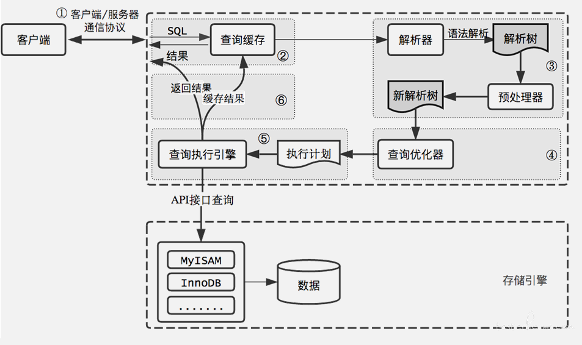

# 前言

## 推荐书籍

《MySQL官方手册》

《MySQL运维内参》

《MySQL8 Cookbook(中文版)》

《MySQL技术内幕InnoDB存储引擎》

《高性能MySQL》

《数据库索引设计与优化》

《深入理解MySQL核心技术》

《Effective MySQL:Replication Techniques in Depth》

# 基础

## MySQL体系结构

MySQL体系结构由 Client Connectors层，MySQL Server层及存储引擎层组成。

Client Connectors层

负责处理客户端的连接请求，与客户端创建连接。目前MySQL几乎支持所有连接类型，JDBC，Python，GO等

MySQL Server层

主要包括Conection Pool，Service & utilities,SQL interface,Parser解析器，Optimizer查询优化器，Caches缓存等模块。

Connection Pool 负责处理和存储数据库与客户端创建的连接，一个线程负责管理一个连接。Connection Pool 包括了用户认证模块，就是用户登录身份的认证和鉴权及安全管理，用户执行操作权限校验。

Service & utilities 是管理服务&工具集，包括备份恢复，安全管理，集群管理服务和工具。

SQL interface 负责接受客户端发送的各种SQL语句，比如DML，DDL和存储过程等。

Optimizer查询优化器会根据解析树生成执行计划，并选择合适的索引，然后按照执行计划执行SQL语言并与各个存储引擎交互。

Cache缓存包括各个存储引擎的缓存部分 比如：InnoDB存储的Buffer Pool，MyISAM存储引擎的key buffer等，Caches中也会缓存一些权限，包括一些Session级别的缓存。

存储引擎层

存储引擎负责管理数据的存储和检索。

存储引擎包括MyISAM，InnoDB，已经支持归档的Archive和内存Memory等，MySQL是插件式的存储引擎，只要正确定义与MySQL Server交互的接口，任何引擎都可以访问MySQL

存储引擎底部是物理存储层，是文件的物理存储层，包括二进制日志、数据文件、错误日志、慢查询日志、全日志、redo/undo 日志等。

## 存储引擎

InnoDB存储引擎 上半部分是实例层（计算层）位于内存，下半部分 物理层，位于文件系统

### 实例层

线程和内存

InnoDB 重要的线程有 Master Thread，Master Thread 是 InnoDB 的主线程，负责调度其他各线程。

 

Master Thread 的优先级最高, 其内部包含几个循环：主循环（loop）、后台循环（background loop）、刷新循环（flush loop）、暂停循环（suspend loop）。Master Thread 会根据其内部运行的相关状态在各循环间进行切换。

大部分操作在主循环（loop）中完成，其包含 1s 和 10s 两种操作。

1s 操作主要包括如下。

日志缓冲刷新到磁盘（这个操作总是被执行，即使事务还没有提交）。

最多可能刷 100 个新脏页到磁盘。

执行并改变缓冲的操作。

若当前没有用户活动，可能切换到后台循环（background loop）等。

10s 操作主要包括如下。

最多可能刷新 100 个脏页到磁盘。

合并至多 5 个被改变的缓冲（总是）。

日志缓冲刷新到磁盘（总是）。

删除无用的 Undo 页（总是）。

刷新 100 个或者 10 个脏页到磁盘（总是）产生一个检查点（总是）等。

buf_dump_thread 负责将 buffer pool 中的内容 dump 到物理文件中，以便再次启动 MySQL 时，可以快速加热数据。

page_cleaner_thread 负责将 buffer pool 中的脏页刷新到磁盘，在 5.6 版本之前没有这个线程，刷新操作都是由主线程完成的，所以在刷新脏页时会非常影响 MySQL 的处理能力，在5.7 版本之后可以通过参数设置开启多个 page_cleaner_thread。

purge_thread 负责将不再使用的 Undo 日志进行回收。

read_thread 处理用户的读请求，并负责将数据页从磁盘上读取出来，可以通过参数设置线程数量。

write_thread 负责将数据页从缓冲区写入磁盘，也可以通过参数设置线程数量，page_cleaner 线程发起刷脏页操作后 write_thread 就开始工作了。

redo_log_thread 负责把日志缓冲中的内容刷新到 Redo log 文件中。

insert_buffer_thread 负责把 Insert Buffer 中的内容刷新到磁盘。实例层的内存部分主要包含 InnoDB Buffer Pool，这里包含 InnoDB 最重要的缓存内容。数据和索引页、undo 页、insert buffer 页、自适应 Hash 索引页、数据字典页和锁信息等。additional memory pool 后续已不再使用。Redo buffer 里存储数据修改所产生的 Redo log。double write buffer 是 double write 所需的 buffer，主要解决由于宕机引起的物理写入操作中断，数据页不完整的问题。

### 物理层

系统表空间里有 ibdata 文件和一些 Undo，ibdata 文件里有 insert buffer 段、double write段、回滚段、索引段、数据字典段和 Undo 信息段。

用户表空间是指以 .ibd 为后缀的文件，文件中包含 insert buffer 的 bitmap 页、叶子页（这里存储真正的用户数据）、非叶子页。InnoDB 表是索引组织表，采用 B+ 树组织存储，数据都存储在叶子节点中，分支节点（即非叶子页）存储索引分支查找的数据值。

Redo 日志中包括多个 Redo 文件，这些文件循环使用，当达到一定存储阈值时会触发checkpoint 刷脏页操作，同时也会在 MySQL 实例异常宕机后重启，InnoDB 表数据自动还原恢复过程中使用。

### 核心特性

InnoDB 存储引擎的核心特性包括：MVCC、锁、锁算法和分类、事务、表空间和数据页、内存线程以及状态查询。

### ARIES原则

ARIES 三原则，是指 Write Ahead Logging（WAL）。

先写日志后写磁盘，日志成功写入后事务就不会丢失，后续由 checkpoint 机制来保证磁盘物理文件与 Redo 日志达到一致性；

利用 Redo 记录变更后的数据，即 Redo 记录事务数据变更后的值；

利用 Undo 记录变更前的数据，即 Undo 记录事务数据变更前的值，用于回滚和其他事务多版本读。

show engine innodb status\G 的结果里面有详细的 InnoDB 运行态信息，分段记录的，包括内存、线程、信号、锁、事务等，请你多多使用，出现问题时从中能分析出具体原因和解决方案。

# 事务和锁机制

ACID

一致性：事务开始之前和事务结束之后，数据库的完整性限制未被破坏。

约束一致性

数据一致性

原子性：事务的所有操作，要么全部完成，要么全部不完成，不会结束在某个中间环节。

依靠Redo的WAL机制实现的

持久性：事务完成之后，事务所做的修改进行持久化保存，不会丢失。

隔离性：当多个事务并发访问数据库中的同一数据时，所表现出来的相互关系。

## 并发控制

单版本，锁独占的方式

在 MySQL 事务中，锁的实现与隔离级别有关系，在 RR（Repeatable Read）隔离级别下，MySQL 为了解决幻读的问题，以牺牲并行度为代价，通过 Gap 锁来防止数据的写入，而这种锁，因为其并行度不够，冲突很多，经常会引起死锁。现在流行的 Row 模式可以避免很多冲突甚至死锁问题，所以推荐默认使用 Row + RC（Read Committed）模式的隔离级别，可以很大程度上提高数据库的读写并行度。

多版本控制-MVCC

在数据库中，为了实现高并发的数据访问，对数据进行多版本处理，并通过事务的可见性来保证事务能看到自己应该看到的数据版本。

## 特性背后的技术原理

持久性 通过原子性可以保证逻辑上的持久性，通过存储引擎的数据刷盘可以保证物理上的持久性。

在数据库恢复时，如果发现某事务的状态为 Prepare，则会在 binlog 中找到对应的事务并将其在数据库中重新执行一遍，来保证数据库的持久性。

### 隔离性背后的技术

读未提交（RU，Read Uncommitted）。它能读到一个事务的中间过程，违背了 ACID 特性，存在脏读的问题，所以基本不会用到，可以忽略。

读提交（RC，Read Committed）。它表示如果其他事务已经提交，那么我们就可以看到，这也是一种最普遍适用的级别。但由于一些历史原因，可能 RC 在生产环境中用的并不多。

可重复读（RR，Repeatable Read），是目前被使用得最多的一种级别。其特点是有 Gap 锁、目前还是默认的级别、在这种级别下会经常发生死锁、低并发等问题。

可串行化，这种实现方式，其实已经并不是多版本了，又回到了单版本的状态，因为它所有的实现都是通过锁来实现的。

读锁，单版本控制，并发低

### 一致性

一致性可以归纳为数据的完整性

