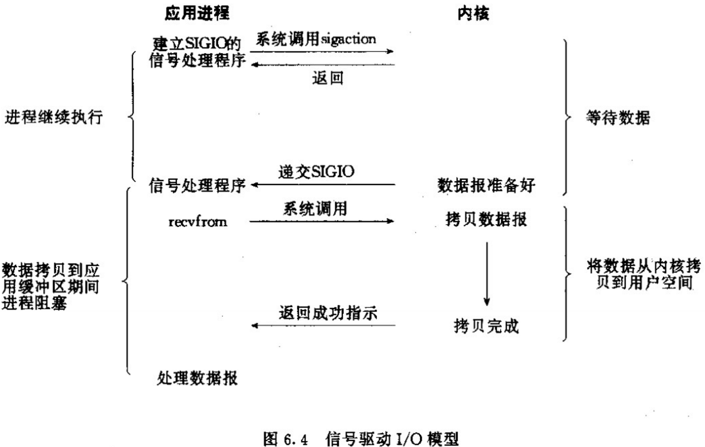

[TOC]

# 同步与异步

## 同步

协同步调，多个事物不能同时进行，必须一个一个来，上个事物结束以后，下个事物才开始。

范围：并不需要在全局范围内部去同步，只需要在某些关键的点执行同步即可

粒度：并不是只有大粒度的事物才有同步，小粒度的也有

例如两个线程的同步就需要手工处理，但是一个线程的两个语句天然同步的

## 异步

异步，就是步调各异。既然是各异，那就是都不相同。所以结果就是：

多个事物可以你进行你的、我进行我的，谁都不用管谁，所有的事物都在同时进行中。

一言以蔽之，同步就是多个事物不能同时开工，异步就是多个事物可以同时开工。

注：一定要去体会“多个事物”，多个线程是多个事物，多个方法是多个事物，多个语句是多个事物，多个CPU指令是多个事物。等等等等。

# **阻塞和非阻塞**

所谓阻塞，指的是阻碍堵塞。它的本意可以理解为由于遇到了障碍而造成的动弹不得。

所谓非阻塞，自然是和阻塞相对，可以理解为由于没有遇到障碍而继续畅通无阻。

阻塞的真正含义是你关心的事物由于某些原因无法继续进行，因此让你等待

等待只是阻塞的一个副作用而已，表明随着时间的流逝，没有任何有意义的事物发生或进行。

同步阻塞，不能同时开工，也不能动。只有一条小道，一次只能过一辆车，可悲的是还TMD的堵上了。

同步非阻塞，不能同时开工，但可以动。只有一条小道，一次只能过一辆车，幸运的是可以正常通行。

异步阻塞，可以同时开工，但不可以动。有多条路，每条路都可以跑车，可气的是全都TMD的堵上了。

异步非阻塞，可以工时开工，也可以动。有多条路，每条路都可以跑车，很爽的是全都可以正常通行。

# **I/O**

IO指的就是读入/写出数据的过程，和**等待**读入/写出数据的过程。一旦拿到数据后就变成了数据操作了，就不是IO了。

拿网络IO来说，等待的过程就是数据从网络到网卡再到内核空间。读写的过程就是内核空间和用户空间的相互拷贝。

所以IO就包括两个过程，一个是等待数据的过程，一个是读写（拷贝）数据的过程。而且还要明白，一定**不**能包括操作数据的过程。

## **阻塞IO和非阻塞IO**

应用程序都是运行在用户空间的，所以它们能操作的数据也都在用户空间。按照这样子来理解，只要数据没有到达用户空间，用户线程就操作不了。

如果此时用户线程已经参与，那它一定会被阻塞在IO上。这就是常说的阻塞IO。用户线程被阻塞在等待数据上或拷贝数据上。

非阻塞IO就是用户线程不参与以上两个过程，即数据已经拷贝到用户空间后，才去通知用户线程，一上来就可以直接操作数据了。

用户线程没有因为IO的事情出现阻塞，这就是常说的非阻塞IO。

## **同步IO和同步阻塞IO**

按照上文中对同步的理解，同步IO是指发起IO请求后，必须拿到IO的数据才可以继续执行。

按照程序的表现形式又分为两种：

在等待数据的过程中，和拷贝数据的过程中，线程都在阻塞，这就是同步阻塞IO。

在等待数据的过程中，线程采用死循环式轮询，在拷贝数据的过程中，线程在阻塞，这其实还是同步阻塞IO。

网上很多文章把第二种归为同步非阻塞IO，这肯定是**错误**的，它一定是阻塞IO，因为拷贝数据的过程，线程是阻塞的。

严格来讲，在IO的概念上，同步和非阻塞是不可能搭配的，因为它们是一对相悖的概念。

同步IO意味着必须拿到IO的数据，才可以继续执行。因为后续操作依赖IO数据，所以它必须是阻塞的。

非阻塞IO意味着发起IO请求后，可以继续往下执行。说明后续执行不依赖于IO数据，所以它肯定不是同步的。

因此，在IO上，同步和非阻塞是互斥的，所以不存在同步非阻塞IO。但同步非阻塞是存在的，那不叫IO，叫操作数据了。

所以，同步IO一定是阻塞IO，同步IO也就是同步阻塞IO。

## **异步IO和异步阻塞/非阻塞IO**

按照上文中对异步的理解，异步IO是指发起IO请求后，不用拿到IO的数据就可以继续执行。

用户线程的继续执行，和操作系统准备IO数据的过程是同时进行的，因此才叫做异步IO。

按照IO数据的两个过程，又可以分为两种：

在等待数据的过程中，用户线程继续执行，在拷贝数据的过程中，线程在阻塞，这就是异步阻塞IO。

在等待数据的过程中，和拷贝数据的过程中，用户线程都在继续执行，这就是异步非阻塞IO。

第一种情况是，用户线程没有参与数据等待的过程，所以它是异步的。但用户线程参与了数据拷贝的过程，所以它又是阻塞的。合起来就是异步阻塞IO。

第二种情况是，用户线程既没有参与等待过程也没有参与拷贝过程，所以它是异步的。当它接到通知时，数据已经准备好了，它没有因为IO数据而阻塞过，所以它又是非阻塞的。合起来就是异步非阻塞IO。

# 阻塞IO

可以看到，服务端的线程阻塞在了两个地方，一个是 accept 函数，一个是 read 函数。

如果再把 read 函数的细节展开，我们会发现其阻塞在了两个阶段。

## 非阻塞io

结局问题  建立连接以后创建线程函数去调用

当客户端建立好连接以后，就可以等待新的客户端连接，而不用阻塞在原客户端的read请求上

这不叫非阻塞 IO，只不过用了多线程的手段使得主线程没有卡在 read 函数上不往下走罢了。操作系统为我们提供的 read 函数仍然是阻塞的。

所以真正的非阻塞 IO，不能是通过我们用户层的小把戏，**而是要恳请操作系统为我们提供一个非阻塞的 read 函数**。

这个 read 函数的效果是，如果没有数据到达时（到达网卡并拷贝到了内核缓冲区），立刻返回一个错误值（-1），而不是阻塞地等待。

操作系统提供了这样的功能，只需要在调用 read 前，将文件描述符设置为非阻塞即可。

非阻塞的 read，指的是在数据到达前，即数据还未到达网卡，或者到达网卡但还没有拷贝到内核缓冲区之前，这个阶段是非阻塞的。

当数据已到达内核缓冲区，此时调用 read 函数仍然是阻塞的，需要等待数据从内核缓冲区拷贝到用户缓冲区，才能返回。

整体流程如下图

# io多路复用

## 简介

可以让多个数据流（网络连接，文件输入输出）共享同一个通信路径，同时通过一个机制有效地管理和处理这些数据流。

适用场景：

网络通信：与多个远程服务器进行通信时，多路复用可以使你的程序能够同时处理多个网络连接，而不是每个连接都创建一个独立的线程。例如：大规模数据采集：一个网络爬虫可以使用多路复用来管理和处理多个网路连接。从不同网页API抓取数据

并发服务器：在服务器应用程序中，多路复用可以使你的服务器能够同时处理多个客户端请求。它可以让服务器能够接收和处理多个连接，而不需要为每个连接都创建一个独立的线程或进程。例如：Web服务器需要同时处理多个客户端的HTTP请求，单线程或进程中处理多个并发连接，提高服务器的吞吐量和响应速度。

文件输入/输出：当你需要同时读取或写入多个文件时，多路复用可以让你的程序能够高效地管理这些文件操作。它可以减少不必要的文件打开/关闭操作，提高程序的性能。

图形用户界面（GUI）：在图形用户界面应用程序中，多路复用可以使你的程序能够同时处理多个用户输入事件（比如鼠标点击、键盘输入等），并进行相应的处理和响应。

为每个客户创建线程，服务器端的线程资源很容易被消耗光

当我们创建一个客户端连接以后，将文件描述符（connfd）放到一个数组里面

创建新线程去不断的遍历，多线程去将阻塞 IO 改造成看起来是非阻塞 IO 一样，这种遍历方式也只是我们用户自己想出的小把戏，每次遍历遇到 read 返回 -1 时仍然是一次浪费资源的系统调用。

在 while 循环里做系统调用，就好比你做分布式项目时在 while 里做 rpc 请求一样，是不划算的。

## select

select是os暴露出来的接口，我们可以把一个文件描述符的数组发个操作系统，让os去遍历，确定哪个文件描述符可以读写

\1. select 调用需要传入 fd 数组，需要拷贝一份到内核，高并发场景下这样的拷贝消耗的资源是惊人的。（可优化为不复制）

\2. select 在内核层仍然是通过遍历的方式检查文件描述符的就绪状态，是个同步过程，只不过无系统调用切换上下文的开销。（内核层可优化为异步事件通知）

\3. select 仅仅返回可读文件描述符的个数，具体哪个可读还是要用户自己遍历。（可优化为只返回给用户就绪的文件描述符，无需用户做无效的遍历）

一个线程处理多个客户端连接（文件描述符），减少了系统调用的开销（多个文件描述符只有一次select的系统调用+n次就绪状态的文件描述符的read系统调用

## poll

os暴露的api

和select的区别就是去掉select只监听1024个文件描述符的限制

## epoll

epoll 主要就是针对这三点进行了改进。

\1. 内核中保存一份文件描述符集合，无需用户每次都重新传入，只需告诉内核修改的部分即可。

\2. 内核不再通过轮询的方式找到就绪的文件描述符，而是通过异步 IO 事件唤醒。

\3. 内核仅会将有 IO 事件的文件描述符返回给用户，用户也无需遍历整个文件描述符集合。

步骤：

第一步：创建epoll句柄

`int epoll_create(int size)`

第二步：向内核添加，修改或者删除要监控的文件描述符

`int epoll_ctl(int epfd, int op, int fd, struct epoll_event *event);`

第三步：类似于select的调用

`int epoll_wait(int epfd, struct epoll_event *events, int max events, int timeout);`

总结：

多路复用产生的效果，完全可以由用户态去遍历文件描述符并调用其非阻塞的 read 函数实现。而多路复用快的原因在于，操作系统提供了这样的系统调用，使得原来的 while 循环里多次系统调用，变成了一次系统调用 + 内核层遍历这些文件描述符。

# Linux的IO模型和各种特点

同步I/O

- 阻塞I/O：进程保持阻塞状态，直到数据拷贝完成；

  

非阻塞I/O：轮询检查内核数据，直到数据准备好，再拷贝数据到进程，进行数据处理；需要注意的是，拷贝数据的过程中，进程依然是阻塞装填；

信号驱动I/O：首先建立一个信号处理函数，进程继续运行并不阻塞，当数据准备好时，进程会收到一个`SIGIO`信号，可以在信号处理函数中处理数据；

异步I/O：在发起一个调用之后，调用者不能立即得到调用结果的返回，需要被调用者通过状态、通知和回调来通知调用者。

# io多路复用之间的区别

## `select`、`poll`、`epoll`之间有什么区别？

- `select`本质上是通过设置和轮询`fd_set`来检查是否有就绪的文件描述符，其缺点在于：
  - 单个进程可监视的文件描述符数量较少，在32位机器上默认为1024个，在64位机器上默认为2048个；
  - 每次调用`select`都需要把`fd_set`从用户空间拷贝到内核空间，文件描述符较多时开销较大；
  - 每次调用`select`都需要线性扫描`fd_set`，文件描述符较多时开销较大。
- `poll`与`select`相似，不同之处在于`poll`使用`pollfd`链表结构保存文件描述符，因此与`select`相比，没有文件描述符数量的限制。
- `epoll`提供了三个函数：
  - `epoll_create`用于创建一个`epoll`句柄；
  - `epoll_ctl`用于注册要监听的事件类型，其特点是：
    - 每次注册新的事件到`epoll`句柄中时，会把所有的文件描述符拷贝进内核空间，保证了每个文件描述符在整个过程中只拷贝一次，不会出现重复拷贝；
    - 为每个文件描述符指定一个回调函数，当事件发生时，就会调用这个回调函数，把就绪的文件描述符加入到就绪链表中；
  - `epoll_wait`用于等待事件的发生，唤醒等待中的进程；

`epoll`对文件描述符的操作有两种模式：

- 水平触发：当`epoll_wait`检测到描述符事件发生并将此事件通知应用程序，应用程序可以不立即处理该事件，下次调用`epoll_wait`时，将会再次响应应用程序并通知此事件；
- 边缘触发：当`epoll_wait`检测到描述符事件发生并将此事件通知应用程序，应用程序必须立即处理该事件，如果不处理，下次调用`epoll_wait`时，不会再次响应应用程序并通知此事件；

需要注意的是，表面上看`epoll`的性能最好，但是连接数量较少并且都十分活跃的情况下，`select`和`poll`的性能可能较好，因为`epoll`的通知机制需要使用回调函数。

# 参考连接

https://mp.weixin.qq.com/s/BXMADDWt_fCe5ST5zveHKw

