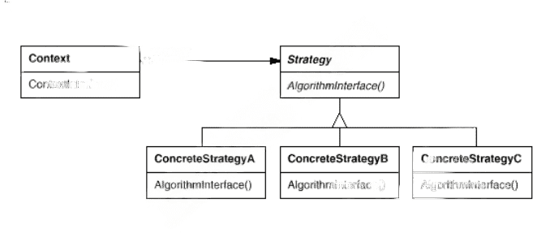
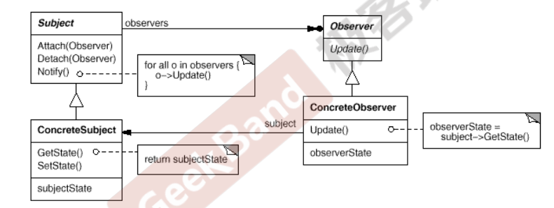

>参考链接
>
>[一文让你搞懂设计模式 (qq.com)](https://mp.weixin.qq.com/s?__biz=MzkyODE5NjU2Mw==&mid=2247484791&idx=1&sn=82ec021524713d413722f8a70e995917&source=41#wechat_redirect)

创建型模式，共五种：**工厂方法模式、抽象工厂模式**、**单例模式**、建造者模式、**原型模式。**

结构型模式，共七种：适配器模式、装饰器模式、代理模式、外观模式、桥接模式、组合模式、享元模式。

行为型模式，共十一种：策略模式、模板方法模式、观察者模式、迭代子模式、责任链模式、命令模式、备忘录模式、状态模式、访问者模式、中介者模式、解释器模式。

# 简介

理解隔离变化

​	宏观层面看，面对对象的构建方式更能适合软件的变化，将变化带来的影响减为最小

各司其职

​	从微观层面来看，面对对象的方式更强调各个类的责任

​	由于需求变化导致的新增类型不应该影响原来类型的实现

对象？

​	语言层面 对象封装代码和数据

​	规格，对象一系列可被使用的公共接口

​	概念，对象是某种拥有责任的抽象

# 设计原则

## 单一职责原则

Single responsibility principle 

应该有且仅有一个原因引起类的变更

好处

类的复杂性降低了，实现什么职责都有明确的定义

可读性提高，复杂性降低

可维护性提高，可读性提高

变更引起的风险降低，变更是比不可少的

单一职责原则  职责和变化原因都是不可度量的，因项目而异，因环境而异

## 里氏替换原则

**继承优点**

代码共享，减少创建类的工作量，每个子类都拥有父类的方法和属性

提高代码的重用性

提高可扩展性

提高产品或者项目的开放性

**缺点**

继承是侵入性的。只要继承，就必须拥有父类的所有属性和方法：

降低代码的灵活性。子类必须拥有父类的属性和方法，让子类自由的世界中多了些约束；

增强了耦合性。当父类的常量、变量和方法被修改时，需要考虑子类的修改，而且在缺乏规范的环境下，这种修改可能带来非常糟糕的结果一大段的代码需要重构。

只有父类出现的地方子类就可以出现，而且替换为子类不会出现问题。

里氏替换只能正着用不能反用

### 子类必须完全实现父类的方法

### 子类可以有自己的个性

### 覆盖或者实现父类的方法时输入的参数可以被放大

### 覆盖或者实现父类的方法时输入的参数可以被缩小

在项目中，采用里氏替换原则时，尽量避免子类的“个性”，一旦子类有“个性”，这个子类和父类之间的关系就很难调和了，把子类当做父类使用，子类的个性”被抹杀一一委屈了点；把子类单独作为一个业务来使用，则会让代码间的耦合关系变得扑朔迷离一缺乏类替换的标准。

## 依赖倒置原则

高层模块不应该依赖低层模块，两者都应该依赖其抽象

抽象不应该依赖细节

细节应该依赖抽象

可以减少类间的耦合性，提高系统的稳定性，降低并行开发引起的风险，提高代码的可读性和可维护性

## 接口隔离原则

## 迪米特原则

## 开闭原则

OCP

对扩展开放，对更改封闭

类模块应该是可扩展的，但是不可修改的

## 接口隔离原则

ISP

不应该强迫客户程序依赖它们不用的方法

接口预告小而完备

## 原则

优先使用对象组合，而不是类的继承

类继承通常为白箱复用，对象组合通常为黑箱复用

继承在某种程度上破坏了封装性，子类父类耦合度高

而对象组合则只要求被组合对象具有良好定义的接口，耦合度低

## 封装变化点

使用封装来创建对象之间的分界层，让设计者可以在分界层的 一侧进行修改，而不会对另一侧产生不良的影响，从而实现层 次间的松耦合

## 针对接口编程，而不是针对实现编程

不将变量类型声明为某个特定的具体类，而是声明为某个接口

客户程序无需获知对象的具体类型，只需要知道对象所具有的接口

减少系统中各个部分的依赖关系，高内聚，松耦合

目的来看：

创建型模式：将对象的部分创建工作延迟到子类或者其他对象，应对需求变化为对象创建时具体类型实现引来的冲击

结构性模式：通过类继承或者对象组合获得更灵活的结构，应对需求变化为对象的结构带来的冲击

行为型模式：通过类继承或者对象组合来划分类与对象间的责任，应对需求变化为多个交互对象带来的冲击

范围：

类模式处理类与子类的静态关系

对象模式处理对象间的动态关系

# 重构关键技法

静态->动态

早绑定->晚绑定

继承->组合

编译时依赖->运行时依赖

紧耦合->松耦合

# Template Method模式

## 动机（Motivation)

在软件构建过程中，对于某一项任务，常常有稳定的整体操作结构，但是各个子步骤却有很多改变的需求，或者由于固有的原因（比如框架和应用之间的关系）而无法和任务整体结构同时实现

## 要点

Template Method模式是一种非常基础性的设计模式。在面向对象系统中有大量的应用，简洁的机制（虚函数的多态性）为很多应用程序框架提供灵活的扩展点，是代码复用方面的基本实现结构

在具体实现方面，被Template Method调用的虚方法可以具有实 现，也可以没有任何实现（抽象方法、纯虚方法），但一般推荐将 它们设置为protected方法。

# 策略模式

可以降低耦合

策略模式 定义算法家族，之间可以互相替换，让算法变化，不会影响使用算法的客户

是一种定义一系列算法的方法，从概念上来看，算法完成的工作相同，实现不同，可以以相同的方式调用所有算法，减少各种算法类与使用算法类之间的耦合

策略模式就是用来封装算法的，但在实践中，我们发现可以用它来封装几乎任何类型的规则，只要在分析过程中听到需要在不同时间应用不同的业务规则，就可以考虑使用策略模式处理这种变化的可能性

定义一系列的算法，将它们一个个封装，使得他们可以相互替换，一般为了解决多个if-else带来的复杂性，在多种算法相似的情况下，通过策略模式可减少if-else带来的复杂性和难以维护性，一般在项目中发现多个if-else并且预感将来还会在此增加if-else分支，那基本上就需要使用策略模式。
先举一个不使用策略模式的例子，拿计算来说，下面代码定义了加法操作和减法操作，以后如果需要增加乘法除法等计算，那就需要在枚举里添加新类型，并且增加if-else分支，这违反了开放关闭原则。

`< |--`表示继承

`+`表示public

`-`表示private

`- > >`表示实线

`-->>`虚线

`[*]` 表示开始或者结束，如果在箭头右边则表示结束。

- 饼状图：使用`pie`关键字，具体用法后文将详细介绍
- 流程图：使用`graph`关键字，具体用法后文将详细介绍
- 序列图：使用`sequenceDiagram`关键字
- 甘特图：使用`gantt`关键字
- 类图：使用`classDiagram`关键字
- 状态图：使用`stateDiagram`关键字
- 用户旅程图：使用`journey`关键字

Strategy及其子类为组件提供一系列可重用算法，使类型在运行时方便地根据需要在算法之间进行切换

在Strategy对象没有实例变量情况下，上下文可以共享

# 简单工厂模式

# 单例模式

单例模式（Singleton Pattern）是 Java 中最简单的设计模式之一。这种类型的设计模式属于创建型模式，它提供了一种创建对象的最佳方式。

这种模式涉及到一个单一的类，该类负责创建自己的对象，同时确保只有单个对象被创建。这个类提供了一种访问其唯一的对象的方式，可以直接访问，不需要实例化该类的对象。

**注意：**

- 1、单例类只能有一个实例。
- 2、单例类必须自己创建自己的唯一实例。
- 3、单例类必须给所有其他对象提供这一实例。

## 介绍

**意图：**保证一个类仅有一个实例，并提供一个访问它的全局访问点。

**主要解决：**一个全局使用的类频繁地创建与销毁。

**何时使用：**当您想控制实例数目，节省系统资源的时候。

**如何解决：**判断系统是否已经有这个单例，如果有则返回，如果没有则创建。

**关键代码：**构造函数是私有的。

**应用实例：**

- 1、一个班级只有一个班主任。
- 2、Windows 是多进程多线程的，在操作一个文件的时候，就不可避免地出现多个进程或线程同时操作一个文件的现象，所以所有文件的处理必须通过唯一的实例来进行。
- 3、一些设备管理器常常设计为单例模式，比如一个电脑有两台打印机，在输出的时候就要处理不能两台打印机打印同一个文件。

**优点：**

- 1、在内存里只有一个实例，减少了内存的开销，尤其是频繁的创建和销毁实例（比如管理学院首页页面缓存）。
- 2、避免对资源的多重占用（比如写文件操作）。

**缺点：**没有接口，不能继承，与单一职责原则冲突，一个类应该只关心内部逻辑，而不关心外面怎么样来实例化。

**使用场景：**

- 1、要求生产唯一序列号。
- 2、WEB 中的计数器，不用每次刷新都在数据库里加一次，用单例先缓存起来。
- 3、创建的一个对象需要消耗的资源过多，比如 I/O 与数据库的连接等。

**注意事项：**getInstance() 方法中需要使用同步锁 synchronized (Singleton.class) 防止多线程同时进入造成 instance 被多次实例化。

### 什么是单例

- 保证一个类只有一个实例，并且提供一个访问该全局访问点

### 2.那些地方用到了单例模式

1. 网站的计数器，一般也是采用单例模式实现，否则难以同步。
2. 应用程序的日志应用，一般都是单例模式实现，只有一个实例去操作才好，否则内容不好追加显示。
3. 多线程的线程池的设计一般也是采用单例模式，因为线程池要方便对池中的线程进行控制
4. Windows的（任务管理器）就是很典型的单例模式，他不能打开俩个
5. windows的（回收站）也是典型的单例应用。在整个系统运行过程中，回收站只维护一个实例。

# 观察者模式

定义对象间的一对多关系，当一个对象状态发生改变的时候，其它依赖于它的对象都会得到广播通知并进行自定义动作，通过面向对象技术的多态技术，可以降低依赖关系，降低耦合度

目标发送通知时，无需指定观察者，通知（可以携带通知信息作为参数）会自动传播

观察者自己决定是否需要订阅通知，目标对象对此一无所知

参考QT事件  UI框架  MVC

# 装饰器模式

动态的给一个对象添加一些额外的职责，扩展一个类的功能，就增加功能来说，使用装饰器模式比单纯的继承子类更加灵活，不一定非要疯狂使用继承方式。
举个例子，有游戏这个大类，扩展这个类的功能，有打篮球，踢足球，玩lol，玩卡丁车，可以分别定义继承游戏基类的四个子类，但是如果想组合这几个功能呢，一个对象既会打篮球又会玩卡丁车，既会打篮球又会玩lol，再定义几个类继承游戏基类显然不是好的做法，装饰器模式可以很好的解决这个问题

解决扩展问题

# 桥接模式

确定好抽象部分和实现部分，将抽象部分和实现部分分离，使得他们可以独立的变化，实现系统和抽象系统可能各自都会有各自的变化，使用桥接模式可以更加灵活的扩展，方法：用组合代替继承。
举例：一个图形基类，可以有圆形矩形多边形等等，每个都需要从图形基类中继承出一个子类，但是每个子类还需要画图，画颜色，圆形可能需要黄色黑色白色蓝色等等，矩形也可能需要黄色黑色白色蓝色等等，这种如果单纯的使用继承就不太灵活，可以使用桥接模式，把图形种类当作抽象部分，画颜色当作实现部分，使用组合的方式将抽象部分和实现部分分离

# 建造者模式

用于构建一个复杂的大的对象，一个复杂的对象通常需要一步步才可以构建完成，建造者模式强调的是一步步创建对象，并通过相同的构建过程可以获得不同的结果对象，一般来说建造者对象不是直接返回的，与抽象工厂方法区别是抽象工厂方法用于创建多个系列的对象，而建造者模式强调一步步构建对象，并且构建步骤固定，举例：想要构建一个老师类的对象，老师有第一技能和第二技能，第一技能是数学就代表是数学老师，第一技能是英语就代表是语文老师，构造一个老师对象需要先设定老师的第一技能再设定老师的第二技能，强调一步步设定技能，将这一步步的构建过程可以抽象出建造者模式。

# 设计原则

## 单一职责原则

就是一个类而言，应该仅有一个引起它变化的原因

一个类承担的职责过多，就等于把这些职责耦合在一起，一个职责的变化可能会消弱或抑制这个类完成其它职责的能力，这种耦合会导致脆弱的设计，当变化发送时，设计会遭受意想不到的破坏

## 开放封闭原则

无论模块是多么的‘封闭’，都会存在一些无法对之封闭的变化。既然不可能完全封闭，设计人员必须对于他设计的模块应该对哪种变化封闭做出选择。他必须先猜测出最有可能发生的变化种类，然后构造抽象来隔离那些变化

我们希望的是在开发工作展开不久就知道可能发生的变化。查明可能发生的变化所等待的时间越长，要创建正确的抽象就越困难

开放-封闭原则是面向对象设计的核心所在。遵循这个原则可以带来面向对象技术所声称的巨大好处，也就是可维护、可扩展、可复用、灵活性好。开发人员应该仅对程序中呈现出频繁变化的那些部分做出抽象，然而，对于应用程序中的每个部分都刻意地进行抽象同样不是一个好主意。拒绝不成熟的抽象和抽象本身一样重要

依赖倒置原则

针对接口编程，依赖于抽象而不依赖于具体，抽象(稳定)不应依赖于实现细节(变化)，实现细节应该依赖于抽象，因为稳定态如果依赖于变化态则会变成不稳定态。

接口隔离原则：接口最小化且完备，尽量少public来减少对外交互，只把外部需要的方法暴露出来。

最少知道原则：一个实体应该尽可能少的与其他实体发生相互作用。

