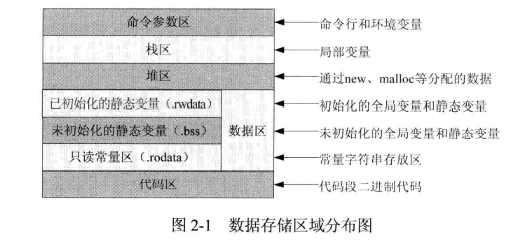
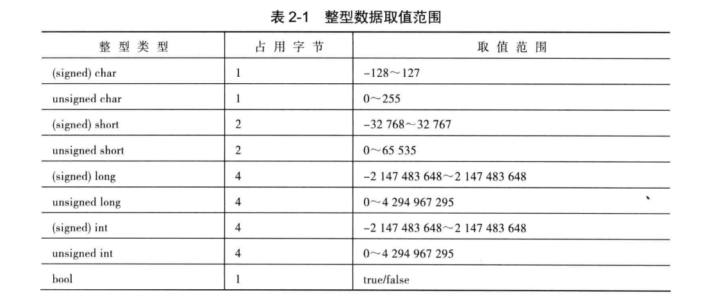

面向对象程序设计的显著特性
程序设计的重点在于数据而不是过程；程序被划分为所谓的对象。
数据结构为表现对象的特性而设计；函数作为对某个对象数据的操作，与数据结构紧密地结合在一起。
数据被隐藏起来，不能为外部函数访问；对象之间可以通过函数沟通。
新的数据和函数可以在需要的时候轻而易举地添加进来。
在程序设计过程中遵循由下至上（bottom-up）的设计方法。


面向对象程序可维护性的优点
通过继承，可以大幅减少冗余的代码，并扩展现有代码的用途。
可以在标准模块上（“标准”指程序员之间彼此达成的协议）构建自己的程序，
而不必一切从头开始，从而减少软件开发时间并提高生产效率。
数据隐藏的概念帮助程序员们保护程序免受外部代码的侵袭。
允许一个对象的多个实例同时存在，而且彼此之间不会相互干扰。
允许将问题空间中的对象直接映射到程序中。
基于对象的工程，可很容易地分割为独立的部分；以数据为中心的设计方法，
允许用户抓住可实现模型的更多细节。
面向对象的系统很容易从小到大逐步升级。
对象间通信所使用的消息传递技术与外部系统接口部分的描述更简单；更便于
控制软件复杂度。








确保对象在使用前被初始化


使用成员初始化列表初始化比赋值效率更高

```c++
CPerson::CPerson(std::string&strName,Sex&sex):m_strName(strName),m_sex(sex)
{}
```


为内置类型对象进行手动初始化，因为C++不保证初始化它们。构造函数最好使用成员初始化列，而不是在构造函数本体内使用赋值操作。初值列表列出的成员变量，其排列顺序应和它们在class中的声明次序相同。


全局变量和静态变量如果没有手动初始化，则由编译器初始化为 0。
局部变量是编译器永远不会初始化的变量。如果没有手动初始化，局部变量的值为随机值。


作用域有6种，全局作用域，局部作用域，语句作用域，类作用域，命名空间作用域，文件作用域

从作用域上看

全局变量具有全局作用域。全局变量只需在一个源文件中定义，就可以作用于所有的源文件。当然，其他不包含全局变量定义的源文件需要用extern 关键字再次声明这个全局变量。

静态局部变量具有局部作用域，它只被初始化一次，自从第一次被初始化直到程序运行结束都一直存在。它和全局变量的区别在于全局变量对所有的函数都是可见的，而静态局部变量只对定义自己的函数体始终可见。

 局部变量也只有局部作用域，它是自动对象（auto），它在程序运行期间不是一直存在，而是只在函数执行期间存在，函数的一次调用执行结束后，变量被撤销，其所占用的内存也被收回。

静态全局变量也具有全局作用域，它与全局变量的区别在于如果程序包含多个文件，它作用于定义它的文件里，不能作用到其他文件里，即被 static 关键字修饰过的变量具有文件作用域。这样即使两个不同的源文件都定义了相同名字的静态全局变量，它们也是不同的变量。

从分配内存空间看

全局变量、静态局部变量、静态全局变量都在静态存储区分配空间，而局部变量在栈里分配空间。

全局变量本身就是静态存储方式，静态全局变量当然也是静态存储方式，这两者在存储方式上并无不同。这两者的区别在于非静态全局变量的作用域是整个源程序，当一个源程序由多个源文件组成时，非静态全局变量在各个源文件中都是有效的，而静态全局变量则限制了其作用域，即只在定义该变量的源文件内有效，在同一源程序的其他源文件中不能使用。由于静态全局变量的作用域局限于一个源文件内，只能为该源文件内的函数公用，因此可以避免在其他源文件中引起错误。


（1）声明引用的引用、指向引用的指针、指向引用的数组都是非法的。
（2）引用不可能带有常量性和挥发性，因为别名不能带有常量性和挥发性。用关键字 const和volatile修饰引用会造成编译错误。
（3）用const或volatile修饰引用类型，不会造成编译错误，但是编译器会默认忽略这些修饰。


