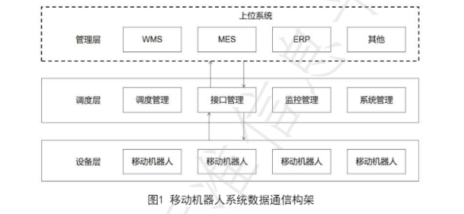

# 简介

工业应用移动机器人管理层，调度层，设备层之间的数据接口信息规范。

# 术语

上位系统 host system  

调度系统的上位管理系统

消息 message

应用系统间单向传送的结构数据包，一般消息头，消息体（数据块）组成

消息交互  message interaction

应用系统间数据传输数据的过程

WMS  仓库管理系统 Warehouse ManageMent System

## MES简介

MES（Manufacturing Execution System）即制造执行系统，是一种用于管理制造过程的计算机系统。它通过实时数据采集和分析，监控制造过程中的各种参数，支持生产计划、物料管理、质量控制、设备管理、人力资源等制造业务。MES的主要作用是协调企业内部的各种资源，提高生产效率和质量，降低成本，确保生产计划的顺利完成。

为了更好地实现工作目标，企业需要对MES的功能进行裁剪。裁剪MES功能有以下几个方面：

1. 根据企业的业务需求，选择MES系统中必要的功能模块，避免无用功能的干扰。
2. 对MES系统进行自定义设置，根据企业的实际情况，调整系统参数，提高系统的适应性和可用性。
3. 对MES系统进行二次开发，根据企业的特殊需求，增加或修改系统功能，提高系统的灵活性和扩展性。

通过MES系统的裁剪，企业可以更好地利用MES系统，提高生产效率和质量，减少生产成本，增强竞争力，实现可持续发展。

## ERP

（Enterprise Resource Planning）即企业资源计划，是一种集成管理软件系统，用于对企业内部的各种业务进行统一管理。它包括财务管理、采购管理、销售管理、库存管理、生产管理、人力资源管理等多个模块，可以对企业的各种业务进行全面管理和协调，提高企业的管理水平和效率，降低管理成本，促进企业的可持续发展。

## PLC

（Programmable Logic Controller）即可编程逻辑控制器，是一种用于工业控制的计算机控制系统。它由中央处理器、输入/输出模块、通信模块、电源模块等组成，可以实现对工业生产过程中的各种参数进行实时监测和控制，如温度、压力、流量、速度等。PLC系统广泛应用于机械、化工、制药、食品、冶金、纺织等行业，可以提高生产效率和质量，降低生产成本，改善生产环境，确保生产安全和稳定性。

## OPC

（OLE for Process Control）是一种通信协议，可以在不同的工业自动化设备和系统之间实现数据交换和通信。它最初是由微软公司开发的，用于在不同的Windows应用程序之间进行数据交换。 后来，OPC的应用范围扩展到了工业自动化领域，成为了一种通用的工业自动化通信协议。它提供了一种标准化、可靠的数据交换方式，使得不同厂商的设备和系统可以互相通信，从而实现了设备和系统之间的互联互通。 OPC协议分为两部分：OPC DA和OPC UA。OPC DA是最早的版本，用于实现实时数据的读取和写入；OPC UA是新一代的OPC协议，除了可以实现实时数据的读取和写入外，还可以实现更高级别的功能，如安全认证、历史数据存储、事件管理等。 总之，OPC协议是工业自动化领域中非常重要的通信协议，它对于实现工业自动化设备和系统之间的互联互通、提高工业自动化系统的可靠性和安全性具有重要意义。

## REST

（Representational State Transfer）是一种基于HTTP协议的网络应用程序架构风格。它定义了一组设计原则和约束条件，用于创建可伸缩、可靠、易于维护和扩展的Web服务。其中最重要的原则之一就是REST状态转移。 REST状态转移是指客户端和服务器之间的一种状态转移方式，通过HTTP协议的请求和响应来进行。它包括以下几个方面：

1. 客户端向服务器发送资源的请求，请求可以是GET、POST、PUT、DELETE等HTTP方法之一。
2. 服务器对请求进行处理，并返回相应的资源给客户端。
3. 客户端对服务器返回的资源进行操作，可以对资源进行修改、删除、添加等操作。
4. 经过操作后，客户端再次向服务器发送请求，以更新服务器中的资源状态。 在REST状态转移中，资源是一切的核心，每个资源都有一个唯一的URL来表示。客户端通过URL来请求资源，并对资源进行操作。服务器通过HTTP响应来表示资源的状态，并允许客户端对资源进行操作。 总之，REST状态转移是一种基于HTTP协议的客户端-服务器状态转移方式，通过HTTP的请求和响应来进行资源的操作和管理，是REST架构风格的核心。

# 系统架构

## 管理层

移动系统的上位程序，WMS，MES，ERP系统等系统，向调度层下发任务，接受调度层的任务反馈信息。

## 调度层

调度层为移动机器人系统的指挥中枢，接受上位系统下发的任务数据，并反馈任务执行的状态数据，想移动机器人下发任务数据及接受任务状态与运行状态数据，完成对移动机器人的管理与调度，包括调度管理，接口管理，监控管理，系统管理功能。

移动机器人系统的上层应用，包括任务规划、路径规划、环境感知等。这些应用需要通过数据通信来协调机器人的行动

移动机器人的控制层，包括机器人控制算法、传感器数据采集和处理等。这些控制算法需要通过数据通信来获取环境信息和控制机器人的行动。

移动机器人系统的通信层，包括通信协议、网络通信、数据传输等。通信层需要保证数据的可靠性和实时性，同时支持不同类型的数据传输方式，如无线通信、有线通信等。

## 设备层

设备层为移动机器人，接收调度系统的任务指令并反馈任务指令状态与运行状态数据。

移动机器人系统的设备层，包括机器人底盘、传感器、执行器等。设备层需要通过通信层将数据传输到控制层，同时接收控制层的指令来实现机器人的运动和操作。

# 调度层系统模块功能

## 调度管理

对系统中运行的任务和移动机器人进行统筹管理，调度

一般包含功能：

1.任务管理：处理系统运行过程中的各种任务，包括任务接收，任务规划，任务执行，任务查询，任务干预等。

2.车辆管理：对移动机器人进行统筹调度，包括车辆状态数据采集，车辆指派，任务控制，休息（休眠）与充电控制，故障处理等

3.交通管理：对移动机器人进行交通管制，包括路径规划，交通资源理，死锁检测与解锁等

4.仿真管理：模拟机器人，完成仿真功能

## 接口管理

调度层与管理层之间的数据通信接口管理

调度层与设备层之间的数据通信接口管理

与其它相关系统接口管理

## 监控管理

一般如下：

任务监控：对任务的执行状态进行实时监控

车辆监控：对移动机器人的运行状态进行实时监控

图形监控：对移动机器人的运行状态进行图形化监视与控制

故障报警：对系统内的异常状态进行提示及报警

数据统计：对任务的历史数据进行统计，查询

事件查询：对事件日志进行查询

## 系统管理

对调度层系统通用配置管理，一般包括

用户管理：对用户进行添加，编辑，删除及密码设置等管理

权限管理：基于角色和资源的用户权限管理，不同的用户有不同的角色，不同的角色有不同的资源，不同的资源有不同的被操作权限

配置管理：对调度系统配置项进行管理，可包括通用配置，调度规划配置等

事件管理：用于记录系统运行时的关键信息及故障信息，可包含任务，车辆及系统信息

# 调度层系统接口消息交互实现方式

管理层与调度层，调度层与设备层之间的数据通信是通过消息交互来实现的，消息交互中的数据单位均采用国际单位制

## 管理层与调度层接口消息交互实现方式

一般

基于报文通信接口（TCP/IP，UDP协议等）

Web API服务接口（REST）等

Web Service 服务接口等

数据库中间表接口

动态链接库接口（SDK）等

基于PLC的通信接口（MobBus)等

## 调度层与设备层接口消息交互实现方式

与上面类似

# 管理层与调度层接口数据要求

## 管理层想调度层下发的数据项需包含

任务编号：上位系统给任务指定的唯一标识

任务类型：上位系统给任务指定的类型

任务优先级：上位系统给任务指定的优先等级，决定任务执行的优先次序

任务参数：上位系统给任务指定的参数，用于满足不同应用的参数差异化需求，可包括起始位置，目标位置，操作类型等

任务指令：上位系统给任务的指令，可包括创建，暂停，恢复，取消，重试等

系统心跳：表示管理层系统是否在正常运行

依据应用场景，管理层向调度层下发的数据：

任务描述：上位系统给任务指定的描述

任务截止时间：上位系统给任务指定的最终截止时间

移动机器人选择决策：上位系统期望执行任务的移动机器人编号，分组等

## 调度层向管理层反馈的数据

调度层向管理层反馈的数据须包括：
任务编号：上位系统给任务指定的唯一标识：
任务状态：当前任务执行状态，可包括任务等寺、任务启动、任务完成、任务取消等：
车辆编号：执行任务的移动机器人编号：
位姿数据：移动机器人在系统中的当前位姿，可包含路径编号或实际坐标等数据：
目标位姿：移动机器人的目标位姿：
运行模式：移动机器人当前的运行模式，可包括手动、自动、半自动等：
运行状态：移动机器人的实时运行状态，可包括电池电量、充电状态、行走中、操作中、停止状态、故障状态等：
系统心跳：表示调度层系统是否在正常运行。

# 调度层与设备层接口数据要求

## 调度层向设备层下发的数据

调度层向设备层下发的数据须包括：
目标位姿：移动机器人的目标位姿：
操作类型：移动机器人当前所要执行的操作类型，用于于区分装货、卸货等不同的操作：
扩展参数：移动机器人当前任务的扩展参数，用于满足不同应用的参数差异化需求：

操作指令：调度层给设备层的操作指令，可包括创建、暂停、恢复、取消等：
系统心跳：表示调度系统工作正常。

依据应用场景，调度层向设备层下发的数据还可包括：
路径信息：移动机器人的将要行驶的点、段信息。
行驶参数：移动机器人的行驶参数，可包含行驶距离、行驶速度等。

## 设备层向调度层反馈的数据

设备层向调度层反馈的数据须包括：
车辆编号：移动机器人在系统中的唯一标识。
当前速度：移动机器人当前的行驶速度。
位姿数据：移动机器人在系统中的当前位姿，可包含路径编号或实际坐标等数据。
目标位姿：移动机器人的目标位姿。
操作类型：移动机器人当前所要执行的操作类型，用于区分装货、卸货等不同的操作。
任务状态：移动机器人当前任务的执行状态，可包括开始、完成、取消等。
运行模式：移动机器人当前的运行模式，可包括手动、自动、半自动等。
系统心跳：表示设备层工作正常。
运行状态：移动机器人的实时运行状态，可包括电池电量、充电状态、行走中、操作中、停止状态、故障状态、安全防护状态等。
事件数据：移动机器人运行时的关键信息及故障信息，可包含行驶状态、导航状态、操作状态、通讯状态等数据。