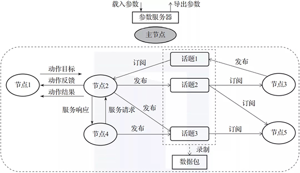
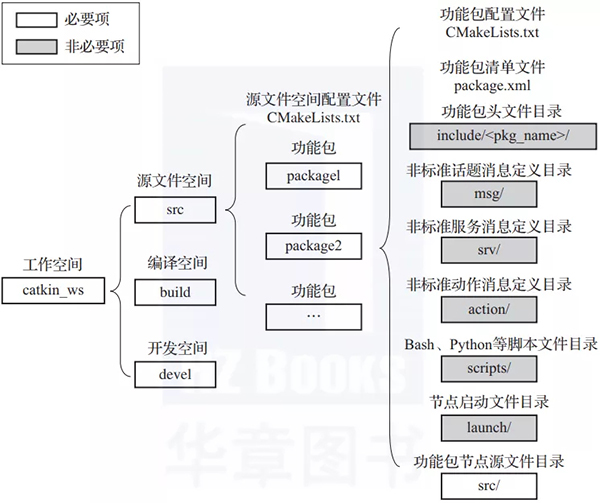

# 初步

## Ros概念

机器人开源的os


## 安装

linux 虚拟机 

虚拟机安装 具体参考 ubuntu虚拟机安装教程

配置镜像源


linux命令安装Ros`sudo apt install ros-melodic-desktop-full`

ROS多个类型Desktop-Full，Desktop，ROS-Base

较为常用的是Desktop-Full


配置环境变量后，方便在任意终端使用Ros

```
echo "source /opt/ros/melodic/setup.bash" >> ~/.bashrc
source ~/.bashrc
```


安装构建依赖

`sudo apt install python-rosdep python-rosinstall python-rosinstall-generator python-wstool build-essential`

`sudo apt install python-rosdep`

初始化rosdep

`sudo rosdep init`

`rosdep update`

可能会遇见报错


卸载

`sudo apt remove ros-melodic-*`


## 测试

启动命令行 Ctrl + alt + T

roscore

rosrun turtlesim turtlesim_node （会弹出图形化界面）

rosrun turtlesim turtle_teleop_key  （可以在界面中控制运动）


# Ros编程实现

Ros程序主要实现方式c++和python

一般实现流程：创建一个工作空间，创建一个功能包，编辑源文件，编辑配置文件，编译并执行

**创建工作空间并初始化**

```
mkdir -p myworkbase/src
cd myworkbase
catkin_make
```


**进入src创建ros包并添加依赖**

```
cd src
catkin_create_pkg 自定义ROS包名 roscpp rospy std_msgs
```

会在src目录生成功能包，依赖于roscpp和rosp，std_msgs（标准消息库） 创建功能包都会依赖这三个库

> 注意: 在ROS中，虽然实现同一功能时，C++和Python可以互换，但是具体选择哪种语言，需要视需求而定，因为两种语言相较而言:C++运行效率高但是编码效率低，而Python则反之，基于二者互补的特点，ROS设计者分别设计了roscpp与rospy库，前者旨在成为ROS的高性能库，而后者则一般用于对性能无要求的场景，旨在提高开发效率。


## c++

cd 自定义的包


实现hello word

```c++
#include "ros/ros.h"
int main(int argc, char *argv[])
{
    //执行 ros 节点初始化
    ros::init(argc,argv,"hello");
    //创建 ros 节点句柄(非必须)
    ros::NodeHandle n;
    //控制台输出 hello world
    ROS_INFO("hello world!");

    return 0;
}
```

编辑Ros包下cmakelist.txt文件

```
add_executable(步骤3的源文件名
  src/步骤3的源文件名.cpp
)
target_link_libraries(步骤3的源文件名
  ${catkin_LIBRARIES}
)
```

cd myworkbase

catkin_make

>catkin_make是在cmake与make基础上简化了一遍，相当于做了一个封装的指令工具，规范工作路径与生成文件路径
>
>```
>#基本路径
>Base path: /home/user/catkin_ws
>Source space: /home/user/catkin_ws/src
>Build space: /home/user/catkin_ws/build
>Devel space: /home/user/catkin_ws/devel
>Install space: /home/user/catkin_ws/install
>```
>
>


执行完成catklin_make install 会生成一个install文件夹

可以直接在单独的install里source，并运行节点


# ROS集成开发环境搭建

## 安装终端

好用终端工具 Terminator 

sudo apt install terminator


可以去了解相关的快捷键


编辑器


配置插件

启动 vs code


修改.vscode/task.json文件可以修改配置

```json
{
// 有关 tasks.json 格式的文档，请参见
    // https://go.microsoft.com/fwlink/?LinkId=733558
    "version": "2.0.0",
    "tasks": [
        {
            "label": "catkin_make:debug", //代表提示的描述性信息
            "type": "shell",  //可以选择shell或者process,如果是shell代码是在shell里面运行一个命令，如果是process代表作为一个进程来运行
            "command": "catkin_make",//这个是我们需要运行的命令
            "args": [],//如果需要在命令后面加一些后缀，可以写在这里，比如-DCATKIN_WHITELIST_PACKAGES=“pac1;pac2”
            "group": {"kind":"build","isDefault":true},
            "presentation": {
                "reveal": "always"//可选always或者silence，代表是否输出信息
            },
            "problemMatcher": "$msCompile"
        }
    ]
}
```


代码提示是添加

修改 .vscode/c_cpp_properties.json

`cppStandard:"c++17"`

解决中文乱码是

```
setlocale(LC_CTYPE,"zh_CN.utf8");
setlocale(LC_ALL,"");
```


# launch文件

使用launch文件，可以一次性启动多个ROS节点


实现

功能包 添加launch文件夹

选定launch文件 添加launch文件

编辑launch文件内容


node 包含的某个节点

pkg  功能包

type 被运行的节点文件

name 为节点命名

output  设置日志的输出目标

运行launch文件

`roslaunch 包名 launch文件名`


# ROS架构

## 计算图视角理解ROS架构

ROS中可执行程序的基本单位叫节点（node），节点之间通过消息机制进行通信



节点是可以执行程序，进程，ROS功能包中创建的每个可执行程序在被启动加载到系统进程中后，就是一个ROS节点


节点之间通过收发消息进行通信，消息收发机制分为话题（Topic），服务（service），动作（action）

节点，话题，服务，动作都要有唯一名称作为标识

ROS利用节点将代码和功能解耦，提高系统的容错性和可维护性，最好让每个节点具有特定的单一功能，而不是创建一个包罗万象的庞大节点

消息是构成计算图的关键，包括消息机制和消息类型两部分。消息机制有话题，服务和动作三种，每种消息机制中传递的数据都具有特定的数据类型（即消息类型），消息类型可以分为话题类型，服务消息类型，动作消息类型

数据包（rosbag）是ROS中专门用来保存和回放话题中数据的文件，可以将一些难以收集的传感器数据用数据包录制下来，然后反复回放来进行算法性能调试。

参数服务器能够为整个ROS网络中的节点提供便于修改的参数。参数可以认为是节点中可供外部修改的全局变量，有静态参数和动态参数。静态参数一般用于在节点启动时设置节点工作模式；动态参数可以用于在节点运行时动态配置节点或改变节点工作状态，比如电机控制节点里的PID控制参数。

主节点负责各个节点之间通信过程的调度管理。因此主节点必须要最先启动，可以通过roscore命令启动。


## 文件系统视角理解ROS架构




工作空间是一个包含功能包、编译包和编译后可执行文件的文件夹，用户可以根据自己的需要创建多个工作空间，在每个工作空间中开发不同用途的功能包。在图1-4中，我们创建了一个名为catkin_ws的工作空间，其中包含src、build和devel三个文件夹。

- src文件夹放置各个功能包和配置功能包的CMake配置文件CMakeLists.txt。这里说明一下，由于ROS中的源码采用catkin工具进行编译，而catkin工具又基于CMake技术，所以我们在src源文件空间和各个功能包中都会见到一个CMake配置文件CMakeLists.txt，这个文件起到配置编译的作用。
- build文件夹放置编译CMake和catkin功能包时产生的缓存、配置、中间文件等。
- devel文件夹放置编译好的可执行程序，这些可执行程序是不需要安装就能直接运行的。一旦功能包源码编译和测试通过后，可以将这些编译好的可执行文件直接导出与其他开发人员分享。


功能包是ROS中软件组织的基本形式，具有创建ROS程序的最小结构和最少内容，它包含ROS节点源码、脚本、配置文件等。

1. CMakeLists.txt是功能包配置文件，用于编译Cmake功能包编译时的编译配置。
2. package.xml是功能包清单文件，用xml的标签格式标记该功能包的各类相关信息，比如包的名称、开发者信息、依赖关系等，主要是为了使功能包的安装和分发更容易。
3. include/<pkg_name>是功能包头文件目录，可以把功能包程序中包含的*.h头文件放在这里。include目录之所以还要加一级路径<pkg_name>是为了更好地区分自己定义的头文件和系统标准头文件，<pkg_name>用实际功能包的名称替代。不过这个文件夹不是必要项，比如有些程序没有头文件。
4. msg、srv和action这三个文件夹分别用于存放非标准话题消息、服务消息和动作消息的定义文件。ROS支持用户自定义消息通信过程中使用的消息类型。这些自定义消息不是必要的，比如程序只使用标准消息类型。
5. scripts目录存放Bash、Python等脚本文件，为非必要项。
6. launch目录存放节点的启动文件，*.launch文件用于启动一个或多个节点，在含有多个节点的大型项目中很有用，为非必要项。
7. src目录存放功能包节点所对应的源代码，一个功能包中可以有多个节点程序来完成不同的功能，每个节点程序都可以单独运行。这里src目录存放的是这些节点程序的源代码，你可以按需创建文件夹和文件来组织源代码，源代码可以用C++、Python等编写。


```
WorkSpace --- 自定义的工作空间

    |--- build:编译空间，用于存放CMake和catkin的缓存信息、配置信息和其他中间文件。

    |--- devel:开发空间，用于存放编译后生成的目标文件，包括头文件、动态&静态链接库、可执行文件等。

    |--- src: 源码

        |-- package：功能包(ROS基本单元)包含多个节点、库与配置文件，包名所有字母小写，只能由字母、数字与下划线组成

            |-- CMakeLists.txt 配置编译规则，比如源文件、依赖项、目标文件

            |-- package.xml 包信息，比如:包名、版本、作者、依赖项...(以前版本是 manifest.xml)

            |-- scripts 存储python文件

            |-- src 存储C++源文件

            |-- include 头文件

            |-- msg 消息通信格式文件

            |-- srv 服务通信格式文件

            |-- action 动作格式文件

            |-- launch 可一次性运行多个节点 

            |-- config 配置信息

        |-- CMakeLists.txt: 编译的基本配置
```


### Ros文件系统相关命令

添加

```
catkin_create_pkg 自定义包名 依赖包 === 创建新的ROS功能包
sudo apt install xxx === 安装 ROS功能包
```

删除

`sudo apt purge xxx ====删除某个功能包`

查

```
rospack list === 列出所有功能包

rospack find 包名 === 查找某个功能包是否存在，如果存在返回安装路径

roscd 包名 === 进入某个功能包

rosls 包名 === 列出某个包下的文件

apt search xxx === 搜索某个功能包
```

改

```
rosed 包名 文件名 === 修改功能包文件

需要安装 vim

比如:rosed turtlesim Color.msg
```


# ROS计算图


