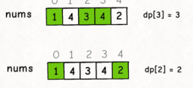

# 动态规划

1.定义数组含义

2.找出**数组元素之间的关系式**

3.找出初始值 确定关系式

例题 青蛙跳台阶 一次 只能1或2

例题 二维一点到另外一点

斐波那契

```c++
int fib(int n) {
    if (n == 0 || n == 1) {
        // base case
        return n;
    }
    // 分别代表 dp[i - 1] 和 dp[i - 2]
    int dp_i_1 = 1, dp_i_2 = 0;
    for (int i = 2; i <= n; i++) {
        // dp[i] = dp[i - 1] + dp[i - 2];
        int dp_i = dp_i_1 + dp_i_2;
        // 滚动更新
        dp_i_2 = dp_i_1;
        dp_i_1 = dp_i;
    }
    return dp_i_1;
}
空间复杂度为1
```

# 凑零钱问题

```c++
int coinChange(int[] coins,int amount);
```

## 暴力递归

```c++
//不带备忘录的写法
int coinChange(int[] coins, int amount) {
    // 题目要求的最终结果是 dp(amount)
    return dp(coins, amount)
}
// 定义：要凑出金额 n，至少要 dp(coins, n) 个硬币
int dp(int[] coins, int amount) {
    // base case
    if (amount == 0) return 0;
    if (amount < 0) return -1;
    int res = Integer.MAX_VALUE;
    for (int coin : coins) {
        // 计算子问题的结果
        int subProblem = dp(coins, amount - coin);
        // 子问题无解则跳过
        if (subProblem == -1) continue;
        // 在子问题中选择最优解，然后加一
        res = Math.min(res, subProblem + 1);
    }
    return res == Integer.MAX_VALUE ? -1 : res;
}
时间复杂度为(k*n^k)
//带备忘录的写法
int[] memo;
int coinChange(int[] coins, int amount) {
    memo = new int[amount + 1];
    // dp 数组全都初始化为特殊值
    Arrays.fill(memo, -666);
    return dp(coins, amount);
}
int dp(int[] coins, int amount) {
    if (amount == 0) return 0;
    if (amount < 0) return -1;
    // 查备忘录，防止重复计算
    if (memo[amount] != -666)
        return memo[amount];

    int res = Integer.MAX_VALUE;
    for (int coin : coins) {
        // 计算子问题的结果
        int subProblem = dp(coins, amount - coin);
        // 子问题无解则跳过
        if (subProblem == -1) continue;
        // 在子问题中选择最优解，然后加一
        res = Math.min(res, subProblem + 1);
    }
    // 把计算结果存入备忘录
    memo[amount] = (res == Integer.MAX_VALUE) ? -1 : res;
    return memo[amount];
}
```

## dp数组的迭代解法

```c++
int coinChange(int[] coins, int amount) {
    int[] dp = new int[amount + 1];
    // 数组大小为 amount + 1，初始值也为 amount + 1  去正数最大值会导致dp[i-coin]+1溢出
    Arrays.fill(dp, amount + 1);
    // base case
    dp[0] = 0;
    // 外层 for 循环在遍历所有状态的所有取值
    for (int i = 0; i < dp.length; i++) {
        // 内层 for 循环在求所有选择的最小值
        for (int coin : coins) {
            // 子问题无解，跳过
            if (i - coin < 0) {
                continue;
            }
            dp[i] = Math.min(dp[i], 1 + dp[i - coin]);
        }
    }
    return (dp[amount] == amount + 1) ? -1 : dp[amount];
}

```

# 最长递增子序列

定义dp数组  



假设到nums数组的第几号元素 dp记录就是截止到这个元素递增的序列

**递增子序列，我们只要找到前面那些结尾比 3 小的子序列，然后把 3 接到这些子序列末尾，就可以形成一个新的递增子序列，而且这个新的子序列长度加一**

```c++
int lengthOfLIS(int[] nums) {
    // 定义：dp[i] 表示以 nums[i] 这个数结尾的最长递增子序列的长度
    int[] dp = new int[nums.length];
    // base case：dp 数组全都初始化为 1
    Arrays.fill(dp, 1);
    for (int i = 0; i < nums.length; i++) {
        for (int j = 0; j < i; j++) {
            if (nums[i] > nums[j]) 
                dp[i] = Math.max(dp[i], dp[j] + 1);
        }
    }
    int res = 0;
    for (int i = 0; i < dp.length; i++) {
        res = Math.max(res, dp[i]);
    }
    return res;
}

```

题目  俄罗斯套娃信封问题

给你一个二维整数数组 `envelopes` ，其中 `envelopes[i] = [wi, hi]` ，表示第 `i` 个信封的宽度和高度。

当另一个信封的宽度和高度都比这个信封大的时候，这个信封就可以放进另一个信封里，如同俄罗斯套娃一样。

请计算 **最多能有多少个** 信封能组成一组“俄罗斯套娃”信封（即可以把一个信封放到另一个信封里面）。

**注意**：不允许旋转信封。

我的解法

```c++
class Solution {
public:
    static bool cmp(vector<int>& a,vector<int>&b)
    {
        if(a[0]!=b[0])return a[0]<b[0];
        else return a[1]>b[1];
    }
    int maxEnvelopes(vector<vector<int>>& envelopes) {
        sort(envelopes.begin(),envelopes.end(),cmp);
        int n=envelopes.size();
        vector<int> dp(n,1);
        for(int i=0;i<n;++i)
        for(int j=0;j<i;++j)
        {
            if(envelopes[i][1]>envelopes[j][1])dp[i]=max(dp[i],dp[j]+1);
        }
        return *max_element(dp.begin(),dp.end());
    }
};
```


```c++
解题思路
先按照宽度排序，递增，宽度相同，高度递减排序
    
 int maxEnvelopes(vector<vector<int>>& envelopes){
        if(envelopes.empty())return 0;
      //先按w排序，若w相同，则按h由高到低排序；若w不同，则按w由小到大排序
        sort(envelopes.begin(),envelopes.end(),[](const auto& a,const auto& b){
            return a[0]<b[0]||(a[0]==b[0]&&a[1]>b[1]);
        });
        vector<int> dp;
        for(auto& en:envelopes){
            int idx=lower_bound(dp.begin(),dp.end(),en[1])-dp.begin();
            if(idx>=dp.size()){
                dp.emplace_back(en[1]);
            }
            else{
                dp[idx]=en[1];
            }
        }
        return dp.size();
```

