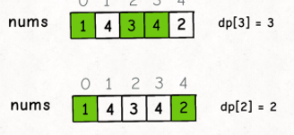
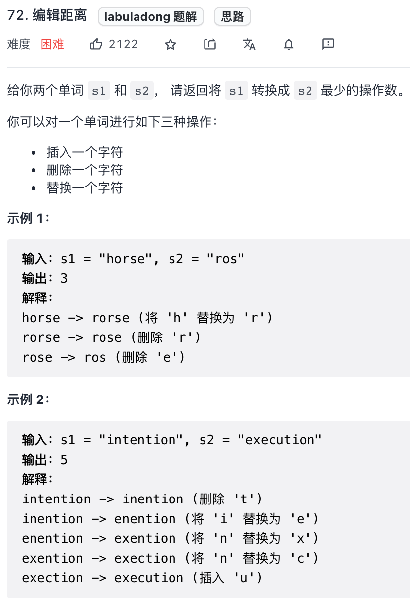

# 回溯

**因为回溯的本质是穷举，穷举所有可能，然后选出我们想要的答案**

才用回溯法解决问题的过程实质上是在树形结构中从根节点开始进行深度优先遍历。通常回溯法的深度优先遍历用递归代码实现。


## 理论

### 回溯法解决的问题

回溯法，一般可以解决如下几种问题：

- 组合问题：N个数里面按一定规则找出k个数的集合
- 切割问题：一个字符串按一定规则有几种切割方式
- 子集问题：一个N个数的集合里有多少符合条件的子集
- 排列问题：N个数按一定规则全排列，有几种排列方式
- 棋盘问题：N皇后，解数独等等

### 如何理解回溯法

**回溯法解决的问题都可以抽象为树形结构**，是的，我指的是所有回溯法的问题都可以抽象为树形结构！

因为回溯法解决的都是在集合中递归查找子集，**集合的大小就构成了树的宽度，递归的深度，都构成的树的深度**。

递归就要有终止条件，所以必然是一棵高度有限的树（N叉树）。


回溯函数终止条件

树形结构，遍历树形结构一定要用有终止条件

什么时候达到终止条件，一般到叶子节点，就找到满足的条件，把答案存放起来，结束本层递归。


具体解题过程


模板框架：

```c++
void backtracking(参数) {
    if (终止条件) {
        存放结果;
        return;
    }

    for (选择：本层集合中元素（树中节点孩子的数量就是集合的大小）) {
        处理节点;
        backtracking(路径，选择列表); // 递归
        回溯，撤销处理结果
    }
}

```


## 例题

[77. 组合 - 力扣（LeetCode） (leetcode-cn.com)](https://leetcode-cn.com/problems/combinations/)

优化过程如下：

1. 已经选择的元素个数：path.size();
2. 还需要的元素个数为: k - path.size();
3. 在集合n中至多要从该起始位置 : n - (k - path.size()) + 1，开始遍历


for是横向遍历，递归是纵向遍历，一下子脑子里感觉有东西通了，以前一直不理解递归，但现在发现其实可以用for来理解递归。


39组合总和

```c++
class Solution {
public:
    vector<vector<int>> ans;
    vector<int> tmp;
    void dfs(vector<int>& nums,int target,int index)
    {
        if(target==0)
        {
            ans.push_back(tmp);
            return;
        }

        for(int i=index;i<nums.size();i++)
        {
            if(target-nums[i]>=0)
            {
                tmp.push_back(nums[i]);
                dfs(nums,target-nums[i],i);
                tmp.pop_back();
            }
        }
    }


    vector<vector<int>> combinationSum(vector<int>& candidates, int target) {
        sort(candidates.begin(),candidates.end());
        dfs(candidates,target,0);
        return ans;
    }
};
```


40组合2

```c++
class Solution {
public:
    vector<vector<int>> ans;
    vector<int> tmp;
    void dfs(vector<int>& nums,int target,int index)
    {
        if(target==0)
        {
            ans.push_back(tmp);
            return;
        }
        for(int i=index;i<nums.size();i++)
        {
            //对于同一层使用过的元素进行跳过
            if(i>index&&nums[i]==nums[i-1])
                continue;
            if(target-nums[i]>=0){
            tmp.push_back(nums[i]);
            dfs(nums,target-nums[i],i+1);//每一个数只能使用一次
            tmp.pop_back();
            }
        }
    }
    vector<vector<int>> combinationSum2(vector<int>& candidates, int target) {
        sort(candidates.begin(),candidates.end());
        dfs(candidates,target,0);
        return ans;
    }
};
```


电话号码组合

```c++
class Solution {
public:
     vector<string> sve={
        "","","abc","def","ghi","jkl","mno","pqrs","tuv","wxyz" 
     };
     vector<string> ans;
     string s;
     void backtrack(const string& digits,int index)
     {
         if(index==digits.size())
         {
             ans.push_back(s);
             return;
         }
         int digit=digits[index]-'0';
         string temp=sve[digit];
         for(int i=0;i<temp.size();i++)
         {
            s.push_back(temp[i]);
            backtrack(digits,index+1);
            s.pop_back();
         }
     }
    vector<string> letterCombinations(string digits) {
        if(digits.size()==0)
            return ans;
        backtrack(digits,0);
        return ans;
    }
};
```


131分割回文串

```c++

```


# 贪心

**贪心的本质是选择每一阶段的局部最优，从而达到全局最优**。

贪心算法一般分为如下四步：

- 将问题分解为若干个子问题
- 找出适合的贪心策略
- 求解每一个子问题的最优解
- 将局部最优解堆叠成全局最优解


# 数组

在c++中二维数组是连续分布的

## 二分查找

[力扣 (leetcode-cn.com)](https://leetcode-cn.com/problems/search-insert-position/)

```c++
int search(vector<int>& nums, int target) {
        int low = 0, high = nums.size() - 1;
        while(low<=high)
        {
            int mid = (low + high) / 2;
            if(nums[mid] == target)
                return mid;
            if(nums[low] <= target && target < nums[mid])
                high = mid - 1;
            else
                low = mid + 1;
        }
        return -1;
    }


//二分查找不在数组里面返回插入位置
int searchInsert(vector<int>& nums, int target) {
        int left = 0, right = nums.size() - 1;
        while(left <= right) {
            int mid = left + (right - left) / 2;
            if(nums[mid] == target) return mid;
            else if(nums[mid] < target) left = mid + 1;
            else right = mid - 1;
        }
       return left;
    }
```

## 移除元素

[27. 移除元素 - 力扣（LeetCode） (leetcode-cn.com)](https://leetcode-cn.com/problems/remove-element/)

双指针法，前一个指针fast走的快些，lower是记录插入的，当fast指向位置等于val时，lower不移动

```c++
int removeElement(vector<int>& nums, int val) {
        int fast = 0,lower=0;
        while(fast<nums.size()){
            if(nums[fast]!=val){
                nums[lower++] = nums[fast];
            }
            fast++;
        }
        return nums.size()-lower;
    }
```

leetcode相关题目

- 26.删除排序数组中的重复项
- 283.移动零
- 844.比较含退格的字符串
- 977.有序数组的平方

[977. 有序数组的平方 - 力扣（LeetCode） (leetcode-cn.com)](https://leetcode-cn.com/problems/squares-of-a-sorted-array/)

双指针法来解题记录插入位置即可,

定义first和last指针，比较谁大谁就从末尾开始插入到容器内


```c++
vector<int> sortedSquares(vector<int>& nums) {
        int last=nums.size()-1;
        int first=0;
        vector<int> res(nums.size());
        int k=last;
        while(first<=last){
            if(nums[first]*nums[first]>nums[last]*nums[last]){
                res[k--] = nums[first]*nums[first];
                first++;
            }
            else{
                res[k--] = nums[last]*nums[last];
                last--;
            }
        }
        return res;
        }
```

## 长度最小子数组

[209. 长度最小的子数组 - 力扣（LeetCode） (leetcode-cn.com)](https://leetcode-cn.com/problems/minimum-size-subarray-sum/)

有暴力解法

两个for循环第一个i从0开始，第二个i到数组末尾，相加大于给的数s，记录序列到res，循环更新res,取最小值

```c++
int minSubArrayLen(int target, vector<int>& nums) {
        int res=INT_MAX;
        for(int i=0;i<nums.size();i++){
            int sum=0;
            for(int j=i;j<nums.size();j++){
                sum+=nums[j];
                if(sum>=target){
                    res=min(res,j-i+1);
                    break;
                }
            }
        }
        //未找到返回0
        return res==INT_MAX?0:res;
    }
```

优解

**滑动窗口**

**不断的调节子序列的起始位置和终止位置，从而得出我们要想的结果**


```c++
int minSubArrayLen(int target, vector<int>& nums) {
        int res=INT_MAX;
        int sum=0;
        int i=0;
        for(int j=0;j<nums.size();j++){
            sum+=nums[j];
            while(sum>=target){
                res=min(res,j-i+1);
                sum-=nums[i++];
            }   
        }
        return res==INT_MAX?0:res;
    }
```

相关题目

[904. 水果成篮 - 力扣（LeetCode） (leetcode-cn.com)](https://leetcode-cn.com/problems/fruit-into-baskets/)

[76. 最小覆盖子串 - 力扣（LeetCode） (leetcode-cn.com)](https://leetcode-cn.com/problems/minimum-window-substring/)

## 螺旋矩阵

[59. 螺旋矩阵 II - 力扣（LeetCode） (leetcode-cn.com)](https://leetcode-cn.com/problems/spiral-matrix-ii/)

```c++
vector<vector<int>> generateMatrix(int n) {
        vector<vector<int>> res(n,vector<int>(n,0));
        int startx=0,starty=0;//循环一个圈的起始位置
        int loop=n/2;//循环一个圈的次数
        //矩阵中间位置
        int mid=n/2;
        int kg=1;
        int offset=1;//循环一圈每一条边的遍历长度
        int i,j;
        while(loop--){
            //从左到右
            for(j=starty;j<starty+n-offset;j++)
                res[startx][j]=kg++;
            //从上到下
            for(i=startx;i<startx+n-offset;i++)
                res[i][j]=kg++;
            //从右到左
            for(;j>startx;j--)
                res[i][j]=kg++;
            //从下到上
            for(;i>starty;i--)
                res[i][j]=kg++;
            //下一圈的起始位置
            startx++;
            starty++;
            offset+=2;
        }
        if(n%2==1){
            res[mid][mid]=kg;
        }
        return res;
    }
```


# 动态规划

1，穷举法/暴力搜索

2，记忆化搜索/剪枝

3.迭代的形式来写

动规的五部曲：

1. 确定dp数组（dp table）以及下标的含义
2. 确定递推公式
3. dp数组如何初始化
4. 确定遍历顺序
5. 举例推导dp数组

## 以最长递增子序列为例

```c++
//解法1
    
```


1.定义数组含义

2.找出**数组元素之间的关系式**

3.找出初始值 确定关系式

例题 青蛙跳台阶 一次 只能1或2

例题 二维一点到另外一点

斐波那契

```c++
int fib(int n) {
    if (n == 0 || n == 1) {
        // base case
        return n;
    }
    // 分别代表 dp[i - 1] 和 dp[i - 2]
    int dp_i_1 = 1, dp_i_2 = 0;
    for (int i = 2; i <= n; i++) {
        // dp[i] = dp[i - 1] + dp[i - 2];
        int dp_i = dp_i_1 + dp_i_2;
        // 滚动更新
        dp_i_2 = dp_i_1;
        dp_i_1 = dp_i;
    }
    return dp_i_1;
}
空间复杂度为1
```

## 带花费爬楼梯问题

[746. 使用最小花费爬楼梯 - 力扣（LeetCode） (leetcode-cn.com)](https://leetcode-cn.com/problems/min-cost-climbing-stairs/)

首先根据动态规划的思想来确定步骤

当爬上一个楼梯时候对应相应的体力值，

1，定义动态规划的数组

dp[i]到达第i阶楼梯所花费最小的体力

2，确定递推的公式

3，dp数组的初始化

4，确定遍历的顺序、

具体代码如下

```c++
class Solution {
public:
    int minCostClimbingStairs(vector<int>& cost) {
        vector<int> dp(cost.size()+1,0);
        dp[0]=cost[0];
        dp[1]=cost[1];
        for(int i=2;i<cost.size();i++)
        {
            dp[i]=min(dp[i-1],dp[i-2])+cost[i];
        }
        return min(dp[cost.size()-1],dp[cost.size()-2]);
    }
};
```

对于题目的意思来说，最后一步是不消费的体力的，所以取值就是在倒数第一第二中取最小值

因为一次是一步或者两步

## 不同路径问题

题目链接

[62. 不同路径 - 力扣（LeetCode） (leetcode-cn.com)](https://leetcode-cn.com/problems/unique-paths/)

有一种深度搜索的方法，直接暴力枚举出有多少路径

```java
class Solution {
private:
    int dfs(int i, int j, int m, int n) {
        if (i > m || j > n) return 0; // 越界了
        if (i == m && j == n) return 1; // 找到一种方法，相当于找到了叶子节点
        return dfs(i + 1, j, m, n) + dfs(i, j + 1, m, n);
    }
public:
    int uniquePaths(int m, int n) {
        return dfs(1, 1, m, n);
    }
};
```

时间复杂度比较高

$O(2^{m + n - 1} - 1)$
$$
O(2^{m+n-1}-1)
$$
按照动态规划的思想来求解

定义dp数组  dp[i][j\]表示到(i, j) 有dp[i\][j\]条不同的路径。

想要求dp[i\][j]，只能有两个方向来推导出来，即dp[i - 1\][j] 和 dp[i][j - 1\]。


```c++
int uniquePaths(int m, int n) {
        vector<vector<int>> ve(m+1,vector<int>(n+1));
        for(int i=1;i<=m;i++)
        ve[i][1]=1;
        for(int j=1;j<=n;j++)
        {
            ve[1][j]=1;
        }
        for(int i=2;i<=m;i++)
        for(int j=2;j<=n;j++)
        {
            ve[i][j]=ve[i-1][j]+ve[i][j-1];
        }
        return ve[m][n];
    }
};
```

节约空间复杂度的方法

利用回滚的思想，对于二维的行单独拿出来进行计算，最终结果也是最后的m×n

```c++
class Solution {
public:
    int uniquePaths(int m, int n) {
        vector<int> dp(n);
        for (int i = 0; i < n; i++) dp[i] = 1;
        for (int j = 1; j < m; j++) {
            for (int i = 1; i < n; i++) {
                dp[i] += dp[i - 1];
            }
        }
        return dp[n - 1];
    }
};
```

带障碍的路径规划

注意在赋初值的时候

**遇到obstacleGrid[i\][0] == 1的情况就停止dp[i\][0]的赋值1的操作，dp[0\][j]同理**

就是

在第一行有障碍 障碍后面数值就只能说0了

```c++
int uniquePathsWithObstacles(vector<vector<int>>& obstacleGrid) {
        int m=obstacleGrid.size();
        int n=obstacleGrid[0].size();
        vector<vector<int>> ve(m,vector<int>(n,0));
        for(int i=0;i<m && obstacleGrid[i][0] == 0;i++)
        {
             ve[i][0]=1;
        }
        for(int j=0;j<n && obstacleGrid[0][j] == 0;j++)
        {
             ve[0][j]=1;
        }
        for(int i=1;i<m;i++)
        for(int j=1;j<n;j++)
        {
            if(obstacleGrid[i][j]==1)ve[i][j]=0;
            else ve[i][j]=ve[i-1][j]+ve[i][j-1];
        }
        return ve[m-1][n-1];
    }
};
```

## 整数拆分问题

[343. 整数拆分 - 力扣（LeetCode） (leetcode-cn.com)](https://leetcode-cn.com/problems/integer-break/)

根据动态规划的思想

确定dp数组的含义

dp[i\]表示分拆的数字i；

```c++
class Solution {
public:
    int integerBreak(int n) {
        vector<int> dp(n+1);
        dp[0]=1;
        dp[1]=1;
        for(int i=2;i<=n;i++)
        for(int j=1;j<i;j++)
        dp[i]=max(dp[i],max(j*(i-j),j*dp[i-j]));
        return dp[n];
    }
};
```


## 凑零钱问题

```c++
int coinChange(int[] coins,int amount);
```

### 暴力递归

```c++
//不带备忘录的写法
int coinChange(int[] coins, int amount) {
    // 题目要求的最终结果是 dp(amount)
    return dp(coins, amount)
}
// 定义：要凑出金额 n，至少要 dp(coins, n) 个硬币
int dp(int[] coins, int amount) {
    // base case
    if (amount == 0) return 0;
    if (amount < 0) return -1;
    int res = Integer.MAX_VALUE;
    for (int coin : coins) {
        // 计算子问题的结果
        int subProblem = dp(coins, amount - coin);
        // 子问题无解则跳过
        if (subProblem == -1) continue;
        // 在子问题中选择最优解，然后加一
        res = Math.min(res, subProblem + 1);
    }
    return res == Integer.MAX_VALUE ? -1 : res;
}
时间复杂度为(k*n^k)
//带备忘录的写法
int[] memo;
int coinChange(int[] coins, int amount) {
    memo = new int[amount + 1];
    // dp 数组全都初始化为特殊值
    Arrays.fill(memo, -666);
    return dp(coins, amount);
}
int dp(int[] coins, int amount) {
    if (amount == 0) return 0;
    if (amount < 0) return -1;
    // 查备忘录，防止重复计算
    if (memo[amount] != -666)
        return memo[amount];

    int res = Integer.MAX_VALUE;
    for (int coin : coins) {
        // 计算子问题的结果
        int subProblem = dp(coins, amount - coin);
        // 子问题无解则跳过
        if (subProblem == -1) continue;
        // 在子问题中选择最优解，然后加一
        res = Math.min(res, subProblem + 1);
    }
    // 把计算结果存入备忘录
    memo[amount] = (res == Integer.MAX_VALUE) ? -1 : res;
    return memo[amount];
}
```

### dp数组的迭代解法

```c++
int coinChange(int[] coins, int amount) {
    int[] dp = new int[amount + 1];
    // 数组大小为 amount + 1，初始值也为 amount + 1  去正数最大值会导致dp[i-coin]+1溢出
    Arrays.fill(dp, amount + 1);
    // base case
    dp[0] = 0;
    // 外层 for 循环在遍历所有状态的所有取值
    for (int i = 0; i < dp.length; i++) {
        // 内层 for 循环在求所有选择的最小值
        for (int coin : coins) {
            // 子问题无解，跳过
            if (i - coin < 0) {
                continue;
            }
            dp[i] = Math.min(dp[i], 1 + dp[i - coin]);
        }
    }
    return (dp[amount] == amount + 1) ? -1 : dp[amount];
}

```

## 最长递增子序列

定义dp数组  



假设到nums数组的第几号元素 dp记录就是截止到这个元素递增的序列

**递增子序列，我们只要找到前面那些结尾比 3 小的子序列，然后把 3 接到这些子序列末尾，就可以形成一个新的递增子序列，而且这个新的子序列长度加一**

```c++
int lengthOfLIS(int[] nums) {
    // 定义：dp[i] 表示以 nums[i] 这个数结尾的最长递增子序列的长度
    int[] dp = new int[nums.length];
    // base case：dp 数组全都初始化为 1
    Arrays.fill(dp, 1);
    for (int i = 0; i < nums.length; i++) {
        for (int j = 0; j < i; j++) {
            if (nums[i] > nums[j]) 
                dp[i] = Math.max(dp[i], dp[j] + 1);
        }
    }
    int res = 0;
    for (int i = 0; i < dp.length; i++) {
        res = Math.max(res, dp[i]);
    }
    return res;
}

```

求出最大子序列

```c++
//求dp数组
vector<int> nums={3,2,5,6,9,8};
    int ln=nums.size();
    cout<<ln<<endl;
    vector<int> dp(ln,1);
    for(int i=0;i<ln;i++)
    {
        for(int j=0;j<i;j++)
        {
            if(nums[i]>nums[j])
            {
                int t=i;
                int x=j;
                dp[i]=max(dp[i],dp[j]+1);
            }
        }
    }
//求子序列
    int maxNums=*max_element(dp.begin(),dp.end());
    int index=max_element(dp.begin(),dp.end())-dp.begin();
    cout<<maxNums<<index<<endl;
    for(auto s:dp)
    {
        cout<<s<<" ";
    }
    cout<<endl;
    vector<int> res(maxNums+1,0);
    for(int i=0;i<=maxNums;i++)
    {
        for(int j=0;j<=index;j++)
        {
            if(i==dp[j])//当i与dp数组中的值相等说明当前的nums[j]就是序列中的值
            {
                res[i]=nums[j];
            }
        }
        }

    for(auto s:res)
    {
        cout<<s<<" ";
    }
//输出结果为
0 2 5 6 9
//因为dp[0]是没有意义的，返回是可以earse掉第一个
```


题目  俄罗斯套娃信封问题

给你一个二维整数数组 `envelopes` ，其中 `envelopes[i] = [wi, hi]` ，表示第 `i` 个信封的宽度和高度。

当另一个信封的宽度和高度都比这个信封大的时候，这个信封就可以放进另一个信封里，如同俄罗斯套娃一样。

请计算 **最多能有多少个** 信封能组成一组“俄罗斯套娃”信封（即可以把一个信封放到另一个信封里面）。

**注意**：不允许旋转信封。

我的解法

```c++
class Solution {
public:
    static bool cmp(vector<int>& a,vector<int>&b)
    {
        if(a[0]!=b[0])return a[0]<b[0];
        else return a[1]>b[1];
    }
    int maxEnvelopes(vector<vector<int>>& envelopes) {
        sort(envelopes.begin(),envelopes.end(),cmp);
        int n=envelopes.size();
        vector<int> dp(n,1);
        for(int i=0;i<n;++i)
        for(int j=0;j<i;++j)
        {
            if(envelopes[i][1]>envelopes[j][1])dp[i]=max(dp[i],dp[j]+1);
        }
        return *max_element(dp.begin(),dp.end());
    }
};
```


```c++
解题思路
先按照宽度排序，递增，宽度相同，高度递减排序
    
 int maxEnvelopes(vector<vector<int>>& envelopes){
        if(envelopes.empty())return 0;
      //先按w排序，若w相同，则按h由高到低排序；若w不同，则按w由小到大排序
        sort(envelopes.begin(),envelopes.end(),[](const auto& a,const auto& b){
            return a[0]<b[0]||(a[0]==b[0]&&a[1]>b[1]);
        });
        vector<int> dp;
        for(auto& en:envelopes){
            int idx=lower_bound(dp.begin(),dp.end(),en[1])-dp.begin();
            if(idx>=dp.size()){
                dp.emplace_back(en[1]);
            }
            else{
                dp[idx]=en[1];
            }
        }
        return dp.size();
```

## 最大连续子序列和

问题一

```c++
/*
Problem Description
给定K个整数的序列{ N1, N2, ..., NK }，其任意连续子序列可表示为{ Ni, Ni+1, ..., 
Nj }，其中 1 <= i <= j <= K。最大连续子序列是所有连续子序列中元素和最大的一个， 
例如给定序列{ -2, 11, -4, 13, -5, -2 }，其最大连续子序列为{ 11, -4, 13 }，最大和 
为20。 
在今年的数据结构考卷中，要求编写程序得到最大和，现在增加一个要求，即还需要输出该 
子序列的第一个和最后一个元素。
Input
测试输入包含若干测试用例，每个测试用例占2行，第1行给出正整数K( < 10000 )，第2行给出K个整数，中间用空格分隔。当K为0时，输入结束，该用例不被处理。
Output
对每个测试用例，在1行里输出最大和、最大连续子序列的第一个和最后一个元 
素，中间用空格分隔。如果最大连续子序列不唯一，则输出序号i和j最小的那个（如输入样例的第2、3组）。若所有K个元素都是负数，则定义其最大和为0，输出整个序列的首尾元素。 
Sample Input
6
-2 11 -4 13 -5 -2
10
-10 1 2 3 4 -5 -23 3 7 -21
6
5 -8 3 2 5 0
1
10
3
-1 -5 -2
3
-1 0 -2
0
Sample Output
20 11 13
10 1 4
10 3 5
10 10 10
0 -1 -2
0 0 0 (最后一组数据有误)
*/
#include <iostream>
using namespace std;
int main()
{
    int a[200] = {0};   // 数组a记录整数序列
    // count记录负数个数
    // max 最大和  max_f 最大和最前端 max_l最大和最后端
    int n, i, j, s, count, max, max_f, max_l; 

    // 以输入作为循环条件实现多组数据的输入 
    while(cin>>n) {
        if( n == 0 ) return 0;
        // 特殊情况的判断
        count = 0;
        for( i = 0; i < n; ++i ) {
            cin>>a[i];
            if( a[i] < 0 ) count++;     //记录负数个数 
        }
        if(count == n) {
            max = 0;
            max_f = a[0];
            max_l = a[n-1];
        }
        // 大多数情况的操作
        else {
            max = a[0];max_f = a[0];max_l = a[0];
            for( i = 0; i < n; ++i ) {           
                //从a[0]开始计算各情况    
                s = a[i];
                // 算法 可草稿推演
                for( j = i+1; j < n; ++j ) {
                    s += a[j];
                    //寻找最大 
                    if(s>max) {                     
                        max = s; 
                        max_f = a[i];
                        max_l = a[j];
                    }
                }
            }
        }
        // 输出结果
        cout<<max<<" "<<max_f<<" "<<max_l<<endl;
    }
    return 0;
}

```

解法二

```c++
// 空间复杂度优化：dp[i]依赖于dp[i - 1],dp数组可使用一个变量作为替代
// 状态:dp[i]:以第i个数结尾的和的最大值
// 转移:若dp[i - 1] < 0,则以第i个数结尾的和的最大值为第i个数本身
//      若dp[i - 1] > 0,则以第i个数结尾的和的最大值为第dp[i - 1]与dp[i - 1] + nums[i]中的较大者
//      for循环中每次使用if分支进行判断，可合并为一句dp[i] = max(dp[i - 1] + nums[i], nums[i]);
// 避免遍历dp数组，每次比较dp更新结束后比较res与dp[i]的大小作为返回值
class Solution {
public:
    int maxSubArray(vector<int>& nums) 
    {
        int len = nums.size();
        int dp = nums[0];
        int res = nums[0];
        
        for(int i = 1; i < len; ++i)
        {
            dp = max(dp + nums[i], nums[i]);
            res = max(res, dp);
        }
        return res;
    }
};
```


## 编辑距离问题



### 解题思路

给定两个字符串只能用三种操作把s1变成s2，求出最小的操作数

### 代码解析

定义两个指针i,j如何j走完s2时i没有走完s1删除操作删除s1缩短到s2

如果i走完了s1时j还没有走完s2那就只能用插入操作把s2剩下的字符全部插入到s1


## 最优子集

