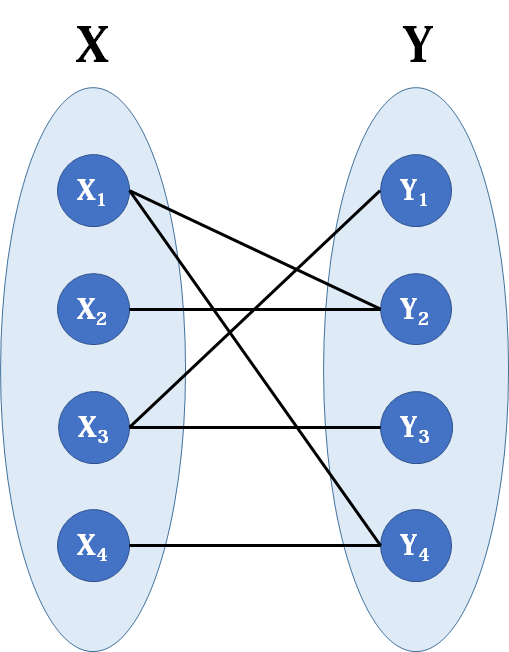

# 蒙特卡罗算法计算π

```c++
//蒙特卡罗算法计算π
double pi(int n)
{
    double sum=0;
    for(int i=0;i<n;i++)
    {
        double x=rand()*1.0/RAND_MAX;
        double y=rand()*1.0/RAND_MAX;
        if(x*x+y*y<=1)
            sum++;
    }
    return 4*sum/n;
}
```

# 查找

```c++
//顺序查找
int seq_search(int a[],int n,int key)
{
    for(int i=0;i<n;i++)
    {
        if(a[i]==key)
            return i;
    }
    return -1;
}
//返回当前时间
string getTime()
{
    time_t t;
    time(&t);
    string s=ctime(&t);
    return s;
}
//二分查找
int bin_search(int a[],int n,int key)
{
    int low=0,high=n-1,mid;
    while(low<=high)
    {
        mid=(low+high)/2;
        if(a[mid]==key)
            return mid;
        else if(a[mid]>key)
            high=mid-1;
        else
            low=mid+1;
    }
    return -1;
}
```

# 最大公约数最小公倍数

```c++
//最大公约数
int gcd(int a,int b)
{
    if(b==0)
        return a;
    return gcd(b,a%b);
}
//最小公倍数
int lcm(int a,int b)
{
    return a*b/gcd(a,b);
}
```

# 判断闰年

```c++
bool is_leap(int year)
{
    if(year%4==0&&year%100!=0||year%400==0)
        return true;
    return false;
}
```

# 多项式求值

```c++
//一维多项式求值P(x) = a0 + a1*x + a2*x^2 + ... + an*x^n;
double poly_eval(double a[],int n,double x)
{
    double sum=0;
    for(int i=0;i<n;i++)
    {
        sum+=a[i]*pow(x,i);
    }
    return sum;
}
//一维多项式求值方法2
/*
参考方法：
P(x) = (a(n)*x+a(n-1))*x+a(n-2)>>>...>>>a0
*/;
double poly_eval2(double a[],int n,double x)
{
    double sum;
    sum=a[n-1];
    for(int i=n-2;i>=0;i--){
        sum=sum*x+a[i];
    }
    return sum;
}
//二维多项式求值
double poly_eval(double* a,int m,int n,double x,double y)
{
    double sum=0;
    for(int i=0;i<m;i++)
    {
        for(int j=0;j<n;j++)
        {
            sum+=*(a+i*n+j)*pow(x,i)*pow(y,j);
        }
    }
    return sum;
}
```

## 多项式乘法


## 多项式除法

# 二维数组作为参数

```c++
//输出二维数组
//方法一，数组作为参数，第二维必须标明
void print_array1(int a[][3],int m,int n)
{
    for(int i=0;i<m;i++)
    {
        for(int j=0;j<n;j++)
        {
            cout<<a[i][j]<<" ";
        }
        cout<<endl;
    }
}
//方法二，一重指针，第二维需要标明，传数组的指针
//注意：parr[i]等价于*(parr+i)，一维数组和二维数组都适用
void print_array2(double (*a)[3],int m,int n)
{
    for(int i=0;i<m;i++)
    {
        for(int j=0;j<n;j++)
        {
            // cout<<*(*(a+i)+j)<<" "; 
            //可以采用parr[i][j]
            cout<<a[i][j]<<" ";
            // cout<<*(a[i]+j)<<" ";
        }
        cout<<endl;
    }
}
//方法三，传指针，不管几维都看做指针
void print_array(double *a,int m,int n)
{
    for(int i=0;i<m;i++)
    {
        for(int j=0;j<n;j++)
        {
            cout<<*(a+i*n+j)<<" ";
        }
        cout<<endl;
    }
}
```


# 大数的运算

[(加强版)大数加减乘除，一文彻底搞定 - 云+社区 - 腾讯云 (tencent.com)](https://cloud.tencent.com/developer/article/1818199)

## 相加

```c++
//大数加法，负数可参与
string add(string a,string b)
{
    string c;
    int carry=0;
    int i=a.size()-1,j=b.size()-1;
    while(i>=0||j>=0)
    {
        int sum=carry;
        if(i>=0)
            sum+=a[i--]-'0';
        if(j>=0)
            sum+=b[j--]-'0';
        c.push_back(sum%10+'0');
        carry=sum/10;
    }
    if(carry)
        c.push_back(carry+'0');
    reverse(c.begin(),c.end());
    return c;
}
```

## 相减

```c++
//大数减法可以计算负数
string sub(string a,string b)
{
    string c;
    int flag=0;
    if(!Compare(a,b)){
        swap(a,b);
        flag=1;
    }
    int carry=0;
    int i=a.size()-1,j=b.size()-1;
    while(i>=0||j>=0){
        int sum=carry;
        if(i>=0)
            sum+=a[i--]-'0';
        if(j>=0)
            sum-=b[j--]-'0';
        if(sum<0)
        {
            sum+=10;
            carry=-1;
        }
        else
            carry=0;
        c.push_back(sum+'0');
    }
    if(flag)
        {c+='-';}
    reverse(c.begin(),c.end());
    while(c.size()>1&&c[0]=='0')
        c.erase(c.begin());
    return c;
}
```


## 相除

不同于一般的模拟，除法操作步数模仿手工除法，而是利用减法操作实现的。

其基本思想是反复做除法，看从被除数里面最多能减去多少个除数，商就是多少。

逐个减显然太慢，要判断一次最多能减少多少个整的10的n次方。

以7546除23为例。

先减去23的100倍，就是2300，可以减3次，余下646。  此时商就是300；

然后646减去23的10倍，就是230，可以减2次，余下186。此时商就是320；

然后186减去23，可以减8次，此时商就是328.

判断字符串a>b

```c++
//判断两个字符串前者是否大于后者
bool Compare(string first,string second)
{
    int l1=first.size(),l2=second.size();
    if(l1>l2)
        return true;
    else if(l1<l2)
        return false;
    else
    {
        for(int i=0;i<l1;i++)
        {
            if(first[i]>second[i])
                return true;
            else if(first[i]<second[i])
                return false;
        }
        return true;
    }
}
```

两个大数相除

```c++
//大数除法
string div(string a,string b)
{
    string s;//余数
    string res;//商
    int count=0;
    if(b=="0")
        return "error";
    if(Compare(a,b))
    {
        while(Compare(a,b))
        {
            a=sub(a,b);
            count++;
        }
        res=to_string(count);
        s=a;
    }
    else
    {
        res="0";
        s=a;
    }
    return "商："+res+"余数"+s;
}
```


```c++
//大数除另外一个int型数
string div1(string a,int b)
{
    string c;
    int carry=0;
    int a_num[a.size()];
    for(int i=0;i<a.size();i++)
        a_num[i]=a[i]-'0';
    for(int i=0;i<a.size();i++)
    {
        int sum=carry*10+a_num[i];
        a_num[i]=sum/b;
        carry=sum%b;
    }
    for(int i=a.size()-1;i>=0;i--)
        c.push_back(a_num[i]+'0');
    size_t startpos = c.find_first_not_of("0");
    if (string::npos != startpos) {
        return c.substr(startpos);
    }
    return c;
}
```

## 相乘

```c++
string mul(string a,string b)
{
    string c(a.size()+b.size(),'0');
    for (int i = a.size() - 1; 0 <= i; --i) {
        int carry = 0;
        for (int j = b.size() - 1; 0 <= j; --j) {
            int tmp = (c[i + j + 1] - '0') + (a[i] - '0') * (b[j] - '0') + carry;
            c[i + j + 1] = tmp % 10 + '0';
            carry = tmp / 10;
        }
        c[i] += carry;
    }

    size_t startpos = c.find_first_not_of("0");
    if (string::npos != startpos) {
        return c.substr(startpos);
    }
    return "0";
}
```

# 匈牙利算法

主要解决二分图匹配问题



一类特殊图

算法主要解决最大匹配数和最小点覆盖数

[(4条消息) 匈牙利算法——最大匹配问题详解_denghe1122的博客-CSDN博客_最大匹配问题](https://blog.csdn.net/dengheCSDN/article/details/77619308)


# 位运算

```
交换律：a ^ b ^ c <=> a ^ c ^ b

任何数于0异或为任何数 0 ^ n => n

相同的数异或为0: n ^ n => 0
```

[136. 只出现一次的数字 - 力扣（LeetCode） (leetcode-cn.com)](https://leetcode-cn.com/problems/single-number/comments/)

