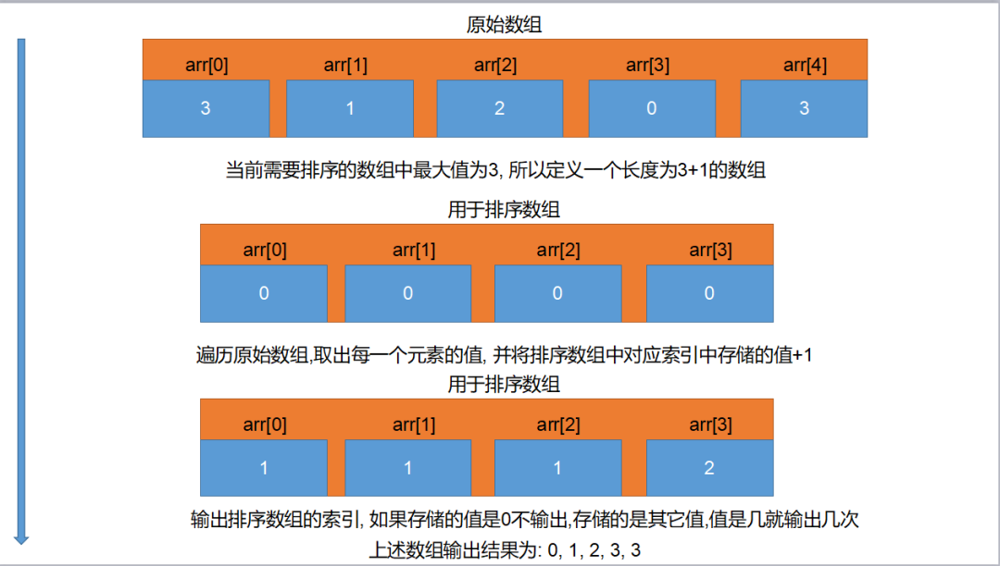

[1.0 十大经典排序算法 | 菜鸟教程 (runoob.com)](https://www.runoob.com/w3cnote/ten-sorting-algorithm.html)

# 计数排序

- 计数排序是一个非基于比较的排序算法，该算法于1954年由 Harold H. Seward 提出。它的优势在于在`对一定范围内的整数排序`时，快于任何比较排序算法。
- 排序思路:

- 1.找出待排序数组最大值
- 2.定义一个索引最大值为待排序数组最大值的数组
- 3.遍历待排序数组, 将待排序数组遍历到的值作新数组索引
- 4.在新数组对应索引存储值原有基础上+1



c语言实现：

```c
#include<stdio.h>
int main(){
    int a[]={5,0,0,4,2,6,1,9,2,7,8};
    //a的长度
    int len_a=sizeof(a)/sizeof(a[0]);
    int b[9]={0};
    for(int i=0;i<len_a;i++)
    {
        int t=a[i];
        b[t]+=1;
    }
    int len_b=sizeof(b)/sizeof(b[0]);
    for(int i=0;i<len_b;i++)
    for(int j=0;j<b[i];j++)
    if(b[i]!=0)printf("%d ",i);

```

c++实现：

```c++
#include<bits/stdc++.h>

using namespace std;
int main(){
    int a[]={1,6,8,6,7,4564,53,42};
    int len=sizeof(a)/sizeof(a[0]);
    int max=*max_element(a,a+len);
    int b[max+1]={0};
    for(int i=0;i<len;i++)
    {
        int t=a[i];
        b[t]+=1;
    }
    for(int i=0;i<max+1;i++)
    for(int j=0;j<b[i];j++)
    if(b[i]!=0)cout<<i<<" ";
}
```

# 选择排序

选择排序(Selection sort)是一种简单直观的排序算法。它的工作原理如下。首先在未排序序列中找到最小元素,存放到排序序列的起始位置,然后,再从剩余未排序元素中继续寻找最小元素,然后放到排序序列末尾。以此类推,直到所有元素均排序完毕。

- 排序思路:
- 假设按照升序排序
- 1.用第0个元素和后面所有元素依次比较
- 2.判断第0个元素是否大于当前被比较元素, 一旦小于就交换位置
- 3.第0个元素和后续所有元素比较完成后, 第0个元素就是最小值
- 4.排除第0个元素, 用第1个元素重复1~3操作, 比较完成后第1个元素就是倒数第二小的值
- 以此类推, 直到当前元素没有可比较的元素, 排序完成

```c++
#include<bits/stdc++.h>

using namespace std;
int main(){
    int a[]={1,31,5234,234,6345,63};
    int len=sizeof(a)/sizeof(a[0]);
    for(int i=0;i<len;i++)
    for(int j=i;j<len;j++)
    {
        int t;
        // if(a[i]>a[j]){t=a[i];a[i]=a[j];a[j]=t;}
        if(a[i]>a[j])swap(a[i],a[j]);
    }
    for(auto & s: a){
        cout<<s<<" ";
    }
}
```

# 冒泡排序

- 冒泡排序(Bubble Sort)是一种简单的排序算法。它重复 地走访过要排序的数列,一次比较两个元素,如果他们的顺序错误就把他们交换过来。走访数列的工作是重复地进行直到没有再需要交换,也就是说该数列已经排序完成。这个算法的名字由来是因为越小的元素会经由交换慢慢“浮”到数列的顶端。


- 假设按照升序排序
- 1.从第0个元素开始, 每次都用相邻两个元素进行比较
- 2.一旦发现后面一个元素小于前面一个元素就交换位置
- 3.经过一轮比较之后最后一个元素就是最大值
- 4.排除最后一个元素, 以此类推, 每次比较完成之后最大值都会出现再被比较所有元素的最后
- 直到当前元素没有可比较的元素, 排序完成

```c++
void bubbleSort(){
    int a[]={3,1,31,5234,234,6345,63};
    int len=sizeof(a)/sizeof(a[0]);
    for(int i=0;i<len;i++)
    {
    for(int j=0;j<len;j++)
    {
    if(a[i]<a[j])swap(a[j],a[i]);
    }
    }
    for(auto n=0;n<len;n++){ 
        cout<<a[n]<<" ";
    }
}
void bubbleSort_2(){
    int a[]={3,1,31,5234,234,6345,63};
    int len=sizeof(a)/sizeof(a[0]);
    for(int i=0;i<len;i++)
    {
    for(int j=0;j<len-i-1;j++)
    {
    if(a[j]<a[j+1])swap(a[j],a[j+1]);
    }
    }
    for(auto n=0;n<len;n++){ 
        cout<<a[n]<<" ";
    }
}
```

# 插入排序

插入排序（Insertion-Sort）的算法描述是一种简单直观的排序算法。它的工作原理是通过构建有序序列，对于未排序数据，在已排序序列中从后向前扫描，找到相应位置并插入。


- 排序思路:

- 假设按照升序排序
- 1.从索引为1的元素开始向前比较, 一旦前面一个元素大于自己就让前面的元素先后移动
- 2.直到没有可比较元素或者前面的元素小于自己的时候, 就将自己插入到当前空出来的位置

```c++
int main()
{
    // 待排序数组
    int nums[5] = {3, 1, 2, 0, 3};
    // 0.计算待排序数组长度
    int len = sizeof(nums) / sizeof(nums[0]);

    //  1.从第一个元素开始依次取出所有用于比较元素
    for (int i = 1; i < len; i++)
    {
        // 2.遍历取出前面元素进行比较
        for(int j = i; j > 0; j--)
        {
            // 3.如果前面一个元素大于当前元素,就交换位置
            if(nums[j-1] > nums[j]){
                int temp = nums[j];
                nums[j] = nums[j - 1];
                nums[j - 1] = temp;
            }else{
                break;
            }
        }
    }
}
```

# 希尔排序

- 排序思路:

- 1.希尔排序可以理解为插入排序的升级版, 先将待排序数组按照指定步长划分为几个小数组
- 2.利用插入排序对小数组进行排序, 然后将几个排序的小数组重新合并为原始数组
- 3.重复上述操作, 直到步长为1时,再利用插入排序排序即可

- 代码实现:

```c++
int main(){    // 待排序数组    
    int nums[5] = {3, 1, 2, 0, 3};    // 0.计算待排序数组长度    
    int len = sizeof(nums) / sizeof(nums[0]);// 2.计算步长    
    int gap = len / 2;    
    do{        //  1.从第一个元素开始依次取出所有用于比较元素        
        for (int i = gap; i < len; i++)        
        {            // 2.遍历取出前面元素进行比较            
            int j = i;            
            while((j - gap) >= 0)            
            {                
                printf("%i > %i\n", nums[j - gap], nums[j]);                // 3.如果前面一个元素大于当前元素,就交换位置                
                if(nums[j - gap] > nums[j]){                    
                    int temp = nums[j];                    
                    nums[j] = nums[j - gap];                    
                    nums[j - gap] = temp;                
                }else{                    
                    break;                
                }                
                j--;            
            }        
        }        // 每个小数组排序完成, 重新计算步长        
        gap = gap / 2;    
    }while(gap >= 1);}
```

# 归并排序

算法步骤

1. 申请空间，使其大小为两个已经排序序列之和，该空间用来存放合并后的序列；
2. 设定两个指针，最初位置分别为两个已经排序序列的起始位置；
3. 比较两个指针所指向的元素，选择相对小的元素放入到合并空间，并移动指针到下一位置；
4. 重复步骤 3 直到某一指针达到序列尾；
5. 将另一序列剩下的所有元素直接复制到合并序列尾。


c语言

```c
int min(int x, int y) {
    return x < y ? x : y;
}
void merge_sort(int arr[], int len) {
    int *a = arr;
    int *b = (int *) malloc(len * sizeof(int));
    int seg, start;
    for (seg = 1; seg < len; seg += seg) {
        for (start = 0; start < len; start += seg * 2) {
            int low = start, mid = min(start + seg, len), high = min(start + seg * 2, len);
            int k = low;
            int start1 = low, end1 = mid;
            int start2 = mid, end2 = high;
            while (start1 < end1 && start2 < end2)
                b[k++] = a[start1] < a[start2] ? a[start1++] : a[start2++];
            while (start1 < end1)
                b[k++] = a[start1++];
            while (start2 < end2)
                b[k++] = a[start2++];
        }
        int *temp = a;
        a = b;
        b = temp;
    }
    if (a != arr) {
        int i;
        for (i = 0; i < len; i++)
            b[i] = a[i];
        b = a;
    }
    free(b);
}
```


c++迭代的方式：

```c++
template<typename T> // 整數或浮點數皆可使用,若要使用物件(class)時必須設定"小於"(<)的運算子功能
void merge_sort(T arr[], int len) {
    T *a = arr;
    T *b = new T[len];
    for (int seg = 1; seg < len; seg += seg) {
        for (int start = 0; start < len; start += seg + seg) {
            int low = start, mid = min(start + seg, len), high = min(start + seg + seg, len);
            int k = low;
            int start1 = low, end1 = mid;
            int start2 = mid, end2 = high;
            while (start1 < end1 && start2 < end2)
                b[k++] = a[start1] < a[start2] ? a[start1++] : a[start2++];
            while (start1 < end1)
                b[k++] = a[start1++];
            while (start2 < end2)
                b[k++] = a[start2++];
        }
        T *temp = a;
        a = b;
        b = temp;
    }
    if (a != arr) {
        for (int i = 0; i < len; i++)
            b[i] = a[i];
        b = a;
    }
    delete[] b;
}
```

递归的方式：

```c++
void Merge(vector<int> &Array, int front, int mid, int end) {
    // preconditions:
    // Array[front...mid] is sorted
    // Array[mid+1 ... end] is sorted
    // Copy Array[front ... mid] to LeftSubArray
    // Copy Array[mid+1 ... end] to RightSubArray
    vector<int> LeftSubArray(Array.begin() + front, Array.begin() + mid + 1);
    vector<int> RightSubArray(Array.begin() + mid + 1, Array.begin() + end + 1);
    int idxLeft = 0, idxRight = 0;
    LeftSubArray.insert(LeftSubArray.end(), numeric_limits<int>::max());
    RightSubArray.insert(RightSubArray.end(), numeric_limits<int>::max());
    // Pick min of LeftSubArray[idxLeft] and RightSubArray[idxRight], and put into Array[i]
    for (int i = front; i <= end; i++) {
        if (LeftSubArray[idxLeft] < RightSubArray[idxRight]) {
            Array[i] = LeftSubArray[idxLeft];
            idxLeft++;
        } else {
            Array[i] = RightSubArray[idxRight];
            idxRight++;
        }
    }
}

void MergeSort(vector<int> &Array, int front, int end) {
    if (front >= end)
        return;
    int mid = (front + end) / 2;
    MergeSort(Array, front, mid);
    MergeSort(Array, mid + 1, end);
    Merge(Array, front, mid, end);
}
```

# 快速排序

算法步骤

1. 从数列中挑出一个元素，称为 "基准"（pivot）;
2. 重新排序数列，所有元素比基准值小的摆放在基准前面，所有元素比基准值大的摆在基准的后面（相同的数可以到任一边）。在这个分区退出之后，该基准就处于数列的中间位置。这个称为分区（partition）操作；
3. 递归地（recursive）把小于基准值元素的子数列和大于基准值元素的子数列排序；


```c++
 Paritition1(int A[], int low, int high) {
   int pivot = A[low];
   while (low < high) {
     while (low < high && A[high] >= pivot) {
       --high;
     }
     A[low] = A[high];
     while (low < high && A[low] <= pivot) {
       ++low;
     }
     A[high] = A[low];
   }
   A[low] = pivot;
   return low;
 }

 void QuickSort(int A[], int low, int high) //快排母函数
 {
   if (low < high) {
     int pivot = Paritition1(A, low, high);
     QuickSort(A, low, pivot - 1);
     QuickSort(A, pivot + 1, high);
   }
 }
```

c语言

```c
typedef struct _Range {
    int start, end;
} Range;

Range new_Range(int s, int e) {
    Range r;
    r.start = s;
    r.end = e;
    return r;
}

void swap(int *x, int *y) {
    int t = *x;
    *x = *y;
    *y = t;
}

void quick_sort(int arr[], const int len) {
    if (len <= 0)
        return; // 避免len等於負值時引發段錯誤（Segment Fault）
    // r[]模擬列表,p為數量,r[p++]為push,r[--p]為pop且取得元素
    Range r[len];
    int p = 0;
    r[p++] = new_Range(0, len - 1);
    while (p) {
        Range range = r[--p];
        if (range.start >= range.end)
            continue;
        int mid = arr[(range.start + range.end) / 2]; // 選取中間點為基準點
        int left = range.start, right = range.end;
        do {
            while (arr[left] < mid) ++left;   // 檢測基準點左側是否符合要求
            while (arr[right] > mid) --right; //檢測基準點右側是否符合要求
            if (left <= right) {
                swap(&arr[left], &arr[right]);
                left++;
                right--;               // 移動指針以繼續
            }
        } while (left <= right);
        if (range.start < right) r[p++] = new_Range(range.start, right);
        if (range.end > left) r[p++] = new_Range(left, range.end);
    }
}
```

递归

```c++
void swap(int *x, int *y) {
    int t = *x;
    *x = *y;
    *y = t;
}

void quick_sort_recursive(int arr[], int start, int end) {
    if (start >= end)
        return;
    int mid = arr[end];
    int left = start, right = end - 1;
    while (left < right) {
        while (arr[left] < mid && left < right)
            left++;
        while (arr[right] >= mid && left < right)
            right--;
        swap(&arr[left], &arr[right]);
    }
    if (arr[left] >= arr[end])
        swap(&arr[left], &arr[end]);
    else
        left++;
    if (left)
        quick_sort_recursive(arr, start, left - 1);
    quick_sort_recursive(arr, left + 1, end);
}

void quick_sort(int arr[], int len) {
    quick_sort_recursive(arr, 0, len - 1);
}
```

```python
def quickSort(arr, left=None, right=None):
    left = 0 if not isinstance(left,(int, float)) else left
    right = len(arr)-1 if not isinstance(right,(int, float)) else right
    if left < right:
        partitionIndex = partition(arr, left, right)
        quickSort(arr, left, partitionIndex-1)
        quickSort(arr, partitionIndex+1, right)
    return arr

def partition(arr, left, right):
    pivot = left
    index = pivot+1
    i = index
    while  i <= right:
        if arr[i] < arr[pivot]:
            swap(arr, i, index)
            index+=1
        i+=1
    swap(arr,pivot,index-1)
    return index-1

def swap(arr, i, j):
    arr[i], arr[j] = arr[j], arr[i]
```


```c++
#include <iostream>
#include <stack>
using namespace std;

// 交换两个元素
void swap(int* a, int* b) {
    int t = *a;
    *a = *b;
    *b = t;
}
// 将数组划分为两部分，小于基准元素和大于基准元素
int partition(int arr[], int low, int high) {
    int pivot = arr[high];  // 选择最后一个元素作为基准元素
    int i = (low - 1);  // 定义小于基准元素的指针

    for (int j = low; j <= high - 1; j++) {
        if (arr[j] < pivot) {
            i++;
            swap(&arr[i], &arr[j]);
        }
    }
    swap(&arr[i + 1], &arr[high]);
    return (i + 1);
}
// 非递归实现的快速排序
void quickSort(int arr[], int low, int high) {
    stack<pair<int, int>> st;  // 使用栈来模拟递归调用过程
    st.push(make_pair(low, high));
    while (!st.empty()) {
        low = st.top().first;
        high = st.top().second;
        st.pop();

        int pi = partition(arr, low, high);

        if (pi - 1 > low) {
            st.push(make_pair(low, pi - 1));
        }

        if (pi + 1 < high) {
            st.push(make_pair(pi + 1, high));
        }
    }
}
// 打印数组
void printArray(int arr[], int size) {
    for (int i = 0; i < size; i++) {
        cout << arr[i] << " ";
    }
    cout << endl;
}
int main() {
    int arr[] = {10, 7, 8, 9, 1, 5};
    int n = sizeof(arr) / sizeof(arr[0]);
    cout << "原始数组: ";
    printArray(arr, n);
    quickSort(arr, 0, n - 1);
    cout << "排序后的数组: ";
    printArray(arr, n);
    return 0;
}
```


# 堆排序

1. 大顶堆：每个节点的值都大于或等于其子节点的值，在堆排序算法中用于升序排列；
2. 小顶堆：每个节点的值都小于或等于其子节点的值，在堆排序算法中用于降序排列；

算法步骤

1. 创建一个堆 H[0……n-1]；
2. 把堆首（最大值）和堆尾互换；
3. 把堆的尺寸缩小 1，并调用 shift_down(0)，目的是把新的数组顶端数据调整到相应位置；
4. 重复步骤 2，直到堆的尺寸为 1


```c
#include <stdio.h>
#include <stdlib.h>

void swap(int *a, int *b) {
    int temp = *b;
    *b = *a;
    *a = temp;
}

void max_heapify(int arr[], int start, int end) {
    // 建立父節點指標和子節點指標
    int dad = start;
    int son = dad * 2 + 1;
    while (son <= end) { // 若子節點指標在範圍內才做比較
        if (son + 1 <= end && arr[son] < arr[son + 1]) // 先比較兩個子節點大小，選擇最大的
            son++;
        if (arr[dad] > arr[son]) //如果父節點大於子節點代表調整完畢，直接跳出函數
            return;
        else { // 否則交換父子內容再繼續子節點和孫節點比較
            swap(&arr[dad], &arr[son]);
            dad = son;
            son = dad * 2 + 1;
        }
    }
}

void heap_sort(int arr[], int len) {
    int i;
    // 初始化，i從最後一個父節點開始調整
    for (i = len / 2 - 1; i >= 0; i--)
        max_heapify(arr, i, len - 1);
    // 先將第一個元素和已排好元素前一位做交換，再重新調整，直到排序完畢
    for (i = len - 1; i > 0; i--) {
        swap(&arr[0], &arr[i]);
        max_heapify(arr, 0, i - 1);
    }
}

int main() {
    int arr[] = { 3, 5, 3, 0, 8, 6, 1, 5, 8, 6, 2, 4, 9, 4, 7, 0, 1, 8, 9, 7, 3, 1, 2, 5, 9, 7, 4, 0, 2, 6 };
    int len = (int) sizeof(arr) / sizeof(*arr);
    heap_sort(arr, len);
    int i;
    for (i = 0; i < len; i++)
        printf("%d ", arr[i]);
    printf("\n");
    return 0;
}
```

c++

```c++
#include <iostream>
#include <algorithm>
using namespace std;

void max_heapify(int arr[], int start, int end) {
    // 建立父節點指標和子節點指標
    int dad = start;
    int son = dad * 2 + 1;
    while (son <= end) { // 若子節點指標在範圍內才做比較
        if (son + 1 <= end && arr[son] < arr[son + 1]) // 先比較兩個子節點大小，選擇最大的
            son++;
        if (arr[dad] > arr[son]) // 如果父節點大於子節點代表調整完畢，直接跳出函數
            return;
        else { // 否則交換父子內容再繼續子節點和孫節點比較
            swap(arr[dad], arr[son]);
            dad = son;
            son = dad * 2 + 1;
        }
    }
}

void heap_sort(int arr[], int len) {
    // 初始化，i從最後一個父節點開始調整
    for (int i = len / 2 - 1; i >= 0; i--)
        max_heapify(arr, i, len - 1);
    // 先將第一個元素和已经排好的元素前一位做交換，再從新調整(刚调整的元素之前的元素)，直到排序完畢
    for (int i = len - 1; i > 0; i--) {
        swap(arr[0], arr[i]);
        max_heapify(arr, 0, i - 1);
    }
}

int main() {
    int arr[] = { 3, 5, 3, 0, 8, 6, 1, 5, 8, 6, 2, 4, 9, 4, 7, 0, 1, 8, 9, 7, 3, 1, 2, 5, 9, 7, 4, 0, 2, 6 };
    int len = (int) sizeof(arr) / sizeof(*arr);
    heap_sort(arr, len);
    for (int i = 0; i < len; i++)
        cout << arr[i] << ' ';
    cout << endl;
    return 0;
}
```

python

```python
def buildMaxHeap(arr):
    import math
    for i in range(math.floor(len(arr)/2),-1,-1):
        heapify(arr,i)

def heapify(arr, i):
    left = 2*i+1
    right = 2*i+2
    largest = i
    if left < arrLen and arr[left] > arr[largest]:
        largest = left
    if right < arrLen and arr[right] > arr[largest]:
        largest = right

    if largest != i:
        swap(arr, i, largest)
        heapify(arr, largest)

def swap(arr, i, j):
    arr[i], arr[j] = arr[j], arr[i]

def heapSort(arr):
    global arrLen
    arrLen = len(arr)
    buildMaxHeap(arr)
    for i in range(len(arr)-1,0,-1):
        swap(arr,0,i)
        arrLen -=1
        heapify(arr, 0)
    return arr
```

# 桶排序

桶排序是计数排序的升级版。它利用了函数的映射关系，高效与否的关键就在于这个映射函数的确定。为了使桶排序更加高效，我们需要做到这两点：

1. 在额外空间充足的情况下，尽量增大桶的数量
2. 使用的映射函数能够将输入的 N 个数据均匀的分配到 K 个桶中

同时，对于桶中元素的排序，选择何种比较排序算法对于性能的影响至关重要。

1. 什么时候最快

当输入的数据可以均匀的分配到每一个桶中。

2. 什么时候最慢

当输入的数据被分配到了同一个桶中。

3. 示意图

元素分布在桶中：


然后，元素在每个桶中排序：


```c++
#include<iterator>
#include<iostream>
#include<vector>
using namespace std;
const int BUCKET_NUM = 10;

struct ListNode{
        explicit ListNode(int i=0):mData(i),mNext(NULL){}
        ListNode* mNext;
        int mData;
};

ListNode* insert(ListNode* head,int val){
        ListNode dummyNode;
        ListNode *newNode = new ListNode(val);
        ListNode *pre,*curr;
        dummyNode.mNext = head;
        pre = &dummyNode;
        curr = head;
        while(NULL!=curr && curr->mData<=val){
                pre = curr;
                curr = curr->mNext;
        }
        newNode->mNext = curr;
        pre->mNext = newNode;
        return dummyNode.mNext;
}


ListNode* Merge(ListNode *head1,ListNode *head2){
        ListNode dummyNode;
        ListNode *dummy = &dummyNode;
        while(NULL!=head1 && NULL!=head2){
                if(head1->mData <= head2->mData){
                        dummy->mNext = head1;
                        head1 = head1->mNext;
                }else{
                        dummy->mNext = head2;
                        head2 = head2->mNext;
                }
                dummy = dummy->mNext;
        }
        if(NULL!=head1) dummy->mNext = head1;
        if(NULL!=head2) dummy->mNext = head2;
       
        return dummyNode.mNext;
}

void BucketSort(int n,int arr[]){
        vector<ListNode*> buckets(BUCKET_NUM,(ListNode*)(0));
        for(int i=0;i<n;++i){
                int index = arr[i]/BUCKET_NUM;
                ListNode *head = buckets.at(index);
                buckets.at(index) = insert(head,arr[i]);
        }
        ListNode *head = buckets.at(0);
        for(int i=1;i<BUCKET_NUM;++i){
                head = Merge(head,buckets.at(i));
        }
        for(int i=0;i<n;++i){
                arr[i] = head->mData;
                head = head->mNext;
        }
}
```

# 基数排序


```c++
int maxbit(int data[], int n) //辅助函数，求数据的最大位数
{
    int maxData = data[0];              ///< 最大数
    /// 先求出最大数，再求其位数，这样有原先依次每个数判断其位数，稍微优化点。
    for (int i = 1; i < n; ++i)
    {
        if (maxData < data[i])
            maxData = data[i];
    }
    int d = 1;
    int p = 10;
    while (maxData >= p)
    {
        //p *= 10; // Maybe overflow
        maxData /= 10;
        ++d;
    }
    return d;
/*    int d = 1; //保存最大的位数
    int p = 10;
    for(int i = 0; i < n; ++i)
    {
        while(data[i] >= p)
        {
            p *= 10;
            ++d;
        }
    }
    return d;*/
}
void radixsort(int data[], int n) //基数排序
{
    int d = maxbit(data, n);
    int *tmp = new int[n];
    int *count = new int[10]; //计数器
    int i, j, k;
    int radix = 1;
    for(i = 1; i <= d; i++) //进行d次排序
    {
        for(j = 0; j < 10; j++)
            count[j] = 0; //每次分配前清空计数器
        for(j = 0; j < n; j++)
        {
            k = (data[j] / radix) % 10; //统计每个桶中的记录数
            count[k]++;
        }
        for(j = 1; j < 10; j++)
            count[j] = count[j - 1] + count[j]; //将tmp中的位置依次分配给每个桶
        for(j = n - 1; j >= 0; j--) //将所有桶中记录依次收集到tmp中
        {
            k = (data[j] / radix) % 10;
            tmp[count[k] - 1] = data[j];
            count[k]--;
        }
        for(j = 0; j < n; j++) //将临时数组的内容复制到data中
            data[j] = tmp[j];
        radix = radix * 10;
    }
    delete []tmp;
    delete []count;
}
```

