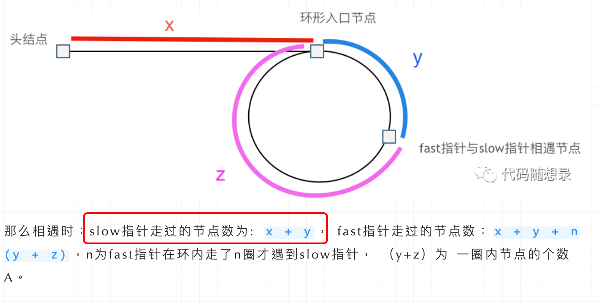
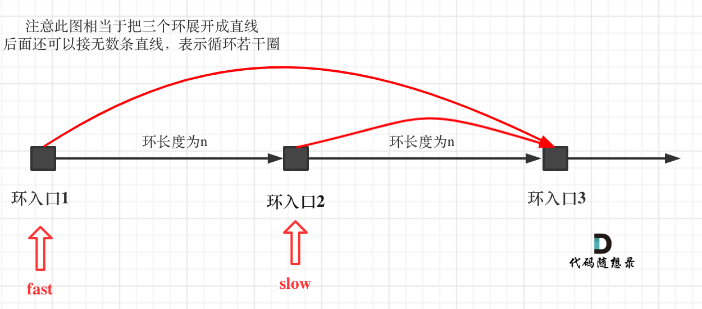
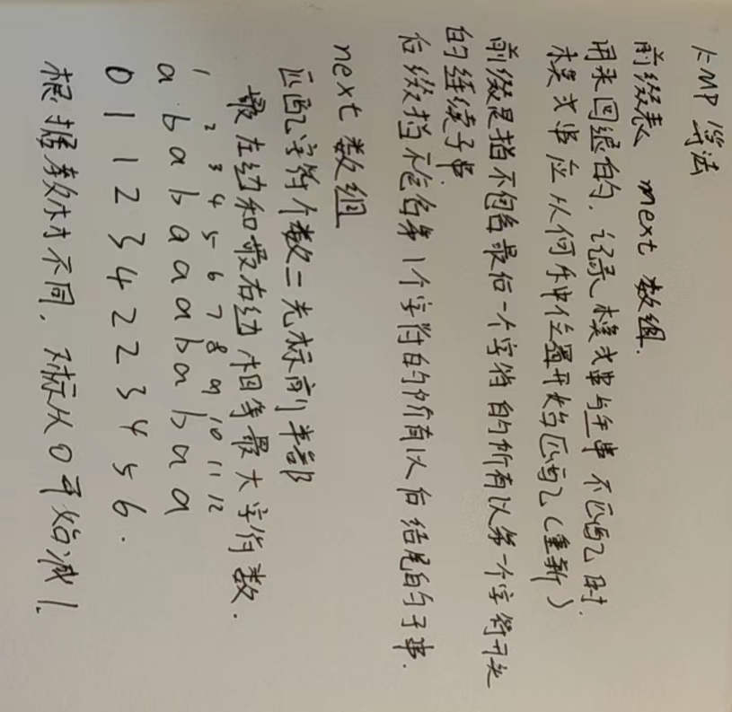

# 链表

```c++
//单链表
struct ListNode{
    int val;//存储元素
    ListNode *next;
    ListNode(int x):val(x),next(NULL){}//节点构造函数
}
```


## 链表的反转

[206. 反转链表 - 力扣（LeetCode） (leetcode-cn.com)](https://leetcode-cn.com/problems/reverse-linked-list/)

解法一，三指针的循环颠倒

```c++
ListNode* reverseList(ListNode* head) {
        ListNode* t=head;//当前节点
        //上一个节点
        ListNode* p;
        p=nullptr;
        while(t!=NULL){
            auto n=t->next;//记录下一个节点
            t->next=p;
            p=t;
            t=n;
        }
        return p;
    }
```

解法二，使用栈

```c++
ListNode* reverseList(ListNode* head) {
        ListNode* t=head;//当前节点
        //记录下一个节点
        stack<int> temp;
        while(t){
            temp.push(t->val);
            t=t->next;
        }
        t=head; 
        while(t){
            t->val=temp.top();
            temp.pop();
            t=t->next;
        }
        return head;
    }
```

解法三，使用头插法来反转

思想把每个结点都放在头结点的后面就实现了反转

```c++
//不带头结点
ListNode* reverseList(ListNode* head) {
        if(!head)return head;
        auto t=head->next;
        ListNode* p=NULL;
        head->next=NULL;
        while(t)
        {
            p=t;
            t=t->next;
            p->next=head;
            head=p;
        }
        return head;
    }
```

4

递归递归法相对抽象一些，但是其实和双指针法是一样的逻辑，同样是当cur为空的时候循环结束，不断将cur指向pre的过程。

关键是初始化的地方，可能有的同学会不理解， 可以看到双指针法中初始化 cur = head，pre = NULL，在递归法中可以从如下代码看出初始化的逻辑也是一样的，只不过写法变了。

```c++
class Solution {
public:
    ListNode* reverseList(ListNode* head) {
        // 边缘条件判断
        if(head == NULL) return NULL;
        if (head->next == NULL) return head;
        
        // 递归调用，翻转第二个节点开始往后的链表
        ListNode *last = reverseList(head->next);
        // 翻转头节点与第二个节点的指向
        head->next->next = head;
        // 此时的 head 节点为尾节点，next 需要指向 NULL
        head->next = NULL;
        return last;
    }
}; 
```


## 移除链表元素

[203. 移除链表元素 - 力扣（LeetCode） (leetcode-cn.com)](https://leetcode-cn.com/problems/remove-linked-list-elements/)

```c++
ListNode* removeElements(ListNode* head, int val) {
        ListNode* p=head;
    //当移除节点是头结点时
        while (head!=NULL&&head->val==val)
        {
            head=head->next;
        }
    //非头结点时
        while(p!=NULL&&p->next!=NULL)
        {
            if(p->next->val==val)
            {
                ListNode* t=p->next;
                p->next=t->next;
                delete t;
            }
            else
            {
                p=p->next;
            }
        }
        return head;
    }
```

## 设计链表的实现

[707. 设计链表 - 力扣（LeetCode） (leetcode-cn.com)](https://leetcode-cn.com/problems/design-linked-list/)

```c++
class MyLinkedList {
public:
    /** Initialize your data structure here. */
    struct ListNode{
        int val;
        ListNode* next;
        ListNode(int x):val(x),next(NULL){}
    };
    MyLinkedList() {
        //虚拟头结点
        _dummyHead=new ListNode(0);
        _size=0;
    }
    //获取链表中第 index 个节点的值。如果索引无效，则返回-1。
    int get(int index) {
        if(index<0||index>=_size)
        {
            return -1;
        }
        ListNode* p=_dummyHead->next;
        while (index--)
        {
            p=p->next;
        }
        return p->val;
    }
    //在链表的第一个元素之前添加一个值为 val 的节点。插入后，新节点将成为链表的第一个节点
    void addAtHead(int val) {
        ListNode* p=new ListNode(val);
        p->next=_dummyHead->next;
        _dummyHead->next=p;
        _size++;
    }
    //将值为 val 的节点追加到链表的最后一个元素。
    void addAtTail(int val) {
        ListNode* p=new ListNode(val);
        ListNode* q=_dummyHead;
        while(q->next!=NULL&&q!=NULL)
        {
            q=q->next;
        }
        q->next=p;
        _size++;
    }
    //在链表中的第 index 个节点之前添加值为 val  的节点。如果 index 等于链表的长度，则该节点将附加到链表的末尾。如果 index 大于链表长度，则不会插入节点。如果index小于0，则在头部插入节点。
    void addAtIndex(int index, int val) {
        if(index>_size)
        {
            return;
        }
        if(index<0;)
            addAtHead(val);
        ListNode* p=new ListNode(val);
        ListNode* q=_dummyHead;
        for(int i=0;i<index;i++)
        {
            q=q->next;
        }
        p->next=q->next;
        q->next=p;
        _size++;
    }
    //如果索引 index 有效，则删除链表中的第 index 个节点。
    void deleteAtIndex(int index) {
        if(index<0||index>=_size)
        {
            return;
        }
        ListNode* p=_dummyHead;
        for(int i=0;i<index;i++)
        {
            p=p->next;
        }
        p->next=p->next->next;
        _size--;
    }
    private:
    int _size;
    ListNode* _dummyHead;
};
```


## 交换链表相邻的元素


加入虚拟头结点方便操作

```c++
class Solution {
public:
    ListNode* swapPairs(ListNode* head) {
        
        auto dp=new ListNode(0);
        dp->next=head;
        ListNode* p=dp;
        while(p->next!=NULL&&p->next->next!=NULL)
        {
            auto t1=p->next;
            auto t2=p->next->next;
            p->next=t2;
            t1->next=t2->next;
            t2->next=t1;
            p=p->next->next;

        }
        return dp->next;
    }
};
```


## 删除链表倒数第N个节点

[19. 删除链表的倒数第 N 个结点 - 力扣（LeetCode） (leetcode-cn.com)](https://leetcode-cn.com/problems/remove-nth-node-from-end-of-list/)

```c++
ListNode* removeNthFromEnd(ListNode* head, int n) {
        auto dp=new ListNode(0);
        dp->next=head;
        auto fast=dp;
        auto slow=dp;
        for(int i=0;i<n;i++)
        {
            fast=fast->next;
        }
        while(fast->next!=NULL)
        {
            fast=fast->next;
            slow=slow->next;
        }
        slow->next=slow->next->next;
        return dp->next;
    }
};
```


## 求相交节点

[面试题 02.07. 链表相交 - 力扣（LeetCode） (leetcode-cn.com)](https://leetcode-cn.com/problems/intersection-of-two-linked-lists-lcci/)

```c++
class Solution {
public:
    ListNode *getIntersectionNode(ListNode *headA, ListNode *headB) {
        auto pa=headA;
        auto pb=headB;
        int lena=0,lenb=0;
        while(pa!=NULL)
        {
            lena++;
            pa=pa->next;
        }
        while(pb!=NULL)
        {
            lenb++;
            pb=pb->next;
        }
        pa=headA;
        pb=headB;
        if(lena>lenb)
        {
            int g=lena-lenb;
            while(g--){
                pa=pa->next;
            }
        }
        else
        {
            int g=lenb-lena;
            while(g--)
            {
                pb=pb->next;
            }
        }
        while(pa&&pb){
            if(pa==pb)
            {
                return pa;
            }
            else{
                pa=pa->next;
                pb=pb->next;
            }
        }
        return NULL;
    }
};
```

## 环形链表

[142. 环形链表 II - 力扣（LeetCode） (leetcode-cn.com)](https://leetcode-cn.com/problems/linked-list-cycle-ii/)

方法一，用集合来做

```c++
class Solution {
public:
    ListNode *detectCycle(ListNode *head) {
        unordered_set<ListNode*> v;
        while(head){
            if(find(v.begin(),v.end(),head)!=v.end())
                return head;
            v.insert(head);
            head = head->next;
        }
        return NULL;
    }
};
```

方法二快慢指针

分别定义 fast 和 slow 指针，从头结点出发，fast指针每次移动两个节点，slow指针每次移动一个节点，如果 fast 和 slow指针在途中相遇 ，说明这个链表有环。

为什么fast 走两个节点，slow走一个节点，有环的话，一定会在环内相遇呢，而不是永远的错开呢

首先第一点：**fast指针一定先进入环中，如果fast指针和slow指针相遇的话，一定是在环中相遇，这是毋庸置疑的。**

那么来看一下，**为什么fast指针和slow指针一定会相遇呢？**

可以画一个环，然后让 fast指针在任意一个节点开始追赶slow指针。

会发现最终都是这种情况， 如下图：


ast和slow各自再走一步， fast和slow就相遇了

这是因为fast是走两步，slow是走一步，**其实相对于slow来说，fast是一个节点一个节点的靠近slow的**，所以fast一定可以和slow重合。

动画如下：


### 如果有环，如何找到这个环的入口

**此时已经可以判断链表是否有环了，那么接下来要找这个环的入口了。**

假设从头结点到环形入口节点 的节点数为x。 环形入口节点到 fast指针与slow指针相遇节点 节点数为y。 从相遇节点 再到环形入口节点节点数为 z。 如图所示：


那么相遇时： slow指针走过的节点数为: `x + y`， fast指针走过的节点数：`x + y + n (y + z)`，n为fast指针在环内走了n圈才遇到slow指针， （y+z）为 一圈内节点的个数A。

因为fast指针是一步走两个节点，slow指针一步走一个节点， 所以 fast指针走过的节点数 = slow指针走过的节点数 * 2：

```
(x + y) * 2 = x + y + n (y + z)
```

两边消掉一个（x+y）: `x + y = n (y + z)`

因为要找环形的入口，那么要求的是x，因为x表示 头结点到 环形入口节点的的距离。

所以要求x ，将x单独放在左面：`x = n (y + z) - y` ,

再从n(y+z)中提出一个 （y+z）来，整理公式之后为如下公式：`x = (n - 1) (y + z) + z` 注意这里n一定是大于等于1的，因为 fast指针至少要多走一圈才能相遇slow指针。

这个公式说明什么呢？

先拿n为1的情况来举例，意味着fast指针在环形里转了一圈之后，就遇到了 slow指针了。

当 n为1的时候，公式就化解为 `x = z`，

这就意味着，**从头结点出发一个指针，从相遇节点 也出发一个指针，这两个指针每次只走一个节点， 那么当这两个指针相遇的时候就是 环形入口的节点**。

也就是在相遇节点处，定义一个指针index1，在头结点处定一个指针index2。

让index1和index2同时移动，每次移动一个节点， 那么他们相遇的地方就是 环形入口的节点。

动画如下：


那么 n如果大于1是什么情况呢，就是fast指针在环形转n圈之后才遇到 slow指针。

其实这种情况和n为1的时候 效果是一样的，一样可以通过这个方法找到 环形的入口节点，只不过，index1 指针在环里 多转了(n-1)圈，然后再遇到index2，相遇点依然是环形的入口节点。

```c++
ListNode *detectCycle(ListNode *head) {
        auto f=head,s=head;
        while(f&&f->next)
        {
            f=f->next->next;
            s=s->next;
            if(f==s)
            {
                auto t1=f;
                auto t2=head;
                while(!(t1==t2)){
                    t1=t1->next;
                    t2=t2->next;
                }
                return t1;
            }
        }
        return NULL;
    }
```

**为什么第一次在环中相遇，slow的 步数 是 x+y 而不是 x + 若干环的长度 + y 呢？**

即文章[链表：环找到了，那入口呢？ (opens new window)](https://programmercarl.com/0142.环形链表II.html)中如下的地方：



首先slow进环的时候，fast一定是先进环来了。

如果slow进环入口，fast也在环入口，那么把这个环展开成直线，就是如下图的样子：



可以看出如果slow 和 fast同时在环入口开始走，一定会在环入口3相遇，slow走了一圈，fast走了两圈。

重点来了，slow进环的时候，fast一定是在环的任意一个位置，如图：


那么fast指针走到环入口3的时候，已经走了k + n 个节点，slow相应的应该走了(k + n) / 2 个节点。

因为k是小于n的（图中可以看出），所以(k + n) / 2 一定小于n。

**也就是说slow一定没有走到环入口3，而fast已经到环入口3了**。

这说明什么呢？

**在slow开始走的那一环已经和fast相遇了**。

那有同学又说了，为什么fast不能跳过去呢？ 在刚刚已经说过一次了，**fast相对于slow是一次移动一个节点，所以不可能跳过去**。

好了，这次把为什么第一次在环中相遇，slow的 步数 是 x+y 而不是 x + 若干环的长度 + y ，用数学推理了一下，算是对[链表：环找到了，那入口呢？ (opens new window)](https://programmercarl.com/0142.环形链表II.html)的补充

# 哈希表

## 哈希函数

## 碰撞检测

## 常见的三种哈希结构

当我们想使用哈希法来解决问题的时候，我们一般会选择如下三种数据结构。

- 数组
- set （集合）
- map(映射)

这里数组就没啥可说的了，我们来看一下set。

在C++中，set 和 map 分别提供以下三种数据结构，其底层实现以及优劣如下表所示：

| 集合               | 底层实现 | 是否有序 | 数值是否可以重复 | 能否更改数值 | 查询效率    | 增删效率    |
| ------------------ | -------- | -------- | ---------------- | ------------ | ----------- | ----------- |
| std::set           | 红黑树   | 有序     | 否               | 否           | $O(\log n)$ | $O(\log n)$ |
| std::multiset      | 红黑树   | 有序     | 是               | 否           | $O(\log n)$ | $O(\log n)$ |
| std::unordered_set | 哈希表   | 无序     | 否               | 否           | $O(1)$      | $O(1)$      |

std::unordered_set底层实现为哈希表，std::set 和std::multiset 的底层实现是红黑树，红黑树是一种平衡二叉搜索树，所以key值是有序的，但key不可以修改，改动key值会导致整棵树的错乱，所以只能删除和增加。

| 映射               | 底层实现 | 是否有序 | 数值是否可以重复 | 能否更改数值 | 查询效率    | 增删效率    |
| ------------------ | -------- | -------- | ---------------- | ------------ | ----------- | ----------- |
| std::map           | 红黑树   | key有序  | key不可重复      | key不可修改  | $O(\log n)$ | $O(\log n)$ |
| std::multimap      | 红黑树   | key有序  | key可重复        | key不可修改  | $O(\log n)$ | $O(\log n)$ |
| std::unordered_map | 哈希表   | key无序  | key不可重复      | key不可修改  | $O(1)$      | $O(1)$      |

std::unordered_map 底层实现为哈希表，std::map 和std::multimap 的底层实现是红黑树。同理，std::map 和std::multimap 的key也是有序的（这个问题也经常作为面试题，考察对语言容器底层的理解）。

当我们要使用集合来解决哈希问题的时候，优先使用unordered_set，因为它的查询和增删效率是最优的，如果需要集合是有序的，那么就用set，如果要求不仅有序还要有重复数据的话，那么就用multiset。

那么再来看一下map ，在map 是一个key value 的数据结构，map中，对key是有限制，对value没有限制的，因为key的存储方式使用红黑树实现的。

其他语言例如：java里的HashMap ，TreeMap 都是一样的原理。可以灵活贯通。

虽然std::set、std::multiset 的底层实现是红黑树，不是哈希表，但是std::set、std::multiset 依然使用哈希函数来做映射，只不过底层的符号表使用了红黑树来存储数据，所以使用这些数据结构来解决映射问题的方法，我们依然称之为哈希法。 map也是一样的道理。

这里在说一下，一些C++的经典书籍上 例如STL源码剖析，说到了hash_set hash_map，这个与unordered_set，unordered_map又有什么关系呢？

实际上功能都是一样一样的， 但是unordered_set在C++11的时候被引入标准库了，而hash_set并没有，所以建议还是使用unordered_set比较好，这就好比一个是官方认证的，hash_set，hash_map 是C++11标准之前民间高手自发造的轮子。


## 有效字母

[242. 有效的字母异位词 - 力扣（LeetCode） (leetcode-cn.com)](https://leetcode-cn.com/problems/valid-anagram/)

```c++
class Solution {
public:
    bool isAnagram(string s, string t) {
        map<char,int> mp1;
        map<char,int> mp2;
        if(s.size()!=t.size()){
            return false;
        }
        else
        {
            for(int i=0;i<s.size();i++)
            {
                if(mp1[s[i]])mp1[s[i]]++;
                else
                mp1[s[i]]=1;
                if(mp2[t[i]])mp2[t[i]]++;
                else
                mp2[t[i]]=1;
            }
        }
        if(mp1==mp2)
        {
            return true;
        }
        return false;
    }
}
```


## 两个数组的交集

[349. 两个数组的交集 - 力扣（LeetCode） (leetcode-cn.com)](https://leetcode-cn.com/problems/intersection-of-two-arrays/)

我的解法

```c++
class Solution {
public:
    vector<int> intersection(vector<int>& nums1, vector<int>& nums2) {
        set<int> s1;
        set<int> ans;
        for(int i=0;i<nums1.size();i++)
        {
            s1.insert(nums1[i]);
        }
        for(int i=0;i<nums2.size();i++)
        {
            if(find(s1.begin(),s1.end(),nums2[i])!=s1.end())
                ans.insert(nums2[i]);
        }
        vector<int> re;
        for(auto its=ans.begin();its!=ans.end();its++){
            re.push_back(*its);
        }
        return re;
    }
};
```

简洁写法

```c++
class Solution {
public:
    vector<int> intersection(vector<int>& nums1, vector<int>& nums2) {
        set<int> s1(nums1.begin(),nums1.end());
        set<int> ans;
        for(int i=0;i<nums2.size();i++)
        {
            if(find(s1.begin(),s1.end(),nums2[i])!=s1.end())
                ans.insert(nums2[i]);
        }
        vector<int> re(ans.begin(),ans.end());
        return re;
    }
};
```

## 两数之和

[1. 两数之和 - 力扣（LeetCode） (leetcode-cn.com)](https://leetcode-cn.com/problems/two-sum/)


```c++
class Solution {
public:
    vector<int> twoSum(vector<int>& nums, int target) {
        vector<int> ans;
        unordered_map<int,int> mp;
        for(int i=0;i<nums.size();i++)
        {
            if(mp.find(target-nums[i])!=mp.end())
            {  
                //插入顺序不能变，因为是找到第二个和的时候，才能在map里面找到相应第一个数的位置
                ans.push_back(mp[target-nums[i]]);
                ans.push_back(i);
                return ans;
            }
            else
                mp[nums[i]]=i;
        }
        return ans; 
    }
};
```


## 四数相加

[454. 四数相加 II - 力扣（LeetCode） (leetcode-cn.com)](https://leetcode-cn.com/problems/4sum-ii/)

```c++
class Solution {
public:
    int fourSumCount(vector<int>& nums1, vector<int>& nums2, vector<int>& nums3, vector<int>& nums4) {
        unordered_map<int,int> mp;
        //表示前两个数组出现x的次数
        for(int i=0;i<nums1.size();i++)
        for(int j=0;j<nums2.size();j++)
        {
            if(mp[nums1[i]+nums2[j]])mp[nums1[i]+nums2[j]]++;
            else
            mp[nums1[i]+nums2[j]]=1;
        }
        int count=0;
        //表示统计x第三第四中，加上之前第一第二数组出现次数
        for(int i=0;i<nums3.size();i++)
        for(int j=0;j<nums4.size();j++)
        {
            if(mp.find(-(nums3[i]+nums4[j]))!=mp.end())
                count+=mp[-(nums3[i]+nums4[j])];
        }
        return count;
    }
};
```

## 赎金信

[383. 赎金信 - 力扣（LeetCode） (leetcode-cn.com)](https://leetcode-cn.com/problems/ransom-note/)


## 三数之和

[15. 三数之和 - 力扣（LeetCode） (leetcode-cn.com)](https://leetcode-cn.com/problems/3sum/)

### 哈希解法

```c++
class Solution {
public:
    vector<vector<int>> threeSum(vector<int>& nums) {
        vector<vector<int>> ve;
        int l=nums.size();
        sort(nums.begin(),nums.end());
        for(int i=0;i<l;i++)
        {
            if (nums[i] > 0) {
                break;
            }
            if(i>0&&nums[i]==nums[i-1])
            continue;
            unordered_set<int> se;
            for(int j=i+1;j<l;j++)
            {
                //b元素去重
                if(j>i+2&&nums[j-1]==nums[j]&&nums[j]==nums[j-2])
                continue;
                int c=-(nums[i]+nums[j]);
                if(se.find(c)!=se.end()){
                    ve.push_back({nums[i],nums[j],c});
                    //c元素去重
                    se.erase(c);
                }
                else
                    //因为查找和为0，所以下一个nums[j]就是代表的-c当前的值，比较set看能否知道匹配值
                    se.insert(nums[j]);
            }
        }
        return ve;
    }
};
```


### 双指针


```c++
class Solution {
public:
    vector<vector<int>> threeSum(vector<int>& nums) {
        vector<vector<int>> result;
        int l=nums.size();
        sort(nums.begin(),nums.end());
        //第一个指针定下来
        for(int i=0;i<l;i++)
        {
              if (nums[i] > 0) {
                return result;
            }
            if (i > 0 && nums[i] == nums[i - 1]) {
                continue;
            }
            //两个
            int left=i+1;
            int right=l-1;
            while(left<right)
            {
                if (nums[i] + nums[left] + nums[right] > 0) 
                {
                    right--;
                    // 当前元素不合适了，可以去重
                    while (left < right && nums[right] == nums[right + 1]) right--;
                } 
                else if (nums[i] + nums[left] + nums[right] < 0) 
                {
                    left++;
                    // 不合适，去重
                    while (left < right && nums[left] == nums[left - 1]) left++;
                } 
                else 
                {
                    result.push_back(vector<int>{nums[i], nums[left], nums[right]});
                    // 去重逻辑应该放在找到一个三元组之后
                    while (right > left && nums[right] == nums[right - 1]) right--;
                    while (right > left && nums[left] == nums[left + 1]) left++;
                    // 找到答案时，双指针同时收缩
                    right--;
                    left++;
                }

            }
        }
        return result;
    }
};
```


## 四数之和


```c++
class Solution {
public:
    vector<vector<int>> fourSum(vector<int>& nums, int target) {
        vector<vector<int>> res;
        int l=nums.size();
        if(l<4) return res;
        sort(nums.begin(),nums.end());
        for(int i=0;i<l;i++)
        {
            //判断a去重
            if(i>0&&nums[i]==nums[i-1]) continue;
            for(int j=i+1;j<l;j++)
            {
                //判断b去重，因为比较当前值与前一个值的是否一样
                if(j>i+1&&nums[j]==nums[j-1])continue;
                int left=j+1,right=l-1;
                while(left<right)
                {
                    if(nums[i]+nums[j]>target-nums[left]-nums[right]){
                        right--;
                        //大于结果,right偏大，缩小并去重，当前与之前比较
                        while(right>left&&nums[right]==nums[right+1])right--;
                    }
                    else if(nums[i]+nums[j]<target-(nums[left]+nums[right]))
                    {
                        left++;
                        //小于结果,left偏小，缩小并去重，当前与之前比较
                        while(left<right&&nums[left]==nums[left-1])left++;
                    }
                    else
                    {
                        res.push_back({nums[i],nums[j],nums[left],nums[right]});
                        //找到结果，去重
                        while(right>left&&nums[right]==nums[right-1])right--;
                        while(left<right&&nums[left]==nums[left+1])left++;
                        //去重结束，从最后满足条件位置开始下一个值
                        right--;
                        left++;
                    }
                }
            }
        }
        return res;
    }
};
```


# 栈

## 栈实现队列

[232. 用栈实现队列 - 力扣（LeetCode） (leetcode-cn.com)](https://leetcode-cn.com/problems/implement-queue-using-stacks/)


在push数据的时候，只要数据放进输入栈就好，**但在pop的时候，操作就复杂一些，输出栈如果为空，就把进栈数据全部导入进来（注意是全部导入）**，再从出栈弹出数据，如果输出栈不为空，则直接从出栈弹出数据就可以了。

```c++
class MyQueue {
public:
    stack<int> stin;
    stack<int> stout;
    MyQueue() {

    }
    
    void push(int x) {
        stin.push(x);
    }
    
    int pop() {
        if(stout.empty())
        {
            while(!stin.empty())
            {
                stout.push(stin.top());
                stin.pop();
            }
        }
        int res=stout.top();
        stout.pop();
        return res;
    }
    
    int peek() {
        int res=this->pop();
        stout.push(res);
        return res;
    }
    
    bool empty() {
        return stin.empty()&&stout.empty();
    }
};
```


## 用队列实现栈

用两个队列实现栈

[225. 用队列实现栈 - 力扣（LeetCode） (leetcode-cn.com)](https://leetcode-cn.com/problems/implement-stack-using-queues/)


```c++
class MyStack {
public:
    queue<int> q1;
    queue<int> q2;
    MyStack() {

    }
    
    void push(int x) {
        q1.push(x);
    }
    
    int pop() {
        //栈是先进后出
        //进入q1后出队要是队尾元素，用q2来临时存储q1，前面元素
        //等待出队以后，q2赋予给q1
        int size=q1.size();
        size--;
        while(size--){
            q2.push(q1.front());
            q1.pop();
        }
        int res=q1.front();
        q1.pop();
        q1=q2;
        while(!q2.empty())
        q2.pop();
        return res;
    }
    
    int top() {
        return q1.back();
    }
    
    bool empty() {
        return q1.empty();
    }
};
```


一个队列实现

```c++
class MyStack {
public:
    queue<int> que;
    /** Initialize your data structure here. */
    MyStack() {

    }
    /** Push element x onto stack. */
    void push(int x) {
        que.push(x);
    }
    /** Removes the element on top of the stack and returns that element. */
    int pop() {
        int size = que.size();
        size--;
        while (size--) { // 将队列头部的元素（除了最后一个元素外） 重新添加到队列尾部
            que.push(que.front());
            que.pop();
        }
        int result = que.front(); // 此时弹出的元素顺序就是栈的顺序了
        que.pop();
        return result;
    }

    /** Get the top element. */
    int top() {
        return que.back();
    }

    /** Returns whether the stack is empty. */
    bool empty() {
        return que.empty();
    }
};
```


[1047. 删除字符串中的所有相邻重复项 - 力扣（LeetCode） (leetcode-cn.com)](https://leetcode-cn.com/problems/remove-all-adjacent-duplicates-in-string/)

```c++
class Solution {
public:
    string removeDuplicates(string s) {
        stack<char> st;
        for (int i=0;i<s.size();i++) {
            if (st.empty() || s[i] != st.top()) {
                st.push(s[i]);
            } 
            else {
                st.pop(); // s 与 st.top()相等的情况
            }
        }
        string result = "";
        while (!st.empty()) { // 将栈中元素放到result字符串汇总
            result += st.top();
            st.pop();
        }
        reverse (result.begin(), result.end()); // 此时字符串需要反转一下
        return result;
    }
};
```

## 滑动窗口

[239. 滑动窗口最大值 - 力扣（LeetCode） (leetcode-cn.com)](https://leetcode-cn.com/problems/sliding-window-maximum/)


下面方法数据量大会超时

```c++
class Solution {
public:
    vector<int> maxSlidingWindow(vector<int>& nums, int k) {
        deque<int> dq;
        vector<int> ans;
        if(nums.size()<=k)
        {
            ans.push_back(*max_element(nums.begin(),nums.end()));
            return ans;
        }
        else{
            for(int i=0;i<nums.size();i++)
            {
                if(i<k-1)
                {
                     dq.push_back(nums[i]);
                }
                else
                {
                    dq.push_back(nums[i]);
                    int t=*max_element(dq.begin(),dq.end());
                    ans.push_back(t);
                    dq.pop_front();
                    
                }
            }
        }
        return ans;
    }
};
```

## 前k个高频元素

[347. 前 K 个高频元素 - 力扣（LeetCode） (leetcode-cn.com)](https://leetcode-cn.com/problems/top-k-frequent-elements/)

```c++
class Solution {
public:
    vector<int> topKFrequent(vector<int>& nums, int k) {
        map<int,int> m;
        for(auto i:nums)
        {
            if(m.find(i)==m.end())
            {
                m[i]=1;
            }
            else
            {
                m[i]++;
            }
        }
        vector<pair<int,int>> v;
        for(auto i:m)
        {
            v.push_back(make_pair(i.first,i.second));
        }
        sort(v.begin(),v.end(),[](pair<int,int> a,pair<int,int> b){return a.second>b.second;});
        vector<int> res;
        auto its=v.begin();
        for(int i=0;i<k;i++,its++)
        {
            res.push_back(its->first);
        }
        return res;
    }
};
```


# 字符串

## kmp算法



```c++
class Solution {
public:
    //获取next数组
    void getNext(int* next,const string& s)
    {
        int j=-1;
        next[0]=j;
        for(int i=1;i<s.size();i++)
        {
            //当前前后缀不同
            while(j>=0&&s[i]!=s[j+1])
            {
                j=next[j];//向前会退
            }
            if(s[i]==s[j+1])
            {
                j++;
            }
            next[i]=j;
        }
    }
    int strStr(string haystack, string needle) {
        if(needle.size()==0)return 0;
        int next[needle.size()];
        getNext(next,needle);
        int j=-1;
        for(int i =0 ;i<haystack.size();i++)
        {
            //当不匹配
            while(j>=0&&haystack[i]!=needle[j+1])
            {
                j=next[j];//向前会退
            }
            //当匹配j移动，i移动
            if(haystack[i]==needle[j+1])
            {
                j++;
            }
            if(j==needle.size()-1)
            {
                return i-j;
            }
        }
        return -1;
    }
};
```


## 重复的子字符串

[459. 重复的子字符串 - 力扣（LeetCode） (leetcode-cn.com)](https://leetcode-cn.com/problems/repeated-substring-pattern/)

**数组长度减去最长相同前后缀的长度相当于是第一个周期的长度，也就是一个周期的长度，如果这个周期可以被整除，就说明整个数组就是这个周期的循环。**

也是kmp算法的应用

```c++
class Solution {
public:
    void getNext(int* next,const string s)
    {
        int j=0;
        next[0]=j;
        for(int i=1;i<s.size();i++)
        {
            while(j>0&&s[i]!=s[j])
            {
                j=next[j-1];
            }
            if(s[i]==s[j])j++;
            next[i]=j;
        }
    }
    bool repeatedSubstringPattern(string s) {
        
        int len=s.size();
        int next[len];
        getNext(next,s);
        if(next[len-1]!=0&&len % (len-next[len-1])==0)
        return true;
        return false;
    }
};
```


# 二叉树

## 基础知识

### 类型

满二叉树


完全二叉树


二叉搜索树


二叉排序树


平衡二叉树

**C++中map、set、multimap，multiset的底层实现都是平衡二叉搜索树**，所以map、set的增删操作时间时间复杂度是logn，注意我这里没有说unordered_map、unordered_set，unordered_map、unordered_map底层实现是哈希表。


存储方式，**二叉树可以链式存储，也可以顺序存储。**


**如果父节点的数组下标是 i，那么它的左孩子就是 i \* 2 + 1，右孩子就是 i \* 2 + 2。**


### 遍历方式

- 深度优先遍历
  - 前序遍历（递归法，迭代法）
  - 中序遍历（递归法，迭代法）
  - 后序遍历（递归法，迭代法）
- 广度优先遍历
  - 层次遍历（迭代法）


定义

```c++
struct TreeNode {
    int val;
    TreeNode *left;
    TreeNode *right;
    TreeNode(int x) : val(x), left(NULL), right(NULL) {}
};
```


## 二叉是的递归遍历


**确定递归函数的参数和返回值**：因为要打印出前序遍历节点的数值，所以参数里需要传入vector在放节点的数值，除了这一点就不需要在处理什么数据了也不需要有返回值，所以递归函数返回类型就是void

**确定终止条件**：在递归的过程中，如何算是递归结束了呢，当然是当前遍历的节点是空了，那么本层递归就要要结束了，所以如果当前遍历的这个节点是空，就直接return

**确定单层递归的逻辑**：前序遍历是中左右的循序，所以在单层递归的逻辑，是要先取中节点的数值


```c++
//前序遍历
class Solution {
public:
    void traversal(TreeNode* root,vector<int>& res)
    {
        if(root==NULL)return;
        res.push_back(root->val);
        traversal(root->left,res);
        traversal(root->right,res);
    }
    vector<int> preorderTraversal(TreeNode* root) {
        //迭代法
        vector<int> res;
        if(root==NULL)return res;
        stack<TreeNode*> s;
        s.push(root);
        while(!s.empty())
        {
            TreeNode* tmp=s.top();
            s.pop();
            res.push_back(tmp->val);
            if(tmp->right!=NULL)s.push(tmp->right);
            if(tmp->left!=NULL)s.push(tmp->left);
        }
        return res;
    }
};
```

中序遍历：

```cpp
void traversal(TreeNode* cur, vector<int>& vec) {
    if (cur == NULL) return;
    traversal(cur->left, vec);  // 左
    vec.push_back(cur->val);    // 中
    traversal(cur->right, vec); // 右
}
class Solution {
public:
    vector<int> inorderTraversal(TreeNode* root) {
        vector<int> result;
        stack<TreeNode*> st;
        TreeNode* cur = root;
        while (cur != NULL || !st.empty()) {
            if (cur != NULL) { // 指针来访问节点，访问到最底层
                st.push(cur); // 将访问的节点放进栈
                cur = cur->left;                // 左
            } 
            else {
                cur = st.top(); // 从栈里弹出的数据，就是要处理的数据（放进result数组里的数据）
                st.pop();
                result.push_back(cur->val);     // 中
                cur = cur->right;               // 右
            }
        }
        return result;
    }
};

```

后序遍历：

```cpp
void traversal(TreeNode* cur, vector<int>& vec) {
    if (cur == NULL) return;
    traversal(cur->left, vec);  // 左
    traversal(cur->right, vec); // 右
    vec.push_back(cur->val);    // 中
}
class Solution {
public:
    vector<int> postorderTraversal(TreeNode* root) {
        stack<TreeNode*> st;
        vector<int> result;
        if (root == NULL) return result;
        st.push(root);
        while (!st.empty()) {
            TreeNode* node = st.top();
            st.pop();
            result.push_back(node->val);
            if (node->left) st.push(node->left); // 相对于前序遍历，这更改一下入栈顺序 （空节点不入栈）
            if (node->right) st.push(node->right); // 空节点不入栈
        }
        reverse(result.begin(), result.end()); // 将结果反转之后就是左右中的顺序了
        return result;
    }
};

```


## 二叉树的层次遍历

[107. 二叉树的层序遍历 II - 力扣（LeetCode） (leetcode-cn.com)](https://leetcode-cn.com/problems/binary-tree-level-order-traversal-ii/)

```c++
class Solution {
public:
    vector<vector<int>> levelOrder(TreeNode* root) {
        vector<vector<int>> ans;
        queue<TreeNode*> qe;
        if(root!=NULL )qe.push(root);
        while(!qe.empty())
        {
            vector<int> temp;
            int q_size=qe.size();
            for(int i=0;i<q_size;i++)
            {
                TreeNode* t=qe.front();
                qe.pop();
                temp.push_back(t->val);
                if(t->left)qe.push(t->left);
                if(t->right)qe.push(t->right);
            }
            ans.push_back(temp);
        }
        return ans;
    }
};
```


### n叉树的层次遍历

[429. N 叉树的层序遍历 - 力扣（LeetCode） (leetcode-cn.com)](https://leetcode-cn.com/problems/n-ary-tree-level-order-traversal/)

```c++
class Solution {
public:
    vector<vector<int>> levelOrder(Node* root) {
        queue<Node*> que;
        if (root != NULL) que.push(root);
        vector<vector<int>> result;
        while (!que.empty()) {
            int size = que.size();
            vector<int> vec;
            for (int i = 0; i < size; i++) {
                Node* node = que.front();
                que.pop();
                vec.push_back(node->val);
                for (int i = 0; i < node->children.size(); i++) { // 将节点孩子加入队列
                    if (node->children[i]) que.push(node->children[i]);
                }
            }
            result.push_back(vec);
        }
        return result;

    }
};
```


[515. 在每个树行中找最大值 - 力扣（LeetCode） (leetcode-cn.com)](https://leetcode-cn.com/problems/find-largest-value-in-each-tree-row/)


[116. 填充每个节点的下一个右侧节点指针 - 力扣（LeetCode） (leetcode-cn.com)](https://leetcode-cn.com/problems/populating-next-right-pointers-in-each-node/)

```c++
class Solution {
public:
    Node* connect(Node* root) {
        queue<Node*> que;
        if (root != NULL) que.push(root);
        while (!que.empty()) {
            int size = que.size();
            // vector<int> vec;
            Node* nodePre;
            Node* node;
            for (int i = 0; i < size; i++) {
                if (i == 0) {
                    nodePre = que.front(); // 取出一层的头结点
                    que.pop();
                    node = nodePre;
                } else {
                    node = que.front();
                    que.pop();
                    nodePre->next = node; // 本层前一个节点next指向本节点
                    nodePre = nodePre->next;
                }
                if (node->left) que.push(node->left);
                if (node->right) que.push(node->right);
            }
            nodePre->next = NULL; // 本层最后一个节点指向NULL
        }
        return root;

    }
};
```


### 计算二叉树的深度


```c++
class Solution {
public:
    int maxDepth(TreeNode* root) {
        if (root == NULL) return 0;
        int depth = 0;
        queue<TreeNode*> que;
        que.push(root);
        while(!que.empty()) {
            int size = que.size();
            depth++; // 记录深度
            for (int i = 0; i < size; i++) {
                TreeNode* node = que.front();
                que.pop();
                if (node->left) que.push(node->left);
                if (node->right) que.push(node->right);
            }
        }
        return depth;
    }
};
```


### 二叉树的最小深度


[111. 二叉树的最小深度 - 力扣（LeetCode） (leetcode-cn.com)](https://leetcode-cn.com/problems/minimum-depth-of-binary-tree/)


```c++
class Solution {
public:
    int minDepth(TreeNode* root) {
        if (root == NULL) return 0;
        int depth = 0;
        queue<TreeNode*> que;
        que.push(root);
        while(!que.empty()) {
            int size = que.size();
            depth++; // 记录最小深度
            for (int i = 0; i < size; i++) {
                TreeNode* node = que.front();
                que.pop();
                if (node->left) que.push(node->left);
                if (node->right) que.push(node->right);
                if (!node->left && !node->right) { // 当左右孩子都为空的时候，说明是最低点的一层了，退出
                    return depth;
                }
            }
        }
        return depth;
    }
};
```


## 前序遍历翻转二叉树

[226. 翻转二叉树 - 力扣（LeetCode） (leetcode-cn.com)](https://leetcode-cn.com/problems/invert-binary-tree/)

```c++
class Solution {
public:
    TreeNode* invertTree(TreeNode* root) {
        if (root == NULL) return root;
        stack<TreeNode*> st;
        st.push(root);
        while(!st.empty()) {
            TreeNode* node = st.top();              // 中
            st.pop();
            swap(node->left, node->right);
            if(node->right) st.push(node->right);   // 右
            if(node->left) st.push(node->left);     // 左
        }
        return root;
    }
};
```

[代码随想录 (programmercarl.com)](https://programmercarl.com/0226.翻转二叉树.html#迭代法)

递归

```c++
class Solution {
public:
    TreeNode* ss(TreeNode* root)
    {
        if(root==NULL)return root;
        swap(root->left,root->right);
        ss(root->left);
        ss(root->right);
        return root;
    }
    TreeNode* invertTree(TreeNode* root) {
        
        return ss(root);
    }
};
```


## 对称二叉树


```c++
bool comp(TreeNode* left,TreeNode* right)
    {
         // 首先排除空节点的情况
        if (left == NULL && right != NULL) return false;
        else if (left != NULL && right == NULL) return false;
        else if (left == NULL && right == NULL) return true;
        // 排除了空节点，再排除数值不相同的情况
        else if (left->val != right->val) return false;

        //开始递归
        bool out=comp(left->left,right->right);
        bool in=comp(left->right,right->left);
        return out&&in;
    }
    bool isSymmetric(TreeNode* root) {
        if(root==NULL)
        {
            return true;
        }
        else
            return comp(root->left,root->right);
    }
};
```


## 二叉树的最大最小深度

```c++
//最大
class solution {
public:
    int getdepth(treenode* node) {
        if (node == NULL) return 0;
        int leftdepth = getdepth(node->left);       // 左
        int rightdepth = getdepth(node->right);     // 右
        int depth = 1 + max(leftdepth, rightdepth); // 中
        return depth;
    }
    int maxdepth(treenode* root) {
        return getdepth(root);
    }
};

class solution {
public:
    int maxdepth(treenode* root) {
        if (root == NULL) return 0;
        int depth = 0;
        queue<treenode*> que;
        que.push(root);
        while(!que.empty()) {
            int size = que.size();
            depth++; // 记录深度
            for (int i = 0; i < size; i++) {
                treenode* node = que.front();
                que.pop();
                if (node->left) que.push(node->left);
                if (node->right) que.push(node->right);
            }
        }
        return depth;
    }
};
```

 

### n叉树的最大深度

```c++
class solution {
public:
    int maxdepth(node* root) {
        if (root == 0) return 0;
        int depth = 0;
        for (int i = 0; i < root->children.size(); i++) {
            depth = max (depth, maxdepth(root->children[i]));
        }
        return depth + 1;
    }
};


class solution {
public:
    int maxdepth(node* root) {
        queue<node*> que;
        if (root != NULL) que.push(root);
        int depth = 0;
        while (!que.empty()) {
            int size = que.size();
            depth++; // 记录深度
            for (int i = 0; i < size; i++) {
                node* node = que.front();
                que.pop();
                for (int j = 0; j < node->children.size(); j++) {
                    if (node->children[j]) que.push(node->children[j]);
                }
            }
        }
        return depth;
    }
};

```


最小

```c++
class Solution {
public:
    int getDepth(TreeNode* node) {
        if (node == NULL) return 0;
        int leftDepth = getDepth(node->left);           // 左
        int rightDepth = getDepth(node->right);         // 右
                                                        // 中
        // 当一个左子树为空，右不为空，这时并不是最低点
        if (node->left == NULL && node->right != NULL) { 
            return 1 + rightDepth;
        }   
        // 当一个右子树为空，左不为空，这时并不是最低点
        if (node->left != NULL && node->right == NULL) { 
            return 1 + leftDepth;
        }
        int result = 1 + min(leftDepth, rightDepth);
        return result;
    }

    int minDepth(TreeNode* root) {
        return getDepth(root);
    }
};
```


```c++
class Solution {
public:

    int minDepth(TreeNode* root) {
        if (root == NULL) return 0;
        int depth = 0;
        queue<TreeNode*> que;
        que.push(root);
        while(!que.empty()) {
            int size = que.size();
            depth++; // 记录最小深度
            for (int i = 0; i < size; i++) {
                TreeNode* node = que.front();
                que.pop();
                if (node->left) que.push(node->left);
                if (node->right) que.push(node->right);
                if (!node->left && !node->right) { // 当左右孩子都为空的时候，说明是最低点的一层了，退出
                    return depth;
                }
            }
        }
        return depth;
    }
};
```


## 完全二叉树节点数

```c++
class Solution {
private:
    int getNodesNum(TreeNode* cur) {
        if (cur == NULL) return 0;
        int leftNum = getNodesNum(cur->left);      // 左
        int rightNum = getNodesNum(cur->right);    // 右
        int treeNum = leftNum + rightNum + 1;      // 中
        return treeNum;
    }
public:
    int countNodes(TreeNode* root) {
        return getNodesNum(root);
    }
};
```


```c++
class Solution {
public:
    int countNodes(TreeNode* root) {
        queue<TreeNode*> que;
        if (root != NULL) que.push(root);
        int result = 0;
        while (!que.empty()) {
            int size = que.size();
            for (int i = 0; i < size; i++) {
                TreeNode* node = que.front();
                que.pop();
                result++;   // 记录节点数量
                if (node->left) que.push(node->left);
                if (node->right) que.push(node->right);
            }
        }
        return result;
    }
};
```


```cpp
class Solution {
public:
    int countNodes(TreeNode* root) {
        if (root == nullptr) return 0;
        TreeNode* left = root->left;
        TreeNode* right = root->right;
        int leftHeight = 0, rightHeight = 0; // 这里初始为0是有目的的，为了下面求指数方便
        while (left) {  // 求左子树深度
            left = left->left;
            leftHeight++;
        }
        while (right) { // 求右子树深度
            right = right->right;
            rightHeight++;
        }
        if (leftHeight == rightHeight) {
            return (2 << leftHeight) - 1; // 注意(2<<1) 相当于2^2，所以leftHeight初始为0
        }
        return countNodes(root->left) + countNodes(root->right) + 1;
    }
};
```


## 判断平衡二叉树

```c++
class Solution {
public:
    int getHeight(TreeNode* root){
        if(root == NULL) return 0;
        int l=getHeight(root->left);
        if(l==-1) return -1;
        int r=getHeight(root->right);
        if(r==-1) return -1;
        return abs(l-r)>1?-1:max(l,r)+1;

    }
    bool isBalanced(TreeNode* root) {
        return getHeight(root) ==-1?false:true;
    }
};
```

迭代

```c++
// cur节点的最大深度，就是cur的高度
int getDepth(TreeNode* cur) {
    stack<TreeNode*> st;
    if (cur != NULL) st.push(cur);
    int depth = 0; // 记录深度
    int result = 0;
    while (!st.empty()) {
        TreeNode* node = st.top();
        if (node != NULL) {
            st.pop();
            st.push(node);                          // 中
            st.push(NULL);
            depth++;
            if (node->right) st.push(node->right);  // 右
            if (node->left) st.push(node->left);    // 左

        } else {
            st.pop();
            node = st.top();
            st.pop();
            depth--;
        }
        result = result > depth ? result : depth;
    }
    return result;
}
```


## 二叉树的所有路径

迭代

```c++
class Solution {
public:
    vector<string> binaryTreePaths(TreeNode* root) {
        stack<TreeNode*> treeSt;// 保存树的遍历节点
        stack<string> pathSt;   // 保存遍历路径的节点
        vector<string> result;  // 保存最终路径集合
        if (root == NULL) return result;
        treeSt.push(root);
        pathSt.push(to_string(root->val));
        while (!treeSt.empty()) {
            TreeNode* node = treeSt.top(); treeSt.pop(); // 取出节点 中
            string path = pathSt.top();pathSt.pop();    // 取出该节点对应的路径
            if (node->left == NULL && node->right == NULL) { // 遇到叶子节点
                result.push_back(path);
            }
            if (node->right) { // 右
                treeSt.push(node->right);
                pathSt.push(path + "->" + to_string(node->right->val));
            }
            if (node->left) { // 左
                treeSt.push(node->left);
                pathSt.push(path + "->" + to_string(node->left->val));
            }
        }
        return result;
    }
};
```

递归

```c++
class Solution {
public:
    void traversal(TreeNode* cur,vector<int>& path,vector<string>&res)
    {
        path.push_back(cur->val);
        //叶子节点
        if(cur->left==NULL&&cur->right==NULL)
        {
            string sPath;
            for(int i=0;i<path.size()-1;i++)
            {
                sPath+=to_string(path[i]);
                sPath+="->";
            }
            sPath+=to_string(path[path.size()-1]);
            res.push_back(sPath);
            return;
        }
        if(cur->left){
            traversal(cur->left,path,res);
            path.pop_back();//回溯
        }
        if(cur->right)
        {
            traversal(cur->right,path,res);
            path.pop_back();//回溯;
        }
    }
    vector<string> binaryTreePaths(TreeNode* root) {
        vector<string> res;
        if(root==NULL)
            return res;
        vector<int> path;
        traversal(root,path,res);
        return res;
    }
};
```


## 左叶子和

```c++
lass Solution {
public:
    int sumOfLeftLeaves(TreeNode* root) {
        stack<TreeNode*> st;
        if (root == NULL) return 0;
        st.push(root);
        int result = 0;
        while (!st.empty()) {
            TreeNode* node = st.top();
            st.pop();
            if (node->left != NULL && node->left->left == NULL && node->left->right == NULL) {
                result += node->left->val;
            }
            if (node->right) st.push(node->right);
            if (node->left) st.push(node->left);
        }
        return result;
    }
};
```


递归

```c++
class Solution {
public:
    int sumOfLeftLeaves(TreeNode* root) {
        if(root==NULL) return 0;
        int lf=sumOfLeftLeaves(root->left);//左叶子之和
        int rf=sumOfLeftLeaves(root->right);//右叶子之和

        int mid=0;
        if(root->left!=NULL && root->left->left==NULL && root->left->right==NULL)
            mid=root->left->val;
        
        int sum=lf+rf+mid;
        return sum;
    }
};
```


二叉树左下角值

```c++
class Solution {
public:
    int findBottomLeftValue(TreeNode* root) {
        queue<TreeNode*> q;
        if(root !=NULL) q.push(root);
        int res=0;
        while(!q.empty())
        {
            int size=q.size();
            for(int i=0;i<size;i++)
            {
                TreeNode* cur=q.front();
                q.pop();
                if(i==0)res=cur->val;
                if(cur->left!=NULL) q.push(cur->left);
                if(cur->right!=NULL) q.push(cur->right);
            }
        }
        return res;
    }
};
```


二叉树存在路径等于target


```c++
class Solution {
public:
    bool hasPathSum(TreeNode* root, int targetSum) {
        if(root == nullptr)return false;
        if(root->left == nullptr && root->right == nullptr)
        {
            return targetSum == root->val;
        }
        return hasPathSum(root->left,targetSum-root->val) || hasPathSum(root->right,targetSum-root->val);
    }
}
```


```c++
class solution {
private:
    bool traversal(treenode* cur, int count) {
        if (!cur->left && !cur->right && count == 0) return true; // 遇到叶子节点，并且计数为0
        if (!cur->left && !cur->right) return false; // 遇到叶子节点直接返回

        if (cur->left) { // 左
            count -= cur->left->val; // 递归，处理节点;
            if (traversal(cur->left, count)) return true;
            count += cur->left->val; // 回溯，撤销处理结果
        }
        if (cur->right) { // 右
            count -= cur->right->val; // 递归，处理节点;
            if (traversal(cur->right, count)) return true;
            count += cur->right->val; // 回溯，撤销处理结果
        }
        return false;
    }

public:
    bool haspathsum(treenode* root, int sum) {
        if (root == null) return false;
        return traversal(root, sum - root->val);
    }
};
```


迭代

```c++
class solution {

public:
    bool haspathsum(treenode* root, int sum) {
        if (root == null) return false;
        // 此时栈里要放的是pair<节点指针，路径数值>
        stack<pair<treenode*, int>> st;
        st.push(pair<treenode*, int>(root, root->val));
        while (!st.empty()) {
            pair<treenode*, int> node = st.top();
            st.pop();
            // 如果该节点是叶子节点了，同时该节点的路径数值等于sum，那么就返回true
            if (!node.first->left && !node.first->right && sum == node.second) return true;

            // 右节点，压进去一个节点的时候，将该节点的路径数值也记录下来
            if (node.first->right) {
                st.push(pair<treenode*, int>(node.first->right, node.second + node.first->right->val));
            }

            // 左节点，压进去一个节点的时候，将该节点的路径数值也记录下来
            if (node.first->left) {
                st.push(pair<treenode*, int>(node.first->left, node.second + node.first->left->val));
            }
        }
        return false;
    }
};
```


路径

113

```c++
class Solution {
public:
    vector<vector<int>> res;
    vector<int> path;
    void dfs(TreeNode* root,int sum)
    {
        if(root->left==NULL && root->right==NULL && sum==0)
        {
            res.push_back(path);
            return;
        }
        if(root->left==NULL && root->right==NULL)
            return;
        if(root->left!=NULL)
        {
            path.push_back(root->left->val);
            dfs(root->left,sum-root->left->val);
            path.pop_back();
        }
        if(root->right!=NULL)
        {
            path.push_back(root->right->val);
            dfs(root->right,sum-root->right->val);
            path.pop_back();//回溯回到根节点
        }
        return;
    }
    vector<vector<int>> pathSum(TreeNode* root, int targetSum) {
        if(root==NULL)
            return res;
        path.push_back(root->val);
        dfs(root,targetSum-root->val);
        return res;
    }
};
```

