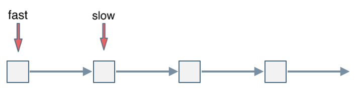
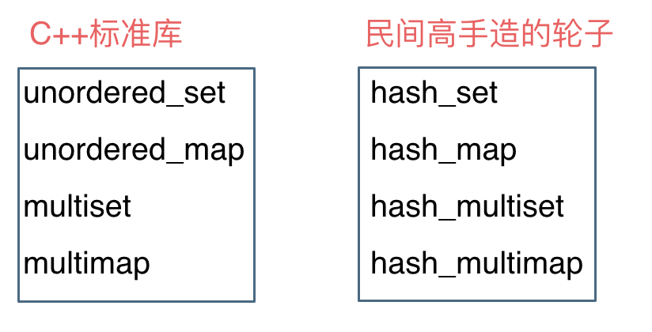

# 链表

```c++
//单链表
struct ListNode{
    int val;//存储元素
    ListNode *next;
    ListNode(int x):val(x),next(NULL){}//节点构造函数
}
```


## 链表的反转

[206. 反转链表 - 力扣（LeetCode） (leetcode-cn.com)](https://leetcode-cn.com/problems/reverse-linked-list/)

解法一，三指针的循环颠倒

```c++
ListNode* reverseList(ListNode* head) {
        ListNode* t=head;//当前节点
        //上一个节点
        ListNode* p;
        p=nullptr;
        while(t!=NULL){
            auto n=t->next;//记录下一个节点
            t->next=p;
            p=t;
            t=n;
        }
        return p;
    }
```

解法二，使用栈

```c++
ListNode* reverseList(ListNode* head) {
        ListNode* t=head;//当前节点
        //记录下一个节点
        stack<int> temp;
        while(t){
            temp.push(t->val);
            t=t->next;
        }
        t=head; 
        while(t){
            t->val=temp.top();
            temp.pop();
            t=t->next;
        }
        return head;
    }
```

解法三，使用头插法来反转

思想把每个结点都放在头结点的后面就实现了反转

```c++
//不带头结点
ListNode* reverseList(ListNode* head) {
        if(!head)return head;
        auto t=head->next;
        ListNode* p=NULL;
        head->next=NULL;
        while(t)
        {
            p=t;
            t=t->next;
            p->next=head;
            head=p;
        }
        return head;
    }
```

4

递归递归法相对抽象一些，但是其实和双指针法是一样的逻辑，同样是当cur为空的时候循环结束，不断将cur指向pre的过程。

关键是初始化的地方，可能有的同学会不理解， 可以看到双指针法中初始化 cur = head，pre = NULL，在递归法中可以从如下代码看出初始化的逻辑也是一样的，只不过写法变了。

```c++
class Solution {
public:
    ListNode* reverseList(ListNode* head) {
        // 边缘条件判断
        if(head == NULL) return NULL;
        if (head->next == NULL) return head;
        
        // 递归调用，翻转第二个节点开始往后的链表
        ListNode *last = reverseList(head->next);
        // 翻转头节点与第二个节点的指向
        head->next->next = head;
        // 此时的 head 节点为尾节点，next 需要指向 NULL
        head->next = NULL;
        return last;
    }
}; 
```


## 移除链表元素

[203. 移除链表元素 - 力扣（LeetCode） (leetcode-cn.com)](https://leetcode-cn.com/problems/remove-linked-list-elements/)

```c++
ListNode* removeElements(ListNode* head, int val) {
        ListNode* p=head;
    //当移除节点是头结点时
        while (head!=NULL&&head->val==val)
        {
            head=head->next;
        }
    //非头结点时
        while(p!=NULL&&p->next!=NULL)
        {
            if(p->next->val==val)
            {
                ListNode* t=p->next;
                p->next=t->next;
                delete t;
            }
            else
            {
                p=p->next;
            }
        }
        return head;
    }
```

## 设计链表的实现

[707. 设计链表 - 力扣（LeetCode） (leetcode-cn.com)](https://leetcode-cn.com/problems/design-linked-list/)

```c++
class MyLinkedList {
public:
    /** Initialize your data structure here. */
    struct ListNode{
        int val;
        ListNode* next;
        ListNode(int x):val(x),next(NULL){}
    };
    MyLinkedList() {
        //虚拟头结点
        _dummyHead=new ListNode(0);
        _size=0;
    }
    //获取链表中第 index 个节点的值。如果索引无效，则返回-1。
    int get(int index) {
        if(index<0||index>=_size)
        {
            return -1;
        }
        ListNode* p=_dummyHead->next;
        while (index--)
        {
            p=p->next;
        }
        return p->val;
    }
    //在链表的第一个元素之前添加一个值为 val 的节点。插入后，新节点将成为链表的第一个节点
    void addAtHead(int val) {
        ListNode* p=new ListNode(val);
        p->next=_dummyHead->next;
        _dummyHead->next=p;
        _size++;
    }
    //将值为 val 的节点追加到链表的最后一个元素。
    void addAtTail(int val) {
        ListNode* p=new ListNode(val);
        ListNode* q=_dummyHead;
        while(q->next!=NULL&&q!=NULL)
        {
            q=q->next;
        }
        q->next=p;
        _size++;
    }
    //在链表中的第 index 个节点之前添加值为 val  的节点。如果 index 等于链表的长度，则该节点将附加到链表的末尾。如果 index 大于链表长度，则不会插入节点。如果index小于0，则在头部插入节点。
    void addAtIndex(int index, int val) {
        if(index>_size)
        {
            return;
        }
        if(index<0;)
            addAtHead(val);
        ListNode* p=new ListNode(val);
        ListNode* q=_dummyHead;
        for(int i=0;i<index;i++)
        {
            q=q->next;
        }
        p->next=q->next;
        q->next=p;
        _size++;
    }
    //如果索引 index 有效，则删除链表中的第 index 个节点。
    void deleteAtIndex(int index) {
        if(index<0||index>=_size)
        {
            return;
        }
        ListNode* p=_dummyHead;
        for(int i=0;i<index;i++)
        {
            p=p->next;
        }
        p->next=p->next->next;
        _size--;
    }
    private:
    int _size;
    ListNode* _dummyHead;
};
```


## 交换链表相邻的元素


加入虚拟头结点方便操作

```c++
class Solution {
public:
    ListNode* swapPairs(ListNode* head) {
        
        auto dp=new ListNode(0);
        dp->next=head;
        ListNode* p=dp;
        while(p->next!=NULL&&p->next->next!=NULL)
        {
            auto t1=p->next;
            auto t2=p->next->next;
            p->next=t2;
            t1->next=t2->next;
            t2->next=t1;
            p=p->next->next;

        }
        return dp->next;
    }
};
```


## 删除链表倒数第N个节点

[19. 删除链表的倒数第 N 个结点 - 力扣（LeetCode） (leetcode-cn.com)](https://leetcode-cn.com/problems/remove-nth-node-from-end-of-list/)

```c++
ListNode* removeNthFromEnd(ListNode* head, int n) {
        auto dp=new ListNode(0);
        dp->next=head;
        auto fast=dp;
        auto slow=dp;
        for(int i=0;i<n;i++)
        {
            fast=fast->next;
        }
        while(fast->next!=NULL)
        {
            fast=fast->next;
            slow=slow->next;
        }
        slow->next=slow->next->next;
        return dp->next;
    }
};
```


## 求相交节点

[面试题 02.07. 链表相交 - 力扣（LeetCode） (leetcode-cn.com)](https://leetcode-cn.com/problems/intersection-of-two-linked-lists-lcci/)

```c++
class Solution {
public:
    ListNode *getIntersectionNode(ListNode *headA, ListNode *headB) {
        auto pa=headA;
        auto pb=headB;
        int lena=0,lenb=0;
        while(pa!=NULL)
        {
            lena++;
            pa=pa->next;
        }
        while(pb!=NULL)
        {
            lenb++;
            pb=pb->next;
        }
        pa=headA;
        pb=headB;
        if(lena>lenb)
        {
            int g=lena-lenb;
            while(g--){
                pa=pa->next;
            }
        }
        else
        {
            int g=lenb-lena;
            while(g--)
            {
                pb=pb->next;
            }
        }
        while(pa&&pb){
            if(pa==pb)
            {
                return pa;
            }
            else{
                pa=pa->next;
                pb=pb->next;
            }
        }
        return NULL;
    }
};
```

## 环形链表

[142. 环形链表 II - 力扣（LeetCode） (leetcode-cn.com)](https://leetcode-cn.com/problems/linked-list-cycle-ii/)

方法一，用集合来做

```c++
class Solution {
public:
    ListNode *detectCycle(ListNode *head) {
        unordered_set<ListNode*> v;
        while(head){
            if(find(v.begin(),v.end(),head)!=v.end())
                return head;
            v.insert(head);
            head = head->next;
        }
        return NULL;
    }
};
```

方法二快慢指针

分别定义 fast 和 slow 指针，从头结点出发，fast指针每次移动两个节点，slow指针每次移动一个节点，如果 fast 和 slow指针在途中相遇 ，说明这个链表有环。

为什么fast 走两个节点，slow走一个节点，有环的话，一定会在环内相遇呢，而不是永远的错开呢

首先第一点：**fast指针一定先进入环中，如果fast指针和slow指针相遇的话，一定是在环中相遇，这是毋庸置疑的。**

那么来看一下，**为什么fast指针和slow指针一定会相遇呢？**

可以画一个环，然后让 fast指针在任意一个节点开始追赶slow指针。

会发现最终都是这种情况， 如下图：



ast和slow各自再走一步， fast和slow就相遇了

这是因为fast是走两步，slow是走一步，**其实相对于slow来说，fast是一个节点一个节点的靠近slow的**，所以fast一定可以和slow重合。

动画如下：


### 如果有环，如何找到这个环的入口

**此时已经可以判断链表是否有环了，那么接下来要找这个环的入口了。**

假设从头结点到环形入口节点 的节点数为x。 环形入口节点到 fast指针与slow指针相遇节点 节点数为y。 从相遇节点 再到环形入口节点节点数为 z。 如图所示：


那么相遇时： slow指针走过的节点数为: `x + y`， fast指针走过的节点数：`x + y + n (y + z)`，n为fast指针在环内走了n圈才遇到slow指针， （y+z）为 一圈内节点的个数A。

因为fast指针是一步走两个节点，slow指针一步走一个节点， 所以 fast指针走过的节点数 = slow指针走过的节点数 * 2：

```
(x + y) * 2 = x + y + n (y + z)
```

两边消掉一个（x+y）: `x + y = n (y + z)`

因为要找环形的入口，那么要求的是x，因为x表示 头结点到 环形入口节点的的距离。

所以要求x ，将x单独放在左面：`x = n (y + z) - y` ,

再从n(y+z)中提出一个 （y+z）来，整理公式之后为如下公式：`x = (n - 1) (y + z) + z` 注意这里n一定是大于等于1的，因为 fast指针至少要多走一圈才能相遇slow指针。

这个公式说明什么呢？

先拿n为1的情况来举例，意味着fast指针在环形里转了一圈之后，就遇到了 slow指针了。

当 n为1的时候，公式就化解为 `x = z`，

这就意味着，**从头结点出发一个指针，从相遇节点 也出发一个指针，这两个指针每次只走一个节点， 那么当这两个指针相遇的时候就是 环形入口的节点**。

也就是在相遇节点处，定义一个指针index1，在头结点处定一个指针index2。

让index1和index2同时移动，每次移动一个节点， 那么他们相遇的地方就是 环形入口的节点。

动画如下：


那么 n如果大于1是什么情况呢，就是fast指针在环形转n圈之后才遇到 slow指针。

其实这种情况和n为1的时候 效果是一样的，一样可以通过这个方法找到 环形的入口节点，只不过，index1 指针在环里 多转了(n-1)圈，然后再遇到index2，相遇点依然是环形的入口节点。

```c++
ListNode *detectCycle(ListNode *head) {
        auto f=head,s=head;
        while(f&&f->next)
        {
            f=f->next->next;
            s=s->next;
            if(f==s)
            {
                auto t1=f;
                auto t2=head;
                while(!(t1==t2)){
                    t1=t1->next;
                    t2=t2->next;
                }
                return t1;
            }
        }
        return NULL;
    }
```

**为什么第一次在环中相遇，slow的 步数 是 x+y 而不是 x + 若干环的长度 + y 呢？**

即文章[链表：环找到了，那入口呢？ (opens new window)](https://programmercarl.com/0142.环形链表II.html)中如下的地方：


首先slow进环的时候，fast一定是先进环来了。

如果slow进环入口，fast也在环入口，那么把这个环展开成直线，就是如下图的样子：


可以看出如果slow 和 fast同时在环入口开始走，一定会在环入口3相遇，slow走了一圈，fast走了两圈。

重点来了，slow进环的时候，fast一定是在环的任意一个位置，如图：


那么fast指针走到环入口3的时候，已经走了k + n 个节点，slow相应的应该走了(k + n) / 2 个节点。

因为k是小于n的（图中可以看出），所以(k + n) / 2 一定小于n。

**也就是说slow一定没有走到环入口3，而fast已经到环入口3了**。

这说明什么呢？

**在slow开始走的那一环已经和fast相遇了**。

那有同学又说了，为什么fast不能跳过去呢？ 在刚刚已经说过一次了，**fast相对于slow是一次移动一个节点，所以不可能跳过去**。

好了，这次把为什么第一次在环中相遇，slow的 步数 是 x+y 而不是 x + 若干环的长度 + y ，用数学推理了一下，算是对[链表：环找到了，那入口呢？ (opens new window)](https://programmercarl.com/0142.环形链表II.html)的补充

# 哈希表

## 哈希函数

## 碰撞检测

## 常见的三种哈希结构

当我们想使用哈希法来解决问题的时候，我们一般会选择如下三种数据结构。

- 数组
- set （集合）
- map(映射)

这里数组就没啥可说的了，我们来看一下set。

在C++中，set 和 map 分别提供以下三种数据结构，其底层实现以及优劣如下表所示：

| 集合               | 底层实现 | 是否有序 | 数值是否可以重复 | 能否更改数值 | 查询效率    | 增删效率    |
| ------------------ | -------- | -------- | ---------------- | ------------ | ----------- | ----------- |
| std::set           | 红黑树   | 有序     | 否               | 否           | $O(\log n)$ | $O(\log n)$ |
| std::multiset      | 红黑树   | 有序     | 是               | 否           | $O(\log n)$ | $O(\log n)$ |
| std::unordered_set | 哈希表   | 无序     | 否               | 否           | $O(1)$      | $O(1)$      |

std::unordered_set底层实现为哈希表，std::set 和std::multiset 的底层实现是红黑树，红黑树是一种平衡二叉搜索树，所以key值是有序的，但key不可以修改，改动key值会导致整棵树的错乱，所以只能删除和增加。

| 映射               | 底层实现 | 是否有序 | 数值是否可以重复 | 能否更改数值 | 查询效率    | 增删效率    |
| ------------------ | -------- | -------- | ---------------- | ------------ | ----------- | ----------- |
| std::map           | 红黑树   | key有序  | key不可重复      | key不可修改  | $O(\log n)$ | $O(\log n)$ |
| std::multimap      | 红黑树   | key有序  | key可重复        | key不可修改  | $O(\log n)$ | $O(\log n)$ |
| std::unordered_map | 哈希表   | key无序  | key不可重复      | key不可修改  | $O(1)$      | $O(1)$      |

std::unordered_map 底层实现为哈希表，std::map 和std::multimap 的底层实现是红黑树。同理，std::map 和std::multimap 的key也是有序的（这个问题也经常作为面试题，考察对语言容器底层的理解）。

当我们要使用集合来解决哈希问题的时候，优先使用unordered_set，因为它的查询和增删效率是最优的，如果需要集合是有序的，那么就用set，如果要求不仅有序还要有重复数据的话，那么就用multiset。

那么再来看一下map ，在map 是一个key value 的数据结构，map中，对key是有限制，对value没有限制的，因为key的存储方式使用红黑树实现的。

其他语言例如：java里的HashMap ，TreeMap 都是一样的原理。可以灵活贯通。

虽然std::set、std::multiset 的底层实现是红黑树，不是哈希表，但是std::set、std::multiset 依然使用哈希函数来做映射，只不过底层的符号表使用了红黑树来存储数据，所以使用这些数据结构来解决映射问题的方法，我们依然称之为哈希法。 map也是一样的道理。

这里在说一下，一些C++的经典书籍上 例如STL源码剖析，说到了hash_set hash_map，这个与unordered_set，unordered_map又有什么关系呢？

实际上功能都是一样一样的， 但是unordered_set在C++11的时候被引入标准库了，而hash_set并没有，所以建议还是使用unordered_set比较好，这就好比一个是官方认证的，hash_set，hash_map 是C++11标准之前民间高手自发造的轮子。



## 有效字母

[242. 有效的字母异位词 - 力扣（LeetCode） (leetcode-cn.com)](https://leetcode-cn.com/problems/valid-anagram/)

```c++
class Solution {
public:
    bool isAnagram(string s, string t) {
        map<char,int> mp1;
        map<char,int> mp2;
        if(s.size()!=t.size()){
            return false;
        }
        else
        {
            for(int i=0;i<s.size();i++)
            {
                if(mp1[s[i]])mp1[s[i]]++;
                else
                mp1[s[i]]=1;
                if(mp2[t[i]])mp2[t[i]]++;
                else
                mp2[t[i]]=1;
            }
        }
        if(mp1==mp2)
        {
            return true;
        }
        return false;
    }
}
```


## 两个数组的交集

[349. 两个数组的交集 - 力扣（LeetCode） (leetcode-cn.com)](https://leetcode-cn.com/problems/intersection-of-two-arrays/)

我的解法

```c++
class Solution {
public:
    vector<int> intersection(vector<int>& nums1, vector<int>& nums2) {
        set<int> s1;
        set<int> ans;
        for(int i=0;i<nums1.size();i++)
        {
            s1.insert(nums1[i]);
        }
        for(int i=0;i<nums2.size();i++)
        {
            if(find(s1.begin(),s1.end(),nums2[i])!=s1.end())
                ans.insert(nums2[i]);
        }
        vector<int> re;
        for(auto its=ans.begin();its!=ans.end();its++){
            re.push_back(*its);
        }
        return re;
    }
};
```

简洁写法

```c++
class Solution {
public:
    vector<int> intersection(vector<int>& nums1, vector<int>& nums2) {
        set<int> s1(nums1.begin(),nums1.end());
        set<int> ans;
        for(int i=0;i<nums2.size();i++)
        {
            if(find(s1.begin(),s1.end(),nums2[i])!=s1.end())
                ans.insert(nums2[i]);
        }
        vector<int> re(ans.begin(),ans.end());
        return re;
    }
};
```

## 两数之和

[1. 两数之和 - 力扣（LeetCode） (leetcode-cn.com)](https://leetcode-cn.com/problems/two-sum/)


```c++
class Solution {
public:
    vector<int> twoSum(vector<int>& nums, int target) {
        vector<int> ans;
        unordered_map<int,int> mp;
        for(int i=0;i<nums.size();i++)
        {
            if(mp.find(target-nums[i])!=mp.end())
            {  
                //插入顺序不能变，因为是找到第二个和的时候，才能在map里面找到相应第一个数的位置
                ans.push_back(mp[target-nums[i]]);
                ans.push_back(i);
                return ans;
            }
            else
                mp[nums[i]]=i;
        }
        return ans; 
    }
};
```

