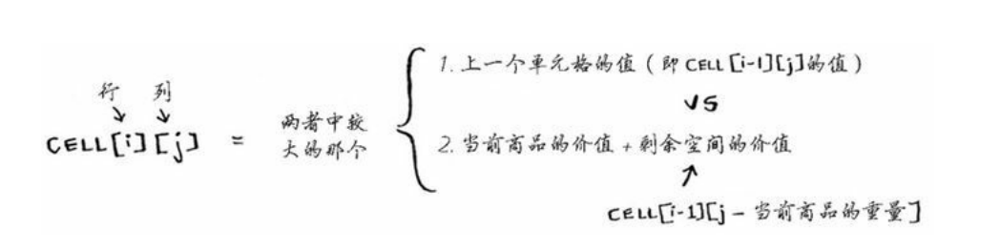
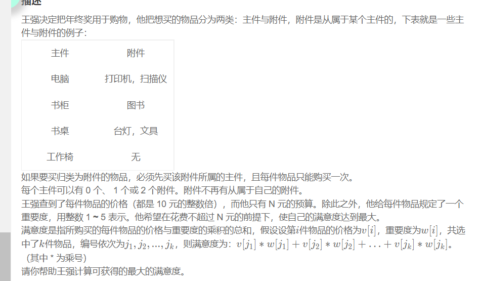

# 动态规划

## 背包问题

动态规划从小问题入手逐步解决大问题

根据背包获取最大价值



每次迭代的时候，存储当前的最大价值，最大价值不可能比之前低

动态规划，只能考虑拿走整件商品，要么不拿，无法判断部分


背包问题的变形，购物车清单



化简为0-1背包问题

在背包问题中，dp[i\][j]表示在不超过j的条件下，对于前i件产品的选择所能获取的最大价值

动态方程是j>price[i] dp[i\][j]=max(dp[i\][j-price[i]]+value[i],dp[i-1\][j])

否则就是dp[i][j\]=dp[i-1\][j\]

对一题目中的附件可以简化问题，分成这里的编号都是主件，所以在每一主件之后可以增加对附件的判断
dp[i][j\]=max(主件，主件+附件1，主件+附件2，主件+附件3，不买主件)


答案

```c++
#include<iostream>
#include<vector>
using namespace std;
int main(){
    int M,N;
    cin>>M>>N;
    M/=10;
    vector<vector<int>> price(N+1,vector<int>(3,0));
    vector<vector<int>> value(N+1,vector<int>(3,0));
    for(int i=1;i<=N;i++){
        int a,b,c;
        cin>>a>>b>>c;
        if(c==0){
            price[i][0]=a/10;
            value[i][0]=b;
        }
        else{
            if(price[c][1]!=0){
                price[c][2]=a/10;
                value[c][2]=b;
            }
            else{
                price[c][1]=a/10;
                value[c][1]=b;
            }
        }
    }
    vector<vector<int>> dp(N+1,vector<int>(M+1,0));
    for(int i=1;i<=N;i++){
        for(int j=1;j<=M;j++){
            int a=price[i][0],b=value[i][0];
            int c=price[i][1],d=value[i][1];
            int e=price[i][2],f=value[i][2];
            dp[i][j]=j>=a?max(dp[i-1][j-a]+a*b,dp[i-1][j]):dp[i-1][j];
            dp[i][j]=j>=a+c?max(dp[i-1][j-a-c]+a*b+c*d,dp[i][j]):dp[i][j];
            dp[i][j]=j>=a+e?max(dp[i-1][j-a-e]+a*b+e*f,dp[i][j]):dp[i][j];
            dp[i][j]=j>=a+c+e?max(dp[i-1][j-a-e-c]+a*b+c*d+e*f,dp[i][j]):dp[i][j];
        }
    }
    cout<<dp[N][M]*10<<endl;
    return 0;
}
```

