# 基础数据类型


# 容器类型

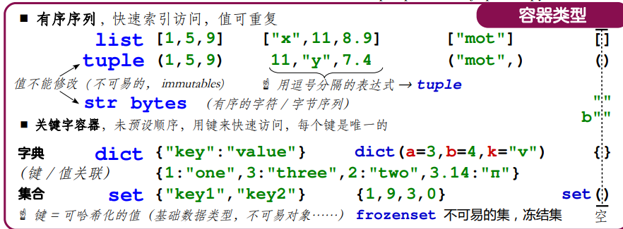

## 序列容器的索引


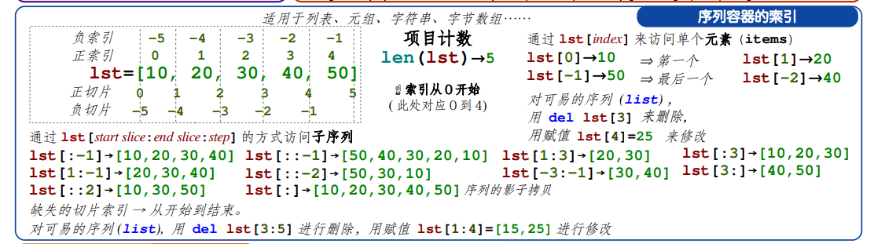


## 容器常见操作


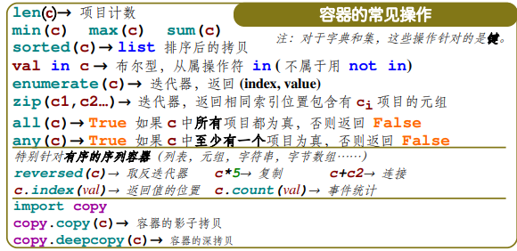


## 列表常见操作

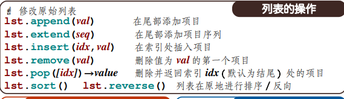

append()在列表末尾添加元素

count()统计出现次数

index()找出某个值第一匹配项索引位置

insert(index,obj)将对象插入列表

pop(index)移除列表的一个元素，默认是最后一个，

remove(obj)移除列表与obj匹配的值

reverse()反向列表中的元素

clear()清空列表

copy()复制列表

del.list[i]删除列表中的元素

## 元组常见的操作

len，max，min

tuple()将列表转换为元组

tuple.index(obj[,start=0[,end=len(tuple)]])
（obj -- 指定检索的对象）
用于从元组中找出某个对象第一个匹配项的索引位置，如果这个对象不在元组中会报一个异常

tuple.count(obj)
（obj -- 元组中统计的对象。）
用于统计某个元素在元组中出现的次数。


## 整数序列

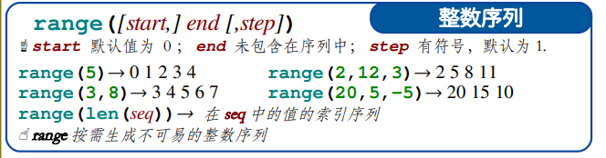

## 字典和集合的操作

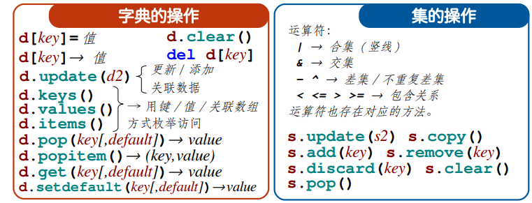


### 字典常见操作

len(dict)
计算字典元素个数，即键的总数。

str(dict)
输出字典以可打印的字符串表示。

 type(variable) 返回输入的变量类型，如果变量是字典就返回字典类型。

字典的copy()是返回浅复制

dict()  变成字典

fromkeys()创建一个新字典，以序列seq中元素做字典的键，val为字典所有键对应的初始值

dict.get(key,default=None) 返回指定键的值，如果不在字典中返回Default

dict.items()以列表返回可遍历的（键，值）元组数组

key()返回所有的键

[ radiansdict.setdefault(key, default=None)](https://www.w3xue.com/manual/py3/python3-att-dictionary-setdefault.html) 和get()类似, 但如果键不存在于字典中，将会添加键并将值设为default

[ radiansdict.update(dict2)](https://www.w3xue.com/manual/py3/python3-att-dictionary-update.html) 把字典dict2的键/值对更新到dict里

### 集合

| [add()](https://www.w3xue.com/manual/py3/ref-set-add.html)   | 为集合添加元素                                               |
| ------------------------------------------------------------ | ------------------------------------------------------------ |
| [clear()](https://www.w3xue.com/manual/py3/ref-set-clear.html) | 移除集合中的所有元素                                         |
| [copy()](https://www.w3xue.com/manual/py3/ref-set-copy.html) | 拷贝一个集合                                                 |
| [difference()](https://www.w3xue.com/manual/py3/ref-set-difference.html) | 返回多个集合的差集                                           |
| [difference_update()](https://www.w3xue.com/manual/py3/ref-set-difference_update.html) | 移除集合中的元素，该元素在指定的集合也存在。                 |
| [discard()](https://www.w3xue.com/manual/py3/ref-set-discard.html) | 删除集合中指定的元素                                         |
| [intersection()](https://www.w3xue.com/manual/py3/ref-set-intersection.html) | 返回集合的交集                                               |
| [intersection_update()](https://www.w3xue.com/manual/py3/ref-set-intersection_update.html) | 返回集合的交集。                                             |
| [isdisjoint()](https://www.w3xue.com/manual/py3/ref-set-isdisjoint.html) | 判断两个集合是否包含相同的元素，如果没有返回 True，否则返回 False。 |
| [issubset()](https://www.w3xue.com/manual/py3/ref-set-issubset.html) | 判断指定集合是否为该方法参数集合的子集。                     |
| [issuperset()](https://www.w3xue.com/manual/py3/ref-set-issuperset.html) | 判断该方法的参数集合是否为指定集合的子集                     |
| [pop()](https://www.w3xue.com/manual/py3/ref-set-pop.html)   | 随机移除元素                                                 |
| [remove()](https://www.w3xue.com/manual/py3/ref-set-remove.html) | 移除指定元素                                                 |
| [symmetric_difference()](https://www.w3xue.com/manual/py3/ref-set-symmetric_difference.html) | 返回两个集合中不重复的元素集合。                             |
| [symmetric_difference_update()](https://www.w3xue.com/manual/py3/ref-set-symmetric_difference_update.html) | 移除当前集合中在另外一个指定集合相同的元素，并将另外一个指定集合中不同的元素插入到当前集合中。 |
| [union()](https://www.w3xue.com/manual/py3/ref-set-union.html) | 返回两个集合的并集                                           |
| [update()](https://www.w3xue.com/manual/py3/ref-set-update.html) | 给集合添加元素                                               |


# 字符串操作

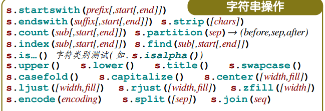

[Python3在线速查手册 - W3xue.com](https://www.w3xue.com/manual/py3/)

[ capitalize()](https://www.w3xue.com/manual/py3/python3-string-capitalize.html) 将字符串的第一个字符转换为大写

[ center(width, fillchar)](https://www.w3xue.com/manual/py3/python3-string-center.html) 返回一个指定的宽度 width 居中的字符串，fillchar 为填充的字符，默认为空格。

[count(str, beg= 0,end=len(string))](https://www.w3xue.com/manual/py3/python3-string-count.html)
返回 str 在 string 里面出现的次数，如果 beg 或者 end 指定则返回指定范围内 str 出现的次数

[ bytes.decode(encoding="utf-8", errors="strict")](https://www.w3xue.com/manual/py3/python3-string-decode.html) 

Python3 中没有 decode 方法，但我们可以使用 bytes 对象的 decode() 方法来解码给定的 bytes 对象，这个 bytes 对象可以由 str.encode() 来编码返回。

[encode(encoding='UTF-8',errors='strict')](https://www.w3xue.com/manual/py3/python3-string-encode.html)

以 encoding 指定的编码格式编码字符串，如果出错默认报一个ValueError 的异常，除非 errors 指定的是'ignore'或者'replace'

[endswith(suffix, beg=0, end=len(string))](https://www.w3xue.com/manual/py3/python3-string-endswith.html)
检查字符串是否以 obj 结束，如果beg 或者 end 指定则检查指定的范围内是否以 obj 结束，如果是，返回 True,否则返回 False.

```python
b="aaabbbccc"
print(b.endswith("c"))
```

[expandtabs(tabsize=8)](https://www.w3xue.com/manual/py3/python3-string-expandtabs.html)

把字符串 string 中的 tab 符号转为空格，tab 符号默认的空格数是 8 

[find(str, beg=0 end=len(string))](https://www.w3xue.com/manual/py3/python3-string-find.html)

检测 str 是否包含在字符串中 中，如果 beg 和 end 指定范围，则检查是否包含在指定范围内，如果是返回开始的索引值，否则返回-1

[index(str, beg=0, end=len(string))](https://www.w3xue.com/manual/py3/python3-string-index.html)

跟find()方法一样，只不过如果str不在字符串中会报一个异常.

[isalnum()](https://www.w3xue.com/manual/py3/python3-string-isalnum.html)

如果字符串至少有一个字符并且所有字符都是字母或数字则返 回 True,否则返回 False

[isalpha()](https://www.w3xue.com/manual/py3/python3-string-isalpha.html)

如果字符串至少有一个字符并且所有字符都是字母则返回 True, 否则返回 False

[isdigit()](https://www.w3xue.com/manual/py3/python3-string-isdigit.html)

如果字符串只包含数字则返回 True 否则返回 False.

[islower()](https://www.w3xue.com/manual/py3/python3-string-islower.html)

如果字符串中包含至少一个区分大小写的字符，并且所有这些(区分大小写的)字符都是小写，则返回 True，否则返回 False

[ isnumeric()](https://www.w3xue.com/manual/py3/python3-string-isnumeric.html) 

如果字符串中只包含数字字符，则返回 True，否则返回 False

[ isspace()](https://www.w3xue.com/manual/py3/python3-string-isspace.html) 

如果字符串中只包含空格，则返回 True，否则返回 False.

[istitle()](https://www.w3xue.com/manual/py3/python3-string-istitle.html)

如果字符串是标题化的(见 title())则返回 True，否则返回 False

[isupper()](https://www.w3xue.com/manual/py3/python3-string-isupper.html)


如果字符串中包含至少一个区分大小写的字符，并且所有这些(区分大小写的)字符都是大写，则返回 True，否则返回 False

[ join(seq)](https://www.w3xue.com/manual/py3/python3-string-join.html) 

以指定字符串作为分隔符，将 seq 中所有的元素(的字符串表示)合并为一个新的字符串

[len(string)](https://www.w3xue.com/manual/py3/python3-string-len.html)


返回字符串长度

ljust\(width\[, fillchar\])


返回一个原字符串左对齐,并使用 fillchar 填充至长度 width 的新字符串，fillchar 默认为空格。

[lower()](https://www.w3xue.com/manual/py3/python3-string-lower.html)


转换字符串中所有大写字符为小写.

[ lstrip()](https://www.w3xue.com/manual/py3/python3-string-lstrip.html) 

截掉字符串左边的空格

[maketrans()](https://www.w3xue.com/manual/py3/python3-string-maketrans.html)


创建字符映射的转换表，对于接受两个参数的最简单的调用方式，第一个参数是字符串，表示需要转换的字符，第二个参数也是字符串表示转换的目标。

[max(str)](https://www.w3xue.com/manual/py3/python3-string-max.html)

返回字符串 str 中最大的字母。

[min(str)](https://www.w3xue.com/manual/py3/python3-string-min.html)

返回字符串 str 中最小的字母。

[replace(old, new [[, max\]\)](https://www.w3xue.com/manual/py3/python3-string-replace.html)
把 将字符串中的 str1 替换成 str2,如果 max 指定，则替换不超过 max 次。

[rfind(str, beg=0,end=len(string))](https://www.w3xue.com/manual/py3/python3-string-rfind.html)

类似于 find()函数，不过是从右边开始查找.

[rindex( str, beg=0, end=len(string))](https://www.w3xue.com/manual/py3/python3-string-rindex.html)

类似于 index()，不过是从右边开始.

[rjust(width,[[, fillchar\])](https://www.w3xue.com/manual/py3/python3-string-rjust.html)

返回一个原字符串右对齐,并使用fillchar(默认空格）填充至长度 width 的新字符串

[rstrip()](https://www.w3xue.com/manual/py3/python3-string-rstrip.html)

删除字符串字符串末尾的空格

[split(str="", num=string.count(str))](https://www.w3xue.com/manual/py3/python3-string-split.html)


num=string.count(str)) 以 str 为分隔符截取字符串，如果 num 有指定值，则仅截取 num 个子字符串

[splitlines( num=string.count('\n'))](https://www.w3xue.com/manual/py3/python3-string-splitlines.html)

按照行分隔，返回一个包含各行作为元素的列表，如果 num 指定则仅切片 num 个行.

[startswith(str, beg=0,end=len(string))](https://www.w3xue.com/manual/py3/python3-string-startswith.html)

检查字符串是否是以 obj 开头，是则返回 True，否则返回 False。如果beg 和 end 指定值，则在指定范围内检查

strip([[chars\])](https://www.w3xue.com/manual/py3/python3-string-strip.html)

在字符串上执行 lstrip()和 rstrip()

[swapcase()](https://www.w3xue.com/manual/py3/python3-string-swapcase.html)

将字符串中大写转换为小写，小写转换为大写

[title()](https://www.w3xue.com/manual/py3/python3-string-title.html)

返回"标题化"的字符串,就是说所有单词都是以大写开始，其余字母均为小写(见 istitle()

[translate(table, deletechars="")](https://www.w3xue.com/manual/py3/python3-string-translate.html)

根据 str 给出的表(包含 256 个字符)转换 string 的字符, 要过滤掉的字符放到 deletechars 参数中

[upper()](https://www.w3xue.com/manual/py3/python3-string-upper.html)

转换字符串中的小写字母为大写

[zfill (width)](https://www.w3xue.com/manual/py3/python3-string-zfill.html)


返回长度为 width 的字符串，原字符串右对齐，前面填充0

[isdecimal()](https://www.w3xue.com/manual/py3/python3-string-isdecimal.html)

检查字符串是否只包含十进制字符，如果是返回 true，否则返回 false。


# 标识符


# 类型转换

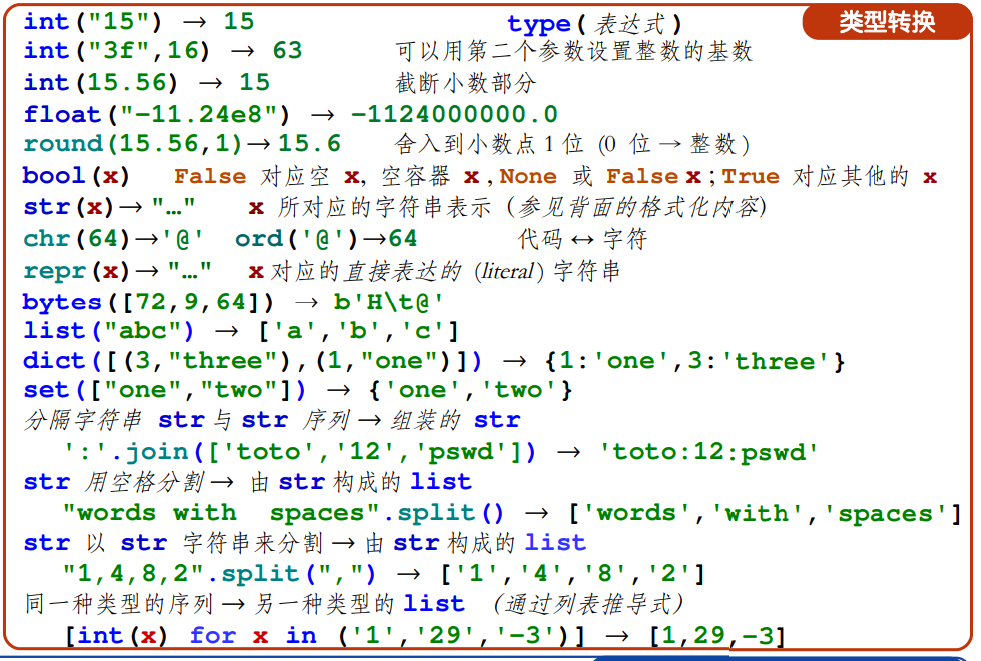


## 数据的格式

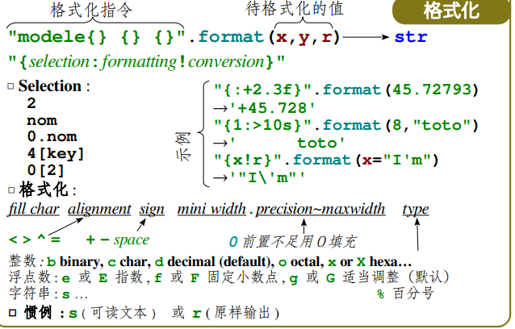


# 错误异常，程序

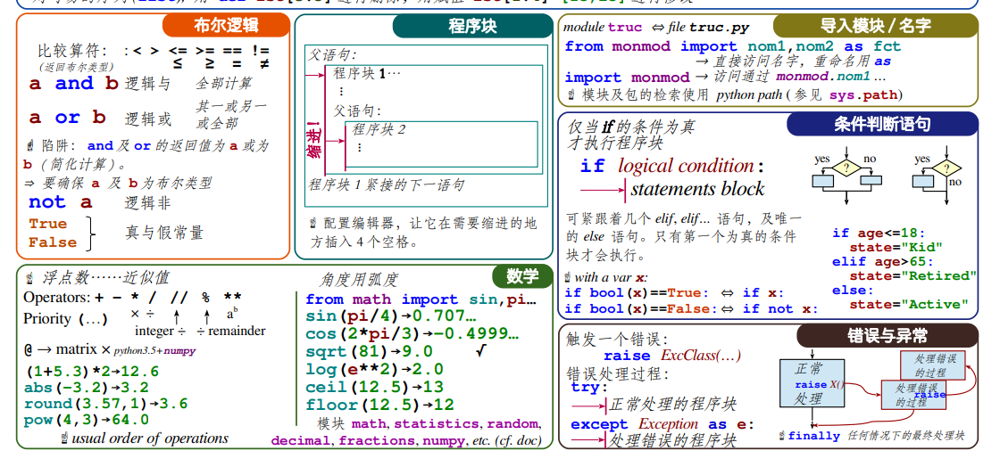


# 条件控制

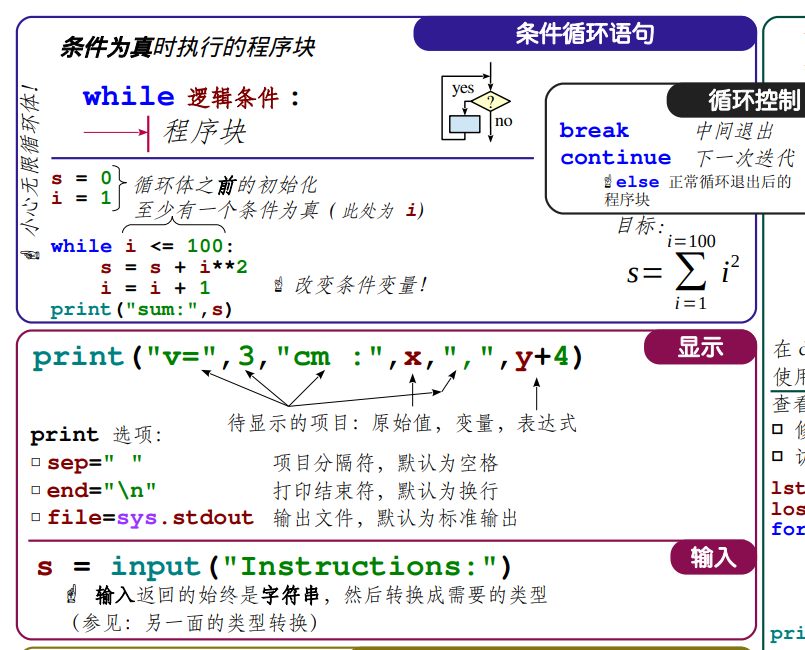


# 函数


## 数学函数

```python
a = -3
print(abs(a)) # 绝对值
print(math.fabs(a)) # 绝对值
'''
fabs() 函数类似于 abs() 函数，但是他有两点区别:
abs() 是内置函数。 fabs() 函数在 math 模块中定义。
fabs() 函数只对浮点型跟整型数值有效。 abs() 还可以运用在复数中。
'''
b = 1.4
print(math.ceil(b)) # 向上取整
math.floot(b) #向下取整 小于或等于x
print(round(b)) # 四舍五入
c = 2
print(math.sqrt(c)) # 平方根
print(math.pow(c,2)) # c的2次方
print(math.pi) # 圆周率
print(math.e) # 自然常数e

print(math.factorial(c)) # 阶乘
print(math.exp(c)) # e的c次方
print(math.log(16,4)) # 自然对数前者为值，后者为底数默认为e
print(math.log10(100)) # 10的对数
print(math.log2(64)) # 2的对数
```

### 三角函数

```python
print(math.sin(math.pi/2))#正弦
print(math.cos(math.pi/2))#余弦
print(math.tan(math.pi/4))#正切
print(math.asin(1))#反正弦
print(math.acos(1))#反余弦
print(math.atan(1))#反正切
print(math.degrees(math.pi))#弧度转角度
print(math.radians(180))#角度转弧度
print(math.sinh(math.pi/2))#双曲正弦
print(math.cosh(math.pi/2))#双曲余弦
print(math.tanh(math.pi/4))#双曲正切
print(math.asinh(1))#反双曲正弦
print(math.acosh(1))#反双曲余弦
print(math.atanh(1))#反双曲正切
```


## 随机数

```python

#在某个范围内生成一个随机数,可以是整数,浮点数,字符串
a=random.choice(range(100))
b=random.choice("abcdefg")
#返回一个列表，有10个随机数
c=random.choices(range(100),k=10)
```

`random.randrange ([start,] stop [,step])`

- start -- 指定范围内的开始值，包含在范围内。
- stop -- 指定范围内的结束值，不包含在范围内。
- step -- 指定递增基数。

**random()** 方法返回随机生成的一个实数，它在[0,1)范围内。

**seed()** 方法改变随机数生成器的种子，可以在调用其他随机模块函数之前调用此函数。x -- 改变随机数生成器的种子seed。如果你不了解其原理，你不必特别去设定seed，Python会帮你选择seed。

`random.shuffle (lst )`lst -- 可以是一个序列或者元组。返回随机排序后的序列。

`random.uniform(x, y)`**uniform()** 方法将随机生成下一个实数，它在[x,y]范围内。

- x -- 随机数的最小值。
- y -- 随机数的最大值。
- 返回一个浮点数。


## 日期与时间

用于计算浮点数计算的秒数返回当前CPU时间,用来衡量不同程序耗时

```python
t1 = time.perf_counter()

timeWait()

print(time.perf_counter()-t1)
```

返回当下时间元组

`time.localtime()`

`time.gmtime()`

`time.struct_time(tm_year=2022, tm_mon=4, tm_mday=13, tm_hour=12, tm_min=7, tm_sec=32, tm_wday=2, tm_yday=103, tm_isdst=0)`
接受时间元组变成可读形式的时间
time.asctime(t)
'Wed Apr 13 12:08:17 2022'

接受时间元组返回时间戳，（1970纪元后经过的浮点秒数）。

`time.mktime()`


time.sleep(secs)
推迟调用线程的运行，secs指秒数。

time.strftime(fmt[,tupletime])
接收以时间元组，并返回以可读字符串表示的当地时间，格式由fmt决定。

```
print (time.strftime("%Y-%m-%d %H:%M:%S", time.localtime()))
```

 time.time( ) 返回当前时间的时间戳（1970纪元后经过的浮点秒数）。

#### 日历calendar模块

| 序号 | 函数及描述                                                   |
| :--- | :----------------------------------------------------------- |
| 1    | **calendar.calendar(year,w=2,l=1,c=6)** <br/>返回一个多行字符串格式的year年年历，3个月一行，间隔距离为c。 每日宽度间隔为w字符。每行长度为21* W+18+2* C。l是每星期行数。 |
| 2    | **calendar.firstweekday( )**  <br/>返回当前每周起始日期的设置。默认情况下，首次载入caendar模块时返回0，即星期一。 |
| 3    | **calendar.isleap(year)**  <br/>是闰年返回True，否则为false。 |
| 4    | **calendar.leapdays(y1,y2)**  <br/>返回在Y1，Y2两年之间的闰年总数。 |
| 5    | **calendar.month(year,month,w=2,l=1)**  <br/>返回一个多行字符串格式的year年month月日历，两行标题，一周一行。每日宽度间隔为w字符。每行的长度为7* w+6。l是每星期的行数。 |
| 6    | **calendar.monthcalendar(year,month)**  <br/>返回一个整数的单层嵌套列表。每个子列表装载代表一个星期的整数。Year年month月外的日期都设为0;范围内的日子都由该月第几日表示，从1开始。 |
| 7    | **calendar.monthrange(year,month)**  <br/>返回两个整数。第一个是该月的星期几的日期码，第二个是该月的日期码。日从0（星期一）到6（星期日）;月从1到12。 |
| 8    | **calendar.prcal(year,w=2,l=1,c=6)**  <br/>相当于 print calendar.calendar(year,w,l,c). |
| 9    | **calendar.prmonth(year,month,w=2,l=1)**  <br/>相当于 print calendar.calendar（year，w，l，c）。 |
| 10   | **calendar.setfirstweekday(weekday)** <br/> 设置每周的起始日期码。0（星期一）到6（星期日）。 |
| 11   | **calendar.timegm(tupletime)** <br/> 和time.gmtime相反：接受一个时间元组形式，返回该时刻的时间辍（1970纪元后经过的浮点秒数）。 |
| 12   | **calendar.weekday(year,month,day)** <br/> 返回给定日期的日期码。0（星期一）到6（星期日）。月份为 1（一月） 到 12（12月）。 |

```python
#输出指定年的日历
a=ca.calendar(theyear=2022,w=2,l=1,c=6,m=4)
```

[calendar --- 日历相关函数 — Python 3.10.4 文档](https://docs.python.org/zh-cn/3.10/library/calendar.html#calendar.calendar)

## 内置函数

### all() 

函数用于判断给定的可迭代参数 iterable 中的所有元素是否都为 TRUE，如果是返回 True，否则返回 False。

元素除了是 0、空、None、False 外都算 True。

any() 函数用于判断给定的可迭代参数 iterable 是否全部为 False，则返回 False，如果有一个为 True，则返回 True。

元素除了是 0、空、FALSE 外都算 TRUE。

### dir() 

函数不带参数时，返回当前范围内的变量、方法和定义的类型列表；带参数时，返回参数的属性、方法列表。如果参数包含方法__dir__()，该方法将被调用。如果参数不包含__dir__()，该方法将最大限度地收集参数信息。

### hex()

16进制  oct()8进制**bin()** 返回一个整数 int 或者长整数 long int 的二进制表示。

### 迭代器

#### next()

迭代器下一个项目

#### slice()

函数实现切片对象，主要用在切片操作函数里的参数传递。

Python divmod() 函数接收两个数字类型（非复数）参数，返回一个包含商和余数的元组(a // b, a % b)。

### id()

内存地址


### sort（）

```
a.sort(reverse=True)降序排序
```


**sorted()** 函数对所有可迭代的对象进行排序操作。

> **sort 与 sorted 区别：**
>
> sort 是应用在 list 上的方法，sorted 可以对所有可迭代的对象进行排序操作。
>
> list 的 sort 方法返回的是对已经存在的列表进行操作，而内建函数 sorted 方法返回的是一个新的 list，而不是在原来的基础上进行的操作。

sorted()可以接受任何iterable

```
# key升序排序
bb=sorted(aa.items(),key=lambda x:x[1])
print(bb)
# value升序排序
cc=sorted(aa.items(),key=lambda x:x[0])
```

### enumerate() 

函数用于将一个可遍历的数据对象(如列表、元组或字符串)组合为一个索引序列，同时列出数据和数据下标，一般用在 for 循环当中

```
seq = ['one', 'two', 'three']

for i, elm in enumerate(seq):
    print(i, elm)
#输出    
0 one
1 two
2 three
```


### eval() 

函数用来执行一个字符串表达式，并返回表达式的值。

```
>>>x = 7
>>> eval( '3 * x' )
21
```

int() 函数用于将一个字符串或数字转换为整型。

Python open() 函数用于打开一个文件，并返回文件对象，在对文件进行处理过程都需要使用到这个函数，如果该文件无法被打开，会抛出 OSError。

**注意：**使用 open() 函数一定要保证关闭文件对象，即调用 close() 函数。

### open() 

函数常用形式是接收两个参数：文件名(file)和模式(mode)。

```
open(file, mode='r', buffering=-1, encoding=None, errors=None, newline=None, closefd=True, opener=None)
```

参数说明:

- file: 必需，文件路径（相对或者绝对路径）。
- mode: 可选，文件打开模式
- buffering: 设置缓冲
- encoding: 一般使用utf8
- errors: 报错级别
- newline: 区分换行符
- closefd: 传入的file参数类型
- opener:

mode 参数有：

| t    | 文本模式 (默认)。                                            |
| ---- | ------------------------------------------------------------ |
| x    | 写模式，新建一个文件，如果该文件已存在则会报错。             |
| b    | 二进制模式。                                                 |
| +    | 打开一个文件进行更新(可读可写)。                             |
| U    | 通用换行模式（不推荐）。                                     |
| r    | 以只读方式打开文件。文件的指针将会放在文件的开头。这是默认模式。 |
| rb   | 以二进制格式打开一个文件用于只读。文件指针将会放在文件的开头。这是默认模式。一般用于非文本文件如图片等。 |
| r+   | 打开一个文件用于读写。文件指针将会放在文件的开头。           |
| rb+  | 以二进制格式打开一个文件用于读写。文件指针将会放在文件的开头。一般用于非文本文件如图片等。 |
| w    | 打开一个文件只用于写入。如果该文件已存在则打开文件，并从开头开始编辑，即原有内容会被删除。如果该文件不存在，创建新文件。 |
| wb   | 以二进制格式打开一个文件只用于写入。如果该文件已存在则打开文件，并从开头开始编辑，即原有内容会被删除。如果该文件不存在，创建新文件。一般用于非文本文件如图片等。 |
| w+   | 打开一个文件用于读写。如果该文件已存在则打开文件，并从开头开始编辑，即原有内容会被删除。如果该文件不存在，创建新文件。 |
| wb+  | 以二进制格式打开一个文件用于读写。如果该文件已存在则打开文件，并从开头开始编辑，即原有内容会被删除。如果该文件不存在，创建新文件。一般用于非文本文件如图片等。 |
| a    | 打开一个文件用于追加。如果该文件已存在，文件指针将会放在文件的结尾。也就是说，新的内容将会被写入到已有内容之后。如果该文件不存在，创建新文件进行写入。 |
| ab   | 以二进制格式打开一个文件用于追加。如果该文件已存在，文件指针将会放在文件的结尾。也就是说，新的内容将会被写入到已有内容之后。如果该文件不存在，创建新文件进行写入。 |
| a+   | 打开一个文件用于读写。如果该文件已存在，文件指针将会放在文件的结尾。文件打开时会是追加模式。如果该文件不存在，创建新文件用于读写。 |
| ab+  | 以二进制格式打开一个文件用于追加。如果该文件已存在，文件指针将会放在文件的结尾。如果该文件不存在，创建新文件用于读写。 |

默认为文本模式，如果要以二进制模式打开，加上 b 。


### str() 

函数将对象转化为适于人阅读的形式。

**bool()** 

函数用于将给定参数转换为布尔类型，如果没有参数，返回 False。

bool 是 int 的子类。


exec 

执行储存在字符串或文件中的 Python 语句，相比于 eval，exec可以执行更复杂的 Python 代码。


isinstance() 函数来判断一个对象是否是一个已知的类型，类似 type()。

> isinstance() 与 type() 区别：
>
> - type() 不会认为子类是一种父类类型，不考虑继承关系。
> - isinstance() 会认为子类是一种父类类型，考虑继承关系。
>
> 如果要判断两个类型是否相同推荐使用 isinstance()。7

ord()返回ascii码

 函数是 chr() 函数（对于 8 位的 ASCII 字符串）的配对函数，它以一个字符串（Unicode 字符）作为参数，返回对应的 ASCII 数值，或者 Unicode 数值。

# 文件操作

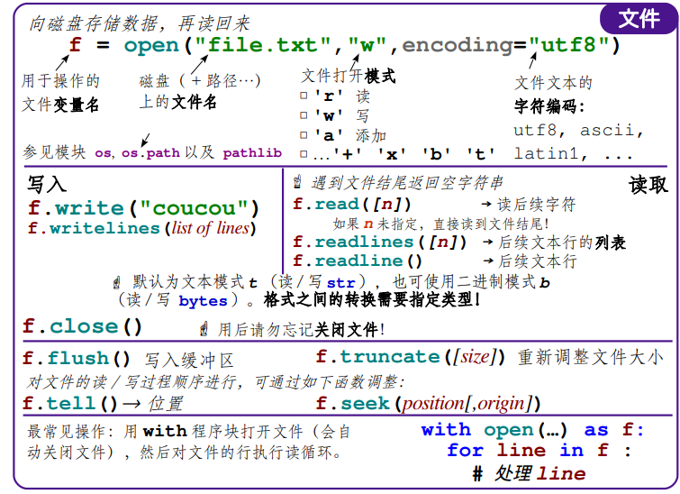


| 序号 | 方法及描述                                                   |
| :--- | :----------------------------------------------------------- |
| 1    | [file.close()](https://www.w3xue.com/manual/py3/python3-file-close.html)关闭文件。关闭后文件不能再进行读写操作。 |
| 2    | [file.flush()](https://www.w3xue.com/manual/py3/python3-file-flush.html)刷新文件内部缓冲，直接把内部缓冲区的数据立刻写入文件, 而不是被动的等待输出缓冲区写入。 |
| 3    | [file.fileno()](https://www.w3xue.com/manual/py3/python3-file-fileno.html)返回一个整型的文件描述符(file descriptor FD 整型), 可以用在如os模块的read方法等一些底层操作上。 |
| 4    | [file.isatty()](https://www.w3xue.com/manual/py3/python3-file-isatty.html)如果文件连接到一个终端设备返回 True，否则返回 False。 |
| 5    | [file.next()](https://www.w3xue.com/manual/py3/python3-file-next.html)返回文件下一行。 |
| 6    | [file.read([size\])](https://www.w3xue.com/manual/py3/python3-file-read.html)从文件读取指定的字节数，如果未给定或为负则读取所有。 |
| 7    | [file.readline([size\])](https://www.w3xue.com/manual/py3/python3-file-readline.html)读取整行，包括 "\n" 字符。 |
| 8    | [file.readlines([sizehint\])](https://www.w3xue.com/manual/py3/python3-file-readlines.html)读取所有行并返回列表，若给定sizeint>0，返回总和大约为sizeint字节的行, 实际读取值可能比sizhint较大, 因为需要填充缓冲区。 |
| 9    | [file.seek(offset[, [whence\])](https://www.w3xue.com/manual/py3/python3-file-seek.html)设置文件当前位置 |
| 10   | [file.tell()](https://www.w3xue.com/manual/py3/python3-file-tell.html)返回文件当前位置。 |
| 11   | [file.truncate([size\])](https://www.w3xue.com/manual/py3/python3-file-truncate.html)截取文件，截取的字节通过size指定，默认为当前文件位置。 |
| 12   | [file.write(str)](https://www.w3xue.com/manual/py3/python3-file-write.html)将字符串写入文件，没有返回值。 |
| 13   | [file.writelines(sequence)](https://www.w3xue.com/manual/py3/python3-file-writelines.html)向文件写入一个序列字符串列表，如果需要换行则要自己加入每行的换行符。 |

# os 文件/目录方法

[Python3在线速查手册 - W3xue.com](https://www.w3xue.com/manual/py3/)

[Python OS 文件/目录方法 | 菜鸟教程 (runoob.com)](https://www.runoob.com/python/os-file-methods.html)

## os.access() 方法

使用当前的uid/gid尝试访问路径。大部分操作使用有效的 uid/gid, 因此运行环境可以在 suid/sgid 环境尝试。

```
os.access(path, mode);
```

- **path** -- 要用来检测是否有访问权限的路径。
- **mode** -- mode为F_OK，测试存在的路径，或者它可以是包含R_OK, W_OK和X_OK或者R_OK, W_OK和X_OK其中之一或者更多。
  - **os.F_OK:** 作为access()的mode参数，测试path是否存在。
  - **os.R_OK:** 包含在access()的mode参数中 ， 测试path是否可读。
  - **os.W_OK** 包含在access()的mode参数中 ， 测试path是否可写。
  - **os.X_OK** 包含在access()的mode参数中 ，测试path是否可执行。

如果允许访问返回 True , 否则返回False。

## os.chdir()

 方法用于改变当前工作目录到指定的路径。

```
os.chdir(path)
```

参数

- **path** -- 要切换到的新路径。

返回值

如果允许访问返回 True , 否则返回False。

## os.chflags()

 方法用于设置路径的标记为数字标记。多个标记可以使用 OR 来组合起来。

只支持在 Unix 下使用。

```
os.chflags(path, flags)
```

- **path** -- 文件名路径或目录路径。
- **flags** -- 可以是以下值：
  - **stat.UF_NODUMP:** 非转储文件
  - **stat.UF_IMMUTABLE:** 文件是只读的
  - **stat.UF_APPEND:** 文件只能追加内容
  - **stat.UF_NOUNLINK:** 文件不可删除
  - **stat.UF_OPAQUE:** 目录不透明，需要通过联合堆栈查看
  - **stat.SF_ARCHIVED:** 可存档文件(超级用户可设)
  - **stat.SF_IMMUTABLE:** 文件是只读的(超级用户可设)
  - **stat.SF_APPEND:** 文件只能追加内容(超级用户可设)
  - **stat.SF_NOUNLINK:** 文件不可删除(超级用户可设)
  - **stat.SF_SNAPSHOT:** 快照文件(超级用户可设)

## os.chmod() 

方法用于更改文件或目录的权限。

```
os.chmod(path, mode)
```

参数

- **path** -- 文件名路径或目录路径。
- **flags** -- 可用以下选项按位或操作生成， 目录的读权限表示可以获取目录里文件名列表， ，执行权限表示可以把工作目录切换到此目录 ，删除添加目录里的文件必须同时有写和执行权限 ，文件权限以用户id->组id->其它顺序检验,最先匹配的允许或禁止权限被应用。
  - **stat.S_IXOTH:** 其他用户有执行权0o001
  - **stat.S_IWOTH:** 其他用户有写权限0o002
  - **stat.S_IROTH:** 其他用户有读权限0o004
  - **stat.S_IRWXO:** 其他用户有全部权限(权限掩码)0o007
  - **stat.S_IXGRP:** 组用户有执行权限0o010
  - **stat.S_IWGRP:** 组用户有写权限0o020
  - **stat.S_IRGRP:** 组用户有读权限0o040
  - **stat.S_IRWXG:** 组用户有全部权限(权限掩码)0o070
  - **stat.S_IXUSR:** 拥有者具有执行权限0o100
  - **stat.S_IWUSR:** 拥有者具有写权限0o200
  - **stat.S_IRUSR:** 拥有者具有读权限0o400
  - **stat.S_IRWXU:** 拥有者有全部权限(权限掩码)0o700
  - **stat.S_ISVTX:** 目录里文件目录只有拥有者才可删除更改0o1000
  - **stat.S_ISGID:** 执行此文件其进程有效组为文件所在组0o2000
  - **stat.S_ISUID:** 执行此文件其进程有效用户为文件所有者0o4000
  - **stat.S_IREAD:** windows下设为只读
  - **stat.S_IWRITE:** windows下取消只读

返回值

该方法没有返回值。

## os.chown() 

方法用于更改文件所有者，如果不修改可以设置为 -1, 你需要超级用户权限来执行权限修改操作。

只支持在 Unix 下使用。

os.chown(path, uid, gid);
参数
path -- 设置权限的文件路径

uid -- 所属用户 ID

gid -- 所属用户组 ID

返回值
该方法没有返回值。

## os.chroot() 

方法用于更改当前进程的根目录为指定的目录，使用该函数需要管理员权限。

chroot()方法语法格式如下：

os.chroot(path);
参数
path -- 要设置为根目录的目录。

返回值
该方法没有返回值。

## os.close() 

方法用于关闭指定的文件描述符 fd。

os.close(fd);
参数
fd -- 文件描述符。

## os.closerange() 

方法用于关闭所有文件描述符 fd，从 fd_low (包含) 到 fd_high (不包含), 错误会忽略。

closerange()方法语法格式如下：

`os.closerange(fd_low, fd_high);`
参数
fd_low -- 最小文件描述符

fd_high -- 最大文件描述符

该方法类似于：

```python
for fd in xrange(fd_low, fd_high):
    try:
        os.close(fd)
    except OSError:
        pass
```

## os.dup() 

方法用于复制文件描述符 fd。

语法

os.dup(fd);
参数
fd -- 文件描述符

返回值
返回复制的文件描述符。

## os.dup2() 

方法用于将一个文件描述符 fd 复制到另一个 fd2。

Unix, Windows 上可用。

语法
dup2()方法语法格式如下：

os.dup2(fd, fd2);
参数
fd -- 要被复制的文件描述符

## os.fchdir() 

方法通过文件描述符改变当前工作目录。

Unix, Windows 上可用。

语法
fchdir()方法语法格式如下：

os.fchdir(fd);
参数
fd -- 文件描述符

## os.ftruncate() 

裁剪文件描述符fd对应的文件, 它最大不能超过文件大小。

Unix上可用。

语法
ftruncate()方法语法格式如下：

os.ftruncate(fd, length)
参数
fd -- 文件的描述符。

length -- 要裁剪文件大小。

## os.fsync() 

方法强制将文件描述符为fd的文件写入硬盘。在Unix, 将调用fsync()函数;在Windows, 调用 _commit()函数。

如果你准备操作一个Python文件对象f, 首先f.flush(),然后os.fsync(f.fileno()), 确保与f相关的所有内存都写入了硬盘.在unix，Windows中有效。

Unix、Windows上可用。

语法
fsync()方法语法格式如下：

os.fsync(fd)
参数

- **fd** -- 文件的描述符。

## os.fstatvfs() 

方法用于返回包含文件描述符fd的文件的文件系统的信息，类似 statvfs()。

Unix上可用。

fstatvfs 方法返回的结构:

f_bsize: 文件系统块大小

f_frsize: 分栈大小

f_blocks: 文件系统数据块总数

f_bfree: 可用块数

f_bavail:非超级用户可获取的块数

f_files: 文件结点总数

f_ffree: 可用文件结点数

f_favail: 非超级用户的可用文件结点数

f_fsid: 文件系统标识 ID

f_flag: 挂载标记

f_namemax: 最大文件长度

语法
fstatvfs()方法语法格式如下：

os.fstatvfs(fd)
参数
fd -- 文件的描述符。

## os.fstat() 

方法用于返回文件描述符fd的状态，类似 stat()。

Unix，Windows上可用。

fstat 方法返回的结构:

st_dev: 设备信息

st_ino: 文件的i-node值

st_mode: 文件信息的掩码，包含了文件的权限信息，文件的类型信息(是普通文件还是管道文件，或者是其他的文件类型)

st_nlink: 硬连接数

st_uid: 用户ID

st_gid: 用户组 ID

st_rdev: 设备 ID (如果指定文件)

st_size: 文件大小，以byte为单位

st_blksize: 系统 I/O 块大小

st_blocks: 文件的是由多少个 512 byte 的块构成的

st_atime: 文件最近的访问时间

st_mtime: 文件最近的修改时间

st_ctime: 文件状态信息的修改时间（不是文件内容的修改时间）

语法
fstat()方法语法格式如下：

os.fstat(fd)
参数
fd -- 文件的描述符。

返回值
返回文件描述符fd的状态。

## os.fpathconf() 

方法用于返回一个打开的文件的系统配置信息。

Unix上可用。

语法
fpathconf()方法语法格式如下：

os.fpathconf(fd, name)
参数
fd -- 打开的文件的描述符。

name -- 可选，和buffersize参数和Python内建的open函数一样，mode参数可以指定『r,w,a,r+,w+,a+,b』等，表示文件的是只读的还是可以读写的，以及打开文件是以二进制还是文本形式打开。这些参数和C语言中的<stdio.h>中fopen函数中指定的mode参数类似。

bufsize -- 检索的系统配置的值，它也许是一个定义系统值的字符串，这些名字在很多标准中指定（POSIX.1, Unix 95, Unix 98, 和其它）。一些平台也定义了一些额外的名字。这些名字在主操作系统上pathconf_names的字典中。对于不在pathconf_names中的配置变量，传递一个数字作为名字，也是可以接受的。

返回值
返回一个打开的文件的系统配置信息。

## os.fdopen() 

方法用于通过文件描述符 fd 创建一个文件对象，并返回这个文件对象。

Unix, Windows上可用。

语法
fdopen()方法语法格式如下：

os.fdopen(fd, [, mode[, bufsize]]);
参数
fd -- 打开的文件的描述符，在Unix下，描述符是一个小整数。

mode -- 可选，和buffersize参数和Python内建的open函数一样，mode参数可以指定『r,w,a,r+,w+,a+,b』等，表示文件的是只读的还是可以读写的，以及打开文件是以二进制还是文本形式打开。这些参数和C语言中的<stdio.h>中fopen函数中指定的mode参数类似。

bufsize -- 可选，指定返回的文件对象是否带缓冲：buffersize=0，表示没有带缓冲；bufsize=1，表示该文件对象是行缓冲的；bufsize=正数，表示使用一个指定大小的缓冲冲，单位为byte，但是这个大小不是精确的；bufsize=负数，表示使用一个系统默认大小的缓冲，对于tty字元设备一般是行缓冲，而对于其他文件则一般是全缓冲。如果这个参数没有制定，则使用系统默认的缓冲设定。

返回值
通过文件描述符返回的文件对象。

## os.fdatasync() 

方法用于强制将文件写入磁盘，该文件由文件描述符fd指定，但是不强制更新文件的状态信息。如果你需要刷新缓冲区可以使用该方法。

Unix上可用。

语法
fdatasync()方法语法格式如下：

os.fdatasync(fd);
参数
fd -- 文件描述符

os.fchown() 方法用于修改一个文件的所有权，这个函数修改一个文件的用户ID和用户组ID，该文件由文件描述符fd指定。

Unix上可用。

语法
fchown()方法语法格式如下：

os.fchown(fd, uid, gid)
参数
fd -- 文件描述符

uid -- 文件所有者的用户id

gid -- 文件所有者的用户组id

返回值

## os.fchmod() 

方法用于改变一个文件的访问权限，该文件由参数fd指定，参数mode是Unix下的文件访问权限。

Unix上可用。

语法
fchmod()方法语法格式如下：

os.fchmod(fd, mode);
参数
fd -- 文件描述符

mode -- 可以是以下一个或多个组成，多个使用 "|" 隔开：

stat.S_ISUID:设置 UID 位

stat.S_ISGID: 设置组 ID 位

stat.S_ENFMT: 系统文件锁定的执法行动

stat.S_ISVTX: 在执行之后保存文字和图片

stat.S_IREAD: 对于拥有者读的权限

stat.S_IWRITE: 对于拥有者写的权限

stat.S_IEXEC: 对于拥有者执行的权限

stat.S_IRWXU:对于拥有者读、写、执行的权限

stat.S_IRUSR: 对于拥有者读的权限

stat.S_IWUSR: 对于拥有者写的权限

stat.S_IXUSR: 对于拥有者执行的权限

stat.S_IRWXG: 对于同组的人读写执行的权限

stat.S_IRGRP: 对于同组读的权限

stat.S_IWGRP:对于同组写的权限

stat.S_IXGRP: 对于同组执行的权限

stat.S_IRWXO: 对于其他组读写执行的权限

stat.S_IROTH: 对于其他组读的权限

stat.S_IWOTH: 对于其他组写的权限

stat.S_IXOTH:对于其他组执行的权限
