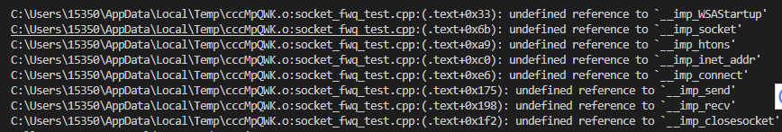
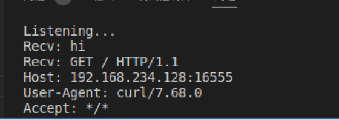
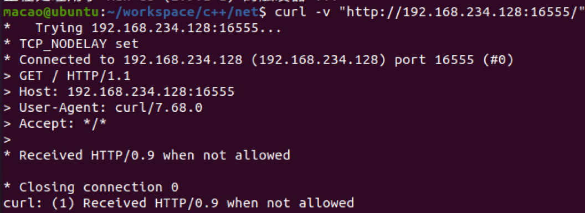
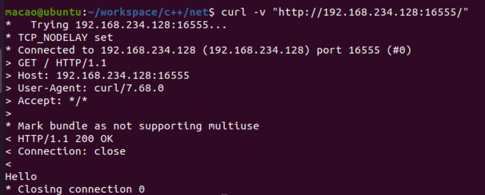

# 网络中进程之间的通信

网络层的“**ip地址**”可以唯一标识网络中的主机，而传输层的“**协议+端口**”可以唯一标识主机中的应用程序（进程）。这样利用三元组（ip地址，协议，端口）就可以标识网络的进程了，网络中的进程通信就可以利用这个标志与其它进程进行交互。

使用TCP/IP协议的应用程序通常采用应用编程接口：UNIX BSD的套接字（socket）和UNIX System V的TLI（已经被淘汰），来实现网络进程之间的通信。就目前而言，几乎所有的应用程序都是采用socket，而现在又是网络时代，网络中进程通信是无处不在，这就是我为什么说“一切皆socket”。

#  什么是Socket

一种特殊的文件，一些socket函数就是对其进行的操作（读/写IO、打开、关闭）

socket提供了流（stream）和数据报（datagram）两种通信机制，即流socket和数据报socket。

流socket基于TCP协议，是一个有序、可靠、双向字节流的通道，传输数据不会丢失、不会重复、顺序也不会错乱。就像两个人在打电话，接通后就在线了，您一句我一句的聊天。

数据报socket基于UDP协议，不需要建立和维持连接，可能会丢失或错乱。UDP不是一个可靠的协议，对数据的长度有限制，但是它的速度比较高。就像短信功能，一个人向另一个人发短信，对方不一定能收到。

在实际开发中，数据报socket的应用场景极少

# 客户/服务端模式


## 服务端的工作流程

1）创建服务端的socket。

2）把服务端用于通信的地址和端口绑定到socket上。

3）把socket设置为监听模式。

4）接受客户端的连接。

5）与客户端通信，接收客户端发过来的报文后，回复处理结果。

6）不断的重复第5）步，直到客户端断开连接。

7）关闭socket，释放资源。


# 实例

## 服务端

在linux虚拟机上运行的程序

```c++
#include<cstdio>
#include<cstring>
#include<cstdlib>
#include<sys/socket.h>
#include <sys/unistd.h>
#include <sys/types.h>
#include <sys/errno.h>
#include <netinet/in.h>
#include <signal.h>
#include <iostream>
using namespace std;
#define BUFFSIZE 2048
#define DEFAULT_PORT 16555    // 指定端口为16555
#define MAXLINK 2048
int sockfd, connfd;    // 定义服务端套接字和客户端套接字
void stopServerRunning(int p)
{
    close(sockfd);
    cout<<"Close Server"<<endl;
}
int main(){
    //存放ip和端口的数据结构
    struct sockaddr_in servaddr;
    char buff[BUFFSIZE];
    sockfd = socket(AF_INET,SOCK_STREAM,0);
    if(sockfd == -1)
    {
        cout<<"created socket error"<<errno<<strerror(errno)<<endl;
        return -1;
    }
     // 对应伪代码中的bind(sockfd, ip::port和一些配置);
    bzero(&servaddr, sizeof(servaddr));
    servaddr.sin_family = AF_INET;
    servaddr.sin_addr.s_addr = htonl(INADDR_ANY);
    servaddr.sin_port = htons(DEFAULT_PORT);
    if (-1 == bind(sockfd, (struct sockaddr*)&servaddr, sizeof(servaddr)))
    {
        printf("Bind error(%d): %s\n", errno, strerror(errno));
        return -1;
    }
    // END
    // 对应伪代码中的listen(sockfd);    
    if (-1 == listen(sockfd, MAXLINK))
    {
        printf("Listen error(%d): %s\n", errno, strerror(errno));
        return -1;
    }
    // END
    printf("Listening...\n");
    while (true)
    {
        signal(SIGINT, stopServerRunning);    // 这句用于在输入Ctrl+C的时候关闭服务器
        // 对应伪代码中的connfd = accept(sockfd);
        connfd = accept(sockfd, NULL, NULL);
        if (-1 == connfd)
        {
            printf("Accept error(%d): %s\n", errno, strerror(errno));
            return -1;
        }
        // END
        //将buff置为0只有在linux下可用
        bzero(buff, BUFFSIZE);
        // 对应伪代码中的recv(connfd, buff);
        recv(connfd, buff, BUFFSIZE - 1, 0);
        // END
        printf("Recv: %s\n", buff);
        // 对应伪代码中的send(connfd, buff);
        if(!strcmp(buff,"hi"))
        {
            char a[]="abc";
            send(connfd, a, strlen(a), 0);
        }
        else{
        send(connfd, buff, strlen(buff), 0);
        }
        // END
        // 对应伪代码中的close(connfd);
        close(connfd);
        // END
    }
    return 0;
}
```

解析：

```text
struct sockaddr_in servaddr;    // 定义一个IPv4套接字地址结构体
// ...
bzero(&servaddr, sizeof(servaddr));    // 将该结构体的所有数据置零
servaddr.sin_family = AF_INET;    // 指定其协议族为IPv4协议族
servaddr.sin_addr.s_addr = htonl(INADDR_ANY);    // 指定IP地址为通配地址
servaddr.sin_port = htons(DEFAULT_PORT);    // 指定端口号为16555
// 调用bind，注意第二个参数使用了类型转换，第三个参数直接取其sizeof即可
if (-1 == bind(sockfd, (struct sockaddr*)&servaddr, sizeof(servaddr)))
{
    printf("Bind error(%d): %s\n", errno, strerror(errno));
    return -1;
}
```

- 在指定IP地址的时候，一般就是使用像上面那样的方法指定为通配地址，此时就交由内核选择IP地址绑定。指定特定IP的操作在讲connect函数的时候会提到。
- 在指定端口的时候，可以直接指定端口号为0，此时表示端口号交由内核选择（也就是进程不指定端口号）。但一般而言对于服务器来说，不指定端口号的情况是很罕见的，因为服务器一般都需要暴露一个端口用于让客户端知道并作为连接的参数。
- 注意到不管是赋值IP还是端口，都不是直接赋值，而是使用了类似`htons()`或`htonl()`的函数，这便是**字节排序函数**。


### 字节排序函数

首先，不同的机子上对于多字节变量的字节存储顺序是不同的，有**大端字节序**和**小端字节序**两种。

那这就意味着，将机子A的变量原封不动传到机子B上，其值可能会发生变化（本质上数据没有变化，但如果两个机子的字节序不一样的话，解析出来的值便是不一样的）。这显然是不好的。

故我们需要引入一个通用的规范，称为**网络字节序**。引入网络字节序之后的传递规则就变为：

- 机子A先将变量由自身的字节序转换为网络字节序
- 发送转换后的数据
- 机子B接到转换后的数据之后，再将其由网络字节序转换为自己的字节序

其实就是很常规的**统一标准中间件**的做法。

在Linux中，位于`<netinet/in.h>`中有四个用于主机字节序和网络字节序之间相互转换的函数：

```text
#include <netinet/in.h>
uint16_t htons(uint16_t host16bitvalue);    //host to network, 16bit
uint32_t htonl(uint32_t host32bitvalue);    //host to network, 32bit
uint16_t ntohs(uint16_t net16bitvalue);     //network to host, 16bit
uint32_t ntohl(uint32_t net32bitvalue);     //network to host, 32bit
```

返回值

若成功则返回0，否则返回-1并置相应的`errno`。

比较常见的错误是错误码`EADDRINUSE`（"Address already in use"，地址已使用）。


## 客户端

```c++
#include <cstdio>
#include <cstring>
#include <cstdlib>
#include <iostream>
#include <winsock2.h>
#include <sys/unistd.h>
#include <sys/types.h>
#include <string.h>
#include <WS2tcpip.h> 
#pragma comment(lib, "ws2_32.lib") 
using namespace std;

#define BUFFSIZE 2048
#define SERVER_IP "192.168.234.128"    // 指定服务端的IP，记得修改为你的服务端所在的ip
#define SERVER_PORT 16555            // 指定服务端的port
int main()
{
    //加载Winsock库
    WORD sockVersion = MAKEWORD(2, 2);
    WSADATA data1;
    //初始化socket资源 
    if(WSAStartup(sockVersion,&data1)!=0)
    {
        printf("WSAStartup failed!\n");
        return -1;
    }
    SOCKET sockClient = socket(AF_INET,SOCK_STREAM,IPPROTO_TCP);
    if(sockClient == INVALID_SOCKET)
    {
        printf("socket failed!\n");
        return -1;
    }
    sockaddr_in addrSrv;
    addrSrv.sin_family = AF_INET;
    addrSrv.sin_port = htons(SERVER_PORT);
    addrSrv.sin_addr.S_un.S_addr = inet_addr(SERVER_IP);
    if(connect(sockClient,(sockaddr*)&addrSrv,sizeof(addrSrv))==SOCKET_ERROR)
    {
        printf("connect failed!\n");
        return -1;
    }
    string data;
    getline(cin,data);
    const char *sendData = data.c_str();
    send(sockClient,sendData,strlen(sendData),0);
    char recData[BUFFSIZE];
    int ret = recv(sockClient,recData,BUFFSIZE,0);
    if(ret == SOCKET_ERROR)
    {
        printf("recv failed!\n");
        return -1;
    }
    recData[ret] = '\0';
    printf("recv data:%s\n",recData);
    closesocket(sockClient);
}
```


出现错误



解决方案：

`cd "d:\workspace\c++ work\网络编程\" && g++ socket_fwq_test.cpp -lwsock32 -o socket_fwq_test && "d:\workspace\c++ work\网络编程\"socket_fwq_test`

在编译时加入-lwsock32 

解析：

释放方法

`WSACleanup(); `

# Socket基本操作

## socket函数

```c++
int socket(int domain ,int type , int protocol);
```

socket函数对应于普通文件的打开操作。普通文件的打开操作返回一个文件描述字，而**socket()**用于创建一个socket描述符（socket descriptor），它唯一标识一个socket。这个socket描述字跟文件描述字一样，后续的操作都有用到它，把它作为参数，通过它来进行一些读写操作。

正如可以给fopen的传入不同参数值，以打开不同的文件。创建socket的时候，也可以指定不同的参数创建不同的socket描述符，socket函数的三个参数分别为：

- domain：即协议域，又称为协议族（family）。常用的协议族有，AF_INET(IPv4协议族)、AF_INET6、AF_LOCAL（或称AF_UNIX，Unix域socket）、AF_ROUTE等等。协议族决定了socket的地址类型，在通信中必须采用对应的地址，如AF_INET决定了要用ipv4地址（32位的）与端口号（16位的）的组合、AF_UNIX决定了要用一个绝对路径名作为地址。
- type：指定socket类型。
  - `SOCK_STREAM`：**字节流套接字**，适用于TCP或SCTP协议
  - `SOCK_DGRAM`：**数据报套接字**，适用于UDP协议
  - `SOCK_SEQPACKET`：有序分组套接字，适用于SCTP协议
  - `SOCK_RAW`：原始套接字，适用于绕过传输层直接与网络层协议（IPv4/IPv6）通信

- protocol：故名思意，就是指定协议。
  - 常用的协议有，IPPROTO_TCP、IPPTOTO_UDP、IPPROTO_SCTP、IPPROTO_TIPC等，它们分别对应TCP传输协议、UDP传输协议、STCP传输协议、TIPC传输协议（这个协议我将会单独开篇讨论！）。
- 返回值
  - `socket`函数在成功时会返回套接字描述符，失败则返回-1。失败的时候可以通过输出`errno`来详细查看具体错误类型。
  - 一共有两种查看的方法：
    - 直接输出`errno`，根据输出的错误码进行Google搜索解决方案
    - 当然也可以直接翻man手册
    - 借助`strerror()`函数，使用`strerror(errno)`得到一个具体描述其错误的字符串。一般可以通过其描述定位问题所在，实在不行也可以拿这个输出去Google搜索解决方案

注意：并不是上面的type和protocol可以随意组合的，如SOCK_STREAM不可以跟IPPROTO_UDP组合。当protocol为0时，会自动选择type类型对应的默认协议。

当我们调用**socket**创建一个socket时，返回的socket描述字它存在于协议族（address family，AF_XXX）空间中，但没有一个具体的地址。如果想要给它赋值一个地址，就必须调用bind()函数，否则就当调用connect()、listen()时系统会自动随机分配一个端口。

## bind()函数

把一个地址簇中的特定地址给socket

AF_INET,AF_INET6就是把一个ipv4和ipv6地址和端口号组合赋给socket

```c++
int bind(int sockfd, const struct sockaddr *addr, socklen_t addrlen);
```

函数的三个参数分别为：

- sockfd：即socket描述字，它是通过socket()函数创建了，唯一标识一个socket。bind()函数就是将给这个描述字绑定一个名字。

- addr：一个const struct sockaddr *指针，指向要绑定给sockfd的协议地址。这个地址结构根据地址创建socket时的地址协议族的不同而不同，ipv4地址对于如下：

  ```c++
  struct sockaddr_in {
      sa_family_t    sin_family; /* address family: AF_INET */
      in_port_t      sin_port;   /* port in network byte order */
      struct in_addr sin_addr;   /* internet address */
  };
  
  /* Internet address. */
  struct in_addr {
      uint32_t       s_addr;     /* address in network byte order */
  };
  ```

- ipv6对应如下

```c++
struct sockaddr_in6 { 
    sa_family_t     sin6_family;   /* AF_INET6 */ 
    in_port_t       sin6_port;     /* port number */ 
    uint32_t        sin6_flowinfo; /* IPv6 flow information */ 
    struct in6_addr sin6_addr;     /* IPv6 address */ 
    uint32_t        sin6_scope_id; /* Scope ID (new in 2.4) */ 
};

struct in6_addr { 
    unsigned char   s6_addr[16];   /* IPv6 address */ 
};
```

- unix域对应是：

```
#define UNIX_PATH_MAX    108

struct sockaddr_un { 
    sa_family_t sun_family;               /* AF_UNIX */ 
    char        sun_path[UNIX_PATH_MAX];  /* pathname */ 
};
```

- addrlen：对应的是地址的长度。

通常服务器在启动的时候都会绑定一个众所周知的地址（如ip地址+端口号），用于提供服务，客户就可以通过它来接连服务器；而客户端就不用指定，有系统自动分配一个端口号和自身的ip地址组合。这就是为什么通常服务器端在listen之前会调用bind()，而客户端就不会调用，而是在connect()时由系统随机生成一个。

一般而言一个`sockaddr_in`结构对我们来说有用的字段就三个：

- `sin_family`
- `sin_addr`
- `sin_port`

## listen()、connect()函数

如果作为一个服务器，在调用socket()、bind()之后就会调用listen()来监听这个socket，如果客户端这时调用connect()发出连接请求，服务器端就会接收到这个请求。

```c++
int listen(int sockfd, int backlog);
int connect(int sockfd, const struct sockaddr *addr, socklen_t addrlen);
```

listen函数的第一个参数即为要监听的socket描述字，第二个参数为相应socket可以排队的最大连接个数。socket()函数创建的socket默认是一个主动类型的，listen函数将socket变为被动类型的，等待客户的连接请求。

关于backlog

一个**可调参数**。

其意义为，服务器套接字处于`LISTEN`状态下所维护的**未完成连接队列（SYN队列）**和**已完成连接队列(Accept队列)**的长度和的最大值。

↑ 这个是原本的意义，现在的`backlog`仅指**Accept队列的最大长度**，SYN队列的最大长度由系统的另一个变量决定。

这两个队列用于维护与客户端的连接，其中：

- 客户端发送的SYN到达服务器之后，服务端返回SYN/ACK，并将该客户端放置SYN队列中（第一次+第二次握手）
- 当服务端接收到客户端的ACK之后，完成握手，服务端将对应的连接从SYN队列中取出，放入Accept队列，等待服务器中的accept接收并处理其请求（第三次握手）

connect函数的第一个参数即为客户端的socket描述字，第二参数为服务器的socket地址，第三个参数为socket地址的长度。客户端通过调用connect函数来建立与TCP服务器的连接。

## accept()函数

TCP服务器端依次调用socket()、bind()、listen()之后，就会监听指定的socket地址了。TCP客户端依次调用socket()、connect()之后就想TCP服务器发送了一个连接请求。TCP服务器监听到这个请求之后，就会调用accept()函数取接收请求，这样连接就建立好了。之后就可以开始网络I/O操作了，即类同于普通文件的读写I/O操作。

```c++
int accept(int sockfd, struct sockaddr *addr, socklen_t *addrlen);
```

accept函数的第一个参数为服务器的socket描述字，第二个参数为指向struct sockaddr *的指针，用于返回客户端的协议地址，第三个参数为协议地址的长度。如果accpet成功，那么其返回值是由内核自动生成的一个全新的描述字，代表与返回客户的TCP连接。

注意：accept的第一个参数为服务器的socket描述字，是服务器开始调用socket()函数生成的，称为监听socket描述字；而accept函数返回的是已连接的socket描述字。一个服务器通常通常仅仅只创建一个监听socket描述字，它在该服务器的生命周期内一直存在。内核为每个由服务器进程接受的客户连接创建了一个已连接socket描述字，当服务器完成了对某个客户的服务，相应的已连接socket描述字就被关闭。

服务端调用bind函数的时候无需指定ip，但客户端调用connect函数的时候则需要指定服务端的ip。

在客户端的代码中，令套接字地址结构体指定ip的代码如下：

```text
inet_pton(AF_INET, SERVER_IP, &servaddr.sin_addr);
```

这个就涉及到**ip地址的表达格式与数值格式相互转换**的函数。

### IP地址格式转换函数

IP地址一共有两种格式：

- 表达格式：也就是我们能看得懂的格式，例如`"192.168.19.12"`这样的字符串
- 数值格式：可以存入套接字地址结构体的格式，数据类型为整型

显然，当我们需要将一个IP赋进套接字地址结构体中，就需要将其转换为数值格式。

在`<arpa/inet.h>`中提供了两个函数用于IP地址格式的相互转换：

```text
#include <arpa/inet.h>
int inet_pton(int family, const char *strptr, void *addrptr);
const char *inet_ntop(int family, const void *addrptr, char *strptr, size_t len);
```

其中：

- `inet_pton()`函数用于将IP地址从表达格式转换为数值格式

- 第一个参数指定协议族（`AF_INET`或`AF_INET6`）

- 第二个参数指定要转换的表达格式的IP地址

- 第三个参数指定用于存储转换结果的指针

- 对于返回结果而言：

- - 若转换成功则返回1
  - 若表达格式的IP地址格式有误则返回0
  - 若出错则返回-1

- `inet_ntop()`函数用于将IP地址从数值格式转换为表达格式

- 第一个参数指定协议族

- 第二个参数指定要转换的数值格式的IP地址

- 第三个参数指定用于存储转换结果的指针

- 第四个参数指定第三个参数指向的空间的大小，用于防止缓存区溢出

- - 第四个参数可以使用预设的变量：

```text
#include <netinet/in.h>
#define INET_ADDRSTRLEN    16  // IPv4地址的表达格式的长度
#define INET6_ADDRSTRLEN 46    // IPv6地址的表达格式的长度
```

- 对于返回结果而言

- - 若转换成功则返回指向返回结果的指针
  - 若出错则返回NULL

返回值

若成功则返回0，否则返回-1并置相应的`errno`。

其中connect函数会出错的几种情况：

- 若客户端在发送SYN包之后长时间没有收到响应，则返回`ETIMEOUT`错误

- - 一般而言，如果长时间没有收到响应，客户端会重发SYN包，若超过一定次数重发仍没响应的话则会返回该错误

  - 可能的原因是目标服务端的IP地址不存在

    

- 若客户端在发送SYN包之后收到的是RST包的话，则会立刻返回`ECONNREFUSED`错误

- - 当客户端的SYN包到达目标机之后，但目标机的对应端口并没有正在`LISTEN`的套接字，那么目标机会发一个RST包给客户端

  - 可能的原因是目标服务端没有运行，或者没运行在客户端知道的端口上

    

- 若客户端在发送SYN包的时候在中间的某一台路由器上发生ICMP错误，则会发生`EHOSTUNREACH`或`ENETUNREACH`错误

- - 事实上跟处理未响应一样，为了排除偶然因素，客户端遇到这个问题的时候会保存内核信息，隔一段时间之后再重发SYN包，在多次发送失败之后才会报错
  - 路由器发生ICMP错误的原因是，路由器上根据目标IP查找转发表但查不到针对目标IP应该如何转发，则会发生ICMP错误
  - 可能的原因是目标服务端的IP地址不可达，或者路由器配置错误，也有可能是因为电波干扰等随机因素导致数据包错误，进而导致路由无法转发


由于connect函数在发送SYN包之后就会将自身的套接字从`CLOSED`状态置为`SYN_SENT`状态，故当connect报错之后需要主动将套接字状态置回`CLOSED`。此时需要通过调用close函数主动关闭套接字实现。

故原版的客户端代码需要做一个修改：

```text
if (-1 == connect(sockfd, (struct sockaddr*)&servaddr, sizeof(servaddr)))
{
    printf("Connect error(%d): %s\n", errno, strerror(errno));
    close(sockfd);        // 新增代码，当connect出错时需要关闭套接字
    return -1;
}
```

在Windows下：

` addrSrv.sin_addr.S_un.S_addr = inet_addr(SERVER_IP);`

## read()、write()等函数


服务器与客户已经建立好连接了。可以调用网络I/O进行读写操作了，即实现了网咯中不同进程之间的通信！网络I/O操作有下面几组：

- read()/write() (linux下)
- recv()/send()(windows下)
- readv()/writev()
- recvmsg()/sendmsg()
- recvfrom()/sendto()

我推荐使用recvmsg()/sendmsg()函数，这两个函数是最通用的I/O函数，实际上可以把上面的其它函数都替换成这两个函数。它们的声明如下：

```c++
#include <unistd.h>

ssize_t read(int fd, void *buf, size_t count);
ssize_t write(int fd, const void *buf, size_t count);

#include <sys/types.h>
#include <sys/socket.h>

ssize_t send(int sockfd, const void *buf, size_t len, int flags);
ssize_t recv(int sockfd, void *buf, size_t len, int flags);
ssize_t sendto(int sockfd, const void *buf, size_t len, int flags,
const struct sockaddr *dest_addr, socklen_t addrlen);
ssize_t recvfrom(int sockfd, void *buf, size_t len, int flags,
struct sockaddr *src_addr, socklen_t *addrlen);
 ssize_t sendmsg(int sockfd, const struct msghdr *msg, int flags);
ssize_t recvmsg(int sockfd, struct msghdr *msg, int flags);
```

read函数是负责从fd中读取内容.当读成功时，read返回实际所读的字节数，如果返回的值是0表示已经读到文件的结束了，小于0表示出现了错误。如果错误为EINTR说明读是由中断引起的，如果是ECONNREST表示网络连接出了问题。

write函数将buf中的nbytes字节内容写入文件描述符fd.成功时返回写的字节数。失败时返回-1，并设置errno变量。 在网络程序中，当我们向套接字文件描述符写时有俩种可能。1)write的返回值大于0，表示写了部分或者是全部的数据。2)返回的值小于0，此时出现了错误。我们要根据错误类型来处理。如果错误为EINTR表示在写的时候出现了中断错误。如果为EPIPE表示网络连接出现了问题(对方已经关闭了连接)。

其它的我就不一一介绍这几对I/O函数了，具体参见man文档或者baidu、Google，下面的例子中将使用到send/recv。

## accept函数

根据上一节所述，该函数用于跟客户端建立连接，并返回客户端套接字。

更准确的说，accept函数由TCP服务器调用，用于从**Accept队列**中pop出一个已完成的连接。若Accept队列为空，则accept函数所在的进程阻塞。

该函数的原型如下：

```text
#include <sys/socket.h>
int accept(int sockfd, struct sockaddr *cliaddr, socklen_t *addrlen);
```

其中第一个参数为服务端自身的套接字，第二个参数用于接收客户端的套接字地址结构体，第三个参数用于接收第二个参数的结构体的长度。

返回值

当accept函数成功拿到一个已完成连接时，其会返回该连接对应的**客户端套接字描述符**，用于后续的数据传输。

若发生错误则返回-1并置相应的`errno`。

## recv函数&send函数

recv函数用于通过套接字接收数据，send函数用于通过套接字发送数据

这两个函数的原型如下：

```text
#include <sys/socket.h>
ssize_t recv(int sockfd, void *buff, size_t nbytes, int flags);
ssize_t send(int sockfd, const void *buff, size_t nbytes, int flags);
```

其中：

- 第一个参数为要读写的套接字
- 第二个参数指定要接收数据的空间的指针（recv）或要发送的数据（send）
- 第三个参数指定最大读取的字节数（recv）或发送的数据的大小（send）
- 第四个参数用于设置一些参数，默认为0
- 目前用不到第四个参数，故暂时不做展开

事实上，去掉第四个参数的情况下，recv跟read函数类似，send跟write函数类似。这两个函数的本质也是一种通过描述符进行的IO，只是在这里的描述符为套接字描述符。

返回值

在recv函数中：

- 若成功，则返回所读取到的字节数
- 否则返回-1，置`errno`

在send函数中：

- 若成功，则返回成功写入的字节数
- 事实上，当返回值与`nbytes`不等时，也可以认为其出错。
- 否则返回-1，置`errno`


## close()函数

在服务器与客户端建立连接之后，会进行一些读写操作，完成了读写操作就要关闭相应的socket描述字，好比操作完打开的文件要调用fclose关闭打开的文件。

```c++
#include <unistd.h>
int close(int fd);
```

close一个TCP socket的缺省行为时把该socket标记为以关闭，然后立即返回到调用进程。该描述字不能再由调用进程使用，也就是说不能再作为read或write的第一个参数。

注意：close操作只是使相应socket描述字的引用计数-1，只有当引用计数为0的时候，才会触发TCP客户端向服务器发送终止连接请求。

# socket中TCP的三次握手建立连接详解

大致流程如下：

- 客户端向服务器发送一个SYN J
- 服务器向客户端响应一个SYN K，并对SYN J进行确认ACK J+1
- 客户端再想服务器发一个确认ACK K+1


从图中可以看出，当客户端调用connect时，触发了连接请求，向服务器发送了SYN J包，这时connect进入阻塞状态；服务器监听到连接请求，即收到SYN J包，调用accept函数接收请求向客户端发送SYN K ，ACK J+1，这时accept进入阻塞状态；客户端收到服务器的SYN K ，ACK J+1之后，这时connect返回，并对SYN K进行确认；服务器收到ACK K+1时，accept返回，至此三次握手完毕，连接建立。

总结：客户端的connect在三次握手的第二个次返回，而服务器端的accept在三次握手的第三次返回。

# socket中TCP的四次握手释放连接详解


图示过程如下：

- 某个应用进程首先调用close主动关闭连接，这时TCP发送一个FIN M；
- 另一端接收到FIN M之后，执行被动关闭，对这个FIN进行确认。它的接收也作为文件结束符传递给应用进程，因为FIN的接收意味着应用进程在相应的连接上再也接收不到额外数据；
- 一段时间之后，接收到文件结束符的应用进程调用close关闭它的socket。这导致它的TCP也发送一个FIN N；
- 接收到这个FIN的源发送端TCP对它进行确认。

这样每个方向上都有一个FIN和ACK。

# http服务器

## http返回串

```text
协议版本 状态码 状态描述 //状态行
字段名:字段值       //消息报头
字段名:字段值       //消息报头
...
字段名:字段值       //消息报头
响应正文           //可选
```

状态码有如下的几种：

- 1xx：指示信息，表示请求已接收，继续处理
- 2xx：成功，表示请求已被成功接收、理解、接受
- 3xx：重定向，要完成请求必须进行更进一步的操作
- 4xx：客户端错误，请求有语法错误或请求无法实现
- 5xx：服务器端错误，服务器未能实现合法的请求

比较常见的就有200（OK），404（Not Found），502（Bad Gateway）。







加入成功返回

```c++
void setResponse(char *buff) 
{  
bzero(buff, sizeof(buff)); 
 strcat(buff, "HTTP/1.1 200 OK\r\n"); 
 strcat(buff, "Connection: close\r\n"); 
 strcat(buff, "\r\n"); 
 strcat(buff, "Hello\n"); 
}
```





# 网络编程中的常见问题


> [网络编程十宗罪_ithewei的博客-CSDN博客_多线程收发网络包会串包吗](https://hewei.blog.csdn.net/article/details/121313149)

## tcp粘包和分包

tcp是流式协议，创建tcp套接字的类型为SOCK_STREAM

解决方案：

1、使用流式解析器保存当前状态，如http-parser使用流式解析

2、使用缓存push接受到数据，判断接受到完整的一帧数据在pop取出进行处理


> 开源库libhv中通过hio_set_unpack设置拆包规则，支持固定包长，分隔符，头部长度字段三种常见的拆包方式，调用该接口设置拆包规则后，内部会根据拆包规则处理粘包与分包，保证回调上来是完整的数据，节省上层处理粘包与分包的成本

