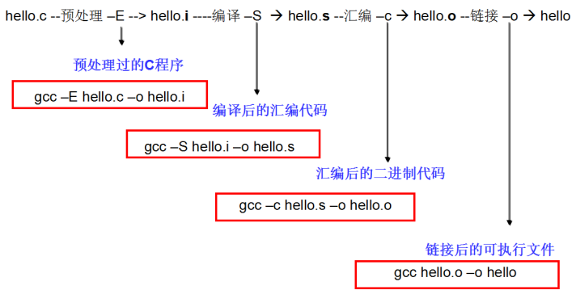

# QThread类

简述

QThread类提供了与系统无关的线程。

**QThread代表在程序中一个单独的线程控制。线程在run()中开始执行，默认情况下，run()通过调用exec()启动事件循环并在线程里运行一个Qt的事件循环。**

详细描述

QThread类可以不受平台影响而实现线程。**QThread提供在程序中可以控制和管理线程的多种成员函数和信号/槽。通过QThread类的成员函数start()启动线程。**

**QThread通过信号函数started()和finished()通知开始和结束，并查看线程状态；可以使用isFinished()和isRunning()来查询线程的状态；使用函数exit()和quit()可以结束线程。**

**如果使用多线程，有时需要等到所有线程终止。此时，使用函数wait()即可。线程中，使用成员函数sleep()、msleep()和usleep()可以暂停秒、毫秒及微秒单位的线程。**

一般情况下，wait()和sleep()函数应该不需要，因为Qt是一个事件驱动型框架。考虑监听finished()信号来取代wait()，使用QTimer来取代sleep()。

**静态函数currentThreadId()和currentThread()返回标识当前正在执行的线程。前者返回该线程平台特定的ID，后者返回一个线程指针。**

要设置线程的名称，可以在启动线程之前调用setObjectName()。如果不调用setObjectName()，线程的名称将是线程对象的运行时类型（QThread子类的类名）。

- QObject::moveToThread()
- 继承QThread类

继承QThread类

方法描述

- 自定义一个继承QThread的类MyThread，重载MyThread中的run()函数，在run()函数中写入需要执行的工作；
- 调用start()函数来启动线程。


# qt消息传输机制

监听全局事件

监听某一类控件事件

监听某一个控件的事件


# new与malloc区别


# 右值和右值引用

- 左值持久，右值短暂
- 凡是有名字的都是左值，变量都是左值
  - 类型为右值引用的变量本身是个左值（下面有例子）
- 返回值的函数返回的都是右值
- 右值不能被绑定到左值引用，左值也不能被绑定到右值引用


引用数据的别名





函数制作的作用就是提供不同实现的统一接口，

利于系统抽象


左值一定在内存中，右值有可能在内存中也有可能在寄存器中

```cpp
int a=5；
int b=a;//此时a在内存中
int a=5；
int b=a+1;//此时a+1在寄存器中
int *p=&a;//此时&a在寄存器中
```

在C++11中可以取地址的、有名字的就是左值，反之，不能取地址的、没有名字的就是右值（将亡值或纯右值）。


左值引用就是对一个左值进行引用的类型。右值引用就是对一个右值进行引用的类型。右值引用和左值引用都是属于引用类型。无论是声明一个左值引用还是右值引用，都必须立即进行初始化。而其原因可以理解为是引用类型本身自己并不拥有所绑定对象的内存，只是该对象的一个别名。左值引用是具名变量值的别名，而右值引用则是不具名（匿名）变量的别名。

左值引用通常也不能绑定到右值，但常量左值引用是个“万能”的引用类型。它可以接受非常量左值、常量左值、右值对其进行初始化。不过常量左值所引用的右值在它的“余生”中只能是只读的。相对地，非常量左值只能接受非常量左值对其进行初始化。

```c++
int &a = 2;       # 左值引用绑定到右值，编译失败
 
int b = 2;        # 非常量左值
const int &c = b; # 常量左值引用绑定到非常量左值，编译通过
const int d = 2;  # 常量左值
const int &e = c; # 常量左值引用绑定到常量左值，编译通过
const int &b =2;  # 常量左值引用绑定到右值，编程通过
```

右值值引用通常不能绑定到任何的左值，要想绑定一个左值到右值引用，通常需要std::move()将左值强制转换为右值


# c++类可以嵌套

内部类

作用域只能是上一层的类

和嵌套类


static关键字

- **对局部变量的作用**

- 延长局部变量的生命周期,从程序启动到程序退出,但是它并没有改变变量的作用域
- 定义变量的代码在整个程序运行期间仅仅会执行一次

- **对全局变量的作用**
- 全局变量分类：
- 内部变量:只能在本文件中访问的变量
- 外部变量:可以在其他文件中访问的变量,默认所有全局变量都是外部变量
- 默认情况下多个同名的全局变量共享一块空间, 这样会导致全局变量污染问题
- 如果想让某个全局变量只在某个文件中使用, 并且不和其他文件中同名全局变量共享同一块存储空间, 那么就可以使用static

extern

- 对全局变量的作用
- 声明一个全局变量, 代表告诉编译器我在其它地方定义了这个变量, 你可以放心使用


# c++多线程

一、四种方式

  1、线程自然return返回。

​     如果线程能够返回，就可以确保下列事项的实现：
​         （1）在线程函数中创建的所有C++对象均将通过它们的[析构函数](https://so.csdn.net/so/search?q=析构函数&spm=1001.2101.3001.7020)正确地释放。
​         （2）操作系统将正确地释放线程堆栈使用的[内存](https://so.csdn.net/so/search?q=内存&spm=1001.2101.3001.7020)。
​         （3）系统将线程的退出代码（在线程的内核对象中维护）设置为线程函数的返回值。
​         （4）系统将递减线程内核对象的使用计数。

  2、调用 _endthreadex()函数或 ExitThread()函数。

  3、在同一个进程的另一个线程中调用 TerminateThread()函数。

  4、如果该线程位于某进程， 且该进程仅有这一个线程， 可直接结束进程以结束此线程。


signal

在signal函数中，有两个形参，分别代表需要处理的信号编号值和处理信号函数的指针


# 常用的智能指针

C++中智能指针的实现主要依赖于两个技术概念：

1、析构函数，对象被销毁时会被调用的一个函数，对于基于栈的对象而言，如果对象离开其作用域则对象会被自动销毁，而此时析构函数也自动会被调用。

2、引用计数技术，维护一个计数器用于追踪资源(如内存)的被引用数，当资源被引用时，计数器值加1，当资源被解引用时，计算器值减1。

3、操作符重载。

智能指针的大致实现原理就是在析构函数中，检查所引用对象的引用计数，如果引用计数为0，则真正释放该对象内存
-----------------------------------
©著作权归作者所有：来自51CTO博客作者bandaoyu的原创作品，请联系作者获取转载授权，否则将追究法律责任
【C++】智能指针的原理和实现
https://blog.51cto.com/liangchaoxi/4055018

## shared_ptr

实现原理：采用引用计数器的方法，允许多个智能指针指向同一个对象，每当多一个指针指向该对象，指向该该对象的所有智能指针内部的引用计数加1，每当减少一个智能指针指向对象时，引用计数会减一，当计数为0的时候会自动释放动态分配的资源

- 智能指针将一个计数器与类指向的对象相关联，引用计数器跟踪共有多少个类对象共享同一指针
- 每次创建类的新对象时，初始化指针并将引用计数置为1
- 当对象作为另一对象的副本而创建时，拷贝构造函数拷贝指针并增加与之相应的引用计数
- 对一个对象进行赋值时，赋值操作符减少左操作数所指对象的引用计数（如果引用计数为减至0，则删除对象），并增加右操作数所指对象的引用计数
- 调用析构函数时，构造函数减少引用计数（如果引用计数减至0，则删除基础对象）

## unique_ptr

unique_ptr采用的是独享所有权语义，一个非空的unique_ptr总是拥有它所指向的资源。转移一个unique_ptr将会把所有权全部从源指针转移给目标指针，源指针被置空；所以unique_ptr不支持普通的拷贝和赋值操作，不能用在STL标准容器中；局部变量的返回值除外（因为编译器知道要返回的对象将要被销毁）；如果你拷贝一个unique_ptr，那么拷贝结束后，这两个unique_ptr都会指向相同的资源，造成在结束时对同一内存指针多次释放而导致程序崩溃。

## weak_ptr

weak_ptr：弱引用。 引用计数有一个问题就是互相引用形成环（环形引用），这样两个指针指向的内存都无法释放。需要使用weak_ptr打破环形引用。weak_ptr是一个弱引用，它是为了配合shared_ptr而引入的一种智能指针，它指向一个由shared_ptr管理的对象而不影响所指对象的生命周期，也就是说，它只引用，不计数。如果一块内存被shared_ptr和weak_ptr同时引用，当所有shared_ptr析构了之后，不管还有没有weak_ptr引用该内存，内存也会被释放。所以weak_ptr不保证它指向的内存一定是有效的，在使用之前使用函数lock()检查weak_ptr是否为空指针。

## auto_ptr

主要是为了解决“有异常抛出时发生内存泄漏”的问题 。因为发生异常而无法正常释放内存。

auto_ptr有拷贝语义，拷贝后源对象变得无效，这可能引发很严重的问题；而unique_ptr则无拷贝语义，但提供了移动语义，这样的错误不再可能发生，因为很明显必须使用std::move()进行转移。

auto_ptr不支持拷贝和赋值操作，不能用在STL标准容器中。STL容器中的元素经常要支持拷贝、赋值操作，在这过程中auto_ptr会传递所有权，所以不能在STL中使用。


# [HTTP请求和响应报文有哪些主要字段？](https://interviewguide.cn/#/Doc/Knowledge/计算机网络/计算机网络?id=23、http请求和响应报文有哪些主要字段？)

## [请求报文](https://interviewguide.cn/#/Doc/Knowledge/计算机网络/计算机网络?id=请求报文)

简单来说：

- 请求行：Request Line
- 请求头：Request Headers
- 请求体：Request Body

## [响应报文](https://interviewguide.cn/#/Doc/Knowledge/计算机网络/计算机网络?id=响应报文)

简单来说：

- 状态行：Status Line
- 响应头：Response Headers
- 响应体：Response Body

使用 Session 维护用户登录状态的过程如下：

1. 用户进行登录时，用户提交包含用户名和密码的表单，放入 HTTP 请求报文中；
2. 服务器验证该用户名和密码，如果正确则把用户信息存储到 Redis 中，它在 Redis 中的 Key 称为 Session ID；
3. 服务器返回的响应报文的 Set-Cookie 首部字段包含了这个 Session ID，客户端收到响应报文之后将该 Cookie 值存入浏览器中；
4. 客户端之后对同一个服务器进行请求时会包含该 Cookie 值，服务器收到之后提取出 Session ID，从 Redis 中取出用户信息，继续之前的业务操作。


| 协议   | 名称                       | 默认端口       | 底层协议                                                  |
| :----- | :------------------------- | :------------- | :-------------------------------------------------------- |
| HTTP   | 超文本传输协议             | 80             | TCP                                                       |
| HTTPS  | 超文本传输安全协议         | 443            | TCP                                                       |
| Telnet | 远程登录服务的标准协议     | 23             | TCP                                                       |
| FTP    | 文件传输协议               | 20传输和21连接 | TCP                                                       |
| TFTP   | 简单文件传输协议           | 69             | UDP                                                       |
| SMTP   | 简单邮件传输协议（发送用） | 25             | TCP                                                       |
| POP    | 邮局协议（接收用）         | 110            | TCP                                                       |
| DNS    | 域名解析服务               | 53             | 服务器间进行域传输的时候用TCP 客户端查询DNS服务器时用 UDP |

cookie弥补了http无状态的不足，让服务器知道来的人是“谁”；但是cookie以文本的形式保存在本地，自身安全性较差；所以我们就通过cookie识别不同的用户，对应的在session里保存私密的信息以及超过4096字节的文本。


mvcc多版本并发控制

3个隐式字段、undo日志 、Read View

\1. 隐藏列：InnoDB中每行数据都有隐藏列，隐藏列中包含了本行数据的事务id、指向undo log的指针等。 2. 基于undo log的版本链：每行数据的隐藏列中包含了指向undo log的指针，而每条undo log也会指向更早版本的undo log，从而形成一条版本链。 3. ReadView：通过隐藏列和版本链，MySQL可以将数据恢复到指定版本。但是具体要恢复到哪个版本，则需要根据ReadView来确定。所谓ReadView，是指事务（记做事务A）在某一时刻给整个事务系统（trx_sys）打快照，之后再进行读操作时，会将读取到的数据中的事务id与trx_sys快照比较，从而判断数据对该ReadView是否可见，即对事务A是否可见


大端还是小端

定义联合体 short 和char类型

# 三次四次


