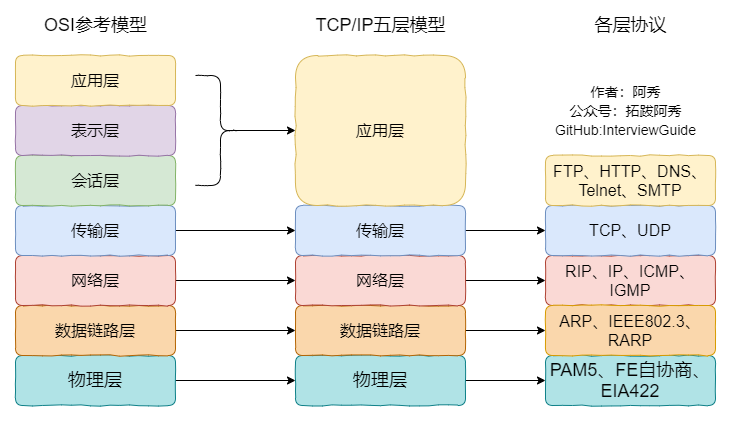

# QThread类

简述

QThread类提供了与系统无关的线程。

**QThread代表在程序中一个单独的线程控制。线程在run()中开始执行，默认情况下，run()通过调用exec()启动事件循环并在线程里运行一个Qt的事件循环。**

详细描述

QThread类可以不受平台影响而实现线程。**QThread提供在程序中可以控制和管理线程的多种成员函数和信号/槽。通过QThread类的成员函数start()启动线程。**

**QThread通过信号函数started()和finished()通知开始和结束，并查看线程状态；可以使用isFinished()和isRunning()来查询线程的状态；使用函数exit()和quit()可以结束线程。**

**如果使用多线程，有时需要等到所有线程终止。此时，使用函数wait()即可。线程中，使用成员函数sleep()、msleep()和usleep()可以暂停秒、毫秒及微秒单位的线程。**

一般情况下，wait()和sleep()函数应该不需要，因为Qt是一个事件驱动型框架。考虑监听finished()信号来取代wait()，使用QTimer来取代sleep()。

**静态函数currentThreadId()和currentThread()返回标识当前正在执行的线程。前者返回该线程平台特定的ID，后者返回一个线程指针。**

要设置线程的名称，可以在启动线程之前调用setObjectName()。如果不调用setObjectName()，线程的名称将是线程对象的运行时类型（QThread子类的类名）。

- QObject::moveToThread()
- 继承QThread类

继承QThread类

方法描述

- 自定义一个继承QThread的类MyThread，重载MyThread中的run()函数，在run()函数中写入需要执行的工作；
- 调用start()函数来启动线程。


# qt消息传输机制

监听全局事件

监听某一类控件事件

监听某一个控件的事件


[QT-事件循环机制 - 掘金 (juejin.cn)](https://juejin.cn/post/6844904130838806535)


# sizeof和strlen的区别

sizeof 是运算符，strlen 是函数。

sizeof 运算符：计算所占的字节大小

strlen函数： 字符串的具体长度即字符个数


sizeof 可以用类型做参数，**strlen** 只能用 **char\*** 做参数，且必须是以 \0 结尾的。

strlen 的结果要在运行的时候才能计算出来，是用来计算字符串的长度，不是类型占内存的大小。

1. sizeof()是运算符，strlen()是库函数
2. sizeof()在编译时计算好了，strlen()在运行时计算
3. sizeof()计算出对象使用的最大字节数，strlen()计算字符串的实际长度
4. sizeof()的参数类型多样化（数组，指针，对象，函数都可以），strlen()的参数必须是字符型指针（传入数组时自动退化为指针）


# new与malloc区别


new 和 malloc 的区别 - new 是操作符，而 malloc 是函数； - 使用 new 操作符申请内存分配时无须指定内存块的大小，编译器会根据类型信息自行计算，而 malloc 则需要显式地指出所需内存的尺寸； - new 分配失败的时候会直接抛出异常，malloc 分配失败会返回 NULL； - 对于非简单类型，new 在分配内存后，会调用构造函数，而 malloc 不会； - new 分配成功后会返回对应类型的指针，而 malloc 分配成功后会返回 void * 类型； - malloc 可以分配任意字节，new 只能分配实例所占内存的整数倍数大小； - new 可以被重载，而 malloc 不能被重载； - new 操作符从自由存储区上分配内存空间，而 malloc 从堆上动态分配内存； - 使用 malloc 分配的内存后，如果在使用过程中发现内存不足，可以使用 realloc 函数进行内存重新分配实现内存的扩充，new 没有这样直观的配套设施来扩充内存。

malloc() 的整体思想是先向操作系统申请一块大小适当的内存，然后自己管理，即内存池。 malloc() 分配空间有一个数据结构，允许它来区分边界，区分已分配和空闲的空间，数据结构中包含一个头部信息和有效载荷，有效载荷的首地址就是 malloc() 返回的地址，可能在尾部还有填充，为了保持内存对齐。头部相当于该数据结构的元数据，其中包含了块大小和是否是空闲空间的信息，这样可以根据头地址和块大小的地址推出下一个内存块的地址，这就是隐式链表。 malloc() 基本的实现原理就是维护一个内存空闲链表，当申请内存空间时，搜索内存空闲链表，找到适配的空闲内存空间，然后将空间分割成两个内存块，一个变成分配块，一个变成新的空闲块。如果没有搜索到，那么就会调用 sbrk() 推进 brk 指针来申请内存空间。搜索空闲块最常见的算法有：首次适配，下一次适配，最佳适配。 - 首次适配：第一次找到足够大的内存块就分配，这种方法会产生很多的内存碎片。 - 下一次适配：也就是说等第二次找到足够大的内存块就分配，这样会产生比较少的内存碎片。 - 最佳适配：对堆进行彻底的搜索，从头开始遍历所有块，使用数据区大小大于 size 且差值最小的块作为此次分配的块。 在释放内存块后，如果不进行合并，那么相邻的空闲内存块还是相当于两个内存块，会形成一种假碎片。所以当释放内存后，需要将两个相邻的内存块进行合并。 还有一种实现方式则是采用显示空闲链表，这个是真正的链表形式。在之前的有效载荷中加入了前驱和后驱的指针，也可以称为双向链表。维护空闲链表的的方式第一种是用后进先出（LIFO），将新释放的块放置在链表的开始处。另一种方法是按照地址的顺序来维护。


# const和define区别 static

 const 在 C 语言中表示只读，编译器禁止对它修饰的变量进行修改，在 C++ 中增加了常量的语义。而 define 用于定义宏，而宏也可以用于定义常量。它们的区别有：

1. const 生效于编译阶段，而 define 生效于预处理阶段； 
2. 2. define只是简单的字符串替换，没有类型检查，而 const 有对应的数据类型，编译器要进行判断的，可以避免一些低级的错误； 3. 用 define 定义的常量是不可以用指针变量去指向的，用 const 定义的常量是可以用指针去指向该常量的地址的； 4. define 不分配内存，给出的是立即数，有多少次使用就进行多少次替换，在内存中会有多个拷贝，消耗内存大，const 在静态存储区中分配空间，在程序运行过程中内存中只有一个拷贝； 5. 可以对 const 常量进行调试，但是不能对宏常量进行调试。

static:规定作用域和存储方式（静态存储），对于局部变量，static规定其静态存储方式每次调用为上一次调用后的值，调用结束后存储空间不释放，对于全局变量，以文件划分作用域的话，此变量只在当前文件可见，static函数也是一样，static为初始化默认值为0  好处共享

const修饰全局变量为只读不可修改 常量的概念

要在文件外访问需要extern关键字


static修饰成员函数，静态成员函数，为所有类对象所共享，不属于某一实例

静态成员变量必须在类外定义，定义是不添加static关键字，不能访问任何非静态成员


# vector和list区别

\1. 区别 - vector 底层实现是数组，list 是双向链表 - vector 支持随机访问，list 不支持 - vector 是顺序内存，list 不是 - vector 在中间节点进行插入删除会导致内存拷贝，list 不会 - vector 一次性分配好内存，不够时才进行扩容，list 每次插入新节点都会进行内存申请 - vector 随机访问性能好，插入删除性能差，list 随机访问性能差，插入删除性能好 2. 适用场景 - vecto r拥有一段连续的内存空间，因此支持随机访问，如果需要高效的随即访问，而不在乎插入和删除的效率，使用 vector。 - list 拥有一段不连续的内存空间，如果需要高效的插入和删除，而不关心随机访问，则应使用list。


resize()：改变当前容器内含有元素的数量(size())，eg: vectorv; v.resize(len);v的size变为len,如果原来v的size小于len，那么容器新增（len-size）个元素，元素的值为默认为0.当v.push_back(3);之后，则是3是放在了v的末尾，即下标为len，此时容器是size为len+1；
reserve()：改变当前容器的最大容量（capacity）,它不会生成元素，只是确定这个容器允许放入多少对象，如果reserve(len)的值大于当前的capacity()，那么会重新分配一块能存len个对象的空间，然后把之前v.size()个对象通过copy construtor复制过来，销毁之前的内存；


# c和c++区别

## 区别

1、文件区别：C源文件后缀 .c；C++源文件后缀 .cpp

2、返回值： C默认返回int型 ；C++ 若无返回值，必须指定为void

3、参数列表：C默认接收多个参数；C++默认为void，不接收任何参数

4、缺省参数：C不支持给函数参数指定默认值；C++支持

5、C++支持函数重载，C不支持

（而C++支持重载的依仗就在于C++的名字修饰与C不同，例如在C++中函数int fun(int ,int)经过名字修饰之后变为 _fun_int_int ,而C是_fun，一般是这样的，所以C++才会支持不同的参数调用不同的函数；）

6、C指针；C++多了引用

7、C是面向过程的，C++是面向对象的。

8、结构：C中的struct和C++的类，C++的类是C所没有的，但是C中的struct是可以在C++中正常使用的，并且C++对struct进行了进一步的扩展，C语言结构只有成员变量没有成员方法，C++结构有自己的成员变量和成员函数。使struct在C++中可以和class一样当做类使用，struct的成员默认访问修饰符是public,而class默认的是private;

9、动态管理内存：C是使用malloc/free函数，C++除此之外还有new/delete关键字

10、C++全部变量的默认链接属性是外链接，而C是内连接；

11、C中用const修饰的变量不可以用在定义数组时的大小，但是C++用const修饰的变量可以（如果不进行&,解引用的操作的话，是存放在符号表的，不开辟内存）；


# 虚函数

[1](./c++/基本问题.md)


(2)虚函数(virtual)具有传递性，即子类中对父类的虚函数的重写，也是一个虚函数 ，不过函数的参数表也要一样。

　(3)可以让成员函数操作一般化，用基类的指针指向不同的派生类的对象时，基类指针调用其虚成员函数，则会调用其真正指向对象的成员函数，而不是基类中定义的成员函数(只要派生类改写了该成员函数)。若不是虚函数，则不管基类指针指向的哪个派生类对象，调用时都会调用基类中定义的那个函数。

在基类的函数前加上**virtual**关键字，在派生类中重写该函数，运行时将会根据所指对象的实际类型来调用相应的函数，如果对象类型是派生类，就调用派生类的函数，如果对象类型是基类，就调用基类的函数。

虚表：虚函数表的缩写，类中含有virtual关键字修饰的方法时，编译器会自动生成虚表

虚表指针：在含有虚函数的类实例化对象时，对象地址的前四个字节存储的指向虚表的指针

实现多态的过程：

**（1）**编译器在发现基类中有虚函数时，会自动为每个含有虚函数的类生成一份虚表，该表是一个一维数组，虚表里保存了虚函数的入口地址

**（2）**编译器会在每个对象的前四个字节中保存一个虚表指针，即**vptr**，指向对象所属类的虚表。在构造时，根据对象的类型去初始化虚指针vptr，从而让vptr指向正确的虚表，从而在调用虚函数时，能找到正确的函数

**（3）**所谓的合适时机，在派生类定义对象时，程序运行会自动调用构造函数，在构造函数中创建虚表并对虚表初始化。在构造子类对象时，会先调用父类的构造函数，此时，编译器只“看到了”父类，并为父类对象初始化虚表指针，令它指向父类的虚表；当调用子类的构造函数时，为子类对象初始化虚表指针，令它指向子类的虚表

**（4）**当派生类对基类的虚函数没有重写时，派生类的虚表指针指向的是基类的虚表；当派生类对基类的虚函数重写时，派生类的虚表指针指向的是自身的虚表；当派生类中有自己的虚函数时，在自己的虚表中将此虚函数地址添加在后面

这样指向派生类的基类指针在运行时，就可以根据派生类对虚函数重写情况动态的进行调用，从而实现多态性。


# 右值和右值引用

- 左值持久，右值短暂
- 凡是有名字的都是左值，变量都是左值
  - 类型为右值引用的变量本身是个左值（下面有例子）
- 返回值的函数返回的都是右值
- 右值不能被绑定到左值引用，左值也不能被绑定到右值引用


引用数据的别名


函数制作的作用就是提供不同实现的统一接口，

利于系统抽象


左值一定在内存中，右值有可能在内存中也有可能在寄存器中

```cpp
int a=5；
int b=a;//此时a在内存中
int a=5；
int b=a+1;//此时a+1在寄存器中
int *p=&a;//此时&a在寄存器中
```

在C++11中可以取地址的、有名字的就是左值，反之，不能取地址的、没有名字的就是右值（将亡值或纯右值）。


左值引用就是对一个左值进行引用的类型。右值引用就是对一个右值进行引用的类型。右值引用和左值引用都是属于引用类型。无论是声明一个左值引用还是右值引用，都必须立即进行初始化。而其原因可以理解为是引用类型本身自己并不拥有所绑定对象的内存，只是该对象的一个别名。左值引用是具名变量值的别名，而右值引用则是不具名（匿名）变量的别名。

左值引用通常也不能绑定到右值，但常量左值引用是个“万能”的引用类型。它可以接受非常量左值、常量左值、右值对其进行初始化。不过常量左值所引用的右值在它的“余生”中只能是只读的。相对地，非常量左值只能接受非常量左值对其进行初始化。

```c++
int &a = 2;       # 左值引用绑定到右值，编译失败
 
int b = 2;        # 非常量左值
const int &c = b; # 常量左值引用绑定到非常量左值，编译通过
const int d = 2;  # 常量左值
const int &e = c; # 常量左值引用绑定到常量左值，编译通过
const int &b =2;  # 常量左值引用绑定到右值，编程通过
```

右值值引用通常不能绑定到任何的左值，要想绑定一个左值到右值引用，通常需要std::move()将左值强制转换为右值


# c++类可以嵌套

内部类

作用域只能是上一层的类

和嵌套类


static关键字

- **对局部变量的作用**

- 延长局部变量的生命周期,从程序启动到程序退出,但是它并没有改变变量的作用域
- 定义变量的代码在整个程序运行期间仅仅会执行一次

- **对全局变量的作用**
- 全局变量分类：
- 内部变量:只能在本文件中访问的变量
- 外部变量:可以在其他文件中访问的变量,默认所有全局变量都是外部变量
- 默认情况下多个同名的全局变量共享一块空间, 这样会导致全局变量污染问题
- 如果想让某个全局变量只在某个文件中使用, 并且不和其他文件中同名全局变量共享同一块存储空间, 那么就可以使用static

extern

- 对全局变量的作用
- 声明一个全局变量, 代表告诉编译器我在其它地方定义了这个变量, 你可以放心使用


# 进程与线程

进程通信方式：

管道，命名管道，信号量，消息队列，共享内存，信号，套接字（socket）

消息队列是由消息的链表，存放在内核中并由消息队列标识符标识。消息队列克服了信号传递信息少、管道只能承载无格式字节流以及缓冲区大小受限等缺点。(优先级，大小)


**常见信号有哪些？**：SIGINT，SIGKILL(不能被捕获)，SIGSTOP(不能被捕获)、SIGTERM(可以被捕获)，SIGSEGV，SIGCHLD，SIGALRM

线程的通信方式：

信号量，屏蔽，互斥锁，读写锁，自旋锁，条件变量

[具体](./基础/os.md)

线程进程的区别体现在几个方面

1.因为进程拥有独立的堆栈空间和数据段，所以每当启动一个新的进程必须分配给它独立的地址空间，建立众多的数据表来维护它的代码段、堆栈段和数据段，系统开销比较大，而线程不一样，线程拥有独立的堆栈空间，但是共享数据段，它们彼此之间使用相同的地址空间，共享大部分数据，切换速度也比进程快，效率高，但是正由于进程之间独立的特点，使得进程安全性比较高，也因为进程有独立的地址空间，一个进程崩溃后，在保护模式下不会对其它进程产生影响，而线程只是一个进程中的不同执行路径。一个线程死掉就等于整个进程死掉。

2.体现在通信机制上面，正因为进程之间互不干扰，相互独立，进程的通信机制相对很复杂，譬如管道，信号，消息队列，共享内存，套接字等通信机制，而线程由于共享数据段所以通信机制很方便。。

3.属于同一个进程的所有线程共享该进程的所有资源，包括文件描述符。而不同过的进程相互独立。

4.线程必定也只能属于一个进程，而进程可以拥有多个线程而且至少拥有一个线程；

 

- 调度：线程是调度的基本单位（PC，状态码，通用寄存器，线程栈及栈指针）；进程是拥有资源的基本单位（打开文件，堆，静态区，代码段等）。
- 并发性：一个进程内多个线程可以并发（最好和CPU核数相等）；多个进程可以并发。
- 拥有资源：线程不拥有系统资源，但一个进程的多个线程可以共享隶属进程的资源；进程是拥有资源的独立单位。
- 系统开销：线程创建销毁只需要处理PC值，状态码，通用寄存器值，线程栈及栈指针即可；进程创建和销毁需要重新分配及销毁task_struct结构。


进程与线程的选择取决以下几点

1、需要频繁创建销毁的优先使用线程；因为对进程来说创建和销毁一个进程代价是很大的。

2、线程的切换速度快，所以在需要大量计算，切换频繁时用线程，还有耗时的操作使用线程可提高应用程序的响应

3、因为对CPU系统的效率使用上线程更占优，所以可能要发展到多机分布的用进程，多核分布用线程；

4、并行操作时使用线程，如C/S[架构](http://lib.csdn.net/base/architecture)的服务器端并发线程响应用户的请求；

5、需要更稳定安全时，适合选择进程；需要速度时，选择线程更好。


# c++多线程

一、四种方式

  1、线程自然return返回。

​     如果线程能够返回，就可以确保下列事项的实现：
​         （1）在线程函数中创建的所有C++对象均将通过它们的[析构函数](https://so.csdn.net/so/search?q=析构函数&spm=1001.2101.3001.7020)正确地释放。
​         （2）操作系统将正确地释放线程堆栈使用的[内存](https://so.csdn.net/so/search?q=内存&spm=1001.2101.3001.7020)。
​         （3）系统将线程的退出代码（在线程的内核对象中维护）设置为线程函数的返回值。
​         （4）系统将递减线程内核对象的使用计数。

  2、调用 _endthreadex()函数或 ExitThread()函数。

  3、在同一个进程的另一个线程中调用 TerminateThread()函数。

  4、如果该线程位于某进程， 且该进程仅有这一个线程， 可直接结束进程以结束此线程。


signal

在signal函数中，有两个形参，分别代表需要处理的信号编号值和处理信号函数的指针


# 常用的智能指针

C++中智能指针的实现主要依赖于两个技术概念：

1、析构函数，对象被销毁时会被调用的一个函数，对于基于栈的对象而言，如果对象离开其作用域则对象会被自动销毁，而此时析构函数也自动会被调用。

2、引用计数技术，维护一个计数器用于追踪资源(如内存)的被引用数，当资源被引用时，计数器值加1，当资源被解引用时，计算器值减1。

3、操作符重载。

\1. 智能指针实现原理 建立所有权（ownership）概念，对于特定的对象，只能有一个智能指针可拥有它，这样只有拥有对象的智能指针的析构函数会删除该对象。然后，让赋值操作转让所有权。这就是用于 auto_ptr 和 unique_ptr 的策略，但 unique_ptr 的策略更严格，unique_ptr 能够在编译期识别错误。 跟踪引用特定对象的智能指针计数，这称为引用计数（reference counting）。例如，赋值时，计数将加 1，而指针过期时，计数将减 1. 仅当最后一个指针过期时，才调用 delete。这是 shared_ptr 采用的策略。 2. 使用场景 如果程序要使用多个指向同一个对象的指针，应该选择 shared_ptr； 如果程序不需要多个指向同一个对象的指针，则可以使用 unique_ptr; 如果使用 new [] 分配内存，应该选择 unique_ptr; 如果函数使用 new 分配内存，并返回指向该内存的指针，将其返回类型声明为 unique_ptr 是不错的选择。 3. 线程安全 shared_ptr 智能指针的引用计数在手段上使用了 atomic 原子操作，只要 shared_ptr 在拷贝或赋值时增加引用，析构时减少引用就可以了。首先原子是线程安全的，所有 shared_ptr 智能指针在多线程下引用计数也是安全的，也就是说 shared_ptr 智能指针在多线程下传递使用时引用计数是不会有线程安全问题的。 但是指向对象的指针不是线程安全的，使用 shared_ptr 智能指针访问资源不是线程安全的，需要手动加锁解锁。智能指针的拷贝也不是线程安全的。

智能指针的大致实现原理就是在析构函数中，检查所引用对象的引用计数，如果引用计数为0，则真正释放该对象内存
-----------------------------------
©著作权归作者所有：来自51CTO博客作者bandaoyu的原创作品，请联系作者获取转载授权，否则将追究法律责任
【C++】智能指针的原理和实现
https://blog.51cto.com/liangchaoxi/4055018

## shared_ptr

实现原理：采用引用计数器的方法，允许多个智能指针指向同一个对象，每当多一个指针指向该对象，指向该该对象的所有智能指针内部的引用计数加1，每当减少一个智能指针指向对象时，引用计数会减一，当计数为0的时候会自动释放动态分配的资源

- 智能指针将一个计数器与类指向的对象相关联，引用计数器跟踪共有多少个类对象共享同一指针
- 每次创建类的新对象时，初始化指针并将引用计数置为1
- 当对象作为另一对象的副本而创建时，拷贝构造函数拷贝指针并增加与之相应的引用计数
- 对一个对象进行赋值时，赋值操作符减少左操作数所指对象的引用计数（如果引用计数为减至0，则删除对象），并增加右操作数所指对象的引用计数
- 调用析构函数时，构造函数减少引用计数（如果引用计数减至0，则删除基础对象）

## unique_ptr

unique_ptr采用的是独享所有权语义，一个非空的unique_ptr总是拥有它所指向的资源。转移一个unique_ptr将会把所有权全部从源指针转移给目标指针，源指针被置空；所以unique_ptr不支持普通的拷贝和赋值操作，不能用在STL标准容器中；局部变量的返回值除外（因为编译器知道要返回的对象将要被销毁）；如果你拷贝一个unique_ptr，那么拷贝结束后，这两个unique_ptr都会指向相同的资源，造成在结束时对同一内存指针多次释放而导致程序崩溃。

## weak_ptr

weak_ptr：弱引用。 引用计数有一个问题就是互相引用形成环（环形引用），这样两个指针指向的内存都无法释放。需要使用weak_ptr打破环形引用。weak_ptr是一个弱引用，它是为了配合shared_ptr而引入的一种智能指针，它指向一个由shared_ptr管理的对象而不影响所指对象的生命周期，也就是说，它只引用，不计数。如果一块内存被shared_ptr和weak_ptr同时引用，当所有shared_ptr析构了之后，不管还有没有weak_ptr引用该内存，内存也会被释放。所以weak_ptr不保证它指向的内存一定是有效的，在使用之前使用函数lock()检查weak_ptr是否为空指针。

## auto_ptr

主要是为了解决“有异常抛出时发生内存泄漏”的问题 。因为发生异常而无法正常释放内存。

auto_ptr有拷贝语义，拷贝后源对象变得无效，这可能引发很严重的问题；而unique_ptr则无拷贝语义，但提供了移动语义，这样的错误不再可能发生，因为很明显必须使用std::move()进行转移。

auto_ptr不支持拷贝和赋值操作，不能用在STL标准容器中。STL容器中的元素经常要支持拷贝、赋值操作，在这过程中auto_ptr会传递所有权，所以不能在STL中使用。


# STL

resize()：改变当前容器内含有元素的数量(size())，eg: vectorv; v.resize(len);v的size变为len,如果原来v的size小于len，那么容器新增（len-size）个元素，元素的值为默认为0.当v.push_back(3);之后，则是3是放在了v的末尾，即下标为len，此时容器是size为len+1；
reserve()：改变当前容器的最大容量（capacity）,它不会生成元素，只是确定这个容器允许放入多少对象，如果reserve(len)的值大于当前的capacity()，那么会重新分配一块能存len个对象的空间，然后把之前v.size()个对象通过copy construtor复制过来，销毁之前的内存；


# IO多路复用

1）IO多路复用
IO复用模型在阻塞IO模型上多了一个select函数，select函数有一个参数是文件描述符集合，意思就是对这些的文件描述符进行循环监听，当某个文件描述符就绪的时候，就对这个文件描述符进行处理。

这种IO模型是属于阻塞的IO。但是由于它可以对多个文件描述符进行阻塞监听，所以它的效率比阻塞IO模型高效。

IO多路复用就是我们说的select，poll，epoll。select/epoll的好处就在于单个process就可以同时处理多个网络连接的IO。它的基本原理就是select，poll，epoll这个function会不断的轮询所负责的所有socket，当某个socket有数据到达了，就通知用户进程。

当用户进程调用了select，那么整个进程会被block，而同时，kernel会“监视”所有select负责的socket，当任何一个socket中的数据准备好了，select就会返回。这个时候用户进程再调用read操作，将数据从kernel拷贝到用户进程。

所以，I/O 多路复用的特点是通过一种机制一个进程能同时等待多个文件描述符，而这些文件描述符（套接字描述符）其中的任意一个进入读就绪状态，select()函数就可以返回。

I/O多路复用和阻塞I/O其实并没有太大的不同，事实上，还更差一些。因为这里需要使用两个system call (select 和 recvfrom)，而blocking IO只调用了一个system call (recvfrom)。但是，用select的优势在于它可以同时处理多个connection。

所以，如果处理的连接数不是很高的话，使用select/epoll的web server不一定比使用multi-threading + blocking IO的web server性能更好，可能延迟还更大。select/epoll的优势并不是对于单个连接能处理得更快，而是在于能处理更多的连接。）

在IO multiplexing Model中，实际中，对于每一个socket，一般都设置成为non-blocking，但是，如上图所示，整个用户的process其实是一直被block的。只不过process是被select这个函数block，而不是被socket IO给block。

2、select

select：是最初解决IO阻塞问题的方法。用结构体fd_set来告诉内核监听多个文件描述符，该结构体被称为描述符集。由数组来维持哪些描述符被置位了。对结构体的操作封装在三个宏定义中。通过轮寻来查找是否有描述符要被处理。

存在的问题：

1. 内置数组的形式使得select的最大文件数受限与FD_SIZE；
2. 每次调用select前都要重新初始化描述符集，将fd从用户态拷贝到内核态，每次调用select后，都需要将fd从内核态拷贝到用户态；
3. 轮寻排查当文件描述符个数很多时，效率很低；

3、poll

poll：通过一个可变长度的数组解决了select文件描述符受限的问题。数组中元素是结构体，该结构体保存描述符的信息，每增加一个文件描述符就向数组中加入一个结构体，结构体只需要拷贝一次到内核态。poll解决了select重复初始化的问题。轮寻排查的问题未解决。

4、epoll

epoll：轮寻排查所有文件描述符的效率不高，使服务器并发能力受限。因此，epoll采用只返回状态发生变化的文件描述符，便解决了轮寻的瓶颈。

epoll对文件描述符的操作有两种模式：LT（level trigger）和ET（edge trigger）。LT模式是默认模式

1. LT模式

LT(level triggered)是缺省的工作方式，并且同时支持block和no-block socket.在这种做法中，内核告诉你一个文件描述符是否就绪了，然后你可以对这个就绪的fd进行IO操作。如果你不作任何操作，内核还是会继续通知你的。

1. ET模式

ET(edge-triggered)是高速工作方式，只支持no-block socket。在这种模式下，当描述符从未就绪变为就绪时，内核通过epoll告诉你。然后它会假设你知道文件描述符已经就绪，并且不会再为那个文件描述符发送更多的就绪通知，直到你做了某些操作导致那个文件描述符不再为就绪状态了(比如，你在发送，接收或者接收请求，或者发送接收的数据少于一定量时导致了一个EWOULDBLOCK 错误）。但是请注意，如果一直不对这个fd作IO操作(从而导致它再次变成未就绪)，内核不会发送更多的通知(only once)

ET模式在很大程度上减少了epoll事件被重复触发的次数，因此效率要比LT模式高。epoll工作在ET模式的时候，必须使用非阻塞套接口，以避免由于一个文件句柄的阻塞读/阻塞写操作把处理多个文件描述符的任务饿死。

3、LT模式与ET模式的区别如下：
LT模式：当epoll_wait检测到描述符事件发生并将此事件通知应用程序，应用程序可以不立即处理该事件。下次调用epoll_wait时，会再次响应应用程序并通知此事件。
ET模式：当epoll_wait检测到描述符事件发生并将此事件通知应用程序，应用程序必须立即处理该事件。如果不处理，下次调用epoll_wait时，不会再次响应应用程序并通知此事件。


# [HTTP请求和响应报文有哪些主要字段？](https://interviewguide.cn/#/Doc/Knowledge/计算机网络/计算机网络?id=23、http请求和响应报文有哪些主要字段？)

## [请求报文](https://interviewguide.cn/#/Doc/Knowledge/计算机网络/计算机网络?id=请求报文)

简单来说：

- 请求行：Request Line
- 请求头：Request Headers
- 请求体：Request Body

## [响应报文](https://interviewguide.cn/#/Doc/Knowledge/计算机网络/计算机网络?id=响应报文)

简单来说：

- 状态行：Status Line
- 响应头：Response Headers
- 响应体：Response Body

使用 Session 维护用户登录状态的过程如下：

1. 用户进行登录时，用户提交包含用户名和密码的表单，放入 HTTP 请求报文中；
2. 服务器验证该用户名和密码，如果正确则把用户信息存储到 Redis 中，它在 Redis 中的 Key 称为 Session ID；
3. 服务器返回的响应报文的 Set-Cookie 首部字段包含了这个 Session ID，客户端收到响应报文之后将该 Cookie 值存入浏览器中；
4. 客户端之后对同一个服务器进行请求时会包含该 Cookie 值，服务器收到之后提取出 Session ID，从 Redis 中取出用户信息，继续之前的业务操作。





| 协议   | 名称                       | 默认端口       | 底层协议                                                  |
| :----- | :------------------------- | :------------- | :-------------------------------------------------------- |
| HTTP   | 超文本传输协议             | 80             | TCP                                                       |
| HTTPS  | 超文本传输安全协议         | 443            | TCP                                                       |
| Telnet | 远程登录服务的标准协议     | 23             | TCP                                                       |
| FTP    | 文件传输协议               | 20传输和21连接 | TCP                                                       |
| TFTP   | 简单文件传输协议           | 69             | UDP                                                       |
| SMTP   | 简单邮件传输协议（发送用） | 25             | TCP                                                       |
| POP    | 邮局协议（接收用）         | 110            | TCP                                                       |
| DNS    | 域名解析服务               | 53             | 服务器间进行域传输的时候用TCP 客户端查询DNS服务器时用 UDP |

cookie弥补了http无状态的不足，让服务器知道来的人是“谁”；但是cookie以文本的形式保存在本地，自身安全性较差；所以我们就通过cookie识别不同的用户，对应的在session里保存私密的信息以及超过4096字节的文本。


大端还是小端

定义联合体 short 和char类型

# mvcc

MVCC主要是为了提高数据库并发性能，用更好的方式去处理读-写冲突，做到即使有读写冲突时，也能做到不加锁，非阻塞并发读。

mvcc多版本并发控制

3个隐式字段、undo日志 、Read View

\1. 隐藏列：InnoDB中每行数据都有隐藏列，隐藏列中包含了本行数据的事务id、指向undo log的指针等。 2. 基于undo log的版本链：每行数据的隐藏列中包含了指向undo log的指针，而每条undo log也会指向更早版本的undo log，从而形成一条版本链。 3. ReadView：通过隐藏列和版本链，MySQL可以将数据恢复到指定版本。但是具体要恢复到哪个版本，则需要根据ReadView来确定。所谓ReadView，是指事务（记做事务A）在某一时刻给整个事务系统（trx_sys）打快照，之后再进行读操作时，会将读取到的数据中的事务id与trx_sys快照比较，从而判断数据对该ReadView是否可见，即对事务A是否可见


# sql常用

```sql
CREATE TABLE mytable (
  # int 类型，不为空，自增
  id INT NOT NULL AUTO_INCREMENT,
  # int 类型，不可为空，默认值为 1，不为空
  col1 INT NOT NULL DEFAULT 1,
  # 变长字符串类型，最长为 45 个字符，可以为空
  col2 VARCHAR(45) NULL,
  # 日期类型，可为空
  col3 DATE NULL,
  # 设置主键为 id
  PRIMARY KEY (`id`));
```


添加列

```sql
ALTER TABLE mytable
ADD col CHAR(20);
```

删除列

```sql
ALTER TABLE mytable
DROP COLUMN col;
```

删除表

```sql
DROP TABLE mytable;
```


普通插入

```sql
INSERT INTO mytable(col1, col2)
VALUES(val1, val2);
```

插入检索出来的数据

```sql
INSERT INTO mytable1(col1, col2)
SELECT col1, col2
FROM mytable2;
```

将一个表的内容插入到一个新表

```sql
CREATE TABLE newtable AS
SELECT * FROM mytable;
```


```sql
UPDATE mytable
SET col = val
WHERE id = 1;
```


```sql
DELETE FROM mytable
WHERE id = 1;
```

**TRUNCATE TABLE** 可以清空表，也就是删除所有行。

```sql
TRUNCATE TABLE mytable;
```

DISTINCT

相同值只会出现一次。它作用于所有列，也就是说所有列的值都相同才算相同。

```sql
SELECT DISTINCT col1, col2
FROM mytable;
```

LIMIT

限制返回的行数。可以有两个参数，第一个参数为起始行，从 0 开始；第二个参数为返回的总行数。

返回前 5 行：

```sql
SELECT *
FROM mytable
LIMIT 5;
SELECT *
FROM mytable
LIMIT 0, 5;
```

返回第 3 ~ 5 行：

```sql
SELECT *
FROM mytable
LIMIT 2, 3;
```

排序

- **ASC** ：升序（默认）
- **DESC** ：降序

可以按多个列进行排序，并且为每个列指定不同的排序方式：

```sql
SELECT *
FROM mytable
ORDER BY col1 DESC, col2 ASC;
```

过滤

不进行过滤的数据非常大，导致通过网络传输了多余的数据，从而浪费了网络带宽。因此尽量使用 SQL 语句来过滤不必要的数据，而不是传输所有的数据到客户端中然后由客户端进行过滤。

```sql
SELECT *
FROM mytable
WHERE col IS NULL;
```


```sql
SELECT *
FROM mytable
WHERE col LIKE '[^AB]%'; -- 不以 A 和 B 开头的任意文本
```


| AVG()   | 返回某列的平均值 |
| ------- | ---------------- |
| COUNT() | 返回某列的行数   |
| MAX()   | 返回某列的最大值 |
| MIN()   | 返回某列的最小值 |
| SUM()   | 返回某列值之和   |

| LEFT()    | 左边的字符     |
| --------- | -------------- |
| RIGHT()   | 右边的字符     |
| LOWER()   | 转换为小写字符 |
| UPPER()   | 转换为大写字符 |
| LTRIM()   | 去除左边的空格 |
| RTRIM()   | 去除右边的空格 |
| LENGTH()  | 长度           |
| SOUNDEX() | 转换为语音值   |


```sql
SELECT col
FROM mytable
WHERE col = 1
UNION
SELECT col
FROM mytable
WHERE col =2;
```


视图是虚拟的表，本身不包含数据，也就不能对其进行索引操作。

对视图的操作和对普通表的操作一样。

视图具有如下好处：

- 简化复杂的 SQL 操作，比如复杂的连接；
- 只使用实际表的一部分数据；
- 通过只给用户访问视图的权限，保证数据的安全性；
- 更改数据格式和表示。

```sql
CREATE VIEW myview AS
SELECT Concat(col1, col2) AS concat_col, col3*col4 AS compute_col
FROM mytable
WHERE col5 = val;
```


# 设计模式

简单工厂把实例化的操作单独放到一个类中，这个类就成为简单工厂类

工厂方法

定义了一个创建对象的接口，但由子类决定要实例化哪个类。工厂方法把实例化操作推迟到子类

在简单工厂中，创建对象的是另一个类，而在工厂方法中，是由子类来创建对象。

抽象工厂模式创建的是对象家族，也就是很多对象而不是一个对象，并且这些对象是相关的，也就是说必须一起创建出来。而工厂方法模式只是用于创建一个对象，这和抽象工厂模式有很大不同。

抽象工厂模式用到了工厂方法模式来创建单一对象，AbstractFactory 中的 createProductA() 和 createProductB() 方法都是让子类来实现，这两个方法单独来看就是在创建一个对象，这符合工厂方法模式的定义。

至于创建对象的家族这一概念是在 Client 体现，Client 要通过 AbstractFactory 同时调用两个方法来创建出两个对象，在这里这两个对象就有很大的相关性，Client 需要同时创建出这两个对象。

从高层次来看，抽象工厂使用了组合，即 Cilent 组合了 AbstractFactory，而工厂方法模式使用了继承


Docker 主要解决环境配置问题，它是一种虚拟化技术，对进程进行隔离，被隔离的进程独立于宿主操作系统和其它隔离的进程。使用 Docker 可以不修改应用程序代码，不需要开发人员学习特定环境下的技术，就能够将现有的应用程序部署在其它机器上。


# socket下epoll

- 阻塞式 I/O
- 非阻塞式 I/O
- I/O 复用（select 和 poll）
- 信号驱动式 I/O（SIGIO）
- 异步 I/O（AIO）

epoll 对多线程编程更有友好，一个线程调用了 epoll_wait() 另一个线程关闭了同一个描述符也不会产生像 select 和 poll 的不确定情况。

 epoll 是一种更加高效的 IO 复用技术，epoll 的使用步骤及原理如下： 1. 调用 epoll_create() 会在内核中创建一个 eventpoll 结构体数据，称之为 epoll 对象，在这个结构体中有 2 个比较重要的数据成员，一个是需要检测的文件描述符的信息 struct_root rbr（红黑树），还有一个是就绪列表struct list_head rdlist，存放检测到数据发送改变的文件描述符信息（双向链表）； 2. 调用 epoll_ctrl() 可以向 epoll 对象中添加、删除、修改要监听的文件描述符及事件； 3. 调用 epoll_wt() 可以让内核去检测就绪的事件，并将就绪的事件放到就绪列表中并返回，通过返回的事件数组做进一步的事件处理。 epoll 的两种工作模式： 1. LT 模式（水平触发） LT（Level - Triggered）是缺省的工作方式，并且同时支持 Block 和 Nonblock Socket。在这种做法中，内核检测到一个文件描述符就绪了，然后可以对这个就绪的 fd 进行 IO 操作，如果不作任何操作，内核还是会继续通知。 2. ET 模式（边沿触发） ET（Edge - Triggered）是高速工作方式，只支持 Nonblock socket。在这种模式下，当描述符从未就绪变为就绪时，内核通过 epoll 检测到。然后它会假设你知道文件描述符已经就绪，并且不会再为那个文件描述符发送更多的就绪通知，直到你做了某些操作导致那个文件描述符不再为就绪状态了。但是请注意，如果一直不对这个 fd 进行 IO 操作（从而导致它再次变成未就绪），内核不会发送更多的通知（only once）。 ET 模式在很大程度上减少了 epoll 事件被重复触发的次数，因此效率要比 LT 模式高。epoll 工作在 ET 模式的时候，必须使用非阻塞套接口，以避免由于一个文件描述符的阻塞读/阻塞写操作把处理多个文件描述符的任务饿死。

# HTTP协议

HTTP协议类里的方法有哪些？

GET---获取资源

POST---传输资源

PUT---更新资源

DELETE---删除资源

HEAD---获得报文首部

请求和响应报文

请求报文:

请求行包含：http方法，页面地址，http协议，版本

请求头：key&value 值来告诉服务端我要哪些内容

空行

请求体

响应报文:

状态行，响应头，空行，响应体

get请求数据，post主要用来传输数据

 GET 的参数是以查询字符串出现在 URL 中，而 POST 的参数存储在实体主体中


状态码

1 收到请求，需要执行操作

2操作被成功接受并处理

3重定向需要进一步操作完成请求

4客户端错误请求错误或者无法完成请求

5服务端错误

http是超文本传输协议，是明文传输的，https是安全的加密传输的，由ssl/tls+http组成，端口号不同，http是80，https是443


# 三次四次


TCP为什么不是两次握手而是三次

如果仅两次连接可能出现一种情况：客户端发送完连接报文（第一次握手）后由于网络不好，延时很久后报文到达服务端，服务端接收到报文后向客户端发起连接（第二次握手）。此时客户端会认定此报文为失效报文，但在两次握手情况下服务端会认为已经建立起了连接，服务端会一直等待客户端发送数据，但因为客户端会认为服务端第二次握手的回复是对失效请求的回复，不会去处理。这就造成了服务端一直等待客户端数据的情况，浪费资源。

 

TCP为什么挥手是四次而不是三次

TCP是全双工的，它允许两个方向的数据传输被独立关闭。当主动发起关闭的一方关闭连接之后，TCP进入半关闭状态，此时主动方可以只关闭输出流。

之所以不是三次而是四次主要是因为被动关闭方将"对主动关闭报文的确认"和"关闭连接"两个操作分两次进行。

对主动关闭报文的确认是为了快速告知主动关闭方，此关闭连接报文已经收到。此时被动方不立即关闭连接是为了将缓冲中剩下的数据从输出流发回主动关闭方（主动方接收到数据后同样要进行确认），因此要把"确认关闭"和"关闭连接"分两次进行。


流量控制：当接收方来不及处理发送方的数据，能提示发送方降低发送的速率，防止包丢失。

拥塞控制：当网络拥塞时，减少数据的发送。

TCP 流量控制 流量控制是为了控制发送方发送速率，保证接收方来得及接收。

接收方发送的确认报文中的窗口字段可以用来控制发送方窗口大小，从而影响发送方的发送速率。例如将窗口字段设置为 0，则发送方不能发送数据。


快重传：收到3个同样的确认就立刻重传，不等到超时；

快恢复：cwnd不是从1重新开始。


# 网络编程

一般步骤

 TCP：

  服务端：socket -> bind -> listen -> accept -> recv/send -> close。

 客户端：socket -> connect -> send/recv -> close。

UDP：

 服务端：socket -> bind -> recvfrom/sendto -> close。

客户端：socket -> sendto/recvfrom -> close。

listen函数的第一个参数即为要监听的socket描述字，第二个参数为相应socket可以排队的最大连接个数。socket()函数创建的socket默认是一个主动类型的，listen函数将socket变为被动类型的，等待客户的连接请求。

connect函数的第一个参数即为客户端的socket描述字，第二参数为服务器的socket地址，第三个参数为socket地址的长度。客户端通过调用connect函数来建立与TCP服务器的连接。


